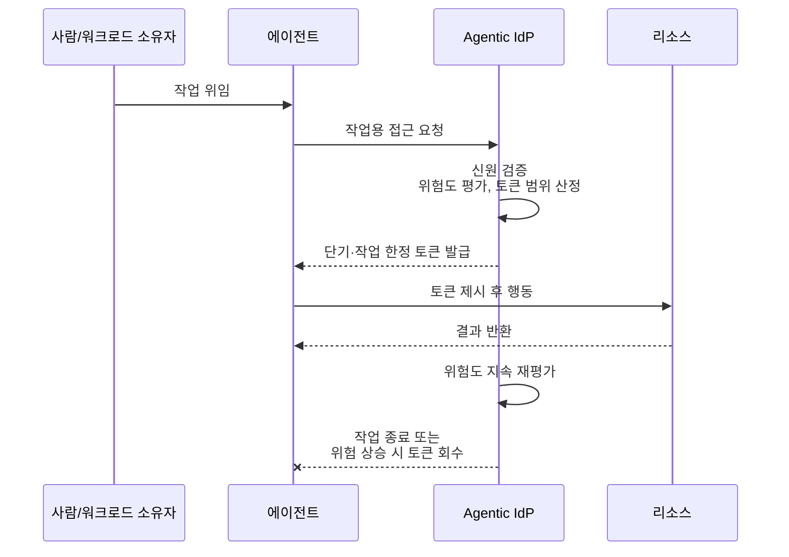

## 초록

이번 주기에 나온 소식은 세 건이고, 세 건 모두 같은 질문을 다룬다. 이미 접근 권한을 가진 에이전트에게 그 권한으로 무엇을 하도록 둘 것인가. OpenAI의 Astra는 일반적인 사고 과정보다 흔적이 훨씬 옅게 남는 방식으로 추론한다고 알려졌고, 안전 연구자들은 이를 아무도 읽을 수 없는 추론으로 가는 첫걸음이라 부른다. 크라우드스트라이크는 에이전트 전용 신원 공급자를 내놓았는데, 상시 자격 증명 대신 수명이 짧고 범위가 좁은 토큰만 발급한다. 인도 결제 당국은 사용자가 매번 승인하지 않아도 에이전트가 UPI로 돈을 쓸 수 있게 하는 규약을 준비 중이라고 보도됐다. 무엇이 에이전트로 인정받는지는 아무것도 정리되지 않았다. 인정받은 에이전트가 무엇을 생각하고, 어디까지 손대고, 얼마를 쓸 수 있는지만 다투는 중이다.

## 서론

이번 `ai-agent-brief` 시리즈는 이 하니스의 상시 브리프 규칙에 따라 **2026년 8월 31일부터 9월 3일까지**(72시간)를 다룬다. 고정 주제는 에이전트 프레임워크와 개발자 도구, 에이전트 간·에이전트-가맹점 간 결제 레일과 프로토콜(x402, AP2, ACP, UCP, MPP, L402, Trusted Agent Protocol 및 후속 규격), 카드사와 PSP의 에이전트 커머스 상품, 에이전트 신원과 인가, 그리고 이 모든 것을 떠받치는 표준화 기구다.

[직전 브리프](../ai-agent-brief-2026-09-02/)는 앤트로픽 Claude Fable 5.1 가격 정책, OpenAI의 "Path to Astra" 안전장치, 클라우드플레어의 Adaptive Intelligence, 단일 벤더의 x402 데이터 출시를 다뤘다. 아래 OpenAI 항목은 그 뒤를 잇는다. "Path to Astra" 자체에는 없던 기술적 세부사항 하나가 이후 독립 보도로 드러났다. 이 브리프가 전제로 삼는 결제 프로토콜 지형과 에이전트 신원 모델에 관해서는 사이트의 장문 리포트인 [Agentic Commerce Protocol](../agent-commerce-protocol/), [x402 결제 스킴](../x402-payment-schemes/), [에이전트 신원: EAS 대 DID](../ai-agent-identity-eas-vs-did/)를 참고하라.

## 무엇이 움직였나

### Astra, 읽기 힘든 순환 추론을 쓴다는 보도에 안전 연구자들 반발

TechCrunch와 Dealroom은 각각 2026년 9월 1일과 2일, 모두 The Information의 취재를 인용해 OpenAI의 차기 모델 Astra가 연구자들이 "불투명한 순환(opaque recurrence)" 또는 "recurrent depth"라 부르는 기법을 쓴다고 전했다. 선형적인 사고 과정을 글로 풀어내는 대신, 같은 질의를 레이어에 반복해서 통과시키는 방식이다 [^s01] [^s02]. TechCrunch는 그 효과를 직접적으로 서술한다. "흔적을 더 적게 남겨, 통상적인 사고 과정 기록을 사실상 우회한다" [^s01].

실명을 밝힌 연구자 세 명이 우려를 표했다. 레드우드 리서치 CEO 벅 슐레게리스는 "Astra가 불투명한 순환을 쓴다는 보도에 극도로 우려한다"고 썼다. 레드우드의 수석 과학자 라이언 그린블랫은 자신이 걱정하는 경로를 구체적으로 짚었다. "여기서 자연스럽게 이어질 다음 단계는, 모델이 거의 전적으로 잠재 공간에서만 추론하는 지점까지 이 불투명한 추론을 확장하는 것"이라고 말했다. AI 안전 논평가 즈비 모샤위츠는 이를 "OpenAI와 앤트로픽이 지켜온 금기를 건드리는, 불장난"이라 표현했다 [^s01]. OpenAI 쪽 입장은 그 금기가 깨지지 않았다는 것이다. 회사는 Astra가 "감시에 충분할 만큼 읽을 수 있는 추론을 유지하며, 추가 탐지 장치와 함께 출시될 것"이라고 밝혔다 [^s02].

불투명한 순환이라는 발상 자체는 새롭지 않다. 2024년 메타 FAIR 논문이 이미 모델의 은닉 상태를 다음 입력으로 되먹여, 사람이 읽을 수 없는 연속 잠재 공간에서 추론하도록 학습시킨 바 있다 [^s07]. 새로운 것은 프런티어 랩이 그 발상을 일반 출시용 모델에 그대로 얹었다는 점이다. 양쪽 다 제3자가 검증할 만한 자료는 내놓지 않았다. 지금 있는 것은 하나의 취재 계통(The Information, TechCrunch와 Dealroom이 재전달)과 그에 맞선 벤더 측의 확언 하나뿐이며, 둘 사이의 불일치가 바로 핵심 쟁점이다. 모든 프런티어 랩이 스키밍이나 기만적 모델을 잡아낼 장치로 내세우는 사고 과정 감시가, 이 정도 규모로 배치된 뒤에도 여전히 통하는가 하는 질문이다 _(unverified — single source)_.

### 크라우드스트라이크, 상시 자격 증명을 아예 발급하지 않는 에이전트 전용 신원 공급자를 내놓다

크라우드스트라이크는 2026년 9월 2일 Fal.Con 2026에서 Agentic Identity Provider(Agentic IdP)를 발표했다. 온라인에 오르는 모든 에이전트를 등록하는 디렉터리이며, "복제하거나 도용할 수 없는" 암호학적 검증 신원이 없는 에이전트에게는 어떤 인가도 내주지 않는다 [^s03]. 이 장치는 일부러 일반적인 신원 공급자보다 좁게 설계됐다. 에이전트에게는 상시 자격 증명을 아예 주지 않고, 모든 접근 요청을 "작업당 필요한 최소 권한을, 필요한 최소 시간만큼" 범위를 좁힌 토큰으로 중개한다. 크라우드스트라이크는 모든 행동이 그 에이전트를 대신 움직이는 사람이나 시스템으로 추적된다고 말한다 [^s03].

_그림 1 — 크라우드스트라이크의 Agentic IdP는 상시 자격 증명을 발급하지 않는다. 모든 행동은 매번 새로 발급되고, 좁게 범위가 정해지고, 회수 가능하며, 그 에이전트 뒤의 사람이나 워크로드로 추적되는 토큰으로 이뤄진다 [^s03]._

SiliconANGLE의 독립 보도는 크라우드스트라이크 자료에는 없는 단서를 하나 붙였다. "세 발표 모두 정식 출시일이 없어, 고객이 아직 이 기능들을 도입할 수 없다" [^s04]. 기업 내 모든 에이전트를 등록하는 디렉터리에, 설계상 만료되는 토큰을 얹은 것은 상시 권한 남용에 대한 실질적인 답이다. 다만 지금 시점에는 아직 아무도 실행해 볼 수 없는, 출시되지 않은 제품이기도 하다.

### 인도 결제 당국, 자율 에이전트를 위한 UPI 규약을 준비 중이라는 보도

로이터 취재를 Inc42와 The Deep Dive가 전한 바에 따르면, 인도 국가결제공사(NPCI)는 2026년 9월 1일 기준으로 "통합 에이전트 프로토콜(Unified Agent Protocol)"을 준비 중이다. 사용자가 정해둔 지출 한도 안에서, 매번 승인하지 않아도 AI 에이전트가 주간 장보기 같은 소액 UPI 결제를 대신 실행하도록 위임하는 방식이다 [^s05] [^s06]. 이미 있는 UPI 인프라인 UPI Circle과 Reserve Pay 위에 신원 확인과 감사 기록을 얹는 구조이며, NPCI는 뭄바이 Global Fintech Fest에서 이를 공개할 계획이라고 보도됐다 [^s05].

Inc42가 물었을 때 NPCI는 답변을 거부했다 [^s05]. 이 소식을 전한 매체는 이 글이 인용한 두 곳을 포함해 모두 계획을 아는 관계자를 인용한 같은 로이터 보도를 따라간다. 즉 여러 매체명을 달고 있을 뿐 하나의 취재원에서 나온 이야기이지, 독립적으로 확인된 사실은 아니다 _(unverified — single source)_ _(early signal)_. 앞서 나온 인도 현지 보도에 따르면 이 프로토콜은 출시 전 인도중앙은행(RBI)의 규제 승인을 받아야 한다 [^s08]. 콘퍼런스에서 공개한다고 해서 이 절차까지 끝나는 것은 아니다. 보도된 대로 나온다면, 카드사도 x402 같은 크립토 정산 프로토콜도 아닌 국가 결제 레일이 에이전트 위임을 자기 인프라 안에 직접 심는 사례가 된다. AP2, ACP, Trusted Agent Protocol 어느 쪽도 아직 시도하지 않은 방식이다.

## 왜 중요한가

세 소식을 나란히 놓고 보면 같은 층위를 다루지는 않지만, 같은 질문을 다룬다. 이미 들어와 있는 에이전트, 즉 학습이 끝나고 배치돼 권한까지 위임받은 에이전트에게 그다음 무엇을 허용할 것인가라는 질문이다. OpenAI를 둘러싼 다툼은 에이전트의 추론 자체를 여전히 들여다볼 수 있는가에 있다. 크라우드스트라이크의 제품은 이미 신원을 가진 에이전트가 무엇을 얼마나 오래 건드릴 수 있는가에 있다. NPCI의 계획은 누군가 들여다보기 전까지 에이전트가 사용자 돈을 얼마나 움직일 수 있는가에 있다. 셋 중 무엇도 에이전트가 무엇인지부터 정리할 필요는 없다. 셋 다 그 질문은 이미 충분히 정리됐다고 전제하고, 그다음 단계를 규율하려 한다.

## 지켜볼 신호

- OpenAI가 확인해주지 않은 취재 계통에 맡겨두는 대신, Astra의 추론 구조에 관해 자기 목소리로 무언가를 내놓는지.
- 크라우드스트라이크 Agentic IdP의 정식 출시일, 그리고 Identiverse 2026에서 나온 기존 Continuous Identity 기능과 가격이나 범위가 어떻게 다른지.
- NPCI가 실제로 Global Fintech Fest에서 통합 에이전트 프로토콜을 공개하는지, 공개된 규격이 지금까지 보도된 메커니즘과 맞아떨어지는지.
- 인도의 방식을 따라가는 두 번째 국가 결제 기관. 한 나라만으로는 아직 흐름이라 부르기 어렵다.

## 한계

이 브리프는 72시간 창을 다루므로, 2026년 8월 31일 직전에 터졌거나 9월 3일 이후 드러난 소식은 설계상 범위 밖이다. GitHub 레인에서는 에이전트 SDK와 프레임워크(openai-agents-python, claude-agent-sdk-python, langchain)의 통상적인 패치 릴리스만 확인됐고, 이 창 안에서 x402·AP2·ACP·MCP 스펙 저장소의 움직임은 없었다. Bluesky와 Reddit 레인은 이 환경에 자격 증명이 설정돼 있지 않아 실행되지 않았다. X/Twitter는 이 하니스 규약상 수집 대상이 아니다. 이 브리프의 세 소식 중 둘, 즉 Astra의 추론 기법과 NPCI 프로토콜은 각각 단일 취재 계통에 기대고 있고 OpenAI나 NPCI 어느 쪽의 공식 확인도 없다. 그런데도 이 창을 실제보다 조용했던 것처럼 보이게 만드느니, 그 유보 조건을 붙인 채로 두 소식 모두 싣는 쪽을 택했다.
