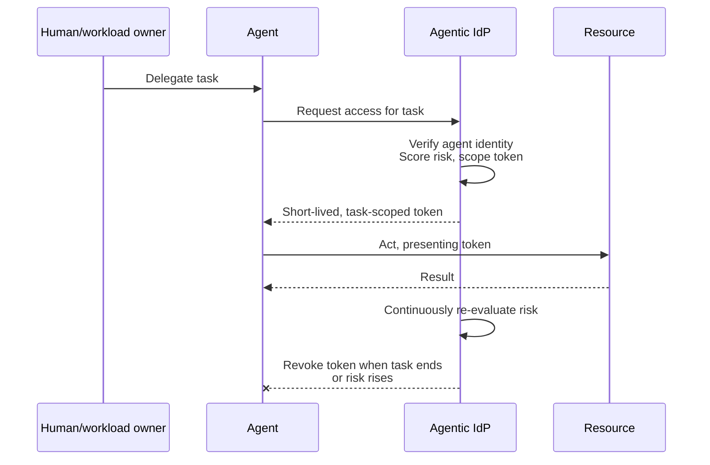

## Abstract

Three items this window, and all three are arguments about what an agent that already has access is allowed to do with it. OpenAI's Astra reportedly reasons in a loop that leaves a thinner paper trail than a normal chain of thought, and safety researchers are calling that a step toward reasoning nobody can read. CrowdStrike shipped an identity provider built only for agents, brokering short-lived, narrowly scoped tokens instead of standing credentials. India's payments authority is reportedly drafting a protocol that would let an agent spend a user's money on UPI without asking every time. None of it settles who counts as an agent. All of it is about what a counted agent can think, touch, or spend.

## Introduction

This edition of the `ai-agent-brief` series covers **2026-08-31 through 2026-09-03** (72 hours), per this harness's standing-brief protocol. The standing beat: agent frameworks and developer tooling; agent-to-agent and agent-to-merchant payment rails and protocols (x402, AP2, ACP, UCP, MPP, L402, Trusted Agent Protocol and successors); the card networks' and PSPs' agent-commerce products; agent identity and authorization; and the standards bodies behind all of it.

The [previous brief](../ai-agent-brief-2026-09-02/) covered Anthropic's Claude Fable 5.1 pricing, OpenAI's "Path to Astra" safeguards, Cloudflare's Adaptive Intelligence, and a single-vendor x402 data launch. The OpenAI item below picks up where that one left off: independent reporting has now surfaced a technical detail — opaque recurrence — that "Path to Astra" itself did not name. For background on the payment-protocol landscape and agent identity models this brief assumes, see the site's longer reports on [the Agentic Commerce Protocol](../agent-commerce-protocol/), [x402 payment schemes](../x402-payment-schemes/), and [agent identity: EAS vs. DID](../ai-agent-identity-eas-vs-did/).

## What moved

### Astra reportedly reasons in an unreadable loop, and safety researchers are alarmed

TechCrunch and Dealroom, both citing reporting from The Information, said on 2026-09-01 and 2026-09-02 that OpenAI's forthcoming Astra model uses a technique researchers are calling "opaque recurrence" or "recurrent depth": rather than writing out a linear chain of thought, the model runs the same query through its layers repeatedly in a loop [^s01] [^s02]. TechCrunch describes the effect directly: it "leaves fewer legible traces, effectively side-stepping a conventional chain-of-thought record" [^s01].

Three named researchers went on the record with concern. Redwood Research CEO Buck Shlegeris: "I am extremely concerned by the reporting that Astra uses opaque recurrence." Redwood chief scientist Ryan Greenblatt named the trajectory that worries him: "a natural progression from here would involve scaling up the opaque reasoning to the point where the model reasons entirely or almost entirely in latent space." AI safety commentator Zvi Mowshowitz called the move "playing with fire, risking a taboo that OpenAI and Anthropic have fought to establish" [^s01]. OpenAI's side of this is that the taboo holds: the company says Astra "preserves enough legible reasoning for monitoring and will ship with extra detection safeguards" [^s02].

The idea behind opaque recurrence is not itself new: a 2024 Meta FAIR paper already trained models to feed their own hidden state back in as the next input, reasoning in a continuous latent space no human can read [^s07]. What's new is a frontier lab shipping the idea in a model meant for general release. Neither OpenAI nor the researchers alarmed by it have published anything a third party can check: what exists is one reporting chain (The Information, relayed by TechCrunch and Dealroom) against one vendor assurance, and the disagreement between them is exactly the disagreement that matters — whether chain-of-thought monitoring, the mechanism every frontier lab currently points to as its check on a scheming or deceptive model, still applies once the technique is deployed at this scale _(unverified — single source)_.

### CrowdStrike builds agents an identity provider that never issues a standing credential

CrowdStrike announced its Agentic Identity Provider (Agentic IdP) at Fal.Con 2026 on 2026-09-02: a directory that registers every agent as it comes online and refuses to authorize any agent without a cryptographically verifiable identity that "cannot be spoofed or shared" [^s03]. The mechanism is narrower than a normal identity provider on purpose. Agents get no standing credentials at all; every access request is brokered as "tokens scoped to the minimum access, for the minimum time, required for each task," and CrowdStrike says every action ties back to the human or system the agent is acting for [^s03].

_Figure 1 — CrowdStrike's Agentic IdP issues no standing credentials: every action is a fresh, narrowly scoped, revocable token traced back to the human or workload behind the agent [^s03]._

SiliconANGLE's independent coverage adds the caveat CrowdStrike's own materials don't: "None of the three announcements carried general availability dates, meaning customers cannot yet adopt these capabilities" [^s04]. A directory of every agent in an enterprise, with tokens that expire by design, is a real answer to standing-privilege sprawl. It is also, for now, unreleased: no customer can run it yet.

### India's payments authority is reportedly drafting UPI rules for autonomous agents

Reuters reporting relayed by Inc42 and The Deep Dive said on 2026-09-01 that India's National Payments Corporation of India is preparing a "Unified Agent Protocol" that would let a user delegate an AI agent to make small UPI payments, such as a weekly grocery order, within a preset spending limit and without approving each transaction [^s05] [^s06]. The mechanism would run on UPI infrastructure that already exists — UPI Circle and Reserve Pay — layered with identity checks and audit trails, and NPCI is reportedly planning to unveil it at the Global Fintech Fest in Mumbai [^s05].

NPCI declined to comment when Inc42 asked [^s05]. Every outlet covering this, including the two cited here, traces back to the same Reuters report citing people familiar with the plans, so this is one sourcing chain wearing several bylines, not independent confirmation _(unverified — single source)_ _(early signal)_. Earlier Indian coverage of the same protocol reported that it requires regulatory approval from the Reserve Bank of India before launch [^s08], a step a conference unveiling would not itself clear. If it ships as described, it would be a national payment rail — not a card network or a crypto-settled protocol like x402 — building agent delegation directly into its own infrastructure, which none of AP2, ACP, or Trusted Agent Protocol currently attempt.

## Why it matters

Read next to each other, these three items are not about the same layer, but they are about the same question: an agent that has already been let in — trained, deployed, delegated to — and what it is allowed to do from there. OpenAI's dispute is over whether an agent's own reasoning can still be watched. CrowdStrike's product is over what an agent already holding an identity is allowed to touch, and for how long. NPCI's plan is over how much of a user's money an agent can move before someone has to look. None of the three needs to resolve what an agent is; all three assume that question is already settled enough to regulate what happens next.

## Signals to watch

- OpenAI publishing anything about Astra's reasoning architecture in its own words, instead of leaving it to a reporting chain it has not confirmed on the record.
- A general-availability date for CrowdStrike's Agentic IdP, and whether it is priced or scoped differently from the company's earlier Continuous Identity capability from Identiverse 2026.
- Whether NPCI actually unveils the Unified Agent Protocol at Global Fintech Fest, and whether the published spec matches the mechanics reported here.
- A second national payments body following India's approach. One country is not yet a pattern.

## Limitations

This brief covers a 72-hour window, so a story that broke just before 2026-08-31 or surfaces after 2026-09-03 is out of scope by design. The GitHub lane found only routine patch releases for agent SDKs and frameworks (openai-agents-python, claude-agent-sdk-python, langchain) and no spec-repo activity for x402, AP2, ACP, or MCP inside the window. The Bluesky and Reddit lanes had no credentials configured in this environment and did not run; X/Twitter is out of scope per this harness's protocol. Two of the three items here — the Astra reasoning technique and the NPCI protocol — rest on a single reporting chain each, with no on-the-record confirmation from OpenAI or NPCI respectively; this brief keeps both in, with that caveat attached, rather than leaving the window looking quieter than it was.
