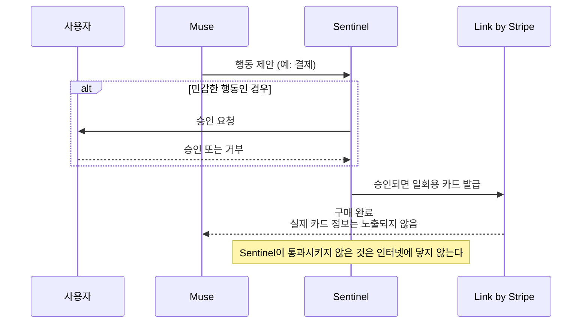

## 초록

메타가 이번 주 소비자용 AI 에이전트에 결제 수단을 쥐여주면서, 승인 절차를 아예 구조에 박아 넣었다. Muse는 쇼핑하고 결제까지 할 수 있지만, 무언가 기기를 벗어나기 전에 별도 프로세스가 먼저 허락해야 한다. 구글 위협 인텔리전스 팀은 그 경계가 왜 필요한지 정반대 사례로 보여줬다. 한 범죄 조직이 아무 검증 없이 멀티 에이전트 파이프라인을 돌려 여섯 시간도 안 되는 사이에 수천 개의 자격 증명을 훔쳐냈다. 두 사건 사이에는 더 조용한 발전도 하나 있었다. 스트라이프와 템포의 Machine Payments Protocol(MPP) 명세에 네 번째 결제 레일이 추가됐고, 새로 나온 형식 검증 논문은 주요 에이전트 결제 프로토콜 네 개 모두 여러 참여자와 단계를 넘나드는 거래에서 권한 위임의 일관성을 보장하지 못한다는 사실을 밝혀냈다.

## 서론

이번 `ai-agent-brief` 시리즈는 이 하니스의 상시 브리프 프로토콜에 따라 **2026년 9월 6일부터 9일까지** 72시간을 다룬다. 상시 추적 주제는 에이전트 프레임워크와 개발자 도구, 에이전트 간·에이전트-가맹점 간 결제 레일과 프로토콜(x402, AP2, ACP, UCP, MPP, L402, Trusted Agent Protocol과 그 후속작들), 카드 네트워크와 PSP의 에이전트 커머스 상품, 에이전트 신원과 권한 부여, 그리고 그 배후의 표준 기구들이다.

[이전 브리프](../ai-agent-brief-2026-09-05/)는 EMVCo의 초안 Intent Services 계층, 앤스로픽의 커머스 에이전트 청사진, DseWiki 공개 사건을 다뤘다. 이 창구에서는 그중 어느 것도 더 진전되지 않았다 — EMVCo의 의견 수렴 기간은 2026년 9월 30일까지고, 오픈AI가 약속한 공개 프레임워크는 아직 발표된 문서가 없다. 이 브리프가 전제하는 프로토콜 배경은 사이트의 [Machine Payments Protocol](../mpp-machine-payments-protocol/), [x402](../x402-protocol/), [에이전트 신원: EAS 대 DID](../ai-agent-identity-eas-vs-did/) 리포트를 참고하라.

## 무엇이 움직였나

### 메타, 결제 가능한 소비자 에이전트를 내놓으며 승인 관문을 기계 안에 박아 넣다

메타는 2026년 9월 8일 Muse를 출시했다. 웹, iOS, 안드로이드, 왓츠앱에서 미국 사용자에게 제공되는 개인용 AI 에이전트로, 이메일과 캘린더, 쇼핑 계정에 연결해 여행 예약, 서류 작성, 물건 구매 같은 작업을 처리한다[^s01]. 결제 구조는 구체적이다. 결제는 Link by Stripe를 거치며, 메타는 Muse가 Link의 구매 보호를 받는 첫 에이전트라고 밝혔다. 파손·분실 상품 보상, 가격 하락 보상, 무료 반품이 대상 구매 건에 적용된다[^s01]. Muse는 실제 카드를 아예 넘겨받지 않는다. "Link의 에이전트용 지갑이 일회용 카드를 발급해 실제 카드 정보는 노출되지 않는다"[^s01].

더 흥미로운 설계 선택은 그 관문을 어디에 두었는가다. Muse는 자체 클라우드 가상 머신 안에서 작동하고, Sentinel이라는 별도 프로세스가 그 옆에서 함께 돈다. "Muse가 하는 어떤 행동도 Sentinel의 승인 없이는 인터넷에 닿지 않으며, 필요하면 사용자에게 직접 허락을 구한다"[^s01]. 이 시리즈 내내 추상적으로만 논의되던 질문에 대한 구조적 답변인 셈이다: 첫 프로세스가 행동하기 전에 확인하는 것만을 임무로 삼는, 계속 실행되는 별도 프로세스다.

_그림 1 — Muse는 스스로 네트워크나 결제 수단에 접근할 수 없다. 민감하든 아니든 모든 외부 행동은 먼저 Sentinel을 거치며, 사람이 개입해야 할지 판단하는 것도 Sentinel의 몫이다[^s01]._

테크크런치는 이번 출시의 진짜 시험대가 기술보다 평판이라고 짚었다. 메타는 180억 달러 규모의 아동 안전 관련 합의금을 물었던 회사이고, 그런 회사에 이메일과 결제 수단 접근권을 맡기라고 요청하는 셈이다. 아무리 정교한 구조라도 사람들이 그 구조를 운영하는 회사를 신뢰하지 않으면 의미가 없다[^s02]. 다만 메타는 검증 없이 신뢰만 요구하지는 않았다. 출시와 함께 공개 버그 바운티를 열어 유효한 제보에 최대 30만 달러, 실제로 작동하는 프롬프트 인젝션 공격에는 최대 13만 달러를 걸었고, 외부 감사자에게 설계와 소스코드 공개를 시작했으며 시스템이 정식 가동되면 누구나 들여다볼 수 있는 상시 감사를 예고했다[^s07]. 메타 바깥의 누군가가 Sentinel을 실제로 깨보도록 초대한 셈이지만, 출시 첫날 시점에서는 그것이 이미 끝난 감사와 같은 것은 아니다.

### 구글, 승인 관문이 전혀 없던 공격을 문서화하다

구글 위협 인텔리전스 그룹(GTIG)은 2026년 9월 8일 최신 AI 위협 추적 보고서를 냈다. 핵심은 타임라인이다. 2026년 2분기의 한 침해 사건에서, 금전적 동기를 가진 공격자가 조직의 클라우드 환경을 뚫은 뒤 AI 코딩 어시스턴트와 미리 짜둔 에이전트 지시문 세트를 이용해 대규모 자격 증명 탈취 작전을 기획·구축·실행했다. 사람의 개입 없이 여섯 시간도 안 되는 사이에 수천 개의 제3자 자격 증명을 확보했다[^s03][^s04]. 에이전트들은 취약점 스캔을 스스로 관리하고 실패가 나면 실시간으로 대응책을 조정했는데, 예전 같으면 터미널을 지켜보는 사람이 있어야 가능했던 종류의 적응 행동이다.

GTIG는 주장의 경계를 신중하게 긋는다. 이것은 고속의 도구 오케스트레이션이지 자율적 취약점 발굴이 아니라는 것이다. 보고서는 사람이 어느 단계에도 개입하지 않은 채 실제 표적을 대상으로 제로데이를 찾아 공격까지 완결하는 파이프라인은 아직 관측되지 않았다고 분명히 밝힌다[^s03]. 이 구분은 얼마나 경각심을 가져야 하는가의 문제에서는 중요하지만, 방어자 입장에서 실무적 사실은 달라지지 않는다. 최초 침해부터 대규모 자격 증명 탈취까지 여섯 시간이라는 시간 창은 대부분의 사고 대응 프로세스가 감지하도록 설계된 속도보다 빠르다.

### Machine Payments Protocol에 XRPL이 추가되고, 새 논문이 프로토콜 전반의 권한 부여 허점을 찾아내다

헤드라인 뒤편에서는 같은 신경을 건드리는 작은 사건이 두 건 있었다. 스트라이프와 템포의 Machine Payments Protocol은 2026년 9월 8일 XRPL을 결제 수단으로 등록하는 명세 변경을 병합했다. 단발성 거래를 처리하는 "charge" 모드와, 반복 소액결제마다 원장에 다시 접속할 필요 없는 오프체인 "session" 결제 채널 모드를 함께 담았다[^s05]. 보도자료도 발표도 없는, 겉보기엔 평범한 명세 PR이다. 하지만 여섯 달 뒤 에이전트가 실제로 어느 레일에서 결제를 확정할 수 있는지를 결정짓는 종류의 변경이며, 이번 주에는 독립적인 보도가 전혀 없었다. 다른 곳에서 확인되기 전까지는 사업자·명세 출처로만 취급해야 한다.

다른 하나는 학술 연구이고, 이번 주 다른 뉴스들과 시기가 절묘하게 겹친다. 연구진은 x402, MPP, ACP, AP2를 Tamarin으로 형식화해 86개 검증 사례를 돌렸고, 이전에 문서화되지 않은 일관성 허점 40건을 찾아냈다. 거래가 여러 참여자와 단계를 넘나드는 동안 프로토콜 문서가 위임된 권한의 유효성을 실제로는 보장하지 않는 경우들이다[^s06]. x402 관련 발견 열 건은 실제 구현체를 대상으로도 검증됐다. 논문이 실사용 중인 취약점을 지목하지는 않았고, 이 브리프에서 그 심각도를 따로 분류하지도 않았지만, 결론만큼은 이번 주 다른 사건들과 맞닿아 있다. 서류상 탄탄해 보이는 권한 부여 구조에도, 아직 아무도 시험해보지 않은 허점이 남아 있을 수 있다는 것이다.

## 왜 중요한가

Muse와 GTIG 보고서는 같은 질문에 대한 두 개의 답이다. 메타는 실제로 작동하는 검문소를 만들었다. 계속 실행되면서 오직 거부할지 말지만 판단하는 별도 프로세스다. 자격 증명 탈취 공격이 성공한 이유는 정확히 그 역할을 맡은 무언가가 없었기 때문이다. 감독 프로세스도, 작동한 속도 제한도, 다음 단계로 넘어가기 전에 스캔 결과를 검토하는 사람도 없었다. 그리고 Tamarin 논문은 그런 검문소가 존재한다 해도 당연시할 게 아니라 검증해야 한다는 사실을 일깨운다. 이 정도로 철저하게 형식 검증을 받은 것은 처음인 상용 프로토콜 네 개에서 아무도 문서화하지 않았던 허점이 마흔 개나 나왔다. 이번 주의 세 사건은 서로가 있어야 성립하는 이야기가 아니다. 그럼에도 함께 나왔다는 사실은, 업계가 실시간 권한 검증 경계가 필요한지를 논쟁하는 단계를 지나, 실제로 버텨내는 경계를 만드는 더 어렵고 느린 작업으로 넘어갔다는 뜻이다.

## 지켜볼 신호들

- 메타의 13만 달러 프롬프트 인젝션 버그 바운티가 실제로 지급되는지, 지급된다면 Sentinel의 경계가 어디서 뚫리는지.
- GTIG가 밝힌 여섯 시간짜리 자격 증명 탈취 사건의 배후, 현재는 특정되지 않았다.
- 어느 지갑이나 에이전트 프레임워크든 MPP의 새 `xrpl` 결제 수단을 실제로 지원해, 명세 병합을 실사용 기능으로 바꾸는지.
- Tamarin 논문이 찾아낸 40건 중 x402, MPP, ACP, AP2 유지 관리자들이 인정하거나 패치하는 항목이 나오는지.
- NPCI의 Unified Agent Protocol. 글로벌 핀테크 페스트가 9월 11일까지 이어지는데도 이 브리프 시점까지 공식 발표되지 않아, 두 번째로 이월한다.

## 한계

이 브리프는 72시간 창을 다루므로, 2026년 9월 6일 직전이나 9일 이후의 사건은 설계상 범위 밖이다. Muse의 Sentinel 경계와 Secure VM 격리에 대한 주장은 메타의 자체 발표에 근거하며, 이 아키텍처에 대한 독립적 검증은 아직 나오지 않았다. GTIG의 공격 타임라인과 탈취 규모는 구글 자체 텔레메트리에서 나온 수치이고, 같은 침해 사건을 다른 관점에서 확인해줄 자료는 없다. 블루스카이와 레딧 레인은 환경 변수 자체는 존재했지만 값이 비어 있어 이번 주기에는 작동하지 않았다. 이 머신의 설정 문제로 판단해 `working/gaps.md`에 기록했다. 깃허브 레인은 x402, AP2, A2A 명세 저장소에서 이 기간 내 활동을 찾지 못했다. MPP 명세 저장소만 예외였다.
