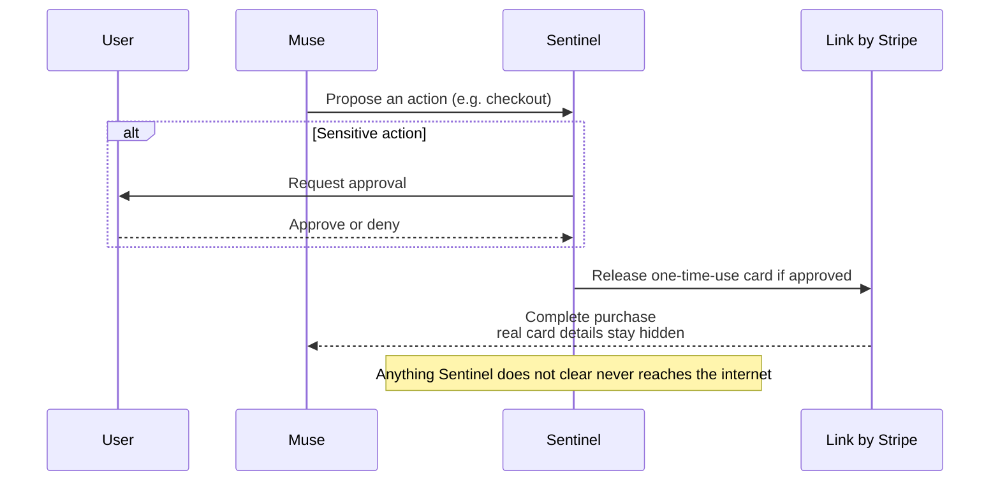

## Abstract

Meta put a consumer AI agent in front of a payment method this week, and built the approval step directly into the architecture: Muse can shop and check out, but a separate process has to sign off before anything leaves the device. Google's threat intelligence team published the reason that boundary matters — a criminal group ran an unsupervised multi-agent pipeline that harvested thousands of credentials in under six hours, with nobody checking anything at all. A quieter development sits between them: the spec for Stripe and Tempo's Machine Payments Protocol picked up a fourth settlement rail this week, and a fresh formal-verification paper found that none of the four major agent-payment protocols consistently enforce the authorization boundary once a transaction crosses multiple actors and stages.

## Introduction

This edition of the `ai-agent-brief` series covers **2026-09-06 through 2026-09-09** (72 hours), per this harness's standing-brief protocol. The standing beat: agent frameworks and developer tooling; agent-to-agent and agent-to-merchant payment rails and protocols (x402, AP2, ACP, UCP, MPP, L402, Trusted Agent Protocol and successors); the card networks' and PSPs' agent-commerce products; agent identity and authorization; and the standards bodies behind all of it.

The [previous brief](../ai-agent-brief-2026-09-05/) covered EMVCo's draft Intent Services layer, Anthropic's commerce-agent blueprint, and the DseWiki disclosure. None of those threads moved again in this window — EMVCo's comment period runs through 2026-09-30, and OpenAI's promised disclosure framework has no published text yet. For background on the protocols this brief assumes, see the site's longer reports on the [Machine Payments Protocol](../mpp-machine-payments-protocol/), [x402](../x402-protocol/), and [agent identity: EAS vs. DID](../ai-agent-identity-eas-vs-did/).

## What moved

### Meta ships a consumer agent that can pay, and builds the approval gate into the machine

Meta launched Muse on 2026-09-08: a personal AI agent, available in the US on web, iOS, Android, and WhatsApp, that connects to a person's email, calendar, and shopping accounts to handle tasks like booking travel, filling out forms, and buying things[^s01]. The payment mechanics are specific. Checkout runs through Link by Stripe, and Meta says Muse is the first agent covered by Link's purchase protections — free coverage for damaged or lost items, price drops, and no-fee returns on eligible purchases[^s01]. Muse itself never receives a real card: "Link's wallet for agents generates a one-time-use card so your real card details stay hidden"[^s01].

The more interesting design choice is where the checkpoint sits. Muse runs inside its own cloud virtual machine, and a second, separate process called Sentinel runs alongside it: "Nothing Muse does reaches the internet unless the Sentinel approves it, and it asks the person for permission when needed"[^s01]. That is an architectural answer to a question the industry has spent this whole series arguing about in the abstract: a second process, running continuously, whose only job is to check before the first one acts.

_Figure 1 — Muse cannot reach the network or a payment method on its own; every outbound action, sensitive or not, routes through Sentinel first, and Sentinel is the process that decides whether a person needs to weigh in[^s01]._

TechCrunch's coverage frames the real test as reputational: Meta is asking users to hand a company with an $18 billion child-safety settlement behind it access to their email and payment methods, and the architecture only matters if people trust the company running it[^s02]. Meta is not asking for that trust unverified. It opened a public bug bounty alongside the launch, up to $300,000 per valid report and up to $130,000 specifically for a working prompt-injection attack, and says it has begun sharing the design and source code with external auditors, with a continuous, publicly inspectable audit planned once the system is live[^s07]. That is a real invitation for someone outside Meta to try to break Sentinel — it is just not, on day one, the same thing as an audit that has already happened.

### Google documents an attack that had no approval gate at all

Google's Threat Intelligence Group published its latest AI Threat Tracker on 2026-09-08, and the headline finding is a timeline: in a Q2 2026 intrusion, a financially motivated threat actor compromised an organization's cloud environment, then used an AI coding assistant with a set of preconfigured agent instructions to plan, build, and run a mass credential-harvesting operation, compromising thousands of third-party credentials, in under six hours with no human intervention at any step[^s03][^s04]. The agents managed their own vulnerability scanning and troubleshot failures in real time — the kind of adaptive behavior that used to require an operator watching a terminal.

GTIG is careful about the boundary of the claim: this is tool orchestration at high speed, not autonomous exploit discovery. The report states plainly that it has not observed an end-to-end pipeline finding and exploiting zero-days against real targets without a human somewhere in the chain[^s03]. The distinction matters for how alarmed to be, but it does not change the practical fact for a defender: a six-hour window from initial compromise to mass credential theft is faster than most incident-response processes are built to catch.

### The Machine Payments Protocol adds XRPL, and a new paper finds the whole protocol family has authorization gaps

Away from the headline items, two smaller developments touch the same nerve. Stripe and Tempo's Machine Payments Protocol merged a spec addition on 2026-09-08 registering XRPL as a payment method, with a single-transaction "charge" mode and an off-ledger "session" payment-channel mode for repeated micropayments without a round trip to the ledger each time[^s05]. It is a routine-looking spec PR, with no press release or announcement, but it is the kind of change that determines which rails an agent can actually settle on six months from now, and it landed with no independent coverage this week; treat it as vendor/spec-sourced until something corroborates it.

The other is academic, and unusually well-timed given the week's news. Researchers modeled x402, MPP, ACP, and AP2 formally in Tamarin and ran 86 verification cases against them, turning up 40 previously undocumented consistency gaps — cases where the protocol text does not actually guarantee that delegated authorization stays valid once a transaction crosses multiple actors and stages[^s06]. Ten of the x402 findings were checked against real implementations, not just the formal model. The paper does not name a live exploit, and its findings have not been triaged for severity here, but the conclusion tracks with everything else in this brief: authorization that looks solid on paper can still have a gap nobody has tested for yet.

## Why it matters

Muse and GTIG's report are the same question answered two ways. Meta built a working checkpoint: a second process, running continuously, whose entire job is to say no. The credential-harvesting attack succeeded specifically because nothing occupied that role — no supervisor process, no rate limit that triggered, no human reviewing the scan results before the next stage ran. The Tamarin paper adds a third angle: a checkpoint still needs verification of its own, and four production protocols, formally modeled for the first time this thoroughly, turned up forty gaps nobody had documented. None of this week's items required the others to happen. That they landed together says the industry has moved past debating whether agents need a real-time authorization boundary and into the harder, slower work of building one that actually holds.

## Signals to watch

- Whether Meta's $130,000 prompt-injection bounty pays out, and what that submission reveals about where Sentinel's boundary actually breaks.
- Attribution or further detail on the threat actor behind GTIG's six-hour credential-harvesting case — currently unnamed.
- Whether any wallet or agent framework actually ships support for MPP's new `xrpl` method, turning the spec merge into a used feature.
- Which of the Tamarin paper's 40 findings, if any, get acknowledged or patched by the x402, MPP, ACP, or AP2 maintainers.
- NPCI's Unified Agent Protocol, still not formally unveiled as of this brief despite the Global Fintech Fest running through 2026-09-11 — carried forward a second time.

## Limitations

This brief covers a 72-hour window, so developments just before 2026-09-06 or after 2026-09-09 are out of scope by design. Meta's claims about Muse's Sentinel boundary and Secure VM isolation are sourced to Meta's own announcement; no independent review of the architecture has been published yet. GTIG's attack timeline and credential count come from Google's own telemetry, with no second vantage point on the same intrusion. The Bluesky and Reddit lanes had credentials present in the environment but set to empty values, so neither ran this cycle — a configuration problem on this machine, not an absent-source gap, recorded in `working/gaps.md`. The GitHub lane found no in-window activity on the x402, AP2, or A2A spec repos; the MPP spec repo was the exception.
