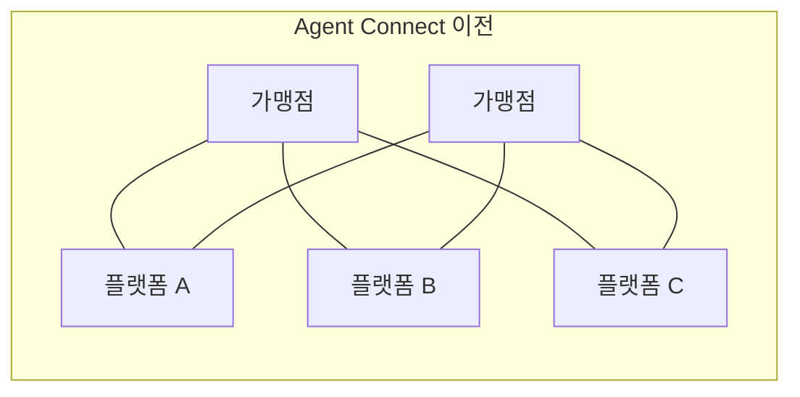
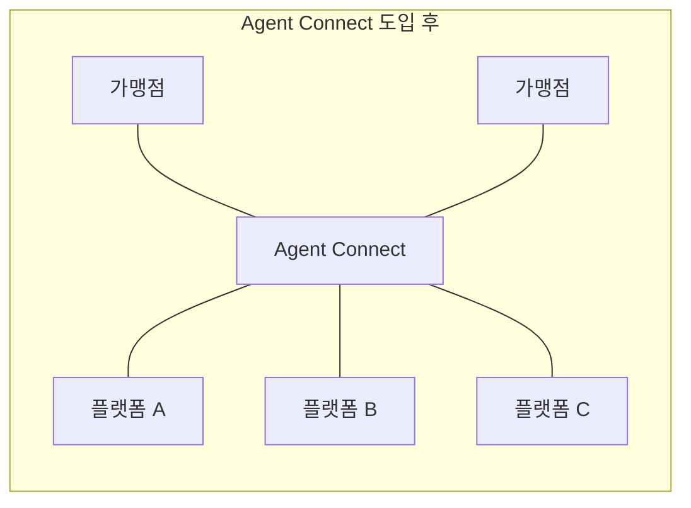

## 초록

이번 주기에 나온 세 가지 소식 중 결제 프로토콜은 하나도 없다. 마스터카드는 가맹점이 AI 쇼핑 플랫폼마다 따로 연동을 만들 필요가 없도록 단일 접점을 열었다. NPCI는 글로벌 핀테크 페스트에서 자체 에이전트 AI 플랫폼 두 개를 내놓았지만, 이 시리즈가 8월부터 추적해 온 '통합 에이전트 프로토콜'은 이번 브리프로 세 번째까지 확인되지 않았다. 그리고 세쿼이아는 "우리 회사 AI 에이전트가 실제로 어디까지 접근할 수 있는가"라는, 지금 대다수 기업이 답하지 못하는 질문에 답을 파는 스타트업에 3천만 달러를 걸었다. 세 소식을 관통하는 흐름은 같다. 에이전트가 시스템에 *접근*하기 위한 인프라가, 접근한 뒤 무엇을 하도록 *허가*할지에 대한 규칙보다 한참 앞서 도착하고 있다.

## 서론

이번 `ai-agent-brief` 시리즈는 하니스의 상시 브리프 규정에 따라 **2026년 9월 7일부터 9월 10일까지(72시간)**를 다룬다. 이 시리즈가 상시로 추적하는 주제는 에이전트 프레임워크와 개발자 도구, 에이전트 간·에이전트-가맹점 간 결제 레일과 프로토콜(x402, AP2, ACP, UCP, MPP, L402, Trusted Agent Protocol과 그 후속작들), 카드 네트워크와 PSP의 에이전트 커머스 제품, 에이전트 신원과 권한 부여, 그리고 이 모든 것을 뒷받침하는 표준화 기구다.

[직전 브리프](../ai-agent-brief-2026-09-09/)는 메타의 뮤즈 출시, 구글이 문서화한 6시간짜리 자격증명 탈취 사건, 그리고 주요 에이전트 결제 프로토콜 네 개에서 권한 부여 허점을 찾아낸 형식 검증 논문을 다뤘다. 이 세 갈래 모두 이번 창구 안에서는 새로운 진전이 없었다. 이 브리프가 전제로 삼는 배경지식은 사이트의 장문 리포트인 [Machine Payments Protocol](../mpp-machine-payments-protocol/), [x402](../x402-protocol/), [에이전트 신원: EAS 대 DID](../ai-agent-identity-eas-vs-did/)를 참고하라.

## 무엇이 움직였나

### 마스터카드, N개의 연동을 하나로 합치다

마스터카드는 2026년 9월 9일 Agent Connect를 출시했다. AI 쇼핑 에이전트가 참여 가맹점의 카탈로그를 검색하고 장바구니를 구성하고 고객이 승인한 결제까지 진행할 수 있는 단일 접점으로, 가맹점이 연결하려는 AI 플랫폼마다 별도 연동을 만들 필요를 없앤다[^s01][^s02]. 무엇을 노출할지는 가맹점이 계속 통제한다. 마스터카드는 이를 "상품 정보, 가격, 재고, 배송 옵션을... 모델과 플랫폼, 에이전트 경험 전반에 걸쳐 접근 가능하게 하면서도 그 정보가 어떻게 쓰이는지에 대한 통제권은 유지"하는 것이라고 설명한다[^s02]. 최고제품책임자 요른 램버트는 이 변화의 판돈을 직설적으로 표현했다. "AI 에이전트는 구매 인터페이스를 다시 한번 바꿀 것이다"[^s01]. 마스터카드의 대응은 각 AI 플랫폼이 가맹점마다 따로 조건을 협상하게 두는 대신, 그 변화의 한가운데에 스스로 자리 잡는 것이다.

_그림 1 — Agent Connect는 가맹점별·플랫폼별로 얽혀 있던 연동 구조를 양쪽이 한 번씩만 연결하면 되는 단일 허브로 바꾼다[^s01][^s02]._

이번 출시는 마스터카드의 기존 Agent Pay 토큰화, 그리고 앤트로픽 클로드 모델을 결합해 주문 추적·환불 같은 구매 후 지원까지 다루는 블루프린트와 함께 진행된다. 스트라이프, 코인베이스, 아디옌, 클라우드플레어를 포함한 30여 개 기업이 마스터카드의 전체 에이전트 결제 인프라를 뒷받침하는 것으로 이름을 올렸는데, 이는 이번 취재 범위에서 개별적으로 검증되지 않은 마스터카드 측 수치다 _(vendor-stated)_. 단일 접점은 가맹점 쪽 문제를 푸는 것이지, 그 자체로 구매자 쪽 문제까지 풀어주지는 않는다. 2026년 6월 체크아웃닷컴 설문에서는 응답자의 27%가 AI 쇼핑 에이전트를 맡길 만한 조직이 하나도 없다고 답했고, 위임 의향은 품목에 따라 크게 갈렸다. 식료품은 41%였지만 금융 관련 업무는 15%에 그쳤다[^s08]. Agent Connect는 가맹점이 연동을 만들기 쉽게 해줄 뿐, 소비자가 실제로 그것을 쓸지는 별개의, 아직 열려 있는 질문이다.

### NPCI, 다들 기다리던 결제 프로토콜 대신 에이전트 도구를 내놓다

2026년 9월 9일 뭄바이 글로벌 핀테크 페스트에서 NPCI는 자체 에이전트 AI 플랫폼 두 개를 선보였다. 하나는 AiNxt로, OS·IDE 플러그인·CLI·엔터프라이즈 티어로 구성돼 원하는 모델을 자유롭게 골라 쓰는(BYOM) 방식의 에이전트 구축 스택이다. 다른 하나는 AtOM으로, UPI 변경 사항에 늘 따라붙는 다수 은행 간 인증과 온보딩 작업을 조율하도록 설계됐으며 작업 과정마다 서명된 기계 판독 가능한 감사 기록을 남긴다[^s03][^s04]. NPCI는 여기에 더해 엔비디아와 함께 만든 오픈 강화학습 환경도 공개했는데, 은행과 핀테크가 실제 고객 데이터 대신 합성 데이터로 에이전트를 훈련할 수 있게 한다[^s05].

정작 나오지 않은 것은 이 시리즈가 벌써 두 차례나 이월 처리한 '통합 에이전트 프로토콜(Unified Agent Protocol)'이다. UPI 사용자가 지출 한도를 에이전트에 위임하고 건별 승인을 건너뛸 수 있게 해줄 그 프레임워크다. NPCI의 다른 발표들을 같은 날 다룬 보도를 포함해 페스트 개막 기간의 모든 기사는 여전히 이를 "예정"이라고만 쓰고 있다[^s03]. 글로벌 핀테크 페스트는 9월 11일까지 이어지므로 발표 창구가 닫힌 것은 아니지만, NPCI는 이 행사에서 에이전트가 돈을 쓸 수 있게 해줄 프로토콜보다 먼저 그 에이전트가 존재할 수 있게 해줄 도구부터 내놓는 쪽을 택했다.

### 세쿼이아, 비인간 신원 문제에 3천만 달러를 매기다

Cymphony는 2026년 9월 9일 스텔스를 벗고 3천만 달러 펀딩을 발표했다. 세쿼이아캐피털과 SMBC Fin Atlas Beyond Fund가 공동 주도한 2,500만 달러 시리즈 A에, 앞서 비공개로 진행됐던 세쿼이아의 시드 투자를 더한 금액으로, 기업가치는 1억 달러를 넘겼다[^s06][^s07]. 이 회사의 제품은 엔드포인트에 아무것도 설치하지 않고도 직원, AI 에이전트, 그 밖의 비인간 계정이 어떤 시스템과 데이터에 접근할 수 있는지 지도로 그려낸다. 미국 상장기업 고객 한 곳에서는 AI 도구와 에이전트에 노출된 파일이 약 8만 5천 개에 달하는 것으로 나타났다[^s06]. 세쿼이아 파트너 보고밀 발칸스키의 표현은 사실상 이 업종 전체의 명제이기도 하다. "기업들이 에이전트 보안에 돈을 쓰지 않는다면, 앞으로 5~10년 사이 대체 무엇에 돈을 쓸지 모르겠다"[^s06].

Cymphony가 내세우는 실적(KKR·신젠타를 포함한 두 자릿수 기업 고객, 판매 시작 1년 만에 연매출 7자리 달성)은 테크크런치 취재를 통해 회사 측이 밝힌 내용이며 독립적으로 검증되지는 않았다 _(vendor-stated)_. 이 분야 자체가 아직 자리 잡지 않았다는 점도 짚어둘 만하다. 같은 테크크런치 기사는 마이크로소프트, 옥타, 사이버아크, 위즈, 배로니스를 이미 신원·데이터·AI 영역으로 사업을 넓히는 기존 보안 기업으로 꼽았고, 발칸스키조차 Cymphony를 대체재가 아닌 보완재로 그렸다. "옥타를 없앨 기업은 없을 것"이라는 말이다[^s06]. 비인간 신원 가시성이 독립된 시장으로 자리 잡을지, 아니면 그 기존 플랫폼들의 기능 하나로 흡수될지는 아직 정해지지 않았다.

## 왜 중요한가

이번 창구에서 서로 무관한 세 조직이 결국 같은 것을 만들었다. 에이전트가 더 많은 시스템에, 더 빠르게, 개별 맞춤 연동 없이 닿게 하는 방법이다. 마스터카드의 허브는 가맹점별 연동 작업을 대체하고, NPCI의 AiNxt·AtOM은 은행별 인증 작업을 대체하며, Cymphony는 그 연결성이 이미 누가 무엇을 쓰는지 파악하는 도구를 앞질러 버렸기 때문에 존재한다. 셋 다 출시에 에이전트 권한 부여 프로토콜을 필요로 하지 않았다는 점을 짚어볼 만하다. UCP에는 결제 기술위원회가 생겼지만 이 분야를 직접 다루는 기업들 외에 카드 네트워크는 아직 참여하지 않았고, EMVCo의 카드 기반 프레임워크는 9월 30일까지 의견 수렴 기간이 남아 있으며, NPCI 자체 프로토콜은 여전히 "예정"이다. 그 위를 흐를 규칙보다 연결 조직이 먼저 지어지고 있는 셈인데, 이는 지난주 GTIG 보고서와 메타의 센티널 게이트를 낳은 것과 똑같은 순서다. 인프라가 먼저, 권한 경계는 그다음이다.

## 주시할 신호

- 글로벌 핀테크 페스트가 9월 11일 끝나기 전에 NPCI가 통합 에이전트 프로토콜을 명시적으로 언급할지, 아니면 다음 브리프까지 또 미확인 상태로 넘어갈지.
- 마스터카드가 이름을 올린 30여 개 협력사 중 한 곳이라도 Agent Connect "지원"의 실체를 직접 밝히는 것 — 지금은 전부 마스터카드 측 주장뿐이다.
- Cymphony의 두 번째 고객 노출 사례. 8만 5천 개 파일 건 하나만으로는 일화지만, 하나가 더 나오면 패턴이 된다.
- UCP의 신설 결제 기술위원회(아디옌, 앤트 인터내셔널, 코인베이스, 글로벌 페이먼츠, 구글, 페이팔, 쇼피파이, 스트라이프): 기술 제안이 나올지, 거버넌스 발표에 그칠지.
- 9월 30일까지 열려 있는 EMVCo의 카드 기반 에이전트 결제 프레임워크 의견 수렴 결과.

## 한계

이 브리프는 72시간 창구를 다루므로 2026년 9월 7일 이전이나 9월 10일 이후의 진전은 설계상 범위 밖이다. 블루스카이와 레딧 레인은 이 머신에서 여전히 쓸 수 없다. 환경 변수에 자격증명이 존재하긴 하나 값이 비어 있는 상태로, 직전 브리프에서 이월된 설정 문제이며 `working/gaps.md`에 기록해 두었다. AiNxt, AtOM, 엔비디아 협업에 대해 NPCI가 직접 작성한 1차 출처는 찾지 못했다. 셋 다 NPCI 자체 발표가 아니라 행사 현장을 취재한 인도 매체 보도에 근거한다. 마스터카드의 Agent Connect 보도자료 원문은 이 하니스의 수집기로 접근했을 때 HTTP 403이 반환되어, 원문 대신 이를 인용한 매체 보도로 출처를 대신했다. 논문 레인에서는 이번 창구 안의 새 논문을 찾지 못했다. 검색에서 나온 에이전트 결제 프로토콜 보안 논문 두 편은 모두 창구 이전에 발표된 것이고, 그중 하나는 이미 직전 브리프에서 인용됐다. 그림 1의 머메이드 다이어그램은 `graph LR` 문법에 맞춰 손으로 검토했지만 실제 브라우저에서 확인하지는 못했다. 이 머신에는 여전히 Node 런타임이 없어 `render-report`의 결과물이든 별도 렌더링 도구든 독자가 보는 방식 그대로 그림을 열어볼 수 없었다.
