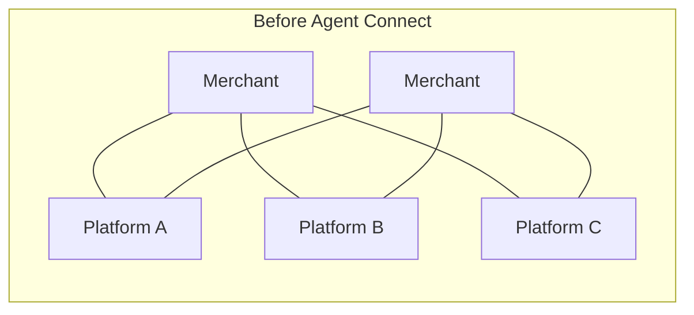
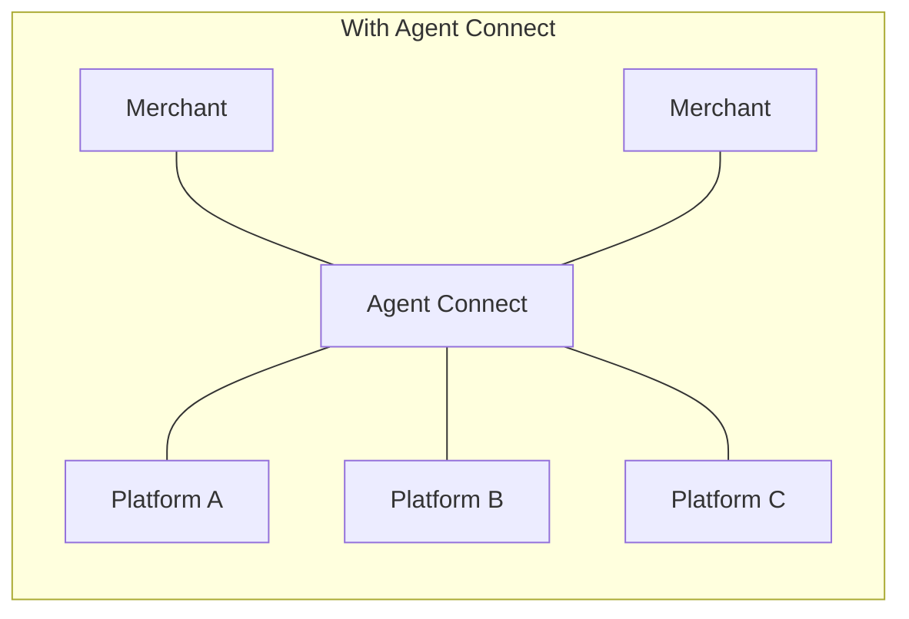

## Abstract

Three things shipped this window, and none of them is a payment protocol. Mastercard opened a single connector so merchants stop building one integration per AI shopping platform. NPCI used Global Fintech Fest to launch two agentic-AI platforms of its own, while the "Unified Agent Protocol" this series has tracked since August stayed unconfirmed for a third straight brief. And Sequoia put $30M behind a startup selling the answer to a question few enterprises can currently answer: what can our AI agents actually reach? The pattern across all three: infrastructure for agents to *reach* systems is arriving well ahead of the rules for what they're *authorized* to do once they're there.

## Introduction

This edition of the `ai-agent-brief` series covers **2026-09-07 through 2026-09-10** (72 hours), per this harness's standing-brief protocol. The standing beat: agent frameworks and developer tooling; agent-to-agent and agent-to-merchant payment rails and protocols (x402, AP2, ACP, UCP, MPP, L402, Trusted Agent Protocol and successors); the card networks' and PSPs' agent-commerce products; agent identity and authorization; and the standards bodies behind all of it.

The [previous brief](../ai-agent-brief-2026-09-09/) covered Meta's Muse launch, Google's six-hour credential-harvesting case, and a formal-verification paper finding authorization gaps across four major agent-payment protocols. None of those three threads produced a new development in this window. For background on the protocols this brief assumes, see the site's longer reports on the [Machine Payments Protocol](../mpp-machine-payments-protocol/), [x402](../x402-protocol/), and [agent identity: EAS vs. DID](../ai-agent-identity-eas-vs-did/).

## What moved

### Mastercard collapses N integrations into one

Mastercard launched Agent Connect on 2026-09-09: a single integration point through which an AI shopping agent can search a participating merchant's catalog, assemble a cart, and route a customer-approved payment, instead of the merchant building a separate connection for every AI platform it wants to reach[^s01][^s02]. Merchants keep control of what gets exposed — Mastercard describes it as making "product details, pricing, availability and fulfillment options... accessible across models, platforms and agent experiences while maintaining control over how that information is used"[^s02]. Chief Product Officer Jorn Lambert framed the stakes bluntly: "AI agents will change the buying interface again"[^s01], and Mastercard's answer is to sit in the middle of that change rather than let each AI platform negotiate its own terms with each merchant separately.

_Figure 1 — Agent Connect replaces a per-merchant, per-platform integration mesh with a single hub each side connects to once[^s01][^s02]._

The launch runs alongside Mastercard's existing Agent Pay tokenization and a blueprint built with Anthropic's Claude models covering post-purchase support like order tracking and refunds. More than 30 companies, including Stripe, Coinbase, Adyen, and Cloudflare, are named as backing Mastercard's broader agent-payment infrastructure, a Mastercard-stated figure not independently itemized in this sweep _(vendor-stated)_. A single integration point solves a merchant's problem; it does not by itself solve the buyer's. A June 2026 Checkout.com survey found 27% of consumers trust no organization to run an AI shopping agent on their behalf, and willingness to delegate splits hard by category — 41% for groceries versus 15% for anything touching finances[^s08]. Agent Connect makes the merchant side of a transaction easier to build. Whether shoppers use it is a separate, still-open question.

### NPCI ships the agent tooling, not the payment protocol everyone expected

At Global Fintech Fest 2026 in Mumbai on 2026-09-09, NPCI launched two agentic-AI platforms of its own: AiNxt, a bring-your-own-model stack for building and deploying agents across an OS, an IDE plugin, a CLI, and an enterprise tier; and AtOM, an orchestration layer meant to handle the multi-bank certification and onboarding work that UPI changes usually require, producing signed, machine-readable audit trails as it goes[^s03][^s04]. NPCI also unveiled an open reinforcement-learning environment built with NVIDIA, letting banks and fintechs train agents on synthetic data instead of live customer records[^s05].

What did not ship is the "Unified Agent Protocol" this series has carried forward twice already — the framework that would let a UPI user delegate a spending limit to an agent and skip per-transaction approval. Every account of the Fest's opening days, including same-day coverage of NPCI's other launches, still describes it as "expected," not shipped[^s03]. Global Fintech Fest runs through 2026-09-11, so the window has not closed, but NPCI chose this event to ship the tooling an agent needs to exist before it chose to ship the protocol that would let that agent spend money.

### Sequoia prices the nonhuman-identity gap at $30M

Cymphony came out of stealth on 2026-09-09 with $30M in funding: a $25M Series A co-led by Sequoia Capital and SMBC Fin Atlas Beyond Fund, on top of a previously undisclosed Sequoia seed, valuing the company above $100M[^s06][^s07]. The product maps which employees, AI agents, and other nonhuman accounts can reach which systems and data, without requiring anything installed on the endpoint. At one U.S. public-company customer, it found roughly 85,000 files that had become accessible to AI tools and agents[^s06]. Sequoia partner Bogomil Balkansky's framing doubles as the thesis for the whole category: "If companies are not spending money on agent security, I don't know what else they'll be spending money on in the next five to 10 years"[^s06].

Cymphony's traction claims (a double-digit number of enterprise customers including KKR and Syngenta, seven-figure ARR within a year of selling) come from the company via TechCrunch's reporting and have not been independently checked _(vendor-stated)_. The category itself is contested: TechCrunch's own reporting names Microsoft, Okta, CyberArk, Wiz, and Varonis as established security vendors already expanding into the same ground, and even Balkansky frames Cymphony as additive rather than a replacement — "nobody's going to get rid of their Okta"[^s06]. Whether nonhuman-identity visibility becomes a market of its own or a feature line inside those larger platforms is unresolved.

## Why it matters

Three unrelated organizations spent this window building the same kind of thing: a way for agents to connect to more systems, faster, with fewer bespoke integrations. Mastercard's hub replaces merchant-by-merchant integration work. NPCI's AiNxt and AtOM replace bank-by-bank certification work. Cymphony exists because that connectivity already outran the tooling to see who's using it. None of the three required an agent-authorization protocol to ship, and that's the point worth sitting with: UCP has a Payments Technical Council but no card network in it beyond the companies also on this beat directly; EMVCo's card-based framework is still in a comment period that runs to 2026-09-30; NPCI's own protocol is still "expected." The connective tissue is being built ahead of the rules for what runs through it, which is exactly the ordering that produced last week's GTIG report and Meta's Sentinel gate — infrastructure first, authorization boundary after.

## Signals to watch

- Does NPCI name the Unified Agent Protocol explicitly before Global Fintech Fest closes on 2026-09-11, or does a fourth brief carry it forward unconfirmed?
- One of Mastercard's 30-plus named backers making its own statement about what "backing" Agent Connect actually means, rather than leaving the figure as Mastercard-stated.
- A second Cymphony customer disclosure beyond the one 85,000-file count — that would turn a vendor anecdote into a pattern.
- UCP's new Payments Technical Council (Adyen, Ant International, Coinbase, Global Payments, Google, PayPal, Shopify, Stripe): a technical proposal, or just a standing governance announcement?
- EMVCo's card-based agentic payments framework comment period, open through 2026-09-30.

## Limitations

This brief covers a 72-hour window, so developments just before 2026-09-07 or after 2026-09-10 are out of scope by design. The Bluesky and Reddit lanes remain unusable on this machine: credentials are present in the environment but empty, a configuration gap carried forward from the prior brief and recorded in `working/gaps.md`. No NPCI-authored primary source for AiNxt, AtOM, or the NVIDIA collaboration was found; all three are sourced to India-market trade press reporting from the event, not to NPCI directly. Mastercard's own press release for Agent Connect returned an HTTP 403 to this harness's fetcher, so that item is sourced to corroborating trade coverage rather than the primary release text. The papers lane found nothing new in-window. The two agent-payment-protocol security papers surfacing in searches this cycle both predate the window, and one was already cited in the prior brief. Figure 1's mermaid diagrams were checked by hand against `graph LR` grammar but not confirmed in an actual browser: this machine still has no Node runtime, so neither `render-report`'s output nor a rendering tool could be used to open the figure the way a reader would.
