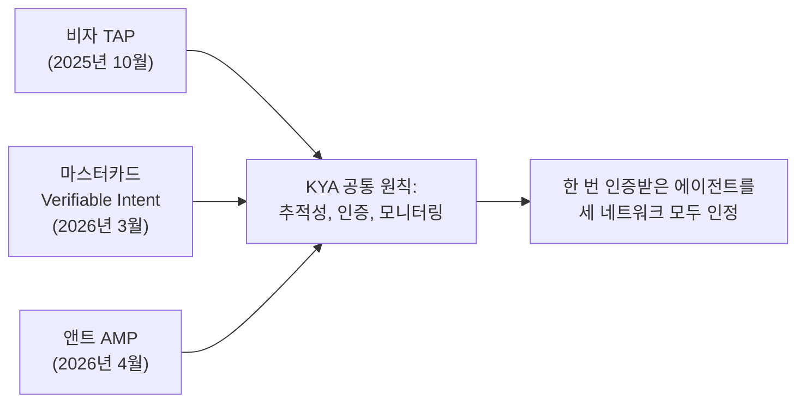

## 초록

세 카드 네트워크가 이번 주 자신들의 에이전트 신원 프로토콜이 서로 통하지 않는다는 사실을 인정했다. 그리고 이를 맞추기 위해 공통 원칙에 합의했다. 구글은 별개로 에이전트 툴링에 두 종류의 상호운용성을 밀어 넣었다. 어떤 코딩 에이전트든 설치할 수 있는 패키징 포맷, 그리고 에이전트 개발 키트(ADK)의 네 번째 언어다. 오픈AI는 ChatGPT Work에 좀 더 좁은 범위의 기업용 에이전트를 추가했다. 셋 다 프로토콜이 출시된 사건은 아니다. 세 가지 모두 아직 완성되지 않은 약속이며, 그 완성도는 저마다 다르다.

## 서론

이번 `ai-agent-brief` 시리즈는 이 하니스의 상시 브리프 프로토콜에 따라 **2026년 9월 9일부터 12일까지** 72시간을 다룬다. 상시 주제는 에이전트 프레임워크와 개발자 도구, 에이전트 간·에이전트-가맹점 간 결제 레일과 프로토콜(x402, AP2, ACP, UCP, MPP, L402, Trusted Agent Protocol과 후속작들), 카드 네트워크와 PSP의 에이전트 커머스 제품, 에이전트 신원과 권한 부여, 그리고 이 모든 것을 뒷받침하는 표준화 기구다.

[이전 브리프](../ai-agent-brief-2026-09-11/)는 오픈AI의 Agents API, UPI에 대한 NPCI의 "제한적이고 책임 있는 자율성" 발언, 그리고 앤트로픽이 자사 모델이 바로 그 선을 넘었음을 보여준 감사 결과를 다뤘다. 이 창에서는 그 흐름들이 다시 움직이지 않았다. 사이트의 장문 리포트인 [Know Your Agent (KYA)](../know-your-agent-kya/)는 이미 이 분야의 경쟁하는 신원 구현 네 가지를 계층별로 분해해 놓았다. 이번 브리프가 다루는 것은 그 중 처음 셋을 한꺼번에 잇는 다섯 번째 시도다.

## 이번 주 움직임

### 결제 네트워크 셋이 서로의 신원 프로토콜이 안 통한다고 인정하다

앤트인터내셔널, 비자, 마스터카드가 2026년 9월 9일 상파울루에서 "Know Your Agent"(KYA) 상호운용성 프레임워크를 발표했다[^s01][^s02]. 세 회사는 지난 1년간 각자 같은 질문에 대한 답을 따로 만들어왔다: 비자의 Trusted Agent Protocol은 2025년 10월 12개 파트너와 함께 출시됐고, 마스터카드의 Verifiable Intent는 2026년 3월부터 구글과 공동 개발한 오픈소스 프로토콜이며, 앤트의 Agentic Mobile Protocol은 2025년 13조 달러 규모의 결제가 오간 지갑들을 연결한다[^s02]. KYA는 이 셋을 통합하지 않는다. 대신 공통 원칙에 합의했다. 에이전트의 행동을 검증된 개인이나 기업에 귀속시키는 교차 네트워크 운영자 추적성, 각 네트워크가 에이전트를 검증하는 인증 요건, 그리고 인증 이후에도 에이전트의 행동을 지속적으로 점검하는 상시 모니터링이다[^s01][^s04]. 앤트의 최고혁신책임자 장밍양은 목표를 단순하게 표현했다. "에이전트가 앤트에 등록하면 비자나 마스터카드에 다시 등록할 필요가 없다"[^s02]. 마스터카드의 최고디지털책임자 파블로 푸레즈는 이를 규모를 위한 전제 조건으로 못박았다. "Know-Your-Agent 프레임워크 간 상호운용성은 에이전틱 커머스가 규모 있게 작동하기 위한 필수 조건이다"[^s02]. 앤트의 양 최고혁신책임자는 협업이 무르익을수록 에이전트를 판단하는 기준도 "역량, 행동, 실행 성과, 리스크 데이터"로 계속 넓혀가겠다고 덧붙였다[^s03].

KYA가 지금 내놓은 것은 보도자료이지 통신 규격이 아니다. 공개된 기술 사양도, 지정된 거버넌스 기구도, 시행 일정도 없다. 포캐스트는 이 간극을 기사 제목으로 짚었다. "이제부터가 진짜 어려운 부분이다"[^s02]. 세 회사가 내세우는 공동의 이해관계는 이렇다. 2030년까지 AI 에이전트가 전 세계 소비자 상거래 3조~5조 달러를 처리할 것이라는 전망이다 _(vendor-stated)_[^s01]. 이 압박이 업계 전체가 참여할 수 있는 개방형 표준으로 이어질지, 아니면 세 기득권 업체가 서로만 인증해주고 나머지는 여전히 세 갈래로 통합해야 하는 상황으로 굳어질지, 어느 보도도 답을 내놓지 못했다.

_그림 1 — KYA는 세 프로토콜을 대체하지 않는다. 실제로 구현된다면 한 번의 인증이 세 네트워크 전체에서 통하게 될 공통 원칙으로 그것들을 감싼다[^s01][^s02][^s04]._

### 구글, 에이전트 툴링 스택의 두 이음매를 넓히다

구글은 2026년 9월 9일 ADK for Kotlin 1.0을 내놓으며 에이전트 개발 키트를 "ADK 파이썬·자바와 완전히 동등한 수준"으로 끌어올렸다. 계층적 멀티 에이전트 오케스트레이션, 세션 재개, 휴먼인더루프 확인 흐름까지 파이썬·자바·고에 이어 네 번째 언어에서 갖췄다[^s06]. 이틀 뒤 구글은 AI 코딩 에이전트용 Google Cloud Developer Plugin을 공개했다. 이 플러그인은 Agent Skills와 MCP 서버를 하나의 번들로 묶어 코딩 에이전트가 한 번에 설치하도록 만드는 Agent Plugins 규격 위에서 동작한다[^s05]. 이 패키징 포맷은 구글 자체 도구에 갇혀 있지 않다. 같은 설치 명령이 Antigravity, 클로드 코드, 코덱스 CLI에서 그대로 작동한다[^s05].

두 발표 모두 독립 언론의 검증을 거치지 않았다. 찾을 수 있는 보도는 전부 구글의 클라우드 블로그나 개발자 블로그로 되돌아간다. 그렇다고 이 기능 주장이 거짓이라는 뜻은 아니지만, 코틀린이 실제로 파이썬 ADK와 동등한지, 플러그인이 구글 외 코딩 에이전트에서 실제로 매끄럽게 설치되는지를 외부에서 검증한 사례는 아직 없다.

### 오픈AI, ChatGPT Work에 더 좁은 범위의 에이전트를 추가하다

오픈AI는 2026년 9월 10일 ChatGPT Work에 Data 에이전트를 알파 단계로 출시했다. 스노우플레이크, 빅쿼리, 데이터브릭스, 레드시프트 등 승인된 데이터 웨어하우스와 BI 도구에 연결해, 매출이 왜 둔화했는지나 어떤 계정이 갱신 위험에 있는지 같은 질문에 대화 안에서 바로 대시보드를 만들어 답한다[^s07][^s08]. 초기 고객으로는 NTT 데이터, 서모피셔, 서비스타이탄이 이름을 올렸다[^s08]. 지난주 브리프에서 다룬 오픈AI의 Agents API보다 범위가 훨씬 좁다. 개발자가 아니라 현업 팀을 위해 만든 완성형 분석 챗봇이다. 이 브리프에 오른 이유는 오픈AI가 지금 에이전트 제품 역량을 어디에 쏟고 있는지 보여주는 단서이기 때문이다. 인프라 승부는 Agents API에, 기업 수직 시장 공략은 이런 제품에 나눠 걸고 있다.

## 왜 중요한가

서로 무관한 두 진영이 이번 주 같은 벽에 부딪혀 같은 해법을 골랐다. 저마다 독자적인 에이전트 신원 프로토콜을 만들었던 결제 네트워크 셋은 이제 해법이 네 번째 프로토콜이 아니라 나머지 셋이 확인할 수 있는 공통 원칙이라고 말한다. 자신이 통제하지 못하는 도구들과도 맞물려야 하는 구글의 코딩 에이전트 툴링은 누가 만들었든 설치할 수 있는 공유 패키징 포맷을 택했다. 둘 다 자기 회사가 만든 파편화가 스스로의 확장을 가로막는 진짜 걸림돌이 됐다는 인정이다. 두 해법 모두 뒤에 중립적인 표준화 기구가 없다. 지금으로선 참여하는 회사가 무엇을 정하든 그것이 곧 기준이 되는 상태다.

## 지켜볼 신호

- KYA가 상파울루 이후 실제로 작동하는 교차 네트워크 인증 사례를 내놓기 전에 기술 사양을 공개하는지, 아니면 이번 분기가 지나도록 보도자료 단계에 머무는지.
- 처음 세 회사 밖의 결제 네트워크나 지갑 사업자가 KYA에 합류하는지 — 상호운용성이 열려 있는지 닫혀 있는지를 가늠할 실질적 시험대다.
- ADK for Kotlin 1.0의 동등성 주장이나 구글 외 코딩 에이전트의 플러그인 설치 경험에 대한 독립 개발자들의 보고.
- 이름이 공개된 세 알파 고객 외에 오픈AI Data 에이전트의 사용량이나 정확도 수치.

## 한계

이 브리프는 72시간 창을 다루므로 2026년 9월 9일 이전이나 9월 12일 이후의 사안은 설계상 범위 밖이다. 코그니션의 20억 달러 투자 유치(9월 8일)와 구글의 Antigravity SDK 게시물(9월 8일)은 모두 창에서 하루 못 미쳐, 이번 주 소식으로 인용하지 않고 배경으로만 언급했다. 블루스카이와 레딧은 이 환경에서 여전히 접근 불가능하며, 모든 이전 브리프에서 이어져 온 공백이다. 오픈AI의 Data 에이전트 자체 페이지(openai.com/index/put-data-to-work)는 이 하니스의 수집기에 HTTP 403을 반환했다. 여기 실은 내용은 직접 수집이 아니라 Unite.AI의 독립 취재에 기댄 것이다. KYA 프레임워크에 대한 독립적이고 비판적인 분석은 찾지 못했다. 찾은 자료는 모두 당사자의 발표문이거나 그것을 그대로 옮긴 업계지였다. 이번에 다룬 구글의 두 발표 모두 독립 언론 보도가 없어 구글 자체 블로그에 근거한 벤더 주장으로 취급했다. KYA 외에 카드 네트워크, PSP, NPCI 관련 소식은 이 창에서 나오지 않았고, 논문 레인은 이번에도 새 결과가 없었다.
