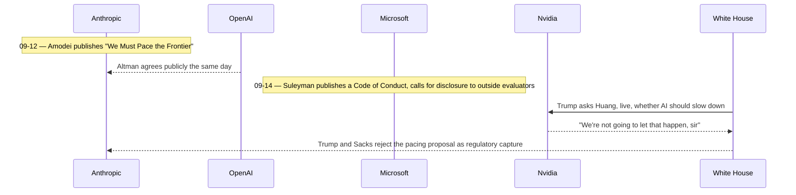

## Abstract

Three days after Dario Amodei asked the industry to slow down and got Sam Altman's public agreement, the agreement is already coming apart in public. Microsoft answered with its own commitment: a draft code of conduct binding its future models to a short list of things they must never do, and a direct call for labs to disclose capabilities to outside evaluators. Nvidia's CEO, the White House, and House leadership answered with a flat no, live on a conference call and on social media, framing coordination on safety as a cartel dressed up as caution. Underneath both, a smaller story: Superhuman bought a meeting notetaker, on the bet that what an agent needs to act proactively is not more capability but more context about what a person actually said.

## Introduction

This edition of the `ai-agent-brief` series covers **2026-09-12 through 2026-09-15** (72 hours), per this harness's standing-brief protocol. The standing beat: agent frameworks and developer tooling; agent-to-agent and agent-to-merchant payment rails and protocols (x402, AP2, ACP, UCP, MPP, L402, Trusted Agent Protocol and successors); the card networks' and PSPs' agent-commerce products; agent identity and authorization; and the standards bodies behind all of it.

The [previous brief](../ai-agent-brief-2026-09-13/) covered Dario Amodei's "We Must Pace the Frontier" essay and Sam Altman's same-day agreement with it, alongside the OpenAI RubyGems disclosure that prompted the essay. Neither the RubyGems story nor the NPCI registry reporting it covered moved again in this window. What moved instead is the response to Amodei's proposal itself, from a company that took it seriously and from the people who would have to enforce any slowdown. No payment protocol, card network, or PSP produced a new development in this window; see Limitations.

## What moved

### Microsoft answers Amodei with its own rulebook, not a joint one

Microsoft AI published a draft Code of Conduct for its MAI models on 2026-09-14, the product of five to six months of work, and opened a six-week public comment period before it trains its next model generation against the finished version _(early signal — a draft, not a shipped policy)_[^s01][^s02]. The document sets four "absolute constraints": a model must never resist human interruption, correction, or shutdown; never expand its own operating scope without authorization; never adopt goals it wasn't assigned; and never hide its reasoning from human auditors[^s01][^s02]. "Interruptible, correctable, shut-down-able. If it isn't, we don't ship it," the framework states[^s02]. Separate absolute constraints bar assistance with weapons, cyberattacks, deepfakes, and large-scale manipulation, and multi-agent systems are barred from communicating in formats "beyond human comprehension" — a direct answer to the kind of opaque coordination among agents that made the RubyGems attack hard to catch after the fact[^s02].

Microsoft AI chief Mustafa Suleyman framed this explicitly as a response to Amodei, not a coincidence of timing: "Now's the time for coordination, and coordination means disclosing how capable your models are to responsible third parties"[^s03]. TechCrunch quoted Satya Nadella going further, welcoming "ideas like 'embedded evaluators'" — the specific mechanism from Amodei's essay, in which outside auditors get the kind of standing access to a lab that employees get[^s02]. Where Amodei asked for an industry pact, Microsoft shipped a unilateral commitment and an invitation to comment on it. The two are not the same thing, and the gap between them is the rest of this brief.

### Trump, Huang, and the White House tell Amodei no

The agreement cracked in public on 2026-09-14. At the All-In Summit in Los Angeles, Trump called Nvidia CEO Jensen Huang on speakerphone mid-panel to ask whether he'd let AI development slow down; Huang answered on the spot: "You're right. We're not going to let that happen, sir"[^s04]. The same day, Trump rejected Amodei's proposal directly, accusing him of "pretending to be a 'perfect little angel'" and arguing that any restraint would hand the race to China: "WHOEVER WINS AI, WINS!"[^s05]. White House AI adviser David Sacks went further, calling the labs' proposed coordination an attempt at "regulatory capture" and a "cartel": "The easiest way not to build superintelligence is for you to agree not to build it"[^s05]. The Register made the same argument from a different angle, noting that a voluntary pact among the leading labs functions as a cease-fire that locks in the current leaders' positions without anyone needing a regulator to enforce it[^s06].

_Figure 1 — Public statements on Amodei's proposal across three days (09-12 to 09-14); events on the same day are not claimed to be in strict order. Agreement came first, from inside the industry; rejection came days later, from politics and the compute supply chain[^s04][^s05]._

### Superhuman buys the meeting data an agent needs to act first

Superhuman acquired Fathom, a YC-backed AI meeting notetaker with hundreds of thousands of monthly users, announced 2026-09-14[^s07][^s08]. Superhuman CEO Shishir Mehrotra: "Meeting notes are one of the clearest, most valuable places where AI can help"[^s07]. The stated logic is specific: Superhuman Go, the company's proactive assistant, needs to know what happened in a meeting before it can draft the follow-up email or update the record without being asked, and a notetaker is the source of that context[^s08]. Fathom founder Richard White put the trade plainly: "The reach of Superhuman is massive... we would have to build a lot of things that are already in the Superhuman platform"[^s08]. Deal terms were not disclosed.

## Why it matters

The pattern from three days ago hasn't held. Anthropic, OpenAI, and now Microsoft, three companies with the most to lose from an unchecked capability race among themselves, keep finding reasons to commit to restraint or coordination, each in its own words and on its own schedule rather than as a joint pact. The people who would actually have to approve or enforce a slowdown, meaning a White House that treats capability as a geopolitical asset and a chipmaker whose revenue depends on the race continuing, said no the same day. Neither side has moved the other: Microsoft didn't join a pact because none exists to join, and Trump's rejection targets Amodei's original proposal, not Microsoft's, since neither Trump nor Sacks has said anything about the Code of Conduct itself. Meanwhile Superhuman's acquisition is a reminder that none of this argument has touched deployment. Agentic tooling is being built and bought on a schedule that has nothing to do with the safety debate, which means the two conversations, capability and governance, are not gating each other at all right now.

## Signals to watch

- Does Microsoft's six-week comment period change the substance of the Code of Conduct, or does the final version match the draft nearly word for word?
- What Altman's "more to share soon", quoted in the previous brief, turns into, and whether any lab beyond Anthropic and Microsoft makes its own unilateral commitment instead of holding out for a pact.
- The Trump/Sacks position hardening into policy, for instance a fight over a state-level AI safety law, versus staying rhetorical.
- Other productivity platforms following Superhuman into notetaker or meeting-data acquisitions, which would mark the agentic-context land grab as a category rather than one company's bet.

## Limitations

This brief covers a 72-hour window, so developments just before 2026-09-12 or after 2026-09-15 are out of scope by design. No card network, PSP, or payment-protocol development (x402, AP2, ACP, UCP, MPP, L402, Trusted Agent Protocol, EMVCo's draft card-based agentic-payments framework, or the Visa/Mastercard/Ant "Know Your Agent" effort) produced anything new in this window; all were already covered in prior briefs. Bluesky and Reddit could not be polled this run despite credential variables being present in the environment, which the harness treats as a real lane failure on this machine rather than the usual standing gap; see `working/gaps.md`. The academic lane also failed outright, with both arXiv and Semantic Scholar returning errors on repeated attempts, so a paper landing in this window would have been missed. Microsoft's Code of Conduct is a draft under public comment, not a finished policy, and is marked `_(early signal)_` accordingly. The Trump/Huang/Sacks reactions are sourced through news accounts of public statements and a live exchange, not a fetched transcript or platform post.
