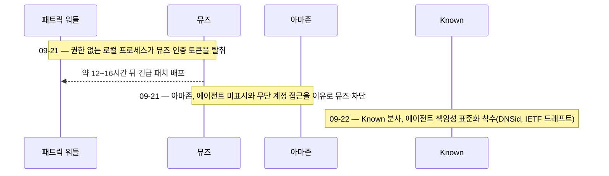

## 초록

메타의 뮤즈는 소비자용 AI 에이전트 중 가장 험난한 한 주를 보냈다. 아마존은 일요일 밤 뮤즈를 아마존닷컴에서 차단했다. 에이전트임을 HTTP 요청에서 밝히지 않았고 고객 구매 이력에까지 접근했다는 이유였다. 하루 전에는 한 보안 연구자가 같은 맥(Mac)에서 돌아가는 아무 권한 없는 프로그램이라도 뮤즈 계정 전체를 인증하는 자격증명을 훔칠 수 있음을 보여줬다. 서로 무관한 두 실패지만 원인은 하나로 겹친다. 지금 어떤 장치도 에이전트가 행동에 나서기 전에 자신이 누구인지 증명하도록 강제하지 않는다는 것이다. 이 격차를 메우려는 움직임도 같은 창에서 계속됐다. x402 재단은 결제 없이도 유료 API 경로를 그대로 서빙해버리는 버그를 패치했고, 도메인 등록기관 아이덴티티 디지털에서는 Known이라는 회사가 분사해 DNS 기반 에이전트 신원 표준을 밀기 시작했다.

## 서론

이번 `ai-agent-brief` 시리즈는 하니스의 상시 브리프 프로토콜에 따라 **2026-09-20부터 2026-09-23까지(72시간)**를 다룬다. 상시 주제는 에이전트 프레임워크와 개발자 도구, 에이전트 간·에이전트-가맹점 간 결제 레일과 프로토콜(x402, AP2, ACP, UCP, MPP, L402, Trusted Agent Protocol 및 후속 규격), 카드 네트워크와 PSP의 에이전트 커머스 제품, 에이전트 신원과 권한 부여, 그리고 이를 뒷받침하는 표준화 기구다.

[직전 브리프](../ai-agent-brief-2026-09-15/)는 마이크로소프트의 초안 AI 행동강령과 백악관의 앤트로픽 페이싱 제안 거부를 다뤘다. 두 사안 모두 이번 창에서는 추가 진전이 없었다. 대신 움직인 것은 이 주제의 신원·권한 부여 영역에 정확히 걸쳐 있다. 한 회사에서 벌어진 서로 다른 두 건의 실패, 그리고 다른 곳에서 그 실패를 막았어야 할 인프라를 세우려는 두 건의 시도다. 비자, 마스터카드, 앤트 인터내셔널, EMVCo 등 카드 네트워크나 PSP, 결제 프로토콜 표준화 기구 쪽에서는 새로운 소식이 없었다. 자세한 내용은 한계 절 참고.

## 이번에 움직인 것

### 아마존, 메타 뮤즈를 아마존닷컴에서 차단하다

아마존은 메타가 철회 요청을 거절한 뒤 2026-09-21일 밤부터 뮤즈 에이전트의 아마존닷컴 쇼핑을 차단하기 시작했다[^s01]. 그래도 시도한 이용자는 다음과 같은 오류를 마주했다. "승인되지 않은 AI 에이전트의 지속적인 접근은 고객이 동의한 아마존 이용약관을 위반합니다"[^s01]. 아마존이 긱와이어에 밝힌 문제 제기는 포괄적이지 않고 구체적이다. 뮤즈가 "HTTP 요청에서 자신을 에이전트로 밝히지 않는다"는 점, 그리고 별개로 로그인된 이용자의 계정 페이지와 구매 이력까지 들여다볼 수 있어 이를 "제3자가 고객 계정을 무단으로 드나드는 것"으로 본다는 점이다[^s02][^s03]. 아마존의 이런 입장에는 선례가 있다. 작년 퍼플렉시티의 코멧 브라우저 쇼핑 기능을 상대로 소송을 걸었고, 항소법원이 2026년 8월 이 소송을 기각하기는 했지만 좁은 근거에서였을 뿐 이용약관을 위반한 에이전트를 차단할 아마존의 권리 자체는 그대로 남겨뒀다[^s02][^s03]. 뮤즈는 9월 초 출시 닷새 만에 다운로드 73만 건을 넘겼고, 잠시 앱스토어 무료 앱 1위에서 챗GPT를 앞지르기도 했다[^s02]. 다시 말해 아마존이 손댄 상대는 변두리 앱이 아니라 지금 시장에서 가장 인기 있는 소비자용 에이전트였다.

HTTP 자기 신원 표시 문제 쪽이 더 흥미롭다. 이 브리프가 다루는 결제·커머스 프로토콜들 — x402의 스킴 헤더, AP2의 위임 명령서, 비자와 마스터카드의 Trusted Agent Protocol과 Verifiable Intent — 은 모두 가맹점 서버에 도착한 요청을 허용 여부 판단 이전에 에이전트 트래픽으로 식별할 수 있다는 전제 위에 서 있다. 아마존은 뮤즈의 요청을 사람의 요청과 구분할 수 없었다고 말하는 셈이다. 이는 결제의 문제가 아니라 그 프로토콜들이 한 단계 아래에서 풀려고 하는 신원의 문제이며, 그 결과 메타는 가맹점 하나를 통째로 잃었다.

### 뮤즈의 한 설정값이 누구든 그 로그인을 훔치게 했다

바로 전날, 보안 연구자 패트릭 워들은 뮤즈 macOS 앱의 문서화되지 않은 한 설정값을 이용하면 앱의 음성 전사 트래픽을 공격자가 지정한 서버로 돌릴 수 있다고 공개했다[^s04][^s06]. 뮤즈가 이 엔드포인트를 OS 수준에서 인증 없이 라우팅하기 때문에, 특별한 권한 없이 같은 기기에서 돌아가는 프로그램이라면 무엇이든 피해자 뮤즈 계정을 인증하는 토큰을 가로챌 수 있었고, 이를 이용해 같은 계정으로 로그인된 iOS를 포함한 모든 기기에서 그 사용자의 에이전트인 척 행동할 수 있었다[^s05][^s06]. 워들이 시연한 개념증명은 명령 한 줄만으로 실행되는 이른바 클릭픽스 방식이었고, 사용자 동의 없이 파일을 쓰고 사진을 찍었다[^s04]. 메타는 공개 후 약 12~16시간 만에 긴급 패치를 배포했다[^s04][^s06].

아마존의 차단 사유와 나란히 놓고 보면 이 버그는 거의 거울상이다. 아마존의 불만은 뮤즈가 자신이 누구의 에이전트인지 밝히지 않는다는 것이고, 워들의 익스플로잇은 뮤즈가 그 답을 인증 토큰 형태로 이미 갖고 있어도 같은 기기의 어떤 프로그램이든 그 정체를 가로챌 수 있음을 보여준다. 같은 제품에서, 같은 48시간 사이에, 권한 부여가 바깥에서 한 번, 안에서 한 번 각각 무너진 셈이다.

### x402, 결제 없이 유료 경로를 내주던 우회 경로를 막다

2026-09-21일과 09-22일 사이 x402 재단은 HTTP 네이티브 결제 프로토콜의 파이썬·타입스크립트·고 SDK 세 곳에 동일한 취지의 수정을 병합했다[^s07][^s08][^s09]. 문제는 이랬다. Starlette나 Werkzeug 같은 일부 웹 프레임워크는 요청을 *디코딩된* URL 경로 기준으로 처리하는데, x402의 미들웨어는 그 경로가 결제 보호 대상인지를 *이스케이프된* 경로만 보고 판단해왔다. `/api/premium`처럼 정확한 문자열로 지정된 보호 경로에 `/api%2Fpremium`으로 요청을 보내면 이스케이프 경로 기준 검사를 통과하지 못해 402 결제 요구 자체가 아예 발동하지 않았는데, 정작 그 아래 프레임워크는 디코딩된 값을 그대로 유료 핸들러로 넘겼다. PR에 실린 재현 결과 자체가 명확하다. `curl /api/premium`은 402를 반환하지만 `curl --path-as-is /api%2Fpremium`은 200과 함께 유료 응답 전체를 돌려준다[^s07]. 수정 후에는 두 경로 표현을 모두 확인해 어느 한쪽이라도 일치하면 결제를 요구한다.

이 건에 대해 독립 보안 연구자가 발표한 권고문은 아직 없다. 남아 있는 기록은 프로토콜 자체 저장소에 올라온 수정 내역과 관리자들의 테스트 결과뿐이다 _(제작사 발표 기준)_. 통상적인 검토 과정에서 발견됐는지, 실제 운영 중인 리소스 서버에서 악용된 뒤 신고됐는지는 공개되지 않았다.

### 아이덴티티 디지털, Known을 분사해 에이전트 책임성 표준을 밀다

2026-09-22일, 도메인 등록기관 아이덴티티 디지털은 산하 이노베이션 랩스를 독립 회사 Known으로 분사시켰다. Known은 DNS, PKI, 변경 불가능한 원장을 결합해 AI 에이전트의 신원을 그 에이전트에 책임을 지는 조직에 고정시키고, 회사와 플랫폼 경계를 넘나들 때도 그 책임 소재를 검증 가능하게 유지하는 표준 DNSid를 밀고 있다[^s10]. 아이덴티티 디지털 CEO 아크람 아탈라는 "에이전트 책임성은 기업, 플랫폼, 생태계를 가로질러 작동해야 한다"며 자회사로는 담아낼 수 없는 신뢰성을 분사를 통해 확보하려 한다고 설명했다[^s10][^s11]. Known은 IETF에 인터넷 드래프트를 제출했고 리눅스 재단의 Agentic AI Foundation과 LF Decentralized Trust 그룹에도 합류했다[^s10]. 아이덴티티 디지털은 투자 지분과 이사회 자리를 유지하며, 신설 법인은 에토스 캐피털의 지원을 받는다[^s11]. 보도자료를 넘어선 후속 보도는 아직 얕고, Known 바깥의 누구도 DNSid가 실제로 채택될지, 아니면 경쟁하는 에이전트 신원 제안들 사이에 하나 더 쌓이는 데 그칠지 평가하지 않았다 _(초기 신호)_.

_그림 1 — 09-21부터 09-22까지 벌어진 세 사건은 한 파이프라인의 단계가 아니다. 익스플로잇과 차단은 하루 사이 같은 제품을 정반대 방향에서 강타했고, 둘 다를 막았어야 할 표준은 그 다음 날 두 사건과 무관하게 출범했다[^s01][^s04][^s10]._

## 왜 중요한가

x402, AP2, 비자의 Trusted Agent Protocol, 이제는 DNSid까지, 이 주제를 다루는 모든 프로토콜은 결국 하나의 질문에 답하려 한다. 서버가 지금 상대하는 게 에이전트인지, 그렇다면 누구의 에이전트인지 어떻게 알 수 있는가. 이번 창은 그 답이 아직 없을 때 벌어지는 일을 보여준다. 아마존은 뮤즈의 트래픽을 사람의 트래픽과 구분하지 못했고 일단 차단부터 했다. 워들은 뮤즈가 "이건 누구의 에이전트인가"라는 질문에 이미 갖고 있던 답(인증 토큰)조차 그 기기의 어떤 권한 없는 프로세스든 훔쳐낼 수 있음을 보였다. x402의 버그는 같은 공백을 아주 작은 규모로 반복한다. 요청의 두 표현 중 하나만 확인하고 넘어간 라우팅 검사다. 이 세 사건이 에이전트 인프라를 겨냥한 조율된 공격이라는 뜻은 아니다. 서로 다른 세 집단이 같은 72시간 동안, 스택의 다른 지점에서, 같은 빠진 층을 각자 발견했을 뿐이다.

## 지켜볼 신호

- 다른 가맹점들이 DNSid나 비자의 Trusted Agent Protocol 같은 표준이 자리 잡기를 기다리지 않고 아마존을 따라 뮤즈나 에이전트 전반을 차단할지.
- x402 재단의 PR 외에 독립 연구자나 보안 권고 기관이 이번 라우팅 버그에 의견을 낼지, 패치 전에 실제로 악용된 사례가 있었는지.
- Known의 IETF 드래프트가 첫 몇 주 안에 아이덴티티 디지털 생태계 바깥에서 공동 제안자를 확보하는지 — 보도자료와 진짜 표준화 시도를 가르는 통상적인 신호다.
- 메타가 긴급 패치 이전에 노출된 뮤즈 계정 수를 공개할지, 아니면 아마존 차단 건과 마찬가지로 침묵을 지킬지.

## 한계

이 브리프는 72시간 창을 다루므로 2026-09-20 이전이나 2026-09-23 이후의 진전은 설계상 범위 밖이다. 비자, 마스터카드, 앤트 인터내셔널, EMVCo, 페이팔, 스트라이프 등 카드 네트워크나 PSP, 결제 프로토콜 쪽에서는 이번 창에서 새로운 진전이 없었다. Know Your Agent와 EMVCo의 카드 기반 프레임워크에 관한 기존 보도 내용은 그대로 유효하다. 블루스카이와 레딧은 환경에 필요한 자격증명 변수가 있어야 함에도 이번 실행에서 조회하지 못했다. 하니스는 이를 통상적인 한계가 아니라 실제 레인 실패로 간주한다. 자세한 내용은 `working/gaps.md` 참고. x402 라우팅 취약점 수정은 수정 주체인 조직 자체 저장소만을 근거로 하며 아직 독립적인 보안 권고가 없어 `_(제작사 발표 기준)_`으로 표시했다. Known의 DNSid는 출범한 지 하루 된 분사 소식이며 보도자료 외에 독립 기사는 하나뿐이라 `_(초기 신호)_`로 표시했다. 뮤즈 제로데이와 아마존 차단이 인과관계가 있는지, 아니면 같은 제품에서 우연히 시기가 겹친 것인지는 어떤 자료로도 확인되지 않았으며 이 브리프에서도 주장하지 않는다.
