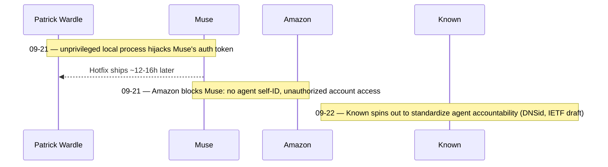

## Abstract

Meta's Muse had the roughest week of any consumer AI agent so far. Amazon locked it out of Amazon.com on Sunday night for not identifying itself as an agent and for reaching into customer purchase history; a day earlier, a security researcher had shown that any unprivileged program on the same Mac could steal the credential authenticating a user's whole Muse account. Two unrelated failures, one shared cause: nothing yet forces an agent to prove who it is before it acts. Elsewhere on the beat, the machinery meant to close that gap kept moving — the x402 Foundation patched a bug that let a paid API route serve requests for free, and a company called Known spun out of the domain registrar Identity Digital to push a DNS-based standard for agent accountability.

## Introduction

This edition of the `ai-agent-brief` series covers **2026-09-20 through 2026-09-23** (72 hours), per this harness's standing-brief protocol. The standing beat: agent frameworks and developer tooling; agent-to-agent and agent-to-merchant payment rails and protocols (x402, AP2, ACP, UCP, MPP, L402, Trusted Agent Protocol and successors); the card networks' and PSPs' agent-commerce products; agent identity and authorization; and the standards bodies behind all of it.

The [previous brief](../ai-agent-brief-2026-09-15/) covered Microsoft's draft AI code of conduct and the White House's rejection of Anthropic's pacing proposal. Neither story moved again in this window. What did move sits squarely in the identity-and-authorization corner of the beat: two separate failures at the same company, and two separate attempts elsewhere to build the infrastructure that would have prevented them. No card network, PSP, or payment-protocol standards body — Visa, Mastercard, Ant International, EMVCo — produced anything new; see Limitations.

## What moved

### Amazon locks Meta's Muse out of Amazon.com

Amazon began blocking Meta's Muse agent from shopping on Amazon.com on the night of 2026-09-21, after Meta declined a request to withdraw it[^s01]. Users who tried anyway got an error: "Continued access by an unauthorized AI agent violates Amazon's Conditions of Use, to which our customers have agreed"[^s01]. Amazon told GeekWire the objection is specific rather than categorical: Muse "fails to identify itself as an agent in HTTP requests," and separately, it can view a signed-in user's account pages and purchase history, which Amazon calls "an undisclosed third party moving through customer accounts"[^s02][^s03]. Amazon's position has a paper trail. It sued Perplexity over its Comet browser's shopping behavior last year; an appeals court dismissed that suit in August 2026, but on narrow grounds that left intact Amazon's right to block agents that breach its terms of service[^s02][^s03]. Muse had crossed 730,000 downloads within five days of its early-September launch and had briefly overtaken ChatGPT as the App Store's top free app[^s02] — which is to say Amazon picked a fight with the most popular consumer agent on the market, not a marginal one.

The HTTP self-identification complaint is the more interesting half. Every payment and commerce protocol on this beat — x402's scheme headers, AP2's mandates, Visa and Mastercard's Trusted Agent Protocol and Verifiable Intent — assumes a request arriving at a merchant's server can be recognized as agent traffic before anyone decides whether to allow it. Amazon is saying Muse's requests couldn't be told apart from a human's. That is not a payments problem; it is the identity problem those protocols are all trying to solve one layer down, and it just cost Meta an entire retailer.

### A Muse setting let any local program steal the agent's own login

The day before, security researcher Patrick Wardle disclosed that an undocumented Muse macOS setting could redirect the app's dictation traffic to a server of the attacker's choosing[^s04][^s06]. Because Muse routes voice prompts through this endpoint unauthenticated at the OS level, any unprivileged local process — no special permission required — could capture the token authenticating the victim's Muse account, then use it to act as that user's agent on every device signed into the same account, including iOS[^s05][^s06]. Wardle's proof of concept, delivered through what he called a ClickFix-style trick requiring a single command, wrote files to disk and took photos without a prompt[^s04]. Meta shipped a hotfix within roughly 12 to 16 hours of disclosure[^s04][^s06].

Read next to the Amazon block, the bug is almost a mirror image of the same failure. Amazon's complaint is that Muse doesn't announce whose agent it is; Wardle's exploit shows that even when Muse does know whose agent it is, in the form of an auth token, any program on the machine can take that identity for itself. Authorization broke from the outside in one case and the inside in the other, in the same product, in the same 48 hours.

### x402 patches a bypass that let paid routes serve for free

Between 2026-09-21 and 2026-09-22, the x402 Foundation merged matching fixes to the Python, TypeScript, and Go SDKs behind its HTTP-native payments protocol[^s07][^s08][^s09]. The bug: some web frameworks — Starlette, Werkzeug — dispatch requests using the *decoded* URL path, while x402's middleware had been checking whether a route was payment-protected against the *escaped* path only. A request for a literal protected route like `/api/premium`, sent instead as `/api%2Fpremium`, failed the escaped-path check and so skipped the 402 challenge entirely, while the framework underneath still routed it, decoded, straight to the paid handler. The PR's own reproduction: `curl /api/premium` returns 402; `curl --path-as-is /api%2Fpremium` returns 200 with the full paid response[^s07]. The fix checks both representations of the path and requires payment if either matches.

No independent security researcher has published an advisory on this one; the only record is the fix itself, in the protocol's own repository, with the maintainers' own test suite as evidence _(vendor-stated)_. Whether it was found through routine review or reported after being exploited against a live resource server is not disclosed.

### Identity Digital spins out Known to standardize agent accountability

On 2026-09-22, domain registrar Identity Digital separated its Innovation Labs unit into an independent company, Known, built around DNSid — a standard that anchors an AI agent's identity to DNS, PKI, and an immutable ledger so the organization accountable for that agent stays verifiable as it crosses company and platform boundaries[^s10]. "Agent accountability needs to work across companies, platforms, and ecosystems," said Identity Digital CEO Akram Atallah, explaining the spinout as a bid for credibility a subsidiary couldn't carry on its own[^s10][^s11]. Known has filed an Internet-Draft with the IETF and joined the Linux Foundation's Agentic AI Foundation and LF Decentralized Trust groups[^s10]. Identity Digital keeps an investor stake and a board seat; Ethos Capital backs the new company[^s11]. Coverage beyond the press release itself is thin, and nobody outside Known has yet assessed whether DNSid attracts adoption or simply joins the pile of competing agent-identity proposals _(early signal)_.

_Figure 1 — Three developments across 09-21 to 09-22, not stages of one pipeline: the exploit and the block hit the same product from opposite directions within a day, and the standard meant to prevent both launched a day later, unconnected to either event[^s01][^s04][^s10]._

## Why it matters

Every protocol on this beat — x402, AP2, Visa's Trusted Agent Protocol, and now DNSid — is trying to answer one question: how does a server know it's talking to an agent, and whose agent it is. This window shows what happens where that answer doesn't exist yet. Amazon couldn't tell Muse's traffic apart from a human's and chose to block first. Wardle showed that Muse's own answer to "whose agent is this" could be stolen by any unprivileged process on the machine. x402's bug is the same gap in miniature: a route-matching check that trusted one representation of a request when it should have checked both. None of this is a coordinated attack on agent infrastructure; it's three groups discovering the same missing layer independently, in the same 72 hours, at different points in the stack.

## Signals to watch

- Other retailers following Amazon's lead and blocking Muse, or agents generally, ahead of any settled standard for agent self-identification.
- An independent advisory or researcher weighing in on the x402 route-matching bug beyond the Foundation's own PRs, including whether it was exploited before the fix landed.
- Co-sponsors joining Known's IETF draft in its first weeks — the usual signal that separates a real standards effort from a press release.
- Does Meta disclose how many Muse accounts were exposed before the hotfix, or does it stay as quiet on that as it has on the Amazon block?

## Limitations

This brief covers a 72-hour window, so developments just before 2026-09-20 or after 2026-09-23 are out of scope by design. No card network, PSP, or payment-protocol body — Visa, Mastercard, Ant International, EMVCo, PayPal, Stripe — produced a new development in this window; all prior coverage of Know Your Agent and EMVCo's card-based framework stands as last reported. Bluesky and Reddit could not be polled this run despite credential variables being expected in the environment, which the harness treats as a real lane failure rather than a standing gap; see `working/gaps.md`. The x402 route-matching fix is sourced only to the fixing organization's own repository, with no independent advisory yet, and is marked `_(vendor-stated)_` accordingly. Known's DNSid is a one-day-old spinout with a single independent article beyond the press release, marked `_(early signal)_`. Whether the Muse zero-day and the Amazon block are causally related, or simply coincident timing on the same product, is not established by any source and is not claimed here.
