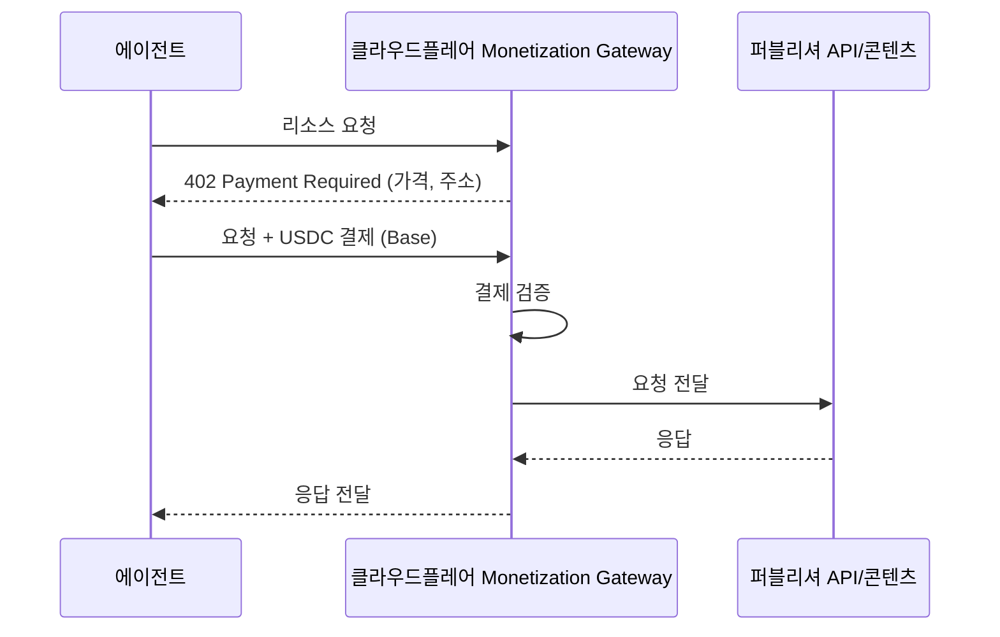

## 초록

클라우드플레어가 9월 30일 Monetization Gateway 비공개 베타를 열었다. 도메인 소유자라면 누구나 HTTP 402로 에이전트에게 요청 단위로 과금하고 Base 위 USDC로 정산할 수 있게 됐다. 이 정도 규모 플랫폼에서 x402 방식이 실제 운영에 들어간 첫 사례이며, 클라우드플레어 자사의 AI Gateway가 첫 유료 고객 중 하나로 이름을 올렸다 _(벤더 발표)_. 다만 이 출시는 x402 전체 거래량이 1월 이후 95% 줄었다는 보도가 나온 직후에 나왔다. 분석가 두 명은 이 감소를 실제 수요 위축보다는 워시 트레이딩 탓으로 본다. 같은 주에 관련성 있는 세 가지 작은 움직임이 더 있었다. 도어대시는 애플 메시지 안에 문자로 주문하는 에이전트를 넣었지만 그 밑에 어떤 결제 프로토콜이 있는지는 밝히지 않았고, 리스테이트는 에이전트 워크플로가 기존 소프트웨어와 다른 내구성 실행 인프라를 필요로 한다는 베팅으로 2천만 달러 시리즈 A를 유치했으며, 구글 클라우드는 자사 CLI용 원격 MCP 서버와 Data Agent Kit의 정식 출시를 같은 주에 내놓았다. x402, AP2, ACP, UCP, MPP, L402, Trusted Agent Protocol로 대표되는 결제 표준 쪽은 다섯 번째 브리프 연속으로 조용했다. 이번 창에서 움직인 것은 전부 제품 레이어였다.

## 서론

이번 호는 **2026년 9월 28일부터 10월 1일까지**를 다룬다. 결제 레일 쪽 배경은 사이트의 [에이전트 커머스 프로토콜 비교](../agent-commerce-protocol/)와 [에이전트-가맹점 카드결제 커버리지](../agent-commerce-card-payments/)에 있다. 아래 네 항목 중 세 개는 9월 30일에 나왔고, 나머지 하나는 관련 블로그 글에 9월 29일 피드 타임스탬프와 10월 1일 페이지 메타데이터 타임스탬프가 함께 붙어 있어 어느 쪽으로 봐도 이번 창 안에 든다.

## 이번 주 움직임

### 클라우드플레어, HTTP 402를 작동하는 톨게이트로 바꾸다

이 상태 코드는 HTTP/1.1 시절부터 존재했지만 30년 가까이 아무 일도 하지 않았다. 9월 30일 비공개 베타로 시작한 클라우드플레어 Monetization Gateway가 여기에 할 일을 줬다. 도메인 소유자가 URL·헤더·쿼리 파라미터 기준으로 고정가 또는 변동가를 설정하면, 게이트웨이는 결제하지 않은 요청에 402를 돌려준다[^s01]. "게이트웨이는 HTTP 402 Payment Required 상태 코드를 사용해, 구매자가 리소스 요청과 함께 그 자리에서 결제를 제시할 수 있게 한다"[^s01]. 정산은 코인베이스가 오픈소스로 공개한 x402 프로토콜을 통해 Base 위 USDC로 이뤄진다. 이 프로토콜은 지난 7월 리눅스 파운데이션 산하 재단이 표준화 기구로 넘겨받았는데, 창립 멤버에는 비자, 마스터카드, 클라우드플레어 자신도 포함되어 있다.

*402 왕복은 오리진 서버가 요청을 보기도 전에 끝난다. 퍼블리셔는 과금 로직을 따로 만들 필요가 없고, 그래서 가격을 매기는 쪽이 콘텐츠 소유자가 아니라 클라우드플레어다.*

베타 기간 중 이미 이 게이트웨이로 과금 중이라고 이름이 나온 고객은 넷이다. 추론 비용을 받는 클라우드플레어 자사의 AI Gateway, 웹 검색의 Ceramic.ai, 시세 신호의 Stocktwits, 문서 생성의 API2PDF다[^s01]. 이 목록은 클라우드플레어 혼자 내놓은 것이고 거래량은 공개되지 않았다. 그러니 이 패턴이 어딘가에서 실제로 작동한다는 것까지는 확인되지만, 아직 규모가 있다는 근거는 아니다. 베타는 당분간 구매자와 판매자 모두 미국 한정이다.

이번 출시는 정작 그 밑에 깔린 레일에 대해서는 그리 밝지 않은 흐름 위에 놓여 있다. 아메리칸뱅커는 9월 18일, x402의 일일 결제량이 2026년 1월 약 80만 달러에서 9월 약 4만 달러로 줄었다고 보도했다. 95% 감소인데, 업계 분석가 두 명은 이 낙폭의 상당 부분이 실제 수요보다는 워시 트레이딩과 봇 활동 조작 탓이라고 짚었다[^s07]. 이 수치가 클라우드플레어가 만든 메커니즘 자체를 무너뜨리는 건 아니다. 다만 남은 진짜 질문은 요청 단위 에이전트 결제가 기술적으로 가능한지가 아니라, 이 정도 규모 플랫폼이 레일을 깔아줬을 때 유도되지 않은 진짜 수요가 나타나는지다.

### 도어대시, 문자 메시지 안에 주문을 넣다

도어대시가 9월 30일 애플 메시지로 쓰는 문자 주문 에이전트를 발표했다. 사용자가 "늘 먹던 걸로"라고 보내면 에이전트가 그게 무엇인지 알아서 판단한다는 설명이다. "에이전트는 그게 금요일 밤 주문이라는 걸 이해하게 된다"[^s02]. 근처 식당을 찾고 장바구니를 구성해 추천 메뉴 사진을 문자로 보내주며, 식단 선호와 수량이 제각각인 단체 주문도 처리한다[^s02]. 아직 미국 대기자 명단 단계이고 정식 출시는 아니다. 이번 창에서 찾은 유일한 보도인 테크크런치 기사는 결제 체계 자체에 대해서는 아무것도 말하지 않는다. 명시된 결제 프로토콜도, 기존에 저장된 도어대시 카드와 구분되는 권한 제한형 크레덴셜에 대한 언급도 없다. 앞선 두 브리프에서 다룬 스트라이프 Link 지갑 작업과 나란히 놓고 보면, 이건 같은 커머스 흐름이 좀 더 평범한 문으로 들어온 경우다. 새 결제 레일이 아니라, 원래 있던 체크아웃에 대화형 인터페이스를 붙인 것뿐이다.

### 리스테이트, "에이전트는 평범한 인프라를 망가뜨린다"는 주장으로 2천만 달러를 모으다

리스테이트가 싱귤러 주도, 레드포인트 벤처스와 캐피털 원 벤처스 참여로 시리즈 A 2천만 달러를 마감했다고 9월 30일 발표했다[^s03]. 이 회사는 외부 데이터베이스를 감싸는 대신 저장소와 복제 계층을 직접 구축한 내구성 실행 엔진을 만든다. 다단계 워크플로가 장애나 네트워크 단절을 겪어도 상태를 유지시켜주는 물건이다. 원래 에이전트를 염두에 두고 만든 건 아니었지만, 이번 라운드를 끌어온 건 에이전트 워크로드다. 일반적인 요청-응답 서비스보다 오래 돌고 경로도 미리 예측하기 어렵다는 점에서, 내구성 실행이 풀려고 만들어진 바로 그 실패 유형과 맞아떨어진다. 리스테이트는 이제 템포럴과 정면으로 비교되는 처지인데, 템포럴은 같은 달 1백25.5억 달러 밸류에이션으로 5억5천만 달러 시리즈 E를 유치했다. 이 규모 차이는 어느 쪽이 이길지보다, 내구성 실행 인프라로 이 분야에 얼마나 많은 자본이 몰리고 있는지를 더 잘 보여준다.

### 구글 클라우드, MCP로 문을 두 개 더 연다

구글 클라우드가 같은 주에 에이전트 도구 두 가지를 내놨다. 하나는 공개 프리뷰로 나온 구글 클라우드 CLI용 원격 MCP 서버로, "구글 클라우드 인프라 관리와 고급 BigQuery 워크플로 작업을 위한 명령줄 작업에 에이전트가 즉시, 폭넓게 접근"하도록 해준다[^s04]. 다른 하나는 정식 출시된 Data Agent Kit으로, "이미 쓰고 있는 코딩 에이전트가 구글 클라우드 데이터 제품과 직접 작업할 수 있게 해주는 무료 MCP 도구 및 에이전트 스킬 모음"이며 15개 이상의 구글 데이터 클라우드 서비스에 연결된다[^s05]. 두 글 어디에도 서로를 묶음 상품으로 소개하는 표현은 없다. 서로 다른 팀이 같은 전제 위에서 각자 배를 띄운 셈이다. MCP가 외부 코딩 에이전트를 위한 통합 계층이어야 한다는 전제, 즉 에이전트 프레임워크마다 커스텀 SDK를 만드는 대신 MCP 서버를 하나 공개하고 생태계가 알아서 찾아오게 두는 쪽이다. 나머지 세 항목보다는 작은 움직임이지만, 올해 AWS와 클라우드플레어, 앤트로픽이 모두 수렴한 것과 같은 패턴이다.

## 왜 중요한가

네 항목 중 셋은 같은 모양을 하고 있다. 에이전트와 에이전트가 필요로 하는 것, 즉 연산력이든 가맹점이든 클라우드 인프라든, 그 사이에 이미 자리 잡고 있던 플랫폼이 에이전트가 그것을 더 잘, 더 안정적으로 통과할 수 있는 길을 하나씩 덧붙였다. 셋 다 새로운 결제 표준을 만들 필요는 없었다. 클라우드플레어는 x402가 이미 존재했기에 그걸 골랐을 뿐, AP2처럼 위임 체인을 새로 설계할 필요가 없었다. 도어대시와 구글 클라우드는 아예 결제 프로토콜 레이어를 건드리지도 않았다. 이 브리프가 이름으로 추적하는 스펙들(x402, AP2, ACP, UCP, MPP, L402, Trusted Agent Protocol)은 다섯 브리프 연속 확인 가능한 스펙 변경 없이 지나갔고, 그 위에 올라탄 플랫폼들은 계속 뭔가를 내놓고 있다. 표준이 죽은 건 아니다. 클라우드플레어의 게이트웨이 자체가 그중 하나가 작동한다는 것을 전제로 돌아간다. 다만 눈에 보이는 진전의 속도는 거의 전적으로, 이미 만들어도 될 만큼 안정된 스펙 위에서 제품을 쌓는 회사들 쪽으로 넘어갔다.

## 지켜볼 신호

- 클라우드플레어가 거래량을 공개하거나 Monetization Gateway를 미국 밖으로 넓히는지
- 도어대시 에이전트가 대기자 명단을 벗어날 때 별도 결제 크레덴셜을 드러내는지, 아니면 기존 체크아웃에 계속 얹혀 가는지
- 내구성 실행 인프라가 틈새 시장에서 경쟁 카테고리로 굳어지는 과정에서 리스테이트와 템포럴이 각각 내놓을 다음 수
- x402, AP2, ACP, UCP, MPP, L402, Trusted Agent Protocol 중 어느 하나라도 나올 스펙 커밋, 릴리스, 제출. 다섯 브리프째 부재중

## 한계

도어대시 자체 발표문은 따로 찾지 못했다. "이번 주 움직임"의 해당 항목은 테크크런치 보도에 전적으로 의존한다. 클라우드플레어의 베타 고객 목록과 x402가 실제 거래를 정산하고 있다는 주장은 벤더 발표이며, 독립적인 거래량 수치는 없다. MPP 스펙 확인은 `tempoxyz/mpp-specs`의 이번 창 내 병합 풀 리퀘스트만 봤는데, 그마저도 CI Actions 핀 고정 커밋 하나였다[^s06]. 이는 깃허브상의 스펙 변화가 없었다는 뜻일 뿐, 다른 곳에서의 변화까지 배제하지는 않는다. 피드, 웹 검색, 깃허브는 모두 이번 창에서 접근 가능했다. X나 링크드인에서 직접 읽은 내용은 없다. 논문 레인에서는 AP2 관련 arXiv 논문 두 건이 걸렸지만 발행일이 이번 창 안에 있는지 확인하지 못해 인용하지 않았다.
