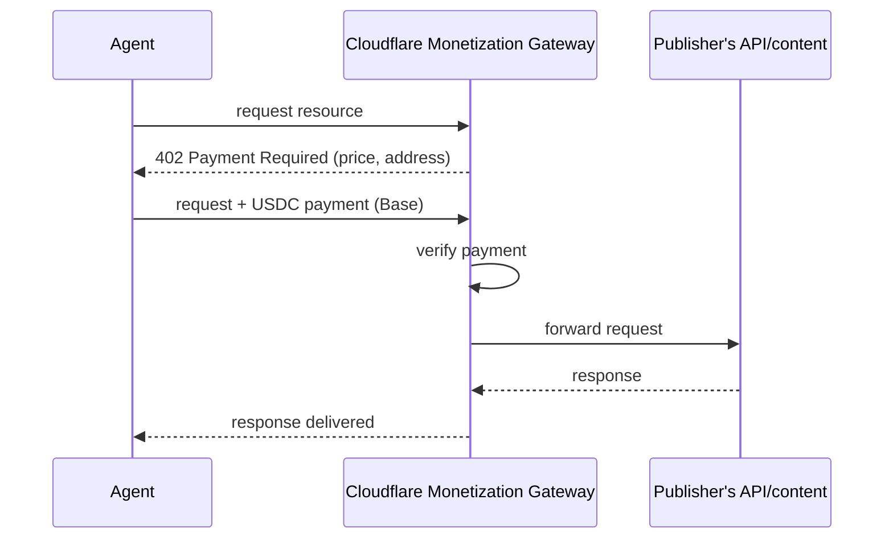

## Abstract

Cloudflare opened a closed beta of Monetization Gateway on September 30, letting any domain owner charge AI agents per request over HTTP 402 and settle in USDC on Base. It's the first production deployment of the x402 pattern from a platform this size, and Cloudflare's own AI Gateway is among the first paying customers _(vendor-stated)_ — though it arrives as reported x402 volume elsewhere has fallen 95% since January, a decline two analysts attribute mostly to wash trading rather than real demand. The same week produced three smaller but related moves: DoorDash put a text-to-order agent inside Apple Messages with no disclosed payment protocol behind it, Restate raised a $20M Series A on the bet that agent workflows need durable execution infrastructure most software never did, and Google Cloud shipped a remote MCP server for its CLI alongside general availability for Data Agent Kit. The named payment-protocol specs (x402, AP2, ACP, UCP, MPP, L402, Trusted Agent Protocol) stayed quiet for a fifth straight brief; everything that moved this window moved at the product layer.

## Introduction

This edition covers **2026-09-28 through 2026-10-01**. Background on the payment-rail side of the standing beat lives in the site's [agent commerce protocol comparison](../agent-commerce-protocol/) and [agent-to-merchant card-payments coverage](../agent-commerce-card-payments/). Three of the four items below landed on September 30; the fourth's underlying blog posts carry both a September 29 feed timestamp and an October 1 page-metadata timestamp, so it is included as in-window either way.

## What moved

### Cloudflare turns HTTP 402 into a working toll booth

The status code has existed since HTTP/1.1 and done nothing for three decades. Cloudflare's Monetization Gateway, in closed beta as of September 30, gives it a job: a domain owner sets a price (fixed or variable, matched against the URL, headers, or query parameters of an incoming request), and the gateway returns 402 to anyone who hasn't paid it[^s01]. "The gateway uses the HTTP 402 Payment Required status code so buyers can offer payment for a resource over HTTP, inline with the request for the resource itself"[^s01]. Settlement happens in USDC on Base, using the x402 protocol that Coinbase open-sourced. A Linux Foundation-governed body, with Visa, Mastercard, and Cloudflare itself among its founding members, took the protocol over as a formal standards body in July.

*The 402 round-trip happens before the origin server sees the request at all, so the publisher never has to build billing logic. That is why Cloudflare, not the content owner, is the one issuing the price.*

Four customers are named as already charging through the gateway during the beta: Cloudflare's own AI Gateway for inference, Ceramic.ai for web search, Stocktwits for market signals, and API2PDF for document generation[^s01]. That list comes from Cloudflare alone, with no disclosed transaction count, so it establishes that the pattern works in production somewhere, not that it has scale yet. The beta is US-only for both buyers and sellers for now.

Cloudflare's launch also lands against a discouraging trend for the rail it's built on. American Banker reported September 18 that daily payment volume across x402 fell from roughly $800,000 in January 2026 to about $40,000 in September, a 95% drop that two industry analysts attribute largely to wash trading and spoofed bot activity rather than genuine organic demand in the earlier figures[^s07]. That doesn't undercut the mechanism Cloudflare built; it does mean the biggest open question isn't whether per-request agent payments can work technically, but whether real, non-incentivized demand shows up once a platform this size offers the rail.

### DoorDash puts ordering inside a text thread

DoorDash announced a text-to-order AI agent on September 30, reachable through Apple Messages: a user types something like "order my usual," and the agent is supposed to infer which usual. "The agent will understand that they mean their Friday night order"[^s02]. It searches nearby restaurants, assembles a cart, texts back photos of what it's suggesting, and handles a group order with mixed dietary preferences and quantities[^s02]. It's in a US waitlist, not general availability, and TechCrunch's report, the only writeup found this window, says nothing about what sits underneath the checkout: no named payment protocol, no mention of a scoped credential distinct from a user's stored DoorDash card. Set against Stripe's Link wallet work covered in the prior two briefs, this is the same commerce trend arriving through a plainer door: no new rail, just a chat interface bolted onto checkout that already existed.

### Restate raises $20M on the argument that agents break normal infrastructure

Restate closed a $20M Series A led by Singular, with Redpoint Ventures and Capital One Ventures participating, announced September 30[^s03]. The company builds a durable-execution engine: its own storage and replication layers, not a wrapper around an external database, that keeps a multistep workflow's state intact across a crash or network drop. It wasn't built for agents originally, but agent workloads are what's driving the round. They run longer than a typical request-response service and take paths that aren't predictable in advance, which is exactly the failure mode durable execution exists to survive. Restate is now pitched directly against Temporal, which raised a $550M Series E at a $12.55B valuation the same month. That gap in scale says more about how much capital durable-execution infrastructure is pulling into this beat than about which vendor wins.

### Google Cloud opens two more doors through MCP

Google Cloud shipped a pair of agent-tooling releases in the same week: a remote MCP server for the Google Cloud CLI, in public preview, giving an agent "immediate, broad access to command-line operations for managing Google Cloud infrastructure and working with advanced BigQuery workflows"[^s04]; and general availability for Data Agent Kit, "a free set of Model Context Protocol (MCP) tools and agent skills that lets the coding agent you already use work directly with your Google Cloud data products," connecting to more than 15 Google Data Cloud services[^s05]. Neither post frames the other as part of a bundle. They're two separate teams shipping on the same underlying bet: that MCP is the integration layer an outside coding agent should reach Google Cloud through, instead of a custom SDK per agent framework. It's a smaller move than the other three items, but it's the same pattern AWS, Cloudflare, and Anthropic have all converged on this year: publish an MCP server and let the ecosystem's agents find it, instead of building a distribution channel yourself.

## Why it matters

Three of these four items share a shape: a platform that already sits between an agent and something it needs (compute, a merchant, cloud infrastructure) added a metered or more durable way to let the agent reach through it. None of them required a new payment standard to ship. Cloudflare settled on x402 because the standard already existed and Cloudflare didn't have to invent a mandate chain the way AP2 does; DoorDash and Google Cloud didn't touch the payment-protocol layer at all. That's the throughline worth naming against the specs this beat tracks by name: x402, AP2, ACP, UCP, MPP, L402, and Trusted Agent Protocol have now gone five briefs without a checkable spec change, while the platforms sitting on top of them keep shipping. The protocols aren't dead (Cloudflare's own gateway depends on one of them working), but the pace of visible progress has shifted almost entirely to the companies building products against a spec that's already stable enough to build on.

## Signals to watch

- Whether Cloudflare discloses a transaction count or expands Monetization Gateway beyond its US-only beta.
- Whether DoorDash's agent surfaces a distinct payment credential once it leaves the waitlist, or stays routed through existing checkout.
- Restate's and Temporal's next moves as durable-execution infrastructure becomes a contested category rather than a niche.
- Any x402, AP2, ACP, UCP, MPP, L402, or Trusted Agent Protocol spec commit, release, or filing — absent for five consecutive briefs now.

## Limitations

DoorDash's own announcement was not independently located; the "What moved" section on it relies entirely on TechCrunch's reporting. Cloudflare's beta-customer list and the claim that x402 is settling real transactions through the gateway are vendor-stated, with no independent volume figure. The MPP-specs check covered only `tempoxyz/mpp-specs`'s merged pull requests in-window, which were a CI Actions-pinning commit[^s06]. That rules out spec movement on GitHub specifically, not movement anywhere else. Feeds, web search, and GitHub were all reachable this window; nothing from X or LinkedIn was read directly, and the papers lane turned up two AP2-adjacent arXiv papers whose publication dates could not be confirmed as falling inside this window, so neither is cited.
