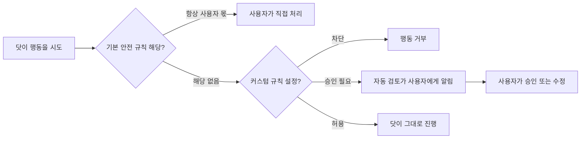

## 초록

OpenAI는 9월 29일 데브데이에서 "닷츠(dots)"를 공개했다. 자체 클라우드 컴퓨터에서 상시 작동하며 ChatGPT, Slack, Teams로 접근할 수 있는 에이전트다. 기업용 버전인 "스페셜리스트 닷츠"는 배포한 직원과는 별개로 자체 신원과 자격 증명을 부여받고, Microsoft Agent 365를 통해 관리된다. 이틀 뒤, 이 브리프가 다섯 번 연속 조용하다고 기록해온 결제 프로토콜 스펙 두 개가 동시에 움직였다. x402 Go SDK는 솔라나 배치 정산 기능을 병합하면서 위임 호출자 신원 요구사항을 함께 넣었고, Tempo가 관리하는 MPP 스펙은 누가 수수료를 낼 수 있는지를 명확히 했다. 한편 메시징 에이전트 스타트업 Photon은 450만 달러 시드 투자를 유치했다. 이번 주 움직임 중 에이전트 간 상거래 결제 자체가 진전된 것은 없다. 대신 아무 관계도 없는 소비자 제품 출시와 프로토콜 버그 수정 사이를 신원·인가 문제가 연결 고리처럼 관통했다.

## 서론

이번 호는 **2026-09-29부터 2026-10-02까지**를 다룬다. 결제 레일 쪽 배경은 사이트의 [에이전트 상거래 프로토콜 비교](../agent-commerce-protocol/)와 [에이전트-가맹점 카드 결제 커버리지](../agent-commerce-card-payments/)에 있다. 직전 호는 Cloudflare의 Monetization Gateway 출시와 다섯 번째 연속 조용한 프로토콜 스펙 구간을 다뤘다.

## 무엇이 움직였나

### OpenAI, 에이전트에게 할 일 목록이 아니라 신원을 부여하다

닷츠는 메타의 Muse에 대한 OpenAI의 답이자, 두 회사가 지금 막 정의하려 경쟁하는 "보지 않아도 알아서 일하는 AI 에이전트" 범주의 산물이다. 제품 자체는 완전히 새로운 종류는 아니다. 브라우저와 앱 접근 권한을 가진 클라우드 호스팅 에이전트는 Operator 때부터 있었다. 다만 이번 발표 글에는 이 베이트와 관련해 새로운 디테일이 두 가지 있다. 첫째, 승인 모델이 전부 허용 아니면 전부 금지가 아니라 명시적이고 단계적이다.

*닷의 행동이 실행되기 전 거칠 수 있는 다섯 경로 중 네 가지. "허용"만이 사람의 확인 단계를 건너뛰며, 비밀번호 변경 같은 행동은 애초에 이 경로에 들어오지 않는다.*

둘째, 이 베이트에 더 직접적으로 닿는 지점인데, 기업용 "스페셜리스트 닷츠"는 배포한 직원의 신원을 물려받지 않는다. OpenAI는 각 닷에게 "자체 신원, 자격 증명, 그리고 필요한 시스템에 대한 접근 권한"을 부여하며, 이는 조달·송장 처리·상업 계약 분야의 파일럿에서 다져진 것이고, 이 신원 모델을 Microsoft Agent 365의 거버넌스·보안 통제와 연동하고 있다[^s01]. 결제 쪽에서 Visa의 Trusted Agent Protocol이나 Ant·Mastercard·Visa의 KYA 프레임워크가 풀려는 문제와 본질적으로 같은 문제를 더 작고 구체적인 형태로 풀어낸 셈이다. 조직을 대신해 행동하는 에이전트는 그 조직을 가동한 사람과 별개로 구분되고, 감사 가능하고, 철회 가능해야 한다. OpenAI는 업계 공통 표준이 자리 잡기를 기다리지 않고 이 구분을 자사 제품 안에 먼저 심고 있다.

이번 발표에서 아직 빠진 것은 독립적인 검증이다. 이번 주 창에서 OpenAI 자사 블로그와 데브데이 리캡 외에 발견된 유일한 커버리지는, 닷용 프롬프트 디렉터리를 만든 개발자가 올린 Hacker News Show HN 게시물뿐이다. 이 글은 커스텀 규칙 동작 방식을 독립적으로 확인해주긴 하지만 신원 아키텍처에 대해서는 아무것도 더해주지 않는다[^s02][^s03]. _(벤더 진술)_

### 결제 프로토콜 스펙, 다섯 호 만에 처음 움직이다

x402와 MPP는 8월 31일 호 이후로 이 브리프의 "무엇이 움직였나" 섹션에 한 번도 등장하지 않았다. Cloudflare, DoorDash, Google Cloud가 그 위에 제품을 계속 쌓아 올리는 동안 x402, AP2, ACP, UCP, MPP, L402, Trusted Agent Protocol 등 이름이 걸린 프로토콜은 모두 가만히 있었다. 그게 사흘 사이에 두 번 바뀌었다. 9월 29일, x402 Go SDK는 솔라나 VM 배치 정산 기능을 병합했는데, 같은 PR 안에 정산 기능 자체보다 더 중요한 저장소 변경이 묻혀 있었다. 한쪽이 다른 쪽을 대신해 결제하는 위임 거래는 이제 `ResolveCallerIdentity` 또는 `DelegatedReceiverAuth` 콜백을 명시적으로 거쳐야만 결제 채널에 기록된다[^s04]. 10월 1일에는 Tempo가 관리하는 MPP 스펙이 한 줄짜리 수정을 병합해, 클라이언트뿐 아니라 스폰서도 거래 수수료를 낼 수 있다는 점을 명확히 했다. `mppx` SDK가 이미 그렇게 동작하고 있던 것을 스펙 문구가 뒤늦게 따라잡은 셈이다[^s05].

둘 다 기능 발표는 아니다. 메인테이너들이 스펙 문구와 실제 구현 사이에 벌어진 틈을 메운 것에 가깝다. 투자 유치나 제품 출시보다는 조용한 종류의 움직임이지만, 다섯 호 만에 처음으로 이 스펙들을 여전히 누군가 돌보고 있다는, 그래서 구현이 문구보다 너무 앞서 나가기 전에 격차를 좁히고 있다는 증거다.

### Photon, 에이전트가 앱 대신 문자 창에 산다는 데 450만 달러를 걸다

Photon은 Gradient와 A*가 공동 주도한 450만 달러 시드 라운드를 마감했다. 개발자들이 독립 앱이 아니라 iMessage, WhatsApp, Telegram, SMS/RCS, 이메일, 음성을 통해 닿을 수 있는 에이전트를 만들도록 돕는 도구다[^s06]. 회사는 개발자 가입 4만 건 이상, 4개월간 매출 10배 성장을 내세우는데, 모두 회사 측 수치이고 독립적으로 검증되지는 않았다. 이 베팅은 DoorDash나 Cloudflare보다 범위가 좁다. 새로운 결제 레일이나 신원 계층이 필요하다는 게 아니라, 사용자가 열어야 하는 앱이라는 인터페이스 자체가 에이전트에게 가장 먼저 밀려날 대상이라는 주장이다. _(벤더 진술)_

## 왜 중요한가

이번 주 서로 무관한 세 팀이 서로 무관한 문제를 풀었는데, 세 해법 모두 신원 문제를 건드렸다. OpenAI가 기업용 에이전트에게 자체 자격 증명을 준 것은 직원처럼 행동하는 에이전트는 직원처럼 통제되어야 하기 때문이다. x402 메인테이너들이 위임 신원 요구사항을 추가한 것은, 누구든 남을 대신해 결제한다고 주장할 수 있는 결제 채널은 악용되기 마련이기 때문이다. 두 팀은 서로를 의식하지 않았고, 어느 쪽도 Visa의 Trusted Agent Protocol이나 카드 네트워크가 9월에 발표한 KYA 프레임워크를 향해 나아가고 있지 않다. 그런데도 문제의 모양은 같다. 에이전트가 돈을 쓰거나 계약에 서명하거나 운영 시스템을 건드리는 등 결과를 낳는 행동을 할 수 있게 되는 순간, "어떤 에이전트가, 누구를 대신해, 어떤 권한으로" 움직이는지는 더 이상 부가 정보가 아니라 시스템 전체가 기대는 토대가 된다. 이 문제를 정면으로 풀려고 만들어진 스펙들, Trusted Agent Protocol과 KYA는 여전히 조용하다. 답이 필요한 회사들은 서로 아무 공통점도 없는 제품 안에서 각자 조각조각 그 답을 만들고 있다.

## 지켜볼 신호

- 스페셜리스트 닷츠의 신원 체계가 다른 결제 프로토콜의 신원 계층과 연동될지, 아니면 OpenAI와 Microsoft Agent 365 안에만 머물지.
- x402의 위임 호출자 신원 콜백을 레퍼런스 구현 너머 실제 퍼실리테이터가 채택하는지. SDK에 기능이 있다는 것과 실제로 쓰인다는 것은 다르다.
- MPP와 x402의 이번 병합이 재개된 리듬의 시작인지, 아니면 저장소마다 하나씩 생긴 고립된 수정인지. 저장소당 데이터 포인트 하나로는 아직 추세라 부르기 이르다.
- OpenAI 자체 채널과 애그리게이터 보도 바깥에서 닷츠에 대한 독립 보도가 나오는지.

## 한계

닷츠 항목은 OpenAI 자사 블로그와 데브데이 리캡, 그리고 Hacker News 게시물 하나에 의존한다. TechCrunch와 The Verge가 쓴 닷츠·Muse 경쟁 기사는 이번 창에서 가져올 수 없었고, 그래서 출시 자체에 대한 독립 보도는 인용하지 못했다. Visa, Mastercard, KYA 프레임워크 등 카드 네트워크 쪽 뉴스는 72시간 창 안에 들어온 것이 없다. 가장 최근 KYA 관련 소식은 9월 10일자다. ACP와 AP2의 GitHub 저장소는 창 안에 병합된 PR이 없어 이번 호에도 조용하다. Photon의 성장 지표는 벤더 진술이다. 피드, 웹 검색, GitHub 레인은 모두 이번 창에서 접근 가능했다. X나 LinkedIn에서 직접 읽은 내용은 없다.
