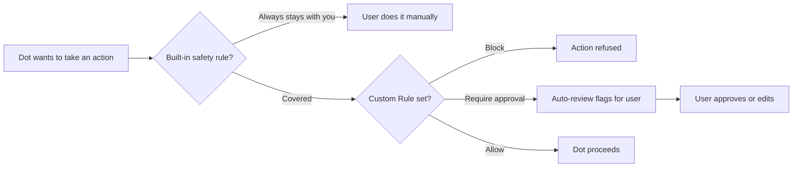

## Abstract

OpenAI used DevDay on September 29 to ship "dots," an always-on agent that runs on its own cloud computer, reachable from ChatGPT, Slack, and Teams. Its enterprise variant, "specialist dots," gets its own identity and credentials separate from the employee who deployed it, governed through Microsoft Agent 365. Two days later, the payment-protocol specs this beat has tracked as dormant for five straight briefs both moved: the x402 Go SDK merged Solana batch-settlement with a delegated-caller-identity requirement, and the Tempo-maintained MPP spec clarified who can pay a transaction's fees. Separately, messaging-agent startup Photon raised a $4.5M seed on the bet that agents replace apps before they replace websites. None of this is agent-to-merchant payments moving forward on its own terms. It's identity and authorization showing up as the connective tissue between a consumer product launch and a protocol-layer bug fix that otherwise have nothing to do with each other.

## Introduction

This edition covers **2026-09-29 through 2026-10-02**. Background on the payment-rail side of the standing beat lives in the site's [agent commerce protocol comparison](../agent-commerce-protocol/) and [agent-to-merchant card-payments coverage](../agent-commerce-card-payments/); the prior edition tracked Cloudflare's Monetization Gateway launch and a fifth consecutive quiet window for the named protocol specs.

## What moved

### OpenAI gives agents their own identity, not just their own task list

Dots are OpenAI's answer to Meta's Muse and the "AI agent that works while you don't watch it" category both companies are now racing to define. The product itself is not new in kind (a cloud-hosted agent with browser and app access has existed since Operator), but two details in the launch post are new to this beat. First, the approval model is explicit and tiered rather than all-or-nothing:

*Four of the five paths a dot's action can take before it executes — only "Allow" skips a human checkpoint, and changing a password never reaches that path at all.*

Second, and more relevant to the standing beat, enterprise "specialist dots" don't inherit the deploying employee's identity. OpenAI gives each one "its own identity, credentials, and access to the systems it needs," built from pilots in procurement, invoice processing, and commercial contracting, and is wiring that identity model into Microsoft Agent 365's governance and security controls[^s01]. That is a smaller, more concrete version of the same problem Visa's Trusted Agent Protocol and the Ant/Mastercard/Visa KYA framework exist to solve on the payment side: an agent acting on an organization's behalf needs to be distinguishable, auditable, and revocable independent of the human who turned it on. OpenAI isn't waiting for a cross-vendor standard to settle that; it's building the distinction into its own product now.

What the launch does not have is independent scrutiny yet. The only coverage found this window beyond OpenAI's own blog and DevDay recap is a Hacker News Show-HN post from a developer building a prompt directory for dots, which independently confirms the Custom Rules mechanic but adds nothing about the identity architecture[^s02][^s03]. _(vendor-stated)_

### The payment-protocol specs move for the first time in five briefs

x402 and MPP have gone unmentioned in this beat's "what moved" section since the edition covering August 31; every named protocol (x402, AP2, ACP, UCP, MPP, L402, Trusted Agent Protocol) sat still while Cloudflare, DoorDash, and Google Cloud shipped products on top of them. That changed twice in three days. On September 29, the x402 Go SDK merged Solana-VM batch-settlement support, and buried in the same PR is a storage change that matters more than the settlement feature itself: delegated transactions, where one party pays on behalf of another, now require an explicit `ResolveCallerIdentity` or `DelegatedReceiverAuth` callback before the payment channel will record them[^s04]. On October 1, the Tempo-maintained MPP spec merged a one-line fix clarifying that a sponsor, not just the client, can cover a transaction's fees, matching behavior the `mppx` SDK already had[^s05].

Neither is a feature announcement; both are maintainers closing a gap between what the spec said and what implementers were already doing. That's a quieter kind of movement than a funding round or a product launch, but it's the first evidence in five briefs that someone is still actively tending these specs, closing the gap before implementations drift too far ahead of the text.

### Photon raises $4.5M betting the agent lives in the text thread, not an app

Photon closed a $4.5M seed, co-led by Gradient and A*, for tooling that lets developers build agents reachable through iMessage, WhatsApp, Telegram, SMS/RCS, email, and voice instead of a standalone app[^s06]. The company reports over 40,000 developer sign-ups and 10x revenue growth in four months, numbers from the company that nobody has independently verified. The bet is narrower than DoorDash's or Cloudflare's: not that agents need a new payment rail or a new identity layer, but that the interface itself, an app a user has to open, is the thing agents make obsolete first. _(vendor-stated)_

## Why it matters

Three unrelated teams solved three unrelated problems this week, and all three solutions touched identity. OpenAI gave its enterprise agents their own credentials because an agent that acts like an employee needs to be governed like one. x402's maintainers added a delegated-identity requirement because a payment channel that lets anyone claim to be paying on someone else's behalf is a payment channel waiting to be abused. Neither team was responding to the other, and neither is building toward Visa's Trusted Agent Protocol or the KYA framework the card networks announced in September. But the shape of the problem is the same. As soon as an agent can act with consequence (spend money, sign a contract, touch a production system), "which agent, acting for whom, with what authority" stops being optional metadata and becomes the thing the whole system depends on. The specs built explicitly to solve that, Trusted Agent Protocol and KYA, are still quiet. The companies that need the answer anyway are building it themselves, piecemeal, inside products that have nothing else in common.

## Signals to watch

- Whether specialist-dots identity integrates with any payment-protocol identity layer, or stays siloed inside OpenAI and Microsoft Agent 365.
- Adoption of x402's delegated-caller-identity callback by a facilitator beyond the reference implementation — an SDK capability is not yet a used one.
- Whether the MPP and x402 merges are the start of a resumed cadence or two isolated fixes; one data point per repo is not a trend yet.
- Any independent reporting on dots beyond OpenAI's own channels and aggregator coverage.

## Limitations

The dots item rests on OpenAI's own blog post and DevDay recap plus one Hacker News thread; TechCrunch's and The Verge's writeups on the dots/Muse rivalry could not be fetched this window, so no independent reporting on the launch itself is cited. No card-network news (Visa, Mastercard, the KYA framework) fell inside the 72-hour window — the most recent KYA development dates to September 10. ACP and AP2's GitHub repositories had no merged pull requests in-window and stay silent this edition. Photon's growth figures are vendor-stated. Feeds, web search, and GitHub were all reachable this window; nothing from X or LinkedIn was read directly.
