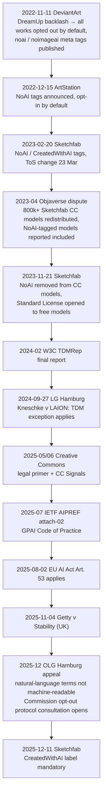
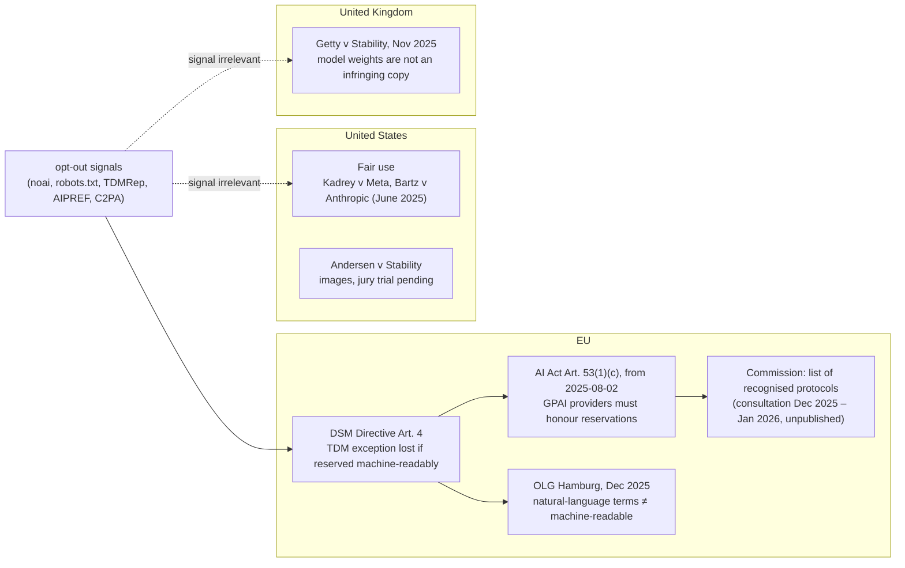

## Abstract

In February 2023 Sketchfab introduced a NoAI tag, an HTML meta tag telling generative AI systems that a model "is not to be used for generative AI data collection". Nine months later it removed the tag from Creative Commons models, and said why: "the CC license may allow use of the work by generative AI programs regardless of the tag." Between the two posts, Objaverse had redistributed 800,000 of Sketchfab's CC models as a training dataset, one that still feeds generative-3D models such as TripoSR. This report takes Sketchfab's trajectory as the starting point and examines copyright protection from AI training on four layers. Signals (noai meta tags, robots.txt, TDMRep, IETF AIPREF, C2PA/CAWG assertions, CC Signals) carry no enforcement, and no major AI company honours noai. Contracts (platform terms, Sketchfab's Standard License) bind only those who download. Law splits by jurisdiction: the EU made compliance with machine-readable opt-outs a duty for GPAI providers under Article 53 of the AI Act, the Hamburg Higher Regional Court held in December 2025 that natural-language terms are not machine-readable, and two US district courts found LLM training to be fair use in June 2025. Technology (Glaze, Nightshade) was judged "a false sense of security" by two 2025 papers. Sketchfab's lesson is a single one: there is no way to publish under CC and still forbid AI training. To forbid it, change the licence itself, and even then, outside the EU, the prohibition reaches only the other party to the contract.

## 1. Introduction

The two posts are from the same platform, nine months apart. On 20 February 2023 Sketchfab announced NoAI: "the 'NoAI' model tag will indicate to generative AI programs that a particular model is not to be used for generative AI data collection." An account setting could "Add 'NoAI' meta tags to all uploads", and Sketchfab itself "agrees not to use any of your uploads in datasets for, in the development of, or as inputs to generative AI programs" nor to license them to third parties for that purpose. The terms changed on 23 March[^s01]. The second post, 21 November 2023, reverses course: "Creators can no longer apply NoAI tags to new Creative Commons-licensed uploads." Free models may instead use the Standard License, and carry NoAI there. The reason: "the CC license may allow use of the work by generative AI programs regardless of the tag", whereas on Standard-licensed models the tag "becomes contractually enforceable [...] once they have been downloaded from Sketchfab"[^s02].

The first post created a signal. The second conceded that a signal is not enough. What happened in between, and which of the four layers, signal, contract, law, technology, actually does anything, is the question here.

## 2. What happened

_Figure 1 — November 2022 to December 2025. Platform tagging (top) ran two years ahead of law and standards (bottom), and the datasets were built in between.[^s01][^s02][^s03][^s04][^s06][^s08][^s11][^s13][^s16][^s21][^s22][^s25]_

### 2.1 Where noai came from: DeviantArt

The meta tag is DeviantArt's. On 11 November 2022, under pressure after launching its own generator DreamUp, it flipped the default: "All deviations on the platform are not authorized for inclusion in third-party datasets used to train artificial-intelligence models — unless you choose to opt in." It published `<meta name="robots" content="noai">` and `noimageai`, and the same values as `X-Robots-Tag` headers, asked third parties to "ensure their training data set excludes all content for which either of these directives are present", and encouraged other platforms to adopt them[^s04] _(unverified — single source)_.

ArtStation followed a month later with the opposite default. On 15 December 2022 it announced tags to "explicitly allow or disallow the use of their art for training" but said "we don't plan to add either of these tags by default, in which case the use of the art by AI will be governed solely by copyright law"[^s21]. Sketchfab was opt-in too, and saw no comparable backlash "partly because most 3D workflows do not currently rely on generative AI programs"[^s03].

### 2.2 Objaverse

Two months before Sketchfab's tag, Allen AI released Objaverse: "800K+ (and growing) 3D models with descriptive captions, tags, and animations", with "training generative 3D models" as the first listed application[^s07]. In April 2023 The Decoder set out three problems. The models "were made downloadable for free on Sketchfab under Creative Commons licenses"; the dataset "includes 3D models whose creators have set the NoAI tag, which Sketchfab introduced in February"; and Sketchfab's answer was "They did this before us implementing the noai tag [...] We understand artists' concerns and are looking into it"[^s06].

The dataset did not go away. Objaverse-XL grew to ten million objects in July 2023[^s24], and in March 2024 TripoSR, from Stability AI and Tripo, stated in its model card that it trained on "a carefully curated subset of the Objaverse dataset [...] available under the CC-BY license"[^s27]. NoAI did not reach back into datasets built before it existed, and "CC-BY subset" is a selection criterion in which the tag plays no part.

### 2.3 Sketchfab's retreat

The November 2023 post answers that situation. Sketchfab took NoAI off CC models and let free models use the Standard License, which "permits worldwide use for all types of use (whether commercial and non-commercial), in all types of derivative works. No credit needs to be given", but now with a NoAI clause attached by contract[^s02]. The current terms read: "you shall not collect, aggregate, mine, scrape, or otherwise use NoAI Content (i) in datasets utilized by Generative AI Programs; (ii) in the development of Generative AI Programs"[^s28]. The basis of protection moved from a tag to a licence agreement. That agreement binds whoever downloads from Sketchfab and accepts the terms. A scraper who never accepted them is not bound.

From 11 December 2025 the other direction became mandatory too: "If you make User Content available and such User Content is created using Generative AI Programs, you must label such User Content as 'CreatedWithAI'"[^s28], for every AI-generated model whether downloadable or not, with Sketchfab able to apply the label automatically on detection[^s08]. It arrived with the Fab consolidation after Epic's acquisition.

## 3. The signal layer: who reads what

Sketchfab's NoAI was "an HTML meta tag that appears in the model's webpage on the site" readable by crawlers, and "initially carried no legal enforcement"[^s03]. By 2026 there are six signals of that kind.

| Signal | Form | Origin | Enforcement |
|---|---|---|---|
| noai / noimageai | `<meta name="robots">`, `X-Robots-Tag` | DeviantArt, 2022 | None; major AI firms use separate robots.txt tokens[^s05] |
| robots.txt | `/robots.txt` | 1994 convention → RFC 9309 | "not a form of access authorization"[^s19] |
| TDMRep | `tdm-reservation` header, meta, `/.well-known/tdmrep.json` | W3C CG, 2024 | Machine-readable form of the EU DSM Art. 4 opt-out[^s12] |
| AIPREF Content-Usage | HTTP header + robots.txt rule | IETF WG, 2025– | Enforcement outside the charter[^s11] |
| CAWG training-mining | C2PA manifest assertion | CAWG, 2025 | Declares allowed / notAllowed / constrained[^s18] |
| CC Signals | Preference next to the licence | Creative Commons, 2025 | "legally binding in some cases and normative in others"[^s10] |

There is one vendor measurement of noai's spread. Originality.AI counted "88,000+ domains" using noai or noimageai in its sample as of June 2026: 87.8% via meta tag, 26.7% via header, 14.5% both[^s05] _(vendor-stated)_. Compliance is another matter. As the same post puts it, "where large AI firms offer opt-outs, they have generally done so via robots.txt crawler tokens, such as Google-Extended [...] GPTBot [...] rather than honoring the noai meta tag specifically", and "Google's own robots meta specification does not list noai"[^s05]. A four-year-old signal emitted by eighty thousand domains, with no large operator committed to reading it.

robots.txt became a standard without changing character. RFC 9309 states that "these rules are not a form of access authorization" and that the protocol "is not a substitute for valid content security measures"[^s19]. IETF AIPREF layers a `Content-Usage` header and a robots.txt `content-usage` rule on top, so that a preference such as `train-ai=n` can be attached per path[^s11]; that its charter excludes enforcement is covered in another report on this site. The C2PA family puts the declaration inside the file. CAWG's `cawg.training-mining` assertion records "allowed, notAllowed, or constrained" for each of `ai_training`, `ai_generative_training`, `data_mining` and `ai_inference`, and "in the absence of additional information, constrained shall be treated as equivalent to notAllowed"[^s18]; it replaced the `c2pa.` prefixed assertions of C2PA 1.4. Creative Commons launched CC Signals in June 2025 as "a new preference signals framework designed to increase reciprocity and sustain a creative commons in the age of AI", and wrote its own caveat: "While CC signals may range in enforceability, legally binding in some cases and normative in others, their application will always carry ethical weight"[^s10] _(unverified — single source)_.

What the six share is dependence on the reader's goodwill. What separates them is which ones the law recognises as a "machine-readable" opt-out, and that answer is in §5.

## 4. The contract layer: CC and NoAI do not coexist

The conclusion Sketchfab reached in November 2023, Creative Commons confirmed in its May 2025 legal primer in nearly the same words: "AI training is often permitted by copyright. This means that the CC license conditions have limited application to machine reuse", and "using a more restrictive CC license in an effort to prevent AI training is not an effective approach"[^s09] _(unverified — single source)_. A CC licence attaches conditions to acts that copyright reaches. When training falls under an exception (fair use, a TDM exception), the licence conditions never trigger, and a NoAI tag stacked on top goes with them.

Sketchfab's answer was to go around the exception and into contract. The Standard License, unlike CC, is an agreement between Sketchfab and the downloader, and a NoAI clause in it is "contractually enforceable [...] once they have been downloaded"[^s02]. Its reach is exactly the parties to the contract. A platform-wide scraper like Objaverse never clicked through the terms, and a downstream reuser of an already-distributed dataset (TripoSR) has no relationship with Sketchfab at all. This report found no instance of Sketchfab enforcing the clause against any dataset or model.

## 5. The legal layer: jurisdictions diverge

_Figure 2 — The weight one signal carries by jurisdiction. Only in the EU is a signal wired into a legal condition (Art. 4) and a duty (Art. 53); US and UK decisions judged the act of training without reference to signals.[^s15][^s16][^s22][^s25][^s29][^s14]_

### 5.1 EU: the only jurisdiction that gives signals legal weight

Article 4 of the DSM Directive permits commercial TDM "on the condition that the use of content for TDM has not been expressly reserved by their rightsholders in an appropriate manner, such as machine-readable means"[^s12]. Article 53(1)(c) of the AI Act makes honouring that reservation a duty for GPAI providers, and by recital 106 it applies "regardless of the jurisdiction in which the copyright-relevant acts underpinning the training [...] take place", from 2 August 2025[^s16]. The GPAI Code of Practice commits signatories to "employ the crawlers that read and follow instructions expressed in accord with the Robot Exclusion Protocol"[^s17].

What counts as "machine-readable" is being settled by courts and the Commission, and two rulings point opposite ways. Of the Hamburg Regional Court (27 September 2024), the European Parliament's research service wrote that it "ruled that including the opt-out in 'natural language' – for instance in terms of use – qualifies as a machine-readable opt-out", noting experts expected an appeal[^s16]. The Higher Regional Court (5 U 104/24, 10 December 2025) reversed that point: "Rights holders can block TDM uses, but only if the opt-out is expressed in a machine-readable format", and "general terms of use or human-readable disclaimers are insufficient"; its practical advice is "robots.txt, TDM Reservation Protocol, metadata tags"[^s29]. Appeal to the Federal Court of Justice was allowed[^s25]. A vendor summary draws one further implication: content scraped before a machine-readable signal was in place "remains lawfully available for AI training"[^s25] _(vendor-stated)_, which is exactly Sketchfab's "they did this before the tag" problem restated as law.

The Commission is building the list of recognised protocols. A consultation ran from 1 December 2025 to 23 January 2026 with EUIPO support, to identify protocols that are "state-of-the-art, technically implementable, and widely adopted by rightsholders across different cultural and creative sectors"; the Commission "will publish the list of generally-agreed machine-readable opt-out solutions", reviewed "at least every two years"[^s22] _(unverified — single source)_. As of September 2026 no list has been published. Which of robots.txt, TDMRep, AIPREF and C2PA make it onto it will fill in the enforcement column of the table in §3.

One structural limit the Parliament's researchers named applies to Sketchfab exactly: "the opt-out mechanism is likely to fail whenever rights-holders do not have the administrative rights for the webpage displaying their works"[^s16]. The party that can attach the tag is the platform, not the artist.

### 5.2 United States: fair use, not signals

In the US a signal is not a legal instrument. In June 2025 two district courts found LLM training to be fair use. Bartz v Anthropic (23 June) called training "exceedingly transformative" but separated acquisition: "pirating copies to build a research library without paying for it [...] was its own use—and not a transformative one." Kadrey v Meta (25 June) went to Meta because the plaintiffs failed to show market harm, with the judge adding that the ruling "does not stand for the proposition that Meta's use of copyrighted materials to train its language models is lawful. It stands only for the proposition that these plaintiffs made the wrong arguments"[^s15] _(unverified — single source)_. Both concern text. Andersen v Stability AI, the image case with DeviantArt among the defendants, survives on direct infringement and Lanham Act claims with the DMCA §1202 claims dismissed with prejudice[^s26], and its trial date has slipped from 8 September 2026 to 5 April 2027[^s23] _(unverified — single source, tier-5 tracker)_.

### 5.3 United Kingdom

In Getty v Stability AI (4 November 2025), after Getty withdrew its primary claims for lack of evidence that training happened in the UK, only secondary infringement remained, and the court held that "the model weights are not themselves an infringing copy and they do not store an infringing copy". It "does not decide whether UK-based web scraping and model training would infringe"[^s14]. The ruling is silent on signals, but by declining to treat a trained model as a copy it bears on how far an opt-out could reach (the act of training versus the resulting artefact).

## 6. The technology layer: a false sense of security

Since neither signal, contract nor law physically stops a scraper, artists turned to adversarial perturbation: Glaze against style mimicry, Nightshade to poison training. Two 2025 papers took both apart. Hönig, Rando, Carlini and Tramèr (ICLR 2025) found the tools "only provide a false sense of security", that "image upscaling" and similar simple techniques "are sufficient to create robust mimicry methods that significantly degrade existing protections", and that "all existing protections can be easily bypassed, leaving artists vulnerable to style mimicry"[^s13]. LightShed (USENIX Security 2025) is "a generalizable depoisoning attack that effectively identifies poisoned images and removes adversarial perturbations", with "a TPR of 99.98% and TNR of 100% on detecting NightShade", one model recognising both Glaze and Nightshade[^s20]. The first paper's recommendation is non-technological solutions[^s13], which sends the reader back to §3–5.

## 7. Analysis

**What Sketchfab did was a rare piece of candour.** Most platforms added a tag and stopped. Sketchfab admitted within nine months that "CC + NoAI" could not be enforced and changed its licence[^s02]. That Creative Commons reached the same conclusion eighteen months later[^s09] means Sketchfab was right, and also that no tag will help the millions of assets already published under CC.

**Time beats signals.** Objaverse was built two months before the tag[^s06]; on the Hamburg court's logic, what was collected before a machine-readable signal stays lawful[^s25]; TripoSR trained on "a CC-BY subset"[^s27]. Models by creators who tagged after February 2023 are still being trained on from copies taken when no tag existed. No layer reverses that.

**Only the EU turns a signal into law, and it has not yet said which signal.** Article 53 demands "machine-readable", the Higher Regional Court excluded natural language, and the Commission's list is unpublished. If Sketchfab's noai meta tag makes the list, GPAI providers on the EU market must read it. If not, eighty thousand domains' meta tags keep relying on goodwill. In the US there is no list, and fair use bypasses the signal altogether.

**Contract has an exact reach.** The Standard License's NoAI clause binds downloaders. It does not bind scrapers or dataset reusers. That there is no record of Sketchfab suing under it is probably less a sign of a weak clause than of counterparties who sit outside it.

**3D is worse off than images.** Image artists at least had Glaze (until they did not). This research found no perturbation tool for 3D meshes, and Objaverse-XL has grown to ten million objects across GitHub, Thingiverse and Sketchfab[^s24]. Sketchfab's mandatory CreatedWithAI[^s08] is the opposite marker, for filtering AI output, and does nothing for originals.

For a creator the practical order is this. Publishing under CC means giving up on restricting AI training. To restrict it, pick a contractual licence instead (on Sketchfab, Standard), and if you control a domain, turn on robots.txt, TDMRep and AIPREF all three. Only providers on the EU market are obliged to read them, and what has already been scraped does not come back.

## 8. Limitations

- The second source for Sketchfab's November 2023 post (CG Channel's November article) returned 404 and its email mirror 403; only a search abstract was seen. Quotations rely on Sketchfab's own post.
- The DeviantArt journal, the CC legal primer, CC Signals, the Commission consultation and the Kadrey/Bartz summary are each a single primary source.
- The OLG Hamburg judgment was read through a law-firm summary (NRF) and a vendor summary (Encypher), not the judgment. Bird & Bird's analysis returned HTTP 402; DLA Piper's page held a teaser. The "time of collection" reading is the vendor summary's inference.
- The Andersen trial-date slip appears only on a tier-5 tracker; CourtListener returned 403.
- No AI clause was found on Sketchfab's License Agreement page; the clause lives on the Terms of Use page.
- Whether any generative-3D model actually filtered NoAI-tagged models could not be confirmed.
- The noai adoption figure is Originality.AI's own sample.
- The Commission's list of recognised protocols is unpublished as of 2026-09-16; its publication changes the enforcement column of the §3 table.
