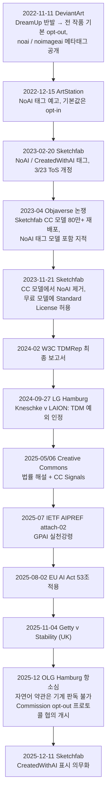
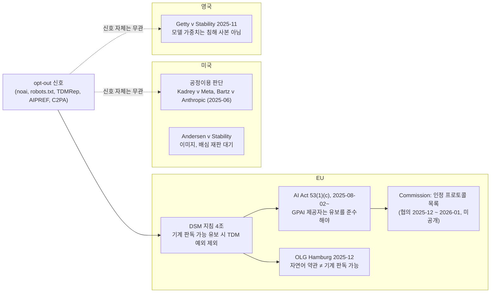

## 초록

Sketchfab은 2023년 2월 NoAI 태그를 도입하며 "이 모델은 생성형 AI 데이터 수집에 쓰지 말라"는 신호를 HTML 메타태그로 내보내기 시작했고, 아홉 달 뒤 그 태그를 Creative Commons 모델에서 떼어냈다. 이유는 플랫폼 스스로 적었다. "CC 라이선스는 태그와 무관하게 생성형 AI 사용을 허용할 수 있다." 이 두 글 사이에 Objaverse가 Sketchfab의 CC 모델 80만 개를 학습 데이터셋으로 재배포한 사건이 있었고, 그 데이터셋은 지금도 TripoSR 같은 생성형 3D 모델의 학습 재료다. 이 보고서는 Sketchfab의 궤적을 출발점으로 AI 학습으로부터의 저작권 보호를 네 층으로 나눠 검토한다. 신호(noai 메타태그, robots.txt, TDMRep, IETF AIPREF, C2PA/CAWG 어서션, CC Signals)는 어느 것도 강제력이 없고 주요 AI 기업은 noai를 준수하지 않는다. 계약(플랫폼 ToS, Standard License)은 다운로드한 사람에게만 미친다. 법은 관할별로 갈린다. EU는 AI Act 53조로 기계 판독 가능 opt-out 준수를 GPAI 제공자에게 의무화했고, 함부르크 고등법원은 2025년 12월 "자연어 이용약관은 기계 판독 가능하지 않다"고 판시했으며, 미국 지방법원은 2025년 6월 두 건에서 학습을 공정이용으로 봤다. 기술(Glaze, Nightshade)은 2025년 논문 두 편이 "잘못된 안전감"이라 결론지었다. Sketchfab의 교훈은 하나다. CC로 공개하면서 AI 학습만 막는 길은 없다. 막으려면 라이선스 자체를 바꿔야 하고, 그마저도 EU 밖에서는 계약 상대에게만 미친다.

## 1. 서론

두 글은 같은 플랫폼이 아홉 달 사이에 낸 것이다. 2023년 2월 20일 Sketchfab은 NoAI 태그를 발표했다. "NoAI 모델 태그는 생성형 AI 프로그램에 특정 모델이 생성형 AI 데이터 수집에 쓰여서는 안 된다고 알린다." 계정 설정에서 "모든 업로드에 NoAI 메타태그 추가"를 켤 수 있고, Sketchfab 자신도 "어떤 업로드도 생성형 AI 프로그램의 데이터셋, 개발, 입력에 쓰지 않으며 제3자에게 라이선스하지 않겠다"고 약속했다. 3월 23일 이용약관이 그렇게 바뀌었다[^s01]. 2023년 11월 21일 두 번째 글은 방향을 튼다. "크리에이터는 더 이상 새로 올리는 Creative Commons 라이선스 모델에 NoAI 태그를 붙일 수 없다." 대신 무료 모델에도 Standard License를 허용해 거기에 NoAI를 붙이게 했다. 근거는 "CC 라이선스는 태그와 무관하게 생성형 AI 프로그램의 사용을 허용할 수 있다"는 것이고, Standard License 모델에서는 NoAI 태그가 "Sketchfab에서 다운로드된 순간 계약적으로 집행 가능"해진다[^s02].

첫 글은 신호를 만들었고, 둘째 글은 신호로는 안 된다는 것을 인정했다. 그 사이에 무슨 일이 있었는지, 그리고 신호·계약·법·기술 어느 층이 실제로 작동하는지가 이 보고서의 질문이다.

## 2. 사건의 전말

_그림 1 — 2022년 11월부터 2025년 12월까지의 연표. 플랫폼의 태그 도입(위)은 법과 표준(아래)보다 2년 앞섰고, 그 사이 데이터셋은 이미 만들어졌다.[^s01][^s02][^s03][^s04][^s06][^s08][^s11][^s13][^s16][^s21][^s22][^s25]_

### 2.1 noai의 기원: DeviantArt

메타태그의 출처는 DeviantArt다. 2022년 11월 11일, 자사 생성 도구 DreamUp 출시 후 반발에 밀려 "플랫폼의 모든 작품은 사용자가 opt-in하지 않는 한 제3자 AI 학습 데이터셋에 포함될 권한이 없다"로 기본값을 뒤집으면서, `<meta name="robots" content="noai">`와 `noimageai`, 그리고 같은 값의 `X-Robots-Tag` 헤더를 공개했다. 제3자에게는 "두 지시어 중 하나가 있는 콘텐츠를 학습 데이터셋에서 제외하라"고 요구했고, 다른 플랫폼에도 채택을 권했다[^s04] _(unverified — single source)_.

ArtStation은 한 달 뒤 따라갔지만 반대 방향의 기본값을 골랐다. 2022년 12월 15일 "비상업·상업 AI 학습에 대한 허용/불허 태그"를 예고하면서 "두 태그 중 어느 것도 기본으로 붙이지 않을 계획이며, 그 경우 AI의 작품 사용은 오로지 저작권법이 규율한다"고 했다[^s21]. Sketchfab도 opt-in이었으나 "3D 워크플로 대부분이 아직 생성형 AI에 의존하지 않기 때문에" ArtStation 같은 반발은 없었다[^s03].

### 2.2 Objaverse

Sketchfab의 태그가 나오기 두 달 전, Allen AI는 Objaverse를 공개했다. "80만 개 이상의 3D 모델에 설명 캡션, 태그, 애니메이션"을 붙인 데이터셋이고, 논문이 든 첫 용도가 "생성형 3D 모델 학습"이다[^s07]. 2023년 4월 The Decoder가 짚은 문제는 셋이다. 모델은 "모두 Sketchfab에서 Creative Commons 라이선스로 무료 다운로드 가능하게 공개된" 것이었고, 데이터셋에는 "Sketchfab이 2월에 도입한 NoAI 태그를 설정한 크리에이터의 모델"이 포함됐으며, Sketchfab의 답은 "그들은 우리가 noai 태그를 구현하기 전에 이 일을 했다. 아티스트의 우려를 이해하며 살펴보는 중이다"였다[^s06].

이 데이터셋은 사라지지 않았다. 2023년 7월 Objaverse-XL은 1천만 개로 늘었고[^s24], 2024년 3월 Stability AI와 Tripo가 낸 TripoSR은 "CC-BY 라이선스로 제공되는 Objaverse의 엄선된 부분집합"으로 학습했다고 모델 카드에 적었다[^s27]. NoAI 태그는 태그 이전에 만들어진 데이터셋에 소급되지 않았고, "CC-BY 부분집합"이라는 선별 기준에 태그는 들어 있지 않다.

### 2.3 Sketchfab의 후퇴

2023년 11월 글은 이 상황에 대한 답이다. Sketchfab은 CC 모델에서 NoAI를 떼고, 무료 모델에 Standard License를 허용했다. Standard License는 "상업·비상업 모든 종류의 사용, 모든 종류의 파생물에 전 세계적 사용을 허용하고 크레딧을 요구하지 않는" 라이선스이지만, NoAI 조항이 계약으로 붙는다[^s02]. 현재 이용약관은 이렇게 쓴다. "NoAI 콘텐츠를 (i) 생성형 AI 프로그램이 사용하는 데이터셋에, (ii) 생성형 AI 프로그램 개발에 수집·집계·마이닝·스크래핑하거나 달리 사용해서는 안 된다"[^s28]. 즉 보호의 근거가 태그에서 라이선스 계약으로 옮겨갔다. 이 계약은 Sketchfab에서 다운로드하며 약관에 동의한 사람을 구속한다. 약관에 동의한 적 없는 스크래퍼는 구속하지 않는다.

2025년 12월 11일부터는 반대편도 의무가 됐다. "생성형 AI 프로그램으로 만든 사용자 콘텐츠는 CreatedWithAI로 표시해야" 하고[^s28], 다운로드 여부와 무관하게 모든 AI 생성 모델에 적용되며, Sketchfab이 감지해 자동으로 붙일 수도 있다[^s08]. Epic 인수 후 Fab 통합과 함께 온 변화다.

## 3. 신호 층: 누가 무엇을 읽는가

Sketchfab의 NoAI는 "웹 크롤링 서비스가 읽을 수 있는 HTML 메타태그"였고 "처음에는 법적 강제력이 없었다"[^s03]. 같은 종류의 신호가 2026년까지 여섯 개로 늘었다.

| 신호 | 형식 | 만든 곳 | 집행 |
|---|---|---|---|
| noai / noimageai | `<meta name="robots">`, `X-Robots-Tag` | DeviantArt, 2022 | 없음. 주요 AI 기업은 별도 robots.txt 토큰을 씀[^s05] |
| robots.txt | `/robots.txt` | 1994 관례 → RFC 9309 | "접근 인가의 형식이 아니다"[^s19] |
| TDMRep | `tdm-reservation` 헤더, 메타, `/.well-known/tdmrep.json` | W3C CG, 2024 | EU DSM 4조 opt-out의 기계 판독 표현[^s12] |
| AIPREF Content-Usage | HTTP 헤더 + robots.txt 규칙 | IETF WG, 2025– | 집행은 헌장 밖[^s11] |
| CAWG training-mining | C2PA 매니페스트 어서션 | CAWG, 2025 | allowed / notAllowed / constrained 선언[^s18] |
| CC Signals | 라이선스 옆 선호 표기 | Creative Commons, 2025 | "법적 구속력은 경우에 따라, 항상 윤리적 무게"[^s10] |

noai가 얼마나 퍼졌는지는 벤더 측정이 하나 있다. Originality.AI는 2026년 6월 기준 자사 표본에서 "8만 8천 개 이상의 도메인"이 noai 또는 noimageai를 쓴다고 했다. 그중 87.8%는 메타태그, 26.7%는 헤더, 둘 다는 14.5%다[^s05] _(vendor-stated)_. 준수 쪽은 다르다. 같은 글이 정리하듯 "대형 AI 기업은 opt-out을 제공하는 경우 noai 메타태그를 특별히 존중하기보다 robots.txt 크롤러 토큰(Google-Extended, GPTBot 등)으로 제공"하며, "Google의 robots 메타 사양은 noai를 나열하지 않는다"[^s05]. 4년 된 신호를 8만 도메인이 내보내고, 읽는다고 약속한 대형 사업자는 없다.

robots.txt는 표준이 됐지만 성격은 같다. RFC 9309는 "이 규칙들은 접근 인가의 형식이 아니다"와 "Robots Exclusion Protocol은 유효한 콘텐츠 보안 수단의 대체물이 아니다"를 명시한다[^s19]. IETF AIPREF는 그 위에 `Content-Usage` 헤더와 robots.txt의 `content-usage` 규칙을 얹어 `train-ai=n` 같은 선호를 경로 단위로 붙이게 하지만[^s11], 헌장이 집행을 제외한다는 점은 이 사이트의 다른 보고서가 이미 다뤘다. C2PA 계열은 파일 안에 선언을 넣는다. CAWG의 `cawg.training-mining` 어서션은 `ai_training`, `ai_generative_training`, `data_mining`, `ai_inference` 각각에 "allowed, notAllowed, constrained"를 적고, 추가 정보가 없으면 "constrained는 notAllowed와 같이 취급"한다[^s18]. 이전 C2PA 1.4의 `c2pa.` 접두사를 대체한 것이다. Creative Commons는 2025년 6월 CC Signals를 "AI 시대에 상호성을 높이고 크리에이티브 커먼즈를 지속시키기 위한 선호 신호 프레임워크"로 내놓으면서 스스로 한계를 적었다. "CC 신호는 집행 가능성이 다양하다. 어떤 경우는 법적 구속력이 있고 어떤 경우는 규범적이지만, 적용은 항상 윤리적 무게를 갖는다"[^s10] _(unverified — single source)_.

여섯 신호의 공통점은 읽는 쪽의 선의에 의존한다는 것이다. 차이는 법이 어느 신호를 "기계 판독 가능한 opt-out"으로 인정하느냐이고, 그 답은 §5에 있다.

## 4. 계약 층: CC와 NoAI는 양립하지 않는다

Sketchfab이 2023년 11월에 내린 결론을 Creative Commons가 2025년 5월 법률 해설에서 같은 말로 확인했다. "AI 학습은 저작권상 허용되는 경우가 많다. 이는 CC 라이선스 조건이 기계적 재사용에는 제한적으로만 적용된다는 뜻이다." 그리고 "AI 학습을 막으려고 더 제한적인 CC 라이선스를 쓰는 것은 효과적인 접근이 아니다"[^s09] _(unverified — single source)_. CC 라이선스는 저작권이 미치는 행위에 조건을 붙이는 도구다. 학습이 저작권 예외(공정이용, TDM 예외)에 들어가면 라이선스 조건은 발동하지 않고, 그 위에 얹은 NoAI 태그도 같이 무력해진다.

Sketchfab의 해법은 저작권 예외를 우회해 계약으로 가는 것이었다. Standard License는 CC와 달리 Sketchfab과 다운로더 사이의 계약이고, 거기에 NoAI 조항을 넣으면 "다운로드된 순간 계약적으로 집행 가능"하다[^s02]. 이 접근의 범위는 정확히 계약 당사자까지다. Objaverse처럼 플랫폼을 통째로 긁는 쪽은 약관을 클릭한 적이 없고, 이미 배포된 데이터셋의 재사용자(TripoSR)는 Sketchfab과 아무 관계가 없다. 이 보고서는 Sketchfab이 이 조항으로 어떤 데이터셋이나 모델에 법적 조치를 취한 사례를 찾지 못했다.

## 5. 법 층: 관할이 갈린다

_그림 2 — 같은 신호가 관할에 따라 갖는 무게. EU에서만 신호가 법적 요건(4조)과 의무(53조)에 연결되고, 미국·영국 판례는 신호와 무관하게 학습 행위 자체를 판단했다.[^s15][^s16][^s22][^s25][^s29][^s14]_

### 5.1 EU: 신호에 법적 무게를 주는 유일한 관할

DSM 지침 4조는 상업 목적 TDM을 허용하되 "권리자가 기계 판독 가능한 수단 등 적절한 방식으로 명시적으로 유보하지 않은" 경우로 한정한다[^s12]. AI Act 53조(1)(c)는 이 유보를 GPAI 제공자가 준수하도록 의무화했고, 전문 106에 따라 "학습의 저작권 관련 행위가 어느 관할에서 일어났든" 적용된다. 2025년 8월 2일부터다[^s16]. GPAI 실천강령은 서명자에게 "Robot Exclusion Protocol에 따라 표현된 지시를 읽고 따르는 크롤러를 쓰라"고 요구한다[^s17].

무엇이 "기계 판독 가능"한지는 법원과 위원회가 정하는 중이다. 두 판결이 반대 방향이다. 함부르크 지방법원(2024-09-27)에 대해 유럽의회 조사국은 "'자연어'로, 예컨대 이용약관에 opt-out을 포함하는 것이 기계 판독 가능 opt-out에 해당한다고 판시했다"고 요약했고, 전문가들이 항소 가능성을 언급했다고 덧붙였다[^s16]. 항소심인 함부르크 고등법원(5 U 104/24, 2025-12-10)은 뒤집었다. "권리자는 TDM 사용을 막을 수 있지만, opt-out이 기계 판독 가능한 형식으로 표현된 경우에만" 그렇고, "일반 이용약관이나 사람이 읽는 면책 문구는 불충분"하다. 실무 권고는 "robots.txt, TDM Reservation Protocol, 메타데이터 태그"다[^s29]. 연방대법원 상고가 허용됐다[^s25]. 벤더 요약은 한 가지 함의를 더 끌어낸다. 기계 판독 신호가 붙기 전에 수집된 콘텐츠는 "AI 학습에 합법적으로 이용 가능한 상태로 남는다"는 것인데[^s25] _(vendor-stated)_, 이는 Sketchfab의 "그들은 태그 이전에 했다"와 정확히 같은 시간 문제다.

위원회는 인정 프로토콜의 목록을 만들고 있다. 2025년 12월 1일부터 2026년 1월 23일까지 EUIPO 지원으로 협의를 진행했고, "최신이고 기술적으로 구현 가능하며 여러 문화·창작 분야 권리자가 널리 채택한" 프로토콜을 "일반적으로 합의된 기계 판독 가능 opt-out 솔루션 목록"으로 공개해 "최소 2년마다" 검토한다[^s22] _(unverified — single source)_. 2026년 9월 현재 목록은 공개되지 않았다. robots.txt, TDMRep, AIPREF, C2PA 중 어느 것이 오르느냐가 §3 표의 "집행" 열을 결정한다.

유럽의회 조사국이 짚은 구조적 한계 하나는 Sketchfab 사례에 그대로 해당한다. "권리자가 자기 작품이 표시되는 웹페이지의 관리 권한이 없으면 opt-out 메커니즘은 실패할 가능성이 높다"[^s16]. 태그를 붙일 수 있는 것은 플랫폼이지 아티스트가 아니다.

### 5.2 미국: 신호가 아니라 공정이용

미국에서 신호는 법적 장치가 아니다. 2025년 6월 두 지방법원이 LLM 학습을 공정이용으로 봤다. Bartz v Anthropic(6월 23일)은 학습을 "극도로 변형적"이라 했으나 "값을 치르지 않고 연구 라이브러리를 만들기 위해 해적판을 취득한 것은 별개의 사용이며 변형적이지 않다"고 갈랐다. Kadrey v Meta(6월 25일)는 원고가 시장 피해를 입증하지 못했다며 Meta 손을 들었지만, 판사는 이 판결이 "Meta의 학습이 합법이라는 명제가 아니라 이 원고들이 잘못된 주장을 했다는 명제만 지지한다"고 못박았다[^s15] _(unverified — single source)_. 둘 다 텍스트다. 이미지·3D 쪽 첫 배심 재판이 될 Andersen v Stability AI(원고에 DeviantArt 포함)는 직접 침해와 Lanham Act 청구가 살아남고 DMCA 1202 청구는 기각된 채[^s26], 재판일이 2026년 9월 8일에서 2027년 4월 5일로 밀렸다[^s23] _(unverified — single source, tier-5 tracker)_.

### 5.3 영국

Getty v Stability AI(2025-11-04)는 학습이 영국 밖에서 이뤄졌다는 이유로 1차 침해 주장이 철회된 뒤 2차 침해만 남았고, 법원은 "모델 가중치는 그 자체로 침해 사본이 아니며 침해 사본을 저장하지도 않는다"고 했다. "영국 내 스크래핑과 학습이 침해인지는 판단하지 않았다"[^s14]. 신호와 무관한 판결이지만, 학습된 모델을 사본으로 보지 않는다는 점에서 opt-out의 효과 범위(학습 행위 vs 결과물)에 영향을 준다.

## 6. 기술 층: 잘못된 안전감

신호도 계약도 법도 스크래퍼를 물리적으로 막지 못하므로, 아티스트 쪽에서 나온 답이 적대적 섭동이었다. Glaze는 스타일 모방을, Nightshade는 학습 자체를 오염시킨다. 2025년의 두 논문이 둘 다 무너뜨렸다. Hönig·Rando·Carlini·Tramèr(ICLR 2025)는 보호 도구들이 "잘못된 안전감만 제공"하며, "이미지 업스케일링 같은 단순 기법으로 기존 보호를 크게 약화시키는 강건한 모방이 가능"하고, "모든 기존 보호가 쉽게 우회될 수 있어 아티스트는 스타일 모방에 취약한 채로 남는다"고 결론지었다[^s13]. LightShed(USENIX Security 2025)는 "오염된 이미지를 식별하고 적대적 섭동을 제거하는 일반화 가능한 탈오염 공격"으로 "Nightshade 탐지에서 TPR 99.98%, TNR 100%"를 보고했고, 하나의 모델이 Glaze와 Nightshade를 모두 인식한다[^s20]. 첫 논문의 권고는 "비기술적 해법"이다[^s13]. 곧 §3–5로 돌아가라는 뜻이다.

## 7. 분석

**Sketchfab이 한 일은 드문 정직함이다.** 대부분의 플랫폼은 태그를 붙이고 끝냈다. Sketchfab은 아홉 달 만에 "CC + NoAI는 집행할 수 없다"고 공개적으로 인정하고 라이선스를 바꿨다[^s02]. Creative Commons가 18개월 뒤 같은 결론에 이르렀다는 것[^s09]은 Sketchfab이 옳았다는 뜻이지만, 동시에 CC로 공개된 수백만 자산에는 어떤 태그도 소용없다는 뜻이다.

**시간이 신호를 이긴다.** Objaverse는 태그 두 달 전에 만들어졌고[^s06], 함부르크 고등법원의 논리로는 기계 판독 신호 이전에 수집된 것은 합법으로 남는다[^s25]. TripoSR은 "CC-BY 부분집합"으로 학습했다[^s27]. 2023년 2월 이후 태그를 붙인 크리에이터의 모델은, 그 태그가 없던 시절의 사본으로 지금도 학습되고 있다. 어떤 층도 이를 되돌리지 못한다.

**신호가 법이 되는 곳은 EU뿐이고, 어느 신호인지는 아직 정해지지 않았다.** 53조는 "기계 판독 가능"을 요구하고, 고등법원은 자연어를 배제했으며, 위원회 목록은 미공개다. Sketchfab의 noai 메타태그가 그 목록에 오르면 EU 시장의 GPAI 제공자는 그것을 읽어야 한다. 오르지 않으면 8만 도메인의 메타태그는 계속 선의에 기댄다. 미국에서는 목록 자체가 없고, 공정이용 판단이 신호를 우회한다.

**계약은 범위가 정확하다.** Standard License의 NoAI 조항은 다운로더를 구속한다. 스크래퍼와 데이터셋 재사용자는 구속하지 않는다. Sketchfab이 이 조항으로 소송한 기록이 없다는 것은 조항이 약해서라기보다 상대가 계약 밖에 있기 때문일 가능성이 크다.

**3D는 이미지보다 나쁜 위치에 있다.** 이미지 아티스트에게는 그나마 Glaze가 있었다(이제 없지만). 3D 메시에 대응하는 섭동 도구는 이 조사에서 찾지 못했고, Objaverse-XL은 GitHub·Thingiverse·Sketchfab을 합쳐 1천만 개로 자랐다[^s24]. Sketchfab의 CreatedWithAI 의무화[^s08]는 반대 방향의 표시, 즉 AI 산출물을 걸러내는 쪽이며, 원본 보호와는 별개다.

크리에이터에게 실용적인 순서는 이렇다. CC로 공개할 것이면 AI 학습 제한은 포기한 것으로 안다. 막고 싶으면 CC 대신 계약 라이선스(Sketchfab이면 Standard)를 고르고, 자기 도메인이 있으면 robots.txt·TDMRep·AIPREF 세 가지를 다 켠다. EU 시장의 제공자만 그것을 읽을 의무가 있고, 이미 긁힌 것은 돌아오지 않는다.

## 8. 한계

- Sketchfab 2023년 11월 글의 2차 출처(CG Channel 11월 기사)는 URL이 404이고 이메일 미러는 403이라 검색 요약만 확인했다. 원문 인용은 Sketchfab 글에 의존한다.
- DeviantArt 저널, CC 법률 해설, CC Signals, Commission 협의, Kadrey/Bartz 해설은 각각 1차 출처 하나다.
- 함부르크 고등법원 판결은 판결문이 아니라 로펌 요약(NRF)과 벤더 요약(Encypher)으로 읽었다. Bird & Bird 분석은 HTTP 402를, DLA Piper는 티저만 반환했다. "수집 시점" 논리는 벤더 요약의 해석이다.
- Andersen 재판일 연기는 tier-5 추적 사이트에만 있고 CourtListener는 403이었다.
- Sketchfab License Agreement 페이지에서 AI 조항을 찾지 못했다. 조항은 이용약관 페이지에 있다.
- 어떤 생성형 3D 모델이 NoAI 태그를 실제로 필터링했는지는 확인하지 못했다.
- noai 채택 수치는 Originality.AI 자사 표본이다.
- 위원회의 인정 프로토콜 목록은 2026-09-16 현재 미공개다. 공개되면 §3 표의 집행 열이 바뀐다.
