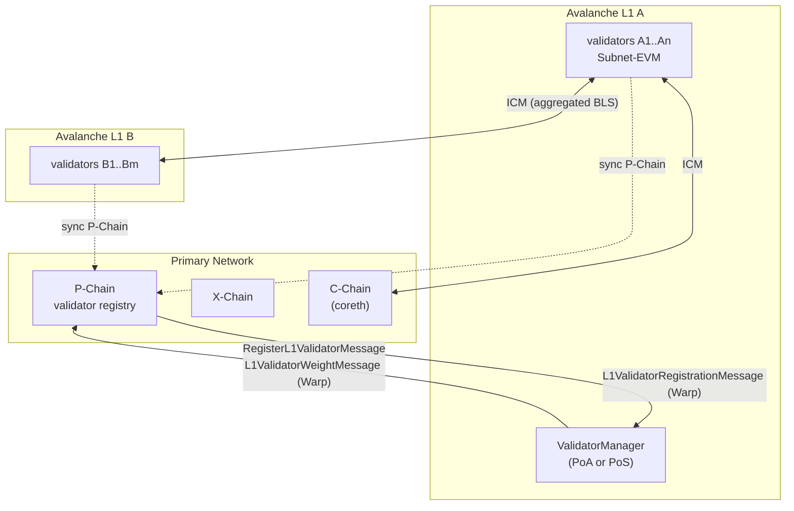
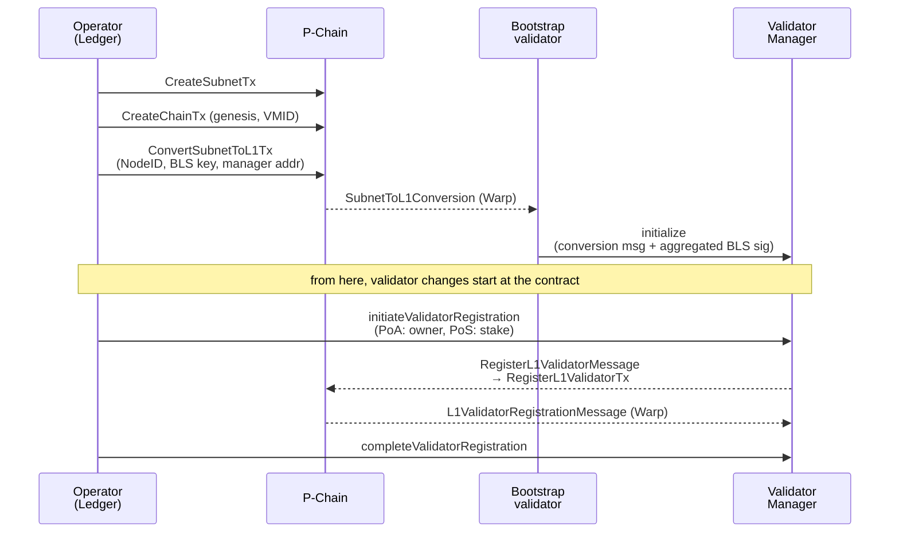
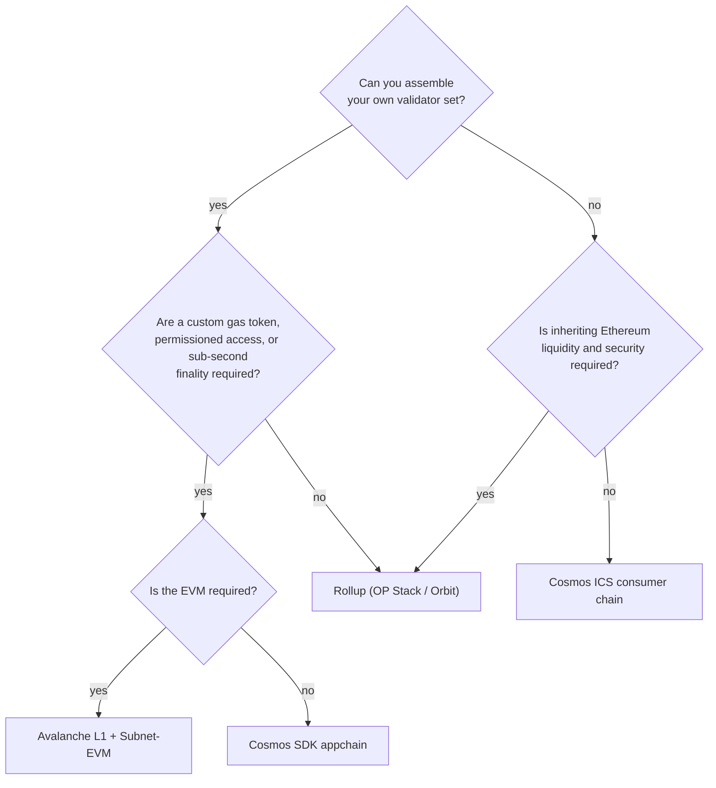

## Abstract

Subnet-EVM is a trimmed-down build of the C-Chain's coreth, written to run on a chain that has its own validator set. The Etna upgrade of 16 December 2024 (ACP-77) changed what "its own validator set" costs. Validators no longer stake 2,000 AVAX on the Primary Network; they keep a P-Chain balance that drains at roughly 1.33 AVAX a month, and membership changes come from a Validator Manager contract on the L1, relayed to the P-Chain as Warp messages. This report lays that structure out from the specs and code, walks through a mainnet launch (local, Fuji, then three P-Chain transactions and validator registration), lists where operation actually breaks (the 80% connected-weight rule, `upgrade.json` coordination, relayers, balance exhaustion), and sets the result against rollups and Cosmos appchains. Two caveats for September 2026: the standalone `ava-labs/subnet-evm` repository is archived and lives inside the AvalancheGo monorepo now, and `avalanche-cli` has been in maintenance mode since December 2025.

## 1. Introduction

"Avalanche Subnet" and "Avalanche L1" name the same thing. Ava Labs' documentation uses both, and defines an L1 as "a sovereign network which defines its own rules regarding its membership and token economics"[^s03]. The rename came with ACP-77, "Reinventing Subnets", whose motivation section states the old problem without softening it: a node operator had to stake "at least 2000 $AVAX ($70k at time of writing)" as a Primary Network validator before qualifying as a Subnet validator, and regulated entities barred from validating a permissionless smart-contract chain "cannot launch a Subnet because they cannot opt-out of Primary Network Validation"[^s01]. Etna removed the requirement and put a "dynamic continuous fee" in its place[^s08][^s09].

Subnet-EVM is the usual VM on such an L1. Three questions follow. What is Subnet-EVM and how does it differ from the C-Chain? How do you launch one and what do you have to keep running? Against an OP Stack or Arbitrum Orbit rollup, or a Cosmos SDK appchain, what do you gain and what do you give up?

## 2. Background: the Avalanche architecture and the post-Etna L1 model

The Primary Network is the P-Chain, X-Chain and C-Chain, and every L1 validator "must sync the P-Chain of the Primary Network for interoperability"[^s03] _(unverified — single source)_. The P-Chain is the registry: who validates which L1, at what weight, under which BLS key. Other chains read that registry to verify Warp signatures[^s07].

_Figure 1 — The post-Etna shape. An L1's own validators produce its blocks; the P-Chain holds only the public record of who they are. Membership changes travel from the L1's Validator Manager to the P-Chain as Warp messages, and the P-Chain answers with a confirmation. Cross-chain messages are verified by aggregating validator BLS signatures.[^s01][^s05][^s07]_

### 2.1 Before and after Etna

ACP-77 added five P-Chain transaction types: `ConvertSubnetToL1Tx`, `RegisterL1ValidatorTx`, `SetL1ValidatorWeightTx`, `DisableL1ValidatorTx`, `IncreaseL1ValidatorBalanceTx`[^s01]. The first is the pivot. Once a Subnet is converted, its validator set is no longer driven by P-Chain transactions from the owner; it is driven by whichever Validator Manager contract the conversion named. "The P-Chain will consume Warp messages that modify the L1's validator set"[^s01].

Etna shipped as AvalancheGo v1.12.0 and activated on mainnet at 17:00 UTC on 16 December 2024, carrying ACP-77 alongside dynamic P-Chain fees (ACP-103), the Warp signature interface standard (ACP-118) and Cancun EIPs on both the C-Chain and Subnet-EVM (ACP-131)[^s09]. The Foundation called it "over 99.9% reduction in upfront costs"[^s08].

### 2.2 The continuous fee

An L1 validator deposits a balance on the P-Chain and the fee drains from it per second. Initial parameters: a minimum rate of 512 nAVAX/s (about 1.33 AVAX a month) and a target of 10,000 validators, with the rate rising exponentially once active L1 validators exceed the target[^s01]. The Foundation's blog rounds this to "approximately 1.3 AVAX per month"[^s08]; AvaCloud passes it through to customers as "1.33 AVAX tokens" per node per month[^s23]. When the balance hits zero the validator "will be considered inactive and will no longer participate in validating the L1"[^s01]. The CLI's mainnet guide puts it plainly: "1 AVAX should last the validator about a month"[^s10].

That is a floor. The rate moves with validator count, so it should not be plugged into a multi-year budget as a constant.

## 3. Inside Subnet-EVM

### 3.1 Relation to coreth

The README calls Subnet-EVM "a simplified version of Coreth VM (C-Chain)" and lists the differences in four lines: configurable fees and gas limits in genesis, all Avalanche hardforks merged into a single "Subnet EVM" hardfork, Atomic Txs and Shared Memory removed, the Multicoin contract and state removed[^s02]. What was removed is exactly what tied the C-Chain to the Primary Network. It stays compatible "with almost all Ethereum tooling, including Foundry and Remix"[^s02].

As of September 2026 the standalone repository is archived. Both the README and the node-operator docs say Subnet-EVM "is now part of the AvalancheGo monorepo", and the build happens from the Subnet-EVM directory inside it[^s02][^s18]. The last standalone compatibility table pairs v0.8.0 with AvalancheGo v1.14.0 (protocol 44) and v0.7.9 with v1.13.5[^s02]. Operators used to pin two versions; going forward there is one.

### 3.2 Genesis and fee configuration

A genesis JSON has three layers: Ethereum-style chain config (chainId, hardfork block numbers), the Subnet-EVM-specific `feeConfig`, and the list of enabled precompiles[^s04]. The chainId "must be picked carefully since a conflict with other chains can cause issues"[^s04].

The `feeConfig` fields and the documented recommended ranges[^s13]:

| Field | Meaning | Recommended | Note |
|---|---|---|---|
| `gasLimit` | Max gas per block | 8M–100M | Obsolete after ACP-224 / Helicon |
| `targetBlockRate` | Target seconds between blocks | 2–10 | Deprecated by Granite |
| `minBaseFee` | Minimum base fee (wei) | 25–500 gwei | |
| `targetGas` | Target gas over the last 10 s | 5M–50M | |
| `baseFeeChangeDenominator` | Speed of base-fee change | 8–1000 | Obsolete after ACP-224 / Helicon |
| `minBlockGasCost` / `maxBlockGasCost` / `blockGasCostStep` | Block gas cost | | Deprecated by Granite |

Two upgrades explain the deprecation column. ACP-226, part of Granite, lets "validators collectively and dynamically determine the minimum time between blocks" and requires the header's `blockGasCost` to be 0[^s26]. ACP-224, scheduled for the Helicon upgrade, brings ACP-176-style dynamic gas limits to Subnet-EVM; the proposal states that "the existing FeeManagerPrecompile is not compatible with the ACP-176 fee mechanism" and that `GasLimit` and `BaseFeeChangeDenominator` become obsolete[^s29]. Half of this table will stop meaning anything within the next network upgrade.

### 3.3 Stateful precompiles

This is where Subnet-EVM diverges most from the C-Chain. Six ship by default: Deployer AllowList, Transaction AllowList, Native Minter, Fee Manager, Reward Manager, Warp Messenger[^s04].

- **The AllowLists.** In the Deployer AllowList "Enabled addresses can deploy contracts"; in the Transaction AllowList "Enabled addresses can submit transactions". Three roles: Admin (add or remove any role), Manager (add or remove Enabled only), Enabled (use the precompile)[^s19]. A chain where only KYC'd addresses may transact is built from these two.
- **Native Minter.** "Allows authorized addresses to mint additional tokens after network launch", for emission schedules, validator rewards and monetary policy[^s20]. A PoS Validator Manager has to be an admin of this precompile to pay rewards[^s05].
- **Fee Manager.** Lives at `0x0200000000000000000000000000000000000003` and adjusts fee parameters on-chain, gated by the AllowList interface[^s13].
- **Warp Messenger.** The VM-side entry point for ICM (§5.3).

### 3.4 Network upgrades

Enabling or disabling a precompile after launch goes through `upgrade.json`, placed "in the same directory where config.json resides". Each `precompileUpgrades` entry names exactly one precompile, its `blockTimestamp` must be "in the future relative to the head of the chain", and timestamps must increase[^s11]. Once activated, an upgrade "must always be present in upgrade.json exactly as it was configured at the time of activation (otherwise the node will refuse to start)"[^s11]. The operational consequences are in §5.1.

## 4. Launching

### 4.1 The tooling landscape, September 2026

The official CLI, `avalanche-cli`, covers local, Fuji and mainnet deployments through `avalanche blockchain create` followed by `avalanche blockchain deploy`[^s33]. Its README also says that since December 2025 it is in "maintenance mode" with "only security patches and critical bug fixes"[^s33]. Builder Hub still documents mainnet deployment in terms of this CLI[^s10]. For production infrastructure there is a separate `avalanche-deploy` that stands nodes up with Terraform and `platform-cli`[^s34]. The managed route is AvaCloud, whose Starter/Pro/Enterprise plans add the mainnet validator fee at 1.33 AVAX per node per month[^s23]. Builder Hub also hosts a web-based L1 Launcher and L1 Toolbox, whose pages did not return readable content for this report (§8).

### 4.2 Mainnet deployment sequence

The CLI guide's prerequisites are a fully bootstrapped mainnet AvalancheGo node, AVAX on the P-Chain, a prior Fuji deployment of the same L1, and a Ledger: "all Avalanche-CLI Mainnet operations require the use of a connected Ledger device"[^s10].

_Figure 2 — Creating an L1 on mainnet. The three P-Chain transactions need Ledger signatures; after conversion, authority over the validator set passes to the Validator Manager. Registering a validator starts at the contract and completes through a Warp round-trip to the P-Chain.[^s01][^s05][^s10][^s34]_

`ConvertSubnetToL1Tx` carries each bootstrap validator's NodeID, BLS public key and proof of possession[^s10]. The CLI offers `--use-local-machine` to make your workstation the bootstrap validator; the mainnet guide answers that prompt with "No" and points at a dedicated node instead[^s10]. On the `avalanche-deploy` path, a `create-l1` tool writes `SUBNET_ID`, `CHAIN_ID`, `CONVERSION_TX` and `EVM_CHAIN_ID` to `l1.env`, and if the genesis includes a ValidatorManager proxy it is initialized separately with "a BLS-aggregated SubnetToL1Conversion warp message"[^s34].

### 4.3 Choosing a Validator Manager

The official contracts are one `ValidatorManager` paired with one of `PoAManager`, `NativeTokenStakingManager` or `ERC20TokenStakingManager`[^s05]. PoA is created by passing an `owner` to `initialize`; "only the owner may initiate validator set changes, but anybody can complete the validator set change"[^s21]. Under PoS, whoever calls `initiateValidatorRegistration` becomes that validator's owner and is the only one who can remove it, and "unlike with PoA, PoS validators are not able to decrease their weight"[^s21]. Both modes enforce churn limits: "only a certain (configurable) percentage of the total weight is allowed to be added or removed in a (configurable) period of time"[^s21].

The registration flow is the bottom half of Figure 2. The contract builds a `RegisterL1ValidatorMessage` for the P-Chain, the P-Chain signs an `L1ValidatorRegistrationMessage` back, and removal is an `L1ValidatorWeightMessage` with weight 0[^s05].

### 4.4 Validator hardware

L1 validators and Primary Network validators are specced differently. The docs tier L1 nodes by throughput: under 10 TPS, 2 cores / 4 GB / 100 GB; 10–100 TPS, 4 cores / 8 GB / 500 GB SSD; 100+ TPS, 8+ cores / 16 GB+ / 1 TB+ NVMe. Every node needs inbound port 9651, and storage must be "a local NVMe SSD attached directly to your hardware with minimum 3000 IOPS"; cloud block storage is ruled out on latency[^s06] _(unverified — single source)_. The lower floor than a Primary Network validator (4 cores / 16 GB / 1 TB and up) follows from an L1 node not carrying C-Chain state.

Two node-side settings: the VM binary goes in `~/.avalanchego/plugins/` under the L1's VMID, and `track-subnets` in `config.json` (or the `--track-subnets` flag) lists the SubnetID[^s18].

## 5. Operating

### 5.1 Upgrade coordination

This is the largest operational risk. Both an AvalancheGo version bump and an `upgrade.json` network upgrade require that "every single validator on the Avalanche L1 will need to perform the identical upgrade"[^s22]. The docs do not hedge: "Any mistakes in configuring network upgrades or coordinating them on validators may cause the network to halt and recovering may be difficult"[^s11]. You "must schedule advance notice to every Avalanche L1 validator" ahead of activation[^s22]. On a rollup, one sequencer operator bumps a version and is done; here it is n operators against a deadline.

### 5.2 The 80% connected-weight rule

"Avalanche L1s can operate normally only if validators representing 80% or more of the cumulative validator weight is connected. If the amount of connected stake falls close to or below 80%, Avalanche L1 performance (time to finality) will suffer, and ultimately the Avalanche L1 will halt (stop processing transactions)"[^s22]. The operator must "ensure that whatever you do, at least 80% of the validators' cumulative weight is connected and working at all times"[^s22].

That number dictates validator-set design. In a five-node equal-weight PoA, one node down puts connected weight at exactly 80%, on the edge. Two down during a rolling upgrade halts the chain. A validator that went "inactive" because its P-Chain balance ran out counts the same way[^s01]. A rollup whose sequencer dies stops producing blocks but keeps a forced-inclusion path on L1; an L1 below the weight threshold simply stops.

### 5.3 ICM and relayers

The protocol signs and verifies cross-chain messages but does not deliver them: "It is up to the Avalanche L1s and their users to determine how they want to transport data from the validators of the origin Avalanche L1 to the validators of the destination Avalanche L1"[^s07]. The gap is filled by the off-chain `icm-relayer`, "configurable to listen to specific source and destination chain pairs and relay messages according to its configured rules", plus a separate signature-aggregator service that "requests and aggregates signatures from validators"[^s12].

On the contract side the interface is `TeleporterMessenger`. Each message can carry an ERC20 fee to incentivize a relayer, and `allowedRelayerAddresses` can restrict who may deliver it[^s27]. Fees are optional, so an L1 that runs its own relayer pays nothing per message. The converse also holds: if nobody runs a relayer, a signed message goes nowhere. An L1 that uses ICM owns two more off-chain services beyond its validators.

The acceptance threshold is per receiving chain; the docs' example is "Avalanche L1 A may accept messages from Avalanche L1 B that are signed by at least 70% of stake"[^s07].

### 5.4 Monitoring

Ava Labs ships an installer for Prometheus, Grafana and node_exporter with dashboards, plus a page of key metrics with healthy ranges and alert thresholds[^s28]. Its one emphatic point is exposure: "The system as described here should not be opened to the public internet. Neither Prometheus nor Grafana as shown here is hardened against unauthorized access"[^s28]. There is no L1-specific metrics guide; the general AvalancheGo setup is applied to L1 nodes as is.

On a PoS L1, uptime feeds rewards. The Staking Manager tracks uptime, and a validator below the requirement has to exit through the forced path rather than the normal one[^s21] _(early signal — the numeric threshold was not confirmed in a reachable primary page)_.

### 5.5 Operations checklist

The recurring work, pulled from the sources above:

| Cadence | Task | Basis |
|---|---|---|
| Always | Keep connected weight ≥ 80%; respond to any validator outage immediately | [^s22] |
| Monthly | Check each validator's P-Chain balance; top up with `IncreaseL1ValidatorBalanceTx` | [^s01][^s10] |
| Each release | Roll out AvalancheGo (VM included, in the monorepo); check the compatibility table | [^s02][^s18] |
| As needed | Distribute `upgrade.json`; confirm every validator applied it before the activation time | [^s11][^s22] |
| Always | Keep relayer and signature aggregator running; fund the relayer wallet | [^s12][^s27] |
| Always | Prometheus/Grafana alerts; no public exposure | [^s28] |

## 6. Comparison: rollups, Cosmos appchains, Avalanche L1s

### 6.1 Where security comes from

One question separates the three: who finally vouches for a block's validity?

An OP Stack rollup "leverage[s] the consensus mechanism (like PoW or PoS) of their parent chain instead of providing their own"; blocks go to L1 as EIP-4844 blobs, and "writing to L1 is the major cost of OP Mainnet transactions". Block production is "primarily managed by a single party, called the sequencer", and a state commitment becomes final only after the 7-day challenge window, which is also when withdrawals complete[^s16]. Arbitrum Orbit adds AnyTrust, storing data off-chain with "an external Data Availability Committee (DAC), which is a group of permissioned nodes that you choose and run"[^s25].

An Avalanche L1's security is its validator set and nothing else. Zeeve's comparison puts it as rollups being "tied to their supportive L1s chain for security, operations and governance" while L1s decide "the tokenomics, membership of validators" themselves[^s14] _(vendor-stated)_. A five-validator PoA L1 is as secure as those five institutions are honest; neither Ethereum nor the Avalanche Primary Network stands behind it. The P-Chain records the set and lets others verify Warp signatures against it[^s07]; it does not validate blocks.

Cosmos SDK chains are sovereign-validator-set chains too. The SDK is "a modular, open-source blockchain SDK for building secure, high-performance Layer 1 chains with full customizability", recommends CometBFT, and ships IBC "out-of-the-box"[^s32]. Gelato's comparison table summarizes the differences: probabilistic sub-sampled Snowman with sub-second finality versus deterministic BFT in seconds; dynamic participation against a shared P-Chain registry versus "fixed validator set per chain, where each zone must independently establish its own validator set"; BLS-aggregated AWM versus IBC[^s30] _(vendor-stated)_. Cosmos also has Interchain Security, which lets a consumer chain borrow the Hub's validators[^s30]; Avalanche L1s have no official shared-security counterpart.

_Figure 3 — A decision path. The validator set is the first question because rollups are the only option that does not require one. The remaining branches follow each stack's documented strengths.[^s03][^s14][^s15][^s16][^s30][^s32]_

### 6.2 Failure modes

| | Rollup | Avalanche L1 | Cosmos appchain |
|---|---|---|---|
| Block producer down | Sequencer stalls; forced inclusion via L1 exists[^s16] | Chain halts below 80% connected weight[^s22] | Halts below ⅔ of validators (BFT)[^s30] |
| Upgrade | Sequencer operator performs it | All validators, simultaneously; a mistake halts[^s11][^s22] | All validators, coordinated |
| Withdrawal / finality | 7-day challenge (optimistic)[^s16] | Sub-second[^s14] _(vendor-stated)_ | Seconds[^s30] _(vendor-stated)_ |
| Data availability | Ethereum blobs or a DAC[^s16][^s25] | Own validators | Own validators |

### 6.3 Cost structure

A rollup's marginal cost scales with data posted to L1[^s16]. An Avalanche L1's fixed cost is the per-validator continuous fee (initially 1.33 AVAX a month) plus node infrastructure[^s01][^s23]; more transactions do not raise what the P-Chain is owed. Zeeve quotes simple transfers at $0.01–0.03 on Avalanche against $0.05–0.10 on Arbitrum and $0.05–0.15 on Optimism[^s14] _(vendor-stated)_. The Substack enterprise framework restates the trade-off along a time axis: "If you're still validating product–market fit, a Rollup might be the more pragmatic entry point. If the chain is a core part of your operating model and you're thinking in 5–10 year horizons, a sovereign L1/AppChain often pays off"[^s15].

### 6.4 Adoption

One explainer says pre-Etna subnets were given a 12-month transition window and that "most active L1s, including Beam and Dexalot, completed migration in the first quarter following the upgrade"[^s17] _(unverified — single source)_. On the institutional side, Nansen reports Progmat moving "more than $2B in tokenized real estate assets and corporate bonds" onto a dedicated L1, KB Kookmin Card "building a stablecoin payment system and a dedicated L1", and the gaming chain CX Chain "deployed via AvaCloud"[^s31]. The validator conditions Ava Labs advertises, "must be located in a given country", "must pass KYC/AML checks", "must hold a certain license"[^s03], are written for exactly those customers.

## 7. Trade-offs and when to choose which

The reasons to pick an Avalanche L1 with Subnet-EVM match what the docs advertise: your own gas token (Native Minter)[^s20], per-address permissioning (AllowLists)[^s19], validator eligibility rules[^s03], and throughput isolated from anyone else's load[^s03]. A rollup gives none of the four at the protocol level.

What you give up is equally concrete.

- **You buy your own security budget.** Assembling and retaining a validator set is the operator's job. A small L1 will not match a large network's decentralization, and the 80% rule makes a small set fragile against one or two outages[^s22].
- **You leave Ethereum's liquidity.** A token on L1 X is not natively the same asset on L1 Y, and "if activity spreads across many L1s, users may face thinner liquidity, more bridging, and less unified DeFi activity"[^s24]. ICM narrows the gap at the price of running relayers (§5.3).
- **The tooling is moving.** The repository archive[^s02], the CLI's maintenance mode[^s33] and the announced FeeManager replacement[^s29] all landed within the last nine months. A genesis and a set of ops scripts written today will probably need edits at the next upgrade.
- **It is decoupled from AVAX value capture.** Growth of an L1 with a custom gas token "may not fully benefit AVAX holders"[^s24]. That is an investor's concern, but it shapes where the Foundation's incentives point.

The case for a rollup is the mirror image: DeFi that has to stay inside Ethereum's security and liquidity, a team that cannot recruit validators, a product still searching for market fit[^s15]. Cosmos fits when the EVM is optional and IBC is the target ecosystem, or when Interchain Security lets you skip the bootstrap[^s30][^s32].

The most common misreading is that "L1" implies stronger security. It does not. An Avalanche L1 inherits nothing from the Primary Network; a five-node PoA is a five-node PoA.

## 8. Limitations

- The hardware table (§4.4) and the Beam/Dexalot migration timing (§6.4) each rest on a single source.
- The PoS reward uptime threshold appeared as 80% in search snippets, but both pages returned 404 on fetch, so no number is stated in the body.
- Granite's activation date (19 November 2025) came from a snippet; the blog body did not fetch, so the date is omitted in the body.
- L2BEAT project pages exceeded the fetch size limit; sequencer-failure and forced-inclusion statements rely on the OP docs alone.
- Cosmos Interchain Security is cited from a vendor comparison, not Cosmos's own documentation.
- The number of live L1s varies by definition (52, 69 or 524 across sources) and is not stated.
- Builder Hub's web-based L1 Launcher and L1 Toolbox did not return page bodies, so their procedures are not described. With the CLI in maintenance mode, that gap matters in practice.
- Every cost and finality figure in the comparison is vendor-sourced.
