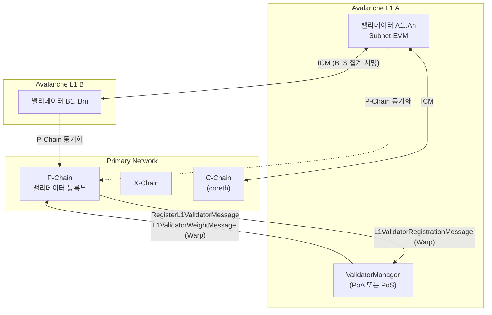
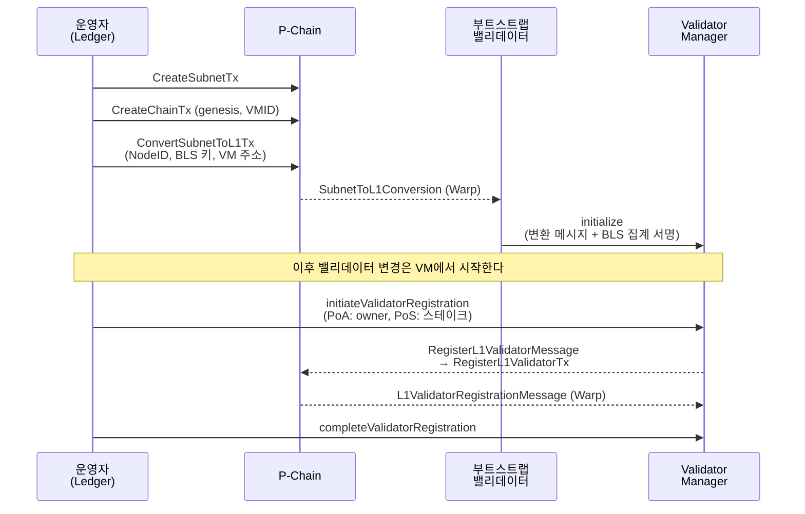
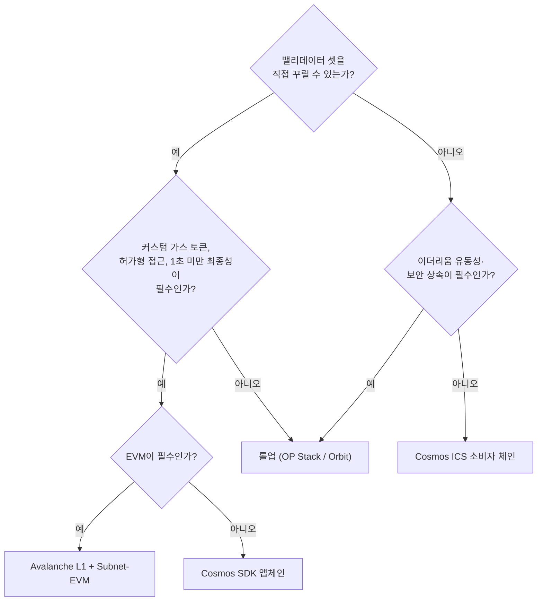

## 초록

Subnet-EVM은 Avalanche C-Chain의 coreth를 단순화한 EVM 구현으로, 자기 밸리데이터 셋을 가진 별도 체인에 올리기 위해 만들어졌다. 2024년 12월 16일 Etna 업그레이드(ACP-77)가 이 "별도 체인"의 경제 모델을 바꿨다. 밸리데이터가 Primary Network에 2,000 AVAX를 걸 필요가 없어졌고, 대신 P-Chain에 월 약 1.33 AVAX 수준의 연속 수수료를 내며, 밸리데이터 셋 변경은 L1 위의 Validator Manager 컨트랙트가 Warp 메시지로 P-Chain에 통보한다. 이 보고서는 그 구조를 코드와 문서 기준으로 정리하고, 실제로 띄우는 순서(로컬 → Fuji → 메인넷, 세 개의 P-Chain 트랜잭션, 밸리데이터 등록), 운영에서 깨지는 지점(80% 연결 가중치, upgrade.json 조율, 릴레이어, 잔액 소진), 그리고 롤업·Cosmos 앱체인과의 차이를 다룬다. 2026년 9월 시점의 주의점 두 가지도 기록한다. 독립 저장소 `ava-labs/subnet-evm`은 아카이브되어 AvalancheGo 모노레포로 흡수됐고, `avalanche-cli`는 2025년 12월부터 유지보수 모드다.

## 1. 서론

"Avalanche Subnet"과 "Avalanche L1"은 같은 것을 가리킨다. Ava Labs 문서는 두 용어를 섞어 쓰며, L1을 "멤버십과 토큰 경제에 대한 자기 규칙을 정의하는 주권 네트워크"로 정의한다[^s03]. 이름이 바뀐 계기는 ACP-77 "Reinventing Subnets"다. 제안서는 옛 모델의 문제를 직접 적었다. 노드 운영자는 Subnet 밸리데이터가 되기 전에 먼저 Primary Network 밸리데이터로 최소 2,000 AVAX(작성 당시 약 7만 달러)를 스테이킹해야 했고, 허가형 스마트컨트랙트 체인(C-Chain)의 검증이 금지된 규제 기관은 Primary Network 검증을 거부할 수 없어 Subnet을 아예 만들 수 없었다[^s01]. Etna는 이 요구를 없애고 "동적 연속 수수료"로 대체했다[^s08][^s09].

Subnet-EVM은 그 L1 위에서 돌아가는 VM 중 가장 흔한 선택이다. 이 문서의 질문은 세 가지다. Subnet-EVM은 무엇이고 C-Chain과 어떻게 다른가. 어떻게 띄우고 무엇을 운영해야 하는가. OP Stack·Arbitrum Orbit 같은 롤업이나 Cosmos SDK 앱체인과 비교했을 때 무엇을 얻고 무엇을 포기하는가.

## 2. 배경: Avalanche 아키텍처와 Etna 이후의 L1 모델

Primary Network는 P-Chain, X-Chain, C-Chain으로 구성되며, 모든 L1 밸리데이터는 상호운용성을 위해 P-Chain을 동기화해야 한다[^s03] _(unverified — single source)_. P-Chain은 밸리데이터 등록부다. L1의 밸리데이터가 누구이고 가중치가 얼마인지, BLS 공개키가 무엇인지가 여기에 기록되고, 다른 체인은 이 등록부를 보고 Warp 메시지 서명을 검증한다[^s07].

_그림 1 — Etna 이후 구조. L1은 자기 밸리데이터가 블록을 만들고, P-Chain은 밸리데이터 셋의 공적 기록만 맡는다. 셋 변경은 L1 위 Validator Manager가 Warp 메시지로 P-Chain에 전달하고, P-Chain이 확인 메시지를 돌려준다. 체인 간 메시지는 밸리데이터 BLS 서명을 집계해 검증한다.[^s01][^s05][^s07]_

### 2.1 Etna 이전과 이후

ACP-77이 도입한 P-Chain 트랜잭션은 다섯 개다. `ConvertSubnetToL1Tx`, `RegisterL1ValidatorTx`, `SetL1ValidatorWeightTx`, `DisableL1ValidatorTx`, `IncreaseL1ValidatorBalanceTx`[^s01]. 핵심은 첫 번째다. 기존 방식으로 만든 Subnet을 한 번 "변환"하면 그 이후 밸리데이터 셋은 P-Chain 트랜잭션이 아니라 지정된 Validator Manager 컨트랙트가 결정한다. "P-Chain은 L1의 밸리데이터 셋을 변경하는 Warp 메시지를 소비한다"[^s01].

Etna는 AvalancheGo v1.12.0으로 2024년 12월 16일 17:00 UTC에 메인넷에 활성화됐고, ACP-77 외에 P-Chain 동적 수수료(ACP-103), Warp 서명 인터페이스 표준(ACP-118), C-Chain과 Subnet-EVM의 Cancun EIP 활성화(ACP-131) 등을 함께 실었다[^s09]. Avalanche 재단은 이를 "초기 비용 99.9% 이상 절감"으로 표현했다[^s08].

### 2.2 연속 수수료

L1 밸리데이터는 스테이킹 대신 P-Chain에 잔액(Balance)을 예치하고, 그 잔액에서 초 단위로 수수료가 차감된다. 초기 파라미터는 최소 요율 512 nAVAX/s(월 약 1.33 AVAX), 목표 밸리데이터 수 10,000이며, 활성 L1 밸리데이터가 목표를 넘으면 요율이 지수적으로 오른다[^s01]. 재단 블로그는 "초기에는 월 약 1.3 AVAX"라고 썼고[^s08], AvaCloud 요금표는 이를 "노드당 월 1.33 AVAX"로 고객에게 전가한다[^s23]. 잔액이 0이 되면 밸리데이터는 "비활성"이 되어 검증에 참여하지 못한다[^s01]. CLI 메인넷 가이드는 "1 AVAX면 약 한 달"이라고 안내한다[^s10].

이 수치는 바닥값이다. 요율이 밸리데이터 수에 따라 움직이므로 장기 비용 예측에 그대로 쓰면 안 된다.

## 3. Subnet-EVM 내부

### 3.1 coreth와의 관계

저장소 README는 Subnet-EVM을 "Coreth VM(C-Chain)의 단순화 버전"으로 소개하고 차이를 네 줄로 요약한다. genesis에서 수수료와 가스 한도를 설정할 수 있게 했고, Avalanche 하드포크들을 단일 "Subnet EVM" 하드포크로 합쳤으며, Atomic Tx와 Shared Memory를 제거했고, Multicoin 컨트랙트와 상태를 제거했다[^s02]. 제거된 것들이 C-Chain을 Primary Network에 묶어두던 부분이다. Foundry, Remix 등 "거의 모든 이더리움 도구"와 호환된다[^s02].

2026년 9월 현재 독립 저장소는 아카이브 상태다. README와 노드 운영 문서 모두 "Subnet-EVM은 이제 AvalancheGo 모노레포의 일부"라고 적고, 빌드는 모노레포 안의 Subnet-EVM 디렉터리에서 한다[^s02][^s18]. 마지막 독립 릴리스 호환표는 v0.8.0 → AvalancheGo v1.14.0(프로토콜 44), v0.7.9 → v1.13.5다[^s02]. 이전에는 VM과 노드 버전을 따로 맞춰야 했다면, 앞으로는 한 저장소의 한 버전이다.

### 3.2 genesis와 수수료 설정

genesis JSON에는 세 층이 있다. 이더리움식 체인 설정(chainId, 하드포크 블록 번호), Subnet-EVM 고유의 `feeConfig`, 그리고 프리컴파일 활성화 목록이다[^s04]. chainId는 "다른 체인과 충돌하면 문제가 생기므로 신중히 골라야 한다"[^s04].

`feeConfig` 필드와 문서의 권장 범위는 다음과 같다[^s13].

| 필드 | 의미 | 권장 범위 | 비고 |
|---|---|---|---|
| `gasLimit` | 블록당 최대 가스 | 8M–100M | ACP-224/Helicon 이후 무효화 예정 |
| `targetBlockRate` | 목표 블록 간격(초) | 2–10 | Granite에서 폐기 |
| `minBaseFee` | 최소 base fee(wei) | 25–500 gwei | |
| `targetGas` | 최근 10초 목표 가스 | 5M–50M | |
| `baseFeeChangeDenominator` | base fee 변화 속도 | 8–1000 | ACP-224/Helicon 이후 무효화 예정 |
| `minBlockGasCost` / `maxBlockGasCost` / `blockGasCostStep` | 블록 가스 비용 | | Granite에서 폐기 |

폐기 표시가 많은 이유는 두 번의 업그레이드다. Granite에 포함된 ACP-226은 "밸리데이터가 집단적으로, 동적으로 블록 간 최소 시간을 결정"하게 하고 헤더의 `blockGasCost`를 0으로 고정했다[^s26]. 다음 업그레이드 Helicon에 실릴 ACP-224는 ACP-176 방식의 동적 가스 한도를 Subnet-EVM에 들여오는데, 제안서가 명시하듯 "기존 FeeManagerPrecompile은 ACP-176 수수료 메커니즘과 호환되지 않으며" `GasLimit`과 `BaseFeeChangeDenominator` 설정이 무효화된다[^s29]. 지금 genesis를 작성한다면 이 표의 절반은 곧 의미를 잃는다는 뜻이다.

### 3.3 상태 저장 프리컴파일

Subnet-EVM이 C-Chain과 가장 다른 지점이다. 기본 제공 여섯 개는 Deployer AllowList, Transaction AllowList, Native Minter, Fee Manager, Reward Manager, Warp Messenger다[^s04].

- **AllowList 계열**: Deployer AllowList에서는 Enabled 주소만 컨트랙트를 배포할 수 있고, Transaction AllowList에서는 Enabled 주소만 트랜잭션을 낼 수 있다. 역할은 Admin(모든 역할 추가·삭제), Manager(Enabled만 추가·삭제), Enabled(기능 사용) 세 단계다[^s19]. KYC를 거친 주소만 거래하게 하는 허가형 체인이 이걸로 만들어진다.
- **Native Minter**: "네트워크 출시 후 승인된 주소가 토큰을 추가 발행"할 수 있게 한다. 문서가 드는 용도는 발행 스케줄, 밸리데이터 보상, 통화 정책이다[^s20]. PoS Validator Manager는 보상 지급을 위해 이 프리컴파일의 admin이어야 한다[^s05].
- **Fee Manager**: 주소 `0x0200000000000000000000000000000000000003`에 있으며 수수료 파라미터를 온체인에서 조정한다. 접근 제어는 AllowList 인터페이스를 따른다[^s13].
- **Warp Messenger**: ICM의 VM 쪽 진입점이다(§5.3).

### 3.4 네트워크 업그레이드

프리컴파일을 출시 후에 켜거나 끄려면 `upgrade.json`을 쓴다. 파일은 `config.json`과 같은 디렉터리에 두고, `precompileUpgrades`의 각 항목은 프리컴파일 하나를 지정하며 `blockTimestamp`는 "체인 헤드 기준으로 미래"여야 하고 항목 간 타임스탬프는 증가해야 한다[^s11]. 한 번 활성화된 업그레이드는 "활성화 당시 설정과 정확히 같은 내용으로 항상 upgrade.json에 있어야 하며, 아니면 노드가 시작을 거부한다"[^s11]. 운영상 함의는 §5.1에서 다룬다.

## 4. 띄우기

### 4.1 도구 지형(2026년 9월)

공식 CLI인 `avalanche-cli`는 로컬·Fuji·메인넷 배포를 모두 지원하고 `avalanche blockchain create` → `avalanche blockchain deploy`가 기본 흐름이다[^s33]. 그러나 README는 2025년 12월부터 "유지보수 모드, 보안 패치와 치명적 버그 수정만" 다룬다고 밝힌다[^s33]. Builder Hub 문서는 여전히 이 CLI 기준으로 메인넷 배포를 설명하고[^s10], 프로덕션 인프라용으로는 Terraform과 `platform-cli`로 노드를 띄우는 `avalanche-deploy`가 별도로 있다[^s34]. 매니지드 경로는 AvaCloud로, Starter/Pro/Enterprise 요금제에 메인넷 밸리데이터 수수료를 노드당 월 1.33 AVAX로 얹는다[^s23]. Builder Hub의 웹 기반 L1 Launcher와 L1 Toolbox도 있으나 이 보고서에서는 페이지 본문을 확인하지 못했다(§8).

### 4.2 메인넷 배포 순서

CLI 문서 기준 전제 조건은 네 가지다. 메인넷에 완전히 부트스트랩된 AvalancheGo 노드, P-Chain의 AVAX, Fuji에서 먼저 같은 L1을 배포해 본 경험, 그리고 Ledger 기기다. "보안을 위해 모든 Avalanche-CLI 메인넷 작업은 연결된 Ledger 기기를 요구한다"[^s10].

_그림 2 — 메인넷 L1 생성 순서. 세 개의 P-Chain 트랜잭션은 Ledger 서명이 필요하고, 변환 후 밸리데이터 셋의 권한은 Validator Manager로 넘어간다. 밸리데이터 등록은 컨트랙트에서 시작해 P-Chain 왕복 Warp 메시지로 완료된다.[^s01][^s05][^s10][^s34]_

`ConvertSubnetToL1Tx`를 낼 때 부트스트랩 밸리데이터의 NodeID, BLS 공개키, 소유 증명(proof of possession)을 넣는다[^s10]. CLI는 로컬 머신을 부트스트랩 밸리데이터로 쓰는 `--use-local-machine` 옵션을 주지만, 메인넷 가이드는 그 프롬프트에 "No"를 고르고 별도 노드를 지정하는 예를 든다[^s10]. `avalanche-deploy` 경로에서는 `create-l1` 도구가 `SUBNET_ID`, `CHAIN_ID`, `CONVERSION_TX`, `EVM_CHAIN_ID`를 `l1.env`로 내보내고, genesis에 ValidatorManager 프록시가 포함돼 있으면 "BLS 집계된 SubnetToL1Conversion warp 메시지"로 따로 초기화한다[^s34].

### 4.3 Validator Manager 선택

공식 컨트랙트 구성은 `ValidatorManager` 하나에 `PoAManager`, `NativeTokenStakingManager`, `ERC20TokenStakingManager` 중 하나를 붙이는 형태다[^s05]. PoA는 `initialize`에 owner를 넘겨 만들고, "owner만 밸리데이터 셋 변경을 시작할 수 있지만 완료는 누구나 할 수 있다"[^s21]. PoS는 `initiateValidatorRegistration`을 호출한 주소가 그 밸리데이터의 owner가 되며 owner만 제거할 수 있고, PoA와 달리 가중치를 줄일 수 없다[^s21]. 두 모드 모두 churn 제한이 있어 "설정 가능한 기간 안에 총 가중치의 설정 가능한 비율까지만" 추가·제거된다[^s21].

등록 절차는 그림 2의 아래 절반이다. 컨트랙트가 `RegisterL1ValidatorMessage`를 만들어 P-Chain으로 보내고, P-Chain이 `L1ValidatorRegistrationMessage`로 등록을 확인하며, 제거는 가중치 0의 `L1ValidatorWeightMessage`다[^s05].

### 4.4 밸리데이터 노드 사양

Primary Network 밸리데이터와 L1 밸리데이터의 요구 사양은 다르다. 공식 문서는 L1을 처리량 기준 세 등급으로 나눈다. 10 TPS 미만은 2코어·4GB·100GB, 10–100 TPS는 4코어·8GB·500GB SSD, 100 TPS 이상은 8코어 이상·16GB 이상·1TB NVMe다. 모든 노드는 9651 포트 인바운드가 열려야 하고, 스토리지는 "최소 3000 IOPS의 로컬 NVMe"를 요구하며 클라우드 블록 스토리지는 지연 때문에 배제한다[^s06] _(unverified — single source)_. Primary Network 밸리데이터(4코어/16GB/1TB부터)보다 낮은 사양이 가능한 것은 L1 노드가 C-Chain 상태를 들고 있을 필요가 없기 때문이다.

노드 쪽 설정은 두 가지다. VM 바이너리를 `~/.avalanchego/plugins/`에 그 L1의 VMID 이름으로 두고, `config.json`의 `track-subnets`(또는 `--track-subnets` 플래그)에 SubnetID를 넣는다[^s18].

## 5. 운영

### 5.1 업그레이드 조율

L1 운영의 가장 큰 리스크는 여기 있다. AvalancheGo 버전 업그레이드와 `upgrade.json` 네트워크 업그레이드 모두 "L1의 모든 밸리데이터가 동일한 업그레이드를 수행해야" 한다[^s22]. 문서의 경고는 직설적이다. "네트워크 업그레이드 설정이나 밸리데이터 간 조율의 실수는 네트워크를 멈출 수 있고 복구는 어려울 수 있다"[^s11]. 활성화 시각 전에 모든 밸리데이터에게 사전 통지를 "일정으로 잡아야" 한다[^s22]. 롤업이라면 시퀀서 운영자 한 명이 버전을 올리면 끝나는 일이, 여기서는 n명의 운영자와 마감 시각을 맞추는 일이 된다.

### 5.2 80% 연결 가중치

"Avalanche L1은 누적 밸리데이터 가중치의 80% 이상이 연결돼 있을 때만 정상 동작한다. 연결된 스테이크가 80% 근처나 아래로 떨어지면 최종성 시간이 나빠지고 결국 L1은 멈춘다(트랜잭션 처리 중단)"[^s22]. 운영자는 "무엇을 하든 밸리데이터 누적 가중치의 80% 이상이 항상 연결되고 동작하도록" 보장해야 한다[^s22].

이 숫자는 밸리데이터 셋 설계를 규정한다. 밸리데이터 5개 PoA에서 하나가 죽으면 연결 가중치가 80%가 되어 경계에 닿는다. 업그레이드 롤링 중에 두 개가 동시에 꺼지면 체인이 선다. 잔액 소진으로 "비활성"이 된 밸리데이터도 같은 효과를 낸다[^s01]. 롤업의 시퀀서 다운은 블록 생성을 멈추되 L1에 강제 포함 경로가 남는 반면, L1의 가중치 미달은 체인 자체의 정지다.

### 5.3 ICM과 릴레이어

체인 간 메시지는 프로토콜이 서명·검증하지만 전달은 하지 않는다. "출발 L1 밸리데이터에서 목적지 L1 밸리데이터로 데이터를 어떻게 옮길지는 L1과 사용자가 결정할 일이다"[^s07]. 그 빈자리를 채우는 것이 오프체인 `icm-relayer`로, "특정 출발·목적지 체인 쌍을 듣고 설정된 규칙에 따라 메시지를 중계"하며, 별도의 signature-aggregator 서비스가 밸리데이터로부터 서명을 모은다[^s12].

컨트랙트 쪽 인터페이스는 `TeleporterMessenger`다. 메시지마다 ERC20 자산으로 릴레이어 수수료를 붙일 수 있고, `allowedRelayerAddresses`로 전달 가능한 릴레이어를 제한할 수 있다[^s27]. 수수료는 선택 사항이므로, 자기 릴레이어를 직접 띄우는 L1은 수수료 없이 운영할 수 있다. 반대로 말하면, 아무도 릴레이어를 띄우지 않으면 메시지는 서명된 채로 어디에도 도착하지 않는다. ICM을 쓰는 L1 운영자는 밸리데이터 외에 릴레이어와 서명 집계기라는 두 개의 오프체인 서비스를 더 책임진다.

수신 측 검증 임계값은 체인마다 정할 수 있다. 문서의 예는 "L1 A는 L1 B의 스테이크 70% 이상이 서명한 메시지를 수락한다"이다[^s07].

### 5.4 모니터링

Ava Labs가 제공하는 것은 Prometheus + Grafana + node_exporter 설치 스크립트와 대시보드, 그리고 지표별 권장 범위와 경보 임계값 문서다[^s28]. 문서가 강조하는 한 가지는 노출 범위다. "여기 설명한 시스템은 공개 인터넷에 열어서는 안 된다. Prometheus도 Grafana도 무단 접근에 대해 강화돼 있지 않다"[^s28]. L1 특화 지표 문서는 없고, 일반 AvalancheGo 모니터링을 L1 노드에 그대로 적용한다.

PoS L1에서는 밸리데이터 업타임이 보상과 연결된다. Staking Manager는 업타임 추적을 기반으로 보상을 산정하고, 업타임 미달 상태에서는 정상 종료 대신 강제 종료 경로를 써야 한다[^s21] _(early signal — 임계값 수치는 접근 가능한 1차 문서에서 확인하지 못함)_.

### 5.5 운영 체크리스트

문서에서 뽑아낸 반복 업무를 한 표로 모은다.

| 주기 | 할 일 | 근거 |
|---|---|---|
| 상시 | 연결 가중치 ≥ 80% 유지, 밸리데이터 다운 즉시 대응 | [^s22] |
| 월 | 각 밸리데이터의 P-Chain 잔액 확인, `IncreaseL1ValidatorBalanceTx`로 충전 | [^s01][^s10] |
| 릴리스마다 | AvalancheGo(모노레포 내 VM 포함) 버전 롤아웃, 호환표 확인 | [^s02][^s18] |
| 필요 시 | `upgrade.json` 배포 → 활성화 시각 전 전 밸리데이터 적용 확인 | [^s11][^s22] |
| 상시 | 릴레이어·서명 집계기 가동, 릴레이어 지갑 잔액 | [^s12][^s27] |
| 상시 | Prometheus/Grafana 경보, 외부 노출 차단 | [^s28] |

## 6. 비교: 롤업, Cosmos 앱체인, Avalanche L1

### 6.1 보안이 어디서 오는가

세 모델의 차이는 한 문장으로 갈린다. 누가 블록의 유효성을 최종 보증하는가.

OP Stack 롤업은 "자체 합의를 제공하는 대신 부모 체인의 합의 메커니즘을 활용"하고, 블록은 EIP-4844 블롭으로 L1에 게시되며 "L1에 쓰는 것이 OP Mainnet 트랜잭션의 주된 비용"이다. 블록 생성은 "시퀀서라는 단일 주체"가 맡고, 상태 커밋은 7일 챌린지 기간이 지나야 최종이며 출금도 그 뒤에 완료된다[^s16]. Arbitrum Orbit은 여기에 AnyTrust 옵션을 더한다. 데이터를 이더리움 대신 "운영자가 고르고 운영하는 허가형 노드 집단인 데이터 가용성 위원회"에 오프체인으로 저장한다[^s25].

Avalanche L1은 자기 밸리데이터 셋이 보안 전부다. Zeeve의 비교는 이를 "롤업은 보안·운영·거버넌스를 지지 L1에 묶어두는" 반면 L1은 "토큰 경제와 밸리데이터 멤버십을 스스로 정한다"로 요약한다[^s14] _(vendor-stated)_. 밸리데이터가 다섯인 PoA L1의 보안은 그 다섯 기관의 정직성이지, 이더리움도 Avalanche Primary Network도 아니다. P-Chain은 밸리데이터 셋을 기록하고 Warp 서명을 검증할 근거를 제공할 뿐[^s07], 블록 유효성을 검증하지 않는다.

Cosmos SDK 체인도 주권 밸리데이터 셋 모델이다. SDK는 "완전한 커스터마이징이 가능한 L1 체인을 만드는 모듈형 SDK"로 CometBFT를 권장 합의 엔진으로 두고 IBC를 기본 탑재한다[^s32]. Avalanche와의 차이는 Gelato의 비교표에 요약돼 있다. 합의는 서브샘플링 기반 확률적 Snowman(1초 미만 최종성) 대 결정적 BFT(수 초), 밸리데이터는 P-Chain 등록부를 공유하는 동적 참여 대 "체인마다 독립적으로 셋을 구성"하는 고정 셋, 상호운용은 BLS 집계 기반 AWM 대 IBC다[^s30] _(vendor-stated)_. Cosmos에는 Hub의 밸리데이터 셋을 빌리는 Interchain Security가 있어[^s30] 셋 부트스트랩 부담을 피할 수 있으나, Avalanche L1에는 그에 대응하는 공식 공유 보안 옵션이 없다.

_그림 3 — 선택 기준. 첫 질문이 밸리데이터 셋인 이유는 롤업만이 그것을 요구하지 않기 때문이다. 나머지 분기는 각 문서가 명시한 강점에서 나왔다.[^s03][^s14][^s15][^s16][^s30][^s32]_

### 6.2 실패 모드

| | 롤업 | Avalanche L1 | Cosmos 앱체인 |
|---|---|---|---|
| 블록 생성자 다운 | 시퀀서 정지, L1 강제 포함 경로 존재[^s16] | 연결 가중치 < 80%면 체인 정지[^s22] | 밸리데이터 ⅔ 미만이면 정지 (BFT)[^s30] |
| 업그레이드 | 시퀀서 운영자가 수행 | 전 밸리데이터 동시 적용, 실수 시 정지[^s11][^s22] | 전 밸리데이터 조율 |
| 출금·최종성 | 7일 챌린지(optimistic)[^s16] | 1초 미만[^s14] _(vendor-stated)_ | 수 초[^s30] _(vendor-stated)_ |
| 데이터 가용성 | 이더리움 블롭 또는 DAC[^s16][^s25] | 자체 밸리데이터 | 자체 밸리데이터 |

### 6.3 비용 구조

롤업의 한계 비용은 L1 데이터 게시량에 비례한다[^s16]. Avalanche L1의 고정 비용은 밸리데이터당 연속 수수료(초기 월 1.33 AVAX)에 노드 인프라를 더한 것이고[^s01][^s23], 트랜잭션량이 늘어도 P-Chain에 내는 돈은 늘지 않는다. Zeeve는 단순 전송 기준 Avalanche 0.01–0.03달러 대 Arbitrum 0.05–0.10달러, Optimism 0.05–0.15달러를 제시한다[^s14] _(vendor-stated)_. Substack의 기업용 프레임워크는 같은 결론을 시간축으로 바꿔 말한다. "제품-시장 적합성을 아직 검증 중이면 롤업이 실용적 진입점이고, 체인이 운영 모델의 핵심이며 5–10년을 본다면 주권 L1이 보상을 준다"[^s15].

### 6.4 채택

Etna 이후 기존 Subnet들은 12개월 전환 기간을 받았고 Beam과 Dexalot 등 활성 L1 대부분이 첫 분기 안에 이전했다는 설명이 있다[^s17] _(unverified — single source)_. 기관 쪽에서는 Progmat가 20억 달러 이상의 토큰화 자산을 전용 L1로 옮기고, KB국민카드가 스테이블코인 결제용 전용 L1을 구축 중이며, 게임 체인 CX Chain이 AvaCloud로 배포됐다는 보고가 있다[^s31]. Ava Labs 문서가 L1의 강점으로 드는 "밸리데이터가 특정 국가에 있어야 한다, KYC/AML을 통과해야 한다, 특정 면허를 보유해야 한다"는 조건[^s03]은 정확히 이런 고객을 겨냥한 것이다.

## 7. 장단점과 선택 기준

Avalanche L1 + Subnet-EVM을 고를 근거는 문서가 명시한 것과 일치한다. 자기 가스 토큰(Native Minter)[^s20], 주소 단위 허가(AllowList)[^s19], 밸리데이터 자격 조건[^s03], 그리고 다른 체인의 부하와 격리된 처리량[^s03]. 롤업은 이 넷 중 어느 것도 프로토콜 수준에서 주지 않는다.

포기하는 것도 분명하다.

- **보안 예산을 직접 산다.** 밸리데이터 셋을 모으고 유지하는 것이 운영자의 일이다. 작은 L1이 큰 네트워크 수준의 탈중앙화를 갖기 어렵고, 80% 규칙 때문에 작은 셋은 한두 노드 장애에 취약하다[^s22].
- **이더리움 유동성과 단절된다.** L1 X의 토큰은 L1 Y의 같은 토큰과 네이티브로 같은 자산이 아니며, "활동이 여러 L1로 퍼지면 유동성이 얇아지고 브리지가 늘고 DeFi 활동이 분산된다"[^s24]. ICM이 이를 줄이지만 릴레이어라는 운영 부담을 대가로 한다(§5.3).
- **도구가 움직인다.** 독립 저장소 아카이브[^s02], CLI 유지보수 모드[^s33], FeeManager 교체 예고[^s29]가 모두 최근 9개월 안에 일어났다. 오늘 작성한 genesis와 운영 스크립트는 다음 업그레이드에서 수정이 필요할 가능성이 높다.
- **AVAX 가치 귀속과 별개다.** 커스텀 가스 토큰을 쓰는 L1의 성장이 "AVAX 보유자에게 온전히 돌아가지 않을 수 있다"는 지적[^s24]은 투자자 관점의 문제지만, 재단의 인센티브 방향이 어디를 향할지에 영향을 준다.

롤업을 고를 근거는 반대편이다. 이더리움 보안과 유동성 안에 머물러야 하는 DeFi, 밸리데이터를 모을 수 없는 소규모 팀, 아직 제품-시장 적합성을 보고 있는 프로젝트[^s15]. Cosmos는 EVM이 필수가 아니고 IBC 생태계가 목표일 때, 또는 ICS로 셋 부트스트랩을 건너뛰고 싶을 때[^s30][^s32].

가장 흔한 오판은 "L1이니까 보안이 더 강하다"는 가정이다. 이름과 달리 Avalanche L1의 보안은 Primary Network에서 상속되지 않는다. 다섯 노드짜리 PoA는 다섯 노드짜리 PoA다.

## 8. 한계

- 노드 사양 표(§4.4)와 Beam·Dexalot 이전 시점(§6.4)은 각각 출처가 하나뿐이다.
- PoS 보상의 업타임 임계값은 검색 스니펫에서 80%로 보였으나 해당 문서 두 곳이 모두 404를 반환해 수치를 본문에 넣지 않았다.
- Granite 활성화 날짜(2025-11-19)는 블로그 본문을 가져오지 못해 본문에서 날짜를 생략했다.
- L2BEAT 프로젝트 페이지는 크기 제한으로 읽지 못했고, 시퀀서 장애·강제 포함 서술은 OP 공식 문서에만 기댔다.
- Cosmos Interchain Security는 벤더 비교 글에서만 확인했고 Cosmos 공식 문서는 읽지 못했다.
- 활성 L1 수는 정의에 따라 52·69·524로 갈려 숫자를 제시하지 않았다.
- Builder Hub의 웹 기반 L1 Launcher와 L1 Toolbox는 페이지 본문이 읽히지 않아 절차를 설명하지 못했다. CLI가 유지보수 모드인 만큼 이 공백은 실무에서 의미가 크다.
- 비교의 비용·최종성 수치는 모두 벤더 출처다.
