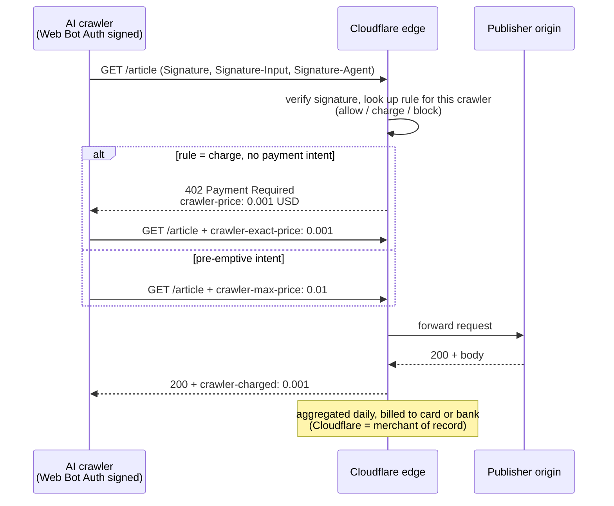
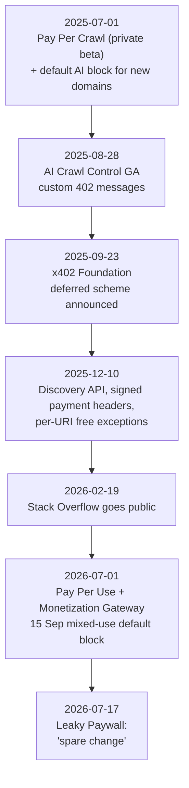

## Abstract

On 17 July 2026 Leaky Paywall called Cloudflare's pay-per-crawl "more proof-of-concept than payroll": if bots are 1–2% of page views and a page fetches $0.001–0.01, a site with a million monthly views makes $20–200 a month. This report checks that arithmetic and fills in what it leaves out. The sum is right; the inputs are doubtful. Bots generate 57.4% of HTML requests on Cloudflare's network and TollBit sees one AI-bot visit per 31 human visits, so "1–2%" is a page-view figure from one site's analytics, not a crawl-request count. The conclusion nonetheless holds, for different reasons. Fourteen months into a closed beta no publisher has published a payout; the only effect Stack Overflow reported is that crawlers stopped coming; and sixteen days before the article ran, Cloudflare itself called crawling "a crude measure of value" and moved to Pay Per Use, which pays when content appears in an answer. What pay-per-crawl was actually worth lay in two side effects: the default block shipped the same day created the scarcity behind more than fifty direct licensing deals, and the 402 conventions plus Web Bot Auth became the floor under Cloudflare's agent-payment stack (x402, the Monetization Gateway).

## 1. Introduction

The article ran on the blog of Leaky Paywall, a metered-paywall plugin for WordPress sold by ZEEN101[^s24]. Its argument is short. "When an AI bot knocks on your site, Cloudflare checks the rule you set: let it in, block it, or make it pay." Bot traffic is typically 1–2% of page views, so a million monthly views means 10,000–20,000 bot hits, which at $0.001 a page is about $20 a month and at $0.01 about $200. Set against a subscriber worth $50–100 a year, that is "proof-of-concept, not payroll", and the recommendation is registration walls and newsletters[^s01].

Three things need checking. Whether the inputs are right. What pay-per-crawl actually is and who has used it. And what Cloudflare itself thought of the model in July 2026, because a fortnight before the article, Cloudflare had published the same verdict in its own words.

## 2. Background: 1 July 2025

Cloudflare named 1 July 2025 "Content Independence Day" and changed two things at once. New domains defaulted to blocking AI crawlers "unless they pay creators for their content", and pay-per-crawl opened as a private beta the same day[^s02][^s03]. CEO Matthew Prince's justification was the crawl-to-refer ratio: getting traffic from OpenAI was "750 times more difficult than it was with the Google of old", from Anthropic "30,000 times"[^s03].

The ratio is a Cloudflare Radar metric: HTML requests from a platform's user agents divided by HTML requests carrying that platform as Referer[^s28]. In the last week of June 2025 Anthropic sat at 70,900:1 and Mistral at 0.1:1[^s28]; the July tally had Anthropic at 38,065:1, OpenAI 1,091:1, Perplexity 194:1, Microsoft 40.7:1, Google 5.4:1[^s04]. Radar's own caveat is that native apps send no Referer, so the figures overstate[^s28]. Anthropic's number halving in a month is another sign of how rough the instrument is. The direction is clear; the digits are not.

The same day Cloudflare added HTTP Message Signatures to its Verified Bots program[^s02]. Without that layer, in which a crawler signs each request and the server verifies the signature (Web Bot Auth), charging is impossible: with User-Agent alone "anyone may attempt to act as that agent"[^s20].

## 3. Mechanism

Pay-per-crawl sits on HTTP 402, a code "created to enable digital cash or (micro) payment systems" for which "no standard use convention exists" and which is "reserved but not defined"[^s31]. Cloudflare defined four headers on top of it[^s02].

_Figure 1 — The pay-per-crawl request flow. One price covers the whole domain and a charge occurs only on a successful 200. Settlement, per the x402 "deferred" scheme description, is a daily batch.[^s02][^s05][^s10][^s25]_

On the publisher side there are three settings per crawler, Allow, Charge or Block, and one price "per zone"[^s02][^s10]. The floor is $0.001, charged "for each successful content retrieval (HTTP 200 response)"[^s25]. On the crawler side: generate an Ed25519 key pair, publish the public key as a JWKS at `/.well-known/http-message-signatures-directory`, and register the directory URL with Cloudflare[^s02][^s19]. Since December 2025 the payment headers must be inside the signed component set, and participating domains are listed by a Discovery API that itself requires Web Bot Auth signatures[^s21][^s26].

The document behind Web Bot Auth is an individual IETF draft. Version 05 of the architecture draft was published in March 2026, expired on 3 September 2026, and was replaced by a protocol draft; it holds "no formal standing in the IETF standards process"[^s20]. The identity layer of this payment flow is therefore something Cloudflare defines and Cloudflare verifies, not a web standard.

Cloudflare said in September 2025 that settlement would move to x402. The current arrangement, in which crawlers "crawl a vast number of pages easily, generate audit logs, and then be charged a single fee via a connected credit card or bank account at the end of each day", would be formalised as x402's deferred scheme[^s05]. In July 2026 it generalised this into the Monetization Gateway: charge for "web pages, datasets, APIs, or MCP tools", settle in stablecoins over x402, with example prices of $0.01 per request or $0.001 plus $0.01 per MB[^s23]. x402 itself is covered by other reports on this site.

## 4. The economics: checking the arithmetic

### 4.1 The sum is right

A million page views, 1–2% bots, $0.001–0.01 a page: $10–200 a month. The article's $20–200 matches. The $0.001 floor matches Cloudflare's docs[^s25]. Nothing wrong so far.

### 4.2 The inputs are doubtful

"Bot traffic typically represents only 1–2% of page views" carries no source. The data pointing the other way is plentiful.

| Metric | Value | Source |
|---|---|---|
| Share of HTML requests on Cloudflare's network that are bots (June 2026) | 57.4% | [^s07] |
| Of which training crawlers | 50.6% | [^s07] |
| AI-bot visits per human visit (TollBit, Q4 2025) | 1 : 31 | [^s12] |
| Same, Q1 2025 | 1 : 200 | [^s12] |
| AI crawl traffic spent re-fetching unchanged pages | over 50% | [^s06][^s27] |

These measure different things. Leaky Paywall's "page views" are human visits as an analytics tool counts them; Cloudflare's 57.4% is automation across all HTML requests network-wide; TollBit's 31:1 counts only visits classified as AI bots. But pay-per-crawl charges requests, not page views. If bot requests outnumber human ones, the article's 10,000–20,000 bot hits is short by an order of magnitude; if half of those are re-fetches, the chargeable count halves again. Either way the "hundreds of dollars a month" conclusion survives, but by a different route than the article's. It is not that bots are few; it is that the per-page price is low.

### 4.3 Nobody has published a number

In fourteen months of beta no publisher has disclosed pay-per-crawl revenue that this report could find. The most detailed public case, Stack Overflow in February 2026, did not state a price, and reported one effect: "when we turned on Pay Per Crawl... they stopped sending traffic our way. So it's almost like they got the message"[^s09]. The same team hoped "these 402s will help drive conversion, and the humans behind these bots will provide payment information"[^s09]. The observed outcome was exit, not payment.

Nor is there public confirmation that OpenAI, Anthropic or Google registered as payers. The paying-side partners named in the July 2026 announcement are Ceramic.ai and You.com[^s06][^s08].

### 4.4 The comparison class

The article's benchmark, a subscriber at $50–100 a year, is the vendor's own product[^s24]. The fairer comparison is direct licensing: News Corp–OpenAI at roughly $250 million over five years[^s30], Reddit–Google at roughly $60 million[^s16]. Cloudflare counts "over 50 major content licensing agreements" in the past year[^s08]. Making $60 million at $0.001 a page takes sixty billion pages. That crawl fees cannot replace licences is something Stack Overflow says outright: it "complements, not replaces, traditional data licensing"[^s22].

## 5. 1 July 2026: Cloudflare's own correction

The Leaky Paywall piece ran on 17 July. On 1 July, the second Content Independence Day, Cloudflare announced three things[^s08][^s27].

- **Pay Per Use.** Under the diagnosis that "crawling is a crude measure of value", the model expands to paying when content appears in an answer. Ceramic.ai pays when a publisher's content shows up in its search results; You.com lets agents "pay on demand for a specific piece of premium content"[^s27].
- **A 15 September default block.** For new sites and free-tier users who have not changed settings, AI training and agent crawlers are blocked by default on pages carrying ads. Search indexing continues. A "mixed-use" crawler that will not let the site owner separate those uses "gets blocked on ad-supported pages"[^s06][^s18].
- **Re-crawl suppression.** More than half of good-bot crawl traffic re-fetches unchanged pages, so Cloudflare is testing signals that say so[^s27].

_Figure 2 — A pay-per-crawl timeline. The thing the article evaluated was already being superseded when the article ran.[^s01][^s02][^s05][^s08][^s09][^s11][^s26]_

Cloudflare's diagnosis is the problem Media Copilot summarised: a crawled piece "could be used multiple times, in hundreds or even thousands of answers. On the other hand, something could be crawled and never used at all"[^s17]. Per-page charging cannot tell those apart. So the article's verdict that pay-per-crawl is spare change was reached by Cloudflare a fortnight earlier, for a more precise reason. The article does not mention it.

What Pay Per Use will pay, nobody knows yet. Cloudflare calls it "an experiment"[^s07][^s27], and beyond the two partner arrangements no fetched source describes how citation is measured or audited. Media Copilot's scepticism is structural: AI companies "will always choose to get the best/most data for the least cost", and unless Cloudflare's path is cheaper "it will remain merely an experiment"[^s17].

## 6. Alternatives and competing models

Pay-per-crawl is one of three layers.

**Preference signalling.** The IETF AIPREF working group is standardising a vocabulary for AI-related preferences and ways to attach them to content; "technical enforcement of preferences" and "application layer protocols for authenticating or authorizing clients and/or crawlers" are explicitly out of scope[^s15]. It is a signal layer with no money in it.

**Licence terms.** RSL (Really Simple Licensing) launched on 10 September 2025 with backing from Reddit, Yahoo, People Inc., Ziff Davis, Medium, O'Reilly and others. It puts machine-readable licence and royalty terms in robots.txt, with options of free, attribution, subscription, pay-per-crawl and pay-per-inference; enforcement is with Fastly, and an RSL Collective is meant to negotiate collectively, ASCAP-style[^s13][^s14]. "Pay-per-crawl" there is a term type, not Cloudflare's product, and "pay-per-inference" is the same idea Cloudflare arrived at as Pay Per Use in July 2026.

**Enforcement and settlement.** This is Cloudflare's layer: actually returning the 402, verifying the signature, collecting the money. Coverage of RSL's launch said Cloudflare "could eventually play a part, too"[^s14]; the two camps have moved separately.

None of the three is how large publishers actually get paid. That route is the direct contract, and it is also where Cloudflare's CSO Stephanie Cohen locates her tools' value: customers "create reliable scarcity for their content, and then negotiate better deals". The Financial Times, The Atlantic, Ziff Davis, Condé Nast and AP were named, and People Inc.'s CEO told investors that "we are able to restrict almost everybody from using our content using our Cloudflare blocking. And they have to pay for it"[^s29].

## 7. Analysis: what is spare change and what is not

Agree with the article's conclusion; replace its reasoning.

**Per-page charging is structurally small for the long tail.** Not because bots are scarce. Because the floor is $0.001[^s25], because crawlers leave rather than pay[^s09], and because half of crawling is re-fetching that never becomes chargeable[^s27]. The observation that micropayments failed because "the revenue from a small payment by a single customer was never worth the processing hassle"[^s17] is not answered by Cloudflare removing the hassle; the revenue side stays small.

**Leverage is not spare change.** The default block shipped the same day as pay-per-crawl, and the real money came from the fifty-odd licences[^s08] negotiated on the scarcity it created[^s29]. Cloudflare sells the two as one package. The article evaluated the payment switch alone.

**The infrastructure is not yet priced.** Web Bot Auth signatures, the 402 header conventions and daily settlement were built for pay-per-crawl and are inherited wholesale by the Monetization Gateway and the x402 deferred scheme[^s05][^s23]. Once the chargeable object widens from "a page" to "an API, a dataset, an MCP tool", the $0.001 unit-price problem becomes a different problem. That part is on a waitlist[^s23].

**Pay Per Use is the same question renamed.** Paying per citation is a better measure than paying per fetch. Who counts citations, who audits them, and why an AI company would choose this path remain unanswered. Neither launch partner is a frontier lab[^s06].

The practical advice for a publisher is the article's: turn the switch on, do not budget for it, and invest in the leverage that blocking gives you and in direct relationships such as registration walls and newsletters. It is worth noting that the company giving that advice sells registration walls[^s24].

## 8. Limitations

- The article's key input (bots = 1–2% of page views) has no source and could not be refuted directly; the opposing data (57.4%, 31:1) measure different things.
- "No published pay-per-crawl revenue" means none was found, not that none exists; beta participants may be under NDA.
- No observed distribution of per-page prices in the market was obtained; TollBit's report body did not load.
- The CSO's statement that Cloudflare's network returns about a billion 402s a day (CoinDesk, May 2026) failed to fetch three times (HTTP 429) and is omitted from the body.
- RFC 9110 §15.5.3 was truncated on all three mirrors; MDN stands in.
- News Corp–OpenAI's $250 million is single-source. Variety's original redirected to a TollBit-gated URL that returned 402, which is this report's subject reproducing itself mid-fetch.
- How Pay Per Use measures and audits citation is described nowhere in the fetched sources.
- The Leaky Paywall article is a vendor blog (tier 5); this report treats it as the thing under test, not as evidence.
