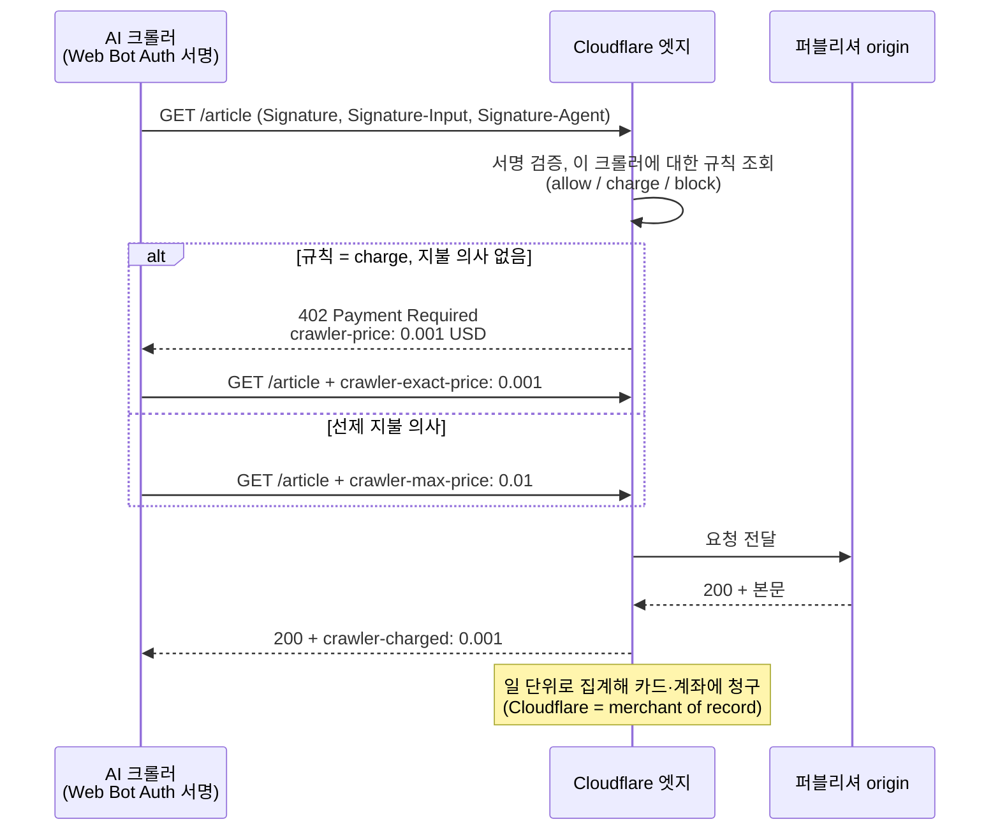
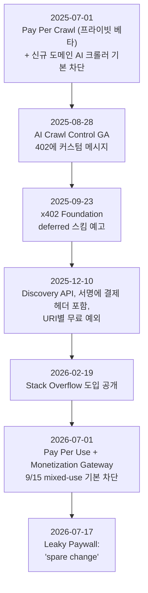

## 초록

Leaky Paywall은 2026년 7월 17일 글에서 Cloudflare의 pay-per-crawl을 "payroll이 아니라 proof-of-concept"이라 불렀다. 봇이 페이지뷰의 1–2%이고 페이지당 $0.001–0.01을 받는다면 월 100만 뷰 사이트의 수입은 $20–200이라는 계산이다. 이 보고서는 그 계산을 검증하고, 계산이 놓친 것을 채운다. 검증 결과 산수는 맞지만 입력값이 의심스럽다. Cloudflare 네트워크에서 HTML 요청의 57.4%가 봇이고 TollBit은 사람 31명당 AI 봇 1회 방문을 관측하므로, "1–2%"는 특정 사이트의 페이지뷰 지표일 뿐 크롤 요청량이 아니다. 그러나 결론은 다른 이유로 더 강하게 성립한다. 프라이빗 베타 14개월째 어떤 퍼블리셔도 수입을 공개하지 않았고, Stack Overflow가 보고한 유일한 효과는 "크롤러들이 트래픽을 끊었다"는 것이며, Cloudflare 자신이 글 발행 16일 전인 2026년 7월 1일에 "크롤은 가치의 조악한 척도"라며 답변에 인용될 때 지불하는 Pay Per Use로 방향을 틀었다. pay-per-crawl이 실제로 남긴 것은 수입 밖의 두 가지 부수 효과다. 기본 차단이 만든 희소성이 직접 라이선스 협상의 지렛대가 됐고, 402와 Web Bot Auth가 에이전트 결제 인프라(x402, Monetization Gateway)의 바닥이 됐다.

## 1. 서론

문제의 글은 WordPress 계량형 페이월 플러그인 Leaky Paywall(ZEEN101)의 블로그에 실렸다[^s24]. 주장은 단순하다. "AI 봇이 사이트 문을 두드리면 Cloudflare는 당신이 정한 규칙을 확인한다: 들여보내거나, 막거나, 돈을 내게 하거나." 봇 트래픽은 통상 페이지뷰의 1–2%이므로 월 100만 뷰면 봇 히트 1–2만 건, 페이지당 $0.001이면 월 약 $20, $0.01이면 약 $200이다. 구독자 한 명이 연 $50–100의 가치를 가지는 것과 비교해 "proof-of-concept이지 payroll이 아니다"라고 결론짓고, 등록벽과 뉴스레터를 권한다[^s01].

세 가지를 따져본다. 이 계산의 입력값이 맞는가. pay-per-crawl은 실제로 무엇이며 누가 썼는가. 그리고 글이 쓰인 2026년 7월 시점에 Cloudflare 자신은 이 모델을 어떻게 보고 있었는가. 마지막 질문이 결정적이다. 글이 나오기 보름 전 Cloudflare가 이미 같은 결론을 다른 말로 발표했기 때문이다.

## 2. 배경: 2025년 7월 1일

Cloudflare는 2025년 7월 1일을 "Content Independence Day"로 선언하고 두 가지를 동시에 바꿨다. 신규 도메인의 기본값을 "크리에이터에게 대가를 지불하지 않는 AI 크롤러는 차단"으로 돌렸고, 같은 날 pay-per-crawl 프라이빗 베타를 열었다[^s02][^s03]. CEO Matthew Prince의 근거는 크롤-대-참조 비율이었다. 옛 Google에 비해 OpenAI로부터 트래픽을 얻기는 750배, Anthropic으로부터는 30,000배 어렵다는 것이다[^s03].

이 비율은 Cloudflare Radar가 정의한 지표다. 특정 AI 플랫폼의 사용자 에이전트가 보낸 HTML 요청 수를, 그 플랫폼을 Referer로 가진 HTML 요청 수로 나눈다[^s28]. 2025년 6월 마지막 주 Anthropic은 70,900:1, Mistral은 0.1:1이었고[^s28], 7월 집계에서는 Anthropic 38,065:1, OpenAI 1,091:1, Perplexity 194:1, Microsoft 40.7:1, Google 5.4:1이었다[^s04]. Radar 자체가 경고하듯 네이티브 앱은 Referer를 보내지 않으므로 이 숫자는 실제보다 부풀려 있다[^s28]. 한 달 사이 Anthropic 수치가 절반으로 줄어든 것도 측정의 거칠기를 보여준다. 방향은 분명하되 자릿수까지 믿을 지표는 아니다.

같은 날 Cloudflare는 Verified Bots 프로그램에 HTTP Message Signatures를 넣었다[^s02]. 크롤러가 요청에 서명하고 서버가 그 서명을 검증하는 이 구조(Web Bot Auth)가 없으면 과금은 불가능하다. User-Agent만으로는 "누구든 그 에이전트인 척할 수 있기" 때문이다[^s20].

## 3. 메커니즘

pay-per-crawl은 HTTP 402 위에 얹혀 있다. 402는 "디지털 캐시나 소액결제 시스템을 위해 만들어졌지만 표준 사용 관례가 없고, 예약만 되고 정의되지 않은" 상태 코드다[^s31]. Cloudflare는 여기에 네 개의 헤더를 정의했다[^s02].

_그림 1 — pay-per-crawl 요청 흐름. 가격은 도메인 전체에 하나이고, 과금은 200 응답이 성공했을 때만 발생한다. 정산은 x402 "deferred" 스킴 설명에 따르면 하루 단위 일괄이다.[^s02][^s05][^s10][^s25]_

퍼블리셔 쪽 설정은 세 개의 선택지다. 크롤러별로 Allow, Charge, Block 중 하나를 고르고, 과금 가격은 "존(zone) 단위" 하나다[^s02][^s10]. 최소 가격은 $0.001이며 "성공한 콘텐츠 검색(HTTP 200 응답)마다" 청구된다[^s25]. 크롤러 쪽은 Ed25519 키 쌍을 만들고, 공개키를 `/.well-known/http-message-signatures-directory`에 JWKS로 게시하고, Cloudflare에 그 디렉터리 URL을 등록해야 한다[^s02][^s19]. 결제 헤더는 2025년 12월부터 서명 대상에 포함돼야 하고, 참여 도메인은 Discovery API로 조회할 수 있는데 이 API 역시 Web Bot Auth 서명이 필수다[^s21][^s26].

Web Bot Auth의 근거 문서는 IETF 개인 초안이다. 아키텍처 초안 05판은 2026년 3월에 나와 9월 3일에 만료됐고 프로토콜 초안으로 대체됐다. IETF 표준 절차에서 "공식 지위가 없다"[^s20]. 따라서 이 결제 흐름의 신원 층은 Cloudflare가 정의하고 Cloudflare가 검증하는 것이지 웹 표준이 아니다.

Cloudflare는 이 정산을 x402로 옮길 계획을 2025년 9월에 밝혔다. 크롤러가 "많은 페이지를 쉽게 크롤하고 감사 로그를 생성한 뒤 하루가 끝날 때 연결된 카드나 계좌로 단일 수수료를 청구받는" 현 방식을 x402의 deferred 스킴으로 형식화하겠다는 것이다[^s05]. 2026년 7월에는 이를 일반화한 Monetization Gateway를 예고했다. "웹 페이지, 데이터셋, API, MCP 도구" 어느 것에든 과금하고 스테이블코인으로 x402 위에서 정산하며, 예시 가격은 요청당 $0.01, 기본 $0.001에 MB당 $0.01 등이다[^s23]. x402 자체는 이 사이트의 다른 보고서들이 다룬다.

## 4. 경제학: 글의 산수 검증

### 4.1 산수는 맞다

월 100만 페이지뷰, 봇 비율 1–2%, 페이지당 $0.001–0.01이면 월 $10–200이다. 글의 $20–200과 일치한다. 최소 가격 $0.001은 Cloudflare 문서와 같다[^s25]. 여기까지는 문제가 없다.

### 4.2 입력값이 의심스럽다

"봇 트래픽은 통상 페이지뷰의 1–2%"라는 전제는 출처가 없다. 반대 방향의 데이터는 많다.

| 지표 | 값 | 출처 |
|---|---|---|
| Cloudflare 네트워크 HTML 요청 중 봇 비율 (2026-06) | 57.4% | [^s07] |
| 그중 학습용 크롤러 | 50.6% | [^s07] |
| 사람 방문 대비 AI 봇 방문 (TollBit, 2025 Q4) | 31:1 | [^s12] |
| 같은 지표 2025 Q1 | 200:1 | [^s12] |
| AI 크롤 중 변경 없는 페이지 재수집 | 50% 이상 | [^s06][^s27] |

두 지표는 같은 것을 재지 않는다. Leaky Paywall의 "페이지뷰"는 분석 도구가 세는 사람 방문이고, Cloudflare의 57.4%는 네트워크 전체 HTML 요청 중 자동화 비율이며, TollBit의 31:1은 "AI 봇"으로 분류된 방문만 센다. 그러나 pay-per-crawl은 페이지뷰가 아니라 요청에 과금한다. 봇 요청이 사람 요청보다 많다면 글의 봇 히트 1–2만 건은 자릿수 하나가 빠진 것이고, 그 절반이 재수집이라면 과금 가능한 요청은 다시 절반이다. 어느 쪽으로 계산해도 "월 수백 달러" 결론은 유지되지만, 그 결론에 이르는 경로는 글과 다르다. 봇이 적어서가 아니라 페이지당 가격이 낮아서다.

### 4.3 아무도 숫자를 내지 않았다

베타 시작 후 14개월 동안 pay-per-crawl 수입을 공개한 퍼블리셔는 찾지 못했다. 가장 자세한 공개 사례인 Stack Overflow(2026년 2월)조차 가격을 밝히지 않았고, 보고한 효과는 하나다. "Pay Per Crawl을 켜자... 그들이 우리 쪽으로 트래픽을 보내는 걸 멈췄다. 메시지를 받은 셈이다"[^s09]. 같은 팀은 "이 402들이 전환을 이끌어 봇 뒤의 사람들이 결제 정보를 제공하길" 바란다고 했다[^s09]. 즉 관측된 결과는 지불이 아니라 이탈이었다.

OpenAI, Anthropic, Google이 pay-per-crawl 결제자로 등록했다는 공개 확인도 없다. 2026년 7월 발표에 이름이 오른 결제 측 파트너는 Ceramic.ai와 You.com 둘이다[^s06][^s08].

### 4.4 비교 대상

글이 구독자 가치($50–100/년)를 비교 기준으로 든 것은 벤더의 자기 제품이다[^s24]. 더 공정한 비교는 직접 라이선스다. News Corp–OpenAI는 5년 약 $2.5억[^s30], Reddit–Google은 약 $6천만[^s16]이다. Cloudflare는 지난 1년간 "50건 이상의 주요 콘텐츠 라이선스 계약"이 체결됐다고 밝혔다[^s08]. 페이지당 $0.001로 $6천만을 만들려면 600억 페이지가 필요하다. 크롤 과금이 라이선스를 대체할 수 없다는 것은 Stack Overflow도 인정한다. "전통적 데이터 라이선스를 대체하는 것이 아니라 보완한다"[^s22].

## 5. 2026년 7월 1일: Cloudflare의 자기 수정

Leaky Paywall 글은 7월 17일에 나왔다. 7월 1일, 두 번째 Content Independence Day에 Cloudflare는 세 가지를 발표했다[^s08][^s27].

- **Pay Per Use.** "크롤은 가치의 조악한 척도"라는 진단 아래, 콘텐츠가 답변에 나타날 때 지불하는 모델로 확장한다. Ceramic.ai는 검색 결과에 콘텐츠가 나타나면, You.com은 에이전트가 특정 프리미엄 콘텐츠를 그때그때 사면 지불한다[^s27].
- **9월 15일 기본 차단.** 신규 사이트와 설정을 바꾸지 않은 무료 사용자에 대해, 광고가 있는 페이지에서 AI 학습·에이전트 크롤러를 기본 차단한다. 검색 인덱싱은 유지된다. 용도를 분리하지 않는 "mixed-use" 크롤러는 광고 페이지에서 막힌다[^s06][^s18].
- **재수집 억제.** 좋은 봇의 크롤 트래픽 절반 이상이 변경 없는 페이지 재수집이므로, 변경 없음을 알리는 신호를 시험한다[^s27].

_그림 2 — pay-per-crawl 연표. 글이 평가한 대상은 발행 시점에 이미 후속 모델로 대체되는 중이었다.[^s01][^s02][^s05][^s08][^s09][^s11][^s26]_

Cloudflare의 진단은 Media Copilot이 요약한 문제와 같다. 크롤된 콘텐츠 하나가 "수백, 수천 개의 답변에 쓰일 수도 있고 한 번도 안 쓰일 수도 있다"[^s17]. 페이지당 과금은 이 둘을 구분하지 못한다. 그러니 pay-per-crawl이 푼돈이라는 글의 결론은 Cloudflare가 보름 먼저, 더 정확한 이유로 내린 것이다. 다만 글은 이를 언급하지 않는다.

Pay Per Use가 얼마를 만들지는 아직 아무도 모른다. Cloudflare는 이를 "실험"이라 부르고[^s07][^s27], 인용 여부를 어떻게 측정·감사하는지는 파트너별 합의 외에 공개된 것이 없다. Media Copilot의 회의는 구조적이다. AI 기업은 "항상 가장 적은 비용으로 가장 좋고 많은 데이터를 택할 것"이며, Cloudflare 경로가 더 싸지 않으면 "실험으로 남을 것"이다[^s17].

## 6. 대안과 경쟁 모델

pay-per-crawl은 세 층 중 하나다.

**선호 표기 층.** IETF AIPREF 워킹그룹은 AI 관련 선호를 표현하는 어휘와 콘텐츠에 붙이는 방법을 표준화하되, "선호의 기술적 집행"과 "크롤러 인증·인가 프로토콜"은 명시적으로 범위 밖이다[^s15]. 돈과 무관한 신호 층이다.

**라이선스 조건 층.** RSL(Really Simple Licensing)은 2025년 9월 10일 Reddit, Yahoo, People Inc., Ziff Davis, Medium, O'Reilly 등의 지지로 출범했다. robots.txt에 기계가 읽을 수 있는 라이선스·로열티 조건을 넣고, 옵션에 free, attribution, subscription, pay-per-crawl, pay-per-inference를 둔다. 집행은 Fastly와 협력하며, RSL Collective가 ASCAP처럼 집단 협상을 맡는다[^s13][^s14]. 여기서 "pay-per-crawl"은 조건 유형의 이름이며 Cloudflare 제품과는 별개이고, "pay-per-inference"는 Cloudflare가 2026년 7월에 도달한 Pay Per Use와 같은 발상이다.

**집행·정산 층.** 이것이 Cloudflare의 자리다. 402를 실제로 돌려주고 서명을 검증하고 돈을 걷는다. RSL 발표 보도는 Cloudflare가 "결국 역할을 할 수도 있다"고 썼지만[^s14], 두 진영은 별도로 움직인다.

세 층 어느 것도 대형 퍼블리셔가 실제로 돈을 받는 경로가 아니다. 그 경로는 직접 계약이고, Cloudflare의 CSO Stephanie Cohen이 말하는 자사 도구의 가치도 거기 있다. "고객들이 우리 도구로 콘텐츠의 신뢰할 만한 희소성을 만들고, 그다음 더 나은 계약을 협상한다." Financial Times, The Atlantic, Ziff Davis, Condé Nast, AP가 예로 거론됐고, People Inc. CEO는 투자자에게 "Cloudflare 차단으로 거의 모두를 막을 수 있기 때문에 사람들이 우리 콘텐츠의 가치를 이해한다. 돈을 내야 한다"고 말했다[^s29].

## 7. 분석: 무엇이 푼돈이고 무엇이 아닌가

글의 결론에 동의하되 근거를 바꿔야 한다.

**페이지당 과금은 롱테일에게 구조적으로 적다.** 봇의 수와는 무관하다. 가격 바닥이 $0.001이고[^s25], 크롤러가 값을 내느니 떠나는 쪽을 택하며[^s09], 크롤 절반이 재수집이라 과금 대상에서 빠지기 때문이다[^s27]. 소액결제가 "처리 수고에 비해 단일 고객의 소액 수입이 가치가 없어" 역사적으로 실패했다는 지적[^s17]은 Cloudflare가 CDN 위치로 수고를 없앴다 해도 수입 쪽 문제를 풀지 못한다.

**지렛대는 푼돈이 아니다.** 기본 차단은 pay-per-crawl과 같은 날 나왔고, 실제 돈은 차단이 만든 희소성 위에서 체결된 50여 건의 라이선스 계약[^s08]과 그 협상 테이블[^s29]에서 나왔다. Cloudflare 자신이 이 두 가지를 하나의 패키지로 판다. 글은 결제 기능만 떼어 평가했다.

**인프라는 아직 값이 안 매겨졌다.** Web Bot Auth 서명, 402 헤더 규약, 일 단위 정산은 pay-per-crawl을 위해 만들어졌지만 Monetization Gateway와 x402 deferred 스킴이 그대로 물려받는다[^s05][^s23]. 과금 대상이 "페이지"에서 "API, 데이터셋, MCP 도구"로 넓어지면 단가 $0.001의 문제는 다른 문제가 된다. 이 부분은 아직 대기자 명단 단계다[^s23].

**Pay Per Use는 이름이 바뀐 같은 질문이다.** 인용당 지불이 페이지당 지불보다 정확한 척도인 것은 맞다. 누가 인용을 세고 누가 감사하며 AI 기업이 왜 이 경로를 택하는가는 답이 없다. 두 파트너 모두 대형 AI 랩이 아니다[^s06].

퍼블리셔에게 실용적인 결론은 글과 같다. pay-per-crawl 스위치는 켜되 수입으로 계산하지 말고, 차단이 만드는 협상력과 등록벽·뉴스레터 같은 직접 관계에 투자하라. 다만 글이 그렇게 권하는 회사가 등록벽 플러그인을 판다는 것은 적어둘 만하다[^s24].

## 8. 한계

- 글의 핵심 입력값(봇 = 페이지뷰의 1–2%)은 출처가 없어 반증할 수 없었다. 반대편 데이터(57.4%, 31:1)는 다른 지표를 잰다.
- pay-per-crawl 실제 수입 부재는 "찾지 못했다"이지 "없다"가 아니다. 베타 참여자는 NDA 아래 있을 수 있다.
- 시장에서 관측된 페이지당 가격 분포는 확보하지 못했다. TollBit 보고서 본문은 읽히지 않았다.
- Cloudflare 네트워크가 하루 약 10억 건의 402를 낸다는 CSO 발언(CoinDesk, 2026-05)은 세 번 모두 429로 가져오지 못해 본문에서 뺐다.
- RFC 9110 §15.5.3 원문은 세 미러 모두 잘려서 MDN 인용으로 대신했다.
- News Corp–OpenAI $2.5억은 단일 출처다. Variety 원문은 TollBit이 게이트한 URL로 리다이렉트돼 402를 반환했다. 이 보고서 주제가 fetch 도중 그대로 재현된 셈이다.
- Pay Per Use의 측정·감사 방식은 어떤 출처에서도 설명되지 않았다.
- Leaky Paywall 글 자체는 벤더 블로그(tier 5)이며, 이 보고서는 그 글을 검증 대상으로 삼았지 근거로 삼지 않았다.
