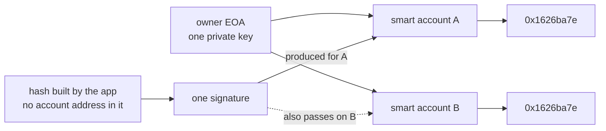
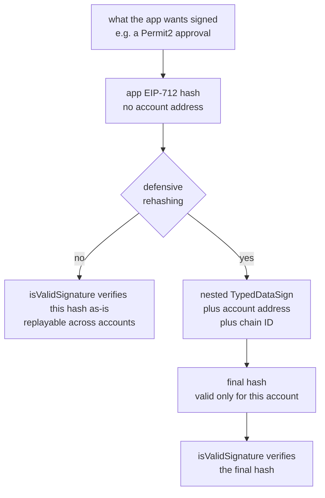
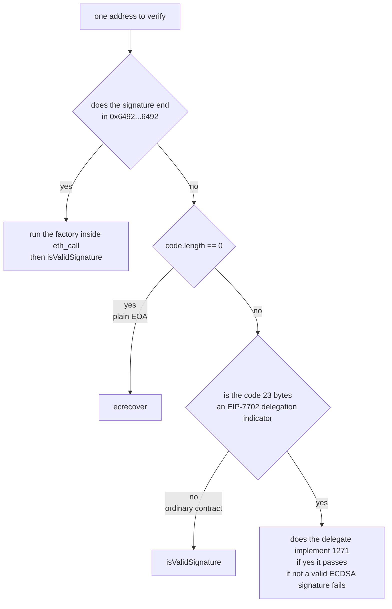
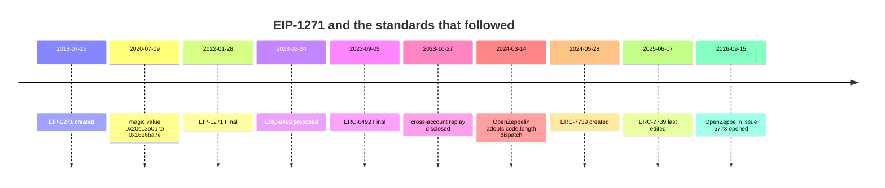

## Abstract

EIP-1271 is the standard that lets a contract sign. It consists of one function, one magic value, and a five-sentence security section[^s01]. Most of Ethereum's smart account ecosystem rests on it.

This report reads the standard out of its own text, its revision history, the source of the implementations that carry it, the three standards that came afterwards, and the incident that broke several account implementations at once in 2023. The argument is that **what EIP-1271 left unsaid shaped its history more than what it specified.** How to derive the hash, how to bind a signature to an account, what to do about accounts that are not deployed yet, how a verifier is supposed to tell an EOA from a contract: the specification answers none of these, and all four came back later as separate ERCs or core EIP proposals.

Three things are shown concretely. The specification's own reference implementation is structurally the code ERC-7739 labels "NOT safe", and that exact shape is what failed across a set of smart accounts in October 2023; the successor standard names it "the mistake of ERC-1271"[^s01][^s09][^s21]. On the verifier side there is no correct answer available: OpenZeppelin moved in 2024 from "try ECDSA, fall back to ERC-1271" to a `code.length` dispatch, because the first form makes key revocation impossible and the second breaks EIP-7702 delegated EOAs; the resolution now hangs on two core EIPs, neither scheduled for a fork[^s17][^s18][^s14][^s16]. And the standardisation clock runs backwards relative to risk: ERC-6492, which handles undeployed accounts, reached Final in six months[^s11], while ERC-7739, which closes the security gap, has been Draft for over two years and its file has not been touched since 2025-06-17[^s12].

Every magic value and typehash quoted here was recomputed from its preimage rather than copied from a comment, and the cross-account replay was demonstrated by executing the verification logic. Scripts and logs are in `working/verify/`.

## 1. What the standard specifies, and what it leaves open

### 1.1 Specified

The substance of the specification is a single signature:

```solidity
function isValidSignature(bytes32 _hash, bytes memory _signature)
    public view returns (bytes4 magicValue);
```

Three requirements attach to it. It MUST return the magic value `0x1626ba7e` on success, it MUST NOT modify state, and it MUST allow external calls[^s01].

The magic value is the function's own selector. The specification's comment gives it as `bytes4(keccak256("isValidSignature(bytes32,bytes)"))`; rather than trust the comment, we recomputed it from the preimage and confirmed `0x1626ba7e`.

Returning `bytes4` instead of `bool` is a choice the specification defends: it wants "stricter and simpler verification"[^s01]. In practice it guards against a contract that never implemented the interface happening to return something truthy. Getting the selector back is close to evidence that the callee knows what was asked of it.

The `view` constraint has a stated reason too. Allowing state changes would open "`GasToken` minting or similar attack vectors"[^s01]. It blocks burning gas during a verification to mint a token, and as a side effect it makes the function callable off-chain.

The security section runs to two paragraphs. One says not to hardcode a gas limit when calling the method. The other says this: "each contract implementing this method is responsible to ensure that the signature passed is indeed valid, otherwise catastrophic outcomes are to be expected"[^s01].

### 1.2 Left open

That sentence is the standard in miniature. The whole safety of verification is delegated to the implementer, and the specification does not say what a safe implementation looks like. Five things are missing in particular.

**The failure return value.** The specification only requires the magic value on success. What to return on failure is unspecified. The reference implementation uses `0xffffffff` and implementations follow it. Solady's comment records exactly that provenance: "We use `0xffffffff` for invalid, in convention with the reference implementation"[^s20]. It causes no trouble in practice, because a verifier only ever checks for equality with the magic value. Trail of Bits gives the same advice: enforce "exact ERC-1271 magic value return (`0x1626ba7e`) on success; anything else is failure"[^s26].

**How the hash is built.** The specification takes a `bytes32 _hash` and stops there. Its Rationale explains that a hash is taken rather than the raw message "since contracts could expect a certain hashing function that is not standard, such as with EIP-712"[^s01]. That latitude is deliberate, and it is what §3 turns into an incident.

**Account binding.** Nothing requires the hash to say which account the signature is for. The reference implementation does not bind it.

**Undeployed accounts.** If the contract does not exist yet there is nothing to call. The specification does not consider the case.

**Verifier behaviour.** The specification says applications "should call this method if the signer is a contract"[^s01] and never says how to determine that the signer is a contract. In 2018 the question answered itself. After EIP-7702 it does not.

A further property goes unmentioned. Contract signatures are **revocable**. Unlike an ecrecover result, `isValidSignature` depends on contract state, so its answer moves over time. OpenZeppelin's `SignatureChecker` states this in a function comment: "Unlike ECDSA signatures, contract signatures are revocable, and the outcome of this function can thus change through time. It could return true at block N and false at block N+1 (or the opposite)"[^s17]. The specification contains no equivalent sentence.

## 2. The day the magic value changed

Created on 2018-07-25, the standard became Final on 2022-01-28[^s01][^s03]: three and a half years. It sat as a Draft until mid-2021, then moved to Review on 2021-06-29 and Last Call on 2021-07-09 before finalising the following January[^s04].

Somewhere in the middle of that long Draft, the interface changed. Commit `92a81d5`, dated 2020-07-09, replaced the function signature and the magic value in one edit[^s02]:

```diff
-  // bytes4(keccak256("isValidSignature(bytes,bytes)")
-  bytes4 constant internal MAGICVALUE = 0x20c13b0b;
+  // bytes4(keccak256("isValidSignature(bytes32,bytes)")
+  bytes4 constant internal MAGICVALUE = 0x1626ba7e;
...
-    bytes memory _data,
+    bytes32 _hash,
```

Both values were recomputed here. `bytes4(keccak256("isValidSignature(bytes,bytes)"))` is `0x20c13b0b` and `bytes4(keccak256("isValidSignature(bytes32,bytes)"))` is `0x1626ba7e`. Different functions, different selectors, no ABI compatibility between an old implementation and a new caller.

The commit that landed on master is titled "Automatically merged updates to draft EIP(s) 1271"[^s02]. That is a bot's title, so reading the file's history alone gives no sign that the interface moved.

Deliberation did happen, though, one hop away. PR #2776 is titled "Change ERC1271 to bytes32 hash" and its body states the reason: taking a hash avoids "the requirement of specific implementation checks within this signature verification functions". Dissent is on the record too, with one participant objecting that "I have use-case where I need to pass the whole data to the contract, not just it hash, because the data defines if the signature can be validated or not." The automerge bot itself declined to merge, replying that "EIP 1271 requires approval from one of" its authors[^s28]. The discussion is in the pull request; the commit log carries none of it.

What that discussion settled is the more interesting part. One participant argued that "we should aim ERC-1271 to provide the same level of functionality as ecrecover does off-chain... introducing additional validation seems to be out-of-scope of this standard", and the proposer concluded that "any extra validation scheme should be standardised separately"[^s28]. The two follow-on standards in §4 and §5 are the direct issue of that decision.

The change was legitimate in the sense that the standard was still a Draft and Drafts are allowed to move. Production implementations already existed all the same: the same commit edited an "Existing implementations" list naming 0x protocol v2 and the ERC725 account[^s02], and proposal to merge took one day[^s28]. Two months later EIP-1654, a separate proposal then in flight, was revised "to reflect the recent changes to EIP-1271" and to take 1271 as a required dependency; that proposal was never merged[^s29].

The result is still on chain. Safe v1.3.0's `CompatibilityFallbackHandler` implements **both** functions[^s05]:

```solidity
bytes4 internal constant UPDATED_MAGIC_VALUE = 0x1626ba7e;

function isValidSignature(bytes calldata _data, bytes calldata _signature)
    public view override returns (bytes4)
{ ... return EIP1271_MAGIC_VALUE; }

function isValidSignature(bytes32 _dataHash, bytes calldata _signature)
    external view returns (bytes4)
{
    ISignatureValidator validator = ISignatureValidator(msg.sender);
    bytes4 value = validator.isValidSignature(abi.encode(_dataHash), _signature);
    return (value == EIP1271_MAGIC_VALUE) ? UPDATED_MAGIC_VALUE : bytes4(0);
}
```

The naming tells the story. In this version `EIP1271_MAGIC_VALUE` holds the old `0x20c13b0b`[^s06], and the value the standard actually specifies lives under the name `UPDATED_MAGIC_VALUE`. The new function wraps the hash with `abi.encode`, hands it to the old one, and translates the return. On Safe's current main branch the legacy function is gone and the identifier `EIP1271_MAGIC_VALUE` now holds `0x1626ba7e`[^s07][^s08]. The same name means two different constants depending on which Safe you are looking at.

The specification was edited twice after Final, on 2022-10-28 and 2023-08-08, both times to the examples rather than the normative text[^s04].

## 3. Replay across accounts

### 3.1 October 2023

On 27 October 2023 Alchemy found an ERC-1271 contract signature replay vulnerability. The affected smart account implementations were LightAccount, Kernel (ZeroDev), Biconomy, Soul Wallet, EIP4337Fallback, AmbireAccount, OKX SmartAccount, Argent BaseWallet and Fuse Wallet; Permit2 and CowSwap were named as applications at risk. An independent security researcher had found the same issue a month earlier[^s21]. That researcher's own writeup is published on mirror.xyz but could not be read here, because the host answers scripted requests with a Cloudflare challenge[^s27], so none of it is quoted. What was confirmed directly is that Solady's `ERC1271` source cites that exact URL as the reference for why defensive rehashing exists[^s20].

The disclosure states that nothing was lost: "At this point, no funds are at risk and the impact to applications is fairly limited"[^s21] _(the discovering party's own account)_.

### 3.2 The shape of the flaw

The precondition is undemanding. One EOA owns several smart accounts, and the application builds a hash that does not name an account. A signature made for one account then verifies against the others. ERC-7739's Motivation describes exactly this and names Permit2 as a live example[^s09].



_Figure 1 — the precondition for cross-account replay. When the hash names no account, both accounts recover the same signer[^s09][^s21]._

We checked this by running it. The verification logic was reimplemented in JavaScript, a key was generated in-process, a real secp256k1 signature was produced, and both accounts were asked to validate it.

```
naive implementation (EIP-1271 reference shape)
PASS  signature produced for account A is accepted by A   -> 0x1626ba7e
PASS  the SAME signature is also accepted by account B    -> 0x1626ba7e
```

This is a reimplementation of verification logic, not an on-chain test: no contract was deployed and no EVM was run. It shows the arithmetic fact that an unbound hash recovers to the owner under both accounts. It is not a claim about the current state of any particular implementation.

### 3.3 The reference implementation

An uncomfortable comparison follows. Here is the example ERC-7739 presents under a "NOT safe" annotation[^s09]:

```solidity
/// @dev This implementation is NOT safe.
function isValidSignature(bytes32 hash, bytes calldata signature)
    external override view returns (bytes4)
{
    ...
    address signer = ecrecover(hash, v, r, s);
    if (signer == owner) { return 0x1626ba7e; } else { return 0xffffffff; }
}
```

And here is EIP-1271's own Reference Implementation[^s01]:

```solidity
function isValidSignature(bytes32 _hash, bytes calldata _signature)
    external override view returns (bytes4)
{
    if (recoverSigner(_hash, _signature) == owner) {
      return 0x1626ba7e;
    } else {
      return 0xffffffff;
    }
}
```

Both recover a signer from the hash and compare it to `owner`. Both reject malleable signatures and zero-address recovery. Neither binds the account address into the hash. The structures match.

The comparison is not only ours. ERC-7739 says it outright when introducing its own reference implementation: "The reference implementation is intentionally not minimalistic. This is to avoid repeating **the mistake of ERC-1271**, where a minimalist reference implementation is wrongly assumed to be safe for production use"[^s09]. A successor standard naming its predecessor's reference implementation as a mistake is about as explicit as this gets. Set beside Francisco Giordano's appearance as an author of both, it reads as a standard belatedly documenting the hazard in its own example code.

One can still argue that a reference implementation is an illustration of an interface rather than a deployment template. ERC-7739's sentence is the observation that this reading did not survive contact with practice.

### 3.4 Why Safe was untouched

Alchemy records that Gnosis Safe was not vulnerable to this vector[^s21], and the source shows why. Safe's `CompatibilityFallbackHandler` does not verify the incoming hash directly; it rehashes it into a `SafeMessage` under the Safe's own domain[^s07]:

```solidity
bytes memory messageData = encodeMessageDataForSafe(safe, abi.encode(_dataHash));
bytes32 messageHash = keccak256(messageData);
safe.checkSignatures(address(0), messageHash, _signature);
```

`encodeMessageDataForSafe` builds the final hash from the EIP-712 domain separator and the `SafeMessage(bytes message)` typehash. The domain separator contains that Safe's address, so the signature is valid only for it. The typehash `0x60b3cbf8…` was recomputed from its preimage and matches.

Adding the same rehashing to the verification script inverts the outcome:

```
Safe-style domain binding
PASS  signature produced for account A is accepted by A   -> 0x1626ba7e
PASS  the SAME signature is rejected by account B         -> 0xffffffff
```

A distinction is worth preserving. `EIP4337Fallback` does appear on Alchemy's affected list, and it is not Safe core but a separate adapter connecting a Safe to ERC-4337[^s21]. The same wallet could land on either side of the line depending on which path verified the signature.

### 3.5 What ERC-7739 does

ERC-7739 standardises what Safe did by hand. A smart account must build its final hash from at least (1) the hash, (2) its own address, and (3) the chain ID[^s09]. The technique is called defensive rehashing.



_Figure 2 — where defensive rehashing inserts itself. The application's hash is left alone and the account adds a layer over it[^s09][^s23]._

The design difficulty was readability. Nesting naively puts an opaque hash on the wallet's confirmation screen. ERC-7739 nests through EIP-712 structures arranged so the original contents stay visible, and it takes EIP-712 and ERC-5267's `eip712Domain()` as REQUIRED dependencies[^s09][^s23][^s24].

Its capability detection is an interesting consequence of the base standard. EIP-1271 offers no way to ask an account what it supports, so ERC-7739 borrows the **hash space** instead: pass `0x7739…7739` with an empty signature and a supporting account answers `0x77390001`[^s09][^s20]. Solady computes that sentinel rather than storing it, as `~signature.length / 0xffff * 0x7739`, to save bytecode. We evaluated the expression and confirmed it yields `0x7739` repeated sixteen times.

The standard also allows the rehashing to be skipped when the caller is already known to include the account in its hash. Solady exposes that as `_erc1271CallerIsSafe()` and ships one canonical multicaller address in the default allowlist[^s20].

## 4. Undeployed accounts and ERC-6492

The second gap is one of ordering. The best onboarding for a smart account defers deployment until the first transaction, yet many dApps ask for a login signature before any interaction. A contract that does not exist has no function to call, so ERC-1271 verification cannot happen[^s10].

ERC-6492 solves it with a wrapper. The signature carries the magic suffix `0x6492…6492`, preceded by an ABI encoding of `(create2Factory, factoryCalldata, originalERC1271Signature)`. A verifier that detects the suffix MUST perform the deployment before calling `isValidSignature`[^s10]. The magic bytes are a literal constant rather than a hash, and we confirmed the 32 bytes are `6492` repeated.

Verifier behaviour is specified in four ordered steps. If the magic bytes are present, `eth_call` a multicall contract that runs the factory first and then calls `isValidSignature`. Otherwise, if there is code at the address, do ordinary ERC-1271 verification. If that verification fails and the deploy was skipped because code already existed, run `factoryCalldata` and try again. If there is no code at all, fall back to `ecrecover`[^s10].

Two specifications meet here without anyone reconciling them. EIP-1271 insists that `isValidSignature` must not modify state[^s01], while ERC-6492's verification path involves a deployment. In practice there is no conflict, because it happens inside an `eth_call` and chain state is untouched, but neither document says so.

ERC-6492 went from proposal on 2023-02-24 to Review on 2023-03-10, Last Call on 2023-08-04, and Final on 2023-09-05[^s11]. Roughly six months.

## 5. The verifier's dilemma

The previous two sections concerned the signing side. The remaining gap is on the verifying side, and it is the one still open.

### 5.1 Two shapes

Given an address, a hash and a signature, a verifier must decide: `ecrecover` if the address is an EOA, `isValidSignature` if it is a contract. EIP-1271 does not say how to make that decision.

OpenZeppelin's `SignatureChecker` once tried ECDSA first and fell back to ERC-1271[^s18]:

```solidity
(address recovered, ECDSA.RecoverError error, ) = ECDSA.tryRecover(hash, signature);
return (error == ECDSA.RecoverError.NoError && recovered == signer) ||
       isValidERC1271SignatureNow(signer, hash, signature);
```

PR #4951, merged on 2024-03-14, replaced that with an explicit dispatch[^s19][^s17]:

```solidity
if (signer.code.length == 0) {
    (address recovered, ECDSA.RecoverError err, ) = ECDSA.tryRecover(hash, signature);
    return err == ECDSA.RecoverError.NoError && recovered == signer;
} else {
    return isValidERC1271SignatureNow(signer, hash, signature);
}
```

The maintainer's own reasoning is on record. Under the `||` form, "an account whose address is derived from an ECDSA key can never fully revoke that key at the application level: whatever its `isValidSignature` returns, a raw ECDSA signature from the original key keeps validating." The dispatch lets such an account migrate off the key, "at the cost of one `EXTCODESIZE` and of making ERC-1271 the only accepted scheme once the account has code"[^s18].

### 5.2 Enter EIP-7702

That cost becomes a problem under EIP-7702. For a delegated account, `EXTCODESIZE` returns 23, the size of the delegation indicator `0xef0100 || address`[^s13].

A delegated EOA therefore fails the `signer.code.length == 0` test and is routed to ERC-1271. If the delegate does not implement `isValidSignature`, the account's ordinary ECDSA signature stops validating. The private key is unchanged and still sends transactions from that account; only signature verification breaks.



_Figure 3 — the branches a verifier actually faces. The bottom path appeared with EIP-7702 and no standard currently specifies how to handle it[^s10][^s13][^s17][^s18]._

### 5.3 Pushed down to the protocol

The library side has decided not to resolve this at the application layer. Issue #6773, opened on 2026-09-15 and labelled `on hold`, pins the resolution to two core EIPs[^s18].

EIP-8151 applies the EIP-3607 account-code restriction to the `ecRecover` precompile: after recovery it returns the address only if that account's raw code is empty or is exactly an EIP-7702 delegation indicator, and 32 zero bytes otherwise[^s14]. EIP-8298 adds a `SETCODEFROM` instruction giving an EOA a migration path to holding regular code rather than a delegation indicator[^s15]. Together, an account that has migrated off its key ends up with regular code and `ecRecover` returns zero for it; the ECDSA branch of the `||` form can no longer shadow ERC-1271, the `code.length` dispatch becomes redundant, and the library can revert to the older shape[^s18].

The prospect should not be oversold. Neither EIP is primarily about ERC-1271, since their stated motivation is post-quantum authority migration[^s14][^s15], and both are Drafts. Reading the Hegotá hardfork meta directly, both appear only under "Proposed for Inclusion", with nothing under "Scheduled for Inclusion" or "Considered for Inclusion"[^s16]. They have not advanced past being proposed.

Which leaves the current position: the blank EIP-1271 left where verifier behaviour should have been offers only choices that break something at the application layer, and its resolution now depends on two unscheduled protocol proposals.

## 6. Three standards, three speeds

Laid side by side, the trajectories do not line up with the risk.

| Standard | Gap addressed | Proposed | Status now | Elapsed |
|---|---|---|---|---|
| EIP-1271 | contract signatures themselves | 2018-07-25 | Final 2022-01-28 | ~3 years 6 months |
| ERC-6492 | undeployed accounts | 2023-02-24 | Final 2023-09-05 | ~6 months |
| ERC-7739 | cross-account replay | 2024-05-28 | **Draft** | 2+ years, ongoing |



_Figure 4 — standards, incident and implementations in sequence. ERC-7739 is the only line without an endpoint[^s01][^s03][^s02][^s11][^s12][^s18][^s19][^s21]._

The slowest of the three is the one closing a security gap. ERC-7739's file has four commits in the ERCs repository and none since 2025-06-17[^s12]. Implementations went ahead of it: Solady makes nested EIP-712 the default behaviour of its `ERC1271` mixin[^s20], and OpenZeppelin ships it as `draft-ERC7739.sol`, the `draft-` prefix being that library's marker for an ERC that has not reached Final[^s25].

Nor does the field look settled. Trail of Bits published six common mistakes in ERC-4337 smart accounts on 2026-03-11; the fourth is the "ERC-1271 replay signature attack", and its vulnerable example carries the annotation "recovers over a raw hash, not bound to this contract or chainId"[^s26]. That is two years and five months after the disclosure. The same post does not mention ERC-7739.

One further data point, offered as context rather than proof. An ICSE 2026 paper on signature replay vulnerabilities generally examined 1,419 audit reports, extracted 108 cases into five types, and measured that roughly 19.63% of Ethereum contracts using signatures carry a flaw of this family[^s22]. The figure is not specific to ERC-1271 and does not support this report's claims directly. It does suggest that the territory EIP-1271 handed wholesale to implementers is territory that gets implemented wrong at scale.

## 7. Limitations

- **This is a 2026-09-18 snapshot.** OpenZeppelin issue #6773 was opened three days earlier, and the Draft status of ERC-7739 and the Hegotá standing of EIP-8151 and EIP-8298 can all move. Sections 5 and 6 depend on those three facts.
- **The reproduction script is not an on-chain test.** `verify_replay.mjs` reimplements three verification paths in JavaScript. The ECDSA signing and recovery are real, but no contract was deployed and no EVM was executed. What it shows is arithmetic, not the present state of any deployed implementation.
- **The independent researcher's own account could not be read.** mirror.xyz answers with a Cloudflare challenge[^s27]. The prior discovery is established only from the Alchemy disclosure and from Solady's source citing that URL.
- **The 2023 incident's scope and the "no funds at risk" statement come from the discovering party.** The existence and nature of the flaw were confirmed independently through the ERC-7739 specification and the Trail of Bits post, but no third-party verification of the affected list's completeness or of the loss figure was found.
- **EIP-1271's adoption was not quantified.** We could not count contracts implementing `isValidSignature` on chain or measure call volume. Statements that it is widely used are inferred from the implementing libraries and the affected list.
- **ERC-7739's adoption is likewise unmeasured.** Confirmed only that Solady and OpenZeppelin implement it, not what fraction of deployed accounts use it.
- **The nine implementations from 2023 were not individually re-checked.** Alchemy states that the accounts involved acknowledged the risk or shipped a fix; each one's present state was not verified here.
- **The comparison in §3.3 is our reading.** That the reference implementation and ERC-7739's unsafe example are structurally the same comes from placing two code blocks side by side, and neither specification states the relationship. The counterargument, that a reference implementation is an illustration rather than a template, is given alongside it.
- **The 19.63% figure is not an ERC-1271 measurement.** It covers signature replay flaws generally and is used here only as context.
- **Whether a revision of EIP-1271 is under discussion was not established.** We confirmed only that the normative text has not changed since Final.
