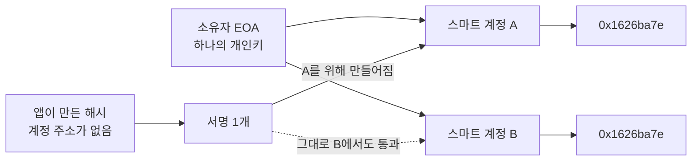
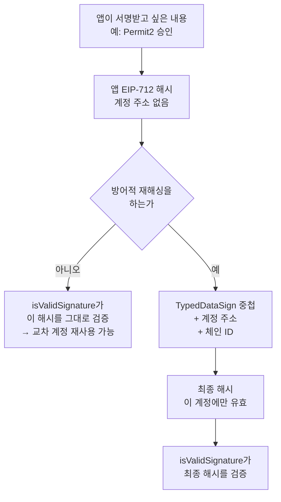
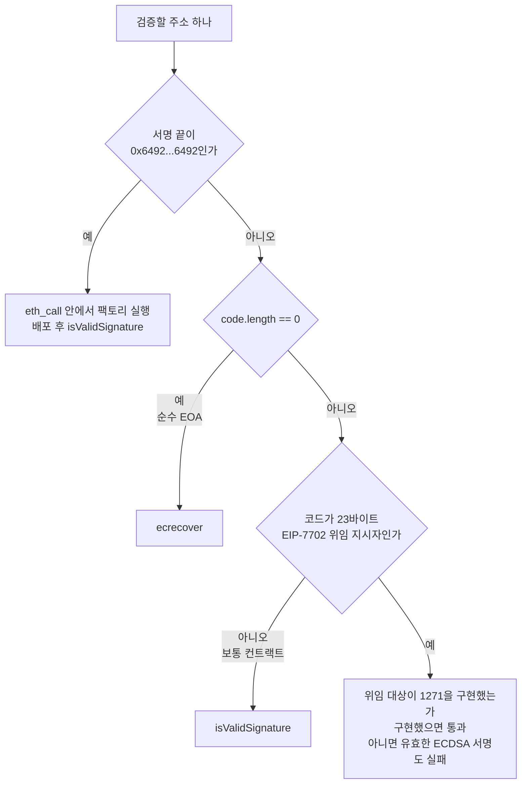
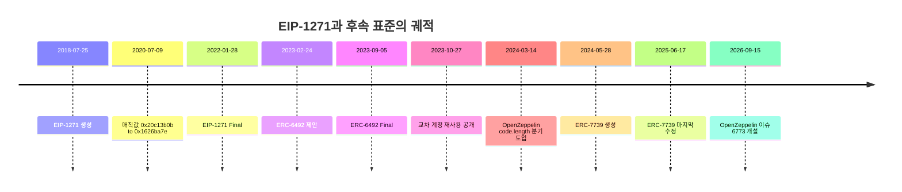

## 초록

EIP-1271은 컨트랙트가 서명할 수 있게 해 주는 표준이다. 함수 하나, 매직값 하나, 그리고 다섯 문장짜리 보안 고려사항이 전부다[^s01]. 이더리움의 스마트 계정 생태계 전체가 이 위에 서 있다.

본 리포트는 명세 원문과 개정 이력, 주요 구현 소스, 후속 표준 셋, 그리고 2023년에 실제로 터진 사고를 근거로 이 표준을 분석한다. 중심 논지는 하나다. **EIP-1271이 규정한 것보다 규정하지 않은 것이 이 표준의 역사를 만들었다.** 해시를 어떻게 도출할지, 서명을 계정에 어떻게 묶을지, 배포되지 않은 계정은 어떻게 할지, 검증자가 EOA와 컨트랙트를 무엇으로 구분할지 — 명세는 이 넷 중 어느 것도 말하지 않았고, 넷 모두가 나중에 별도의 ERC나 코어 EIP 제안으로 돌아왔다.

구체적으로 셋을 보인다. 첫째, 명세의 참조 구현은 ERC-7739가 "안전하지 않다"고 지목한 코드와 구조적으로 같고, 2023년 10월 다수의 스마트 계정 구현을 동시에 무너뜨린 것이 정확히 그 형태였다. 후속 표준은 이를 "ERC-1271의 실수"라고 이름을 들어 부른다[^s01][^s09][^s21]. 둘째, 검증자 측에는 정답이 없다. OpenZeppelin은 2024년에 ecrecover 우선 방식에서 `code.length` 분기로 옮겼는데, 전자는 키 폐기를 불가능하게 만들고 후자는 EIP-7702로 위임된 EOA를 깨뜨린다. 이 문제의 해소는 지금 코어 EIP 두 건에 걸려 있고 둘 다 하드포크 편입이 확정되지 않았다[^s17][^s18][^s14][^s16]. 셋째, 표준화 속도가 어긋나 있다. 미배포 계정을 다루는 ERC-6492는 6개월 만에 Final이 되었지만[^s11], 보안 공백을 메우는 ERC-7739는 2년 넘게 Draft이고 명세 파일은 2025-06-17 이후 손대지 않았다[^s12].

인용한 매직값과 타입해시 여섯 개는 전부 원문에서 재계산해 대조했고, 교차 계정 재사용은 검증 로직을 재현해 실행으로 보였다. 스크립트와 로그는 `working/verify/`에 있다.

## 1. 표준이 규정한 것과 규정하지 않은 것

### 1.1 규정한 것

명세에서 규범에 해당하는 것은 함수 시그니처 하나다.

```solidity
function isValidSignature(bytes32 _hash, bytes memory _signature)
    public view returns (bytes4 magicValue);
```

요구사항은 셋이다. 성공 시 매직값 `0x1626ba7e`를 MUST 반환할 것, 상태를 MUST NOT 변경할 것, 외부 호출을 MUST 허용할 것[^s01].

매직값은 함수 시그니처의 셀렉터다. 명세 주석이 `bytes4(keccak256("isValidSignature(bytes32,bytes)"))`라고 적어 두었는데, 이 리포트에서는 주석을 믿지 않고 원문에서 다시 계산해 `0x1626ba7e`와 일치함을 확인했다.

bool 대신 bytes4를 고른 이유는 명세가 직접 밝힌다. "더 엄격하고 단순한 검증"을 위해서다[^s01]. 실질적으로는 `isValidSignature`를 구현하지 않은 컨트랙트가 우연히 truthy한 값을 돌려주는 사고를 막는다. 셀렉터와 같은 값을 돌려받았다는 것은 호출된 쪽이 이 인터페이스를 알고 있다는 뜻에 가깝다.

`view` 제약의 근거도 명시되어 있다. 상태 변경을 허용하면 "GasToken 발행류 공격 벡터"가 열린다는 것이다[^s01]. 검증 한 번에 가스를 태워 토큰을 찍는 구조를 차단하려는 설계이며, 동시에 오프체인에서 컨트랙트에 질의할 수 있게 해 준다.

보안 고려사항은 두 문단이다. 하나는 가스 한도를 하드코딩하지 말라는 것이고, 다른 하나는 이렇다. "이 메서드를 구현하는 각 컨트랙트는 전달된 서명이 실제로 유효한지 보장할 책임이 있으며, 그렇지 않으면 파국적 결과를 각오해야 한다"[^s01].

### 1.2 규정하지 않은 것

그 문장이 이 표준의 성격을 요약한다. 검증의 안전성 전체가 구현자에게 위임되어 있고, 명세는 무엇을 하면 안전한지 말하지 않는다. 구체적으로 다음 다섯 가지가 비어 있다.

**실패 시 반환값.** 명세는 성공 시 매직값을 MUST 반환하라고만 한다. 실패했을 때 무엇을 돌려줄지는 규범이 없다. 참조 구현이 `0xffffffff`를 쓰고, 구현체들이 이를 따른다. Solady의 주석이 이 사정을 그대로 적는다. "유효하지 않을 때 `0xffffffff`를 쓴다. 참조 구현의 관행에 따른 것이다"[^s20]. 실무에서는 문제가 되지 않는다. 검증자가 매직값과의 일치만 보면 되기 때문이다. Trail of Bits의 권고도 같다. "성공 시 정확한 ERC-1271 매직값 반환을 강제하라. 그 외의 모든 것은 실패다"[^s26].

**해시를 어떻게 만들 것인가.** 명세는 `bytes32 _hash`를 받는다고만 한다. Rationale은 해시되지 않은 원문 대신 해시를 받는 이유를 "컨트랙트가 EIP-712처럼 표준이 아닌 특정 해싱 함수를 기대할 수 있기 때문"이라고 설명한다[^s01]. 자유도를 준 것인데, 그 자유도가 §2의 사고를 낳는다.

**계정 바인딩.** 서명이 어느 계정을 위한 것인지 해시에 묶으라는 요구가 없다. 참조 구현도 묶지 않는다.

**미배포 계정.** 컨트랙트가 아직 배포되지 않았으면 `isValidSignature`를 호출할 대상 자체가 없다. 명세는 이 경우를 다루지 않는다.

**검증자 측 동작.** 명세는 "서명자가 컨트랙트라면 이 메서드를 호출해야 한다"고만 적는다[^s01]. 서명자가 컨트랙트인지 어떻게 판정하는지는 말하지 않는다. 2018년에는 자명한 질문이었고, EIP-7702 이후로는 그렇지 않다.

여기에 명세가 언급조차 하지 않은 성질이 하나 더 있다. 컨트랙트 서명은 **철회 가능하다**. ecrecover로 검증하는 EOA 서명과 달리 `isValidSignature`의 결과는 컨트랙트 상태에 의존하므로 시간에 따라 바뀐다. OpenZeppelin의 `SignatureChecker`는 이를 함수 주석에 못 박아 두었다. "ECDSA 서명과 달리 컨트랙트 서명은 철회 가능하며, 따라서 이 함수의 결과는 시간에 따라 바뀔 수 있다. 블록 N에서 true를, 블록 N+1에서 false를 반환할 수 있다"[^s17]. 명세에는 이 서술이 없다.

## 2. 이력 — 매직값이 바뀐 날

생성일은 2018-07-25, Final 확정은 2022-01-28이다[^s01][^s03]. 3년 6개월이 걸렸다. 상태 이력을 보면 2021년 6월까지 Draft로 있다가 Review(2021-06-29), Last Call(2021-07-09)을 거쳐 이듬해 Final에 도달했다[^s04].

그 긴 Draft 기간 한가운데에 인터페이스가 바뀐 날이 있다. 2020-07-09 커밋 `92a81d5`는 함수 시그니처와 매직값을 동시에 교체했다[^s02].

```diff
-  // bytes4(keccak256("isValidSignature(bytes,bytes)")
-  bytes4 constant internal MAGICVALUE = 0x20c13b0b;
+  // bytes4(keccak256("isValidSignature(bytes32,bytes)")
+  bytes4 constant internal MAGICVALUE = 0x1626ba7e;
...
-    bytes memory _data,
+    bytes32 _hash,
```

두 값 모두 재계산해 확인했다. `bytes4(keccak256("isValidSignature(bytes,bytes)"))`는 `0x20c13b0b`이고, `bytes4(keccak256("isValidSignature(bytes32,bytes)"))`는 `0x1626ba7e`다. 서로 다른 함수이므로 서로 다른 셀렉터이며, 구 구현과 신 구현 사이에는 ABI 호환성이 없다.

마스터에 남은 이 커밋의 제목은 "Automatically merged updates to draft EIP(s) 1271"이다[^s02]. 봇이 붙이는 제목이라 파일 이력만 훑어서는 인터페이스가 바뀌었다는 신호를 읽을 수 없다.

다만 그 뒤에 심의가 없었던 것은 아니다. 해당 PR #2776의 제목은 "Change ERC1271 to bytes32 hash"로 변경 내용을 그대로 적고 있고, 본문은 "구현별 검사 요구를 이 서명 검증 함수 안에 넣지 않기 위해" 해시를 받도록 바꾼다고 근거를 밝힌다. 반대 의견도 기록되어 있다. 한 참여자는 "전체 데이터를 컨트랙트에 넘겨야 하는 사용 사례가 있다. 데이터 자체가 서명 검증 가능 여부를 결정하기 때문"이라며 반대했다. 자동 병합 봇도 이 PR을 그냥 통과시키지 않고 "EIP 1271은 저자 중 한 명의 승인이 필요하다"며 거절했다[^s28]. 즉 심의는 PR 쪽에 있고, 커밋 이력 쪽에는 없다.

주목할 것은 그 논의에서 정해진 방침이다. 한 참여자는 "ERC-1271이 오프체인의 ecrecover와 같은 수준의 기능을 제공하는 것을 목표로 해야 하며, 추가 검증을 도입하는 것은 이 표준의 범위 밖"이라고 적었고, 제안자는 "추가 검증 체계는 별도로 표준화되어야 한다"고 결론지었다[^s28]. 이 리포트의 §4와 §5가 다루는 두 개의 후속 표준은 그 결정의 직접적 산물이다.

변경 당시 1271은 Draft였으므로 바뀔 수 있는 것이 정상이었다. 다만 그때 이미 프로덕션 구현이 존재했다. 같은 커밋이 손댄 "Existing implementations" 목록에 0x 프로토콜 v2와 ERC725 계정이 올라 있었고[^s02], 제안에서 병합까지는 하루가 걸렸다[^s28]. 두 달 뒤 별도로 제안되어 있던 EIP-1654가 "EIP-1271의 최근 변경을 반영"하도록 갱신되며 1271을 필수 의존물로 선언했는데, 이 제안 자체는 끝내 병합되지 않았다[^s29].

결과는 지금도 체인 위에 남아 있다. Safe v1.3.0의 `CompatibilityFallbackHandler`는 두 함수를 **모두** 구현한다[^s05].

```solidity
bytes4 internal constant UPDATED_MAGIC_VALUE = 0x1626ba7e;

function isValidSignature(bytes calldata _data, bytes calldata _signature)
    public view override returns (bytes4)
{ ... return EIP1271_MAGIC_VALUE; }

function isValidSignature(bytes32 _dataHash, bytes calldata _signature)
    external view returns (bytes4)
{
    ISignatureValidator validator = ISignatureValidator(msg.sender);
    bytes4 value = validator.isValidSignature(abi.encode(_dataHash), _signature);
    return (value == EIP1271_MAGIC_VALUE) ? UPDATED_MAGIC_VALUE : bytes4(0);
}
```

이름이 상황을 말해 준다. 이 버전에서 `EIP1271_MAGIC_VALUE`는 구 값 `0x20c13b0b`이고[^s06], 표준의 실제 현행 값은 `UPDATED_MAGIC_VALUE`라는 이름으로 들어가 있다. 새 함수는 해시를 `abi.encode`로 감싸 구 함수에 넘긴 뒤 반환값을 번역한다. 현재 Safe main 브랜치에서는 구 함수가 사라졌고, 같은 이름 `EIP1271_MAGIC_VALUE`가 이제 `0x1626ba7e`를 가리킨다[^s07][^s08]. 동일한 식별자가 버전에 따라 다른 상수를 뜻하는 상태다.

Final 이후에도 명세는 두 번 고쳐졌다. 2022-10-28과 2023-08-08의 수정인데 둘 다 예제 코드에 대한 것이고 규범 본문은 건드리지 않았다[^s04].

## 3. 교차 계정 재사용

### 3.1 2023년 10월

2023년 10월 27일 Alchemy가 ERC-1271 컨트랙트 서명 재사용 취약점을 발견했다. 영향을 받은 스마트 계정 구현은 LightAccount, Kernel(ZeroDev), Biconomy, Soul Wallet, EIP4337Fallback, AmbireAccount, OKX SmartAccount, Argent BaseWallet, Fuse Wallet이고, 위험에 노출된 애플리케이션으로 Permit2와 CowSwap이 지목됐다. 독립 보안 연구자 한 명이 그보다 한 달 앞서 같은 문제를 찾아 두었다[^s21]. 그 연구자의 기록은 mirror.xyz에 공개되어 있으나 Cloudflare 챌린지 때문에 읽지 못했고[^s27], 내용을 인용하지 않는다. 다만 Solady의 `ERC1271` 소스가 방어적 재해싱의 근거로 바로 그 URL을 참조한다는 점은 코드에서 직접 확인했다[^s20].

공개 글은 자금 손실이 없었다고 적는다. "현재로서는 위험에 처한 자금이 없으며 애플리케이션에 대한 영향도 상당히 제한적이다"[^s21] _(발견자 측 자체 서술)_.

### 3.2 결함의 형태

조건은 단순하다. 하나의 EOA가 여러 스마트 계정을 소유하고, 애플리케이션이 만드는 해시에 계정 주소가 들어 있지 않으면, 한 계정을 위해 만든 서명이 다른 계정에서도 통과한다. ERC-7739의 Motivation이 이를 그대로 기술하고, Permit2를 실제 사례로 지목한다[^s09].



_Figure 1 — 교차 계정 재사용의 조건. 해시가 계정을 지목하지 않으면 두 계정의 검증이 같은 복구 결과를 낸다[^s09][^s21]._

이 서술이 맞는지 실행으로 확인했다. 검증 로직을 JavaScript로 재현해, 그 자리에서 생성한 키로 실제 secp256k1 서명을 만들고 두 계정에서 각각 검증했다.

```
naive implementation (EIP-1271 reference shape)
PASS  signature produced for account A is accepted by A   -> 0x1626ba7e
PASS  the SAME signature is also accepted by account B    -> 0x1626ba7e
```

이것은 온체인 테스트가 아니라 검증 로직의 재현이다. 컨트랙트를 배포하지 않았고 EVM을 실행하지 않았다. 보이는 것은 "해시에 계정이 묶여 있지 않으면 같은 서명이 두 계정 모두에서 소유자로 복구된다"는 산술적 사실이며, 특정 구현이 현재 취약하다는 주장이 아니다.

### 3.3 명세의 참조 구현과의 관계

여기서 불편한 대조가 하나 나온다. ERC-7739가 "이 구현은 안전하지 않다"는 주석을 붙여 제시하는 예제는 이렇다[^s09].

```solidity
/// @dev This implementation is NOT safe.
function isValidSignature(bytes32 hash, bytes calldata signature)
    external override view returns (bytes4)
{
    ...
    address signer = ecrecover(hash, v, r, s);
    if (signer == owner) { return 0x1626ba7e; } else { return 0xffffffff; }
}
```

EIP-1271의 Reference Implementation은 이렇다[^s01].

```solidity
function isValidSignature(bytes32 _hash, bytes calldata _signature)
    external override view returns (bytes4)
{
    if (recoverSigner(_hash, _signature) == owner) {
      return 0x1626ba7e;
    } else {
      return 0xffffffff;
    }
}
```

둘 다 해시에서 서명자를 복구해 `owner`와 비교하고, 둘 다 서명 가변성과 영주소 복구를 막고, 둘 다 계정 주소를 해시에 묶지 않는다. 구조가 같다.

이것이 필자만의 독해가 아니라는 근거는 ERC-7739 본문에 있다. 자기 참조 구현을 설명하는 대목에서 이렇게 적는다. "참조 구현은 의도적으로 최소주의를 택하지 않았다. 최소주의 참조 구현이 프로덕션에 안전하다고 잘못 받아들여진 **ERC-1271의 실수**를 반복하지 않기 위해서다"[^s09]. 후속 표준이 선행 표준의 참조 구현을 이름을 들어 실수라고 부른 셈이다. ERC-7739의 저자 목록에 EIP-1271의 저자 Francisco Giordano가 들어 있다는 점을 함께 놓으면, 표준이 자기 참조 구현의 위험을 뒤늦게 문서화한 사례로 읽힌다.

참조 구현을 배포용 템플릿 대신 인터페이스 사용법을 보이는 최소 예제로 읽는 반론이 가능하기는 하다. ERC-7739의 문장은 바로 그 독해가 실제로 통하지 않았다는 관찰이다.

### 3.4 Safe는 왜 비켜 갔나

Alchemy는 Gnosis Safe가 이 공격 벡터에 취약하지 않았다고 적는다[^s21]. 이유는 소스에서 확인된다. Safe의 `CompatibilityFallbackHandler`는 들어온 해시를 그대로 검증하지 않고, 자기 도메인의 `SafeMessage`로 다시 해싱한다[^s07].

```solidity
bytes memory messageData = encodeMessageDataForSafe(safe, abi.encode(_dataHash));
bytes32 messageHash = keccak256(messageData);
safe.checkSignatures(address(0), messageHash, _signature);
```

`encodeMessageDataForSafe`는 EIP-712 도메인 구분자와 `SafeMessage(bytes message)` 타입해시로 최종 해시를 만든다. 도메인 구분자에는 해당 Safe의 주소가 들어가므로, 서명은 그 Safe에만 유효해진다. 타입해시 `0x60b3cbf8…`도 원문에서 재계산해 대조했다.

같은 재해싱을 검증 스크립트에 넣으면 결과가 뒤집힌다.

```
Safe-style domain binding
PASS  signature produced for account A is accepted by A   -> 0x1626ba7e
PASS  the SAME signature is rejected by account B         -> 0xffffffff
```

주의할 구분이 있다. Alchemy의 영향 목록에는 `EIP4337Fallback`이 들어 있는데, 이는 Safe 코어가 아니라 Safe를 ERC-4337에 연결하는 별도 어댑터다[^s21]. 같은 지갑을 쓰더라도 어느 경로로 서명을 검증하느냐에 따라 결과가 갈렸다는 뜻이다.

### 3.5 ERC-7739가 한 일

ERC-7739는 Safe가 손으로 한 일을 표준화한다. 스마트 계정이 최소한 (1) 해시, (2) 자기 주소, (3) 체인 ID를 묶어 최종 해시를 만들도록 요구한다[^s09]. 이를 방어적 재해싱(defensive rehashing)이라 부른다.



_Figure 2 — 방어적 재해싱이 끼어드는 지점. 앱이 만드는 해시는 그대로 두고 계정이 한 겹을 더 씌운다[^s09][^s23]._

설계상의 어려움은 가독성이었다. 순진하게 중첩하면 지갑 화면에 불투명한 해시가 뜬다. ERC-7739는 EIP-712 중첩 구조를 쓰되 원래 내용이 지갑에 그대로 보이도록 배치해 이 문제를 푼다. 의존물로 EIP-712와 ERC-5267 `eip712Domain()`을 REQUIRED로 건다[^s09][^s23][^s24].

지원 여부를 알아내는 방법이 흥미롭다. EIP-1271에는 능력 협상 수단이 없으므로, ERC-7739는 `isValidSignature`의 **해시 공간**을 빌려 쓴다. 빈 서명과 함께 `0x7739…7739`를 넘기면 지원하는 계정이 `0x77390001`을 돌려준다[^s09][^s20]. Solady는 이 센티넬을 상수로 두지 않고 `~signature.length / 0xffff * 0x7739`로 계산하는데, 바이트코드를 줄이려는 기법이다. 이 산식이 실제로 `0x7739`를 열여섯 번 반복한 값을 내는지 직접 계산해 확인했다.

재해싱을 건너뛸 수 있는 경우도 규정한다. 호출자가 이미 계정을 해시에 포함하는 것이 알려져 있으면 중첩이 불필요하다. Solady는 이를 `_erc1271CallerIsSafe()`로 노출하고, 기본값으로 특정 canonical multicaller 주소 하나를 허용 목록에 넣어 두었다[^s20].

## 4. 미배포 계정과 ERC-6492

1271의 두 번째 공백은 순서 문제다. 스마트 계정의 가장 좋은 사용자 경험은 첫 트랜잭션 전까지 배포를 미루는 것인데, 많은 dApp은 상호작용 이전에 로그인 서명부터 요구한다. 배포되지 않은 컨트랙트에는 호출할 함수가 없으므로 1271 검증이 성립하지 않는다[^s10].

ERC-6492가 이를 푸는 방식은 래퍼다. 서명 끝에 매직 바이트 `0x6492…6492`를 붙이고, 그 앞에 `(create2Factory, factoryCalldata, originalERC1271Signature)`를 ABI 인코딩해 넣는다. 검증자는 접미사를 보고 래퍼임을 감지하면 `isValidSignature`를 부르기 전에 **배포를 먼저 수행해야 한다(MUST)**[^s10]. 매직 바이트는 해시가 아니라 리터럴 상수이며, 32바이트가 `6492`의 반복임을 확인했다.

검증자 측 순서는 네 단계로 규정된다. 매직 바이트가 있으면 멀티콜 컨트랙트로 `eth_call`해 팩토리를 먼저 부르고 배포한 뒤 `isValidSignature`를 호출한다. 없으면 주소에 코드가 있는지 보고 있으면 평범한 1271 검증을 한다. 1271 검증이 실패했고 이미 코드가 있어 배포를 건너뛰었다면 `factoryCalldata`를 실행하고 다시 시도한다. 코드가 없으면 `ecrecover`로 떨어진다[^s10].

여기에 명세끼리 정리되지 않은 지점이 있다. EIP-1271은 `isValidSignature`가 상태를 변경해서는 안 된다고 못 박는데[^s01], ERC-6492의 검증 경로는 배포라는 상태 변경을 수반한다. 실제로는 `eth_call` 안에서만 일어나므로 체인 상태가 바뀌지 않아 충돌하지 않지만, 두 문서 중 어느 쪽도 이 관계를 명시적으로 정리하지 않는다.

이 표준은 2023-02-24에 제안되어 2023-03-10 Review, 2023-08-04 Last Call을 거쳐 2023-09-05에 Final이 되었다[^s11]. 6개월 남짓이다.

## 5. 검증자의 딜레마

앞의 두 절은 서명하는 쪽의 문제였다. 남은 하나는 검증하는 쪽의 문제이고, 지금 가장 풀리지 않은 것이다.

### 5.1 두 가지 형태

주소 하나와 해시, 서명을 받아 유효성을 판정해야 한다고 하자. 그 주소가 EOA면 `ecrecover`를, 컨트랙트면 `isValidSignature`를 써야 한다. EIP-1271은 이 판정을 어떻게 하는지 말하지 않는다.

OpenZeppelin `SignatureChecker`는 한때 ecrecover를 먼저 시도하고 실패하면 1271로 넘어가는 형태를 썼다[^s18].

```solidity
(address recovered, ECDSA.RecoverError error, ) = ECDSA.tryRecover(hash, signature);
return (error == ECDSA.RecoverError.NoError && recovered == signer) ||
       isValidERC1271SignatureNow(signer, hash, signature);
```

2024-03-14 병합된 PR #4951이 이를 명시적 분기로 바꿨다[^s19][^s17].

```solidity
if (signer.code.length == 0) {
    (address recovered, ECDSA.RecoverError err, ) = ECDSA.tryRecover(hash, signature);
    return err == ECDSA.RecoverError.NoError && recovered == signer;
} else {
    return isValidERC1271SignatureNow(signer, hash, signature);
}
```

전환의 이유를 유지보수자가 직접 적어 두었다. `||` 형태에서는 "ECDSA 키에서 파생된 주소를 가진 계정이 그 키를 응용 계층에서 결코 완전히 폐기할 수 없다. `isValidSignature`가 무엇을 반환하든 원래 키의 생 ECDSA 서명이 계속 유효하게 통과한다"는 것이다. `code.length` 분기는 그런 계정이 키에서 완전히 이주할 수 있게 해 주지만, 대가는 "`EXTCODESIZE` 한 번, 그리고 계정에 코드가 생긴 뒤로는 ERC-1271이 유일하게 허용되는 방식이 된다"[^s18].

### 5.2 EIP-7702가 들어오면

그 대가가 문제가 되는 지점이 EIP-7702다. 위임된 계정에 대해 `EXTCODESIZE`는 23을 반환한다. 위임 지시자 `0xef0100 || address`의 크기다[^s13].

그러면 위임된 EOA는 `signer.code.length == 0` 검사를 통과하지 못하고 ERC-1271 경로로 간다. 위임 대상이 `isValidSignature`를 구현하지 않았다면, 그 계정의 평범한 ECDSA 서명은 검증에 실패한다. 개인키는 그대로 있고 계정은 여전히 그 키로 트랜잭션을 보내지만, 서명 검증만 통과하지 못하는 상태가 된다.



_Figure 3 — 검증자가 실제로 맞닥뜨리는 분기. 맨 아래 갈래가 EIP-7702 이후 새로 생긴 것이고, 현재 표준 어디에도 처리 규칙이 없다[^s10][^s13][^s17][^s18]._

### 5.3 프로토콜로 내려간 문제

라이브러리 쪽은 이 문제를 응용 계층에서 풀지 않기로 했다. 2026-09-15에 열린 이슈 #6773은 `on hold` 라벨을 달고 있고, 해소를 코어 EIP 두 건에 걸어 둔다[^s18].

EIP-8151은 `ecRecover` 프리컴파일에 EIP-3607 계정 코드 제약을 적용한다. 복구한 주소의 원시 코드가 비어 있거나 정확히 EIP-7702 위임 지시자일 때만 그 주소를 돌려주고, 아니면 32바이트 영을 돌려준다[^s14]. EIP-8298은 `SETCODEFROM` 명령을 추가해 EOA가 위임 지시자가 아닌 일반 코드를 갖도록 이주하는 경로를 만든다[^s15]. 둘이 함께 들어오면, 키에서 이주한 계정은 일반 코드를 갖게 되고 그 계정에 대해 `ecRecover`는 영을 반환한다. 그러면 `||` 형태의 ECDSA 가지가 더 이상 ERC-1271을 가릴 수 없어지므로 `code.length` 분기가 불필요해지고 예전 형태로 돌아갈 수 있다는 것이 이슈의 계획이다[^s18].

전망을 과장하지 않는 편이 좋겠다. 두 EIP의 1차 동기는 1271이 아니라 양자 이후 권한 이전이고[^s14][^s15], 둘 다 Draft다. Hegotá 하드포크 메타를 직접 확인하면 두 건 모두 "Proposed for Inclusion"에만 올라 있고 "Scheduled for Inclusion"에도 "Considered for Inclusion"에도 없다[^s16]. 제안 단계에서 더 나아가지 못한 상태다.

그래서 현재 상태는 이렇다. EIP-1271이 검증자 동작을 규정하지 않고 남긴 빈칸은, 응용 계층에서 어느 쪽을 골라도 무언가를 깨뜨리는 선택지만 남긴 채 프로토콜 계층의 미확정 제안 두 건에 걸려 있다.

## 6. 세 표준의 속도

세 명세의 궤적을 나란히 놓으면 눈에 걸리는 것이 있다.

| 표준 | 다루는 공백 | 제안 | 현재 상태 | 걸린 기간 |
|---|---|---|---|---|
| EIP-1271 | 컨트랙트 서명 자체 | 2018-07-25 | Final 2022-01-28 | 약 3년 6개월 |
| ERC-6492 | 미배포 계정 | 2023-02-24 | Final 2023-09-05 | 약 6개월 |
| ERC-7739 | 교차 계정 재사용 | 2024-05-28 | **Draft** | 2년 이상, 진행 중 |



_Figure 4 — 표준과 사고와 구현의 시간 순서. ERC-7739만 종점이 없다[^s01][^s03][^s02][^s11][^s12][^s18][^s19][^s21]._

셋 중 보안 공백을 메우는 것이 가장 느리다. ERC-7739 명세 파일은 ERCs 저장소에 커밋이 넷뿐이고 2025-06-17 이후 수정된 적이 없다[^s12]. 그 사이 구현은 먼저 나갔다. Solady는 `ERC1271` 믹스인의 기본 동작으로 중첩 EIP-712를 쓰고[^s20], OpenZeppelin은 `draft-ERC7739.sol`이라는 파일명으로 이를 제공한다. 파일명의 `draft-` 접두어가 이 라이브러리가 확정되지 않은 ERC에 붙이는 표시다[^s25].

현장에서 이 결함이 정리됐다고 보기도 어렵다. Trail of Bits가 2026-03-11에 낸 ERC-4337 스마트 계정의 여섯 가지 실수 목록에서 네 번째 항목이 "ERC-1271 재사용 서명 공격"이고, 취약 예제에 "생 해시에 대해 복구하며 이 컨트랙트나 chainId에 묶여 있지 않음"이라는 주석이 붙어 있다[^s26]. 사고 공개로부터 2년 5개월 뒤다. 같은 글은 ERC-7739를 언급하지 않는다.

신호 하나를 더 놓을 수 있다. 서명 재사용 결함 전반을 다룬 ICSE 2026 논문은 감사 보고서 1,419건에서 108건의 사례를 추려 다섯 유형으로 분류하고, 이더리움에서 서명을 쓰는 컨트랙트의 약 19.63%가 이 계열 결함을 갖는다고 보고한다[^s22]. 이 수치는 서명 재사용 일반에 대한 측정이고 ERC-1271에 국한되지 않으므로 본 리포트의 주장을 직접 뒷받침하지는 않는다. 다만 표준이 구현자에게 통째로 위임한 영역이 실제로 넓게 잘못 구현되는 영역이라는 정황은 된다.

## 7. Limitations

- **본 리포트는 2026-09-18 스냅샷이다.** OpenZeppelin 이슈 #6773은 사흘 전에 열렸고, ERC-7739의 Draft 상태와 EIP-8151·8298의 Hegotá 지위는 모두 움직일 수 있다. §5와 §6의 논지는 이 세 가지에 의존한다.
- **재현 스크립트는 온체인 테스트가 아니다.** `verify_replay.mjs`는 세 가지 검증 로직을 JavaScript로 재현한 것이다. ECDSA 서명과 복구는 실제 연산이지만 컨트랙트를 배포하지 않았고 EVM을 실행하지 않았다. 보이는 것은 산술적 사실이며, 특정 프로덕션 구현의 현재 상태에 대한 주장이 아니다.
- **독립 연구자의 1차 기록을 읽지 못했다.** mirror.xyz가 Cloudflare 챌린지로 403을 돌려준다[^s27]. 선행 발견 사실은 Alchemy의 서술과, Solady 소스가 그 URL을 참조한다는 점으로만 확인했다.
- **2023년 사고의 영향 범위와 "자금 손실 없음"은 발견자 측 서술이다.** 결함의 존재와 성격은 ERC-7739 명세와 Trail of Bits 문서로 독립 확인했으나, 영향 목록의 완전성과 손실 여부를 제3자가 검증한 자료는 찾지 못했다.
- **EIP-1271의 채택 규모를 정량화하지 못했다.** 온체인에서 `isValidSignature`를 구현한 컨트랙트 수나 호출 빈도를 세지 못했다. 널리 쓰인다는 서술은 구현 라이브러리와 영향 목록에서 간접 추론한 것이다.
- **ERC-7739의 채택률도 모른다.** Solady와 OpenZeppelin이 구현했다는 사실까지만 확인했고, 배포된 계정 중 얼마가 이를 쓰는지는 측정 수단이 없었다.
- **2023년 사고 이후 아홉 개 구현 각각의 현재 상태는 추적 범위 밖이다.** Alchemy는 관련된 계정 구현들이 위험을 인지했거나 수정을 배포했다고 적지만, 개별 확인은 생략했다.
- **§3.3의 대조는 필자의 해석이다.** 명세의 참조 구현과 ERC-7739의 위험 예제가 구조적으로 같다는 판단은 두 코드 블록을 나란히 놓은 결과이며, 어느 명세도 이 관계를 명시하지 않는다. 참조 구현을 배포용 템플릿이 아닌 최소 예제로 읽는 반론을 본문에 함께 실었다.
- **ICSE 2026 논문의 19.63%는 ERC-1271 수치가 아니다.** 서명 재사용 결함 일반에 대한 측정이며, 본 리포트는 이를 정황으로만 쓴다.
- **EIP-1271 개정 움직임의 유무를 확인하지 못했다.** Final 이후 규범 본문이 바뀌지 않았다는 사실까지만 확인했고, 개정 논의가 어딘가에서 진행 중인지는 조사하지 않았다.
