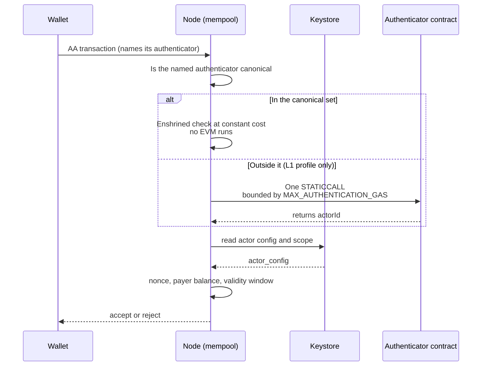
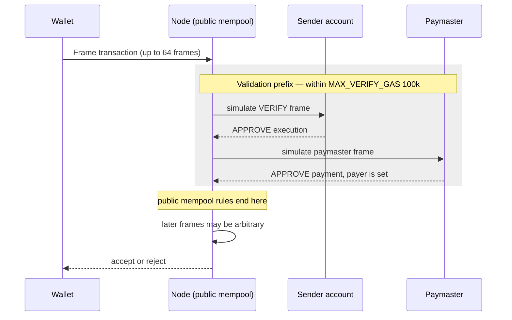

# EIP-8130 and EIP-8141 — Two Routes to Native Account Abstraction

## Abstract

Two draft proposals for putting account abstraction into the Ethereum protocol are alive at once. EIP-8130 Keystore Accounts came from Coinbase's Chris Hunter in October 2025; EIP-8141 Frame Transaction came from ten co-authors including Vitalik Buterin in January 2026. Both are Standards Track / Core drafts[^s01][^s02]. This report reads each specification from its markdown source and sets them against each other as competing answers to one problem.

The problem is the mempool. Leaving validation logic to wallet code means a node must run arbitrary EVM before it can accept a transaction, and EIP-8130's Motivation prices that: it "requires full state access, tracing infrastructure, and reputation systems to bound the cost of invalid submissions"[^s01]. EIP-8130 removes the simulation. Because a transaction names the contract that will authenticate it, a node can "reject unknown authenticators before executing any code"[^s03]. EIP-8141 keeps the simulation and fences it. Everything up to the frame that sets the payer forms a validation prefix, public mempool rules bind only there, and the gas a node may spend validating is capped at 100,000[^s06].

An asymmetry falls out of that. Of the burdens EIP-8130 names, the reputation one has already been discarded by EIP-8141, whose mempool policy is "inspired by ERC-7562, but removes staking and reputation entirely"[^s06]. Simulation and tracing survive: nodes still run pre-admission simulation and sandbox opcodes inside verification frames[^s11]. The dates forbid reading this as rebuttal. EIP-8130 was written three months before EIP-8141 and cannot have been aimed at it.

Standardisation has pulled the two apart. EIP-8141 took CFI status for Hegotá at the March 2026 ACD call[^s11] and moved to SFI on 27 August, with headliner promotion still open until the scoping deadline before Devcon 8[^s10]. Then in September the joint Base–Ethereum work on account abstraction ended. Base carries EIP-8130 forward, L1 carries EIP-8141[^s09]. Derek Chiang, himself a listed author of EIP-8141, put the split down to divergent requirements.

Neither proposal cites the other, and neither appears in the other's Ethereum Magicians thread[^s07][^s08]. Comparison is happening outside those venues, though: one developer-side analysis concludes that "the 8141 camp is right about the long run, but the 8130 camp is right about the near term"[^s13].

## Introduction

Account abstraction has taken a long road. ERC-4337 avoided touching the protocol by building a parallel layer of bundlers and an EntryPoint. EIP-7702 let an EOA borrow code, while leaving the EOA key as the thing that originates transactions. What remains is for the protocol itself to say that an account is an address with code, which is the sentence EIP-8141's Motivation ends on.

This report covers the two specifications and the standards process around them; ERC-4337 and EIP-7702 appear only as background. Section 3 sets out the obstacle both proposals run into, sections 4 and 5 take each specification apart, section 6 compares them, and section 7 covers the split now underway.

On method: everything structural is quoted from the `master` branch of the `ethereum/EIPs` repository. Both proposals are drafts, so the constants and interfaces here are a 15 September 2026 snapshot and are subject to change.

## Background — where protocol-level AA keeps snagging

If wallets are to bring their own signature-verification rules, something has to execute those rules. The difficulty is that the execution happens *before* the transaction is accepted. Fees are collected when a transaction lands in a block; validation is consumed for free ahead of that.

Attackers work the gap. A transaction that looks valid, triggers an expensive simulation, and then fails burns node resources at no cost to its sender[^s11]. That is why ERC-4337 arrived with staking and reputation attached: charging a repeat offender means identifying and remembering one.

The two proposals part company here. One pins down the identity of the code to be executed so that the simulation disappears; the other permits the simulation under a ceiling on its scope and cost.

## EIP-8130 — declared authenticators and an onchain keystore

### Actors and authenticators

An EIP-8130 account keeps its authentication configuration in a keystore contract, which maps the account to its configured authenticators and stores their authorizations. A party holding an authorization there is an **actor**, and each actor is bound to an **authenticator**: an onchain contract that checks a signature and returns the actor's identity, the `actorId`[^s03].

A new EIP-2718 transaction type names the authenticator that will authenticate it. That declaration carries the whole design. Because the authenticator is explicit, "a node can tell exactly what computation a transaction requires, and reject unknown authenticators before executing any code"[^s03].

There is one interface. Every authenticator implements `authenticate(hash, data)` with no type-based dispatch, and it returns the `actorId` rather than taking one as input — a direction the specification credits with meaning "the protocol never needs algorithm-specific logic"[^s05]. New signature algorithms arrive as new authenticator contracts and the protocol stays put.

Keeping public keys off-chain follows the same logic. Authenticators take the key or full credential from calldata and recover the `actorId`, which holds per-actor state to a single `actor_config` SLOAD whatever the key size. The motivation is post-quantum: storing such credentials would add tens of permanent slots per actor, and the specification puts the calldata route at 2,048 gas against 6,300 for a P256 key, 21,000 against 88,000 for a PQ key[^s05].

### The path validation takes

_Figure 1 — EIP-8130's mempool acceptance path. The node filters on authenticator identity first, and where it does execute, a single bounded `STATICCALL` is the whole of it[^s03]._

Block execution adds one thing worth noting. When an account with no code sends its first EIP-8130 transaction, the protocol auto-delegates it to `DEFAULT_ACCOUNT_ADDRESS`, and that delegation persists[^s03]. It is the on-ramp for existing EOA users.

### Two adoption profiles

The specification is written once and adopted under one of two profiles, and a chain must declare which it activates.

Under the **L1 profile** the intrinsic-gas schedule is normative: the values are protocol constants identical for every node, changeable only by hard fork. Authenticator acceptance, by contrast, is permissive — any authenticator returning within `MAX_AUTHENTICATION_GAS` is accepted, canonical or not, on the reasoning that a base layer can afford bounded single-call validation[^s03].

The **L2 profile** trades the opposite way. A chain may run its own cost schedule, but the transaction path accepts only the enshrined canonical set, keeping arbitrary `STATICCALL` off the hot path[^s03].

The specification explains why it split rather than choosing. On a base layer the gas schedule and the consensus-relevant checks *are* the specification, and two nodes disagreeing there could disagree on block validity — a chain-split risk[^s05]. The same worry drives the canonical set: without a required set, nodes would diverge on which signature algorithms they accept, leaving wallets facing "a fragmented network where each node accepts a different combination of algorithms"[^s05].

No EVM changes are required[^s01], existing accounts are untouched, and adoption is opt-in[^s05].

## EIP-8141 — the transaction taken apart

### Frames

A transaction stops being one thing. A transaction is a sequence of up to 64 **frames** (`MAX_FRAMES`), each a contract call carrying a mode, flags, target, gas limits, value and data[^s04].

Three modes exist: `DEFAULT` executes as `ENTRY_POINT`, `VERIFY` marks the frame as transaction validation, and `SENDER` executes as the sender[^s04]. The transaction type is `0x06`, intrinsic cost 12,000, per-frame cost 475[^s04].

Gas splits in two. Each frame carries separate execution and state limits that cannot borrow from one another, so wallets and estimators have to produce two-dimensional per-frame estimates[^s06].

### APPROVE

Payment approval runs through a new instruction, `APPROVE` (`0xaa`), which exits the current EVM call frame successfully while updating the transaction-scoped approval context[^s04]. Its scope operand is a bitmask: `APPROVE_PAYMENT` (0x1) covers the gas cost, `APPROVE_EXECUTION` (0x2) lets later frames call on the sender's behalf, and `0x3` does both[^s04].

Ordering is constrained. Payment approval reverts unless execution approval already stands, and reverts again if a payer is already set[^s04]. When approval lands, the sender's nonce increments and the maximum cost is collected from the payer.

### The validation prefix

The mempool section opens by conceding the danger: "a naive implementation could introduce denial-of-service vulnerabilities"[^s06]. Its answer is to draw a line.

The **validation prefix** is the shortest run of frames whose successful execution sets `payer`. Public mempool rules apply to that run only; once the payer is set, later frames are "outside public mempool validation and may be arbitrary"[^s06].

_Figure 2 — EIP-8141's public mempool path. The rules bind only until `payer` is set, and validation gas is capped at `MAX_VERIFY_GAS` of 100,000[^s06]._

The policy names both its lineage and what it dropped from it: "inspired by ERC-7562, but removes staking and reputation entirely. Any behavior that ERC-7562 would admit only for a staked or reputable third party is rejected here for the public mempool"[^s06]. The ceilings are numeric — `MAX_VERIFY_GAS` 100,000, `MAX_VERIFY_STATE_GAS` 500,000, and at most one pending transaction per non-canonical paymaster[^s06].

### What it is for

The first item in EIP-8141's motivation is cryptographic migration: a "native off-ramp from the elliptic curve based cryptographic system used to authenticate transactions today, to post-quantum (PQ) secure systems"[^s02]. Unlinking accounts from ECDSA keys brings native key rotation; taking batch calls into the protocol makes smart accounts simpler; alternative fee payment works without centralized third-party relayers[^s02].

The cost is stated too. Under frame transactions `ORIGIN` returns the frame's caller rather than the traditional transaction origin. The specification calls this consistent with EIP-7702, which already modified `ORIGIN`, and warns that security checks resting on `ORIGIN = CALLER` may behave differently[^s06].

## Setting the two against each other

### One problem, opposite answers

One design makes the node know in advance what it will execute, so the problem disappears. The other lets the node execute under a ceiling, so the problem is contained. Outside analysis renders the same contrast as a trade: EIP-8130 buys an "O(1) cryptographic check, without tracing arbitrary EVM code" and pays for it in flexibility[^s13].

That choice fixes where flexibility lives. In EIP-8130 a new signature algorithm arrives as an authenticator contract, but to be usable on the transaction path it must enter the canonical set, which changes only by hard fork on L1 or through the companion ERC process on L2[^s03]. Flexibility exists behind a gate. In EIP-8141 validation logic is arbitrary code inside a frame with no gate at all, provided it finishes inside 100,000 gas and takes one of the four prefix shapes the public mempool recognises[^s06].

### Where the burden goes

The burden is relocated in both designs rather than removed.

EIP-8130 moves it into governance. Which algorithms belong to the canonical set becomes a protocol decision, and the specification expects the set to stay small[^s05]. A wallet wanting a new signature scheme cannot simply deploy code; it waits on a standards process.

EIP-8141 moves it into mempool policy. Three new obligations land on node operators: pre-admission simulation replacing static checks, EIP-7562-style opcode sandboxing over `SSTORE` and `CALL` inside verification frames, and tracking gas reservations across transactions sharing a paymaster[^s11].

### How much of EIP-8130's critique lands

Three costs are named in that Motivation: full state access, tracing infrastructure, reputation systems[^s01].

Reputation misses, because EIP-8141 explicitly discards it[^s06]. Tracing and simulation connect: nodes still run the EVM and watch opcodes[^s11]. Where simulation survives so does the attack surface, and a transaction that looks valid, provokes an expensive simulation and then fails remains constructible under EIP-8141 — bounded at 100,000 gas rather than eliminated[^s11].

Chronology matters here. EIP-8130 dates from October 2025 and EIP-8141 from January 2026[^s01][^s02]. Whatever EIP-8130 was arguing against, it was not this. Reading the pair as a debate invents a conversation that never happened.

### How much protocol each touches

One leaves the EVM alone[^s01]. The other adds an instruction and changes `ORIGIN` semantics[^s04][^s06]. Lower deployment risk against greater expressiveness is a familiar trade, and which side of it is right depends on what a given chain is more afraid of. Adding a time axis changes the question. If EIP-8141 is right for the long run and EIP-8130 for the near term[^s13], the choice is less about which design wins than about which horizon a chain is building for.

## Standardisation and the split

### EIP-8141's route

At the ACD call of 26 March 2026, EIP-8141 received Considered for Inclusion status for the Hegotá fork. The reading at the time was that this "means active development continues, but it is not a committed Hegotá deliverable", with FOCIL the only confirmed headliner[^s11]. On 27 August the ACDE call moved it to Scheduled for Inclusion, leaving headliner promotion open until the Hegotá scoping deadline before Devcon 8[^s10]. Separately from fork scheduling, the Ethereum Foundation Protocol cluster placed a "must-ship" label on EIP-8141 in its tier list[^s12].

### September

Reporting on 14 September 2026 put the end of the joint Base–Ethereum effort in the preceding week. The two sides now advance separate standards: EIP-8130 for Base, EIP-8141 for Ethereum L1[^s09].

Priorities had diverged. L1 emphasised "censorship resistance, value capture, and privacy"; the Base and L2 camp prioritised "scalability and customization"[^s09]. The Block adds a further axis: the two sides agreed on core use cases such as gasless transactions and passkey wallets but split on **compliance requirements**, which sits alongside scale and customization in Base's priorities[^s12]. EIP-8130 is being tested on Base's vibenet devnet, targets the OP Stack, and is credited with up to a 63% reduction in gas costs for certain transfer types _(single source — method undisclosed)_[^s09].

Derek Chiang's comment is worth attention because he is a listed author of EIP-8141[^s02]. Granting that a unified standard would help cross-chain consistency, he saw an upside in the split: "Different chains have different needs, and forcing a single standard onto both L1 and L2 may have resulted in a compromise that satisfied nobody"[^s09]. On why it ended he wrote that "while we identified a number of technical solutions, they all required one side or the other to compromise at least a little"[^s12].

The break is not total. Both standards are reported to be working toward "a shared transaction type or minimum interoperability to support the same accounts cross-chain"[^s10].

### What the threads actually said

Heated debate is not what either proposal drew.

The sharpest response in the EIP-8141 thread came from Helkomine, who wrote on 30 January 2026 that "I do not see any clear benefit from this proposal other than the additional burden it creates on the network", and the next day asked whether simpler protocol-level options such as EIP-7904 or EIP-7851 would be more sustainable. matt answered that frame transactions let smart accounts originate transactions, the thing ERC-4337 never managed cleanly at the protocol layer[^s08].

Criticism of EIP-8130 clustered on integration. rmeissner asked why execution uses a self-call rather than a dedicated entrypoint address, and noted that Safe would want to distinguish the initial invocation from follow-up calls. karlb raised migration from Celo's CIP-64[^s07].

The other proposal goes unmentioned in both threads[^s07][^s08], which is why the clause-level comparison in section 6 is built here from the specifications. That is not to say no one is comparing them: developer analyses and reporting already do[^s13][^s12]. The comparison simply is not happening in either proposal's own standards venue.

## Limitations

- **Both are drafts.** The constants, interfaces and policies quoted here are a 15 September 2026 snapshot of `master`, not settled protocol. EIP-8141 holds SFI but is not a headliner, and EIP-8130 is not scheduled for any L1 fork.
- **ACD minutes were not consulted.** The CFI and SFI transitions rest on secondary reporting[^s10][^s11]. Those two sources describe March and August respectively, so the dates are attached in the text.
- **EIP-8130's canonical contract repository was not read.** The specification itself points to `src/Keystore.sol` in the `base` organisation as authoritative for contract internals[^s03]. Storage packing, typehashes and exact gas values therefore sit outside what this report verified; the account here goes only as far as the normative summary in the EIP.
- **The 63% gas figure is unverified.** It comes from a single report of a Base claim[^s09] with no published methodology or transfer types, and is marked as such in the text. Search aggregation also surfaced a different figure, "more than 2x per-transaction cost reduction", which none of the articles actually retrieved confirmed, so it is not cited.
- **Client implementation status was not investigated.** How far either proposal has been implemented in geth, reth or besu was not checked, and the vibenet devnet testing rests on the same single report[^s09].
- **No systematic critique of EIP-8141 was obtained.** An analysis asking why EIP-8141 has not become Hegotá's first choice returned 403. Criticism here therefore stops at the Magicians thread[^s08], which ran for a few days among a handful of participants.
- **The RIP-7560 lineage was not traced.** Several EIP-8141 authors come from the ERC-4337 effort, but the relationship between RIP-7560 and EIP-8141 was not confirmed from primary sources, so no lineage is asserted.
- **No evidence was found that EIP-8130's L1 profile has been reviewed.** The specification defines that profile seriously, but nothing confirms L1 core developers have considered it; the September reporting describes EIP-8130 as the L2-side path[^s09].
