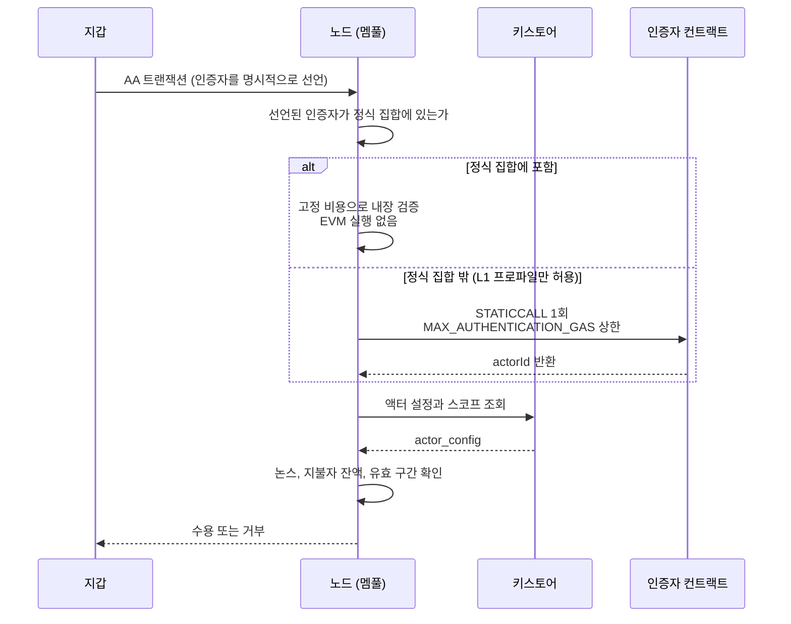
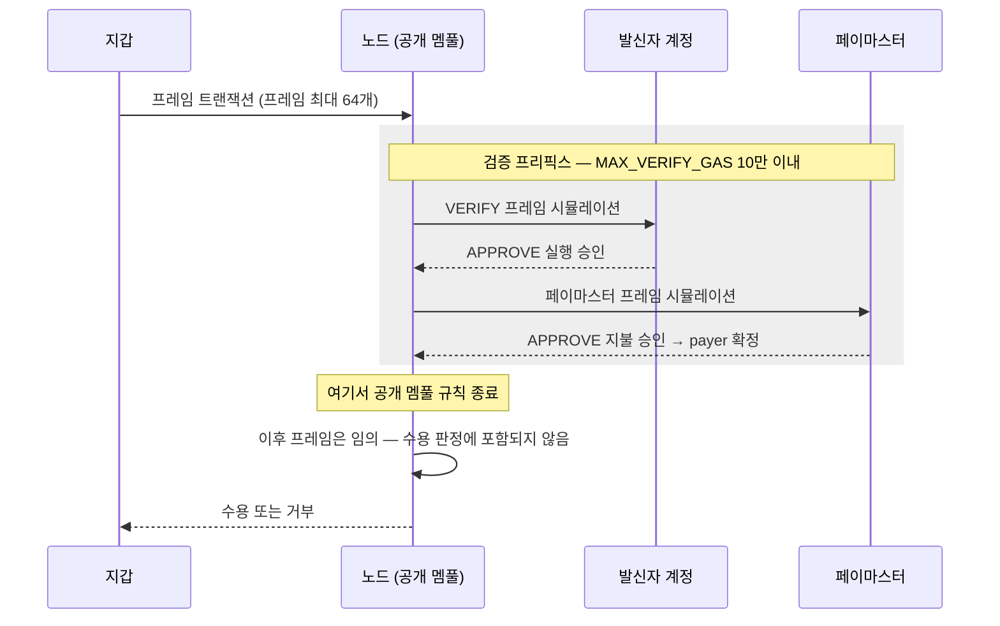

# EIP-8130과 EIP-8141 — 네이티브 계정 추상화로 가는 두 갈래

## 초록

이더리움에 계정 추상화를 프로토콜 층위에서 넣으려는 초안 두 건이 동시에 살아 있다. EIP-8130 Keystore Accounts는 Coinbase의 Chris Hunter가 2025년 10월에, EIP-8141 Frame Transaction은 Vitalik Buterin을 포함한 열 명의 공저자가 2026년 1월에 올렸고 둘 다 Standards Track / Core의 Draft다[^s01][^s02]. 본 리포트는 두 명세의 마크다운 원문을 조항 단위로 읽고, 같은 문제에 내놓은 서로 다른 답으로 대조한다.

그 문제는 멤풀이다. 검증 로직을 지갑 코드에 맡기면 노드는 트랜잭션을 받아들이기 전에 임의의 EVM을 돌려봐야 하고, 8130의 Motivation은 그 대가로 "전체 상태 접근, 트레이싱 인프라, 그리고 잘못된 제출의 비용을 묶어둘 평판 시스템"이 따라온다고 적는다[^s01]. 8130의 답은 시뮬레이션을 없애는 것이다. 트랜잭션이 자신을 인증할 컨트랙트를 명시적으로 선언하므로 노드는 "코드를 실행하기 전에 알 수 없는 인증자를 거부"할 수 있다[^s03]. 8141의 답은 시뮬레이션에 울타리를 치는 것이다. 지불자가 정해지는 지점까지를 검증 프리픽스로 잘라 공개 멤풀 규칙을 그 구간에만 걸고, 검증에 쓸 가스를 10만으로 묶는다[^s06].

여기서 짚을 만한 비대칭이 하나 나온다. 8130이 지목한 부담 중 평판 시스템 쪽은 8141이 이미 버렸다. 8141의 멤풀 정책은 "ERC-7562에서 영감을 받았으나 스테이킹과 평판을 전부 제거"했다고 스스로 밝힌다[^s06]. 반면 시뮬레이션과 트레이싱 쪽은 남는다. 노드는 여전히 사전 시뮬레이션을 돌리고 검증 프레임 안에서 옵코드를 샌드박싱해야 한다[^s11]. 다만 8130이 8141보다 석 달 앞서 작성됐으므로 이 대비를 논박으로 읽어서는 안 된다. 서로를 겨냥한 적이 없는 두 설계다.

둘의 관계는 표준화 과정에서 갈렸다. EIP-8141은 2026년 3월 ACD에서 Hegotá에 대해 CFI를 받았고[^s11] 8월 27일 SFI로 올라갔으며, 헤드라이너 승격 여부는 Devcon 8 이전 스코핑 마감까지 미정이다[^s10]. 그리고 9월, Base와 이더리움의 계정 추상화 공동 작업이 깨졌다. Base는 8130을, L1은 8141을 각자 끌고 간다[^s09]. 8141의 공저자이기도 한 Derek Chiang은 이를 요구의 차이로 설명했다.

두 제안은 서로를 인용하지 않고, 각자의 ethereum-magicians 스레드에서도 상대는 등장하지 않는다[^s07][^s08]. 다만 명세와 스레드 바깥에서는 비교가 이미 진행 중이다. 개발자 진영의 한 분석은 "8141 진영은 장기에 대해 옳고, 8130 진영은 단기에 대해 옳다"는 평가를 내놓았다[^s13].

## 서론

계정 추상화는 오래 걸린 과제다. ERC-4337은 프로토콜을 건드리지 않으려고 번들러와 EntryPoint라는 별도 층을 세웠고, EIP-7702는 EOA가 코드를 빌려 쓸 길을 열었지만 트랜잭션을 만드는 주체는 여전히 EOA 키다. 남은 것은 프로토콜이 직접 "계정이란 코드를 가진 주소"라고 말하는 일이고, 8141의 Motivation은 정확히 그 문장으로 끝난다.

본 리포트의 범위는 두 EIP의 명세 본문과 그 표준화 과정이다. ERC-4337과 EIP-7702는 배경으로만 다룬다. 3절이 두 제안이 공통으로 부딪히는 지점을 정리하고, 4절과 5절이 각 명세를 해부하며, 6절이 대조하고, 7절이 지금 벌어지고 있는 분기를 다룬다.

방법에 관해 한 가지. 구조적 서술은 전부 `ethereum/EIPs` 저장소의 `master` 브랜치에서 원문을 받아 인용했다. 두 제안 모두 Draft이므로 여기 적힌 상수와 인터페이스는 2026년 9월 15일 스냅샷이고, 바뀔 수 있다.

## 배경 — 프로토콜 AA가 반복해서 걸리는 지점

지갑이 자기만의 서명 검증 규칙을 갖게 하려면 누군가는 그 규칙을 실행해 봐야 한다. 문제는 그 실행이 트랜잭션을 수락하기 *전에* 일어난다는 데 있다. 수수료는 트랜잭션이 블록에 들어가야 걷히는데, 검증은 그 전에 공짜로 소비된다.

공격자는 이 틈을 노린다. 겉보기에 유효하지만 값비싼 시뮬레이션을 유발한 뒤 실패하는 트랜잭션을 만들면, 수수료 한 푼 내지 않고 노드 자원을 태울 수 있다[^s11]. ERC-4337이 스테이킹과 평판 시스템을 들고 온 이유가 이것이다. 반복해서 쓰레기를 던지는 주체에게 비용을 지우려면 그 주체를 식별하고 기억해야 한다.

두 제안은 이 지점에서 갈라진다. 한쪽은 실행할 코드의 정체를 미리 못 박아 시뮬레이션 자체를 없애려 하고, 다른 쪽은 시뮬레이션을 허용하되 범위와 비용에 상한을 건다.

## EIP-8130 — 선언된 인증자와 온체인 키스토어

### 액터와 인증자

8130의 계정은 키스토어라는 컨트랙트에 자신의 인증 설정을 맡긴다. 키스토어는 계정을 그 계정이 설정한 인증자들에 매핑하고 권한을 저장한다. 키스토어에 권한이 등록된 주체가 **액터**이고, 각 액터는 서명을 검사해 액터의 신원(`actorId`)을 돌려주는 온체인 컨트랙트인 **인증자**에 묶인다[^s03].

새 EIP-2718 트랜잭션 타입은 자신을 인증할 인증자를 지목한다. 이 선언이 설계 전체를 지탱한다. 인증자가 명시되어 있으므로 "노드는 트랜잭션이 정확히 어떤 연산을 요구하는지 알 수 있고, 어떤 코드도 실행하기 전에 알 수 없는 인증자를 거부"한다[^s03].

인터페이스는 하나뿐이다. 모든 인증자가 `authenticate(hash, data)`를 공유하고 타입별 분기가 없다. 그리고 인증자는 `actorId`를 인자로 받는 대신 반환하는데, 8130은 이 방향 때문에 "프로토콜이 알고리즘별 로직을 가질 필요가 전혀 없다"고 설명한다[^s05]. 새 서명 알고리즘은 새 인증자 컨트랙트로 들어오고 프로토콜은 그대로다.

공개키를 온체인에 두지 않는 선택도 같은 맥락이다. 인증자는 공개키나 자격증명 전체를 calldata로 받아 `actorId`를 복원한다. 이유는 포스트 양자 시대의 상태 크기다. 키를 저장하면 액터마다 수십 슬롯이 영구히 쌓이지만, calldata 경로는 액터당 `actor_config` SLOAD 하나로 끝난다. 명세는 P256 키에서 2,048 대 6,300 가스, PQ 키에서 21,000 대 88,000 가스라는 수치를 든다[^s05].

### 검증이 지나가는 길

_Figure 1 — EIP-8130의 멤풀 수용 경로. 노드는 인증자의 신원으로 먼저 거르고, 실행하더라도 단일 `STATICCALL` 한 번에 상한이 걸린다[^s03]._

블록 실행 단계에서 한 가지가 더 붙는다. 코드가 없는 EOA가 8130 트랜잭션을 보내면 프로토콜이 그 계정을 `DEFAULT_ACCOUNT_ADDRESS`로 자동 위임시키고, 이 위임은 지속된다[^s03]. 기존 EOA 사용자가 별도 절차 없이 진입하는 통로다.

### 두 개의 채택 프로파일

8130은 자신을 한 번 명세하되 두 가지 프로파일 중 하나로 채택되도록 설계됐다. 체인은 어느 쪽을 켤지 선언해야 한다.

**L1 프로파일**에서는 내재 가스 스케줄이 규범이다. 값들은 모든 노드에 동일한 프로토콜 상수이고 하드포크로만 바뀐다. 인증자 수용은 오히려 관대해서, 정식 집합에 없더라도 `MAX_AUTHENTICATION_GAS` 안에 반환하는 인증자라면 받아들인다. 경계 지어진 단일 호출 검증이라면 베이스 레이어가 감당할 수 있다는 판단이다[^s03].

**L2 프로파일**은 반대로 간다. 체인이 자체 비용 모델을 따라 스케줄을 바꿀 수 있는 대신, 트랜잭션 경로는 내장된 정식 집합만 받는다. 핫 패스에 임의의 `STATICCALL`을 두지 않겠다는 것이다[^s03].

왜 굳이 갈랐는지는 명세가 직접 답한다. 베이스 레이어에서는 가스 스케줄과 합의 관련 검사가 곧 명세이며, 두 노드가 여기서 어긋나면 블록 유효성에서 어긋나 체인 분할 위험이 된다[^s05]. 이 부분은 8130이 L1을 진지하게 겨냥했음을 보여주는 대목이기도 하다.

정식 집합이 필요한 이유도 같은 종류의 걱정이다. 요구되는 집합이 없으면 노드마다 받아들이는 서명 알고리즘이 갈리고, 지갑은 "각 노드가 서로 다른 조합을 수락하는 파편화된 네트워크"를 마주해 비-k1 서명의 전달을 보장할 수 없게 된다[^s05].

EVM 변경은 없다[^s01]. 기존 EOA와 컨트랙트는 그대로 동작하고 채택은 opt-in이다[^s05].

## EIP-8141 — 프레임으로 분해된 트랜잭션

### 프레임

8141은 트랜잭션을 통째로 다루는 대신 조각으로 나눈다. 트랜잭션은 최대 64개(`MAX_FRAMES`)의 **프레임** 시퀀스이고, 각 프레임은 모드·플래그·타깃·가스 한도·값·데이터를 갖는 컨트랙트 호출이다[^s04].

모드는 셋이다. `DEFAULT`는 `ENTRY_POINT`로서 실행하고, `VERIFY`는 그 프레임이 트랜잭션 검증임을 표시하며, `SENDER`는 발신자로서 실행한다[^s04]. 트랜잭션 타입은 `0x06`, 내재 비용은 12,000, 프레임당 비용은 475다[^s04].

가스는 두 차원으로 쪼개진다. 프레임마다 실행 가스와 상태 가스 한도를 따로 갖고 서로 빌려올 수 없다. 지갑과 가스 추정기는 프레임별 2차원 추정을 내놓아야 한다[^s06].

### APPROVE

지불 승인은 새 명령어 `APPROVE`(`0xaa`)로 이뤄진다. 이 명령어는 현재 EVM 호출 프레임을 성공적으로 빠져나오면서 트랜잭션 범위의 승인 컨텍스트를 갱신한다[^s04]. 스코프는 비트마스크다. `APPROVE_PAYMENT`(0x1)는 가스 비용 지불을, `APPROVE_EXECUTION`(0x2)은 이후 프레임이 발신자를 대신해 호출하는 것을 승인하며, `0x3`은 둘 다다[^s04].

순서에 제약이 있다. 지불 승인은 실행 승인이 이미 서 있을 때만 유효하고, 지불자가 이미 정해졌다면 되돌린다[^s04]. 승인이 떨어지는 순간 발신자의 논스가 오르고 최대 비용이 지불자에게서 걷힌다.

### 검증 프리픽스

8141의 멤풀 정책은 문제를 정면으로 인정하며 시작한다. "순진하게 구현하면 서비스 거부 취약점을 들일 수 있다"[^s06]. 해법은 경계선을 긋는 것이다.

**검증 프리픽스**는 `payer`를 설정하는 데 성공하는 가장 짧은 프레임 접두사다. 공개 멤풀 규칙은 이 구간에만 적용된다. 지불자가 정해진 뒤의 프레임은 "공개 멤풀 검증 바깥이며 임의일 수 있다"[^s06].

_Figure 2 — EIP-8141의 공개 멤풀 경로. 규칙은 `payer`가 정해지는 지점까지만 적용되고, 검증에 쓰는 가스는 `MAX_VERIFY_GAS` 10만으로 묶인다[^s06]._

정책의 계보와 그 계보에서 덜어낸 것이 함께 적혀 있다. "이 정책은 ERC-7562에서 영감을 받았으나 스테이킹과 평판을 전부 제거한다. ERC-7562가 스테이킹했거나 평판 있는 제3자에게만 허용했을 동작은 여기서는 공개 멤풀에 대해 거부된다"[^s06]. 상한도 숫자로 박혀 있다. `MAX_VERIFY_GAS` 10만, `MAX_VERIFY_STATE_GAS` 50만, 비정식 페이마스터를 쓰는 대기 트랜잭션은 하나까지[^s06].

### 무엇을 위해

8141의 동기 목록 첫 줄은 암호 체계 이전이다. 오늘의 타원곡선 기반 인증에서 포스트 양자 보안 체계로 가는 "네이티브 오프램프"를 제공한다는 것이다[^s02]. 계정이 ECDSA 키에서 분리되므로 네이티브 키 로테이션이 따라오고, 스마트 계정은 배치 호출을 프로토콜에서 받으므로 단순해지며, 중앙화된 제3자 릴레이어 없이 대체 수수료 지불이 가능해진다[^s02].

대가도 명시돼 있다. 프레임 트랜잭션에서 `ORIGIN`은 전통적인 트랜잭션 오리진이 아니라 프레임의 호출자를 반환한다. 명세는 이를 이미 `ORIGIN` 의미를 바꾼 EIP-7702의 선례와 일치한다고 적으면서, `ORIGIN = CALLER`에 기대는 보안 검사는 다르게 동작할 수 있다고 경고한다[^s06].

## 두 제안의 대조

### 같은 문제, 반대 방향의 답

한쪽은 노드가 무엇을 실행할지 *미리 알게* 해서 문제를 없앤다. 8141은 노드가 실행하되 *얼마나 실행할지에 상한*을 걸어 문제를 가둔다. 외부 분석은 이 대비를 8130이 "임의 EVM 코드를 트레이싱하지 않는 O(1) 암호 검사"를 얻는 대신 유연성을 내주는 거래로 요약한다[^s13].

이 차이가 유연성이 어디에 놓이는지를 정한다. 8130에서 새 서명 알고리즘은 인증자 컨트랙트로 들어오지만, 트랜잭션 경로에서 쓰이려면 정식 집합에 들어가야 하고 그 집합은 L1에서 하드포크로만, L2에서 동반 ERC 절차로만 바뀐다[^s03]. 유연성은 있으나 관문을 통과해야 한다. 8141에서 검증 로직은 프레임 안의 임의 코드이고 관문은 없다. 대신 그 코드는 10만 가스 안에서 끝나야 하고 공개 멤풀이 허용하는 네 가지 프리픽스 형태 중 하나여야 한다[^s06].

### 부담이 어디로 가는가

두 설계 모두 부담을 없애지 않고 옮긴다.

8130이 옮기는 곳은 거버넌스다. 어떤 알고리즘이 정식 집합에 들어가는지가 이제 프로토콜 결정이 되고, 명세 자신이 그 집합은 작게 유지될 것이라 예상한다[^s05]. 새 서명 방식을 쓰려는 지갑은 코드를 배포하는 것으로 끝나지 않고 표준화 절차를 기다려야 한다.

8141은 부담을 멤풀 정책의 복잡도로 옮긴다. 노드 운영자에게는 세 가지 일이 새로 생긴다. 정적 검사를 대체하는 사전 시뮬레이션, 검증 프레임 안에서 `SSTORE`와 `CALL`에 거는 EIP-7562식 옵코드 샌드박싱, 그리고 하나의 페이마스터를 공유하는 여러 트랜잭션에 걸친 가스 예약 추적이다[^s11].

### 8130의 비판은 8141에 얼마나 닿는가

8130의 Motivation은 세 가지를 문제로 든다. 전체 상태 접근, 트레이싱 인프라, 평판 시스템[^s01].

평판 쪽은 빗나간다. 8141이 그것을 명시적으로 버렸기 때문이다[^s06]. 트레이싱과 시뮬레이션 쪽은 닿는다. 8141의 노드는 여전히 EVM을 돌리고 옵코드를 감시해야 한다[^s11]. 그리고 시뮬레이션이 남는 한 공격 표면도 남는다. 유효해 보이지만 비싼 시뮬레이션을 유발한 뒤 실패하는 트랜잭션은 8141에서도 만들 수 있고, 다만 그 비용이 10만 가스로 묶일 뿐이다[^s11].

시점을 기억해 둘 필요가 있다. 8130은 2025년 10월, 8141은 2026년 1월이다[^s01][^s02]. 8130이 겨냥한 것은 당시 존재하던 설계들이지 8141일 수 없다. 두 문서를 논쟁으로 읽으면 없는 대화를 지어내게 된다.

### 프로토콜을 얼마나 건드리는가

한쪽은 EVM을 그대로 둔다[^s01]. 8141은 새 명령어 `APPROVE`를 추가하고 `ORIGIN` 의미를 바꾼다[^s04][^s06]. 전자가 배포 위험이 낮고 후자가 표현력이 높다는 익숙한 교환이며, 어느 쪽이 옳은지는 그 체인이 무엇을 더 두려워하는지에 달린다. 시간 축을 넣으면 질문이 조금 달라진다. Openfort의 정리처럼 8141이 장기에 옳고 8130이 단기에 옳다면, 둘 중 하나를 고르는 문제가 아니라 언제를 위해 짓는지의 문제가 된다[^s13].

## 표준화 현황과 분기

### 8141의 경로

2026년 3월 26일 ACD 콜에서 EIP-8141은 Hegotá 포크에 대해 CFI(Considered for Inclusion) 상태를 받았다. 당시 평가는 "활발한 개발이 계속된다는 뜻이지 확정된 Hegotá 산출물은 아니"라는 것이었고, 확정 헤드라이너는 FOCIL 하나였다[^s11]. 8월 27일 ACDE에서 SFI(Scheduled for Inclusion)로 올라갔으나 헤드라이너 승격 여부는 Devcon 8 이전 스코핑 마감까지 열려 있다[^s10]. 포크 일정과 별개로 이더리움 재단 프로토콜 클러스터는 자체 티어 목록에서 8141에 "must-ship" 라벨을 붙였다[^s12].

### 갈라선 9월

2026년 9월 14일 보도에 따르면 Base와 이더리움 개발자들의 통합 작업은 그 전 주에 끝났다. 양측은 이제 각자의 표준을 따로 끌고 간다. Base는 EIP-8130, 이더리움 L1은 EIP-8141이다[^s09].

우선순위가 갈렸다는 것이 보도의 설명이다. L1 쪽은 검열 저항성, 가치 포착, 프라이버시를 앞세웠고 L2 쪽은 확장성과 커스터마이징을 앞세웠다[^s09]. The Block의 정리에는 한 항목이 더 붙는다. 양측은 가스리스 트랜잭션이나 패스키 지갑 같은 핵심 용례에는 동의했으나 **컴플라이언스 요구**에서 갈렸고, Base 쪽 우선순위에는 확장성·커스터마이징과 함께 컴플라이언스가 들어간다[^s12]. 8130은 Base의 vibenet 데브넷에서 시험되며 OP Stack을 겨냥하고, 일부 전송 유형에서 최대 63% 가스 절감을 주장한다 _(단일 출처 — 근거 미공개)_[^s09].

Derek Chiang의 논평이 눈에 띄는 이유는 그가 EIP-8141의 공저자로 이름을 올린 사람이기 때문이다[^s02]. 그는 통일된 표준이 체인 간 일관성에 낫다는 점을 인정하면서도 분기에 이점이 있을 수 있다고 봤다. "체인마다 요구가 다르고, 하나의 표준을 L1과 L2 양쪽에 강제하면 아무도 만족시키지 못하는 타협으로 끝났을 수 있다"[^s09]. 결렬의 성격에 대해서는 이렇게 적었다. "우리는 여러 기술적 해법을 찾아냈지만, 전부 어느 한쪽이 적어도 조금은 양보해야 하는 것들이었다"[^s12].

완전한 결별은 아니다. 두 표준이 "같은 계정을 체인 간에 지원하기 위한 공통 트랜잭션 타입 또는 최소한의 상호운용성"을 향해 작업 중이라는 서술이 함께 붙어 있다[^s10].

### 스레드에서 실제로 나온 말

두 제안 모두 과열된 논쟁의 대상은 아니었다.

8141 스레드에서 가장 날 선 반응은 Helkomine의 것이다. 2026년 1월 30일, "이 제안이 네트워크에 지우는 추가 부담 말고 분명한 이점이 보이지 않는다"고 적었고, 다음 날에는 EIP-7904나 EIP-7851 같은 더 단순한 프로토콜 수준 해법이 지속 가능하지 않겠냐고 되물었다. matt은 프레임 트랜잭션이 스마트 계정으로 하여금 트랜잭션을 개시하게 해 준다는 점, ERC-4337이 프로토콜 층위에서 깔끔하게 해내지 못한 바로 그 일이라는 점으로 답했다[^s08].

8130 스레드의 비판은 통합 지점에 몰렸다. rmeissner는 실행에 전용 엔트리포인트 주소 대신 self-call을 택한 이유를 물었고, Safe 입장에서는 최초 호출과 후속 호출을 구분할 수 있으면 좋겠다고 덧붙였다. karlb은 Celo의 CIP-64에서 넘어오는 마이그레이션 문제를 제기했다[^s07].

어느 쪽 스레드에도 상대 제안은 나오지 않는다[^s07][^s08]. 6절의 조항 대조는 그래서 이 리포트가 명세를 나란히 놓고 구성한 것이다. 비교 자체가 없다는 뜻은 아니다. 개발자 진영과 보도는 이미 둘을 견주고 있고[^s13][^s12], 다만 그 비교가 두 제안의 표준화 창구에서 일어나지 않았을 뿐이다.

## 한계 (Limitations)

- **두 제안 모두 Draft다.** 여기 인용한 상수·인터페이스·정책은 2026년 9월 15일 `master` 스냅샷이며 확정된 프로토콜이 아니다. 8141은 SFI지만 헤드라이너가 아니고, 8130은 어떤 L1 포크에도 예정돼 있지 않다.
- **ACD 회의록 원문을 대조하지 못했다.** CFI와 SFI 상태 변화는 2차 보도[^s10][^s11]에 의존한다. 두 출처는 각각 3월과 8월 시점을 말한다. 서로 어긋나는 진술이 아니므로 본문에 시점을 붙여 적었다.
- **8130의 정식 컨트랙트 저장소를 읽지 않았다.** 8130 명세는 계약 내부에 대해 `base` 조직 저장소의 `src/Keystore.sol`이 권위라고 스스로 지목한다[^s03]. 저장소를 읽지 않았으므로 키스토어의 저장 배치, 타입해시, 정확한 가스 값은 검증 범위 밖이고, 여기 서술은 명세가 규범적 요약으로 제시한 수준까지다.
- **63% 가스 절감 주장은 검증하지 못했다.** 보도 한 건[^s09]에 실린 Base 측 주장이고 측정 방법과 대상 전송 유형이 공개되지 않았다. 본문에 단일 출처로 표기했다. 검색 집계에서는 "트랜잭션당 2배 이상 비용 절감"이라는 다른 수치도 보였으나 직접 받아 본 기사들에서 확인되지 않아 인용하지 않았다.
- **클라이언트 구현 현황을 조사하지 않았다.** geth·reth·besu 등에서 두 제안이 어디까지 구현됐는지 확인하지 않았다. "Base vibenet 데브넷에서 시험 중"도 같은 보도 한 건에 의존한다[^s09].
- **8141에 대한 체계적 비판 분석을 확보하지 못했다.** "왜 8141이 Hegotá의 1순위가 되지 못했는가"를 다룬 분석 기사가 403으로 막혔다. 비판은 magicians 스레드[^s08] 수준에 머물며, 그 스레드는 며칠 동안 소수가 참여한 것이다.
- **RIP-7560 계보를 추적하지 않았다.** 8141 공저자 다수가 ERC-4337 진영이지만 RIP-7560과 8141의 관계를 1차 사료로 확인하지 않았으므로 계보를 주장하지 않았다.
- **8130의 L1 프로파일이 검토된 흔적을 찾지 못했다.** 명세는 L1 프로파일을 진지하게 규정하지만, L1 코어 개발자들이 그것을 검토했다는 증거는 확인하지 못했다. 9월 분기 보도[^s09]는 8130을 L2 쪽 경로로 서술한다.
