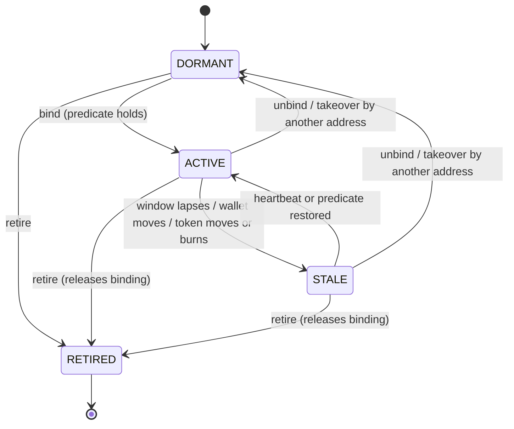
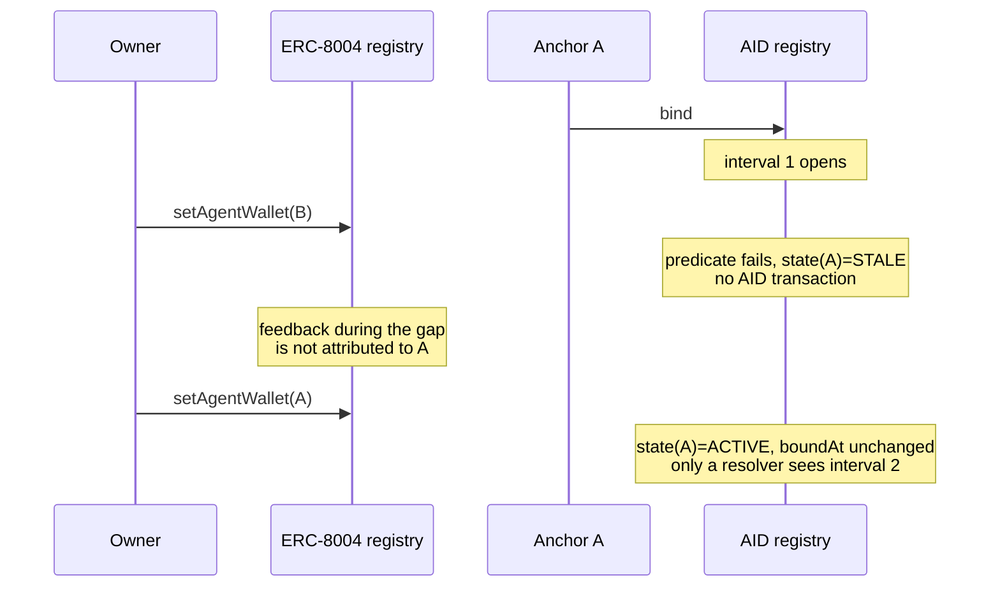
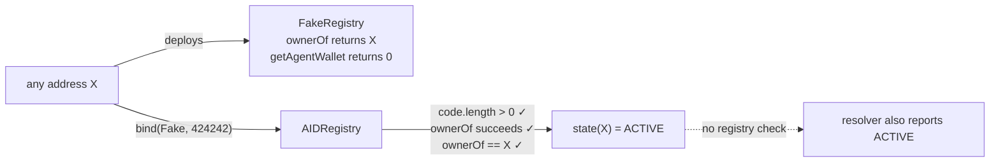
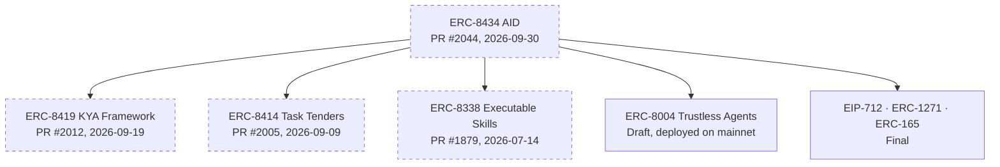

## Abstract

ERC-8434, Agent Identity (AID), is an ERC draft submitted on 2026-09-30. It anchors an agent's identity to an address rather than to an ERC-8004 token, starts from the premise that "every address is a dormant AID", and defines a thin on-chain layer of binding, liveness and retirement together with a deterministic resolution model over a document of provenance-tagged facets[^s01]. As of 2026-10-02 the proposal is an unmerged pull request that has taken eleven commits in two days[^s02].

Reading the text was the starting point, not the method. The proposal ships its own artefacts, and we ran them. All sixteen test vectors were recomputed with independent code and all sixteen match. The reference resolver was run against its seven published fixtures, and the reference registry contract was probed with seven Foundry tests on a local chain.

Three things came out of that. The most careful parts of the design, the commitment-time axis (`committedAt`), authority intervals and binding takeover, were not in the first draft; three outside reviewers raised them on Ethereum Magicians and they became normative within a day[^s03]. Neither the specification nor the reference contract checks that the bound "registry" is an ERC-8004 deployment at all: deploy a two-function contract, bind to it, and `state()` returns `ACTIVE`[^s01][^s06]. And the reference resolver leaves two of the specification's own MUSTs unimplemented, the downgrade of unpinned `OBSERVED` facets to `SELF` and the assertion-registry check, so the sample document's unpinned `OBSERVED` facets come back undowngraded[^s05][^s04].

The three standards AID names as building blocks, ERC-8338, 8414 and 8419, are open pull requests by the same author, and the ERC-8004 foundation is itself a Draft[^s09][^s07]. What follows is less an explainer for a settled standard than a cross-section of a design conversation that opened this week.

## 1. What AID proposes

ERC-8004 gives an agent a token key `(registry, agentId)`, a registration file and a reputation channel. AID's motivation is the questions that come after: is the agent still alive, how does the registration relate to the address the agent actually transacts from, and how do heterogeneous trust signals (feedback, credit, audits, on-chain financial behaviour) assemble into one verifiable, time-bounded picture[^s01].

Its answer starts by moving the anchor to the address. In the specification's words, "the address is already the join key": ERC-8004 registries and token-bound skill contracts alike emit the acting address in their events, so an address anchor makes behavioural history derivable without any extra registration[^s01]. The canonical identifier is CAIP-10, `eip155:{chainId}:{address}`. The DID form `did:aid:…` is deferred to a companion method specification, and the same address on another chain is a different AID[^s01].

Responsibility is split into four layers.

| Layer | Standard | Writer | Content |
|---|---|---|---|
| Anchor and state | ERC-8434 `IAIDRegistry` | the anchor | binding, heartbeat, liveness window, document URI, self facets, retirement |
| Registration and raw feedback | ERC-8004 | agent owner, clients | registration file, agent wallet, per-interaction feedback |
| Assertions | an assertion registry | issuers, provers | credit scores, trust levels, audits, ZK predicates |
| Skill and task records | token-bound skill and task contracts (informative) | derived from events | roles the anchor played |

_Source: specification §Overview[^s01]._

The registry has no owner and no upgrade path. Its only parameters are a default and a maximum liveness window fixed at deployment; which issuers to trust is the reader's decision at resolution time[^s01][^s06].

## 2. States and binding

### 2.1 Four states

Every AID is in exactly one state. `DORMANT` is the default with no binding; `ACTIVE` means a binding exists and every liveness condition holds; `STALE` means a binding exists but some condition fails, recoverably; `RETIRED` is the irreversible result of calling `retire`[^s01].

On chain, `state()` is evaluated in a fixed order: `RETIRED` if retired, `DORMANT` if unbound, and otherwise `ACTIVE` only when three things hold. `ownerOf(agentId)` on the bound registry must not revert; either `ownerOf == anchor` or `getAgentWallet == anchor` (the **binding predicate**); and `lastSeen + livenessWindow >= block.timestamp`[^s01]. An off-chain resolver adds exactly one refinement: it must report `STALE` rather than `ACTIVE` when the ERC-8004 registration file says `"active": false`[^s01].

_Figure 1 — AID state transitions. The move to `STALE` can happen through ERC-8004 changes alone, with no AID transaction. An anchor displaced by takeover ends `DORMANT`, not retired[^s01][^s03][^s06]._

Liveness costs almost nothing. Every anchor-authorised write refreshes `lastSeen`, and `heartbeat()` alone suffices; the specification itself says this proves control of a key, not that useful work is being done[^s01]. In the local probe, the anchor dropped to `STALE` once the window passed with no transaction at all, and one heartbeat brought it back to `ACTIVE`.

### 2.2 One-to-one binding and takeover

An AID binds to exactly one `(identityRegistry, agentId)` and vice versa, with the registry enforcing both directions. Binding is done by the anchor directly or with an EIP-712 `Bind` signature, verified through ERC-1271 for contract anchors[^s01]. The specification recommends anchoring on the `agentWallet` the agent transacts from rather than on the owner, and advises owners of several agents to give each its own wallet or an ERC-6551 token-bound account[^s01][^s11].

Takeover was added to contain a side effect of that one-to-one rule. If an EOA anchor loses its key before it can `unbind`, the old binding keeps holding the agent even after the owner moves the wallet in ERC-8004; a Magicians participant asked precisely this[^s03]. The current text has the registry re-check the predicate for the incumbent anchor: if it still holds, revert with `AgentAlreadyBound`; if not, release the stale binding and bind the caller in the same transaction[^s01]. The reference `_bind` does exactly that[^s06]. In the probe, moving the wallet from A to B left A `STALE`, and the moment B bound, A fell to `DORMANT`.

### 2.3 Authority intervals

The subtlest rule lives here. The binding predicate can stop holding without any AID transaction, when the owner transfers the token or moves the wallet, and can later hold again. The specification calls each maximal period during which it holds an **authority interval**, and each return opens a **new** one: "re-establishing the relation never authorizes the gap"[^s01]. Feedback and validation that accumulated in ERC-8004 during the gap are not evidence about this AID.

_Figure 2 — the A → gap → A round trip. On chain, `state()` reports `ACTIVE` again and `boundAt` does not change; only a resolver reconstructing intervals from events knows there was a gap[^s01][^s05]._

Intervals are not stored on chain, on the reasoning that ERC-8004 already emits what is needed[^s01]. The trade is visible in the probe: after the wallet went to B and back to A, `state(A)` returned `ACTIVE` with the original `boundAt`. A contract gating on `state()` gets an accurate answer to "is it bound now" and no answer at all to "was there a gap". When the specification says contracts can gate on `state()`, that should be read as a statement about the present only.

The reconstruction also rests on an unstated premise. Section 12 argues intervals are recoverable from ERC-8004 alone because ownership changes are ERC-721 `Transfer` events, "every wallet change is a `MetadataSet` event under the reserved key `agentWallet`", and a transfer clears the wallet, "so the predicate can never stop holding without an event marking the boundary"[^s01]. The ERC-8004 text does reserve `agentWallet` from `setMetadata`, but it specifies `MetadataSet` emission only for ordinary metadata and for `register`; for `setAgentWallet`, `unsetAgentWallet` and the automatic clear on transfer it requires no event[^s07]. The ERC-8004 reference contracts do emit `MetadataSet` on all three paths[^s08]. So the sentence in AID relies on the reference implementation's behaviour, not on ERC-8004's normative text, and a conforming 8004 registry that omits those events would leave wallet boundaries out of the log _(the behaviour of non-reference implementations was not surveyed)_.

## 3. Documents, facets and provenance

### 3.1 The AID Document and its facets

The AID Document is off-chain JSON at `documentURI(anchor)`, and its on-chain digest must be `keccak256` of the document serialised with RFC 8785 JCS. A resolver discards a document whose digest mismatches or whose `aid` names a different anchor[^s01][^s12]. The document is a list of **facets**, each wrapped in an envelope with a provenance class, a CAIP-10 issuer, a validity window, a digest or commitment, an access mode and a resolver pointer[^s01].

There are seven core facet types: `aid:core/identity/v1` for the ERC-8004 registration file; `aid:core/kya/v1` for assertion-registry assertions; `aid:finance/observed/v1` for on-chain financial behaviour; the open `aid:behavior/*` namespace for AI-behaviour profiles; `aid:skills/erc8338/v1` and `aid:tasks/erc8414/v1` for skill and task history; and `aid:review/erc8004/v1` summarising the ERC-8004 reputation registry[^s01].

### 3.2 Provenance classes

The design begins from the observation that "tamper-proof" is used in four different senses, and makes every facet declare which one applies[^s01].

| Class | Produced by | Guarantee | Reader obligation |
|---|---|---|---|
| `SELF` | the anchor | integrity only; truth not asserted | must not present as verified |
| `OBSERVED` | anyone, under an algorithm pinned by scheme hash | reproducible | recompute or spot-check |
| `ATTESTED` | a third-party issuer | issuer accountability | filter by trusted issuers |
| `PROVED` | a prover | cryptographic, against a commitment | verify the proof or rely on the on-chain verifier |

One rule holds the table up: "a facet whose `OBSERVED` algorithm is not pinned by a scheme hash MUST be treated as `SELF`"[^s01]. Without the pin there is nothing to reproduce. Section 5 shows the reference resolver does not implement this.

Credit gets the strictest treatment. Every facet must carry a non-zero `validUntil`, and a credit-kind assertion without finite expiry must be ignored, since "a credit score without an expiry is a claim about the past presented as the present"[^s01]. Access modes are `PUBLIC`, `GATED` (plaintext to authorised parties) and `ZK` (commitment plus predicate proofs), with financial behaviour defaulting to `ZK`[^s01].

### 3.3 When did the claim exist?

Provenance leaves one question open: did a judgment exist **before** the behaviour it grades? An audit written after the fact looks exactly like one written in advance, and for a trust signal that is the difference between a prediction and a recollection. The point came from the first Magicians reviewer[^s03].

The specification answers with an optional axis orthogonal to provenance. A facet may carry `committedAt: { anchor, proof }`, committing its digest to a clock the issuer does not control: block inclusion, an RFC 3161 token, or OpenTimestamps. A resolver reports `pre-outcome` only if the proof lands before `subjectWindow.until`, `integrity-only` otherwise, and `none` when nothing is claimed[^s01].

It then goes a step further. A timestamp proves existence, not exclusivity; an issuer can commit to several contradictory judgments and reveal the one that turned out right. So the issuer, not the subject, declares a hash-chained log in advance, the declaration itself must be provably earlier than the window it serves, and a resolver checks that exactly one entry exists per `(issuer, subject, facetType, subjectWindow)`[^s01]. Running the reference resolver on the `log-exclusivity` fixture shows the three cases separating as designed: a unique entry stays `pre-outcome`, while a duplicate and an undeclared log both drop to `integrity-only`[^s05].

One caveat offered in the thread has not reached the text. The participant who contributed an OpenTimestamps verifier noted that the proven time is a Bitcoin block-header timestamp, which Bitcoin only keeps to within about two hours, so an `until` closer than that to the block time is not safely decided, and offered to add a sentence[^s03]. The specification does not currently say so[^s01].

## 4. Two days of revision

None of the design's three most careful parts was in the original draft. The pull request's first commit, 395 lines, contains not one occurrence of `committedAt`, authority intervals or takeover[^s15]. The Magicians thread opened with the author's post on 2026-09-30 and reached nine posts by the next day[^s03].

The first reviewer pointed out that `ATTESTED` records who stands behind a claim but not when it was committed, and proposed `committedAt`. The author took it as an orthogonal axis rather than a fifth provenance class, and the same reviewer's follow-up, an issuer-owned hash chain witnessed by parties it does not control, became the reference commitment-log profile in §8[^s03][^s01].

The second reviewer argued that a binding becoming true again cannot retroactively authorise what happened while it was false, that `boundAt` alone does not close the history question, and that re-establishment should open a new authority interval. The author replied: "Agreed, and it is now normative"[^s03].

The third asked how an EOA anchor that loses its key recovers if its stale binding blocks the new wallet. The author added takeover, and spelled out its boundary: if the lost-key anchor is the owner, the predicate keeps holding and nothing can displace it[^s03].

Three outside reviewers' points became normative text within a day. That is review working well. It also means a sizeable part of this specification is a day or two old.

## 5. What running it showed

The assets were taken directly from PR head `68ebc1e05d` and checked three ways. Scripts and full logs are in `working/verify/`.

### 5.1 Test vectors

Every value in `aid-vectors.json` was recomputed without the proposal's own tooling: seven facet-type keys; the ERC-165 interface id `0x72750a54` as the XOR of 22 function selectors; the anchor's `account` subject hash, data and key; the canonical string and digest of the sample document under an independently written JCS; and the EIP-712 `Bind` typehash, domain separator and digest. **All sixteen match**[^s04].

One thing snagged. The placeholder AID registry address `0x00000000000000000000000000000000000A1D00` is mixed-case but fails its EIP-55 checksum, and viem rejects it in strict mode. No hash depends on case, but feeding the vectors verbatim into a strict tool fails[^s04].

### 5.2 The reference resolver

Run against all seven published fixtures, the resolver behaves as specified on state downgrade (`active: false` → `STALE`), document rejection on digest mismatch, exclusion of gap-period evidence, retirement reporting, and timing with exclusivity[^s05].

Some MUSTs are absent. The source never reads `resolver.schemeId`, so unpinned `OBSERVED` facets are not downgraded to `SELF`; it never calls an assertion registry's `resolve` or `check` (§11 step 9); and it does no schema validation of the document, so unknown members are not rejected (§6)[^s05][^s01]. The resolver in the author's own repository is byte-identical to the PR copy, and its test suite uses unpinned `OBSERVED` facets without ever exercising the `SELF` downgrade[^s16]. On the `active.json` fixture the consequence is concrete.

| Facet | Reported provenance | Issuer | Scheme pin |
|---|---|---|---|
| `aid:skills/erc8338/v1` | `OBSERVED` | the anchor itself | none |
| `aid:tasks/erc8414/v1` | `OBSERVED` | the anchor itself | none |
| `aid:review/erc8004/v1` | `ATTESTED` | the anchor itself | none |

Under §8 the first two rows should be `SELF`[^s01]. The envelope schema permits `schemeId` on any resolver kind, so there is a place for the pin; the sample simply does not use it[^s04]. The third row is a matter of reading: the underlying feedback is third-party, but the facet is issued by the anchor under a class defined as "a third-party issuer" _(our interpretation)_.

### 5.3 The reference registry

`AIDRegistry.sol` was probed with seven Foundry tests on a local chain, with no network involved. Liveness windows, `STALE` on wallet drift, takeover and the post-retirement write block all behaved as specified. Three results deserve attention.

**`ACTIVE` against a fake registry.** The binding preconditions are that the registry address has code, `ownerOf` does not revert, and the predicate holds[^s01]. The reference `_isAgentOfAnchor` checks those three things and nothing else[^s06]. A two-function contract whose `ownerOf` always returns its deployer is therefore enough: bind to it and the deployer's `state()` is `ACTIVE`. The resolver does not compare the bound registry against anything either[^s05]. The motivation says anyone holding only an address can derive an agent's state "without trusting an indexer"[^s01]; in practice the reader still has to check the bound registry address against a list it trusts, and the Security Considerations do not mention it.

_Figure 3 — binding to a contract that is not ERC-8004. Neither the specification nor the reference implementation establishes what the registry is[^s01][^s05][^s06]._

**Owner pre-emption.** Once the wallet moves from A to B, two addresses satisfy the predicate: the new wallet B and the owner O. In the probe O bound first, after which B, the anchor the specification recommends, reverted with `AgentAlreadyBound`, and will keep doing so while O holds the token[^s06]. The owner controls the agent regardless, so this reads less as a security flaw than as the recommendation ("anchor on `agentWallet`") colliding with the rule ("anyone satisfying the predicate").

**Successors without consent.** `retire(successor)` accepts any address and asks nothing of it[^s06]. The specification makes the successor link informational and forbids merging histories, which limits the damage[^s01]; a resolver that displays the link should still mark it as one party's unilateral statement.

## 6. The dependency stack and where the proposal stands

Following the standards AID names produces a stack.

_Figure 4 — AID's dependencies. Dashed boxes are unmerged pull requests, all four by the same author[^s09][^s07][^s13][^s01]._

ERC-8338, 8414 and 8419 are pull requests the ERC-8434 author opened between July and September 2026, and none had been merged by 2026-10-02[^s09]. The `requires` header lists only 155, 165, 712, 1271 and 8004[^s01]. An unmerged proposal cannot be declared as a dependency, which is likely why assertion registries are specified as an interface rather than a requirement. The text still shows the strain: the Rationale says the KYA proposal will be cited "by number once it is published"[^s01], while the same specification already names a resolver kind `erc8419-assertion`, and the test vectors describe "the ERC-8419 registry/adapter" as a real Sepolia deployment[^s04].

The foundation is itself a Draft[^s07]. ERC-8004's reference registry is nonetheless deployed at the same address across several chains including Ethereum and Base mainnet[^s13], and industry coverage has presented it as a three-registry identity layer for agents[^s14]. AID stacks three unmerged proposals, through interfaces, on top of a Draft that is already in production.

Procedurally the pull request is in order. An editorial associate assigned the number on 2026-09-30, every CI check on the head commit passes, and it is waiting on one more editor review[^s02]. The reference repository was created the day before[^s10].

## 7. Limitations

- **This report is pinned to PR head `68ebc1e05d` (2026-10-01).** Eleven commits arrived in two days, and some of §5's observations may disappear in the next one.
- **No independent analysis of ERC-8434 exists yet.** It is two days old and web search returns nothing; the only outside views are three Magicians participants.
- **Everything was run locally.** Vector recomputation, resolver fixtures and Foundry probes used no network. The AID registry address in the vectors is a placeholder, and no deployed AID registry was touched.
- **The real risk of the fake-registry observation depends on the consumer.** A reader that checks the bound registry against a trusted list is unaffected. What was established is that neither the specification nor the reference code asks for that check.
- **ERC-8419, 8338 and 8414 were not read in full.** Only the minimum interface AID requires was checked, inside the AID text.
- **Non-reference ERC-8004 implementations were not surveyed for event behaviour.** Section 2.3 rests on the gap between ERC-8004's text and its reference contracts.
- **The companion `did:aid` method specification was not found.**
- **Calling the review facet's `ATTESTED` label into question is interpretation.** The counter-reading, that the underlying feedback is third-party, is given alongside it.
