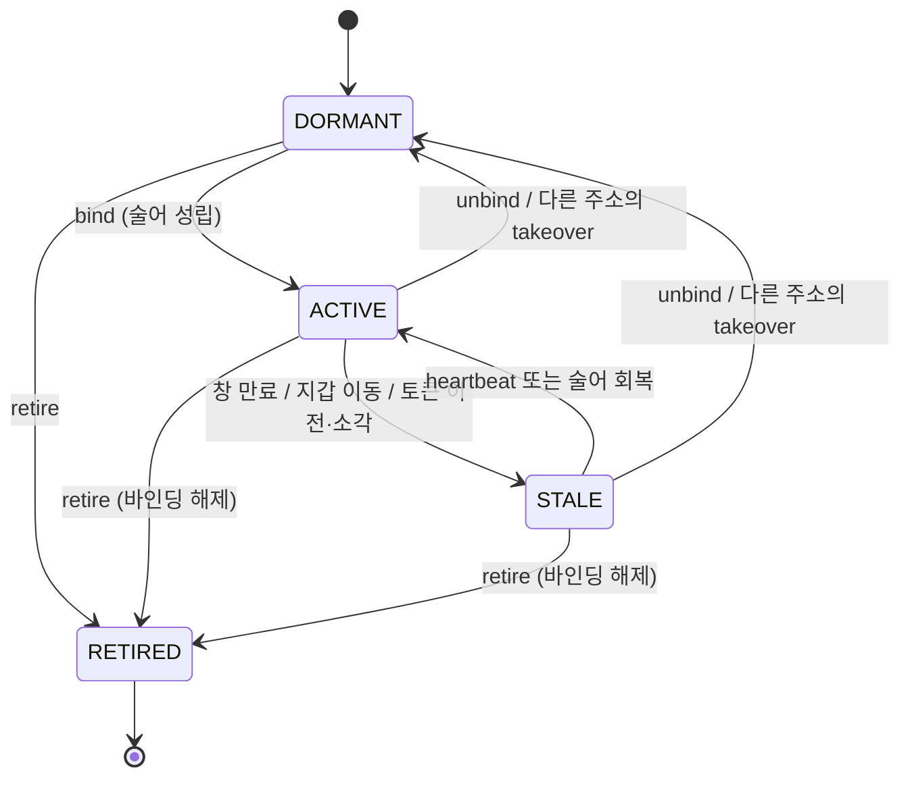
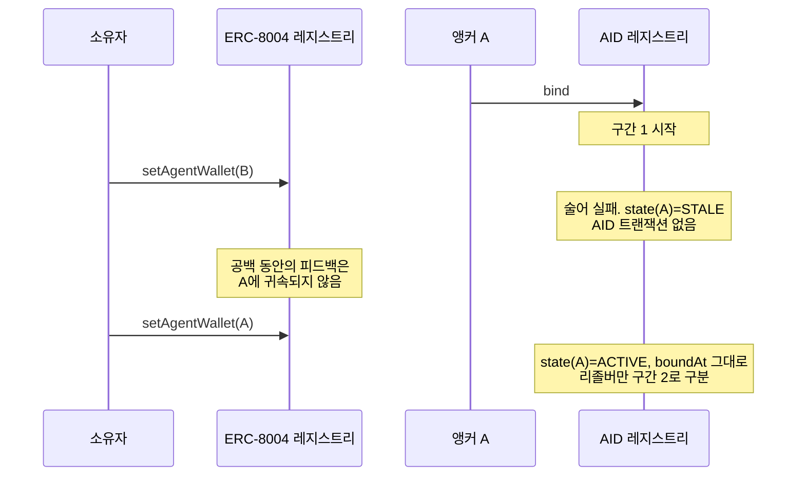
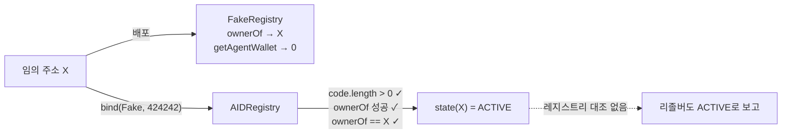
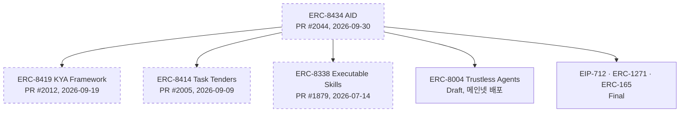

## 초록

ERC-8434 Agent Identity(AID)는 2026-09-30에 제출된 ERC 초안이다. 에이전트의 신원을 ERC-8004 토큰 대신 주소에 묶고, "모든 주소는 잠든 AID"라는 전제에서 출발해 바인딩·라이브니스·은퇴로 이루어진 얇은 온체인 계층과, 출처 등급이 붙은 패싯 문서를 결정론적으로 해석하는 리졸버 모델을 정의한다[^s01]. 이 글을 쓰는 2026-10-02 현재 이 제안은 병합되지 않은 PR이고, 이틀 사이 커밋 11개를 받았다[^s02].

본 리포트는 명세 원문을 읽는 데서 그치지 않고, 제안이 함께 낸 산출물을 직접 돌렸다. 테스트 벡터 16개를 독립 구현으로 재계산했고 모두 일치했다. 참조 리졸버를 공개 픽스처 7개에 실행했고, 참조 레지스트리 컨트랙트에 Foundry 프로브 7개를 로컬에서 걸었다.

그 결과 드러난 것은 셋이다. 첫째, 설계의 가장 정교한 부분인 커밋 시점(`committedAt`), 권한 구간, 바인딩 탈환(takeover)은 첫 초안에 없었다. Magicians에서 외부 참여자 세 명이 이틀 안에 제기한 뒤 들어왔다[^s03]. 둘째, 명세와 참조 구현 어느 쪽도 바인딩 대상이 진짜 ERC-8004 레지스트리인지 확인하지 않는다. 함수 두 개짜리 컨트랙트를 직접 배포해 바인딩하면 `state()`가 `ACTIVE`를 반환한다[^s01][^s06]. 셋째, 참조 리졸버는 명세 자신의 MUST 두 가지(미고정 `OBSERVED`의 `SELF` 강등, assertion registry 확인)를 구현하지 않으며, 그 결과 표본 문서의 미고정 `OBSERVED` 패싯이 강등 없이 보고된다[^s05][^s04].

AID가 이름으로 기대는 ERC-8338·8414·8419는 모두 같은 저자의 미병합 PR이고, 토대인 ERC-8004도 Draft다[^s09][^s07]. 이 리포트는 따라서 확정 표준의 해설이라기보다 이제 막 열린 설계 논의의 단면 기록이다.

## 1. AID가 제안하는 것

ERC-8004는 에이전트에게 `(registry, agentId)`라는 토큰 키와 등록 파일, 평판 채널을 준다. AID의 동기는 그 다음 질문들이다. 이 에이전트가 아직 살아 있는가, 등록과 실제로 거래하는 주소는 어떤 관계인가, 피드백·신용·감사·온체인 금융 행동 같은 이질적 신뢰 신호를 시간 한정적이고 검증 가능한 한 장의 그림으로 어떻게 모으는가[^s01].

답의 출발점은 앵커를 주소로 바꾸는 것이다. 명세의 표현을 빌리면 "주소는 이미 조인 키"다. ERC-8004 레지스트리든 토큰 결합 스킬 컨트랙트든 이벤트에는 행위 주소가 실리므로, 주소를 앵커로 삼으면 행동 이력이 등록 없이 파생된다[^s01]. 정식 식별자는 CAIP-10 `eip155:{chainId}:{address}`이고, DID 형태 `did:aid:…`는 별도의 컴패니언 메서드 명세로 미뤄 두었다. 같은 주소라도 체인이 다르면 다른 AID다[^s01].

명세는 역할을 네 층으로 나눈다.

| 층 | 표준 | 쓰는 쪽 | 내용 |
|---|---|---|---|
| 앵커·상태 | ERC-8434 `IAIDRegistry` | 앵커 | 바인딩, 하트비트, 라이브니스 창, 문서 URI, 자기 패싯, 은퇴 |
| 등록·원시 피드백 | ERC-8004 | 에이전트 소유자, 클라이언트 | 등록 파일, 에이전트 지갑, 상호작용별 피드백 |
| 주장(assertion) | assertion registry | 발행자, 증명자 | 신용 점수, 신뢰 등급, 감사, ZK 술어 |
| 스킬·작업 기록 | 토큰 결합 스킬·작업 컨트랙트(참고) | 이벤트에서 파생 | 앵커가 맡은 역할 |

_표 출처: 명세 §Overview[^s01]._

레지스트리에는 소유자도, 업그레이드 경로도 없다. 배포 시 고정되는 라이브니스 창 기본값과 상한 두 개가 매개변수의 전부이고, 어떤 발행자를 믿을지는 읽는 쪽이 해석 시점에 정한다[^s01][^s06].

## 2. 상태 기계와 바인딩

### 2.1 네 가지 상태

모든 AID는 정확히 하나의 상태에 있다. `DORMANT`는 기본값으로 바인딩이 없는 상태, `ACTIVE`는 바인딩이 있고 라이브니스 조건이 모두 성립하는 상태, `STALE`은 바인딩은 있으나 조건 하나 이상이 깨진 회복 가능한 상태, `RETIRED`는 앵커가 `retire`를 호출한 비가역 상태다[^s01].

온체인 `state()`는 순서가 정해져 있다. 은퇴했으면 `RETIRED`, 바인딩이 없으면 `DORMANT`, 그 외에는 세 조건이 모두 참일 때만 `ACTIVE`다. 바인딩된 레지스트리의 `ownerOf(agentId)`가 되돌려지지 않을 것, `ownerOf == anchor` 또는 `getAgentWallet == anchor`일 것(이것이 **바인딩 술어**다), `lastSeen + livenessWindow >= block.timestamp`일 것[^s01]. 오프체인 리졸버는 여기에 한 가지만 더한다. ERC-8004 등록 파일에 `"active": false`가 있으면 `ACTIVE`를 `STALE`로 내려 보고해야 한다[^s01].

_Figure 1 — AID의 상태 전이. `STALE`로의 전이는 AID 트랜잭션 없이도 ERC-8004 쪽 변화만으로 일어난다. takeover로 밀려난 앵커는 은퇴 상태가 되지 않고 `DORMANT`로 끝난다[^s01][^s03][^s06]._

라이브니스는 공짜에 가깝다. 앵커가 하는 모든 쓰기 호출이 `lastSeen`을 갱신하고, `heartbeat()` 하나로도 충분하다. 명세는 이것이 키를 통제하고 있다는 증거일 뿐 유용한 일을 하고 있다는 증거는 아니라고 스스로 밝혀 둔다[^s01]. 로컬 프로브에서도 창이 지나면 아무 트랜잭션 없이 `STALE`로 떨어지고, 하트비트 한 번에 `ACTIVE`로 돌아왔다.

### 2.2 1:1 바인딩과 탈환

AID 하나는 `(identityRegistry, agentId)` 하나에만 묶이고, 그 반대도 마찬가지이며, 레지스트리가 양방향을 모두 강제한다. 바인딩은 앵커가 직접 호출하거나 EIP-712 `Bind` 서명으로 할 수 있고, 컨트랙트 앵커는 ERC-1271로 검증한다[^s01]. 명세는 소유자 주소보다 에이전트가 실제로 거래하는 `agentWallet`을 앵커로 삼으라고 권하고, 여러 에이전트를 가진 소유자에게는 에이전트마다 별도 지갑이나 ERC-6551 토큰 결합 계정을 쓰라고 권한다[^s01][^s11].

탈환 규칙은 이 1:1 구조의 부작용을 막기 위해 들어왔다. 키를 잃은 EOA 앵커가 `unbind`를 부르지 못하면, 소유자가 ERC-8004에서 지갑을 옮겨도 옛 바인딩이 에이전트를 붙잡고 있게 된다. Magicians에서 한 참여자가 정확히 이 경우를 물었다[^s03]. 지금의 명세는 대상 에이전트에 다른 앵커가 묶여 있으면 그 앵커의 술어를 다시 검사해, 여전히 성립하면 `AgentAlreadyBound`로 되돌리고, 깨졌으면 옛 바인딩을 풀고 호출자를 같은 트랜잭션에서 묶는다[^s01]. 참조 구현의 `_bind`가 이를 그대로 따르며[^s06], 프로브에서 지갑을 A에서 B로 옮기자 A는 `STALE`이 되었고 B가 바인딩하는 순간 A는 `DORMANT`로 밀려났다.

### 2.3 권한 구간

가장 미묘한 규칙이 여기 있다. 바인딩 술어는 AID 트랜잭션 없이도 깨질 수 있고(소유자가 토큰을 넘기거나 지갑을 옮기면), 나중에 다시 성립할 수도 있다. 명세는 술어가 성립하는 최대 기간을 **권한 구간**이라 부르고, 관계가 다시 성립할 때마다 **새** 구간이 열린다고 정한다. "관계의 재성립은 공백을 결코 승인하지 않는다"[^s01]. 공백 동안 ERC-8004에 쌓인 피드백·검증은 그 AID의 증거로 세지 않는다.

_Figure 2 — A → 공백 → A 왕복. 온체인 `state()`는 다시 `ACTIVE`를 돌려주고 `boundAt`도 바뀌지 않는다. 공백을 아는 것은 이벤트로 구간을 재구성하는 리졸버뿐이다[^s01][^s05]._

구간은 온체인에 저장하지 않는다. 설계 근거는 ERC-8004가 이미 내보내는 이벤트를 중복 저장하지 않겠다는 것이다[^s01]. 대가도 분명하다. 프로브에서 지갑을 B로 옮겼다가 다시 A로 돌리자 `state(A)`는 원래의 `boundAt` 그대로 `ACTIVE`를 반환했다. `state()`로 게이팅하는 컨트랙트는 "지금 묶여 있는가"에는 정확히 답하지만, 그 사이에 공백이 있었는지는 알 수 없다. 명세가 "컨트랙트는 `state()`로 게이팅할 수 있다"고 쓸 때 그 범위는 현재 시점으로 한정해 읽어야 한다.

구간 재구성에는 전제가 하나 숨어 있다. 명세 §12는 ERC-8004만으로 구간을 복원할 수 있다며 근거를 이렇게 든다. 소유 변경은 ERC-721 `Transfer`이고, "모든 지갑 변경은 예약 키 `agentWallet`의 `MetadataSet` 이벤트"이며, 이전 시 지갑이 지워지므로 "술어는 경계를 표시하는 이벤트 없이 깨질 수 없다"[^s01]. ERC-8004 명세 본문을 확인하면 `agentWallet`은 `setMetadata`로 설정할 수 없는 예약 키이고, `MetadataSet` 방출이 명시된 곳은 일반 메타데이터 설정과 `register`뿐이다. `setAgentWallet`·`unsetAgentWallet`·이전 시 자동 초기화에 대해서는 이벤트를 요구하지 않는다[^s07]. ERC-8004 참조 구현은 세 경로 모두에서 `MetadataSet`을 방출한다[^s08]. 즉 AID의 이 문장은 ERC-8004의 규범이 아니라 그 참조 구현의 동작에 기대고 있다. 이벤트를 생략한 다른 8004 구현에 바인딩되면 지갑 이동 경계가 로그에 남지 않아 구간을 재구성할 수 없다 _(비참조 구현들의 실제 동작은 조사하지 않았다)_.

## 3. 문서, 패싯, 출처

### 3.1 AID 문서와 패싯

AID 문서는 `documentURI(anchor)`가 가리키는 오프체인 JSON이고, 온체인 digest는 RFC 8785 JCS로 직렬화한 문서의 `keccak256`이어야 한다. digest가 맞지 않거나 문서의 `aid`가 해석 중인 앵커가 아니면 리졸버는 문서를 버린다[^s01][^s12]. 문서는 **패싯**의 목록이다. 각 패싯 봉투에는 출처 등급, 발행자(CAIP-10), 유효 기간, digest 또는 커밋먼트, 접근 모드, 리졸버 포인터가 들어간다[^s01].

핵심 패싯 타입은 일곱이다. ERC-8004 등록 파일을 담는 `aid:core/identity/v1`, assertion registry의 주장 집합인 `aid:core/kya/v1`, 온체인 금융 행동을 요약하는 `aid:finance/observed/v1`, AI 행동 프로필을 위한 열린 네임스페이스 `aid:behavior/*`, 스킬과 작업 이력을 담는 `aid:skills/erc8338/v1`과 `aid:tasks/erc8414/v1`, ERC-8004 평판 레지스트리 요약인 `aid:review/erc8004/v1`[^s01].

### 3.2 출처 등급

명세는 "변조 불가능"이 네 가지 다른 뜻으로 쓰인다는 관찰에서 출발해, 모든 패싯에 다음 중 하나를 의무로 붙인다[^s01].

| 등급 | 만드는 쪽 | 보장 | 읽는 쪽 의무 |
|---|---|---|---|
| `SELF` | 앵커 | 무결성만. 내용의 진실은 주장하지 않음 | 검증된 것으로 표시 금지 |
| `OBSERVED` | 누구나, 스킴 해시로 고정된 알고리즘으로 | 재현 가능 | 재계산 또는 표본 확인 |
| `ATTESTED` | 제3자 발행자 | 발행자 책임 | 신뢰하는 발행자로 필터 |
| `PROVED` | 증명자 | 커밋먼트에 대한 암호학적 보장 | 증명 검증 또는 온체인 검증기 의존 |

하나의 규칙이 이 표 전체를 지탱한다. "스킴 해시로 고정되지 않은 `OBSERVED` 알고리즘의 패싯은 `SELF`로 취급해야 한다(MUST)"[^s01]. 고정이 없으면 재현 가능성 보장이 사라지기 때문이다. §5에서 보겠지만 이 규칙은 참조 리졸버에서 구현되지 않았다.

신용 점수에 대해서는 유효창이 더 엄격하다. 모든 패싯은 0이 아닌 `validUntil`을 가져야 하고, 신용 종류의 주장이 유한한 만료를 갖지 않으면 리졸버가 무시해야 한다. "만료 없는 신용 점수는 과거에 관한 주장을 현재처럼 제시하는 것"이라는 근거다[^s01]. 접근 모드는 `PUBLIC`(평문), `GATED`(권한자에게만 평문), `ZK`(커밋먼트와 술어 증명만)이며, 금융 행동 패싯의 기본값은 `ZK`다[^s01].

### 3.3 언제 존재했는가

출처 등급이 답하지 않는 질문이 있다. 판단이 그것이 평가하는 행동보다 **먼저** 존재했는가. 사후에 쓴 감사는 사전에 쓴 것과 똑같아 보이고, 신뢰 신호에서 그것은 예측과 회상의 차이다. 이 지적은 Magicians의 첫 리뷰에서 나왔다[^s03].

명세의 답은 출처와 직교하는 선택적 축이다. 패싯은 `committedAt: { anchor, proof }`로 자기 digest를 발행자가 통제하지 않는 시계에 묶을 수 있다. 허용되는 시계는 블록 포함(`block`), RFC 3161 타임스탬프, OpenTimestamps다. 리졸버는 그 증명이 `subjectWindow.until`보다 이른 시각을 가리킬 때만 `pre-outcome`을 보고하고, 아니면 `integrity-only`, 주장이 없으면 `none`을 보고한다[^s01].

명세는 여기서 한 걸음 더 간다. 타임스탬프는 존재를 증명할 뿐 배타성을 증명하지 못한다. 발행자는 서로 모순되는 판단 여러 개를 각각 커밋한 뒤 맞은 것 하나만 공개할 수 있다. 이를 막기 위해 발행자가 미리 선언한 해시 체인 로그를 두고, 리졸버가 `(issuer, subject, facetType, subjectWindow)` 키마다 항목이 정확히 하나인지 확인하게 한다. 로그를 선언하는 쪽은 피평가자가 될 수 없고 **발행자**여야 하며, 그 선언 자체가 평가 구간 종료보다 먼저임이 증명되어야 한다[^s01]. 참조 리졸버의 `log-exclusivity` 픽스처를 실행하면 이 세 경우가 실제로 갈린다. 유일한 항목은 `pre-outcome`으로 남고, 중복 항목과 선언되지 않은 로그는 `integrity-only`로 강등된다[^s05].

이 축에는 아직 명세에 들어가지 않은 단서가 하나 있다. OpenTimestamps 검증기를 기여한 참여자는 증명된 시각이 Bitcoin 블록 헤더의 타임스탬프이고, Bitcoin은 이를 약 2시간 범위에서만 보장하므로 `until`이 블록 시각에 그보다 가까우면 판정이 안전하지 않다고 적고 문장 추가를 제안했다[^s03]. 현재 명세 본문에는 이 단서가 없다[^s01].

## 4. 이틀간의 개정

이 명세의 가장 정교한 세 부분은 원래 초안에 없었다. PR의 첫 커밋 본문(395줄)에는 `committedAt`, 권한 구간, takeover가 한 번도 등장하지 않는다[^s15]. Magicians 스레드는 2026-09-30 저자의 글로 시작해 이튿날까지 아홉 개 글이 달렸다[^s03].

첫 리뷰어는 `ATTESTED`가 누가 주장했는지만 기록하고 언제 커밋했는지는 기록하지 않는다고 지적하며 `committedAt`을 제안했다. 저자는 이를 다섯 번째 출처 등급으로 만들지 않고 직교 축으로 받아들였다. 같은 리뷰어가 이어서 발행자 자신의 해시 체인과 증인으로 배타성을 확보하는 방안을 내놓았고, 이것이 §8의 참고 커밋 로그 프로필이 되었다[^s03][^s01].

두 번째 리뷰어는 바인딩이 다시 참이 되었을 때 그 사이의 일을 소급 승인해서는 안 된다는 점을 지적했다. `boundAt` 하나로는 이력 문제가 닫히지 않으며, 재성립은 새 권한 구간을 열 뿐이라는 것이다. 저자는 "동의하며, 이제 규범이 되었다"고 답했다[^s03].

세 번째 리뷰어는 키를 잃은 EOA 앵커의 복구 경로를 물었다. 소유자가 지갑을 옮겨도 옛 바인딩 때문에 새 지갑의 `bind`가 되돌려지는가. 저자는 takeover 규칙을 추가하고, 소유자 주소가 앵커인 경우에는 술어가 계속 성립하므로 아무도 대체할 수 없다는 경계를 함께 적었다[^s03].

외부 참여자 세 명의 지적이 하루 안에 규범 텍스트로 들어간 셈이다. 리뷰가 잘 작동한 사례이면서, 동시에 이 명세의 상당 부분이 아직 하루 이틀 된 텍스트라는 뜻이기도 하다.

## 5. 실행으로 확인한 것

PR head `68ebc1e05d`의 자산을 그대로 내려받아 세 갈래로 검사했다. 스크립트와 전체 로그는 `working/verify/`에 있다.

### 5.1 테스트 벡터

`aid-vectors.json`의 값을 제안 자신의 도구 없이 다시 계산했다. 패싯 타입 키 7개, 인터페이스 22개 함수 셀렉터의 XOR로 구한 ERC-165 인터페이스 ID `0x72750a54`, 앵커의 `account` 주제 해시·데이터·키, 독립 구현한 JCS로 직렬화한 표본 문서의 문자열과 digest, EIP-712 `Bind` 타입해시·도메인 구분자·다이제스트까지 **16개 모두 일치**했다[^s04].

하나만 걸렸다. 자리표시 AID 레지스트리 주소 `0x00000000000000000000000000000000000A1D00`은 대소문자가 섞여 있지만 EIP-55 체크섬을 통과하지 않는다. viem은 엄격 모드에서 이 주소를 거부한다. 해시 값에는 영향이 없으나 벡터를 그대로 엄격한 도구에 넣으면 오류가 난다[^s04].

### 5.2 참조 리졸버

리졸버를 공개 픽스처 7개에 실행했다. 상태 강등(`active: false` → `STALE`), digest 불일치 시 문서 폐기, 공백 구간 증거의 귀속 제외, 은퇴 표시, 타이밍과 배타성 판정이 모두 명세대로 동작했다[^s05].

명세의 MUST 가운데 구현되지 않은 것도 있다. 리졸버 소스에는 `resolver.schemeId`를 읽는 분기가 없어 미고정 `OBSERVED`를 `SELF`로 강등하지 않고, assertion registry의 `resolve`/`check`를 호출하지 않으며(§11 9단계), 알 수 없는 멤버를 거부하는 문서 스키마 검증도 하지 않는다(§6)[^s05][^s01]. 저자의 참조 저장소에 있는 리졸버도 PR 사본과 바이트 단위로 같고, 그 테스트 스위트는 스킴 고정 없는 `OBSERVED` 패싯을 쓰면서 `SELF` 강등을 검사하지 않는다[^s16]. `active.json` 픽스처에서 실제로 확인되는 결과는 다음과 같다.

| 패싯 | 보고된 출처 | 발행자 | 스킴 고정 |
|---|---|---|---|
| `aid:skills/erc8338/v1` | `OBSERVED` | 앵커 자신 | 없음 |
| `aid:tasks/erc8414/v1` | `OBSERVED` | 앵커 자신 | 없음 |
| `aid:review/erc8004/v1` | `ATTESTED` | 앵커 자신 | 없음 |

앞의 두 행은 명세 §8에 따르면 `SELF`여야 한다[^s01]. 패싯 봉투 스키마는 어떤 리졸버 종류에든 `schemeId`를 허용하므로 고정할 자리는 있다. 표본이 그것을 쓰지 않았을 뿐이다[^s04]. 셋째 행은 해석이 갈린다. 원천 피드백은 제3자의 것이지만, 패싯의 발행자는 앵커 자신이고 등급은 "제3자 발행자"를 뜻하는 `ATTESTED`다 _(필자의 해석)_.

### 5.3 참조 레지스트리

참조 `AIDRegistry.sol`을 로컬 Foundry 환경에서 프로브 7개로 검사했다. 네트워크는 쓰지 않았다. 라이브니스 창, 지갑 이동에 따른 `STALE`, takeover, 은퇴 후 쓰기 차단은 모두 명세대로였다. 나머지 셋이 눈여겨볼 결과다.

**가짜 레지스트리로 `ACTIVE`.** 바인딩 전제 조건은 레지스트리 주소에 코드가 있고, `ownerOf`가 되돌려지지 않으며, 술어가 성립하는 것뿐이다[^s01]. 참조 구현의 `_isAgentOfAnchor`도 같은 세 가지만 본다[^s06]. 그래서 `ownerOf`가 언제나 배포자를 돌려주는 함수 두 개짜리 컨트랙트를 만들어 바인딩하면, 그 주소의 `state()`는 `ACTIVE`가 된다. 리졸버도 바인딩된 레지스트리가 어떤 것인지 대조하지 않는다[^s05]. 명세의 동기 문단은 "주소만 가진 누구든 인덱서를 신뢰하지 않고" 상태를 도출할 수 있다고 하지만[^s01], 실제로는 바인딩된 레지스트리 주소를 신뢰 목록과 대조하는 일이 읽는 쪽에 남아 있다. 명세의 보안 고려사항에는 이 항목이 없다.

_Figure 3 — ERC-8004가 아닌 컨트랙트에 대한 바인딩. 명세와 참조 구현 모두 레지스트리의 정체를 확인하지 않는다[^s01][^s05][^s06]._

**소유자의 선점.** 지갑이 A에서 B로 옮겨진 뒤, 술어를 만족하는 주소는 새 지갑 B와 소유자 O 둘이다. 프로브에서 O가 먼저 바인딩하자, 명세가 권장하는 앵커인 B의 `bind`는 `AgentAlreadyBound`로 되돌려졌고 O가 토큰을 쥐고 있는 한 계속 그렇다[^s06]. 소유자는 어차피 에이전트를 통제하는 주체이므로 보안 결함보다는 권고("앵커는 `agentWallet`")와 규칙("술어를 만족하면 누구든")의 충돌로 읽힌다.

**동의 없는 후계자.** `retire(successor)`는 아무 주소나 후계자로 지정할 수 있고, 지정된 쪽의 동의를 확인하지 않는다[^s06]. 명세는 후계 링크를 "정보성"으로 두고 이력 병합을 금지하므로 직접적 피해는 제한적이다[^s01]. 다만 리졸버가 이 링크를 보여 줄 때, 그것이 한쪽의 일방적 선언이라는 점은 함께 표시되어야 한다.

## 6. 의존 스택과 표준화 위치

이름으로 참조된 제안들을 따라가면 하나의 스택이 나온다.

_Figure 4 — AID의 의존 관계. 점선은 병합되지 않은 PR이며, 넷 모두 같은 저자의 것이다[^s09][^s07][^s13][^s01]._

ERC-8338·8414·8419는 모두 ERC-8434와 같은 저자가 2026년 7월부터 9월 사이에 연 PR이고, 2026-10-02 현재 어느 것도 병합되지 않았다[^s09]. 명세의 `requires` 헤더는 155·165·712·1271·8004만 나열한다[^s01]. 병합되지 않은 제안은 의존물로 선언할 수 없으니 자연스러운 결과이고, 명세가 assertion registry를 의존물 대신 인터페이스로 정의한 이유도 여기서 읽힌다. 실제 텍스트에는 그 긴장이 남아 있다. 근거 문단은 KYA 제안을 "공개되면 번호로 인용하겠다"고 적지만[^s01], 같은 명세의 리졸버 종류 이름은 이미 `erc8419-assertion`이고, 테스트 벡터는 "ERC-8419 레지스트리/어댑터"를 실제 Sepolia 배포라고 명시한다[^s04].

토대인 ERC-8004 역시 Draft다[^s07]. 그럼에도 참조 레지스트리는 이더리움 메인넷과 Base 메인넷을 포함한 여러 체인에 같은 주소로 배포되어 있고[^s13], 업계 보도는 이 표준을 세 개의 레지스트리로 이루어진 에이전트 신원 계층으로 소개해 왔다[^s14]. AID는 이 이미 배포된 Draft 위에, 아직 병합되지 않은 세 제안을 인터페이스로 엮어 올린 구조다.

PR 자체는 형식 요건을 갖췄다. 번호는 편집 보조자가 2026-09-30 배정했고, PR head의 CI 검사는 모두 통과했으며, 남은 것은 편집자 한 명의 리뷰다[^s02]. 참조 저장소는 하루 먼저 만들어졌다[^s10].

## 7. Limitations

- **이 리포트는 PR head `68ebc1e05d`(2026-10-01) 기준이다.** 이틀 동안 커밋 11개가 들어왔으므로 §5의 관측 일부는 다음 커밋에서 사라질 수 있다.
- **ERC-8434를 다룬 독립 분석은 없다.** 제출 이틀째이며 웹 검색 결과가 없다. 외부 시각은 Magicians 참여자 세 명의 글이 전부다.
- **모든 실행은 로컬이다.** 벡터 재계산, 리졸버 픽스처 실행, Foundry 프로브는 네트워크 없이 수행했다. 테스트 벡터의 AID 레지스트리 주소는 자리표시이며, 실제 배포된 AID 레지스트리와 상호작용하지 않았다.
- **가짜 레지스트리 관측의 실제 위험은 소비자 설계에 달렸다.** 바인딩된 레지스트리 주소를 신뢰 목록과 대조하는 소비자에게는 문제가 되지 않는다. 확인한 것은 명세와 참조 구현이 그 대조를 요구하지 않는다는 사실까지다.
- **ERC-8419·8338·8414 본문은 정독하지 않았다.** AID가 요구하는 최소 인터페이스를 AID 명세 안에서만 확인했다.
- **비참조 ERC-8004 구현들의 이벤트 동작은 조사하지 않았다.** §2.3의 서술은 8004 명세 본문과 참조 구현의 차이에 근거한다.
- **`did:aid` 컴패니언 메서드 명세는 찾지 못했다.**
- **review 패싯의 `ATTESTED` 표기에 대한 판단은 해석이다.** 원천 피드백이 제3자의 것이라는 반론을 함께 적었다.
