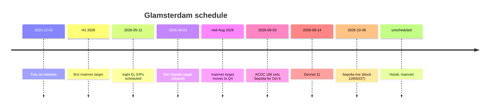
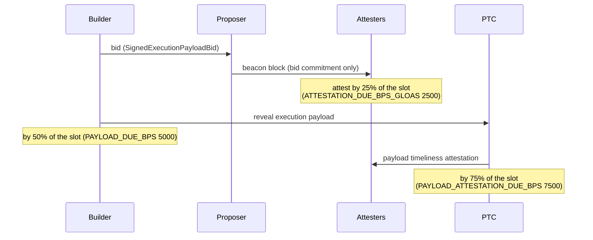

## Abstract

Glamsterdam is Ethereum's next hard fork, named for the execution-layer upgrade Amsterdam and the consensus-layer upgrade Gloas. The meta EIP-7773 lists eighteen EIPs as Scheduled for Inclusion, plus five networking and two informational EIPs[^s01]. As of 2026-10-08 the fork is live only on the Sepolia testnet; the Hoodi and mainnet rows of its activation table are empty[^s01][^s03].

It rests on three pillars: enshrined proposer-builder separation (EIP-7732), which pulls builders into the protocol and decouples execution validation from consensus validation[^s04]; block-level access lists (EIP-7928), which declare the state a block touched so that clients can parallelise[^s05]; and a set of repricing EIPs that rewrite large parts of the gas schedule to contain state growth and worst-case block size[^s06][^s07][^s08][^s10].

We checked what could be checked instead of restating the specifications. Querying Sepolia directly confirms that the fork began at block 11,856,337, at exactly the scheduled second, and that headers from that block onward carry `blockAccessListHash` and `slotNumber`[^s27]. EIP-8037's cost per state byte (CPSB) of 1530 and the costs derived from it were recomputed: creating a new account now costs 183,600 state gas, 7.34 times today's figure[^s06]. And the point where that repricing meets EIP-7954's larger contract-size limit was worked out. Because the block-level check compares a transaction's whole gas limit against the block's remaining state gas, at mainnet's current 60M gas limit a contract at the new 65,536-byte maximum cannot be deployed in a single transaction. Under EIP-8037's own assumptions (a 5M-gas constructor) the ceiling is about 35,813 bytes, and a maximum-size deployment needs roughly 105.5M gas[^s06][^s09][^s28].

The schedule has already slipped twice. The mainnet target moved from the first half of 2026 to the fourth quarter, and Sepolia from August 3 to October 6[^s30]. The gap between Sepolia client releases and the fork was seven days, half the usual review window, and consensus developer Potuz warned that a swarm of fake builders withholding payloads could stall the testnet[^s29].

## 1. Where Glamsterdam stands

The name joins the execution-layer side, Amsterdam, and the consensus-layer side, Gloas: the meta EIP's history refers to "EL Amsterdam EIPs", and the consensus specifications call the same fork Gloas[^s02][^s24]. In the consensus-specs mainnet config the previous fork, Fulu, sits at epoch 411,392 (2025-12-03); Gloas's fork epoch below it is still `18446744073709551615`, the maximum uint64, and the fork after that, Heze, holds the same placeholder[^s25].

EIP-7773 is in Review and has been edited 85 times. Eight execution-layer EIPs were scheduled on 2026-05-11, the remaining candidates were promoted together on August 5, EIP-7610 was removed on August 20, and the Sepolia activation time went in on September 17[^s02]. The activation table has a single filled row, Sepolia, under a note that the rest "will be filled as activation times are decided by client teams"[^s01]. The Ethereum Foundation's announcement is equally plain: "Hoodi and mainnet activation dates have not yet been decided. This announcement covers Sepolia; it does not schedule a mainnet upgrade"[^s03].

Getting here was not smooth. According to reporting, mainnet was first aimed at the first half of 2026 and moved to the fourth quarter in mid-August. Sepolia was first set for August 3, postponed as the devnet phase ran long, and reset to October 6 on the ACDC #186 call of September 3. Devnets 0 through 9 ran in between; Devnet-9 could not finalise normally; Devnet-10 was skipped in favour of Devnet-11 on September 14[^s30]. The same article judged that October 6 was "more likely to slip again than to hold"[^s30].

_Figure 0 — how the schedule moved. The H1 2026 and August 3 targets and the devnet dates come from reporting; the rest from the meta EIP's history, the consensus config and on-chain reads[^s25][^s02][^s30][^s27]._

It held. Over Sepolia's RPC, block 11,856,336 closes at timestamp 1,791,294,804 with no new fields, and block 11,856,337 lands at exactly the scheduled 1,791,294,816 with EIP-7928's `blockAccessListHash` and EIP-7843's `slotNumber` in its header for the first time[^s27][^s01]. Two days later Sepolia's gas limit is 200M[^s27]. The value comes from EIP-8261's schedule. A change merged into Sepolia's consensus config on 2026-09-24 put "200M at fork epoch 353024" into `GAS_LIMIT_SCHEDULE`, and Prysm shipped a release carrying it four days before the fork; validators with an explicit gas limit keep theirs, and only those without one follow the schedule[^s26][^s31][^s32]. That explains the EF notice's warning that Prysm 7.2.0 and Teku 26.9.1, releases that predate the schedule, still default to 60M after activation[^s03]. Under EIP-1559's 1/1024 rule, going from 60M to 200M takes at least 1,234 blocks, about 4.1 hours. Mainnet's gas limit on the same day is 60M[^s28].

There are signs of schedule pressure. The deadline for Sepolia-ready client releases was September 29, seven days before the fork against a usual fourteen; developers reportedly accepted that because Sepolia's controlled validator set makes recovery easy[^s29]. Hoodi is floated for around October 27 but has no official date[^s29][^s03].

## 2. ePBS: builders inside the protocol

### 2.1 What changes

EIP-7732 defines a new protocol participant, the builder. It removes `ExecutionPayload` from the beacon block body and puts in its place a signed commitment, a `SignedExecutionPayloadBid`, to a payload the builder will reveal later. Validators gain a new duty, payload timeliness attestations. The effect is to separate execution validation from consensus validation both logically and in time[^s04].

_Figure 1 — a Gloas slot. The deadlines are the basis-point values in Sepolia's consensus config: 3, 6 and 9 seconds into a 12-second slot[^s04][^s26]._

In Sepolia's config the timetable is concrete: ordinary attestations are due at 25% of the slot, the payload at 50%, and payload timeliness attestations at 75%[^s26]. Because the execution payload may now arrive after the beacon block, execution validation and propagation get more of the slot.

Builders no longer enter through the validator deposit flow. EIP-8282 defines two EIP-7685 request types and predeploy contracts: a builder deposit contract for registration and top-ups, and a builder exit contract through which a builder's `execution_address` requests a full exit. Both copy the request-bus pattern of EIP-7002 and EIP-7251[^s14].

### 2.2 When a winning bid is paid

The Gloas consensus specification settles a builder's bid by one of two routes[^s24]. The first is delivery: processing an execution payload settles the parent slot's pending payment, and the spec comments that it settles "before the requests so that a builder exit request is rejected while the payment is pending". The second is epoch processing: if same-slot attestation weight for that slot's block reaches the quorum, the payment goes through. The quorum is six-tenths of the active stake per slot[^s24].

Bids have a floor too. A builder may bid only what remains after setting aside `MIN_DEPOSIT_AMOUNT` (1 ETH) and any pending withdrawals, and an exiting builder cannot withdraw for 64 epochs[^s24].

### 2.3 Builders that never deliver

The attack consensus developer Potuz described on the September 17 developer call targets exactly this structure. As reported, he said: "I can just spin up a thousand builders, rotate them, offer very high bids, and not produce payloads", and "Any teenager can do this." Some client safeguards reportedly trigger only after several payloads go missing, and developers discussed the need to ban individual builders so an attacker cannot simply return under new identities[^s29] _(single report; the call's own record was not consulted)_.

Translating the warning to mainnet needs the rule from §2.2. Honest attesters vote for the beacon block whether or not a payload follows, so if the block gathers 60% same-slot weight the builder pays its bid even though it delivered nothing, and each identity also locks at least 1 ETH[^s24]. On that reading the attack is not free on mainnet; it is free on Sepolia, where, as the report notes, test ether costs nothing[^s29] _(our reading of the specification, not a game-theoretic analysis)_. What remains open is how much a willing attacker would actually have to spend to empty slots, and whether that is enough of a deterrent; we did not measure it.

## 3. Block-level access lists

EIP-7928 records every account and storage location a block's execution touched, together with their post-execution values, in order to allow parallel disk reads, parallel transaction validation, parallel state-root computation and executionless state updates[^s05]. The `blockAccessListHash` that appeared in Sepolia's headers is the commitment to that list[^s27].

The lists also shape other EIPs. EIP-8037 times its account-creation charge to "an access EIP-7928 always records" and notes that when a destination account may be read is constrained by EIP-7928[^s06]. On the networking side the fork bundles eth/71 for exchanging access lists (EIP-8159), snap/2 for healing state from them (EIP-8189), and the eth/72 sparse blobpool (EIP-8070) to lighten blob propagation[^s01][^s23].

## 4. Rewriting the gas schedule

### 4.1 Counting state creation separately

EIP-8037 is the largest change in the fork. It splits gas into an execution dimension and a state dimension and prices new state in units of a cost per state byte, CPSB[^s06].

The motivation is state size. Per the EIP, a Geth node's state database was about 390 GiB in January 2026, and when the gas limit went from 30M to 60M, new state per day more than tripled, from about 105 MiB to about 326 MiB. Extrapolated to a 200M limit, that is 387 GiB a year, crossing the 650 GiB level at which nodes start to degrade within a year[^s06].

The derivation of 1530 is written out and can be redone. Half of a 150M reference gas limit (where the base fee converges) times 2,628,000 blocks a year gives 1.971×10¹⁴ state gas; divided by the 120 GiB target (128,849,018,880 bytes) that is 1529.7, which the EIP rounds to 1530[^s06]. Our recomputation agrees.

| Operation | Today | Glamsterdam state gas | Factor |
|---|---|---|---|
| new account (value `CALL`, `CREATE`) | 25,000 / 32,000 | 120 × 1530 = 183,600 | ~7.3× |
| new storage slot (`SSTORE` 0→x) | 20,000 | 64 × 1530 = 97,920 | ~4.9× |
| one byte of deployed code | 200 | 1,530 | ~7.7× |

_Source: EIP-8037 parameter tables[^s06]; factors computed in `working/verify/verify_numbers.py`._

At the block level only the dimension with the higher cumulative usage counts toward fullness and the base-fee update, so the gas limit and target come to bound the "bottleneck resource"[^s06].

### 4.2 Where it meets the contract-size limit

Two EIPs collide here. EIP-7954 raises the deployable code limit from 24,576 to 65,536 bytes and the initcode limit from 49,152 to 131,072 bytes[^s09]. Under EIP-8037, each byte of code is 1,530 state gas.

EIP-8037 anticipates part of this. It applies the single-transaction cap of EIP-7825 (about 16.7M) to execution gas only and lets state gas draw on a separate reservoir. Assuming a 21,000 base, a 5M-gas constructor and the account-creation charge, it computes that a transaction under the new 2³²−1 cap could deploy about 2.8 MB of code, "dozens of maximum-size contracts". Both of its figures recompute correctly[^s06].

The same EIP also sets the block-side condition: to be included, a transaction's `tx.gas` must not exceed the block gas limit minus the state gas already used[^s06]. The text concedes that "while the block gas limit stays below `TX_MAX_TOTAL_GAS_LIMIT`, the per-dimension block checks are the tighter bound"[^s06]. Under the same assumptions:

- deploying one 65,536-byte contract requires `tx.gas` of about 105,474,680, so the block gas limit must be at least 105.5M;
- mainnet's gas limit on 2026-10-08 is 60M[^s28], under which a single transaction can deploy about 35,813 bytes of code;
- even today's maximum, a 24,576-byte contract, would take about 42.8M gas, against roughly 4.9M of code-deposit cost today.

Unless the mainnet gas limit rises with the fork, about half of the 64 KiB headroom that EIP-7954 opens is unusable. Whether that staging is intended, and whether a gas-limit increase is planned for activation, we could not establish. EIP-8261's gas limit schedule exists to coordinate exactly such increases by epoch, and Sepolia already used it to reach 200M, but in the consensus-specs mainnet config `GAS_LIMIT_SCHEDULE` is an empty list[^s12][^s31][^s25].

### 4.3 The rest of the repricing

- **EIP-2780** breaks the flat 21,000 intrinsic cost into per-resource primitives. A plain ETH transfer to an existing account stays at 21,000; transactions that create accounts or touch EIP-7702 pay what they incur[^s08]. The proposal dates from 2020[^s08].
- **EIP-8038** raises state-access costs: cold account access from 2,600 to 3,000 (+15%), a storage write that changes a slot from 2,800 to 10,000 (+257%), and the clearing refund from 4,800 to 11,616. The 2,300 call stipend is unchanged. The EIP states its values "are not yet final"[^s07][^s06].
- **EIP-7976** raises the calldata floor from 10/40 to 64/64 gas per byte. Its "~37%" reduction in worst-case block size is for incompressible non-zero bytes (40→64). For a block of zero bytes the floor goes from 10 to 64 and the maximum payload per unit of gas shrinks by 84%; the EIP's own motivating example, 10 MiB needing ~105M gas before and ~671M after, is that zero-byte case[^s10]. Both numbers are right; they measure different things.
- **EIP-7981** charges access lists for their data so they cannot be used to dodge the calldata floor[^s11].
- **EIP-7778** stops refunds, such as those from clearing `SSTORE`s, from reducing the gas counted against the block limit, while still applying them to what the user pays[^s19].

The Ethereum Foundation flagged the consequence for deployed code directly: "Contracts that rely on fixed gas stipends, hardcoded gas limits, or assumptions about remaining gas may need changes"[^s03].

## 5. Everything else

| EIP | Change |
|---|---|
| 7997 | makes the CREATE2 factory at `0x4e59b44847b379578588920cA78FbF26c0B4956C` a formal requirement for same-address deployment across chains[^s16] |
| 8024 | adds `SWAPN`, `DUPN` and `EXCHANGE` to reach beyond stack depth 16[^s22] |
| 7843 | `SLOTNUM` (0x4b) returns the current slot number[^s18] |
| 7708 | every ETH transfer emits a log[^s17] |
| 8246 | removes the remaining cases where `SELFDESTRUCT` burns ETH[^s15] |
| 8045 | excludes slashed validators from proposer selection[^s20] |
| 8061 | roughly doubles consolidation churn and quadruples exit churn, accepting a weak subjectivity period of about seven days[^s13] |
| 7688 | moves consensus structures to forward-compatible containers; only merkleization changes[^s21] |
| 8261 | an epoch-based schedule for clients' default and recommended maximum gas limit, with no consensus-rule change[^s12] |

_EIP-7688 is the one scheduled EIP still in Review[^s21]._

EIP-8061 carries a judgment beyond its numbers. It roughly halves the weak subjectivity period, to about seven days, in exchange for faster validator consolidation, which speeds the path to faster finality, and for relief of the exit queue[^s13]. Operators who leave a node off for a while will need a trusted checkpoint more often.

EIP-8261 is unusual in changing no consensus rule at all. EIP-1559's ±1/1024 bound remains the only gas-limit validity rule; the schedule is a recommendation, and a client should warn when an operator exceeds it but still honour the setting[^s12]. That is the context for the EF notice that Prysm and Teku default to 60M after activation and that Prysm's `--suggested-gas-limit` has no effect after Gloas: post-Gloas, the gas-limit preference travels through the builder pipeline[^s03][^s12].

## 6. Who has to change what

**Contract developers.** New accounts, new slots and code deployment get 4.9 to 7.7 times more expensive, which changes the economics of factories and of anything that writes many fresh slots. Hardcoded gas in calls and logic that reasons about remaining gas fall under the EF's warning[^s03][^s06][^s07]. Teams deploying large contracts should check the block-limit constraint in §4.2.

**Wallets and RPC.** EIP-7976 states that an `eth_estimateGas` that ignores the new floor will underestimate and cause failed transactions[^s10]. Estimation also has to account for two gas dimensions and the reservoir[^s06].

**Validators.** Execution, consensus and validator clients must all be updated, and validators pick up payload-timeliness committee duties[^s03][^s04]. Gas-limit preference now flows through the builder pipeline[^s12].

**Builders.** Builders become first-class protocol participants that deposit and exit through EIP-8282's contracts[^s14]. Their bids must be backed by balance, and a builder that wins and withholds still pays if the block gathers enough attestations[^s24].

## 7. Limitations

- **This is a snapshot of 2026-10-08, two days after Sepolia.** All scheduled EIPs except EIP-7688 are in Last Call, and EIP-8038 itself says its values are not final; numbers may move before mainnet.
- **Schedule details rely on two press reports.** The ACD call records (ACDC #186 and others) and the original record of Potuz's warning were not consulted. The October 27 Hoodi date is tentative reporting.
- **The §4.2 conclusion depends on mainnet's 60M gas limit and EIP-8037's 5M-constructor assumption.** If the gas limit rises with the fork, it weakens. Mainnet gas-limit plans were not found.
- **The mainnet cost of the builder attack is our reading of the specification.** Its real magnitude and deterrent effect were not measured.
- **Post-fork stability on Sepolia (missed slots, withheld payloads) was not measured.** What was checked is the fork block, the new header fields and the current gas limit.
- **Client implementation differences and test coverage for each EIP were not surveyed.**
