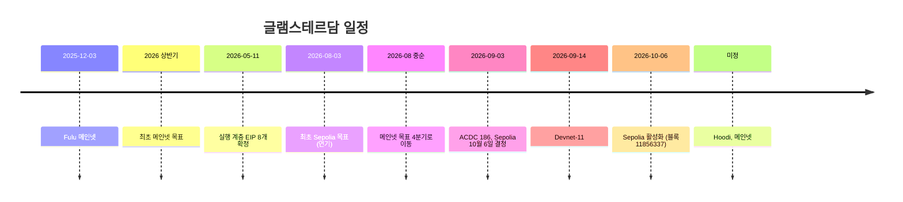
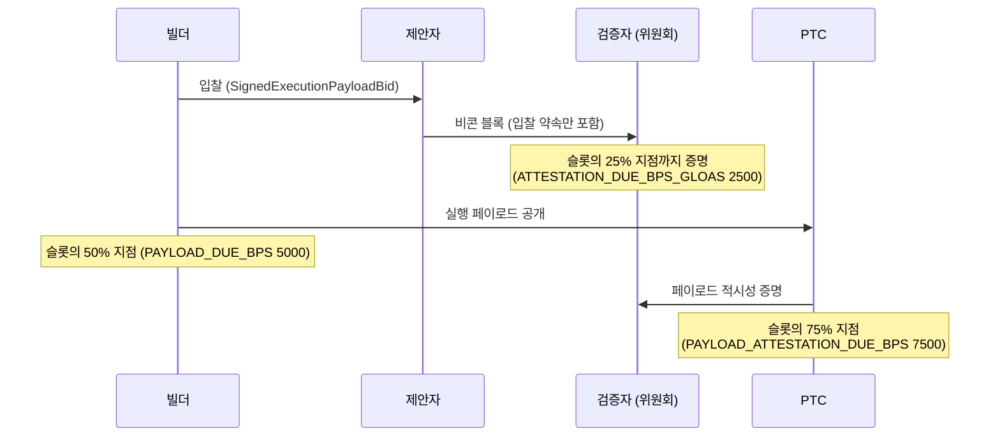

## 초록

글램스테르담(Glamsterdam)은 이더리움의 다음 하드포크로, 실행 계층 업그레이드 Amsterdam과 합의 계층 업그레이드 Gloas를 묶은 이름이다. 메타 EIP-7773은 18개 EIP를 확정 포함(Scheduled for Inclusion)으로 나열하고, 그 밖에 네트워킹 EIP 5개와 정보성 EIP 2개를 함께 둔다[^s01]. 2026-10-08 현재 이 포크는 Sepolia 테스트넷에서만 활성화됐다. Hoodi와 메인넷 날짜는 비어 있다[^s01][^s03].

중심축은 셋이다. 블록 생산에서 실행 검증을 떼어 내 빌더를 프로토콜 안으로 들이는 EIP-7732 ePBS[^s04], 블록이 건드린 상태를 미리 선언해 병렬 처리를 여는 EIP-7928 블록 수준 접근 목록[^s05], 그리고 상태 증가와 최악 블록 크기를 잡기 위해 가스표를 크게 다시 쓰는 한 묶음의 재가격화 EIP다[^s06][^s07][^s08][^s10].

이 리포트는 명세를 옮겨 적는 대신 확인 가능한 것을 확인했다. 첫째, Sepolia RPC를 직접 조회해 포크가 블록 11,856,337에서 예정 시각과 정확히 같은 초에 시작됐고, 그 블록부터 헤더에 `blockAccessListHash`와 `slotNumber`가 생겼음을 확인했다[^s27]. 둘째, EIP-8037의 상태 바이트당 가스(CPSB) 1530과 거기서 파생되는 비용을 재계산했다. 새 계정 생성은 상태 가스 183,600으로 지금의 7.34배가 된다[^s06]. 셋째, 이 재가격화와 EIP-7954의 계약 크기 상향이 맞물리는 지점을 계산했다. 블록 수준 검사가 트랜잭션의 가스 한도 전체를 블록의 남은 상태 가스와 비교하므로, 메인넷의 현재 가스 한도 6천만에서는 새 상한인 65,536바이트 계약을 단일 트랜잭션으로 배포할 수 없다. EIP 자신의 가정(생성자 실행 5M)을 쓰면 상한은 약 35,813바이트이고, 최대 크기 배포에는 약 1억 550만 가스가 필요하다[^s06][^s09][^s28].

일정은 이미 두 번 밀렸다. 메인넷 목표는 2026년 상반기에서 4분기로 옮겨졌고, Sepolia도 8월 3일에서 10월 6일로 늦춰졌다[^s30]. Sepolia 클라이언트 릴리스와 포크 사이 간격은 평소의 절반인 7일이었고, 합의 개발자 Potuz는 페이로드를 내지 않는 다수의 가짜 빌더로 테스트넷을 멈출 수 있다고 경고했다[^s29].

## 1. 글램스테르담은 지금 어디에 있나

이름은 실행 계층 쪽 Amsterdam과 합의 계층 쪽 Gloas를 합친 것이다. 메타 EIP의 커밋 이력은 실행 계층 EIP들을 "EL Amsterdam EIPs"로 부르고, 합의 명세는 같은 포크를 Gloas로 부른다[^s02][^s24]. 합의 명세 저장소의 메인넷 설정에는 직전 포크 Fulu가 에폭 411,392(2025-12-03)로 적혀 있고, 그 아래 Gloas의 포크 에폭은 아직 `18446744073709551615`, 곧 uint64 최대값이다. 다음 포크 Heze도 같은 값으로 자리만 잡혀 있다[^s25].

메타 EIP-7773은 Review 상태이며 85번 고쳐졌다. 2026-05-11에 실행 계층 EIP 8개가 확정 포함으로 올라갔고, 8월 5일에 나머지 후보가 일괄 확정되었으며, 8월 20일에 EIP-7610이 빠졌고, 9월 17일에 Sepolia 활성화 시각이 기입됐다[^s02]. 활성화 표에는 Sepolia 한 줄만 채워져 있고, "클라이언트 팀이 활성화 시각을 정하는 대로 채운다"는 주석이 붙어 있다[^s01]. 이더리움 재단의 9월 공지도 같은 입장이다. "Hoodi와 메인넷 활성화 날짜는 아직 정해지지 않았다. 이 공지는 Sepolia만 다루며 메인넷 업그레이드를 예약하지 않는다"[^s03].

일정의 이력은 순탄하지 않다. 보도에 따르면 원래 메인넷 목표는 2026년 상반기였고 8월 중순에 4분기로 밀렸다. Sepolia는 처음 8월 3일로 잡혔다가 데브넷 단계가 길어지면서 연기되었고, 9월 3일 ACDC #186 회의에서 10월 6일로 다시 잡혔다. 그 사이 데브넷 0~9가 돌았고, 데브넷 9는 정상적으로 완결(finalize)되지 않았으며, 데브넷 10은 건너뛰고 9월 14일 데브넷 11로 넘어갔다[^s30]. 같은 기사는 10월 6일도 "지켜지기보다 다시 밀릴 가능성이 높다"고 봤다[^s30].

_Figure 0 — 일정의 이동. 2026년 상반기 목표와 8월 3일 Sepolia 목표, 중간 데브넷 일정은 보도에, 나머지는 메타 EIP 이력과 합의 설정, 온체인 조회에 근거한다[^s25][^s02][^s30][^s27]._

그 예측은 빗나갔다. Sepolia RPC를 직접 조회하면, 블록 11,856,336은 타임스탬프 1,791,294,804에 새 필드 없이 끝나고, 다음 블록 11,856,337은 정확히 예정 시각인 1,791,294,816에 생성되며 헤더에 EIP-7928의 `blockAccessListHash`와 EIP-7843의 `slotNumber`를 처음으로 담는다[^s27][^s01]. 이틀 뒤 Sepolia의 가스 한도는 2억이다[^s27]. 이 값은 EIP-8261의 가스 한도 일정에서 왔다. Sepolia 합의 설정은 2026-09-24 병합된 변경으로 "포크 에폭 353024에 가스 한도 2억"을 `GAS_LIMIT_SCHEDULE`에 넣었고, Prysm은 포크 나흘 전에 이 일정을 반영한 릴리스를 냈다. 명시적 가스 한도를 설정한 검증자는 자기 값을 유지하고, 설정하지 않은 검증자만 2억을 따른다[^s26][^s31][^s32]. 일정이 생기기 전 릴리스인 Prysm 7.2.0과 Teku 26.9.1이 활성화 후에도 6천만을 기본값으로 쓴다는 EF 공지의 경고가 이것으로 설명된다[^s03]. EIP-1559의 1/1024 규칙상 6천만에서 2억까지는 최소 1,234블록, 약 4.1시간이 걸린다. 같은 날 메인넷 가스 한도는 6천만이다[^s28].

일정 압박의 흔적도 있다. Sepolia용 클라이언트 릴리스 마감은 9월 29일이었고 포크까지 7일, 평소 검토 기간 14일의 절반이었다. 개발자들은 Sepolia가 통제된 검증자 집합을 써서 문제가 생겨도 복구가 쉽다는 이유로 이를 받아들였다고 보도됐다[^s29]. Hoodi는 10월 27일 전후로 잠정 거론될 뿐 공식 일정은 없다[^s29][^s03].

## 2. ePBS: 빌더가 프로토콜 안으로 들어온다

### 2.1 무엇이 바뀌나

EIP-7732는 빌더라는 새 참여자를 프로토콜 안에 정의한다. 비콘 블록 본문에서 `ExecutionPayload`를 빼고, 그 자리에 빌더가 나중에 공개할 페이로드에 대한 서명된 약속(`SignedExecutionPayloadBid`)을 넣는다. 검증자에게는 페이로드가 제때 공개됐는지 증명하는 새 의무(payload timeliness attestation)가 생긴다. 실행 검증이 합의 검증과 논리적으로도, 시간적으로도 분리되는 것이다[^s04].

_Figure 1 — Gloas 슬롯의 흐름. 시각은 Sepolia 합의 설정의 basis point 값이다(12초 슬롯 기준 3초·6초·9초)[^s04][^s26]._

Sepolia 설정에서 이 일정은 숫자로 보인다. 일반 증명 마감이 슬롯의 25%, 페이로드 공개 마감이 50%, 페이로드 적시성 증명 마감이 75%다[^s26]. 실행 페이로드가 비콘 블록보다 늦게 와도 되므로, 실행 검증과 전파에 쓸 수 있는 시간이 늘어난다.

빌더는 더 이상 검증자 예치 흐름으로 들어오지 않는다. EIP-8282는 EIP-7685 요청 유형 두 개와 예치·종료용 사전 배포 계약을 정의한다. 빌더 예치 계약은 최초 등록과 추가 예치를, 빌더 종료 계약은 빌더의 `execution_address`가 전체 종료를 요청하는 일을 맡는다. 구조는 EIP-7002와 EIP-7251의 요청 버스 패턴을 그대로 따른다[^s14].

### 2.2 낙찰 대금은 언제 지급되나

Gloas 합의 명세를 보면 빌더의 입찰 대금은 두 경로 중 하나로 정산된다[^s24]. 하나는 페이로드가 실제로 처리될 때다. 실행 페이로드 처리 과정에서 부모 슬롯의 대기 지급이 정산된다. 명세 주석은 "지급이 대기 중인 동안 빌더 종료 요청이 거부되도록 요청보다 먼저 정산한다"고 적는다. 다른 하나는 에폭 처리 시점이다. 그 슬롯의 블록에 대한 동일 슬롯 증명 가중이 정족수 이상이면 지급된다. 정족수는 슬롯당 활성 지분의 6/10이다[^s24].

입찰 자체에도 바닥이 있다. 빌더 잔고에서 `MIN_DEPOSIT_AMOUNT`(1 ETH)와 이미 대기 중인 출금을 뺀 금액이 입찰가 이상이어야 입찰할 수 있다. 종료한 빌더는 64에폭 동안 출금할 수 없다[^s24].

### 2.3 페이로드를 내지 않는 빌더

9월 17일 개발자 회의에서 합의 개발자 Potuz가 경고한 공격은 이 구조를 겨냥한다. 보도에 따르면 그는 "빌더 천 개를 띄워 돌려 가며 아주 높은 입찰을 내고 페이로드를 만들지 않을 수 있다", "십대도 할 수 있다"고 말했다. 일부 클라이언트의 방어 장치는 페이로드가 여러 번 누락된 뒤에야 작동하고, 새 신원으로 돌아오는 공격자를 막으려면 개별 빌더를 차단하는 수단이 필요하다는 논의가 있었다고 한다[^s29] _(단일 보도, 회의 원기록은 확인하지 못했다)_.

이 경고를 메인넷 비용으로 옮기려면 §2.2의 규칙이 필요하다. 정직한 검증자들은 페이로드와 무관하게 비콘 블록 자체에 증명을 보내므로, 블록이 60% 이상의 동일 슬롯 가중을 얻으면 빌더는 페이로드를 내지 않아도 입찰가를 지급하게 된다. 신원 하나마다 1 ETH 이상의 잔고도 묶인다[^s24]. 그렇다면 메인넷에서 이 공격은 공짜가 아니고, 보도가 짚은 대로 테스트넷 이더가 무료인 Sepolia에서 공짜다[^s29] _(명세 독해에 근거한 필자의 해석이며 게임이론적 검증은 아니다)_. 남는 문제는 비용을 감수한 공격자가 슬롯을 비우는 데 드는 실제 금액이 얼마이고 그것이 충분한 억지력인지인데, 이 리포트는 이를 측정하지 않았다.

## 3. 블록 수준 접근 목록

EIP-7928은 블록 실행 중 접근한 모든 계정과 저장 위치를 실행 후 값과 함께 기록한다. 목적은 네 가지다. 디스크 읽기를 병렬로 하고, 트랜잭션 검증을 병렬로 하며, 상태 루트 계산을 병렬로 하고, 실행 없이 상태를 갱신하는 것이다[^s05]. Sepolia 헤더에 새로 생긴 `blockAccessListHash`가 이 목록에 대한 약속이다[^s27].

접근 목록은 다른 EIP의 설계에도 스며 있다. EIP-8037은 계정 생성 요금을 언제 부과할지 정하면서 "EIP-7928이 언제나 기록하는 접근"을 기준으로 삼고, 대상 계정을 언제 읽을 수 있는지가 EIP-7928로 제약된다고 적는다[^s06]. 네트워킹 쪽에서는 블록 접근 목록을 주고받는 eth/71(EIP-8159), 그것으로 상태를 복구하는 snap/2(EIP-8189)가 함께 묶였고, 블롭 전파 부담을 줄이는 eth/72 희소 블롭풀(EIP-8070)도 들어갔다[^s01][^s23].

## 4. 가스표 다시 쓰기

### 4.1 상태 생성을 따로 센다

EIP-8037은 이번 포크에서 가장 큰 변경이다. 가스를 실행 가스와 상태 가스 두 차원으로 나누고, 새 상태를 만드는 연산의 비용을 "상태 바이트당 가스" CPSB로 정한다[^s06].

동기는 상태 크기다. EIP 본문에 따르면 2026년 1월 Geth 노드의 상태 전용 DB는 약 390 GiB였고, 가스 한도가 3천만에서 6천만으로 오른 뒤 하루 신규 상태가 약 105 MiB에서 326 MiB로 세 배 넘게 늘었다. 2억 가스 한도로 비례 외삽하면 연 387 GiB씩 늘어 1년 안에 노드 성능이 떨어지기 시작하는 650 GiB를 넘는다는 계산이다[^s06].

CPSB 1530의 유도는 명세에 그대로 적혀 있어 다시 계산할 수 있다. 기준 가스 한도 1억 5천만의 절반(기본 수수료가 수렴하는 목표치)을 연간 블록 수 2,628,000에 곱하면 연간 상태 가스 1.971×10¹⁴이 나오고, 이를 목표 상태 증가 120 GiB(128,849,018,880바이트)로 나누면 1529.7이다. 명세는 이를 1530으로 반올림한다[^s06]. 재계산 결과도 같았다.

| 연산 | 현재 | 글램스테르담 상태 가스 | 배율 |
|---|---|---|---|
| 새 계정 (`CALL` 가치 전송, `CREATE`) | 25,000 / 32,000 | 120 × 1530 = 183,600 | 약 7.3배 |
| 새 저장 슬롯 (`SSTORE` 0→x) | 20,000 | 64 × 1530 = 97,920 | 약 4.9배 |
| 코드 1바이트 배포 | 200 | 1,530 | 약 7.7배 |

_표 출처: EIP-8037 매개변수 표[^s06]. 배율은 `working/verify/verify_numbers.py`로 계산했다._

블록 수준에서는 두 차원 중 더 많이 쓴 쪽만 블록 가득 참과 기본 수수료 갱신에 반영된다. 블록 가스 한도와 목표치가 "병목 자원"을 묶는 값으로 의미가 바뀐다[^s06].

### 4.2 계약 크기 상한과 맞물리는 지점

여기서 두 EIP가 만난다. EIP-7954는 배포 가능한 계약 코드 상한을 24,576바이트에서 65,536바이트로, initcode 상한을 49,152바이트에서 131,072바이트로 올린다[^s09]. 그런데 EIP-8037에서 코드 1바이트는 상태 가스 1,530이다.

EIP-8037은 단일 트랜잭션 가스 상한(EIP-7825의 약 1,670만)을 실행 가스에만 적용하고, 상태 가스는 별도의 저수지(reservoir)에서 끌어 쓰게 해 이 문제를 풀었다. 명세는 21,000 기본 비용, 생성자 실행 5M, 계정 생성 비용을 가정하면 새 상한 2³²−1 아래에서 약 280만 바이트까지 배포할 수 있다며 "한 트랜잭션으로 최대 크기 계약 수십 개를 배포할 수 있다"고 쓴다. 두 숫자 모두 재계산하면 맞는다[^s06].

그러나 같은 명세가 블록 쪽 조건도 정한다. 트랜잭션이 블록에 들어가려면 `tx.gas`가 블록 가스 한도에서 지금까지 쓴 상태 가스를 뺀 값 이하여야 한다[^s06]. 명세 스스로 "블록 가스 한도가 그 상한보다 낮은 동안은 차원별 블록 검사가 더 빡빡한 제약"이라고 인정한다[^s06]. 같은 가정으로 계산하면 결과는 다음과 같다.

- 65,536바이트 계약 하나를 배포하려면 `tx.gas`가 약 105,474,680이어야 하므로 블록 가스 한도가 1억 550만 이상이어야 한다.
- 2026-10-08 메인넷 가스 한도는 6천만이다[^s28]. 이 한도에서 단일 트랜잭션으로 배포할 수 있는 코드는 약 35,813바이트다.
- 지금의 최대 크기인 24,576바이트 계약도 약 4,281만 가스가 든다. 지금은 코드 예치 비용이 약 490만이다.

메인넷 가스 한도가 포크와 함께 오르지 않는 한 EIP-7954가 연 64 KiB 한도의 절반가량은 쓸 수 없다. 이것이 의도된 단계적 설계인지, 포크 시점에 가스 한도를 올릴 계획이 있는지는 확인하지 못했다. EIP-8261의 가스 한도 일정이 바로 이런 상향을 에폭 단위로 조율하는 장치이고 Sepolia는 이미 이를 써서 2억으로 갔지만, 합의 명세의 메인넷 설정에서 `GAS_LIMIT_SCHEDULE`은 빈 목록이다[^s12][^s31][^s25].

### 4.3 나머지 재가격화

- **EIP-2780**은 고정 21,000이던 기본 트랜잭션 비용을 실제 자원별 원시 비용으로 나눈다. 기존 계정으로의 단순 ETH 송금은 21,000으로 유지되고, 새 계정을 만들거나 EIP-7702와 상호작용하는 트랜잭션은 추가 비용을 낸다[^s08]. 제안은 2020년에 처음 작성되었다[^s08].
- **EIP-8038**은 상태 접근 비용을 올린다. 콜드 계정 접근이 2,600에서 3,000으로(+15%), 저장 슬롯 값을 바꾸는 쓰기가 2,800에서 10,000으로(+257%) 오르고, 슬롯 삭제 환급은 4,800에서 11,616으로 오른다. 2,300 콜 스티펜드는 그대로다. 명세는 이 값들이 "아직 확정되지 않았다"고 적는다[^s07][^s06].
- **EIP-7976**은 calldata 바닥 비용을 바이트당 10/40에서 64/64로 올린다. 명세의 "최악 블록 크기 약 37% 감소"는 압축되지 않는 비영(非零) 바이트 기준(40→64)이다. 영 바이트로 채운 블록이라면 10→64가 되어 같은 가스로 담을 수 있는 크기가 84% 줄어든다. 명세가 동기 문단에서 든 예(10 MiB를 담는 데 약 1억 500만에서 6억 7천 1백만 가스)는 바로 이 영 바이트 계산이다[^s10]. 두 숫자 모두 맞고, 기준이 다를 뿐이다.
- **EIP-7981**은 접근 목록에도 데이터 크기만큼 요금을 매겨, 접근 목록으로 calldata 바닥 비용을 우회하는 길을 막는다[^s11].
- **EIP-7778**은 `SSTORE` 환급 등이 블록 가스 사용량을 줄이지 못하게 한다. 사용자의 비용에는 환급이 그대로 적용된다[^s19].

이더리움 재단은 이 묶음이 기존 계약에 미칠 영향을 공지에서 직접 경고했다. "고정 가스 스티펜드, 하드코딩된 가스 한도, 남은 가스에 대한 가정에 기대는 계약은 수정이 필요할 수 있다"[^s03].

## 5. 그 밖의 변경

| EIP | 내용 |
|---|---|
| 7997 | `0x4e59b44847b379578588920cA78FbF26c0B4956C`의 CREATE2 팩토리를 공식 요구 사항으로 만들어 체인 간 동일 주소 배포를 보장[^s16] |
| 8024 | 스택 깊이 16 제한을 넘는 `SWAPN`·`DUPN`·`EXCHANGE` 추가[^s22] |
| 7843 | 현재 슬롯 번호를 반환하는 `SLOTNUM`(0x4b)[^s18] |
| 7708 | 모든 ETH 전송이 로그를 남김[^s17] |
| 8246 | `SELFDESTRUCT`가 ETH를 소각하던 남은 경우 제거[^s15] |
| 8045 | 슬래싱된 검증자를 제안자 선정에서 제외[^s20] |
| 8061 | 통합 처리량 약 2배, 종료 처리량 약 4배. 약한 주관성 기간을 약 7일로 받아들임[^s13] |
| 7688 | 합의 자료구조를 전방 호환 컨테이너로 전환(머클화만 변경)[^s21] |
| 8261 | 합의 규칙은 그대로 두고, 검증자 클라이언트의 기본·권장 최대 가스 한도를 에폭별 일정으로 배포[^s12] |

_EIP-7688은 다른 EIP들과 달리 아직 Review 상태다[^s21]._

EIP-8061은 수치 이상의 판단을 담고 있다. 약한 주관성 기간을 지금의 절반가량인 약 7일로 줄이는 대신, 검증자 집합 통합을 빠르게 해 더 빠른 완결로 가는 길을 앞당기고 종료 대기열 정체를 풀겠다는 것이다[^s13]. 노드를 오래 꺼 두었다 다시 켜는 운영자에게는 신뢰할 체크포인트를 받아야 하는 간격이 짧아진다는 뜻이다.

EIP-8261도 특이하다. 이 EIP는 합의 규칙을 하나도 바꾸지 않는다. EIP-1559의 ±1/1024 규칙이 여전히 유일한 가스 한도 유효성 규칙이고, 일정은 권고일 뿐이다. 클라이언트는 설정이 일정을 넘으면 경고만 하고 따른다[^s12]. EF 공지에서 Prysm과 Teku가 활성화 후 기본값 6천만을 쓴다고 따로 적은 것, Prysm의 `--suggested-gas-limit`이 Gloas 이후 효과가 없다고 적은 것도 같은 맥락이다. 가스 한도 선호가 빌더 파이프라인을 통해 흐르게 되기 때문이다[^s03][^s12].

## 6. 누가 무엇을 바꿔야 하나

**컨트랙트 개발자.** 새 계정·새 슬롯·코드 배포가 4.9~7.7배 비싸진다. 팩토리처럼 계정을 많이 만드는 계약, 슬롯을 새로 많이 쓰는 계약은 비용 구조가 달라진다. 가스를 하드코딩한 호출, 남은 가스를 계산하는 로직은 EF 경고 대상이다[^s03][^s06][^s07]. 큰 계약을 배포하려는 팀은 §4.2의 블록 한도 제약을 확인해야 한다.

**지갑과 RPC.** EIP-7976은 `eth_estimateGas`가 새 바닥 비용을 반영하지 않으면 가스를 과소 추정해 트랜잭션이 실패할 수 있다고 명시한다[^s10]. 두 차원 가스와 저수지 모델도 추정 로직에 들어가야 한다[^s06].

**검증자.** 실행·합의 클라이언트와 검증자 클라이언트를 모두 갱신해야 하고, 페이로드 적시성 위원회 의무가 새로 생긴다[^s03][^s04]. 가스 한도 선호는 빌더 파이프라인을 통해 전달된다[^s12].

**빌더.** 빌더는 이제 프로토콜의 1급 참여자이며 EIP-8282의 계약으로 예치하고 종료한다[^s14]. 입찰은 잔고로 뒷받침되어야 하고, 낙찰 뒤 페이로드를 내지 않아도 블록이 충분한 증명을 받으면 대금을 낸다[^s24].

## 7. Limitations

- **이 리포트는 2026-10-08, Sepolia 활성화 이틀 뒤의 시점이다.** 스케줄된 EIP는 EIP-7688을 빼고 모두 Last Call이고, EIP-8038은 값이 확정되지 않았다고 스스로 적는다. 메인넷 전에 수치가 바뀔 수 있다.
- **일정 세부는 보도 두 건에 기댄다.** ACD 회의록 원문(ACDC #186 등)과 Potuz 경고의 원기록은 확인하지 못했다. Hoodi 10월 27일은 잠정 보도다.
- **§4.2의 결론은 메인넷 가스 한도 6천만과 EIP-8037의 가정(생성자 실행 5M)에 의존한다.** 포크와 함께 가스 한도가 오르면 결론은 약해진다. 메인넷 가스 한도 계획은 확인하지 못했다.
- **빌더 공격의 메인넷 비용 분석은 명세 독해에 근거한 해석이다.** 공격 비용의 실제 크기와 억지력은 측정하지 않았다.
- **Sepolia 포크 이후의 안정성(누락 슬롯, 페이로드 보류 발생)은 측정하지 않았다.** 확인한 것은 포크 블록과 헤더 필드, 현재 가스 한도까지다.
- **각 EIP의 클라이언트 구현 차이와 테스트 커버리지는 조사하지 않았다.**
