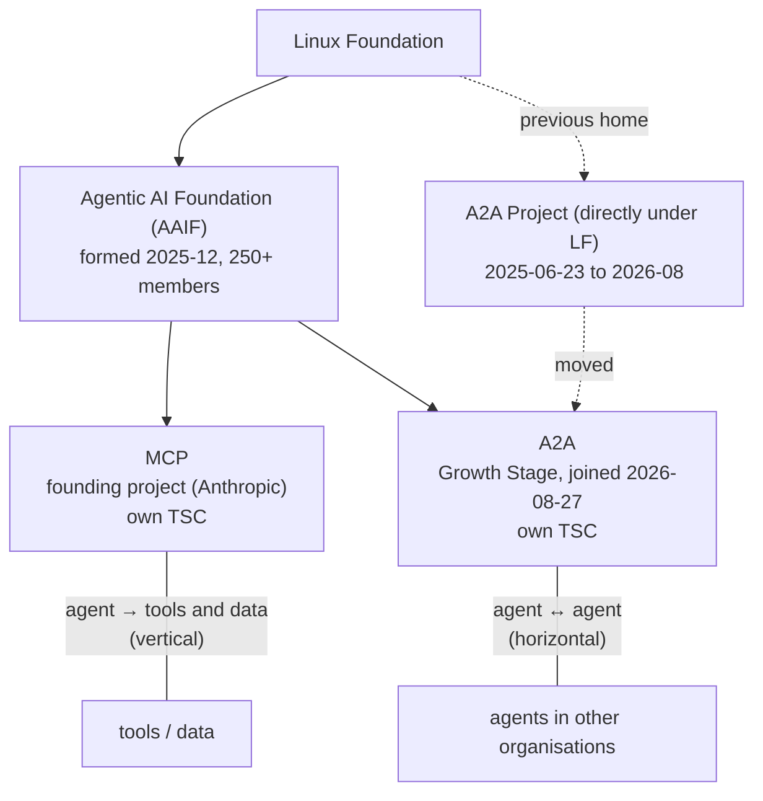

# Google A2A in depth

## Abstract

`A2A (Agent2Agent)`, announced by Google on `2025-04-09`, is an open protocol for interoperability between independent agent systems, and it was transferred to a Linux Foundation project on `2025-06-23`.[^s01][^s02] As of the `2026-09-22` re-verification the latest official specification is still `1.0.1` (a patch, 2026-05-28), and on 27 August 2026 A2A became a Growth Stage project of the Agentic AI Foundation (AAIF), the Linux Foundation body that already hosts MCP.[^s28][^s30] The protocol is organized around discovery (`Agent Card`), stateful work units (`Task`), outputs (`Artifact`), multimodal content parts (`Part`), and three bindings: JSON-RPC, HTTP+JSON/REST, and gRPC.[^s03] The important point is that A2A is not "tool calling for agents." It is a protocol for independently operated agents to advertise capabilities, run long-lived work, and exchange status via streaming or push notifications.[^s01][^s03]

What is clearer in this revision is that A2A is no longer just an idea on paper. The Linux Foundation said on `2026-04-09` that A2A had more than 150 supporting organizations, major cloud integrations, and active production deployments; AWS now documents A2A server deployment in AgentCore Runtime, and Microsoft documents A2A connectivity in Foundry Agent Service.[^s15][^s16][^s17] But much of that public adoption evidence is still project-hosted or vendor-hosted rather than independent long-form postmortem material. So the right reading is not "A2A is still purely experimental," but also not "A2A is already a fully settled universal operating standard."[^s15][^s17][^s26]

In practice, A2A is more demanding than it first appears. A production implementation needs at least an `Agent Card`, auth declarations, a `Task` store, a task state machine, artifact persistence, SSE streaming, cancellation, observability, and API management.[^s05][^s12][^s13] The April revision's versioning caveat, "spec at 1.0, SDK READMEs at 0.3", no longer applies: the Python SDK shipped nine releases from v1.0.0 (20 April) to v1.1.4 (8 September), and both it and the JS SDK now describe themselves as implementing 1.0 with 0.3 as an opt-in compatibility mode.[^s09][^s10][^s31] What is new instead is independent research: two arXiv papers fault A2A's self-declared identity, absent provenance, and missing governance primitives.[^s34][^s35] The practical conclusion is that A2A is a strong candidate for a standardized external interface between collaborating agents, but successful adoption is a production-engineering problem with uncertainty management, not a hello-world integration exercise.[^s05][^s08][^s19]

## 1. What Google A2A is, and where it stands now

According to Google's announcement, A2A is an open protocol that allows agents built by different vendors and frameworks to exchange information securely and coordinate work.[^s01] From the beginning, Google described A2A not as a replacement for MCP but as a complement to it. MCP is about giving agents access to tools and context, while A2A is about collaboration between agents.[^s01][^s06]

The governance status matters too. A2A was transferred to a Linux Foundation project on `2025-06-23`, and the official project page now shows the specification, language SDKs, samples, an inspector, and a TCK under a community-governed structure.[^s02][^s08] That means A2A should be understood not as a Google-only document, but as a protocol on an explicit standardization path with neutral governance.[^s02][^s08] That path took one more step in August 2026; §2.1 covers it.

As of `2026-04-23`, the adoption signals are also more concrete. The Linux Foundation's one-year update highlighted more than 150 supporting organizations, cross-industry production use, and Google/Microsoft/AWS platform integrations.[^s15] AWS documents A2A deployment in AgentCore Runtime with JSON-RPC and Agent Card preservation, while Microsoft documents A2A endpoint integration for Foundry Agent Service.[^s16][^s17] At the same time, some of Microsoft's A2A-related surface is still documented in a preview context, so "platform support exists" and "everything is fully hardened" are not the same claim.[^s17]

Independent coverage gives the story a slightly different tone. TechRepublic described the Linux Foundation move as the launch of a vendor-neutral hub, while Builder.io's early write-up treated A2A as promising but still "barely out of the oven."[^s27][^s26] Taken together, the public record suggests that A2A is becoming institutionalized quickly, but it still needs to be read with evidence quality in mind rather than as settled infrastructure lore.[^s15][^s26][^s27]

## 2. Ecosystem maturity and remaining uncertainty

There are real reasons to call A2A mature enough for serious evaluation. The project now combines the spec with SDKs, samples, an Inspector, and a TCK, and the Linux Foundation publicly positions the ecosystem as production-ready in multiple industries.[^s08][^s15] AWS's docs also treat A2A as an actual deployable server protocol rather than a conceptual whitepaper topic.[^s16]

But the same public record also shows why maturity needs to be qualified. The TCK structure is useful, but its public README separates mandatory compliance checks from `quality` and `features`, and explicitly says those latter categories do not block compliance in CI by default.[^s19] That is a strong signal that the ecosystem has testing discipline, but also a reminder that "passes the protocol tests" and "is production-hardened" are not identical claims.[^s19]

The Inspector tells a similar story. Its README presents it as a web-based tool for Agent Card fetching, basic compliance checks, live chat, and raw JSON-RPC debugging.[^s20] Yet a public issue says it still does not use Agent Card security schemes to perform actual A2A authentication flows.[^s24] So the tooling exists and is useful, but it does not yet eliminate all the operational work an enterprise integrator still has to do.[^s20][^s24]

Version transition and semantics were still moving in April. Public issues discuss adding client-side protocol-version fields for 0.3-to-1.0 compatibility, the Python SDK tracks 1.0 support and breaking changes in a dedicated umbrella issue, task identifier naming inconsistencies have been raised, and the Python SDK has had real handler hang bugs reported in edge cases.[^s21][^s22][^s23][^s25] Those are not signs of a fake ecosystem; they are signs of a real ecosystem still converging on operationally stable details.[^s21][^s22][^s23][^s25] Most of the SDK-side friction cleared in the following five months (§2.1).

The most accurate current reading is therefore this: A2A is no longer just a launch announcement. It is a rapidly maturing standard with governance, public tooling, and concrete platform integration.[^s08][^s15][^s16][^s17] But much of the strongest adoption evidence is still project-hosted or vendor-hosted, and independent long-form operating reports are comparatively sparse. If that distinction is ignored, a research report easily turns into ecosystem promotion instead of analysis.[^s15][^s26][^s27]

### 2.1 Re-verified 2026-09-11: what changed since April

**Governance.** Reported on 17 August and announced by the project on 27 August 2026, A2A is now a Growth Stage project of the Agentic AI Foundation (AAIF).[^s28][^s29] AAIF was formed by the Linux Foundation in December 2025 with Anthropic's MCP as a founding contribution and grew "from 49 founding members to more than 250 in less than a year".[^s29] Sharing a roof is not merging: "A2A and MCP remain distinct projects with their own technical steering committees".[^s29] In the project's own words MCP is the "vertical integration layer" from agents to internal tools and data, A2A the "horizontal protocol" for peer collaboration.[^s28] Signatories to the governance model include AWS, Anthropic, Block, Bloomberg, Cloudflare, Google, Microsoft and OpenAI.[^s29]



_Figure A — Governance as of September 2026. A2A moved from a direct Linux Foundation project into AAIF; it shares the foundation with MCP but keeps its own spec process and TSC.[^s28][^s29]_

**Specification.** Since 1.0.0 (12 March 2026) there has been one release, v1.0.1 on 28 May: prefer `application/a2a+json` in the HTTP binding, transcoding-error fixes, corrected `TaskStatus` values.[^s30] The "1.2" some blogs cite appears on neither the releases page nor the spec page. Version negotiation works through an `A2A-Version` header on every request; an empty header is interpreted as 0.3.[^s03] That default changes the advice in §7.4.

**SDKs.** The April revision's sharpest practical warning was "spec at 1.0, SDK at 0.3". It no longer holds. The Python SDK reached 1.0 on 20 April and shipped nine releases through v1.1.4 on 8 September, removing the Vertex AI Task Store, dropping the `grpcio-status` and `httpx-sse` dependencies, and adding thread-safe locking to the in-memory server.[^s31] Its README now reads "implements the A2A Protocol Specification 1.0, with compatibility mode for 0.3".[^s09] The JS SDK likewise implements 1.0; a server with `legacyCompat: { enabled: true }` accepts 0.3 clients "transparently", with caveats around `ListTasks` and push-notification routing.[^s10] The 8 September release carries one security fix: push-notification URLs are now validated both when a configuration is created and again before dispatch (SSRF hardening).[^s32] Item 3 of §7.3 has become an SDK default, which also means it was absent until September.

**Independent research.** The vendor-neutral analysis the April revision wished for now exists, twice. A threat-modelling paper (submitted February 2026, revised April) writes of A2A that "agent identity is self-declared using the Agent Card with no global uniqueness enforcement", that "OAuth2/JWT authenticates transport, but agent-card/task claims lack mandatory issuer-bound provenance", and that "there is no mandatory re-auth after capability changes".[^s34] Signed Agent Cards landed in 1.0[^s03][^s37], so part of the first point has a spec-level answer, but signing is optional and uniqueness is still unenforced. A governance paper (30 June 2026) concludes across MCP, A2A, ACP, ANP and ERC-8004 that "voting and dissent preservation are universally absent" and "deliberation is absent or at most partial".[^s35] On that reading A2A is a delegation protocol, not a collective-decision protocol, and nobody has built that layer yet.

**Extension ecosystem.** Google's anniversary post groups AP2 (payments), A2UI (user interface) and UCP (commerce) as an "A2Family".[^s37] The a2a-x402 extension for on-chain payment over AP2 is at spec v0.1 with 26 open issues and 37 pull requests.[^s36] The official extensions page lists none of these, only four samples-repo examples: timestamp, traceability, secure-passport and AGP.[^s07] Payment and UI extensions are therefore Google-led work outside the A2A project proper; this site's AP2 report covers that side.

**What did not change.** The adoption figure is still "over 150 organizations", and the source is still the project itself.[^s28] No independent operating postmortem surfaced in this pass either; the "production lesson" pieces that did surface are personal Medium posts and are not cited.


### 2.2 Re-verified 2026-09-22: the spec stood still while the SDKs and the foundation moved

Eleven days compress into one sentence: **the specification did not change by a line, and everything above and below it did.**

**Spec: still v1.0.1, but with security fixes in the queue.** The newest tag on the releases page is still v1.0.1, from 28 May 2026[^s30]. That looks like a standstill, but the repository carries 62 open pull requests, and two of them answer directly the threat-modelling critique cited in §2.1.

PR #2099 repairs the verification procedure for signed Agent Cards. As the spec stands, section 8.4.3 step 2 "instructed verifiers to retrieve the signing key using the signer-supplied `jku` header, giving the signer control over its own trust root (CWE-863)". The fix constrains key discovery to "verifier-side policy (a configured JWKS endpoint, trusted key store, or other verifier-controlled path)", with `kid` only used to select among keys already enrolled that way[^s40]. Signed Agent Cards were the headline feature of 1.0[^s03][^s37]; this says the signer could choose the trust root that signature was checked against. The sentence in the April revision about signed Agent Cards partly answering the paper's critique holds fully only once this lands.

PR #2230 goes after discovery itself, proposing to "replace the `/.well-known/agent-card.json` single-agent discovery mechanism with AI Catalog (`/.well-known/ai-catalog.json`)" on the grounds that "the single well-known URI approach only works for one agent per domain". The replacement supports "multiple agents, multiple tenants, inline Agent Card embedding via entry.data, and authenticated/per-tenant catalog endpoints at arbitrary URLs"[^s41]. This site's KYA report listed global uniqueness of agent identity as unsolved; one-agent-per-domain was a facet of that problem.

Both PRs are open. A version number unchanged for four months is not the same thing as nothing happening.

**SDKs: faster than the spec, and out of step with each other.** The JS SDK shipped v1.2.0 on 18 September, the Python SDK v1.1.5 on 21 September[^s38][^s39]. Their minor versions have diverged and each moves on its own. The JS release is twelve bug fixes, among them Extended Agent Card signature-verification caching, task state transition guards with an atomic `cancelTask`, JSON-RPC tenant request context preservation, rejection of invalid task IDs and status filters, and push-notification configuration handling[^s38]. Python's are protobuf 7 support and avoiding "out-of-range datetime task ordering"[^s39], which reads as continuing work in the same family as the `DefaultRequestHandler` hang the April revision noted.

**Foundation: A2A started being called a "founding project".** On 15 September AAIF welcomed the Gates Foundation as "the first philanthropic organization to join the Agentic AI Foundation", with Matt Vasey taking a board seat[^s43]. The boilerplate in that release is the interesting part: "With founding projects including MCP, A2A, AGENTS.md, goose, agentgateway, and Agent Router, AAIF governs the core standards and protocols"[^s43]. A month earlier, on 13 August, the same sentence read "MCP, goose, AGENTS.md, and agentgateway" with no A2A[^s42]. A2A joined in August 2026 and AAIF was formed in December 2025, so September's "founding" is inaccurate. Small, but directional: five weeks after joining, A2A is inside the foundation's description of itself.

The foundation reshaped itself in the same window. On 1 September the Governing Board and Technical Committee approved a **Sandbox** phase below Growth. Entry requires "a working implementation plus either early external interest or a credible thesis" and "a named, active maintainer", and grants "standard infrastructure only. No funding, no marketing, no scanning", with twelve months to graduate[^s44]. Growth, by contrast, requires "production use by two unaffiliated organisations, commits from two or more organisations over six months"[^s44]. That is the first time the stage A2A entered has been quantified. AAIF describes the stack as "MCP: Agent to tool connectivity" against "A2A: Agent to agent interoperability"[^s45]. Agent Router (formerly Envoy AI Gateway) also joined, so Figure A in §2.1 now sits under a fuller roster.

Membership reached 247 organisations as of 13 August, the 57 new ones including Visa, Wells Fargo and Alibaba at Gold and NHN KCP, Coocon, Galaxia Moneytree and ETRI in the financial-services and APAC cohort[^s42].

**What did not change.** The A2A project blog has published nothing since 27 August[^s28]. The adoption figure is still "over 150 organizations", still sourced to the project. No independent operating postmortem surfaced in this pass either.

## 3. Core protocol model

### 3.1 Agent Card: the starting point for discovery and contract

The first core object in A2A is the `Agent Card`. It is discovery metadata describing the agent's name, description, service URL, protocol version, capabilities, skills, and security requirements.[^s03][^s11] As the official docs emphasize, other agents use the card to determine what the agent can do, what inputs and outputs it expects, and what authentication it requires.[^s01][^s11]

In practice, the Agent Card is closer to a contract than a brochure. How you describe `skills`, `inputModes`, `outputModes`, `securityRequirements`, and transport-facing interfaces will directly affect whether clients can call the agent correctly.[^s03][^s11] For that reason, skill descriptions should read less like marketing text and more like precise interface documentation: accepted inputs, emitted outputs, authorization requirements, and failure conditions.[^s11]

### 3.2 Message, Part, and Artifact: the content model

A2A does not assume that content is a single string. In the spec, a `Part` is a container for text, file bytes, file URLs, or structured JSON data, along with MIME types and metadata.[^s03] `Message` and `Artifact` are then modeled as collections of `Part` objects.[^s03]

The implication is important. A2A was designed from the start not just for text chat, but for multimodal collaboration involving documents, images, structured payloads, and potentially richer media over time.[^s01][^s03] If an implementation is built entirely around plain strings, it will probably need a redesign later when file uploads, structured outputs, or richer UI-oriented artifacts become necessary.[^s01][^s03]

### 3.3 Task and Context: the center of stateful collaboration

The most important design difference in A2A is the `Task` model. Both Google's launch material and the latest spec describe A2A as a protocol for long-running, multi-turn interactions.[^s01][^s03] A `Task` is not just a request-response wrapper; it represents the lifecycle of work, and an `Artifact` represents the output of that work.[^s01][^s03]

The spec also uses `contextId` and `taskId` to connect follow-up messages and new work items inside the same ongoing interaction.[^s03] That is a much stronger state model than a one-shot RPC. It allows a remote research agent, for example, to ask for additional input mid-run, require more authentication, emit a partial draft first, and attach the final artifact later.[^s03][^s05]

That distinction is not always obvious in practice. Public issues have raised task identifier naming inconsistencies, and version-transition discussions have proposed additional protocol-version signaling for compatibility between 0.3 and 1.0 clients.[^s21][^s25] So it is safer to read A2A as having a strong conceptual model whose exact field-level semantics are still being refined in public.[^s21][^s25]

## 4. Transport bindings and asynchronous execution

The current spec defines three standard bindings: `JSON-RPC`, `HTTP+JSON/REST`, and `gRPC`, with the same core semantics preserved across transports.[^s03] This is a practical design choice. HTTP-family bindings fit web-service and API-gateway environments, while gRPC can fit internal high-performance systems where strongly typed contracts are more important.[^s03][^s14]

The JSON-RPC binding in the latest spec runs over HTTP and uses `Server-Sent Events` for streaming.[^s03] That means an A2A server cannot stop at synchronous replies if it wants to support long-running work. In practice, at least one of the following update paths needs to exist:

1. Polling via `Get Task`
2. SSE subscription via `message/stream` or an equivalent streaming endpoint
3. Asynchronous updates through a push-notification webhook

The official spec says that in blocking mode, a task can wait not only for terminal states but also until it reaches interrupted states such as `INPUT_REQUIRED` or `AUTH_REQUIRED`.[^s03] The enterprise docs also explain that when extra credentials are required, the system should acquire them through an external OAuth-style process and then continue the task.[^s05] A2A is therefore better understood as "an interface for advancing work until it completes or interrupts" rather than "an API that returns one final answer immediately."[^s03][^s05]

That directly affects implementation scope. A demo may work with only `message/send`, but production systems are very likely to need `tasks/get`, `tasks/cancel`, streaming, push config, task history policies, and resume logic.[^s03][^s13][^s14]

## 5. Enterprise design points

### 5.1 Authentication and authorization

The enterprise guidance says that A2A does not carry identity inside the payload itself. Authentication is handled at the transport and HTTP layer.[^s05] At the same time, the Agent Card declares supported auth schemes via its security fields, aligning A2A with established API security practice rather than inventing a new auth protocol.[^s05][^s03]

That design is realistic, but it puts responsibility on implementers. The server must decide who the authenticated caller is, which skills that caller may invoke, and whether downstream data access is allowed.[^s05] The official enterprise docs explicitly recommend least privilege and skill-level access control.[^s05] In other words, an A2A server should be treated like a real API surface with a full authorization layer, not like a thin wrapper around an LLM prompt endpoint.[^s05]

### 5.2 Discovery strategy

The discovery docs describe three representative patterns: a well-known Agent Card URL, a centralized registry, and direct configuration.[^s04] For public internet services or environments with strong URL conventions, the `/.well-known/agent-card.json` pattern is simple and effective.[^s04] In larger enterprise or marketplace settings, though, registries matter more because they make it possible to search agents by skill, tag, security requirement, version, and similar metadata.[^s04]

Operationally, direct configuration is fast when the number of partners is small, but once the number of agents grows it becomes difficult to maintain governance and onboarding without a registry. That does not mean a team needs a complete central catalog on day one, but it is wise to separate Agent Card validation and registration as explicit components early.[^s04][^s05]

### 5.3 Observability, audit, and API management

The enterprise docs emphasize that because A2A is HTTP-based, it fits naturally with OpenTelemetry, standard logging, metrics, and API-management infrastructure.[^s05] They also recommend logging `taskId`, `sessionId`, correlation IDs, and trace context.[^s05] This is critical because failures in A2A systems rarely look like a single request error; they usually look like "somewhere in the multi-agent workflow, some task stopped progressing, and nobody knows where."[^s05]

For that reason, production systems should prioritize `task lifecycle telemetry` over generic application logging. At minimum, the system should make it easy to observe transitions like `created -> working -> input_required/auth_required -> completed/failed/canceled/rejected`, plus artifact emission events.[^s03][^s05]

### 5.4 Extensions and compatibility

The official extensions docs explain that an A2A extension can add new data, requirements, RPC methods, or state machines.[^s07] They also make it clear that extensions should not casually fragment or replace the core protocol.[^s07] This matters because if each team starts by inventing its own required extensions, the interoperability benefit of A2A disappears quickly.[^s07]

The safer strategy is to confirm first that the core protocol is insufficient, and only then add narrowly scoped metadata or formal extensions.[^s07] This matters especially in regulated or industry-specific environments where teams are tempted to encode policy directly into protocol shape. When extensions are unavoidable, the `required` surface should stay as small as possible.[^s07]

## 6. Technical implementation examples

The examples in this section are reference-style implementations reconstructed from the official Python and JavaScript SDKs and tutorials.[^s09][^s10][^s12][^s13] The core idea is consistent across them: expose the external contract through an `Agent Card`, put domain logic in an `AgentExecutor`, and let a `DefaultRequestHandler` coordinate standard A2A methods and task storage.[^s10][^s12][^s13]

### 6.1 Minimal Python server structure

```python
from a2a.types import AgentCard, AgentSkill
from a2a.server.request_handlers import DefaultRequestHandler
from a2a.server.tasks import InMemoryTaskStore
from my_agent import ResearchAgentExecutor

skill = AgentSkill(
    id="research",
    name="Research",
    description="Accepts research requests and produces a report",
    tags=["research", "analysis"],
    inputModes=["text/plain", "application/json"],
    outputModes=["text/plain", "application/json"]
)

card = AgentCard(
    name="Research Agent",
    description="An A2A-based research agent",
    url="https://agent.example.com/a2a",
    version="1.0.0",
    skills=[skill],
    defaultInputModes=["text/plain", "application/json"],
    defaultOutputModes=["text/plain", "application/json"],
)

executor = ResearchAgentExecutor()
task_store = InMemoryTaskStore()
handler = DefaultRequestHandler(
    agent_executor=executor,
    task_store=task_store,
)
```

The architectural point is straightforward: keep the external protocol layer separate from business logic.[^s12][^s13] The executor interprets the request and talks to internal orchestrators or workers, while the request handler owns standard method mapping and task lifecycle management.[^s12][^s13] If REST is required, the official REST handler can sit in front of the same core objects; if JSON-RPC or gRPC is preferred, the corresponding transport adapters can be used instead.[^s14][^s10]

### 6.2 Task-first implementation example

It is possible to build a stateless agent that returns only direct message responses, and that is the easiest way to get started.[^s10][^s12] But most business agents eventually involve external API calls, human approval, retrieval, or document generation. In those cases, it is better to design around Tasks from the beginning.[^s01][^s03][^s12]

For example, an agent that produces vendor-risk reports can follow this flow:

1. Receive `message/send`
2. Create a Task and immediately move it to `working`
3. Run search, collection, and analysis workers
4. Emit a draft artifact
5. If more material is needed, move to `input_required`
6. Resume with the same `taskId` and `contextId` after the caller provides additional material
7. Store final PDF or JSON artifacts and move to `completed`

This matches the task lifecycle and multi-turn continuation model in the spec.[^s03][^s12] It also makes retries, resume behavior, and auditability easier to manage.[^s05]

### 6.3 TypeScript/Express edge example

The official JavaScript SDK README shows an Express-based server that combines `AgentExecutor`, `DefaultRequestHandler`, `InMemoryTaskStore`, and transport adapters for JSON-RPC, REST, and gRPC.[^s10] In the Node.js ecosystem, that makes an architecture with "Express as the A2A edge, actual agent execution behind it" a natural fit.[^s10]

The recommended structure looks like this:

```text
internet / partner agents
        |
   API gateway / WAF
        |
   A2A edge (Express)
        |
   authn/authz middleware
        |
   request handler + task store
        |
   orchestrator / worker queue
        |
   tools, models, databases, artifact storage
```

This lines up well with the enterprise guidance around API management, tracing, and authorization.[^s05] It is also consistent with the SDK's explicit separation between request handlers and task stores, which strongly suggests a layered architecture rather than a monolithic agent process.[^s09][^s10][^s13]

## 7. Production architecture and implementation strategy

### 7.1 Recommended architecture

For production systems, it is better not to weld the A2A server directly into the LLM application. A cleaner design separates at least five layers:

1. `A2A edge`
2. `authn/authz and policy`
3. `task orchestration`
4. `worker/tool execution`
5. `artifact and audit storage`

This architecture is the practical synthesis of the enterprise guidance around HTTP-layer auth, tracing, audit, and API management, combined with the SDK's separation of executors, request handlers, and task stores.[^s05][^s09][^s10][^s13] It lets A2A own the external contract and state machine while keeping internal toolchains and model orchestration replaceable.

### 7.2 Data-model strategy

At minimum, the persistence layer should retain:

1. `taskId`, `contextId`, tenant, and caller identity
2. Current state plus state-transition history
3. Request messages and a summarized history
4. Artifact metadata and a reference to the actual blob
5. Push-notification configuration
6. Trace IDs, correlation IDs, and audit events

This is a direct operational interpretation of the spec's task/context/artifact model plus the enterprise observability requirements.[^s03][^s05] In particular, whether artifact bodies live directly in a database or only as object-storage references should be treated as an explicit design decision driven by data size and compliance needs.[^s03][^s05]

### 7.3 Security strategy

The most important security principle is that everything coming from a remote agent must be treated as untrusted input. Because Message and Artifact parts can contain text, files, URLs, and structured JSON, teams need to defend not only against prompt injection but also schema abuse, oversized payloads, malicious URLs, and content-type spoofing.[^s03][^s05][^s07]

Recommended guardrails include:

1. Agent Card schema validation and allowlisting
2. Media-type and size limits
3. Sandboxed URL fetching
4. Skill-level authorization boundaries
5. Signature- or registry-based trust assignment
6. Validation for extension-provided inputs

Extensions deserve special attention. Because they can open new methods and states, they need the same authn and authz enforcement as core methods.[^s07]

Since September 2026 the Python SDK performs item 3 by default for push-notification URLs (v1.1.4, SSRF hardening).[^s32] Anything older has to do it itself. The gaps the independent threat model names, self-declared Agent Cards, optional provenance, no forced re-auth after capability changes[^s34], are for the deployer to close, not the spec. Shared governance does not close them either: "once a compromised or sloppy agent hands a task to the next one, downstream agents often treat that payload as trusted"[^s33] is a deployment-design problem, not a protocol one. Item 5 maps onto 1.0's signed Agent Cards, which achieve nothing unless a failed signature check blocks.[^s03]

### 7.4 Versioning strategy

In April the problem was "spec at 1.0, SDK at 0.3". In September the SDKs implement 1.0[^s09][^s10][^s31] and the risk has moved to the default: per spec, an empty `A2A-Version` header means 0.3 semantics.[^s03] A client that forgets the header silently takes the legacy path, and both SDKs' 0.3 compatibility modes carry the `ListTasks` and push-routing caveats.[^s10] A safe policy is:

1. Clients always send `A2A-Version`; servers decide by policy whether to accept an empty header
2. Automate transport-level compatibility tests
3. Cross-check Agent Card and server version values in CI
4. Publish the validated version matrix in partner-onboarding docs

If this is skipped, systems that look superficially like "A2A servers" can still break on method names, field names, enum handling, or transport behavior.[^s03][^s09][^s10]

### 7.5 Staged implementation strategy

The most realistic rollout sequence is:

1. First release with `JSON-RPC + direct config + polling`
2. Add task persistence and cancellation
3. Add SSE streaming
4. Add webhook-based push notifications
5. Add registry-based discovery
6. Introduce extensions only if strictly necessary

This does not reject the broader feature set in the spec. It is simply the lower-risk adoption order.[^s03][^s04][^s07] Trying to ship registry discovery, custom extensions, push, and a full multi-tenant policy engine all at once is more likely to create operational failure before interoperability value is realized.[^s04][^s05][^s07]

## 8. When to use A2A, and when not to

A2A is most compelling when two conditions are both true: the other side is a remote independent service, and the collaboration is stateful.[^s03][^s06] Partner agents, cross-organization approval flows, long-running research, document generation, and workflows with human approval all fit well.[^s01][^s03]

By contrast, if the problem is only local sub-agent calls inside one process, simple function execution, or tool and resource access standardization, MCP or internal orchestration may be enough.[^s06] The official docs explicitly describe A2A and MCP as complementary.[^s01][^s06] The right question is therefore not "Should we use A2A because it is new?" but "Are we solving an external agent-collaboration problem, or an internal tool-connection problem?"[^s06]

## Limitations

This report is based on public materials, so it does not directly verify private enterprise deployment data such as real SLA performance, incident rates, or internal operating procedures. In particular, at the `2026-09-22` re-verification the adoption figure ("over 150") is still the project's own[^s28], and many of the strongest adoption signals are still Linux Foundation or platform-vendor statements, so they should not be treated as equivalent to an independent audit record.[^s15][^s16][^s17] The same applies to maturity signals from the TCK, Inspector, SDKs, and issue tracker: they are valuable, but they only expose the public surface of the ecosystem.[^s19][^s20][^s21][^s22][^s23][^s24][^s25]

The result is that this report evaluates A2A as a protocol that is serious enough for production-minded evaluation, but some conclusions still need to be read as `early signal` or `vendor-stated` rather than settled industry fact. The relative lack of independent long-form operating reports and failure postmortems remains a meaningful limitation.[^s15][^s26][^s27] The September pass added two independent academic analyses[^s34][^s35] but still no operating postmortem. The 22 September pass leans on two open pull requests (#2099, #2230); those are unmerged proposals and should be read as work in flight, not as a description of the current specification. The Forbes and Axios originals on the AAIF move returned 403; the Yahoo Tech syndication and the project announcement stand in.

## Conclusion

Google A2A is one of the strongest current candidates for agent interoperability. The official spec has sat at `1.0.1` for four months, since August 2026 the project has been under the same foundation as MCP (AAIF), and the SDKs now run ahead of it on diverging tracks.[^s28][^s30][^s36][^s37] With the additional 2026 platform-integration and production-use signals, it has clearly moved beyond the stage of being only a launch-paper idea.[^s15][^s16][^s17] In particular, the combination of `Agent Card + Task + Artifact + multi-binding` models stateful collaboration far better than simple tool invocation.[^s01][^s03]

But implementation success depends more on system design and evidence discipline than on protocol familiarity. Authentication and authorization need to live at the HTTP and skill-policy layer, task and artifact storage should be treated as first-class infrastructure, streaming and push should be chosen to fit operations, and version compatibility has to be tested continuously.[^s05][^s09][^s10][^s13][^s14] At the same time, stronger public adoption signals do not mean that semantics, tooling quality, and operating practice are already fully settled.[^s19][^s20][^s21][^s22][^s23][^s24][^s25] The most defensible practical strategy is to start small while building the task state machine and operational layer correctly from day one and re-checking ecosystem maturity as you go.[^s03][^s05][^s15]
