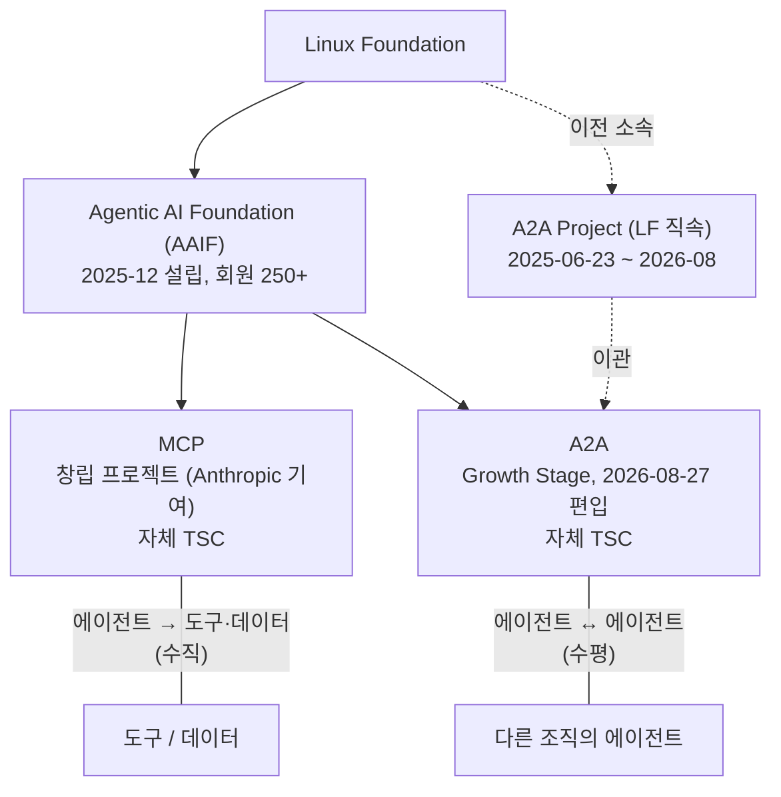

# Google A2A 상세 리서치와 구현 전략

## 초록

Google이 `2025-04-09`에 발표한 `A2A(Agent2Agent)`는 독립적인 에이전트 시스템 사이의 상호운용을 위한 공개 프로토콜이며, `2025-06-23`에는 Linux Foundation 프로젝트로 이관되었다.[^s01][^s02] `2026-09-11` 재검증 기준 최신 공식 스펙은 `1.0.1`(2026-05-28, 패치)이고, 2026년 8월 27일 A2A는 MCP가 이미 속해 있던 Linux Foundation 산하 Agentic AI Foundation(AAIF)에 Growth Stage 프로젝트로 편입됐다.[^s28][^s30] 스펙은 프로토콜은 발견(`Agent Card`), 상태ful 작업(`Task`), 결과물(`Artifact`), 다중 모달 파트(`Part`), 그리고 JSON-RPC·HTTP+JSON/REST·gRPC 바인딩을 중심으로 구성된다.[^s03] 핵심은 "에이전트를 도구처럼 호출"하는 것이 아니라, 서로 독립적으로 운영되는 에이전트가 기능을 광고하고, 장기 작업을 수행하며, 스트리밍이나 푸시 알림으로 상태를 교환하게 만드는 데 있다.[^s01][^s03]

이번 개정에서 분명해진 점은 A2A가 더 이상 단순한 아이디어 단계에 머물지 않는다는 것이다. Linux Foundation은 `2026-04-09` 기준으로 150개 이상 조직의 지지, 주요 클라우드 플랫폼 통합, 복수 산업에서의 production use를 발표했고, AWS는 AgentCore Runtime에서 A2A 서버 배포 가이드를 공개했으며, Microsoft도 Foundry Agent Service의 A2A 연결 문서를 제공하고 있다.[^s15][^s16][^s17] 다만 이 채택 신호의 상당수는 여전히 프로젝트 또는 벤더가 직접 발표한 자료이며, 공개된 독립 postmortem은 많지 않다. 따라서 A2A의 현재 위치는 "초기 실험"보다는 훨씬 앞서 있지만, 완전히 굳은 범용 운영 표준으로 단정하기에는 아직 이르다.[^s15][^s17][^s26]

실무적으로 A2A는 개념적으로 단순해 보여도 구현 난이도가 낮지 않다. 최소한 `Agent Card`, 인증 선언, `Task` 저장소, 상태기계, 아티팩트 저장, SSE 스트리밍, 취소 처리, 관측성, API 관리까지 함께 설계해야 한다.[^s05][^s12][^s13] 4월 개정판이 지적했던 "스펙은 1.0인데 SDK README는 0.3"이라는 불일치는 해소됐다. Python SDK는 4월 20일 v1.0.0 이후 9월 8일 v1.1.4까지 아홉 번 릴리스됐고, JS SDK와 함께 이제 "1.0을 구현하며 0.3은 옵트인 호환 모드"로 설명한다.[^s09][^s10][^s31] 대신 새로 등장한 것은 독립 연구다. 두 편의 arXiv 논문이 A2A의 신원 자기선언, 출처 증명 부재, 거버넌스 프리미티브 부재를 지적한다.[^s34][^s35] 결론적으로 A2A는 "멀티 에이전트 협업의 표준 외부 인터페이스"로는 매우 유망하지만, 프로덕션 도입은 `hello world` 수준 예제를 넘어 운영 설계와 불확실성 관리까지 포함한 제품 엔지니어링 문제로 접근해야 한다.[^s05][^s08][^s19]

## 1. Google A2A는 무엇이며 현재 어디까지 왔나

Google의 발표에 따르면 A2A는 서로 다른 벤더와 프레임워크로 구현된 에이전트가 안전하게 정보를 교환하고 작업을 조정할 수 있도록 만든 공개 프로토콜이다.[^s01] 발표 시점부터 Google은 A2A를 MCP의 대체재가 아니라 보완재로 설명했다. MCP가 에이전트에 도구와 컨텍스트를 제공하는 문제를 다룬다면, A2A는 에이전트와 에이전트 사이의 협업을 다룬다는 구분이다.[^s01][^s06]

프로젝트의 제도적 상태도 중요하다. A2A는 `2025-06-23`에 Linux Foundation 프로젝트로 이관되었고, 공식 프로젝트 페이지는 현재 스펙, 여러 언어 SDK, 샘플, 인스펙터, TCK를 함께 운영하는 구조를 보여준다.[^s02][^s08] 이 점은 A2A가 단순한 Google 단독 문서가 아니라, 커뮤니티 운영과 중립 거버넌스를 전제로 한 표준화 경로에 들어섰다는 의미다.[^s02][^s08] 그 경로는 2026년 8월에 한 단계 더 갔다. §2.1이 다룬다.

`2026-04-23` 시점에는 채택 신호도 더 구체적이다. Linux Foundation은 1년 시점 업데이트에서 150개 이상 조직의 지지, 다수 산업의 production use, 그리고 Google·Microsoft·AWS 플랫폼 통합을 강조했다.[^s15] 이 가운데 AWS는 A2A 서버를 AgentCore Runtime에 배포하는 실문서와 JSON-RPC 예시를 제공하고, Microsoft는 Foundry Agent Service에서 A2A endpoint를 연결하는 문서를 공개했다.[^s16][^s17] 다만 Microsoft 문서 맥락에는 preview 성격의 surface도 포함되어 있어, "플랫폼에 문서가 존재한다"와 "기능이 완전히 안정적이다"는 같은 뜻이 아니다.[^s17]

독립적 해석을 보면 톤도 조금 다르다. TechRepublic는 Linux Foundation 이관을 "vendor-neutral hub"의 출범으로 정리했고, Builder.io는 2025년 시점에 A2A를 유망하지만 아직 "barely out of the oven"인 표준으로 묘사했다.[^s27][^s26] 즉 공개 기록 전체를 합쳐 보면 A2A는 분명 빠르게 제도화되고 있지만, 아직 증거의 종류와 무게를 구분해서 읽어야 하는 주제다.[^s15][^s26][^s27]

## 2. 생태계 성숙도와 아직 남은 불확실성

현재 A2A의 성숙도를 긍정적으로 볼 근거는 분명 존재한다. 공식 프로젝트는 스펙뿐 아니라 SDK, 샘플, Inspector, TCK를 함께 운영하고 있고, Linux Foundation은 `1.0` 릴리스와 production-ready positioning을 공개적으로 내세우고 있다.[^s08][^s15] AWS 문서 역시 A2A를 단순 소개가 아니라 실제 배포 가능한 서버 프로토콜로 다루며, 인증, Agent Card, JSON-RPC, 포트/마운트 경로까지 구체적으로 설명한다.[^s16]

하지만 같은 공개 자료를 더 가까이 보면 "성숙"의 의미를 세분화할 필요가 있다. 공식 TCK는 compliance를 구조화해 주지만, 공개 README 기준으로 `quality`와 `features` 범주는 기본적으로 CI 차단 조건이 아니라 informational 항목이다.[^s19] 이는 A2A가 테스트 도구를 갖췄다는 강한 신호이면서도, 동시에 "규격 적합성"과 "운영 강건성"이 아직 동일하게 취급되지 않는다는 뜻이다.[^s19]

Inspector도 비슷하다. 공개 README는 Agent Card 확인, basic spec-compliance checks, live chat, raw JSON-RPC debug console을 제공한다고 설명한다.[^s20] 그러나 별도 공개 이슈에서는 Inspector가 Agent Card의 security schemes를 이용한 실제 인증 흐름을 아직 구현하지 못했다고 적고 있다.[^s24] 다시 말해 도구가 존재한다는 사실과 도구가 production-hardening까지 포괄한다는 사실은 다르다.[^s20][^s24]

버전 전이와 의미론은 4월 시점에 움직이고 있었다. A2A 본 저장소 이슈에는 1.0 전환을 위해 client-side protocol versioning을 payload에 넣자는 논의가 있었고, Python SDK는 1.0 지원과 SDK breaking changes를 `1.0-dev` 브랜치에서 진행한 umbrella issue를 별도로 두었다.[^s21][^s22] 또 별도 이슈에서는 `task.id` 명명 불일치가 지적됐고, Python SDK에서는 `DefaultRequestHandler` hang 버그가 실제로 보고되었다.[^s23][^s25] 이런 흔적은 A2A가 실사용 국면으로 들어섰다는 증거이기도 하지만, 구현자가 사양 텍스트만 읽고 "세부 의미론까지 완전히 굳었다"고 가정하면 위험하다는 뜻이기도 하다.[^s21][^s22][^s23][^s25] 이 가운데 SDK 쪽 마찰은 5개월 사이 대부분 정리됐다(§2.1).

따라서 현재 시점의 가장 정확한 평가는 이렇다. A2A는 더 이상 단순 발표 문서가 아니고, 공개 도구체인과 플랫폼 통합, 공식 거버넌스를 갖춘 빠르게 성숙 중인 표준이다.[^s08][^s15][^s16][^s17] 다만 공개된 채택 증거의 상당수는 여전히 프로젝트나 벤더가 주도해 공개한 것이며, 독립적 장문 운영 사례와 실패 분석은 상대적으로 적다. 이 한계를 무시하면 문서는 쉽게 "사양 요약"이 아니라 "생태계 홍보" 쪽으로 기운다.[^s15][^s26][^s27]

### 2.1 2026-09-11 재검증: 4월 이후 무엇이 바뀌었나

**거버넌스.** 2026년 8월 17일 보도, 8월 27일 프로젝트 공지로 A2A는 Agentic AI Foundation(AAIF)의 Growth Stage 프로젝트가 됐다.[^s28][^s29] AAIF는 2025년 12월 Linux Foundation이 Anthropic의 MCP를 창립 기여로 받아 만든 재단으로, 창립 회원 49곳에서 1년이 안 돼 250곳 이상으로 늘었다.[^s29] 두 프로토콜이 한 지붕 아래 들어갔지만 합쳐진 것은 아니다. "A2A와 MCP는 각자의 기술 운영 위원회를 가진 별개 프로젝트로 남는다"[^s29]. 프로젝트 공지의 표현으로는 MCP가 에이전트를 내부 도구·데이터에 잇는 "수직 통합 계층", A2A가 에이전트 간 협업의 "수평 프로토콜"이다.[^s28] 거버넌스 모델 서명자에는 AWS, Anthropic, Block, Bloomberg, Cloudflare, Google, Microsoft, OpenAI가 있다.[^s29]



_그림 A — 2026년 9월 기준 거버넌스 구조. A2A는 LF 직속 프로젝트에서 AAIF 산하로 옮겼고, MCP와 재단은 공유하되 스펙 절차와 TSC는 따로 둔다.[^s28][^s29]_

**스펙.** 1.0.0(2026-03-12) 이후 릴리스는 v1.0.1(2026-05-28) 하나다. HTTP 바인딩에서 `application/a2a+json`을 우선하고, 트랜스코딩 오류와 `TaskStatus` 값을 바로잡은 패치다.[^s30] 일부 블로그가 말하는 "1.2"는 공식 릴리스 페이지와 스펙 페이지 어디에도 없다. 스펙의 버전 협상은 요청마다 `A2A-Version` 헤더를 보내는 방식이고, 헤더가 비어 있으면 0.3으로 해석된다.[^s03] 이 기본값은 §7.4의 권고를 바꾼다.

**SDK.** 4월 개정판의 가장 큰 실무적 경고는 "스펙은 1.0인데 SDK는 0.3"이었다. 이제 해당하지 않는다. Python SDK는 4월 20일 v1.0.0으로 1.0에 도달한 뒤 5개월 동안 v1.1.4(9월 8일)까지 아홉 번 릴리스됐고, 그 사이 Vertex AI Task Store 제거, `grpcio-status`·`httpx-sse` 의존성 제거, 인메모리 서버의 스레드 안전 잠금이 들어갔다.[^s31] README는 "1.0을 구현하며 0.3 호환 모드를 제공한다"로 바뀌었다.[^s09] JS SDK도 "1.0 구현"이며, 0.3 클라이언트는 `legacyCompat: { enabled: true }`를 켠 서버가 "투명하게" 받되 `ListTasks` 등 일부 메서드와 푸시 알림 라우팅에 차이가 있다.[^s10] 9월 8일 릴리스에는 보안 수정이 하나 있다. 푸시 알림 URL을 설정 생성 시점과 발송 직전 두 번 검증하는 SSRF 강화다.[^s32] §7.3의 "malicious URL" 항목이 SDK 기본값으로 내려온 셈이지만, 4월까지는 그 검증이 없었다는 뜻이기도 하다.

**독립 연구.** 4월 개정판이 아쉬워한 "벤더 중립 분석"이 두 편 나왔다. 보안 위협 모델링 논문(2026-02 제출, 04 개정)은 A2A에 대해 "에이전트 신원이 Agent Card로 자기 선언되며 전역 유일성 강제가 없다", "OAuth2/JWT는 전송을 인증하지만 Agent Card와 Task 주장에는 발급자 귀속 출처 증명이 의무가 아니다", "능력 변경 후 재인증이 의무가 아니다"라고 적는다.[^s34] 서명된 Agent Card는 1.0에 들어갔으므로[^s03][^s37] 첫 지적의 일부는 스펙 차원에서 답이 있지만, 서명이 선택이고 유일성 강제가 없다는 점은 그대로다. 거버넌스 논문(2026-06-30)은 MCP, A2A, ACP, ANP, ERC-8004 다섯 프로토콜 모두에서 "투표와 반대 의견 보존이 보편적으로 부재"하고 "숙의는 없거나 기껏해야 부분적"이라고 결론짓는다.[^s35] 이 논문의 관점에서 A2A는 위임 프로토콜이지 집단 의사결정 프로토콜이 아니며, 그 계층은 아직 누구도 만들지 않았다.

**확장 생태계.** Google은 1주년 글에서 AP2(결제), A2UI(사용자 인터페이스), UCP(커머스)를 "A2Family"로 묶었다.[^s37] AP2 위에서 온체인 결제를 다루는 a2a-x402 확장은 spec v0.1 단계이며 열린 이슈 26건, PR 37건이 걸려 있다.[^s36] 공식 확장 문서는 이들을 등재하지 않고 samples 저장소의 timestamp, traceability, secure-passport, AGP 네 가지만 예시로 든다.[^s07] 즉 결제·UI 확장은 A2A 프로젝트 밖에서 Google 주도로 진행 중이고, 이 사이트의 AP2 보고서가 그 쪽을 다룬다.

**바뀌지 않은 것.** 채택 수치는 여전히 "150개 이상 조직"이고 출처는 프로젝트 자신이다.[^s28] 독립적인 운영 postmortem은 이번 검색에서도 찾지 못했다. 검색에 걸린 "실전 교훈" 글은 Medium 개인 포스트 수준이라 인용하지 않았다.

## 3. 프로토콜 핵심 모델

### 3.1 Agent Card: 발견과 계약의 시작점

A2A의 첫 번째 핵심 객체는 `Agent Card`다. Agent Card는 에이전트의 이름, 설명, 서비스 URL, 프로토콜 버전, capabilities, skills, 보안 요구사항을 기술하는 발견용 메타데이터다.[^s03][^s11] 공식 문서가 강조하듯이, 다른 에이전트는 이 카드를 보고 "이 에이전트가 무엇을 할 수 있는지", "어떤 입력/출력을 받는지", "어떤 인증이 필요한지"를 판단한다.[^s01][^s11]

실무적으로 Agent Card는 단순한 소개 문서가 아니라 계약서에 가깝다. 특히 `skills`, `inputModes`, `outputModes`, `securityRequirements`, transport 인터페이스를 어떻게 기술하느냐에 따라 클라이언트가 에이전트를 잘못 호출할지 여부가 결정된다.[^s03][^s11] 따라서 스킬 설명은 마케팅 문구보다 "입력 형식, 출력 형식, 권한 요구, 실패 조건"을 정확히 드러내는 방식으로 설계하는 편이 좋다.[^s11]

### 3.2 Message, Part, Artifact: 콘텐츠 모델

A2A는 메시지를 단일 문자열로 가정하지 않는다. 스펙에서 `Part`는 텍스트, 파일 바이트, 파일 URL, 구조화 JSON 데이터 중 하나를 담는 컨테이너이며, MIME 타입과 메타데이터를 함께 가진다.[^s03] 그 위에 `Message`와 `Artifact`가 `Part`의 집합으로 구성된다.[^s03]

이 설계의 의미는 명확하다. A2A는 처음부터 "텍스트 챗"만을 대상으로 만든 프로토콜이 아니라, 문서, 이미지, 구조화 데이터, 향후 오디오/비디오 같은 다양한 매체를 교환하는 멀티모달 협업 인터페이스를 겨냥한다.[^s01][^s03] 따라서 구현 시에도 내부 애플리케이션을 문자열 기반으로만 설계하면 나중에 파일 업로드, 구조화 결과, UI 위젯 연동에서 다시 뜯어고치게 될 가능성이 높다.[^s01][^s03]

### 3.3 Task와 Context: 상태ful 협업의 중심

A2A의 가장 중요한 차별점은 `Task` 중심 모델이다. Google의 초기 발표와 최신 스펙은 모두 A2A를 장기 실행과 멀티턴 상호작용을 지원하는 프로토콜로 설명한다.[^s01][^s03] `Task`는 단순 요청-응답이 아니라 작업 단위의 생명주기를 표현하고, `Artifact`는 그 작업의 산출물이다.[^s01][^s03]

또한 스펙은 `contextId`와 `taskId`를 통해 같은 대화 맥락 안에서 후속 메시지와 새 작업을 연결할 수 있게 한다.[^s03] 이는 "한 번 호출하고 끝나는 RPC"보다 훨씬 강한 상태 모델이다. 예를 들어 원격 리서치 에이전트가 초안 작성 도중 추가 입력을 요구하거나, 인증이 더 필요하거나, 일부 결과만 먼저 내보내고 나중에 최종 산출물을 추가하는 흐름을 자연스럽게 표현할 수 있다.[^s03][^s05]

다만 이 구분은 구현자에게 항상 자명하지 않다. 공개 이슈에서는 `task.id` 명명과 `contextId`/`messageId` 관례의 불일치가 지적됐고, 1.0 전이 과정에서도 client-side versioning이 별도 논의 주제가 되었다.[^s21][^s25] 따라서 A2A를 읽을 때는 "개념 모델이 좋다"와 "필드 의미론이 완전히 고정됐다"를 같은 말로 받아들이지 않는 편이 안전하다.[^s21][^s25]

## 4. 전송 바인딩과 비동기 실행 모델

스펙 최신본은 A2A가 세 가지 표준 바인딩을 제공한다고 설명한다. `JSON-RPC`, `HTTP+JSON/REST`, `gRPC`가 그것이며, 핵심 의미론은 transport가 달라도 유지된다.[^s03] 이 구조는 매우 실용적이다. 사내 웹 서비스와 API 게이트웨이 환경에서는 HTTP 계열 바인딩이 자연스럽고, 고성능 내부 통신이나 strongly typed 계약이 중요하면 gRPC를 사용할 수 있기 때문이다.[^s03][^s14]

특히 최신 스펙의 JSON-RPC 바인딩은 HTTP 위에서 JSON-RPC 2.0을 사용하고, 스트리밍은 `Server-Sent Events`로 제공한다고 명시한다.[^s03] 이 점 때문에 A2A 서버는 동기 응답만 구현해서는 충분하지 않다. 장기 작업을 지원하려면 적어도 다음 세 가지 업데이트 경로 중 하나 이상을 설계해야 한다.

1. `Get Task` 기반 polling
2. `message/stream` 또는 동등한 streaming endpoint 기반 SSE 구독
3. push notification webhook 기반 비동기 업데이트

공식 스펙은 blocking 모드에서 작업이 terminal state뿐 아니라 interrupted state(`INPUT_REQUIRED`, `AUTH_REQUIRED`)에 도달할 때까지 기다릴 수 있다고 설명한다.[^s03] 또 enterprise 문서는 추가 자격증명이 필요한 경우 A2A 바깥의 OAuth 같은 절차로 secondary credential을 획득한 뒤 작업을 계속하라고 안내한다.[^s05] 즉 A2A는 "한 번의 요청에 답을 반환"하는 인터페이스라기보다, "작업이 중단되거나 완료될 때까지 상태를 진전시키는 인터페이스"로 이해해야 한다.[^s03][^s05]

이 특성은 설계에 직접 영향을 준다. `message/send`만 구현하고 끝내면 demo는 가능하지만, 프로덕션에서는 결국 `tasks/get`, `tasks/cancel`, streaming, push config, history length, task resume 정책까지 필요해질 가능성이 높다.[^s03][^s13][^s14]

## 5. 엔터프라이즈 설계 포인트

### 5.1 인증과 권한

엔터프라이즈 문서는 A2A payload 자체에 신원을 싣지 않고, 인증은 transport/HTTP 계층에서 처리한다고 명시한다.[^s05] 동시에 Agent Card는 `security` 필드로 자신이 지원하는 인증 scheme을 선언하며, 이 구조는 OpenAPI의 인증 모델과 정렬된다.[^s05][^s03] 다시 말해 A2A는 자체 인증 프로토콜을 새로 만들기보다, 기존 HTTP 보안 관행 위에 올라탄다.

이 설계는 현실적이지만, 구현자에게 책임을 미룬다. 서버는 인증된 주체가 누구인지, 그 주체가 어떤 skill을 호출할 수 있는지, 백엔드 데이터 접근 권한이 있는지를 직접 판정해야 한다.[^s05] 공식 엔터프라이즈 문서는 skill 단위 권한 제어와 최소 권한 원칙을 명시적으로 권장한다.[^s05] 따라서 A2A 서버를 "프롬프트를 받는 LLM API"처럼 취급하면 안 되고, 일반 API 서버와 동일한 수준의 authorization 계층을 둬야 한다.[^s05]

### 5.2 발견 전략

공식 discovery 문서는 세 가지 대표 패턴을 제시한다. well-known URL의 Agent Card, 중앙 registry, 직접 구성이다.[^s04] 인터넷 공개 서비스나 사내 표준 URL 정책이 분명한 경우에는 `/.well-known/agent-card.json` 패턴이 단순하다.[^s04] 반면 대기업이나 마켓플레이스 환경에서는 registry가 더 중요하다. registry가 스킬, 태그, 보안 요구, 버전 같은 기준으로 에이전트를 검색 가능하게 만들기 때문이다.[^s04]

실무적으로는 파트너 수가 적은 초기 단계에는 direct configuration이 빠르지만, 에이전트 수가 늘어나면 registry 없이는 온보딩과 거버넌스가 금방 무너진다. 따라서 첫 배포부터 완전한 중앙 카탈로그를 만들 필요는 없더라도, 최소한 Agent Card 스키마 검증과 등록 절차를 별도 컴포넌트로 분리해 두는 편이 낫다.[^s04][^s05]

### 5.3 관측성, 감사, API 관리

엔터프라이즈 문서는 A2A가 HTTP 기반이기 때문에 OpenTelemetry, 표준 로깅, 메트릭, API management와 자연스럽게 통합된다고 본다.[^s05] 또한 `taskId`, `sessionId`, correlation ID, trace context를 로깅하라고 권고한다.[^s05] 이 부분은 매우 중요하다. A2A 시스템의 장애는 보통 단일 요청 실패가 아니라 "어느 에이전트가 어떤 상태에서 멈췄는지"를 모르는 상태로 나타나기 때문이다.[^s05]

따라서 프로덕션 설계에서는 애플리케이션 로그보다 `task lifecycle telemetry`를 우선 설계해야 한다. 최소한 `created -> working -> input_required/auth_required -> completed/failed/canceled/rejected` 흐름과 artifact 생성 이벤트를 추적해야 운영이 가능하다.[^s03][^s05]

### 5.4 확장과 호환성

공식 extension 문서는 A2A extension이 새 데이터, 요구사항, RPC method, 상태기계를 추가할 수 있다고 설명한다.[^s07] 그러나 동시에 core 구조를 직접 바꾸거나 enum을 함부로 깨는 식의 변경은 지양한다.[^s07] 이 원칙은 중요하다. A2A를 도입하는 팀이 초기부터 조직 고유 확장을 남발하면 상호운용성 이점이 빠르게 사라진다.[^s07]

따라서 권장 전략은 이렇다. 우선 코어 프로토콜만으로 충분한지 확인하고, 정말 필요한 경우에만 `metadata`와 공식 extension 메커니즘을 사용해 점진적으로 확장한다.[^s07] 특히 보안, 규제, 산업별 의미 체계를 넣어야 할 때는 extension의 `required` 사용 범위를 최소화하는 편이 좋다.[^s07]

## 6. 기술 구현 예시

이 섹션의 예시는 공식 Python/JavaScript SDK와 튜토리얼이 보여주는 구조를 바탕으로 재구성한 참조 구현이다.[^s09][^s10][^s12][^s13] 핵심 아이디어는 같다. `Agent Card`로 외부 계약을 선언하고, `AgentExecutor`에 비즈니스 로직을 넣고, `DefaultRequestHandler`가 표준 A2A 메서드와 task store를 조정하게 만든다.[^s10][^s12][^s13]

### 6.1 최소 Python 서버 구조

```python
from a2a.types import AgentCard, AgentSkill
from a2a.server.request_handlers import DefaultRequestHandler
from a2a.server.tasks import InMemoryTaskStore
from my_agent import ResearchAgentExecutor

skill = AgentSkill(
    id="research",
    name="Research",
    description="조사 요청을 받아 보고서를 작성한다",
    tags=["research", "analysis"],
    inputModes=["text/plain", "application/json"],
    outputModes=["text/plain", "application/json"]
)

card = AgentCard(
    name="Research Agent",
    description="A2A 기반 리서치 에이전트",
    url="https://agent.example.com/a2a",
    version="1.0.0",
    skills=[skill],
    defaultInputModes=["text/plain", "application/json"],
    defaultOutputModes=["text/plain", "application/json"],
)

executor = ResearchAgentExecutor()
task_store = InMemoryTaskStore()
handler = DefaultRequestHandler(
    agent_executor=executor,
    task_store=task_store,
)
```

이 구조가 의미하는 바는 단순하다. 외부 프로토콜 계층과 내부 업무 로직을 분리하라는 것이다.[^s12][^s13] executor는 요청을 해석하고 내부 오케스트레이터나 워커를 호출하며, request handler는 표준 메서드 매핑과 task lifecycle을 맡는다.[^s12][^s13] REST 바인딩이 필요하면 공식 REST handler를 두고, JSON-RPC나 gRPC가 필요하면 각각 대응하는 핸들러를 붙이면 된다.[^s14][^s10]

### 6.2 Task 우선 설계 예시

단기적으로는 direct message response만 반환하는 stateless 에이전트가 가장 쉽다.[^s10][^s12] 그러나 실제 업무형 에이전트는 보통 외부 API 호출, 사람 승인, 검색, 문서 생성처럼 시간이 걸리는 단계를 포함한다. 이런 경우에는 처음부터 Task 중심으로 구현하는 편이 훨씬 낫다.[^s01][^s03][^s12]

예를 들어 "벤더 리스크 리포트를 생성하는 에이전트"는 다음과 같이 동작할 수 있다.

1. `message/send` 수신
2. Task 생성 후 즉시 `working`
3. 검색/수집/분석 워커 실행
4. 중간 초안 아티팩트 생성
5. 추가 자료가 필요하면 `input_required`
6. 사용자가 보충 자료를 보내면 동일 `taskId`와 `contextId`로 재개
7. 최종 PDF/JSON 아티팩트 저장 후 `completed`

이 모델은 A2A 스펙의 task lifecycle과 multi-turn continuation 모델에 정확히 부합한다.[^s03][^s12] 또한 운영 측면에서도 재시도, resume, 감사 추적이 쉬워진다.[^s05]

### 6.3 TypeScript/Express 엣지 예시

공식 JavaScript SDK README는 Express 기반 서버에서 `AgentExecutor`, `DefaultRequestHandler`, `InMemoryTaskStore`, 그리고 JSON-RPC/REST/gRPC transport adapter를 조합하는 예시를 제공한다.[^s10] 따라서 Node.js 생태계에서는 "Express를 A2A edge로 사용하고, 실제 에이전트 실행은 별도 서비스로 분리"하는 구성이 자연스럽다.[^s10]

이 경우 권장 구조는 다음과 같다.

```text
internet / partner agents
        |
   API gateway / WAF
        |
   A2A edge (Express)
        |
   authn/authz middleware
        |
   request handler + task store
        |
   orchestrator / worker queue
        |
   tools, models, databases, artifact storage
```

이 구조는 공식 enterprise 문서의 API management, tracing, authorization 권고와 잘 맞는다.[^s05] 또한 SDK가 request handler와 task store를 명시적 구성요소로 분리해 둔 이유도 이 같은 layered architecture를 염두에 둔 것으로 해석할 수 있다.[^s09][^s10][^s13]

## 7. 실서비스 설계와 구현 전략

### 7.1 권장 아키텍처

실서비스에서는 A2A 서버를 LLM 애플리케이션 안에 직접 녹여 넣기보다 다음 다섯 계층으로 분리하는 편이 낫다.

1. `A2A edge`
2. `authn/authz and policy`
3. `task orchestration`
4. `worker/tool execution`
5. `artifact and audit storage`

이 분리는 공식 엔터프라이즈 문서의 HTTP-layer auth, tracing, audit, API management 권고와 SDK의 executor/request handler/task store 분리 구조를 조합한 실무적 귀결이다.[^s05][^s09][^s10][^s13] 이렇게 두면 A2A는 외부 계약과 상태기계에 집중하고, 내부 LLM·툴 체인은 비교적 자유롭게 교체할 수 있다.

### 7.2 데이터 모델 전략

최소한 다음 필드는 영속 저장하는 편이 좋다.

1. `taskId`, `contextId`, tenant, caller identity
2. 현재 상태와 상태 전이 이력
3. 요청 메시지와 요약된 history
4. artifact 메타데이터와 실제 blob 참조
5. push notification 설정
6. trace ID, correlation ID, 감사 이벤트

이 구조는 스펙의 task/context/artifact 모델과 enterprise observability 요구를 그대로 반영한 것이다.[^s03][^s05] 특히 artifact 본문을 DB에 그대로 넣을지, object storage URL만 저장할지는 데이터 크기와 규제 요구에 따라 분리하는 편이 일반적으로 유리하다.[^s03][^s05]

### 7.3 보안 전략

보안에서 가장 중요한 원칙은 "원격 에이전트가 보내는 모든 것"을 비신뢰 입력으로 취급하는 것이다. Message/Artifact의 Part는 텍스트뿐 아니라 파일, URL, 구조화 JSON도 담을 수 있으므로, prompt injection뿐 아니라 schema abuse, oversized payload, malicious URL, content-type spoofing까지 고려해야 한다.[^s03][^s05][^s07]

권장 방어선은 다음과 같다.

1. Agent Card 스키마 검증과 allowlist
2. media type 및 크기 제한
3. URL fetch sandbox
4. skill별 권한 분리
5. 서명 또는 registry 기반 신뢰 부여
6. extension 입력 검증

특히 extension은 새 메서드와 새 상태를 열 수 있으므로, 코어 메서드와 동일한 인증·권한 검사를 반드시 적용해야 한다는 공식 문서의 경고를 무시하면 안 된다.[^s07]

3번 항목은 2026년 9월부터 Python SDK가 푸시 알림 URL에 한해 기본으로 수행한다(v1.1.4, SSRF 강화).[^s32] 그 이전 버전을 쓰고 있다면 직접 막아야 한다. 독립 위협 모델링이 지적한 "Agent Card 자기 선언, 출처 증명 비의무, 능력 변경 후 재인증 비의무"[^s34]는 스펙이 아니라 배포자가 닫아야 할 구멍이다. 한 재단 아래 모였다고 해서 이 구멍이 닫히는 것도 아니다. "손상됐거나 부주의한 에이전트가 다음 에이전트에 작업을 넘기면, 하류 에이전트는 그 페이로드를 신뢰된 것으로 취급하는 경우가 많다"[^s33]는 지적은 프로토콜이 아니라 배포 설계의 문제다. 5번의 서명 기반 신뢰는 1.0의 서명된 Agent Card로 구현하되, 서명 검증을 실패 시 차단으로 두지 않으면 있으나 마나다.[^s03]

### 7.4 버전 전략

4월에는 "스펙은 1.0, SDK는 0.3"이 문제였다. 9월에는 SDK가 1.0을 구현하므로[^s09][^s10][^s31] 문제가 옮겨갔다. 이제 위험은 기본값이다. 스펙상 `A2A-Version` 헤더가 비어 있으면 서버는 0.3 의미론으로 처리한다.[^s03] 헤더를 빼먹은 클라이언트는 오류 없이 구버전 경로를 타고, 두 SDK의 0.3 호환 모드는 `ListTasks` 부재와 푸시 알림 라우팅 차이를 안고 있다.[^s10] 따라서 다음 원칙이 안전하다.

1. 클라이언트는 항상 `A2A-Version`을 보내고, 서버는 빈 헤더를 허용할지 정책으로 정한다.
2. transport별 호환 테스트를 자동화한다.
3. Agent Card와 서버 구현의 버전 값을 CI에서 교차 검증한다.
4. 파트너 온보딩 문서에 "검증된 버전 조합"을 명시한다.

이 과정을 건너뛰면 표면적으로는 같은 A2A 서버처럼 보여도 method 이름, field 이름, enum 처리, transport behavior 차이로 쉽게 깨질 수 있다.[^s03][^s09][^s10]

### 7.5 단계적 구현 전략

가장 현실적인 도입 순서는 다음과 같다.

1. `JSON-RPC + direct config + polling`만으로 1차 배포
2. Task persistence와 cancel 지원 추가
3. SSE streaming 추가
4. webhook push notification 추가
5. registry 기반 discovery 추가
6. 필요한 경우에만 extension 도입

이 순서는 스펙의 기능 집합을 부정하는 것이 아니라, 운영 리스크가 낮은 순서로 채택하는 전략이다.[^s03][^s04][^s07] 처음부터 discovery registry, custom extension, push, multi-tenant policy engine까지 한 번에 넣으면 구현보다 운영 실패가 먼저 올 가능성이 높다.[^s04][^s05][^s07]

## 8. 언제 A2A를 쓰고, 언제 다른 패턴을 택해야 하나

A2A는 "원격의 독립 서비스"와 "상태ful 협업"이라는 두 조건이 함께 있을 때 가장 빛난다.[^s03][^s06] 예를 들어 파트너사 에이전트, 조직 간 승인 워크플로, 장기 리서치, 문서 생성, 사람 승인 포함 프로세스는 A2A와 잘 맞는다.[^s01][^s03]

반대로 단일 프로세스 내부의 서브에이전트 호출, 단순 함수 실행, 툴/리소스 접속 표준화가 주목적이라면 MCP나 내부 orchestration만으로도 충분한 경우가 많다.[^s06] 공식 문서도 A2A와 MCP를 상보적 관계로 설명한다.[^s01][^s06] 따라서 설계 질문은 "A2A가 최신이라서 써야 하나?"가 아니라, "우리가 지금 풀려는 문제가 외부 에이전트 협업 문제인가, 아니면 내부 도구 연결 문제인가?"가 되어야 한다.[^s06]

## Limitations

본 리포트는 공개 자료를 기준으로 작성되었으므로, 비공개 enterprise deployment의 실제 SLA, 장애율, 비용, 내부 운영 프로세스는 직접 검증하지 못했다. 특히 `2026-09-11` 재검증 시점에도 채택 신호("150개 이상")의 출처는 프로젝트 자신이며[^s28], 강한 채택 신호 중 상당수는 Linux Foundation 또는 플랫폼 벤더가 직접 공개한 자료에 기반하므로, 이를 독립 감사 수준의 증거와 동일시하면 안 된다.[^s15][^s16][^s17] 또한 TCK, Inspector, SDK, 이슈 트래커를 통해 성숙도를 어느 정도 평가할 수는 있지만, 이 역시 공개 저장소에 드러난 면만 본 것이다.[^s19][^s20][^s21][^s22][^s23][^s24][^s25]

따라서 이 문서는 A2A를 "실전 검토 가능한 프로토콜"로 평가하지만, 동시에 공개 evidence의 성격을 감안해 일부 결론은 `early signal` 또는 `vendor-stated` 수준으로 읽어야 한다고 본다. 특히 독립적인 장문 운영 사례와 실패 postmortem이 아직 많지 않다는 점은 중요한 한계다.[^s15][^s26][^s27] 9월 재검증에서 독립 학술 분석은 두 편 확보했지만[^s34][^s35], 운영 postmortem은 여전히 없다. AAIF 편입 관련 Forbes·Axios 원문은 403으로 읽지 못해 Yahoo Tech 전재본과 프로젝트 공지에 의존했다.

## 결론

Google A2A는 현재 가장 유력한 에이전트 상호운용 프로토콜 후보 중 하나다. 공식 스펙은 `1.0.1`이고, 2026년 8월부터 MCP와 같은 재단(AAIF) 아래 있으며, SDK는 스펙을 따라잡았다.[^s28][^s30][^s31] 여기에 2026년 시점의 플랫폼 통합과 production-use 발표까지 더해지면서, 적어도 "문서 속 아이디어" 단계는 확실히 넘어섰다고 볼 수 있다.[^s15][^s16][^s17] 특히 `Agent Card + Task + Artifact + multi-binding` 조합은 단순 도구 호출로는 다루기 어려운 상태ful 협업 문제를 상당히 잘 모델링한다.[^s01][^s03]

다만 구현의 성공 여부는 프로토콜 이해보다 시스템 설계와 증거 해석에 달려 있다. 인증과 권한을 HTTP 계층과 skill 정책에 붙이고, task store와 artifact store를 분리하고, SSE/push/polling을 운영에 맞게 선택하고, 버전 호환성 테스트를 자동화해야 한다.[^s05][^s09][^s10][^s13][^s14] 동시에 공개 채택 신호가 강해졌다고 해서 세부 의미론, 도구 품질, 운영 관행까지 모두 안정됐다고 읽어서는 안 된다.[^s19][^s20][^s21][^s22][^s23][^s24][^s25] 실무적으로 가장 설득력 있는 전략은 "작게 시작하되, 상태기계와 운영 계층은 처음부터 제대로 만들고, 생태계 성숙도는 계속 재검증한다"는 것이다.[^s03][^s05][^s15]
