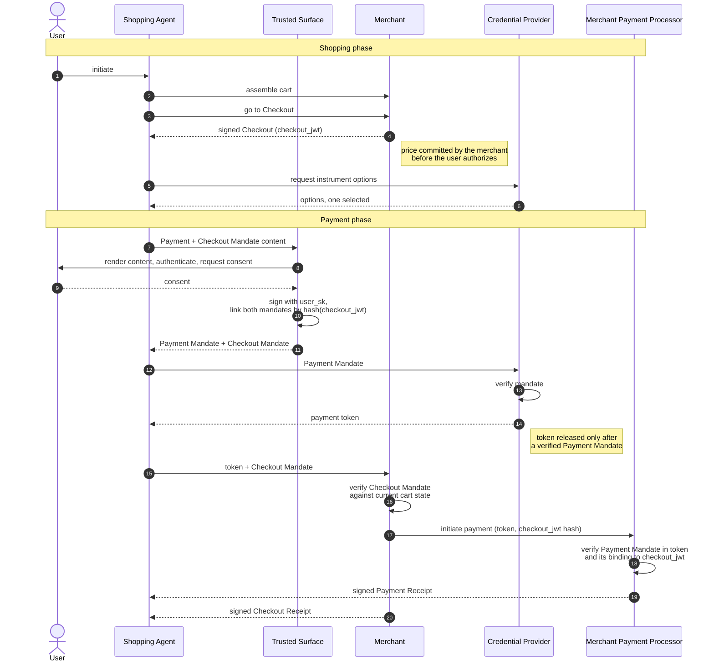

# Google AP2 v0.2 — 프로토콜 표면, 처리 플로우, 그리고 레퍼런스 코드가 실제로 강제하는 것

## 초록

AP2(Agent Payments Protocol) v0.2는 에이전트가 개시하는 결제를 위한 보안
계층이다. 돈을 옮기지 않고 상품 카탈로그를 정의하지도 않는다. AP2가 만드는 것은
"사람이 이 구매를 승인했다"는 사실에 대한 위조 탐지 가능한 증거다. 이 보고서는
v0.2 명세를 커밋 `e1ea56d` 시점의 레퍼런스 구현과 나란히 놓고 읽으며, 둘이
일치하는 지점과 어긋나는 지점을 보고한다.

먼저 세 가지를 앞세워 말해 둘 필요가 있다. 첫째, 이 프로토콜의 무게중심은
Mandate 객체가 아니라 그것이 실려 가는 **위임 체인**이다. `~~`로 이어지는
SD-JWT 체인이며, 각 홉은 앞 홉이 `cnf`로 지정한 키로 서명된다. 그리고
"Human-Present"인지 "Human-Not-Present"인지는 데이터 모델 어디에도 필드로
존재하지 않는다. 체인의 모양이 곧 모달리티다. 둘째, AP2를 작동하게 만드는
연결 고리 — `PaymentMandate.transaction_id` = `CheckoutMandate.checkout_hash` =
`checkout_jwt`의 해시 — 는 SDK에서 **기본값이 `None`인 선택적 검증 파라미터**로
구현되어 있고, 명세가 그 검사를 두 번에 걸쳐 의무화한 바로 그 역할인 Merchant
샘플은 그 파라미터를 결코 넘기지 않는다. 셋째, 명세가 "MUST be non-agentic"으로
못 박은 Trusted Surface의 레퍼런스 구현은 생체 인증이 `return true`이고 서명은
LLM이 호출하는 툴에서 일어나는 TypeScript 클래스다.

여기에 더해 Checkout JWT 서명 알고리즘을 두고 AP2 자체 문서 안에서 벌어지는
규범적 모순, 빈 허용 목록을 와일드카드로 읽는 제약 평가기, 중간 홉이
`aud`/`nonce`를 검증하지 않기 때문에 HEAD에서 실패하는 SDK 테스트 2건을
기록한다. 크립토 레일에서는 SD-JWT 세계와 EVM 세계를 잇는 도메인 간 바인딩을
추적한다. EIP-3009 `TransferWithAuthorization`의 nonce가
`keccak256(mandate chain)`으로 설정된다. 결론은 AP2가 부실하다는 것이 아니다.
설계는 일관되고 위협 모델은 드물게 정직하다. 다만 레퍼런스 코드는 적합성
레퍼런스가 아니라 프로토콜 시연물이며, 지금 그 격차는 이 위에 무언가를 만들려는
사람에게 충분히 문제가 될 만큼 넓다.

## 1. 서론

### 1.1 AP2가 스스로 규정하는 범위

AP2의 자기 규정은 좁고, 자기 경계에 관해 드물게 정확하다. 명세는 첫머리부터 이
프로토콜을 더 큰 무언가의 *안쪽*에 놓는다. "AP2는 Commerce Protocol 내부의
보안 기능으로 동작한다. Commerce Protocol의 세부 사항(예: 카탈로그 API, 체크아웃
업데이트, 각 역할 간 통신을 위한 구체적 API)은 AP2의 범위 밖이다. AP2는 Universal
Commerce Protocol(UCP)과 호환되도록 명시적으로 설계되었으며 매끄럽게
통합된다."[^s01]

이 경계는 실재하며 상호적이다. UCP는 기본 `dev.ucp.shopping.checkout` 역량을
확장하는 `dev.ucp.shopping.ap2_mandate` 역량 확장을 정의한다. 일단 협상되면
"세션은 Security Locked" 상태가 되고, 사업자는 "체크아웃 응답 본문의
`ap2.merchant_authorization`에 서명을 반드시 포함해야 하며", "사업자는
`ap2.checkout_mandate`가 없는 `complete_checkout` 요청을 절대 수락해서는 안
된다."[^s36] 이 결합은 AP2 소스 트리에서도 보인다. UCP `Checkout` 타입을 그대로
벤더링해 두고 "UCP Checkout object (dev.ucp.shopping.checkout 2026-04-08).
merchant 필드는 mandate 바인딩을 위한 AP2 확장"이라고 주석을 달아 두었다.[^s43]
따라서 AP2는 독립적인 커머스 프로토콜이 아니라 스택의 한 계층으로 읽는 것이
옳다.

AP2가 풀려는 문제는 마케팅 문구가 아니라 위협 모델에 적혀 있다. "현재의 에이전트
보안 수준을 고려할 때, AP2는 프롬프트 인젝션 공격을 예방하는 것이 실현 불가능하다고
가정한다. 따라서 모든 LLM과 에이전트는 잠재적 공격자로 간주되어야 하며 위협 모델에
명시적으로 포함된다."[^s06] AP2의 구조적 선택은 모두 이 한 문장에서 따라 나온다.
에이전트가 공격자라면 결제 승인은 에이전트가 하는 주장일 수 없다. 에이전트가
위조할 수도 없고, 발급된 거래에서 떼어낼 수도 없는 산출물이어야 한다.

### 1.2 버전과 거버넌스 상태 (2026-09-02 재확인)

리포지터리의 `CHANGELOG.md`에는 릴리스가 정확히 두 개 기록되어 있다. `0.1.0
(2025-09-16)`과 `0.2.0 (2026-04-28)`.[^s23] 첫 릴리스는 에이전트가 사용자를 대신해 결제하게 하는
프로토콜로 Google Cloud를 통해 발표되었고,[^s39] 두 번째는 Mandate 모델 자체를
갈아치웠다. v0.2 태그와 같은 날 Google은 AP2를
FIDO Alliance에 기부한다고 발표하면서, 새 버전이 "자율 거래를 위한 핵심 기능,
즉 'Human Not Present' 결제를 도입한다. 이 기능은 AI 에이전트가 — 예컨대 한정
발매 티켓이 판매 시작되는 즉시 구매하는 식으로 — 사용자의 사전 승인에 근거해
독립적으로 안전하게 거래를 실행할 수 있게 한다"고 설명했다.[^s33] 업계 매체는
Mastercard의 병행 기부와 함께 이 소식을 다뤘다.[^s35] FIDO는 두 기부를 상호 보완적
계층으로 규정한다. "AP2는 동의와 위임이 어떻게 정의되고 전달되는지를 표준화하고,
VI는 그 동의가 증거로서 어떻게 표현되고 검증되는지를 표준화한다." 동기는 "조율이
없으면 프로토콜들은 동의와 제약을 표현하는 방식에서 필연적으로 갈라진다"는
우려다.[^s34] 리포지터리 FAQ도 분업을 확인한다. "핵심 명세 작업은 FIDO에서 계속될
것"이지만 명세 본문과 SDK는 GitHub 리포지터리에 계속 게시된다.[^s26]

그 작업이 어디로 갔는지는 FIDO의 워킹그룹 목록에 적혀 있다. **Agentic Authentication
Technical Working Group**은 "AI 에이전트를 위한 안전하고 피싱에 강하며 프라이버시를
보존하는 인증과 위임 권한을 가능하게 하도록, 다른 명세(주로 FIDO2/WebAuthn과 디지털
크리덴셜 생태계)를 확장하거나 보완한다"를 헌장으로 삼고, **Payments Technical Working
Group**은 "결제 유스케이스와 요구사항을 가장 잘 해결할 수 있는 FIDO 솔루션을 정의하고
기술 명세를 개발한다"를 맡는다.[^s46] 다만 FIDO는 두 그룹의 의장도, 산출물도, 일정도
공개하지 않는다. AP2 규범 문서가 이 거버넌스 아래에서 어떻게 바뀔지는 지금 바깥에서
관측할 방법이 없다.

2026-09-02에 다시 확인한 결과, 업스트림은 움직이지 않았다. `e1ea56d`는 2026-04-29에
올라온 뒤 넉 달이 지난 지금도 `main`의 팁이며 그 사이 커밋이 없다.[^s47] `CHANGELOG.md`의
릴리스도 여전히 둘이고,[^s23] `ap2-protocol.org`도 후속 초안 없이 v0.2를 게시하고 있다.
따라서 아래의 코드 수준 분석은 과거 스냅숏이 아니라 현재의 레퍼런스 구현을 기술한다.
이 정지 상태 자체가 근거가 된다. 4월에 명세 작업이 FIDO로 넘어간 뒤 공개 산출물은
그대로 멈춰 있으므로, 밖에서 볼 수 있는 AP2의 표면은 v0.2 본문과 회원 자격 뒤에서
진행되는 두 워킹그룹의 작업뿐이다.

오늘 AP2 자료를 읽는 사람에게 버전에 관해 두 가지가 중요하다.

v0.2 명세는 Mandate 타입을 Checkout과 Payment **둘**로 정의하며 IntentMandate를
전혀 언급하지 않는다.[^s01] 그런데 리포지터리는 세대가 섞여 있다. v0.1 Pydantic
모델이 여전히 배포되고, Go 샘플은 A2A DataPart 키를 아직
`ap2.mandates.CartMandate`, `ap2.mandates.IntentMandate`,
`ap2.mandates.PaymentMandate`로 쓴다.[^s41] 서드파티 해설도 따라오지 못했다. 널리
인용되는 비교 문서는 AP2의 핵심을 여전히 "위조 방지되고 암호학적으로 서명된
(ECDSA) JSON-LD 객체"로, 그리고 "Intent Mandate … Cart Mandate … Payment
Mandate"로 설명한다.[^s37] JSON-LD라는 규정도, 3-Mandate 분류도 v0.1의 것이고
현재 명세의 것이 아니다. 현재 명세에서 Mandate는 SD-JWT-VC다. 2차 자료를 통해
AP2를 접한 독자는 이미 폐기된 모델을 읽고 있을 가능성이 높다.

### 1.3 방법

이 보고서의 모든 동작 서술은 두 가지 중 하나에 붙어 있다. `docs/ap2/*.md`의 규범
텍스트, 또는 소스 코드. 코드 근거는 `google-agentic-commerce/AP2`의 커밋
`e1ea56db72a6385bce3e5c1112b3a56ce60acb43`(2026-04-29)에 고정했다. 태그 `v0.2.0`보다
커밋 트리상 한 칸 위이고, 집필 당시 `main`의 팁이었으며 2026-09-02에 리포지터리를 다시
확인했을 때도 여전히 팁이었다.[^s47] 렌더링된 문서가 아니라
리포지터리를 로컬에 클론해 직접 읽었다. 아래 발견들 중 여러 개가 바로 그 둘 사이의
불일치에 관한 것이기 때문이다. 읽기가 아니라 측정에 근거한 주장에는 재현할 수
있도록 명령을 함께 적었다.

읽은 범위는 다음과 같다. 규범 문서 7종 전부, AP2 JSON Schema 6종과 벤더링된 UCP
타입 스키마 9종, Python SDK(`code/sdk/python/ap2`, 테스트 포함 약 8,400줄),
`code/samples/python/src/roles` 아래 역할 서버 10종, 브라우저 클라이언트, 그리고
Go·Android 샘플의 타입 정의. 독립적 교차 확인을 위해 GitHub 이슈 트래커를
훑었고, 결과적으로 상당한 양이 나왔다.

## 2. 프로토콜 표면과 데이터 모델

### 2.1 다섯 역할, 그리고 규범적으로 묶인 하나

AP2는 다섯 역할 — Shopping Agent(SA), Credential Provider(CP), Merchant(M),
Merchant Payment Processor(MPP), Trusted Surface(TS) — 을 정의하고, "하나의 주체가
여러(심지어 모든) 역할을 수행하는 것도 가능하다"고 덧붙인다.[^s01]

흥미로운 부분은 목록이 아니라 그 위에 겹쳐진 agentic/non-agentic 축이다. 어떤
역할은 "역할로 오가는 통신이 비결정적 LLM에 의해 처리될 때" agentic이고,
"통신이 진정성과 정확성을 검증하는 결정적 코드로 처리되고" *또한* "역할이 수행하는
어떤 처리도 LLM에 위임되지 않을 때" non-agentic이다.[^s01] Merchant, MPP, CP는 둘
중 어느 쪽이어도 된다. Shopping Agent는 "agentic일 것으로 예상된다." 그리고 딱 한
역할에 강한 제약이 걸린다. "다음 역할은 반드시 non-agentic이어야 한다: Trusted
Surface."[^s01]

명세는 그 귀결을 명시적으로 끌어낸다. "두 non-agentic 역할 사이의 통신에서는
표준 웹 보안으로 무결성을 확보하기에 충분하다. 그러나 어느 한쪽이 agentic이면
에이전트 자체가 잠재적 공격자다. 따라서 추가적인 위조 탐지 메커니즘이
필요하다."[^s01] 또 한 문장이 요구를 TS 너머로 일반화한다. "이 문서가 특정 역할에
대한 검증 또는 처리를 언급할 때, 그 역할이 agentic이든 아니든 그것은 반드시
결정적 코드에서 일어나야 한다."[^s01] 레퍼런스 구현이 이 요구를 어떻게 다루는지는
5.1절에서 다룬다.

### 2.2 Open/Closed Mandate — 실제 원시 단위

AP2를 다루는 글들은 대개 "Mandate"를 원시 단위로 제시한다. 코드를 읽고 나면 그것이
잘못된 단위임을 알 수 있다. 원시 단위는 *체인*이고 Mandate는 그 페이로드다.

Mandate는 두 상태 중 하나로 존재한다.[^s02] **Closed** Mandate는 "에이전트가
어떤 행위를 수행할 권한을 부여하기 위해 특정 Verifier와의 특정 거래에 바인딩된"
상태다. "이는 에이전트가 open Mandate의 `cnf` 클레임에 지정된 키로 Key Binding
JWT(소유 증명)를 생성함으로써 달성된다." **Open** Mandate는 "아직 특정 거래에
바인딩되지 않은" 상태이며, "대신 closed Mandate의 유효한 내용에 대한 제약 집합을
가지고, 그 Mandate를 사용할 수 있는 특정 에이전트에 바인딩된다."[^s02]

네 개의 `vct` 값이 이 조합을 덮으며, 각각 숫자 스키마 버전 접미사를 갖고,
"구현은 버전 접미사를 포함해 정확한 `vct` 문자열을 매칭해야 한다":[^s01]

| 상태 | Checkout | Payment |
| --- | --- | --- |
| open | `mandate.checkout.open.1` | `mandate.payment.open.1` |
| closed | `mandate.checkout.1` | `mandate.payment.1` |

Mandate 내용 자체는 얇다. closed Checkout Mandate는 `vct`, `checkout_jwt`,
`checkout_hash`만 필수다. closed Payment Mandate는 `vct`, `transaction_id`,
`payee`, `payment_amount`, `payment_instrument`가 필수이고 `pisp`,
`execution_date`, `risk_data`, `iat`, `exp`가 선택이다.[^s08] 금액은 ISO 4217
최소 단위 정수 — USD 279.99는 `27999` — 이므로 부동소수 반올림 분쟁 한 부류가
와이어 포맷에서 아예 사라진다.[^s08]

선택적 공개는 런타임 선택이 아니라 스키마 수준 애노테이션이다. 모델 전체에서
공개 애노테이션이 붙은 필드는 정확히 다섯 개다. `CheckoutMandate`의
`checkout_jwt`가 `x-selectively-disclosable-field`이고, `AllowedPayees`의
`allowed`, `AllowedPaymentInstruments`의 `allowed`, `AllowedMerchants`의
`allowed_merchants`, `LineItemRequirements`의 `acceptable_items`가
`x-selectively-disclosable-array`다.[^s09] 배열 애노테이션이야말로 에이전트가
이번 거래에 관련된 판매자 하나와 SKU 하나만 드러내고 사용자가 승인한 나머지
집합은 해시 뒤에 남겨 두게 하는 장치다. 명세가 요구하는 프라이버시 메커니즘이
바로 이것이다. "사용자 프라이버시를 보장하기 위해 Shopping Agent는 closed
Mandate 평가에 필요한 open Mandate의 공개만을 제시해야 한다."[^s01]

### 2.3 연결 고리, 그리고 서명 알고리즘 규칙이 존재하는 이유

AP2 거래를 붙들고 있는 것은 두 개의 해시다.

`checkout_hash`는 "`checkout_jwt` 값의 base64url 인코딩된 해시"이며 알고리즘은
SD-JWT의 `_sd_alg`와 일치해야 하고 기본값은 `sha-256`이다.[^s03]
`PaymentMandate.transaction_id`도 동일하게 "checkout_jwt 필드 값의 base64url
인코딩된 해시"로 정의된다.[^s08] 둘은 같은 값이고, 그래서 Payment Mandate를 다른
Checkout으로 옮겨 쓸 수 없다. "Payment Mandate는 연관된 Checkout에 대한 참조를
반드시 포함해야 한다. closed Payment Mandate에서는 `transaction_id`,
open에서는 `mandate.payment.reference` 제약을 통해서다."[^s06]

이 구성에는 미묘한 전제가 있다. Checkout JWT가 내용에 대해 결정적이라면, 장바구니를
추측할 수 있는 공격자는 해시를 재계산해 사용자가 무엇을 샀는지 알아낼 수 있다.
명세의 해법은 서명에서 엔트로피를 얻는 것이다. "레인보우 테이블 공격을 막기 위해
Checkout JWT는 결정적 서명(예: Ed25519)이 아니라 디지털 서명 방식(예: ECDSA)으로
서명되어야 한다."[^s01]

**그런데 두 규범 문서가 이 점에서 서로 어긋난다.** Security and Privacy 문서는
같은 성질을 알고리즘 부류가 아니라 엔트로피로 규정한다. "`checkout_hash`는 JWT
서명에 이미 포함된 엔트로피를 활용해 Checkout 내용 추측을 방지한다. 이를 포함하지
않는 서명 알고리즘(예: `Ed25519`와 같은 결정적 서명 방식)을 사용한다면 Checkout에
충분한 엔트로피의 솔트가 반드시 존재해야 한다."[^s06] 한 문서는 Ed25519를 금지하고,
다른 문서는 솔트를 조건으로 허용한다. 2026-05-26에 제출된 오픈 이슈는 실무 비용을
기록한다. 배포 관행이 Ed25519인 Web Bot Auth와 AP2를 함께 쓰는 통합자는 한 역할에
두 개의 키페어를 유지해야 한다. 그리고 두 번째 규정을 지지한다. "두 규범적 문단은
서로 상충한다. S&P 문서의 엔트로피 기반 정식화가 그 아래 놓인 보안 성질을 더
정확하게 표현한다. `checkout_hash`의 레인보우 테이블 역산을 막는 것은 세션마다
예측 불가능한 JWT 바이트다."[^s27] 집필 시점까지 메인테이너 응답은 보이지 않았다.
우리는 두 문단을 함께 제시하고 결론을 내리지 않는다.

### 2.4 위임 모델 — 동의를 누가 보증하는가

AP2는 인가 기계장치를 분리 가능한 Agent Authorization 프레임워크에서 물려받는다.
이 프레임워크는 Verifier가 "이 Mandate는 실제 인간의 동의를 반영한다"를 신뢰하게
되는 두 가지 경로를 정의한다.[^s02]

**User Credential** 방식에서는 에이전트 외부의 Issuer가 Trusted Surface를
보증하는 주체로 신뢰된다. Issuer, 홀더로서의 Trusted Surface, 에이전트로 이루어진
3자 모델이며, 장점은 "하나의 User Credential이 여러 에이전트에 Mandate를 위임할 수
있고, Verifier가 각 에이전트와 명시적 신뢰 관계를 맺을 필요가 없다"는 점이다.[^s02]
와이어 메커니즘은 OpenID4VP의 `transaction_data`다. 에이전트는
`transaction_data` 배열에 `type: "delegate"`, 필수 `format`, Mandate 내용을 JSON
객체 배열로 담은 `delegate_payload`를 base64url 인코딩해 넣은 인가 요청을
구성하고, `delegate_payload`는 Key Binding에 반드시 포함되어야 한다.[^s02] 명세의
비규범 예시는 이를 `com.emvco.dpc` Digital Payment Credential과, 사용자가 실제로
보는 확인 표를 담은 `payment_card` UI 데이터 객체와 함께 제시한다. Android 샘플이
이 경로를 시연한다.[^s42]

**Trusted Agent Provider** 방식에서는 Agent Provider가 Verifier에게 직접
신뢰되며, 이는 "더 단순한 신뢰 모델을 허용하지만 Verifier가 모든 Agent Provider와
신뢰를 수립해야 한다."[^s02] 여기서 결정적인 의무는 키 격리다. "Agent Provider는
에이전트가 Agent Provider 서명 키에 접근할 수 없도록, 또는 Trusted Surface 없이
그것을 사용할 수 없도록 반드시 보장해야 한다."[^s02] 5.1절에서 레퍼런스 샘플이
바로 이 모델을 구현하면서 정확히 이 문장을 위반함을 보인다.

### 2.5 스키마는 기계 검증 가능한 부분집합이며, 진부분집합이다

_(해석적)_ JSON Schema는 산문 명세보다 엄격히 약하다. 스키마 검증이 곧 적합성을
뜻하기를 바라는 사람에게는 중요한 방식으로 그렇다.

`transaction_id`와 `checkout_hash`는 평범한 `"type": "string"`으로 선언되고 해시
관계는 `description`에만 적혀 있다. JSON Schema로는 "이 문자열은 저 문자열의
해시와 같다"를 표현할 수 없다.[^s08] ECDSA-아니면-Ed25519 규칙은 어떤 스키마에도
없다.[^s08] `acceptable_items`는 선택 공개 대상이지만 비어 있지 않을 것을 요구하지
않으며, 평가기가 빈 목록을 어떻게 처리하는지는 5.1절에서 본다.[^s22] 세 경쟁
에이전틱 커머스 스택을 비교한 독립 문서는 AP2의 스키마 커버리지를 담백하게
"Partial schemas"로 규정한다.[^s38]

요지는 이렇다. 스키마는 Mandate의 *모양*을 정의하고 무결성에 대해서는 아무것도
정의하지 않는다. AP2의 모든 무결성 성질은 산문 안에 살며, 손으로 구현해야 한다.

### 2.6 "human present" 필드는 없다

_(기술적 주장 — 스키마와 생성 모델을 직접 확인함)_ 서명된 Payment
Mandate가 자신이 어느 모달리티에서 나왔는지를 기록할 것이라 기대하는 편이
자연스럽다. 리스크 엔진이나 분쟁 판정자가 알고 싶어 할 것이 바로 그것이기
때문이다. 그런데 기록하지 않는다.

`payment_mandate.json`의 프로퍼티 전체는 `vct`, `transaction_id`, `payee`,
`pisp`, `payment_amount`, `payment_instrument`, `execution_date`, `risk_data`,
`iat`, `exp`다.[^s08] 생성된 Pydantic 모델도 필드 단위로 일치한다.[^s10]
리포지터리 전체를 검색해도 어떤 AP2 스키마나 SDK 모델에서도 presence·modality·
human-present 플래그는 나오지 않는다.

모달리티는 대신 *구조적으로* 인코딩되며, 명세가 그렇다고 말한다. "Mandate의
Verifier는 모드와 무관하게 *항상* closed Payment 및 Checkout Mandate를 받는다.
차이는 오직 Mandate의 검증이 어떻게 수행되는지에 있다. Direct의 경우, closed
Mandate의 서명은 사용자로부터 직접 온 것으로 검증된다… Autonomous의 경우, closed
Mandate는 Agent 키로 서명된다. 이 키에 대한 신뢰는 사용자가 서명한 open Mandate가
제공한다."[^s01] Human-Present는 사용자 키로 서명된 1홉 체인이고,
Human-Not-Present는 사용자가 서명한 open Mandate 아래에 에이전트가 서명한 리프가
붙은 2홉 체인이다. Verifier는 클레임이 아니라 체인의 깊이와 서명 키의 정체에서
모달리티를 읽는다. "Mandate 생성 시점에 trusted surface가 수집한 관련 리스크
신호의 맵"인 `risk_data`가 Trusted Surface가 사용자를 어떻게 인증했는지 기록할 수
있는 유일한 자리인데, 타입 없는 `object`다.[^s08]

## 3. 종단 간 처리 플로우

플로우 문서는 자기 내용이 예시임을 분명히 한다. "아래의 모든 플로우는 비규범적
예시다."[^s05] 규범적 내용은 명세의 Verification 절에 있다. 아래에서는 둘을 함께
쓰되, 예시일 뿐인 단계는 그렇다고 표시한다.

### 3.1 Human-Present(Direct) — 메시지 순서, 그리고 왜 그 순서인가

플로우는 쇼핑 단계와 결제 단계로 나뉜다.[^s05]



_그림 1 — Human-Present 메시지 순서. 모든 화살표는 규범 흐름 문서에서 그대로 옮겼고, 두 개의 노트는 명세가 관례가 아니라 의무로 규정한 순서를 표시한다._[^s05][^s06]


**쇼핑.** 사용자가 시작하고, Shopping Agent가 Merchant와 통신해 장바구니를
구성한다. 그다음 "Shopping Agent가 Checkout으로 넘어간다. Merchant는 서명된
Checkout을 생성하고 계속하기 위해 적절한 Mandate를 요구한다." SA는 Credential
Provider에서 결제수단 옵션을 받아 하나를 고른다.[^s05]

세 번째 단계가 하중을 받는 지점이다. Merchant는 사용자가 무엇을 승인하기
*이전에* 체크아웃에 서명하며, 그 결과 사용자 키가 나중에 덮는 산출물은 에이전트가
보고한 가격이 아니라 Merchant가 확정한 가격이 된다. 에이전트를 공격자로 두는
위협 모델[^s06] 아래에서는 다른 순서였다면 사용자는 에이전트의 말에 서명하는
셈이 된다.

**결제.** SA가 Payment·Checkout Mandate 내용을 구성하고 Trusted Surface를 통해
승인을 요청한다. TS는 "Mandate 내용을 렌더링하고 사용자 인증(예: 생체)과 동의를
획득"한 뒤 "`user_sk`로 서명해 Payment Mandate와 Checkout Mandate를 생성"하며,
"`checkout_jwt` 해시가 두 Mandate를 영구적으로 연결하는 데 쓰인다"는 주석이
붙는다.[^s05] Mandate가 SA로 돌아오고, SA는 Payment Mandate를 Credential
Provider로 전달한다. CP는 이를 검증하고 결제 토큰을 반환하는데, 그 과정에서
Mandate를 결제망과 공유해 "범위가 한정된 구매 크리덴셜"을 받을 수도 있다.[^s05]
SA는 토큰과 Checkout Mandate를 Merchant에게 넘기고, Merchant는 "Checkout Mandate의
무결성과 내용을 현재 장바구니 상태와 대조 검증한 뒤, 토큰과 `checkout_jwt` 해시로
결제를 개시한다." MPP는 "토큰에 포함된 Payment Mandate와 `checkout_jwt` 해시와의
바인딩을 검증한다." 마지막으로 MPP가 서명한 Payment Receipt가 SA·CP·망으로,
Merchant가 서명한 Checkout Receipt가 SA로 반환된다.[^s05]

이 순서를 만드는 토큰 릴리스 규칙에 주목할 만하다. "결제 크리덴셜/토큰은 최종
Payment Mandate의 수신 및 검증 시에만 Merchant에게 릴리스되어야 한다. 이는 토큰을
특정 거래에 바인딩한다."[^s06] 토큰은 관행이 아니라 구성상 Mandate 검증의
하류에 있다.

역할별 규범 검증 의무는 짧아서 전부 적을 수 있다. Merchant는 체인 규칙에 따라
Checkout Mandate를 처리하고, "승인용으로 전송된 Checkout JWT의 해시가
`checkout_hash` 클레임에 포함된 값과 일치함을 검증"해야 하며, open Checkout
Mandate가 포함되었다면 "각 제약을 평가하여 closed Checkout이 모든 제약을 충족함을
검증"해야 한다.[^s01] CP와 망은 체인 규칙에 따라 Payment Mandate를 검증하고 제약을
확인해야 한다. MPP는 "Payment Credential이 Checkout에 적절히 범위 한정되어
있음을 반드시 검증해야 한다. 한 가지 방법은 Payment Credential 내부에 Closed
Payment Mandate를 담는 것이다."[^s01] 어느 단계든 실패하면 해당 역할은 오류를 담은
Receipt JWT를 반환해야 한다.[^s01]

### 3.2 Human-Not-Present(Autonomous) — 사전 서명된 제약과 그것을 평가하는 주체

자율 플로우는 쇼핑 단계를 둘로 쪼갠다.[^s05]

1a 단계에서 사용자는 존재하지만 *경계*만 승인한다. SA가 "해당 쇼핑 세션에 적절한
`open` Mandate 내용을 구성"하고, TS가 렌더링해 동의를 받고, open Checkout·open
Payment Mandate에 서명한다. 이 시점에 두 개의 바인딩이 성립한다. "open Checkout
Mandate의 해시가 open Payment Mandate에 포함되어 둘을 영구적으로 연결"하고,
"`agent_pk`가 confirmation 클레임으로 포함되어 Mandate 사용을 발신자
한정한다."[^s05] 명세는 여기서 `cnf` 클레임을 필수로 두고 수명 권고를 덧붙인다.
open Mandate는 "에이전트의 공개 키를 `cnf` 클레임으로 반드시 포함해야 한다…
이들 Mandate의 `exp` 클레임은 Shopping Agent가 배정된 과업을 완료할 수 있는 가장
작은 값으로 설정할 것이 권장된다."[^s01] 그다음 사용자는 세션을 떠난다.

1b 단계에서 에이전트는 혼자 쇼핑하고 Merchant가 서명한 Checkout을 얻는다. 2단계에서
적용 가능한 open Mandate를 선택하고 "Payment·Checkout Mandate 내용을 구성해 두
closed Mandate를 `agent_sk`로 서명"하는데, 이때 "`kb-sd-jwt`의 `sd_hash`
프로퍼티가 closed Mandate를 open Mandate에 바인딩하는 데 쓰인다."[^s05] 그리고
open과 closed *양쪽*을 CP에, 이어서 Merchant에 제시한다. Merchant는 "closed
Checkout Mandate의 무결성과 내용을 현재 장바구니 상태와 대조 검증하고, open
Checkout Mandate의 제약이 충족되었음을 검증"한 뒤 토큰, `checkout_jwt` 해시,
open Checkout Mandate 해시로 결제를 개시한다.[^s05]

따라서 제약 평가는 Shopping Agent가 아니라 *Verifier들* — 체크아웃 제약은
Merchant, 결제 제약은 CP/망 — 이 수행한다.[^s01] 그것이 요점이다. 침해된
에이전트가 자기 제약을 스스로 평가한다면 제약이 아니다. 레퍼런스 Shopping Agent도
`check_constraints_against_mandate` 툴로 자체 점검을 하지만, 이는 거절될 Mandate를
제시하지 않기 위한 편의이며 권위는 아니다.[^s19]

자율 케이스를 묶는 남용 방지 규칙이 둘 있다. 이중 지불에 대해서는 "Shopping
Agent는 이전 것에 대한 거절 Receipt를 받지 않은 상태에서 후속 open Payment 또는
Checkout Mandate를 절대 제시해서는 안 된다. 이는 에이전트가 동일한 open Mandate로
서로 다른 여러 Checkout을 승인하는 것을 막기 위한 것이다."[^s01] 보안 문서는 이를
집행하는 Receipt가 "Shopping Agent의 LLM으로부터 무결성 보호되어야 한다"고,
그리고 Verifier가 "중첩된 여러 Mandate를 거절하거나 이전에 발급한 결제 토큰을
무효화할 수 있다"고 덧붙인다.[^s06] 막힌 자율 플로우에 대해서는 우아한 강등이
있다. "Merchant(또는 Credential Provider)가 `unresolved_constraint` 오류를
반환하고 사용자를 다시 루프에 불러 closed Mandate를 승인하게 함으로써 Human Not
Present 플로우를 Human Present 플로우로 전환할 수 있다."[^s05] 프로토콜 전역으로
네 개의 오류 코드가 정의된다. `invalid_credential`, `unresolved_constraint`,
`invalid_mandate`, `mandates_not_supported` — 첫째와 셋째는 종결성이고, 둘째와
넷째는 명시적 폴백 신호다.[^s02]

### 3.3 제약 어휘

v0.2에는 제약 타입 10종이 실려 있다. 체크아웃 2종, 결제 8종이며 각각 `type`
식별자와 명시된 평가 알고리즘을 갖는다.[^s03][^s04]

| 제약 | 타입 | 평가 요약 |
| --- | --- | --- |
| 허용 판매자 | `checkout.allowed_merchants` | Merchant가 공개된 `allowed`에 있어야 함. "그들이 존재하지 않거나 `allowed`에 공개된 요소가 없으면 제약은 무효"[^s03] |
| 라인 아이템 | `checkout.line_items` | 요구 슬롯과 장바구니 SKU 간 이분 매칭[^s03] |
| 에이전트 반복 | `payment.agent_recurrence` | 시간 간격이 `frequency`를 충족하고 발생 횟수가 `max_occurrences` 이내[^s04] |
| 허용 수취인 | `payment.allowed_payees` | `payee`가 `allowed`에 존재[^s04] |
| 허용 결제수단 | `payment.allowed_payment_instruments` | `payment_instrument`가 `allowed`에 존재[^s04] |
| 허용 PISP | `payment.allowed_pisps` | 거래를 중개하는 PISP가 `allowed`에 존재[^s04] |
| 금액 범위 | `payment.amount_range` | `payment_amount`가 min/max 이내, 통화 일치 필수[^s04] |
| 예산 | `payment.budget` | 요청 금액과 이전 closed Mandate 금액 합이 `max` 이하[^s04] |
| 참조 | `payment.reference` | Checkout Mandate의 위임 체인에 해시가 일치하는 open Checkout Mandate가 있어야 함[^s04] |
| 실행 일자 | `payment.execution_date` | `execution_date`가 `not_before`/`not_after` 이내[^s04] |

알고리즘이 자명하지 않은 유일한 제약이 라인 아이템이고, 명세는 이를 최대 유량
문제로 규정한다. 요구 슬롯마다 노드를 만들고 소스에서 수량과 같은 용량의 간선을
잇고, 장바구니 SKU마다 노드를 만들고 싱크로 장바구니 수량과 같은 용량의 간선을
잇고, 해당 슬롯의 *공개된* `acceptable_items`에 SKU가 있으면 무한 용량 간선을
잇는다. 그리고 "최대 유량이 제약 `items` 총 수량과 체크아웃 `items` 총 수량과
같으면 제약이 충족된다."[^s03] 두 성질을 눈여겨볼 만하다. 아이템은 "그 ID가
*공개된* `acceptable_items`에 존재하면" 매칭되므로 공개를 보류하면 인가가 좁아진다.
그리고 "어떤 `items` 항목이나 체크아웃의 아이템도 두 번 이상 사용될 수
없다."[^s03] 5.1절에서 구현이 이 두 독법 모두에서 갈라짐을 보인다.

확장성은 의도적으로 게이팅되어 있다. 새 제약을 정의하려면 "고유하게 정의된
`type`. 어떤 필드가 선택 공개 가능한지를 포함한 스키마. 평가 알고리즘"을 반드시
명시해야 한다.[^s01] 그리고 체인 처리 규칙이 고리를 닫는다. "알 수 없는 제약은
반드시 평가 실패로 취급되어야 한다."[^s02] 명세에 의해 fail-closed다.

### 3.4 Receipt와 분쟁 재구성

모든 검증은 형태가 고정된 서명 Receipt를 낳는다. `iss`(Verifier), `success` 또는
`error`인 `result`, 그리고 `reference` — "수신한 Mandate의 base64url 인코딩된
해시인 문자열 값. Mandate 체인을 수신한 경우 체인의 최종 SD-JWT에 대한 해시다.
`sd_hash`와 동일한 방식으로 계산된다."[^s02] 성공 시 에이전트는 "open
Mandate–closed Mandate–Mandate Receipt 3항조를 저장"하고 "Receipt에 근거해 open
Mandate의 범위를 축소하며, 흔히 이후 제시를 완전히 차단한다."[^s02]

이 3항조가 분쟁 산출물이다. AP2는 분쟁 시점 검증을 5단계로 규정한다. Merchant
규칙에 따라 Checkout Mandate를 검증한다. `checkout_jwt`의 해시를 독립적으로
재계산한다. Checkout Receipt의 `reference`가 closed Checkout Mandate의 해시와
일치함을 확인한다. Checkout Mandate의 `checkout_hash`를 사용해 Payment Mandate를
검증한다. Payment Receipt의 reference도 같은 방식으로 확인한다.[^s01] 그런 다음에야
"Checkout Mandate와 Payment Mandate에 담긴 정보를 사용자와 각 역할이 무엇을 보았는지에
대한 증거로 사용할 수 있다."[^s01] 보관 의무는 해시로부터 따라 나온다. "분쟁 해결을
위해서는 Mandate의 SD-JWT를 그 공개들과 함께 compact serialization 형태로 보관해야
한다는 뜻이 된다."[^s07]

_(해석적)_ 이것이 AP2 설계 명제의 가장 선명한 표현이다. Mandate는 주로 전송 시점의
인가 토큰이 아니다 — 그런 것은 몇 분 만에 만료된다 — 지속되는 증거이고, 이 프로토콜의
가치 제안은 증거가 거래보다 오래 살아남는다는 것이다. 명세는 이를 활용할 기계장치가
아직 없다는 점을 솔직히 인정하며, Checkout Mandate의 자동 조회가 "생태계에 상당한
효용을 제공할 것"이지만 범위 밖이고 "Payment Mandate `transaction_id`를 키로 요청하는
방식으로 이루어질 것"이라고 적는다.[^s01]

### 3.5 전송 바인딩

Mandate는 compact 직렬화된 문자열이므로 자기 봉투에 무관심하다. 리포지터리에는
두 바인딩이 있다.

**A2A 바인딩**은 선언된 확장이다.
`EXTENSION_URI = "https://github.com/google-agentic-commerce/ap2/v1"`이며,
역할 agent card에 `{"uri": …, "description": "Supports the Agent Payments
Protocol.", "required": true}`로 게시되고, Mandate는
`ap2.mandates.CheckoutMandateSdJwt`·`ap2.mandates.PaymentMandateSdJwt` 키의
DataPart로, Receipt는 `ap2.PaymentReceipt`로 실려 간다.[^s40] 같은 URI가 Go
샘플에도 있다.[^s41] 두 가지를 관찰할 수 있다. 프로토콜 버전이 0.2인데 URI는
여전히 `/v1`이다. 그리고 v0.1 시대의 Go 키(`ap2.mandates.CartMandate`)가 v0.2
Python 키와 나란히 존재하므로, URI는 버전 무관인데 DataPart 어휘는 버전
의존적이다.[^s41]

**MCP 바인딩**은 바인딩으로 문서화되어 있지 않다. v0.2 플래그십 샘플이 역할들을
엮는 방식일 뿐이며, 각 역할 서버가 MCP stdio 서브프로세스로 실행되고 Mandate가
툴 인자로 전달된다.[^s19] 한 독립 비교는 AP2를 "A2A 전송을 중심으로 구축되고
Google Agent Builder를 통한 MCP 접근"이라고 설명하는데,[^s38] 이는 실제 배포된
것을 과소 진술한다. v0.2 샘플에서 A2A와 MCP는 같은 홉의 대체 바인딩으로 제시되지
않고 *계층으로 겹쳐* 있다. A2A는 사용자를 향하고 MCP는 역할들을 향한다.

## 4. 레퍼런스 구현 코드 레벨 워크스루

### 4.1 리포지터리 구조와 스키마 우선 파이프라인

트리는 프로토콜 런타임과 시연물을 깔끔히 분리한다.

```
docs/ap2/                      규범 문서 7종
code/sdk/schemas/ap2/          AP2 JSON Schema 6종 + 공용 타입 7종
code/sdk/schemas/ucp/types/    벤더링된 UCP 타입 9종
code/sdk/python/ap2/sdk/       SD-JWT 런타임 + AP2 파사드
code/sdk/python/ap2/models/    v0.1 Pydantic 모델 (레거시)
code/sdk/python/ap2/tests/     테스트 188개
code/samples/python/src/roles/ 역할 서버 10종 (v0.1 A2A + v0.2 MCP)
code/samples/go/               v0.1 A2A 에이전트
code/samples/android/          v0.1 Android + DPC 시나리오
code/web-client/               "Trusted Surface" 포함 React 클라이언트
```

v0.2는 스키마 우선이고, 이는 주장이 아니라 확인 가능한 사실이다.
`ap2/sdk/generated/` 아래 모든 파일은 출처 헤더로 시작한다. `# generated by
datamodel-codegen: # filename: payment_mandate.json # timestamp:
2026-04-28T00:39:38+00:00`[^s10] SDK README는 `generated/`를 "JSON 스키마에서
생성된 Pydantic 모델"로 명시한다.[^s09] 산문 문서도 같은 원천에서 생성된다.
`checkout_mandate.md`와 `payment_mandate.md`는 손으로 쓴 필드 표가 아니라
`schema_fields('checkout_mandate', 'ap2', show_sd=True)` 매크로 호출을
담고 있다.[^s03][^s04] 따라서 스키마·모델·문서는 필드 *모양*에서는 어긋날 수 없다.
그 외 모든 것에서는 어긋날 수 있고 실제로 어긋난다. SDK README 자체의 모델 표는
`vct` 값을 `mandate.payment.open`, `mandate.checkout.open`으로 적어, 명세가 필수로
선언하고 생성된 `Literal` 타입이 강제하는 `.1` 접미사를 빠뜨린다.[^s09]

### 4.2 위임 체인 — 와이어 포맷과 검증

SDK는 계층화되어 있다. 범용 SD-JWT 기계장치는 `sdjwt/` 아래, AP2 전용 파사드는 그
위에 있다. `sd_jwt.py`가 발급자 서명 루트(RFC 9901 4절), `kb_sd_jwt.py`가 키
바인딩 홉, `chain.py`가 체인 순회, `mandate.py`가 `MandateClient`의
create/present/verify 파사드다.[^s09]

와이어 포맷은 임의 깊이의 `~~` 결합 체인이다:[^s09]

```
<root_SD-JWT>~<disc…>~~<KB-SD-JWT+KB_1>~<disc…>~~…~~<closed_KB-SD-JWT>~<disc…>~
```

루트 SD-JWT는 신뢰 근원이 발급하며 다음 홉이 그 위에 서명할 수 있도록 `cnf`를
담는다. 중간 홉은 `typ=kb+sd-jwt+kb`를 쓰고, 각각 앞 홉의 `cnf.jwk`로 서명되며,
자기 `cnf`를 갖는다. 리프는 `typ=kb+sd-jwt`를 쓰고 closed Mandate를 담으며 `cnf`를
가져서는 안 된다.[^s09] 신뢰 서사는 간결하다. "Verifier는 루트 발급자 키만
신뢰한다. 모든 홉은 앞 홉의 `cnf.jwk`로 검증된다. closed Mandate의 `sd_hash`가
앞선 체인 전체에 바인딩되고, Receipt의 `reference = sha256(closed leaf JWT)`가
정산 후 Receipt를 인가된 Mandate에 바인딩한다."[^s09]

한 설계 선택은 따로 볼 만하다. API 파라미터로 표현된 프라이버시 통제이기
때문이다. 각 홉은 앞 홉에 `sd_hash` — 앞선 JWT **와** 그 공개들을 덮음 — 또는
`issuer_jwt_hash` — JWT만 덮음 — 로 바인딩된다. `sd_hash`를 고르면 "현재 홉이
전달하는 정확한 공개 집합을 고정한다. 다음 위임자는 이를 더 축소할 수 없다."
`issuer_jwt_hash`를 고르면 "다음 위임자가 체인 무결성을 깨지 않고 앞선 SD-JWT의
공개를 떨어낼 수 있게 한다."[^s09] 기본값은 `sd_hash`다. 즉 하류 당사자가 추가
최소화를 할 수 있는지에 대한 결정을, 상류 서명자가
`MandateClient.present(..., hash_mode=…)`를 통해 내린다.

SDK는 자신이 구현하는 초안에서 의도적으로 벗어난 지점도 문서화한다.
"**dSD-JWT+KB 형태 없음.** AP2는 항상 `typ=kb+sd-jwt` KB-SD-JWT로 종결하며, 그
페이로드가 명세대로 `aud`/`nonce`/`sd_hash`를 담는다(KB-SD-JWT는 KB-JWT이다).
별도의 후행 평문 KB-JWT를 갖는 외곽 `+KB` 형태는 생성하지도 수용하지도
않는다."[^s09]

검증은 체인을 순회한다. `~~`로 분할하고, 토큰 0을 발급자 키로 검증하고, KB 홉을
`kb_sd_jwt.verify`로 디스패치하고, 홉마다 `sd_hash` 또는 `issuer_jwt_hash`를
확인하며, "최종 토큰은 추가로 제공된 경우 `expected_aud` / `expected_nonce`를
강제한다."[^s09] 마지막 절은 문자 그대로이며, 그 대가는 5.1절에서 본다.

### 4.3 코드로 본 거래 전체 — Human-Not-Present x402 경로

실행 가능하면서 동시에 현행인 v0.2 시나리오는 이것뿐이므로, 처음부터 끝까지
따라가 볼 만하다.

**기동.** `run.sh`는 네 포트를 연다. Shopping Agent 8080, 판매자 트리거 8081,
x402 PSP 트리거 8084, 웹 클라이언트 5173. `FLOW=x402`를 내보내고
`BROADCAST_ON_CHAIN`을 `FALSE`로 기본 설정한다.[^s24]

**에이전트 구조.** Shopping Agent는 핸드오프로 이어진 ADK 에이전트 셋이다.
`consent_agent` → `monitoring_agent` → `purchase_agent`이고 루트는
`consent_agent`다.[^s19] 각자 자기 `McpToolset`을 갖는데 — 인스턴스를 공유하면
stdio 연결이 충돌하는 문제에 대한 문서화된 우회다 —
`McpToolset(connection_params=StdioConnectionParams(server_params=
StdioServerParameters(command=sys.executable, args=[server_path.name],
cwd=str(server_path.parent), env=env), timeout=60.0), tool_filter=…)`로
구성된다.[^s19] `FLOW` 변수가 어떤 역할 서버를 띄울지 고른다.
`x402_credentials_provider_mcp`와 `x402_psp_mcp`, 아니면 카드 플로우
등가물.[^s19] 기본 모델은 `gemini-3.1-flash-lite-preview`이고 `AGENT_MODEL`로
바꿀 수 있다.[^s19] `purchase_agent`에는 MPP 툴셋이 주어지지만
`initiate_payment`를 배제하는 필터가 명시적으로 걸려 있어, 에이전트가 결제 개시
툴을 직접 호출할 수 없다.[^s19]

**Mandate 발급.** `assemble_and_sign_mandates`는 `checkout.line_items`와
`checkout.allowed_merchants` 제약을 담은 `OpenCheckoutMandate`, 그리고
`payment.amount_range`(min 0, max는 사용자 상한을 센트로), `payment.allowed_payees`,
`payment.reference`, 그리고 결제수단이 x402일 때
`payment.allowed_payment_instruments`를 담은 `OpenPaymentMandate`를
만든다.[^s20] 둘 다 `cnf = {"jwk": agent_pub}`를 갖는다. 둘 다 agent-provider
키로 `MandateClient.create`를 통해 서명되며, 순서가 중요하다. open Checkout
Mandate를 먼저 서명하고 그 `sd_hash`를 계산해 그 해시를 open Payment Mandate의
`PaymentReference.conditional_transaction_id`에 넣는다. 플로우 문서의 "open
Checkout Mandate의 해시가 open Payment Mandate에 포함된다"는 규칙을 구현한
것이다.[^s20][^s05] 키는 ECDSA P-256이다.
`ec.generate_private_key(ec.SECP256R1())`로 최초 사용 시 생성해 `.temp-db`에
보존한다.[^s20] Mandate는 `open_chk_*.sdjwt`, `open_pay_*.sdjwt`로 저장되고
이후로는 id로 참조된다.[^s20]

**체크아웃.** 판매자의 `create_checkout`은 `check_checkout_constraints`로 open
체크아웃 제약을 평가하고, UCP 형태의 `Checkout` 객체를 만들고, 지갑·네트워크
`base-sepolia`·facilitator를 지정한 `x402` 타입의 `accepted_payment_methods`
항목을 붙이고, ES256 JWT로 서명한 뒤
`{checkout_jwt, checkout_jwt_hash, open_checkout_hash}`를 반환한다. 여기서
`checkout_jwt_hash = compute_sha256_b64url(checkout_jwt)`다.[^s15]

**Mandate 닫기.** 에이전트가 `create_checkout_presentation`과
`create_payment_presentation`을 호출하고, 이들은 `MandateClient.present`에
에이전트 키를 넣어 closed Mandate를 담은 종결 홉을 덧붙인다. `checkout_hash`는
판매자의 해시로, `transaction_id`는 같은 값으로 설정된다.[^s20]

**크리덴셜 릴리스.** x402 Credential Provider는 결제 체인을 검증한 뒤 온체인
인가를 *검증된 Mandate로부터* 도출한다.
`amount_cents = chain.closed_mandate.payment_amount.amount`,
`usdc_value = amount_cents * 10000`, 그리고 결정적으로
`nonce = Web3.keccak(text=mandate_chain)`.[^s18] 사용자 지갑 키로 EIP-712
`TransferWithAuthorization` 메시지에 서명하고, Mandate id·payment nonce·
`eip_3009_payload`를 담은 번들을 반환한다.[^s18]

**정산.** x402 PSP의 `settle_payment`는 네 단계를 돈다.[^s17] 0단계는 SD-JWT
체인과 제약을 검증한다. 1단계가 도메인 간 바인딩이다.
`expected_nonce = Web3.keccak(text=mandate_chain_str)`를
`eip_payload["authorization"]["nonce"]`와 비교하고, 불일치면 `binding_failed`로
거절한다. 2단계는 Base Sepolia(체인 84532)의 USDC 도메인에 대해 EIP-712
`ecrecover`로 서명자를 복구하고 `authorization.from`과 같기를 요구한다. 3단계는
목적지 주소가 기대하는 판매자 지갑과 같은지 확인한다. 4단계는
`BROADCAST_ON_CHAIN`이 true면 실제 `transferWithAuthorization` 트랜잭션을
브로드캐스트하고, 기본값에서는 가짜 해시를 만든다.
`tx_hash = "0x" + Web3.keccak(text=str(time.time())).hex()`.[^s17]

1단계의 그 구성이 리포지터리에서 가장 흥미로운 한 줄이다. EIP-712 서명이 `value`와
`nonce`를 모두 덮고, 그 nonce가 *바로* Mandate 체인의 해시이기 때문에, EVM 인가에
대한 단 하나의 ECDSA 서명이 그 인가를 정당화한 AP2 인가에 동시에 커밋한다. 두
암호학적 세계가 서로의 포맷을 이해할 필요 없이 접합된다. 또한 온체인 nonce가
Mandate 체인당 1회용이 되므로, 재전송 방어가 공짜로 따라온다.

카드 플로우는 끝에서만 갈라진다. 판매자가 MPP의 `initiate_payment`를 HTTP로
호출하고, MPP는 두 연결 파라미터를 모두 넘겨 결제 체인을 검증한 뒤 —
`chain.verify(expected_transaction_id=checkout_jwt_hash,
expected_open_checkout_hash=open_checkout_hash)` — 실제 `PaymentReceipt` JWT에
서명해 Credential Provider로 전달한다.[^s16]

### 4.4 샘플이 흉내만 내는 것들

FAQ는 솔직하다. "이 샘플들은 실제 결제 서비스 제공자를 모킹하므로 의존성 없이
탐색할 수 있다."[^s26] 구체적으로는 이렇다. 브로드캐스트 플래그와 facilitator
비밀키를 주지 않으면 정산은 합성 해시다.[^s17] 사용자 지갑 키, 판매자 주소,
facilitator 주소, USDC 컨트랙트는 하드코딩된 상수이고, 파일 자체가 그것이 무엇인지
밝힌다 — "Standard local development key (Anvil/Hardhat Account 0)", 즉 널리 알려진
결정적 테스트 계정이다.[^s45] 모든 상태 — 토큰 저장소, 재고, Mandate, 서명 키 —
는 `.temp-db` 아래 JSON과 PEM 파일에 있다.[^s15][^s20] 그리고 x402 PSP는 명세가
MPP에 요구하는 서명된 Payment Receipt JWT가 아니라 평범한 dict 형태의 receipt를
반환한다. 실제로 서명하는 카드 플로우 MPP와 대조된다.[^s17][^s16][^s01]
브로드캐스트 경로에는 짚어둘 만한 타입 혼동도 있다. `FACILITATOR_PRIVATE_KEY`가
설정되지 않으면 facilitator 서명 키가 `DEFAULT_FACILITATOR_ADDRESS`로 폴백한다.
즉 비밀키 자리에 주소가 들어간다.[^s17][^s45]

서드파티 리뷰는 이것이 의존성뿐 아니라 순서 측면에서도 시연 수준임을 확인해 준다.
2026-07-30에 제출된 이슈는 "`merchant_agent_mcp.complete_checkout`이 PSP를
호출하기 *전에* 결제 토큰을 소비 처리하고 주문을 할당하며, 호출이 실패해도 그
상태를 복원하지 않는다"고 보고하고, 카드 경로에도 같은 순서가 있다고 지적한다.[^s29]
코드는 보고와 일치한다. PSP에 연락하기 전에 `token_data['used'] = True`가 기록되고
영속화되며, 실패 분기는 보상 없이 오류를 반환한다.[^s15]

## 5. 분석과 논의

### 5.1 명세 대 코드 — 확인된 네 가지 격차

_(해석적. 각 사례는 개별적으로 출처가 있음)_ 레퍼런스 구현은 명세가 규범적으로
진술하는 여러 요구사항을 강제하지 않는다. 이것이 문제인 이유는, 프로젝트가 샘플과
SDK를 "AP2 명세의 최신 구현"으로 소개하며[^s26] 통합자가 코드를 권위로 읽도록
유도하기 때문이다.

**격차 1 — 판매자의 `checkout_hash` 검사가 없다.** 의무는 두 번 진술된다. 명세의
Merchant 검증 규칙에서 "승인용으로 전송된 Checkout JWT의 해시가 `checkout_hash`
클레임에 포함된 값과 일치함을 검증하라."[^s01] 그리고 보안 문서에서 "closed
Checkout Mandate를 다른 체크아웃 세션에 사용"하는 위협의 완화책으로 "Merchant는
`checkout_hash`가 최신 `checkout_jwt`의 해시와 일치함을 반드시 검증해야
한다."[^s06]

SDK는 이 검사를 노출하지만 선택적 파라미터로 노출한다.
`CheckoutMandateChain.verify(expected_checkout_hash: str | None = None,
checkout_jwt: str | None = None)`이고 비교는
`if (expected_checkout_hash is not None and expected_checkout_hash !=
self.closed_mandate.checkout_hash)`로 가드된다.[^s11] 결제 쪽도 같은 방식이다.
`PaymentMandateChain.verify(expected_transaction_id=None,
expected_open_checkout_hash=None, …)`이고 각 비교는 인자가 `None`이 아닐 때만
수행된다.[^s12] 인자를 빼면 검사는 조용히 사라진다. 판매자 샘플은
`chain.verify(checkout_jwt=chain.closed_mandate.checkout_jwt)`를 호출한다 —
`expected_checkout_hash`는 없다.[^s15] 리포지터리 전체를 검색해도 SDK 자체 테스트
밖에서 그 파라미터를 넘기는 호출자는 없다.

두 가지가 이를 가중한다. 검증기에 넘겨지는 `checkout_jwt`가 검증 대상 Mandate
내부에서 나오므로, 이 검사는 판매자가 발급한 것과의 비교가 아니라 구성상 자기
일관적이다. 그리고 `extract_parsed_checkout_object`는 JWT를 쪼개 1번 조각을
base64url 디코딩하고 `Checkout` 모델로 검증하는데 — 판매자 자신이 그 위에 얹은
서명은 검증하지 않는다.[^s11] 하류 MPP는 `transaction_id`를 판매자가 계산한 해시에
바인딩하므로[^s16] 카드 경로 어딘가에서는 연결이 강제된다. 하지만 명세가 지목한
역할에서는 강제되지 않으며, x402 경로에서는 PSP가 `checkout_jwt_hash` 파라미터를
받고도 사용하지 않는다.[^s17] 우리는 규범적 MUST에 대한 누락을 서술할 뿐이고,
작동하는 공격을 주장하지는 않는다 — 한계 절을 보라.

**격차 2 — Trusted Surface가 agentic이다.** 명세는 이렇게 말한다. "다음 역할은
반드시 non-agentic이어야 한다: Trusted Surface", 여기에 "이 문서가 특정 역할에
대한 검증 또는 처리를 언급할 때 그것은 반드시 결정적 코드에서 일어나야 한다",
그리고 Trusted Agent Provider의 의무 "Agent Provider는 에이전트가 Agent Provider
서명 키에 접근할 수 없도록, 또는 Trusted Surface 없이 그것을 사용할 수 없도록
반드시 보장해야 한다."[^s01][^s02]

레퍼런스 Trusted Surface는 아홉 줄이다:[^s21]

```ts
// Trusted Surface: presentation only. Assemble and sign run via agent tool
// (assemble_and_sign_mandates_tool).
export class TrustedSurface {
  /** Simulate biometric auth (stub).
   *  Replace with WebAuthn / platform authenticator in production. */
  async requestBiometricAuth(): Promise<boolean> {
    return true;
  }
}
```

서명은 `assemble_and_sign_mandates_tool`에서 일어난다. `consent_agent`에 등록된
ADK 툴이므로 LLM이 호출하며, 같은 프로세스가 생성해 에이전트 자신의 키 옆
`.temp-db`에 저장하는 "agent-provider" 키를 쓴다.[^s20][^s19] docstring은 이 키가
"에이전트 플랫폼(예: Google/Apple 지갑 또는 Gemini)이 제공하는 사용자의 루트 서명
키를 나타낸다"고 솔직히 적는다.[^s20] 즉 샘플에서 에이전트는 서명 키에 접근할 수도
있고 Trusted Surface 없이 그것을 사용할 수도 있다. 프레임워크가 금지한 바로 그
조건이다. 주석들은 이것이 데모 스캐폴딩임을 분명히 하고 있고 그건 공정하다. 요점은
어떤 배포된 샘플도 적합한 Trusted Surface를 시연하지 않으므로, AP2에서 보안상
가장 중요한 역할에 레퍼런스 구현이 없다는 것이다.

**격차 3 — 라인 아이템 제약 의미가 뒤집힌다.** 문서는 아이템이 "그 ID가 공개된
`acceptable_items`에 존재하면" 매칭되고, 최대 유량이 제약 수량과 같을 때 제약이
충족된다고 말한다.[^s03] 구현은
`req_is_wildcard: list[bool] = [not req.acceptable_items for req in requirements]`를
계산하므로, 비어 있거나 전부 비공개인 목록은 임의 SKU를 받아들이는 와일드카드가
된다. 그리고 `test_line_items_wildcard_requirement`라는 배포된 테스트가 정확히 그
동작을 단언하며, 요구 수량 10에 장바구니 수량 5로도 통과한다 — 수량이 요구가 아니라
상한인 것이다.[^s22]

이는 2026-07-14에 독립적으로 제출되었다. "빈 acceptable_items 목록이 와일드카드로
취급되고, 수량은 요구 수량이 아니라 용량 한도로만 해석된다"는 보고이며, 그것이
"선택적 공개를 통해 도달 가능하다. SDK는 `claims_to_disclose={}`가 아무것도
드러내지 않는다고 문서화한다"는 관찰을 담고 있다.[^s28] 경로가 중요하다. 아무것도
공개하지 않기로 택한 에이전트는 이 평가기 아래에서 자기 인가를 좁히는 대신 넓히게
된다. `checkout.allowed_merchants`와 대조해 볼 만하다. 여기서는 명세의 fail-closed
독법("`allowed`에 공개된 요소가 없으면 제약은 무효")[^s03]이 올바르게 구현되어
있다. 빈 목록에 대한 멤버십 검사는 거짓이기 때문이다. 불일치는 문서에 대해서만이
아니라 구현 내부에도 있다.

**격차 4 — 배포된 테스트 2건이 HEAD에서 실패한다.** 리포지터리가 문서화한 명령을
커밋 `e1ea56d`에서 실행하면:

```
$ uv run python -m pytest code/sdk/python/ap2/tests/ -q
2 failed, 186 passed in 1.57s
FAILED .../kb_sd_jwt_intermediate_tests.py::test_verify_rejects_aud_mismatch
FAILED .../kb_sd_jwt_intermediate_tests.py::test_verify_rejects_nonce_mismatch
```

두 테스트 모두 `aud` 또는 `nonce`가 불일치하는 중간 홉이 예외를 던진다고
단언한다.[^s14] 구현은 그 검사를 홉이 종결 홉인지에 걸어 둔다.
`common.verify_binding(payload, prev_token)`은 무조건 실행되지만
`common.verify_expected_claims(...)`는 `if typ in TYP_TERMINAL` 안에 있다.[^s13]
체인 순회기는 `expected_aud=expected_aud if is_last else None`을 넘겨 이 동작을
강화하고, SDK README는 이를 의도된 것으로 설명한다 — "제공된 경우 종결 홉에
`expected_aud` / `expected_nonce`를 강제." [^s09] 결국 `kb_sd_jwt.verify`의
docstring("`expected_aud` / `expected_nonce`가 제공되면 일치한다")과 두 테스트는
코드가 구현하지 않는 의도를 인코딩하고 있다. 실무적 귀결은 이렇다. 중간 홉의
audience와 nonce는 체인 검증기에 의해 결코 검증되지 않으므로, 중간 홉의 거래 바인딩
주장은 강제되는 의미를 갖지 않는다. _(unverified — single source: 이는 우리 자신의
재현 가능한 측정이며, 대응하는 업스트림 이슈는 찾지 못했다.)_

선행 사례는 이것이 v0.2의 우연이 아니라 패턴임을 시사한다. 2026-01-27에 v0.1
트리를 상대로 제출된 이슈는 같은 구조적 문제를 제기했다. "AP2 코드베이스에는
Mandate 서명 및 보안 메커니즘에 관해 명세 문서와 실제 코드 구현 사이에 여러 중대한
불일치가 있다."[^s31]

### 5.2 Mandate 체인이 실제로 부인 불가하게 만드는 것

_(해석적)_ 핵심만 남기면, 검증된 AP2 체인은 다음을 확립한다. Verifier가 신뢰하는
키가 어떤 제약 집합에 서명했다. 그 서명이 지정한 에이전트 키가 closed Mandate를
만들었다. closed Mandate가 그 제약을 충족한다. 그리고 closed Mandate가 특정
`checkout_jwt`를 해시로 지목한다. 이는 강하고 실제로 유용한 성질이며, Verifier가
에이전트와 신뢰 관계를 맺지 않고도 달성된다.

동시에 세 가지 방향에서 경계가 있고, 그 경계를 이름 붙여 둘 필요가 있다.

체인은 인간이 실제로 있었는지, 실제로 동의했는지에 대해 아무것도 말하지 않는다.
체인이 증명하는 것은 키가 서명했다는 사실이며, "키가 서명했다"에서 "인간이
의도했다"로 가는 사상은 전적으로 Trusted Surface의 일이다. 그리고 Trusted
Surface는 바로 레퍼런스 구현이 없는 컴포넌트(격차 2)이며, `risk_data`가 타입 없는
객체이므로 사용자를 어떻게 인증했는지 기록할 구조화된 자리도 없다.[^s08]

Credential Provider는 상당한 잔여 신뢰를 보유한다. CP는 "결제 크리덴셜의
원천"이고 "이 에이전트가 이 결제 크리덴셜에 접근할 권한이 있는지 검증하고 결제
크리덴셜을 적절히 범위 한정"할 책임을 진다.[^s01] x402 샘플에서 CP는 사용자 지갑
키를 보유하고, Mandate에서 이전 금액을 도출하고, EIP-712 인가에 서명하는
당사자다.[^s18] Mandate 체인은 에이전트가 무엇을 *요구할* 수 있는지를 제약한다.
CP가 보유한 키로 무엇을 하는지는 그중 어느 것도 제약하지 않는다. AP2는 신뢰를
LLM 밖으로 옮기지만, 시스템 밖으로 옮기지는 않는다.

그리고 모달리티 비대칭은 실재한다. Human-Present에서 Verifier는 사용자 서명 하나를
확인한다. Human-Not-Present에서는 리프가 소프트웨어에 의해 생성된 체인을 확인하며,
확신은 전적으로 제약 평가에 달려 있다. 따라서 격차 3은 주변부 버그가 아니다.
제약 평가는 자율 에이전트와 의도치 않은 구매 사이에 서 있는 *유일한* 것이고,
명세도 그렇게 말한다. "LLM이 최적의 선택을 하지 못해도, closed Mandate 검증 시의
제약 집행이 최악의 재무적·논리적 영향을 엄격히 제한한다."[^s06]

### 5.3 ACP·UCP·x402 사이에서 AP2의 자리

_(해석적. 비교 출처는 실무자 수준)_ 세 에이전틱 커머스 스택은 무엇을 중심 산출물로
삼는지에서 갈린다. OpenAI와 Stripe의 ACP는 범위 한정 크리덴셜을 중심에 둔다 —
"SharedPaymentToken — 1회용, 시간 제한, 금액 제한 토큰."[^s37] UCP는 요청 무결성을
중심에 두고 RFC 9421 HTTP Message Signatures를 쓴다.[^s38] AP2는 이동 가능한 증거를
중심에 둔다. Mandate는 "각 거래와 함께 이동하며, 검증은 발급자의 공개 키에 대해
이루어진다."[^s38]

이들은 경쟁자보다는 보완재이고, 같은 비교 문서가 그것을 간명하게 말한다. "서명된
Mandate는 '이 에이전트는 판매자 Y에서 USD X를 쓸 수 있다'를 엄격히 포섭한다. ACP와
UCP는 자기 인가를 포기하지 않고도 Mandate를 수용할 수 있다."[^s38] UCP는 이미 그렇게
했다. `dev.ucp.shopping.ap2_mandate` 확장을 통해서다.[^s36] 깔끔한 정리는 이렇다.
AP2는 *누가 무엇을 어느 한도까지 승인했는가*에 답하고, ACP는 *에이전트가 크리덴셜을
보지 않고 어떻게 결제하는가*에 답하고, UCP는 *에이전트와 판매자가 장바구니를 두고
어떻게 대화하는가*에 답한다. 같은 독립 출처가 요약하듯 AP2는 "결제 레일이 아니라
프레임워크다. 돈이 어떻게 움직이는지가 아니라 에이전트가 어떻게 결제 권한을 얻는지를
정의한다."[^s37]

x402는 이 조합 주장에 주의가 필요한 사례다. AP2의 FAQ는 관계를 포부로 규정한다.
별도 리포지터리 `a2a-x402`를 "x402 표준과 결합한 A2A의 구현"으로 지목하며 "시간을
두고 이를 AP2와 긴밀히 정렬시킬 것"이라고 말한다.[^s26] v0.2 코드는 그 길을 가지
않았다. 실행 가능한 x402 샘플은 EIP-3009를 별도의 MCP PSP 역할에 직접 구현하고,
Mandate 체인의 keccak 해시를 인가 nonce로 삼아 두 도메인을 바인딩한다.[^s17][^s18]
한편 Human-Present x402 시나리오 README는 여전히 "AP2 호환 x402 확장은 곧 나온다.
현재의 x402 확장은 AP2에 명시된 모든 핵심 Mandate 생성을 보장하도록 개선될 것"이라고
적고, 여전히 `IntentMandate`를 언급하며, 실행 스크립트를 담고 있지 않다.[^s25]
따라서 AP2와 x402는 오늘 조합된다 — 다만 광고된 A2A 확장을 통해서가 아니라
샘플 전용 접착제를 통해서다.

### 5.4 구현자가 실제로 만들어야 하는 것

_(해석적)_ 역할별 책임을 SDK와 대조해 읽으면 작업량은 고르지 않게 나뉜다.

**Merchant**의 부담은 대부분 기존 커머스 배관이고, 새로운 것은 둘이다. 확률적
방식으로 Checkout JWT에 서명하기, 그리고 제약 평가와 — 격차 1에 따라 — 샘플이
빠뜨린 해시 검사를 포함한 Mandate 체인 검증. 명세는 두 번째의 외주를 명시적으로
허용한다. Merchant는 검증을 "MPP 같은" 기술 제공자에게 위임할 수 있고, 그 경우
"위임받은 자가 대신 그 역할의 검증 규칙을 따른다."[^s01]

**MPP**의 일은 토큰 수신, 그 안의 Payment Mandate 검증, 서명된 Payment Receipt
발급이다.[^s07] 레퍼런스 카드 MPP는 SDK가 있으면 이것이 수백 줄 수준임을
보여준다.[^s16]

**Credential Provider**의 새 부담은 크리덴셜 릴리스 전 Mandate 검증, 그리고 둘을
묶는 토큰 릴리스 규칙이다.[^s06]

**Shopping Agent**의 목록이 가장 길고 SDK 지원은 가장 적다. 저장소에서 Mandate
선택, 키 바인딩, 공개 최소화, 이중 지불 방지, Receipt 관리.[^s07] 이 중 셋은 어떤
암호학으로도 해결되지 않는 *상태 있는* 런타임 문제다. 커뮤니티는 이미 이를
알아챘다. 어떤 독립 라이브러리는 "그것은 런타임 상태 문제 — 멱등성, 동시성,
1회 소비 — 이고 암호학 문제가 아니다"라는 근거로 AP2 결제를
`reserve / commit / release` 생애주기로 감싸며, 하나의 open Mandate에서 파생된 여러
체크아웃이 같은 버킷을 공유하도록 멱등성 토큰을 "`transaction_id`가 아니라
[`open_mandate_hash`]에" 키잉한다.[^s44]

**Trusted Surface**는 보안 요구가 가장 높고 레퍼런스 지원은 가장 적은
컴포넌트다. Mandate 내용을 렌더링하고 사용자를 인증하고 서명하는 non-agentic UI.
명세는 OpenID4VP와 Digital Credentials API를 가리키지만,[^s02] 이를 시연하는
배포 샘플은 없다.[^s21]

### 5.5 적합성과 상호운용성

리포지터리, FIDO 발표문,[^s34] FAQ[^s26] 어디에도 AP2 v0.2를 위한 적합성 테스트
스위트, 공식 테스트 벡터 집합, 인증 경로를 설명하는 내용은 없다. 188개 SDK
스위트는 레퍼런스 구현을 자기 자신에 대해 시험하며 — 격차 4가 보여주듯 — 현재
통과하지 않는다.

이 빈틈은 커뮤니티의 행동에서 보인다. 공식 벡터가 없기 때문에 존재하는 오픈 제안이
둘 있다. 하나는 `open_mandate_hash` 도출과 JCS 정규화를 다루고, 다른 하나는 그 위
체인 계층 — "공개 해싱, `_sd`/`sd_hash` 연결, `~~` 와이어에서의 홉 합성, 중첩
`merchant_authorization` 바인딩" — 을 다루며, `draft-gco-oauth-delegate-sd-jwt-00`,
RFC 9901, RFC 8785, RFC 7515, 그리고 `e1ea56d` 시점의 이 리포지터리에 고정되어
있다.[^s30] 이 두 번째 제안에는 이번 조사 전체에서 발견된 가장 강한 상호운용성
근거가 담겨 있다. "양방향 교차 검증: 독립적으로 작성된 검증기(RFC로부터 구현,
이 리포지터리와 공유 코드 없음)가 레퍼런스가 발행한 체인을 바이트 단위로 수용하고,
레퍼런스 검증기가 독립 구현이 발행한 체인을 제약 및 스키마 검사를 포함해
수용한다."[^s30]

이것은 실제 신호이며 AP2에 유리한 쪽으로 작동한다. *암호학적* 계층은 RFC에서
재구현할 수 있을 만큼 정밀하게 명세되어 있다는 뜻이다. 동시에 이것은 명시적으로
비공식이다 — 호스팅 프로젝트가 스스로를 "정직하고 kill-rate로 검증된 적합성
체커 … 무료 오픈소스. 비공식"이라 설명한다[^s32] — 그리고 채택되지 않았다. 따라서
오늘 AP2 상호운용성의 상태는 이렇다. 체인 포맷에 대한 신뢰할 만한 독립 교차 검증
하나, 공식 프로그램 없음, 그리고 자기 테스트 스위트가 붉은 레퍼런스 구현.
_(early signal — 공식 프로그램의 부재는 리포지터리·FIDO 자료·공개 웹 검색에서 나온
부정적 발견이며, 남김없이 증명될 수는 없다.)_

## 6. 한계

**프로덕션 근거 없음.** 이 보고서의 모든 동작 주장은 명세 텍스트 또는 레퍼런스
코드에서 나온다. AP2 v0.2가 카드망 규모로 운영되는 것을 서술하는 출처는 발견되지
않았고, v0.2 적합성 또는 상호운용성 보고서를 공개한 벤더도 없다. AP2가 프로덕션에서
어떻게 동작하는지에 관한 진술이 이 보고서에 없는 이유는 근거가 없기 때문이다.

**시점 고정 코드 독해.** 모든 코드 발견은 `e1ea56d`(2026-04-29)에 고정되어 있다.
체인 포맷은 워킹그룹 문서가 아닌 개인 초안
`draft-gco-oauth-delegate-sd-jwt-00`을 따라가며, SDK는 이미 그것에서 벗어난 지점을
문서화한다.[^s09] 바이트 수준 주장은 다음 개정을 넘기지 못할 수 있다.

**격차 4는 단일 관찰자 측정이다.** 실패하는 두 테스트는 제시한 명령으로 로컬에서
재현했고, 대응하는 업스트림 이슈는 찾지 못했으므로 메인테이너나 서드파티의 교차
확인은 없다. 인정된 결함이 아니라 재현 가능한 측정으로 보고한다.

**격차 1의 악용 가능성은 확립되지 않았다.** 판매자의 `checkout_hash` 검증 누락은
코드로부터 확실하다.[^s11][^s15] 배포된 샘플에서 그것이 악용 가능한지는, 공격자가
제약 평가기와 `transaction_id`를 바인딩하는 하류 MPP 검사를 모두 만족시키는
`checkout_jwt`를 대체할 수 있는지에 달려 있다.[^s16] 우리는 규범적 MUST로부터의
이탈만을 주장하며 그 이상은 주장하지 않는다.

**x402 `from` 주소 문제는 미해결이다.** PSP는 EIP-712 서명이
`authorization.from`으로 복구되는지 검증하지만, `from`을 Payment Mandate의
`payment_instrument`에 식별된 지갑에 바인딩하는 것은 관찰되지 않았다.[^s17]
상류의 `allowed_payment_instruments` 제약이 이를 닫는지는 확실하게 확립하지 못했기
때문에, 발견이 아니라 질문으로 제기한다.

**카드 레일이 크립토 레일보다 덜 실행된다.** v0.2 샘플은 `FLOW=x402`를 기본으로
하고,[^s24] 카드 MCP 역할은 존재하지만 Human-Present 카드 시나리오는 여전히 v0.1
형태의 역할 서버가 담당한다.[^s25] 카드 경로 진술은 x402 경로 진술보다 실행 가능한
코드에 덜 기반한다.

**Go·Android 샘플은 얕게 읽었다.** 둘 다 타입 정의와 README로부터 데이터 모델과
A2A 바인딩이 v0.1임을 확인했으나,[^s41][^s42] Python v0.2 경로 수준으로 감사하지는
않았다. 이들에 관한 주장은 어느 모델 세대를 쓰는지에 한정된다.

**분쟁 시점 검증은 명세만 존재한다.** 5단계 분쟁 절차에 대응하는 코드 경로나
테스트는 리포지터리에 없다.[^s01] 그 실용적 타당성, 그리고 카드망이 Mandate
3항조를 증거로 수용할지는 기술적 성질이 아니라 미래 스킴 규칙에 관한 주장이다.

**Trusted Surface 적합성은 근거가 없다.** 어떤 샘플도 적합한 Trusted Surface를
구현하지 않으므로, 이 보고서는 그것이 실제로 어떤 모습인지 말할 수 없다. 명세가
그것에 무엇을 요구하는지와 샘플이 대신 무엇을 하는지만 말할 수
있다.[^s01][^s21]

**벤더 진술은 독립 확인되지 않았다.** 결제 레일 불가지성과 프레임워크 중립성은
프로젝트 자신의 주장이다.[^s26] 실행 가능한 v0.2 코드에서 시연되는 레일은 모킹된
카드 프로세서와 Base Sepolia의 USDC뿐이며,[^s17] 유일한 레퍼런스 에이전트는
`google-adk==1.28.0`을 하드 의존성으로 갖는 ADK 기반이다.[^s19] 중립성을 교차
확인해 줄 서드파티 프레임워크 구현은 발견되지 않았다.

**출처 집중.** 45개 출처 중 38개가 `github.com`으로 귀결되어 단일 출처 기반처럼
보이지만 정확히는 그렇지 않다. 그 38개는 벤더가 작성한 산출물(명세·스키마·코드)과
그에 대해 서드파티가 제출한 이슈·디스커션으로 갈린다. 진정으로 독립적인 비GitHub
자료 — FIDO, Google 자체 블로그, 업계 매체 1건, UCP, 비교 사이트 2건 — 는 얇고,
AP2에 관한 피어리뷰 출처는 발견되지 않았다. 독자는 프로토콜 메커니즘 절은 근거가
충분하고, 생태계 위치 절은 근거가 얕다고 보아야 한다.

**비교 출처는 실무자 수준이다.** ACP/UCP/AP2 대조는 벤더 인접 기술 문서에
기반하며, 그중 최소 하나는 AP2 Mandate를 JSON-LD로 잘못 설명하고 폐기된 v0.1
Mandate 이름을 쓴다.[^s37] 구조적 비교에만 사용했고, AP2 자체 메커니즘에 대한
권위로는 결코 사용하지 않았다.
