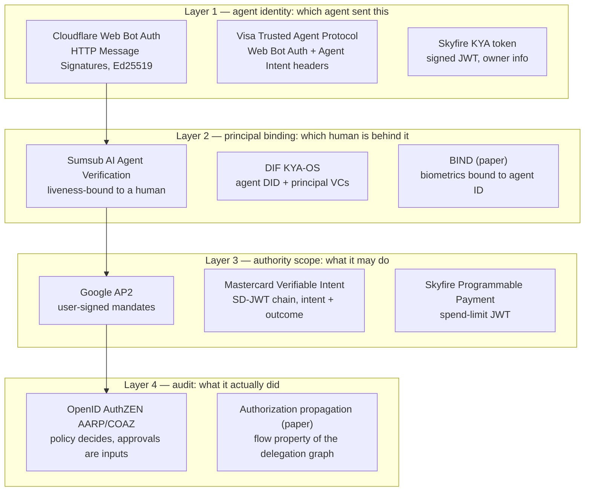
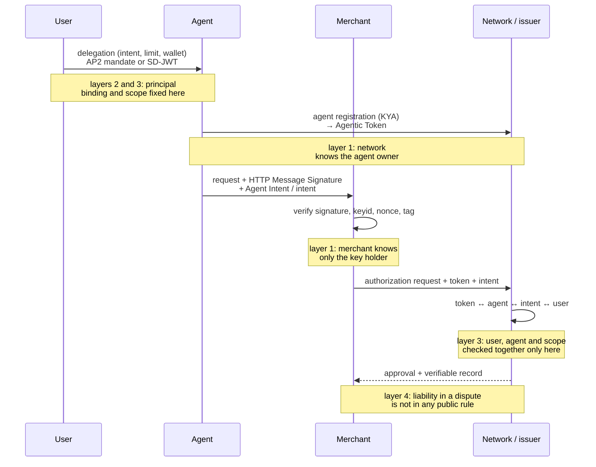

## Abstract

"Know Your Agent" is not one standard; it is a name attached to at least four things. Skyfire's signed JWT carrying agent-owner information, Sumsub's human-binding product, the DID/VC specification KYA-OS now stewarded by DIF, and the registration step inside Mastercard Agent Pay are all called KYA. This report takes those four apart, together with three systems that solve the same problem without using the name (Visa's Trusted Agent Protocol, Cloudflare's Web Bot Auth, Google's AP2), and sorts them into four layers: which agent sent this (identity), which human is behind it (principal binding), what it was allowed to do (authority scope), and what it actually did (audit). No product covers all four. Cloudflare and Visa stop at the first layer, Sumsub works only the second, AP2 and Mastercard's Verifiable Intent concentrate on the third, and the fourth is still academic. Standardisation runs in parallel at three bodies: FIDO (payments and agentic-authentication working groups, April 2026), DIF (KYA-OS, March 2026) and the OpenID Foundation (AuthZEN drafts, June 2026). Article 50 of the EU AI Act, in force since 2 August 2026, requires disclosing whom an agent acts for, not verifying the agent, so the vendor claim that regulation mandates KYA has no textual support. The academic literature frames the problem more widely: authorisation is a flow property of the whole delegation graph, and neither accountability for recursive delegation nor global uniqueness of agent identity has been solved by any implementation.

## 1. Introduction

This site's Mastercard Agent Pay report passed over KYA in a sentence. In the words of Mastercard's CDO Pablo Fourez: "in order to get access to tokens, agents need to be registered. We have a process we call 'Know Your Agent' – basically a KYC process"[^s06]. What sits behind that sentence is this report's subject.

The term is usually traced to Skyfire. One explainer says it "emerged from Skyfire's product naming in 2024, KYAPay was the first commercial framing, but by 2026 it had broadened into an ecosystem label"[^s01] _(unverified — single source)_. Skyfire itself, launching the KYAPay protocol on 26 June 2025, defined KYA as a "standardized signed JSON Web Token (JWT) that includes the verified information on the agent owner that a service needs to create account credentials"[^s27]. The name then detached from the product. As the same explainer notes, "Visa, Mastercard, and Cloudflare don't use 'KYA' as a product name, but their published specifications all solve the same identity problem and compose with each other"[^s01].

So this report does not ask what KYA is. It asks, of each implementation, what it verifies and what it does not.

## 2. Background: why KYC is not the answer

KYC verifies the person opening an account. The agent problem is different. The OpenID Foundation whitepaper diagnoses that "agents often act indistinguishably from users, creating accountability gaps and security risks" and that "true delegation requires explicit 'on-behalf-of' flows where agents prove their delegated scope while remaining identifiable as distinct from the user they represent"[^s12][^s21]. The thing to verify has gone from one (a person) to three (a person, an agent, and the delegation between them).

The academic starting point for that framing is the January 2025 Authenticated Delegation paper, which proposes "extending OAuth 2.0 and OpenID Connect with agent-specific credentials and metadata" so that "human users can securely delegate and restrict the permissions and scope of agents while maintaining clear chains of accountability"[^s10]. Its insistence on compatibility with existing infrastructure is why most commercial implementations since sit on OAuth and JWTs. The whitepaper also records the limit: "OAuth 2.1 frameworks, when used with AI agents, work well within single trust domains with synchronous agent operations"[^s21]. Cross-domain and asynchronous need something else.

## 3. What is verified: four layers

Laid side by side, the implementations split along four questions.

_Figure 1 — KYA implementations as of September 2026 placed on four layers. Arrows are logical dependencies: binding a principal needs an identified agent, granting scope needs a principal, audit records the other three. The one name, KYA, spans layers 1 to 3.[^s01][^s05][^s08][^s09][^s25][^s15][^s18][^s19][^s27][^s29]_

### 3.1 Layer 1: agent identity

The first layer to ship commercially, and the narrowest. Cloudflare's Web Bot Auth "allows an agent to provide a stable identifier by using HTTP Message Signatures with public key cryptography"[^s19]. Visa built directly on it: the Trusted Agent Protocol, announced 14 October 2025, authenticates agents with "agent-specific cryptographic signatures" under RFC 9421 and passes merchants three kinds of data, "Agent Intent – an indication that the agent is a trusted agent with an intent to retrieve", Consumer Recognition, and Payment Information[^s18][^s29]. What the merchant checks is the signature headers, the keyid, the timestamp, the nonce, the tag (browsing versus paying), and "ed25519 signature verification using the key supplied in keyid"[^s19].

This layer answers "did this request come from the holder of a registered key" and no more. Cloudflare's post leaves verification of the human cardholder's approval out of scope; that "remains outside the technical scope documented here" and is handled by the payment networks "separately from the agent authentication layer"[^s19]. Skyfire's KYA token belongs here too. The JWT carries "verified information on the agent owner", and account creation is an OAuth-adjacent flow "exchanging a KYA token for an access token"[^s27]. Skyfire's homepage also says it "binds platform, agent, and human principal identities along with user mandates"[^s02], but its product page describes verification as "digital checkpoints, such as existing forms of authentication, interaction and Skyfire transaction history, and developer identification" and "badges or digital 'blue checkmarks' from a variety of providers"[^s20]. Which of those describes the actual strength of the check cannot be settled from the documentation.

### 3.2 Layer 2: principal binding

Sumsub skips layer 1. In its CTO's words, "rather than attempting to blindly trust AI agents themselves, our solution focuses on verifying the humans behind them"[^s28]. AI Agent Verification, launched 29 January 2026, is built to "bind AI agents to verified human identities at scale", and when a risk threshold is crossed it demands "a targeted liveness test to confirm that a real human is present and authorized"[^s03][^s24]. The motivation is fraud: "when AI agents can autonomously move money, create accounts, or transact at scale without a real person behind them, fraud can almost become impossible to mitigate"[^s24].

DIF's KYA-OS tries to make the same layer a standard. Vouched donated MCP-I (Model Context Protocol – Identity) on 6 March 2026[^s17]; DIF renamed it KYA-OS on 22 April and put it under a task force of the Trusted AI Agents Working Group[^s15]. The structure is three parts: "Decentralized Identifiers (DIDs) providing cryptographically verifiable agent identities; Verifiable Credentials (VCs) representing delegation as tamper-evident credentials with explicit scope; cross-organizational verification without requiring prior coordination"[^s15][^s17]. An October 2025 paper had proposed the same design, pairing "a unique and ledger-anchored W3C Decentralized Identifier (DID) of an agent with a set of third-party issued W3C Verifiable Credentials" so that agents establish trust "through the spontaneous exchange of their self-hosted DID-bound VCs" at the start of a dialogue[^s14]. The identity vendor Iden's assessment: "the spec is in active community development, and production implementations are sparse"[^s26] _(vendor-stated)_.

The strongest binding is still a paper. BIND (August 2026) "securely bind[s] biometric data of the human user to the AI agent identity (ID) and authority scope (task-specific constraints) at the time of agent authorization", producing a 1024-bit token from which an Identity Auditor "authenticat[es] the human through biometrics while recovering both the agent's identity and its authorized task scope"[^s11]. It fuses layers 2 and 3 into one cryptographic object.

### 3.3 Layer 3: authority scope

This is where the payment networks actually exert force. Mastercard's flow is clearest in Fourez's telling: only registered agents receive an Agentic Token, and the user's intent ("Adidas shoes, size 10, €80") "is carried alongside the token to the different players in the transaction"[^s06]. On 5 March 2026 Mastercard turned that intent into a verifiable object, Verifiable Intent, which "links a consumer's identity, their specific instructions and the outcome of a transaction into a single, tamper-resistant record" and is built on FIDO, EMVCo, IETF and W3C standards[^s04]. The part of the technical write-up readable before its paywall describes three SD-JWT layers: one issued by the issuer into a wallet, one signed by the user key bound in the first, and one where "the agent signs short-lived, key-bound SD-JWTs that present fulfillment details". The point: "Verifiable Intent is not just an 'agent header.' It is a composable evidence object that multiple parties can verify independently"[^s05].

Google's AP2 started on this layer. Its principle is "Verifiable Intent, Not Inferred Action: trust in payments is anchored to deterministic, non-repudiable proof of intent from the user", and a mandate is a "tamper-evident, cryptographically signed digital object that serve[s] as the building block of a transaction"[^s25]. What the user signed comes before who the agent is. Skyfire's Programmable Payment JWT, "an authorized spend amount in USDC, or tokenized credit/debit card"[^s27], is the same layer in its simplest form.

The three implementations on this layer have three different trust anchors: Mastercard's is the issuer, AP2's the user key, Skyfire's is Skyfire. A merchant that wants to accept all three implements all three.

### 3.4 Layer 4: audit and policy

The least commercialised layer. On 15 June 2026 the OpenID AuthZEN working group adopted two drafts. AARP "defines interoperable patterns for requesting, tracking, satisfying, and re-evaluating" the prerequisites that exist when policy cannot yet authorise an action; COAZ lets "Model Context Protocol tools expose the authorization checks required to call a tool". The rule is that "approval, consent, delegation, attestation, and risk evaluation each become an input to a decision; policy remains the decision-maker"[^s08] _(unverified — single source)_.

The literature pushes this layer further. A May 2026 paper on authorisation propagation treats authorisation in multi-agent systems as "a workflow-level property" in which "non-human principals retrieve data, delegate tasks, and synthesize results across changing boundaries", formalises transitive delegation, aggregation inference and temporal validity, and concludes that "identity governance must be treated as infrastructure: evaluated continuously, enforced at every interaction boundary"[^s13]. That is a question layer 1 cannot answer. When agent A delegates to B and B to C, no single hop's signature says whether C's request is inside the original user's scope.

## 4. Where verification happens in one transaction

Overlaying the four layers on a single payment gives the following order. It merges the public descriptions of Mastercard Agent Pay and Visa TAP; it does not claim either network runs exactly this sequence.

_Figure 2 — Where checks fall in payment-style KYA. The merchant sees layer 1 only; layers 2 and 3 close between user and network; layer 4's liability assignment is absent from public documents.[^s04][^s06][^s25][^s18][^s19]_

What stands out is the merchant's position. All the merchant can confirm is that a signature matches a registered key. Whether the user actually approved this purchase is decided by the network on the merchant's behalf, and the merchant receives the outcome. That is why Cloudflare writes that verifying the human cardholder's authorisation is out of its document's scope[^s19].

## 5. Standardisation: three bodies in parallel

**FIDO Alliance.** On 28 April 2026 it announced agent standards through two working groups: the Agentic Authentication TWG (chaired by CVS Health, Google and OpenAI) and the Payments TWG (chaired by Mastercard and Visa). Scope: Verifiable User Instructions, "enabling users to authorize AI agents through clear, phishing-resistant mechanisms so agents only perform approved actions"; agent authentication; and Trusted Delegation for Commerce, "defining how agent-initiated transactions can be executed within user-controlled boundaries, with verifiable authorization". Google contributed AP2, Mastercard Verifiable Intent[^s07] _(unverified — single source)_. This is the candidate for a payments-specific layer-2/3 standard.

**DIF.** KYA-OS is the only public specification that works layer 2 with DIDs and VCs. The Trusted AI Agents WG's work items include "a report on Delegated Authority and an analysis of it in today's AuthZ protocols" and a reference implementation of "delegation, proof generation, session lifecycle, and cryptographic identity for the Model Context Protocol"[^s16]. DIF's executive director reports "a meaningful increase in new member organizations joining specifically to participate" since the donation[^s15] _(vendor-stated)_.

**OpenID Foundation.** AuthZEN's AARP and COAZ take layer 4[^s08]; the underlying whitepaper recommends OAuth 2.1 and SPIFFE as starting points[^s21].

**IETF.** No direct KYA work. WIMSE covers runtime identity for workloads, "a running instance of software executing for a specific purpose", and lists "personal identities" as out of scope[^s09]. It can underpin layer 1, not layer 2. Web Bot Auth remains a Cloudflare-authored individual draft.

Three bodies on three layers of one problem do not overlap. But nothing anywhere reconciles credential formats (SD-JWT, VC, signed JWT) or trust roots across them. The April survey that defines AI identity as "the continuous relationship between what an AI agent is declared to be and what it is observed to do", lists five gaps, "semantic intent verification, recursive delegation accountability, agent identity integrity, governance opacity, and operational sustainability", and concludes that "none adequately address the challenge of governing nondeterministic, boundary-crossing entities"[^s22], was submitted days before these bodies' announcements.

## 6. Does regulation require KYA?

Vendor posts cite the EU AI Act as the case for KYA. The text says something narrower. Article 50, in force since 2 August 2026, requires providers to "ensure people know they are interacting with AI and, where an agent acts on another's behalf, the identity of that person or entity". A law-firm summary: the requirement "focuses on identifying whose behalf the agent represents, not verifying the agent's own identity". Fines reach "€15 million or 3% of global annual turnover"[^s23]. Article 50 is a layer-2 disclosure duty, not a layer-1 verification duty. That a KYA product helps with Article 50 compliance is defensible; that Article 50 requires KYA is not.

## 7. Analysis

**KYA is a market name, not a layer name.** Four vendors put one name on four layers. When a buyer says they have adopted KYA, the name alone does not say whether that means accepting Skyfire JWTs, adding Sumsub liveness, issuing KYA-OS DIDs or registering an agent with Mastercard. That is why this report decomposes by layer.

**The most widely deployed layer is the thinnest.** Layer 1 on Web Bot Auth is shared by Cloudflare, Visa and Mastercard, and Skyfire claims coverage of "more than 60% of the Web"[^s02] _(vendor-stated)_. But layer 1 answers only who holds the key. The "self-declared identity, no global uniqueness enforcement" that the A2A threat-modelling literature faults is a structural property of this layer, and signatures do not change it.

**Payments lead, general-purpose standards follow.** Mastercard's registry, Visa's signed headers and AP2's mandates all closed layers 2 and 3 inside the narrow context of a payment. FIDO's working-group structure, with Mastercard and Visa in the chair, formalises that. For agents outside payments (support, procurement, coding) there are DIF KYA-OS and AuthZEN, where "production implementations are sparse"[^s26].

**Two things remain unsolved.** One is accountability under recursive delegation; the propagation paper[^s13] and the AI-identity survey[^s22] point at the same place, and no implementation says whose scope governs after two or more hops. The other is disputes. As the last line of Figure 2 shows, a verifiable record can exist and still leave open who is liable on its basis, because that is a network rule, and the rule is not public.

The practitioner's question is therefore not which KYA to buy. It is on which layer our agent needs to be verified, and who offers that layer today.

## 8. Limitations

- The 2024 origin of the term rests on one tier-5 explainer; Skyfire's own primary material begins with the June 2025 KYAPay release.
- Mastercard Verifiable Intent's SD-JWT structure was read only up to a paywall (`access_limited`). Mastercard's own framework page and Skyfire's original press-release hosts returned 403; syndicated copies were used.
- Claims that Visa TAP includes a "Verified Agent ID" or a Visa-operated directory appear only in tier-5 sources and were left out; Visa's primary material describes signed headers only.
- The FIDO working-group announcement and the OpenID AuthZEN drafts are each single primary sources.
- No evaluation of any KYA product from a party that is neither the vendor nor academia was found.
- Payment-network dispute and liability rules are not public, so layer 4 in Figure 2 is left blank.
- The academic proposals (BIND, DID/VC agents, authorisation propagation) are proposals and report no deployment.
