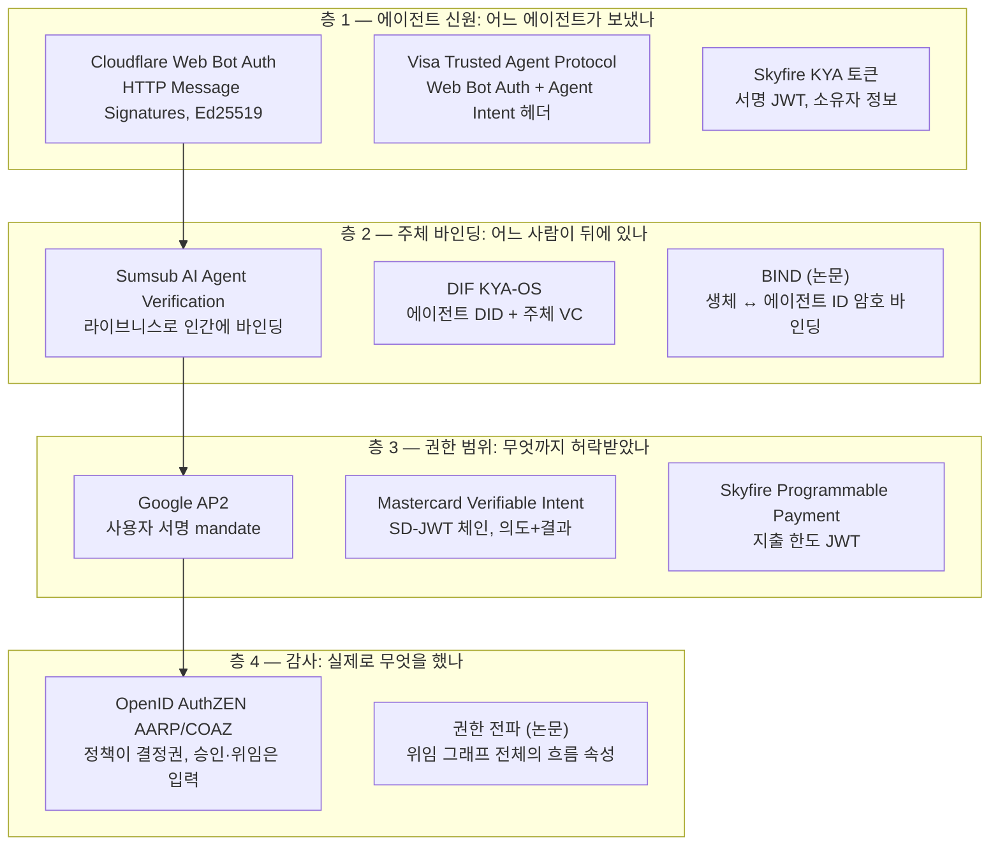
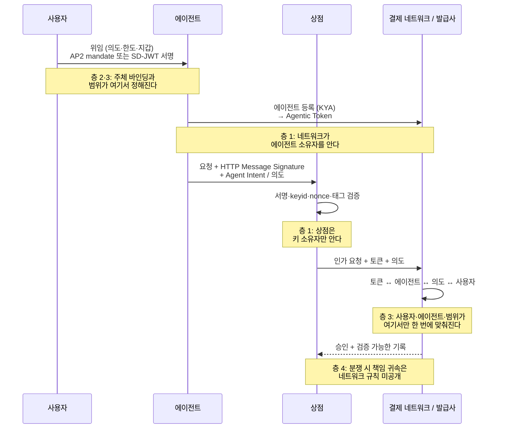

## 초록

"Know Your Agent"는 하나의 표준이 아니다. 적어도 네 가지를 가리키는 이름이다. Skyfire의 서명 JWT(에이전트 소유자 정보), Sumsub의 인간 바인딩 제품, DIF가 관리하는 DID/VC 기반 스펙 KYA-OS, 그리고 Mastercard Agent Pay 안의 등록 절차가 모두 KYA라 불린다. 이 보고서는 그 네 가지와, KYA라는 이름을 쓰지 않으면서 같은 문제를 푸는 셋(Visa Trusted Agent Protocol, Cloudflare Web Bot Auth, Google AP2)을 층별로 분해한다. 층은 넷이다. 에이전트가 누구인가(신원), 누구를 대신하는가(주체 바인딩), 무엇까지 허락받았는가(권한 범위), 실제로 무엇을 했는가(감사). 어떤 제품도 네 층을 다 덮지 않는다. Cloudflare와 Visa는 첫 층만, Sumsub는 둘째 층만, AP2와 Mastercard Verifiable Intent는 셋째 층에 집중하며, 넷째 층은 학술 제안 단계다. 표준화는 세 곳에서 병렬로 진행된다. FIDO(결제·에이전트 인증 WG, 2026-04), DIF(KYA-OS, 2026-03), OpenID(AuthZEN 드래프트, 2026-06). EU AI Act 50조(2026-08-02 시행)는 에이전트가 누구를 대신하는지 밝히라고 요구할 뿐 에이전트 검증을 요구하지 않으므로, "규제가 KYA를 강제한다"는 벤더 주장은 원문으로 뒷받침되지 않는다. 학술 쪽은 문제를 더 넓게 본다. 인가는 위임 그래프 전체의 흐름 속성이고, 재귀적 위임의 책임 귀속과 에이전트 신원의 전역 유일성은 어느 구현도 풀지 못했다.

## 1. 서론

이 사이트의 Mastercard Agent Pay 보고서는 KYA를 한 문장으로 지나갔다. Mastercard CDO Pablo Fourez의 말을 빌리면 "토큰에 접근하려면 에이전트가 등록돼야 한다. 우리는 이를 Know Your Agent라 부르는데, 기본적으로 KYC 절차다"[^s06]. 그 한 문장 뒤에 있는 것이 이 보고서의 주제다.

용어의 기원은 Skyfire로 알려져 있다. 한 해설은 "이 용어는 2024년 Skyfire의 제품명에서 나왔고, KYAPay가 첫 상업적 표현이었으며, 2026년에는 생태계 통칭으로 넓어졌다"고 쓴다[^s01] _(unverified — single source)_. Skyfire 자신은 2025년 6월 26일 KYAPay 프로토콜을 공개하면서 KYA를 "서비스가 계정 자격증명을 만드는 데 필요한, 에이전트 소유자에 관한 검증된 정보를 담은 표준화된 서명 JWT"로 정의했다[^s27]. 그 뒤로 이름은 제품에서 떨어져 나왔다. 같은 해설이 지적하듯 "Visa, Mastercard, Cloudflare는 KYA를 제품명으로 쓰지 않지만, 공개된 스펙은 모두 같은 신원 문제를 풀고 서로 조합된다"[^s01].

그래서 이 보고서는 "KYA란 무엇인가"를 묻지 않는다. 대신 각 구현이 무엇을 검증하고 무엇을 검증하지 않는지를 묻는다.

## 2. 배경: KYC가 답이 아닌 이유

KYC는 계좌를 여는 사람을 검증한다. 에이전트 문제는 다르다. OpenID Foundation 백서는 "에이전트가 사용자와 구별되지 않게 행동하는 경우가 많아 책임 공백과 보안 위험이 생긴다"고 진단하고, "진정한 위임에는 에이전트가 위임받은 범위를 증명하면서도 자신이 대리하는 사용자와 구별되는 존재로 남는 명시적 on-behalf-of 흐름이 필요하다"고 쓴다[^s12][^s21]. 검증해야 할 것이 하나(사람)에서 셋(사람, 에이전트, 둘 사이의 위임)으로 늘어난 것이다.

이 프레이밍의 학술적 출발점은 2025년 1월의 Authenticated Delegation 논문이다. OAuth 2.0과 OpenID Connect를 "에이전트 전용 자격증명과 메타데이터로 확장"해 "사용자가 에이전트의 권한과 범위를 안전하게 위임·제한하면서 명확한 책임 사슬을 유지"하는 프레임워크를 제안한다[^s10]. 기존 인프라와의 호환을 전제로 한다는 점에서, 이후 상용 구현 대부분이 OAuth/JWT 위에 올라간 것과 맥이 닿는다. 다만 백서는 그 한계도 적는다. "OAuth 2.1 프레임워크는 에이전트와 함께 쓸 때 단일 신뢰 도메인 안의 동기적 에이전트 동작에서는 잘 작동한다"[^s21]. 도메인을 넘고 비동기가 되면 다른 것이 필요하다.

## 3. 무엇을 검증하는가: 네 개의 층

구현들을 나란히 놓으면 네 개의 질문으로 갈린다.

_그림 1 — 2026년 9월 기준 KYA 구현을 네 층에 배치한 것. 화살표는 논리적 의존이다. 주체를 묶으려면 에이전트가 식별돼야 하고, 범위를 주려면 주체가 있어야 하며, 감사는 앞의 셋을 기록한다. 같은 이름(KYA)이 층 1·2·3에 걸쳐 있다.[^s01][^s05][^s08][^s09][^s25][^s15][^s18][^s19][^s27][^s29]_

### 3.1 층 1: 에이전트 신원

가장 먼저 상용화된 층이고, 가장 좁다. Cloudflare Web Bot Auth는 "공개키 암호를 쓰는 HTTP Message Signatures로 에이전트가 안정된 식별자를 제공"하게 한다[^s19]. Visa는 2025년 10월 14일 Trusted Agent Protocol을 발표하면서 이를 그대로 밑바닥으로 썼다. "에이전트별 암호 서명"과 RFC 9421 HTTP Message Signatures로 에이전트를 인증하고, "Agent Intent(신뢰된 에이전트가 조회 의도를 가졌다는 표시), Consumer Recognition, Payment Information" 세 종류의 정보를 상점에 전달한다[^s18][^s29]. 상점이 검증하는 것은 서명 헤더, keyid, 타임스탬프, nonce, 태그(browsing인지 paying인지), 그리고 "keyid로 제공된 키를 쓴 ed25519 서명"이다[^s19].

이 층이 답하는 질문은 "이 요청이 등록된 키의 소유자에게서 왔는가"까지다. Cloudflare 글은 사람 카드소유자가 거래를 승인했는지의 검증은 다루지 않고, 그 책임은 "결제 네트워크가 에이전트 인증 층과 별도로" 진다고 정리한다[^s19]. Skyfire의 KYA 토큰도 여기 속한다. JWT에 담기는 것은 "에이전트 소유자에 관한 검증된 정보"이고, 계정 생성은 "KYA 토큰을 액세스 토큰으로 교환"하는 OAuth 보완 흐름이다[^s27]. Skyfire 사이트는 "플랫폼, 에이전트, 인간 주체 신원과 사용자 mandate를 묶는다"고도 쓰지만[^s02], 제품 설명 페이지의 검증 방법은 "기존 인증, Skyfire 거래 이력, 개발자 식별" 같은 "디지털 체크포인트"와 여러 제공자가 주는 "블루 체크마크"다[^s20]. 어느 쪽이 실제 검증 강도인지는 문서로 판단할 수 없다.

### 3.2 층 2: 주체 바인딩

Sumsub는 층 1을 건너뛴다. CTO의 표현으로 "에이전트 자체를 맹목적으로 신뢰하려 하지 않고, 그 뒤의 사람을 검증하는 데 집중한다"[^s28]. 2026년 1월 29일 출시한 AI Agent Verification은 "AI 에이전트를 검증된 인간 신원에 대규모로 바인딩"하며, 위험 임계값을 넘으면 "실제 사람이 있고 승인했음을 확인하는 표적 라이브니스 테스트"를 요구한다[^s03][^s24]. 근거는 사기 방지다. "AI 에이전트가 실제 사람 없이 자율적으로 돈을 옮기고 계정을 만들고 대규모로 거래할 수 있게 되면 사기는 거의 막을 수 없게 된다"[^s24].

DIF의 KYA-OS는 같은 층을 표준으로 풀려 한다. Vouched가 2026년 3월 6일 MCP-I(Model Context Protocol – Identity)를 기부했고[^s17], DIF는 4월 22일 이를 KYA-OS로 개명해 Trusted AI Agents WG 산하 태스크포스로 옮겼다[^s15]. 구조는 "암호학적으로 검증 가능한 에이전트 신원을 주는 DID, 명시적 범위를 가진 위변조 방지 자격증명으로 위임을 표현하는 VC, 사전 조율 없는 조직 간 검증"의 셋이다[^s15][^s17]. 2025년 10월의 학술 논문이 같은 설계를 제안했다. "원장에 고정된 W3C DID와 제3자가 발급한 W3C VC 집합"으로 에이전트가 "대화 시작 시 자체 호스팅한 DID 바인딩 VC를 즉석에서 교환"해 사전 관계 없이 신뢰를 세운다[^s14]. 신원 벤더 Iden의 평가는 "스펙은 활발히 개발 중이고 프로덕션 구현은 드물다"이다[^s26] _(vendor-stated)_.

가장 강한 바인딩은 아직 논문이다. 2026년 8월의 BIND는 "인가 시점에 사용자의 생체 정보를 에이전트 ID와 권한 범위(작업별 제약)에 안전하게 바인딩"하고, Identity Auditor가 "생체로 사람을 인증하면서 동시에 에이전트 신원과 인가된 작업 범위를 복원"하는 1024비트 토큰을 만든다[^s11]. 층 2와 층 3을 하나의 암호 객체로 합친 셈이다.

### 3.3 층 3: 권한 범위

결제 네트워크가 실제로 힘을 쓰는 층이다. Mastercard의 흐름은 Fourez의 설명이 가장 간명하다. 등록된 에이전트만 Agentic Token을 받고, 사용자 의도("아디다스 신발, 사이즈 10, €80")가 "토큰과 함께 거래의 각 참여자에게 전달"된다[^s06]. 2026년 3월 5일 Mastercard는 이 의도를 검증 가능한 객체로 만든 Verifiable Intent를 공개했다. "소비자 신원, 구체적 지시, 거래 결과를 하나의 위변조 방지 기록으로 잇는" 프레임워크로, FIDO·EMVCo·IETF·W3C 표준 위에 있다고 밝혔다[^s04]. 페이월 앞부분까지 읽히는 기술 해설은 구조를 세 층의 SD-JWT로 설명한다. 발급사가 발급해 지갑에 넣는 1층, 1층에 묶인 사용자 키로 서명하는 2층, 그리고 "이행 세부를 제시하는 단기·키 바인딩 SD-JWT"를 에이전트가 서명하는 3층이다. "단순한 에이전트 헤더가 아니라 여러 당사자가 독립적으로 검증할 수 있는 조합 가능한 증거 객체"라는 것이 요지다[^s05].

Google AP2는 처음부터 이 층에서 출발했다. 원칙은 "추론된 행동이 아니라 검증 가능한 의도: 결제의 신뢰는 사용자로부터의 결정적·부인 방지 의도 증명에 고정된다"이고, mandate는 "거래의 구성 요소가 되는 위변조 방지·암호 서명 디지털 객체"다[^s25]. 에이전트가 누구인지보다 사용자가 무엇에 서명했는지가 먼저다. Skyfire의 Programmable Payment JWT("USDC 또는 토큰화 카드로 인가된 지출 금액")[^s27]도 같은 층의 단순한 형태다.

이 층의 세 구현은 서로 다른 트러스트 앵커를 갖는다. Mastercard는 발급사, AP2는 사용자 키, Skyfire는 Skyfire다. 한 상점이 셋 다 받으려면 셋 다 구현해야 한다.

### 3.4 층 4: 감사와 정책

가장 덜 상용화된 층이다. OpenID AuthZEN WG는 2026년 6월 15일 두 드래프트를 채택했다. AARP는 "정책이 아직 행동을 인가할 수 없을 때" 전제 조건을 "요청·추적·충족·재평가하는 상호운용 패턴"을 정의하고, COAZ는 "MCP 도구가 호출에 필요한 인가 검사를 노출"하게 한다. 원칙은 "승인, 동의, 위임, 증명, 위험 평가가 각각 결정의 입력이 되고, 정책이 결정권자로 남는다"이다[^s08] _(unverified — single source)_.

학술 쪽은 이 층을 더 밀어붙인다. 2026년 5월의 권한 전파 논문은 다중 에이전트 시스템에서 인가가 "비인간 주체가 데이터를 가져오고 작업을 위임하고 결과를 합성하는 워크플로 수준 속성"이며, 전이적 위임·집계 추론·시간적 유효성 세 문제를 형식화한 뒤 "신원 거버넌스는 인프라로 취급돼야 한다: 지속적으로 평가되고 모든 상호작용 경계에서 집행되는"이라고 결론짓는다[^s13]. 개별 요청의 서명을 검증하는 층 1이 답할 수 없는 질문이다. 에이전트 A가 B에게, B가 C에게 위임했을 때 C의 요청이 원래 사용자의 범위 안에 있는지는 어느 한 홉의 서명으로 알 수 없다.

## 4. 한 거래의 검증 순서

네 층이 한 결제에서 어떻게 겹치는지를 순서로 보면 다음과 같다. Mastercard Agent Pay와 Visa TAP의 공개 설명을 합친 것이며, 두 네트워크가 실제로 이 순서 그대로 동작한다는 뜻은 아니다.

_그림 2 — 결제형 KYA에서 검증이 일어나는 지점. 상점은 층 1만 보고, 층 2·3은 사용자와 네트워크 사이에서 닫히며, 층 4의 책임 귀속은 공개 문서에 없다.[^s04][^s06][^s25][^s18][^s19]_

이 그림에서 눈에 띄는 것은 상점의 위치다. 상점이 직접 확인할 수 있는 것은 "이 서명이 등록된 키와 맞는가"뿐이다. 사용자가 실제로 이 구매를 승인했는지는 네트워크가 대신 판단하고, 상점은 그 결과를 받는다. Cloudflare가 "사람 카드소유자의 승인 검증은 이 문서의 기술 범위 밖"이라고 쓴 이유다[^s19].

## 5. 표준화: 세 곳에서 병렬로

**FIDO Alliance.** 2026년 4월 28일 두 워킹그룹을 통해 에이전트 표준을 만들겠다고 발표했다. Agentic Authentication TWG(CVS Health·Google·OpenAI 의장)와 Payments TWG(Mastercard·Visa 의장)이며, 범위는 "사용자가 피싱 저항 메커니즘으로 에이전트를 인가해 에이전트가 승인된 행동만 하게 하는" Verifiable User Instructions, 에이전트 인증, "사용자가 통제하는 경계 안에서 검증 가능한 인가로 에이전트 거래를 실행하는" Trusted Delegation for Commerce다. Google이 AP2를, Mastercard가 Verifiable Intent를 기여했다[^s07] _(unverified — single source)_. 층 2·3의 결제 특화 표준이 될 후보다.

**DIF.** KYA-OS는 층 2를 DID/VC로 푸는 유일한 공개 스펙이다. Trusted AI Agents WG의 작업 항목에는 "오늘날 AuthZ 프로토콜 안의 위임된 권한 분석" 보고서와 "MCP를 위한 위임, 증명 생성, 세션 수명주기, 암호 신원"의 참조 구현이 있다[^s16]. DIF 사무총장은 기부 이후 "Trusted Agentic AI WG에 참여하려고 가입하는 신규 회원이 의미 있게 늘었다"고 했다[^s15] _(vendor-stated)_.

**OpenID Foundation.** AuthZEN의 AARP·COAZ가 층 4를 맡는다[^s08]. 배경 문서인 백서는 OAuth 2.1과 SPIFFE를 출발점으로 권한다[^s21].

**IETF.** 직접적인 KYA 작업은 없다. WIMSE는 "특정 목적으로 실행 중인 소프트웨어 인스턴스"인 워크로드의 런타임 신원을 다루고, "개인 신원"은 명시적으로 범위 밖이다[^s09]. 층 1의 기반이 될 수는 있어도 층 2는 아니다. Web Bot Auth는 Cloudflare가 낸 개인 초안 단계다.

세 재단이 같은 문제의 다른 층을 맡고 있으니 겹치지는 않는다. 그러나 셋 사이에 자격증명 형식(SD-JWT, VC, 서명 JWT)이나 트러스트 루트를 맞추는 작업은 어디에도 없다. 4월의 서베이 논문이 "선언된 것과 관찰된 것 사이의 지속적 관계"로 AI 신원을 정의하고 "의미적 의도 검증, 재귀적 위임 책임, 에이전트 신원 무결성, 거버넌스 불투명성, 운영 지속성" 다섯 공백을 든 뒤 "어느 것도 비결정적이고 경계를 넘는 개체를 다스리는 문제를 충분히 다루지 못한다"고 결론지은 것[^s22]은 이 재단들의 발표 며칠 전이다.

## 6. 규제는 KYA를 요구하는가

벤더 글들은 EU AI Act를 KYA의 근거로 든다. 원문은 다르다. 2026년 8월 2일 시행된 50조는 "사람들이 AI와 상호작용하고 있음을 알게 하고, 에이전트가 다른 이를 대신해 행동하는 경우 그 사람이나 조직의 신원을" 밝히라고 요구한다. 법률 해설의 정리로는 "대리하는 주체를 밝히라는 것이지 중개자를 인증하라는 것이 아니다"[^s23]. 벌금은 최대 1,500만 유로 또는 전 세계 매출 3%다[^s23]. 즉 50조는 층 2의 공개 의무이지 층 1의 검증 의무가 아니다. KYA 제품이 50조 준수를 돕는다는 말은 성립하지만, 50조가 KYA를 요구한다는 말은 성립하지 않는다.

## 7. 분석

**KYA는 시장의 이름이지 층의 이름은 못 된다.** 네 벤더가 네 층에 같은 이름을 붙였다. 구매자가 "KYA를 도입했다"고 할 때 Skyfire JWT를 받는 것인지, Sumsub 라이브니스를 붙인 것인지, KYA-OS DID를 발급한 것인지, Mastercard에 에이전트를 등록한 것인지는 이름만으로 알 수 없다. 이 보고서가 층으로 분해한 이유다.

**가장 넓게 깔린 것은 가장 얇은 층이다.** Web Bot Auth 기반의 층 1은 Cloudflare·Visa·Mastercard가 공유하고 Skyfire도 "웹의 60% 이상"을 덮는다고 주장한다[^s02] _(vendor-stated)_. 그러나 층 1이 답하는 것은 키 소유자뿐이다. A2A 위협 모델링 논문이 지적한 "자기 선언 신원, 전역 유일성 강제 없음"은 이 층의 구조적 한계이고, 서명은 그것을 바꾸지 않는다.

**결제가 앞서 가고 범용 표준이 뒤따른다.** Mastercard의 등록부, Visa의 서명 디렉터리, AP2의 mandate는 모두 결제라는 좁은 맥락에서 층 2·3을 닫았다. FIDO의 WG 구성(의장이 Mastercard·Visa)이 이를 공식화한다. 결제 밖의 에이전트(고객 지원, 조달, 코딩)에는 DIF KYA-OS와 AuthZEN이 있지만 "프로덕션 구현은 드물다"[^s26].

**풀리지 않은 것은 두 가지다.** 하나는 재귀적 위임의 책임 귀속이다. 권한 전파 논문[^s13]과 AI 신원 서베이[^s22]가 같은 지점을 짚는다. 두 홉 이상의 위임에서 누구의 범위가 적용되는지, 어느 구현도 답하지 않는다. 다른 하나는 분쟁이다. 그림 2의 마지막 줄처럼, 검증 가능한 기록이 만들어져도 그 기록으로 누가 책임지는지는 네트워크 규칙에 달렸고, 그 규칙은 공개되지 않았다.

실무자에게 남는 질문은 "어느 KYA를 쓸까"가 아니다. 우리 에이전트가 어느 층에서 검증받아야 하고, 그 층을 지금 누가 제공하는가다.

## 8. 한계

- KYA 용어의 2024년 기원은 tier-5 해설 하나에 의존한다. Skyfire의 1차 자료는 2025년 6월 KYAPay 발표뿐이다.
- Mastercard Verifiable Intent의 SD-JWT 구조는 페이월 앞부분만 읽었다(`access_limited`). Mastercard 자체 프레임워크 페이지와 Skyfire의 원 보도자료는 403을 반환해 전재본을 썼다.
- Visa TAP에 "Verified Agent ID"나 Visa 운영 디렉터리가 있다는 서술은 tier-5 출처에만 있어 본문에서 뺐다. Visa 1차 자료는 서명 헤더만 말한다.
- FIDO WG 발표와 OpenID AuthZEN 드래프트는 각각 단일 1차 출처다.
- 어떤 KYA 제품에 대해서도 벤더도 학계도 아닌 독립 평가는 찾지 못했다.
- 결제 네트워크의 분쟁·책임 규칙은 공개 문서에 없어 그림 2의 층 4는 공백으로 표시했다.
- 학술 제안(BIND, DID/VC 에이전트, 권한 전파)은 모두 제안이며 배포 사례를 보고하지 않는다.
