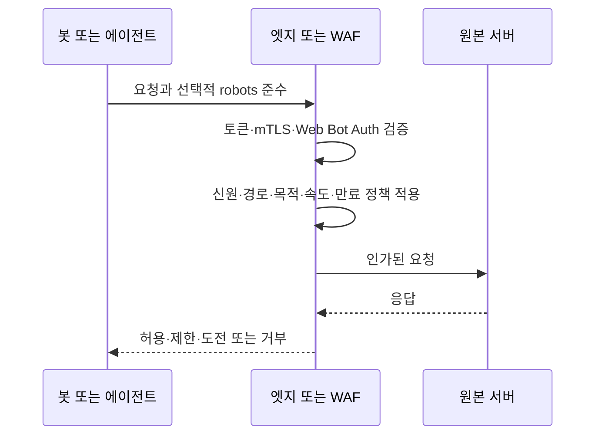

# robots.txt, 웹 봇 인증, 봇과 에이전트 접근 통제

## 서론

봇 접근에는 협조적인 크롤러가 경로를 가져가도 되는지, 서버가 요청자를 식별할 수 있는지, 작업이 인가되었는지, 정책을 무시하면 어떻게 처리할지라는 네 질문이 있다. HTTP도 인증은 자격 증명을 확인하고 인가는 요청 허용 여부를 결정하는 과정으로 구분한다.[^s03]

OpenAI·Google·Anthropic은 목적이 다른 crawler와 fetcher를 문서화한다.[^s07][^s08][^s09] 따라서 공개 정책 신호, 필요할 때의 신원 검증, 요청별 인가, 엣지 또는 원본에서의 집행을 나누어 설계해야 한다.

## robots.txt의 역할

RFC 9309는 서비스 운영자가 자동 클라이언트의 콘텐츠 접근 방식을 표현하는 Robots Exclusion Protocol을 정의한다.[^s01] 크롤러·경로 매칭과 캐시·오류 처리 규칙을 정하지만, 준수하기로 한 클라이언트가 따르는 행동 요청 프로토콜이다.

robots.txt는 요청자를 인증하지 않으며 `User-Agent`가 진짜라는 증거도 만들지 않는다. 접근 제어도 대신하지 않는다. 자격 증명과 권한 판단은 HTTP 인증·인가와 서버 통제가 담당한다.[^s02][^s03] 보호 자료는 반환 전에 잠가야 하며, 공개한 뒤 `Disallow`에 기대서는 안 된다.

그래도 robots.txt는 유용하다. 준수하는 운영자에게 경로·목적별 선호를 전달하고 원치 않는 발견을 줄이며 사람이 읽을 수 있는 공개 정책을 만든다. 반면 준수하지 않는 클라이언트는 무시할 수 있고, 가짜 이름으로 정상 크롤러를 흉내 낼 수도 있다.

## 인증과 Web Bot Auth

Basic·bearer 인증, 범위 제한 토큰, 상호 TLS, WAF, rate limit은 실제 집행 문제를 해결한다. 최소 권한, 만료, 키 교체, 로깅, 재전송 방지와 함께 써야 한다.[^s02][^s03][^s11]

HTTP Message Signatures는 HTTP 메시지를 서명하고 검증하는 표준 방법을 제공한다.[^s10] Web Bot Auth는 자동 클라이언트가 요청 일부를 서명하고 검증 가능한 키 자료를 공개하거나 가리키는 방식으로 이 방향을 활용한다.[^s04][^s05][^s06] Cloudflare 구현은 `Signature-Agent`, `Signature-Input`, `Signature`를 사용하고 목적지 권한과 생성·만료 시각을 다룬다. 현재 구현의 재전송 방어로 짧은 만료도 설명한다.[^s05]

유효한 서명은 키를 통제하고 선택된 필드를 결합했다는 뜻이다. 사이트 전체를 읽을 권한을 뜻하지는 않는다. 인가는 사이트의 별도 결정이며, 등록된 에이전트에도 별도 rate limit을 적용할 수 있고 서명 없거나 범위를 벗어난 요청은 거부할 수 있다.

정책, 신원, 인가, 집행을 분리해야 한다. robots.txt는 협조적 클라이언트를 안내할 수 있지만 실제 전달을 거부하는 것은 엣지나 원본이다.

## AI 크롤러 통제

공급자 문서는 학습·검색·제품 retrieval을 서로 다른 방식으로 나눈다.[^s07][^s08][^s09] 운영자는 문서화된 이름을 robots 그룹에 쓸 수 있지만, 안정적인 식별자와 준수가 전제다. 이름은 출처 증명이 아니며 학습 규칙이 사용자 요청 fetch나 브라우저 에이전트까지 자동으로 규율하지 않는다.

독립 연구는 robots 파일만으로 모든 assistant 워크플로를 가정하지 않고 실제 행태를 시험하기 시작했다.[^s12] robots.txt는 사이트 선호의 증거이고, 실제 결과는 로그와 서버 통제로 확인해야 한다. 검색은 허용하고 학습은 거부하며 계약 에이전트는 서명으로 받고 익명 자동화는 제한하는 식으로 결정은 분리될 수 있다.

## 배포 패턴

목적과 리소스별 정책표를 먼저 만든다. 협조적 발견 선호는 robots.txt에 쓰고 버전 관리한다. 비밀과 내부 URL은 넣지 않는다.

보호 리소스는 엣지나 원본에서 집행한다. 신원에는 인증, 범위에는 인가, 위임에는 짧은 자격 증명, 용량에는 rate와 abuse 통제를 사용한다. OWASP도 자동화 남용에 여러 통제를 조합할 것을 권고한다.[^s11] 경로, 자격 증명 또는 키 신원, 정책 결과, 응답, rate 판단, 실패 이유를 기록한다.

선별 허용이 필요하면 별도 endpoint나 정책 등급에서 Web Bot Auth를 시범 운영한다. 키를 안전하게 등록하고 목적지와 필요한 필드를 서명하며 만료를 짧게 하고 교체한다. 검증 뒤 별도 인가를 수행한다.[^s05][^s10] 위조 user agent, 무시된 robots 규칙, 만료·재전송 서명, 키 교체, 시계 오차, redirect, burst, 탈취 키를 시험해야 한다.

## 한계

Robots Exclusion Protocol은 표준화되었지만 Web Bot Auth는 진행 중인 IETF 작업이며 바뀔 수 있다.[^s04] Cloudflare 문서는 한 구현의 해석이지 모든 검증기의 동작을 보장하지 않는다.[^s05] 공급자 crawler 이름과 목적도 바뀔 수 있다.[^s07][^s08][^s09] 독립적인 준수 근거는 아직 제한적이며, 인용한 assistant 연구는 완결된 측정이 아닌 초기 신호다.[^s12]

## 초록

`robots.txt`는 협조적 크롤러 정책이며 인증이나 접근 제어가 아니다.[^s01] 실제 거부에는 서버 측 인증·인가, WAF, 토큰, 인증서, rate limit이 필요하다.[^s02][^s03] Web Bot Auth는 HTTP Message Signatures와 키 디렉터리에 기반한 초기 암호학적 신원 계층으로 등록된 자동 클라이언트에 선별 정책을 적용하게 한다.[^s04][^s05][^s10] 지속 가능한 방식은 선호를 공개하고, 필요할 때 신원을 검증하고, 작업별로 인가하고, 엣지 또는 원본에서 집행하는 것이다.
