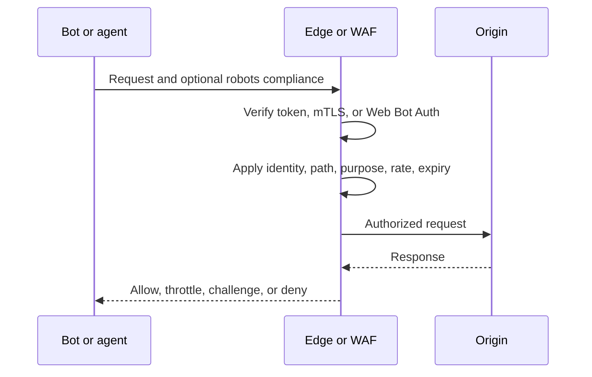

# robots.txt, Web Bot Authentication, and Access Control for Bots and Agents

## Introduction

Bot access has four separate questions: may a cooperative crawler fetch a path, can the server identify it, is this operation authorized, and what happens when it ignores policy? HTTP distinguishes authentication, which establishes credentials, from authorization, which decides whether a request is allowed.[^s03]

OpenAI, Google, and Anthropic document multiple crawler or fetcher identities and purposes.[^s07][^s08][^s09] A sound design therefore combines a public policy signal, identity verification where useful, request-level authorization, and enforcement at the edge or origin.

## What robots.txt does

RFC 9309 defines the Robots Exclusion Protocol for service owners to express how automatic clients may access content.[^s01] It specifies crawler and path matching, caching, and error handling. It is a requested-behavior protocol for clients that choose to comply.

robots.txt does not authenticate a requester or prove that its `User-Agent` is truthful. It also does not replace access control. HTTP authentication and authorization are the mechanisms for credentials and permission decisions.[^s02][^s03] Private material must be protected before delivery; publishing it and relying on `Disallow` is not protection.

The file remains valuable for compliant operators: it communicates path and purpose preferences, reduces unwanted discovery, and gives humans an inspectable policy. Its boundary is equally important: a non-compliant client can ignore it, and a false crawler name can imitate a compliant one.

## Authentication and Web Bot Auth

Basic or bearer authentication, scoped delegation tokens, mutual TLS, WAF rules, and rate limits answer the enforcement problem. They should be combined with least privilege, expiry, rotation, logging, and replay protection.[^s02][^s03][^s11]

HTTP Message Signatures provide a standard way to sign and verify HTTP messages.[^s10] Web Bot Auth builds on this direction: an automated client signs selected request components and publishes or points to key material that the recipient can verify.[^s04][^s05][^s06] Cloudflare’s implementation uses `Signature-Agent`, `Signature-Input`, and `Signature`, recommends signing the destination authority, and uses creation and expiry times. It documents short expiry as its current practical replay defense.[^s05]

A valid signature proves control of a key and binds that key to selected fields. It does not mean the agent may read the whole site. Authorization remains the site’s decision: a registered agent may receive a separate rate limit, while an unsigned or out-of-scope request is denied.

The diagram separates policy, identity, authorization, and enforcement. robots.txt can guide a cooperative client; only the edge or origin can reliably refuse delivery.

## AI crawler controls

Provider documentation separates training, search, and product retrieval in different ways.[^s07][^s08][^s09] Operators can use documented crawler names in targeted robots groups, but the result depends on stable identifiers and compliance. A name is not proof of origin, and a training rule may not govern user-triggered retrieval or browser agents.

Independent research is beginning to test assistant behavior rather than assuming that a visible robots file predicts every workflow.[^s12] robots.txt is evidence of a site preference; logs and server controls are needed to establish what actually happened. A publisher may allow search indexing, deny training, admit a contracted signed agent, and throttle anonymous automation. Those are separate decisions.

## Deployment pattern

Write a purpose-and-resource policy table. Put cooperative discovery preferences in robots.txt and keep it versioned. Do not put secrets or internal URLs there.

Enforce protected resources at the origin or edge. Use authentication for identity, authorization for scope, short-lived credentials for delegation, and rate and abuse controls for capacity. OWASP recommends combining controls against automated abuse.[^s11] Log the path, credential or key identity, policy result, response, rate decision, and failure reason.

If selective admission matters, pilot Web Bot Auth at a separate endpoint or policy class. Register keys securely, sign the destination and required fields, use short expiries, rotate keys, and make authorization a separate decision.[^s05][^s10] Test forged user agents, ignored robots rules, expired and replayed signatures, key rotation, clock skew, redirects, bursts, and compromised keys.

## Limitations

Robots Exclusion Protocol is standardized, while Web Bot Auth remains an active IETF work item and can change.[^s04] Cloudflare’s documentation describes one deployed interpretation, not universal verifier behavior.[^s05] Provider crawler names and purposes are operational documentation and may change.[^s07][^s08][^s09] Independent compliance evidence remains limited; the cited assistant study is an early signal rather than a complete measurement.[^s12]

## Abstract

`robots.txt` is a cooperative crawler policy, not authentication or access control.[^s01] Actual denial requires server-side authentication, authorization, WAF, tokens, certificates, or rate limits.[^s02][^s03] Web Bot Auth adds an emerging cryptographic identity layer based on HTTP Message Signatures and key directories, enabling selective policy for registered automated clients.[^s04][^s05][^s10] The durable pattern is layered: publish preferences, verify identity when needed, authorize each operation, and enforce the result at the edge or origin.
