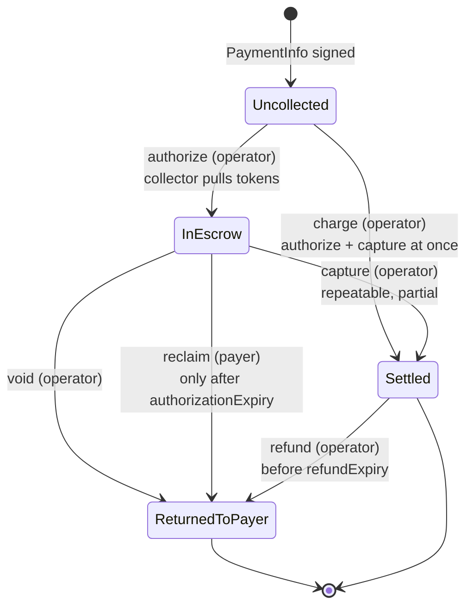
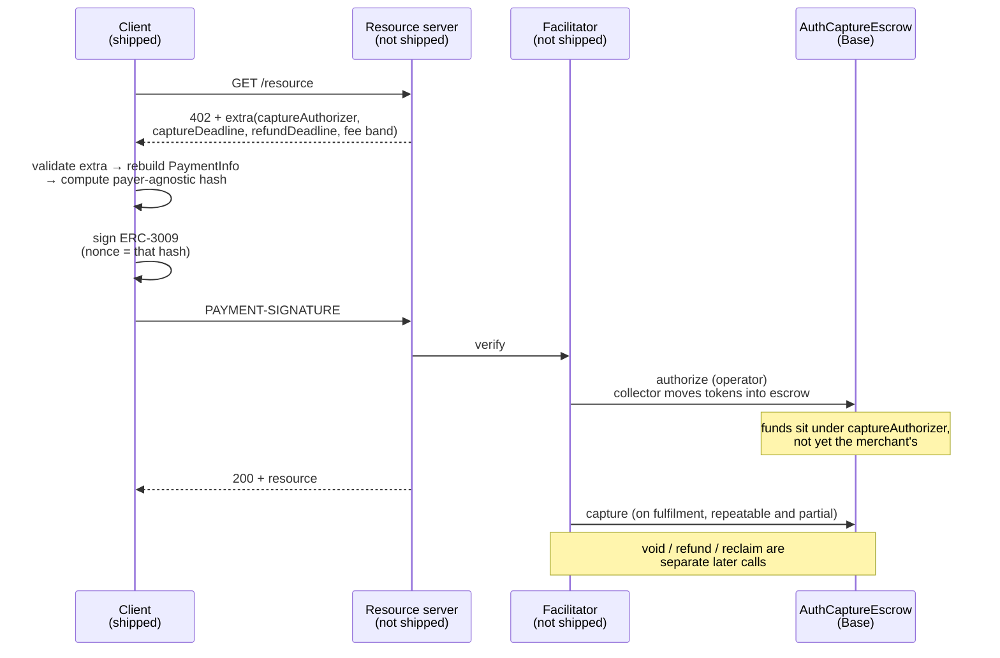

## Abstract

x402's three documented schemes settle atomically and finally. You sign, the money moves, and it does not come back. That suits metered access; it does not suit commerce. `auth-capture` is the fourth scheme aimed at that gap, one that "adds refundable payments to x402, built on Base's audited Commerce Payments Protocol"[^s01]. The layer underneath, the Commerce Payments Protocol (CPP), is an escrow contract Coinbase and Shopify put on Base in June 2025. It has six operations (authorize, capture, charge, void, reclaim, refund) and four kinds of token collector[^s03][^s06]. Its trust model rests on operators being able to move funds while they "cannot modify the original payment intent of the payer", "cannot lock funds in the escrow" and "cannot impact the activities of another operator"[^s05]. What the contract source confirms is the access control: authorize, capture and void are operator-only, and `reclaim` is callable "only by the payer and only after the authorization expiry"[^s04]. The x402 side is a signing layer bolted onto that escrow: the client signs an ERC-3009 or Permit2 payload **whose nonce is the payer-agnostic PaymentInfo hash**, so one signature commits to the entire set of payment terms[^s01][^s02]. As of September 2026, though, only half the scheme exists. The README says so: what ships is "the client only", and "Server & Facilitator: Support is forthcoming in a later release"[^s01]; the official scheme overview lists exact, upto and batch-settlement, with no auth-capture[^s09]. What giving up atomicity buys is three expiry clocks and at least three roles, and the trust boundary grew accordingly.

## 1. Introduction

The x402 documentation defines three schemes: `exact` ("for fixed-price requests where the buyer authorizes the advertised amount"), `upto` ("for single-request usage-based billing where the buyer authorizes a maximum"), and `batch-settlement` ("for high-volume or repeated micropayments where per-request authorizations are accumulated")[^s09]. What they share is that settlement ends the matter.

A paper posted to arXiv on 2 September 2026 names the limit precisely. Protocols like x402 "let an agent sign a stablecoin authorization and receive a resource in the same round trip", a model that is "atomic and final" and therefore "suits metered access and fails commerce: a purchase made on a person's behalf [...] is large, frequently cancelled, and should not become the seller's money until delivery"[^s12].

`auth-capture` is the answer to that inside the x402 repository, and the answer declines to build a new escrow, attaching instead to one that exists. Hence reading both repositories together: one contract holds the money, one signing convention wires that contract to an HTTP 402 handshake.

## 2. Commerce Payments Protocol: the lower layer

### 2.1 What it is and why

CPP is "a permissionless protocol for onchain payments that mimics traditional 'authorize and capture' payment flows"[^s03]. Shopify Engineering states the motivation most directly: "most onchain payments today work well for peer-to-peer transfers, they fall short of handling the complexity of commercial purchases"[^s06].

That complexity resolves into three needs. After a buyer approves a payment, "funds must be locked while still allowing either part to cancel if needed"; "captures can be made in multiple partial increments to support merchants that may fulfill goods in multiple deliveries"; and refunds must work[^s06]. Authorize-and-capture in traditional finance delivers "merchant protection through payment guarantees", and as a side effect is "cheaper for merchants because they only pay fees on captured payments"[^s06].

### 2.2 The escrow state machine



_Figure 1 — AuthCaptureEscrow's states and who may drive each transition. The parenthetical is the contract's access control; `reclaim` is the payer's only unilateral exit.[^s03][^s04]_

The contract tracks three fields of state, `hasCollectedPayment`, `capturableAmount` and `refundableAmount`, in a mapping keyed by `paymentInfoHash`[^s04]. Shopify's note about repeated partial captures lines up with a `capturableAmount` that draws down.

The access control is explicit in the source comments. `authorize`, `capture` and `void` "can only be called by the operator"; `reclaim` "can only be called by the payer and only after the authorization expiry"; `refund` is also called by the operator[^s04]. The buyer's route back to their own money is time-locked, and every other transition belongs to the operator.

### 2.3 What an operator cannot do

That asymmetry is the trust question, and the design writeup meets it head on. Under the principle that "users should not have to trust any operator or managing entity to be safe", operators "cannot modify the original payment intent of the payer", "cannot lock funds in the escrow", and "cannot impact the activities of another operator"[^s05].

The PaymentInfo hash enforces the first: a signature bound to the hash makes any changed field a different payment. `reclaim` enforces the second: past `authorizationExpiry` the payer withdraws directly[^s04]. The third follows from `operator` being a PaymentInfo field, fixing the operator per payment[^s04]. Independently auditing the full contract is outside this report's scope; what was verified is the access-control comments.

Fees fall on the receiver. Because "a fee-free payer experience is important for conversion", the receiver carries blockchain costs through the operator[^s05].

### 2.4 Collectors and deployments

There is more than one way to get tokens into escrow. Support for "multiple authorization methods (ERC-3009, Permit2, allowances, spend permissions)" is implemented as separate collector contracts[^s03]. The v1.1.0 deployment is six of them: `AuthCaptureEscrow` (`0xf968…b19c`), the ERC3009, Permit2, PreApproval and SpendPermission collectors, and `OperatorRefundCollector`[^s03][^s07].

v1.1.0, on 17 September 2026, carried one breaking change: it "replaces the basis-points fee (`uint16 feeBps`) with an absolute fee amount (`uint256 feeAmount`)" on `capture()` and `charge()`, fixing rounding and billing issues, audited by Spearbit[^s07]. Note that `PaymentInfo` still carries `minFeeBps`/`maxFeeBps`[^s04]: the ceiling is bound in basis points at signing time, and the actual charge is named as an absolute amount at capture time.

Audits were performed by Spearbit and Coinbase Protocol Security[^s03]. The count reads differently depending on how the repository is rendered, so this report does not assert one (§6).

### 2.5 Real-world volume

Reporting from late February 2026, citing growthepie, puts cumulative settled volume at roughly $1.7 million USDC across about 8,000 transactions, with roughly 3,200 customers and 5,700 merchants as of early February, and $750,000 processed in the preceding two months[^s08] _(unverified — single source)_. The growth is clear and the absolute scale is small. These are CPP's numbers overall, not payments routed through x402.

## 3. x402 auth-capture: the upper layer

### 3.1 One signature commits to every term

The design turns on the nonce. One sentence in the Go package documentation carries it: "the client signs a single collect payload (ERC-3009 by default, or Permit2) whose nonce is the payer-agnostic PaymentInfo hash"[^s02].

An ERC-3009 `nonce` is ordinarily an arbitrary replay guard. Put the hash of the whole payment's terms there and the signature stops meaning "this amount of this token may move" and starts meaning "only for the payment this operator runs, to this receiver, inside these expiries and this fee band". Change any PaymentInfo field and the hash changes and the signature is worthless.

The actual struct is twelve fields[^s04]:

```solidity
struct PaymentInfo {
    address operator;        address payer;
    address receiver;        address token;
    uint120 maxAmount;
    uint48  preApprovalExpiry;
    uint48  authorizationExpiry;
    uint48  refundExpiry;
    uint16  minFeeBps;       uint16 maxFeeBps;
    address feeReceiver;     uint256 salt;
}
```

Three expiries say what kind of structure this is. `preApprovalExpiry` bounds collection itself, `authorizationExpiry` bounds the escrow hold (after which the payer may `reclaim`), and `refundExpiry` bounds refunds after capture[^s02][^s04]. Atomic payments had no clocks; this has three.

### 3.2 What the client does

From the x402 requirements' `extra`, the client reads eight required fields: `captureAuthorizer`, `feeRecipient`, `captureDeadline`, `refundDeadline`, `minFeeBps`, `maxFeeBps`, `name`, `version`. Optional ones are `assetTransferMethod` (default `eip3009`), `authCaptureEscrow` (default v1.1), `receiverAuthorizer` and `policy`[^s01].

The client validates those, reconstructs the PaymentInfo struct, computes the payer-agnostic hash and emits the signature[^s01]. The Go SDK's function names are that procedure: `ComputePayerAgnosticPaymentInfoHash()`, `DeriveBoundSalt()`, `SignERC3009()`, `SignPermit2()`, and `ResolveAuthCaptureDeployment()` to pick between the v1.0 and v1.1 contracts[^s02].

When `receiverAuthorizer` or `policy` is non-zero, salt binding switches on: the client emits a random `saltNonce` and computes a keccak `salt` committing to those two addresses, which goes into PaymentInfo's `salt`[^s01][^s02]. Binding extra roles to a payment by reinterpreting an existing field rather than adding one reads as a decision not to change the struct.

Two asset-transfer methods exist. The default is ERC-3009 `ReceiveWithAuthorization`, whose EIP-712 domain binds to the token contract; Uniswap Permit2 `PermitTransferFrom` covers tokens without `receiveWithAuthorization`[^s01][^s02].

### 3.3 The whole flow, and the missing half



_Figure 2 — The full span of an auth-capture payment. Of the two left-hand participants only the client has shipped; server and facilitator support is "forthcoming in a later release".[^s01][^s02][^s03][^s04]_

The README states its own scope, and it is half this diagram. What exists is "the client only: detecting auth-capture payment requirements and signing the payment payload", with "Server & Facilitator: Support is forthcoming in a later release"[^s01]. The Go package repeats it: "capture, void, and refund lifecycle payloads are server/facilitator responsibilities"[^s02].

Supported networks are Base mainnet (`eip155:8453`) and Base Sepolia (`eip155:84532`), and nothing else[^s01] _(unverified — single source)_ — which follows from the contracts being deployed only on Base.

### 3.4 It is not in the documentation

The official scheme overview carries exact, upto and batch-settlement. There is no auth-capture[^s09] _(unverified — single source)_. There are TypeScript and Go implementations, with a choice between v1.0 and v1.1 deployments, for a scheme the protocol documentation does not list.

## 4. What has happened around it

**A verification-gated release policy (closed).** Issue #3065, 6 August 2026, proposed attaching mechanical verification to auth-capture on a simple rule: "verification passes: capture. Verification fails: void." The complaint is concrete: the scheme has "no protocol-level mechanisms for parties to agree upfront on delivery criteria, verify fulfillment, or dispute release decisions", so "an agent paying $195 for data cleaning has no machine-checkable agreement governing whether funds should be captured or voided"[^s10].

The follow-up, PR #3066, proposed `specs/schemes/auth-capture/pact-release-policy.md` and was **closed**. Review raised three problems: auth-capture "only supports payer-side operations", so there is no instrument to slash a bond; "collapsing verification and settlement into a single engine creates conflicts of interest, potentially allowing a seller's designee to verify their own work"; and the spec needed to say "whether auth-capture supports repeated partial captures against a single authorization". The reviewer recommended closing it because later PACT drafts had moved the scope[^s11].

**In the literature.** The ASP paper calls CPP "standardised" on-chain authorize-and-capture escrow and builds an application profile above it[^s12]. CPP is one repository's protocol rather than a foundation standard, so that phrasing is best read as the paper's.

**At Stripe.** Stripe's x402 documentation covers the `exact` scheme on Base, a deposit address, and recording a settled on-chain transaction as a PaymentIntent in `transaction_verification` mode[^s13]. Auth-capture and escrow do not appear. Refunds there live on Stripe's objects, not in an on-chain escrow.

## 5. Analysis

**Give up atomicity and you take on clocks and roles.** The `exact` scheme's trust boundary is one token contract. Auth-capture brings in three expiries (`preApprovalExpiry`, `authorizationExpiry`, `refundExpiry`)[^s04] and at least three roles (`operator`, `captureAuthorizer`, and optionally `receiverAuthorizer`)[^s01][^s04]. Each is a place to misconfigure and a place to argue. Authorize-and-capture is complicated for the same reason commerce needs it.

**The payer's only unilateral power is on a timer.** `reclaim` is payer-only but available only after `authorizationExpiry`[^s04]. Before that, the payer's route back to their funds is the operator's `void`. The guarantee that an operator "cannot lock funds in the escrow"[^s05] is true, and the moment it takes effect is set by the `authorizationExpiry` value chosen at signing. Buyer protection here lives in that number rather than in the contract.

**Committing to everything in one signature is clean and forecloses negotiation.** Putting the PaymentInfo hash in the nonce[^s02] makes intent tampering impossible for the operator. The cost is that changing any term requires a new signature. For a payment whose amount shifts mid-fulfilment, the protocol implies a re-signing round trip, and how that round trip is expressed over an HTTP 402 handshake is undefined.

**The closed PR left the real gap behind.** "Whether auth-capture supports repeated partial captures against a single authorization"[^s11] was a clarification demanded of the spec. Yet the lower layer answers it, keeping a `capturableAmount`[^s04], and Shopify names split shipments as an explicit motivation[^s06]. The lower layer has the answer and the upper layer's spec does not state it. A documentation gap presenting as a design gap.

**Half a scheme has not yet delivered what a scheme is for.** A client alone does not complete a payment. Completing one today means a facilitator calling CPP directly, at which point routing through the x402 scheme buys less. A scheme's value is that independent implementations meet on one convention, and here the other side has not arrived. Its absence from the scheme documentation[^s09] reads as the same condition stated differently.

For anyone evaluating this, a practical order: the lower layer is audited, deployed and in real use, so it can be judged on its own terms. The upper layer is worth matching on client signature format, but until server and facilitator support exists, design against calling CPP directly. And decide `authorizationExpiry` as policy from the start, because it sets how strong buyer protection actually is.

## 6. Limitations

- The CPP audit count reads as five or six depending on how the repository renders, so no number is asserted. The Spearbit reports themselves were not found.
- The three things an operator "cannot do" are the design writeup's claims. This report did not audit the contract; it verified the access-control comments on `authorize`, `capture`, `void` and `reclaim`.
- CPP volume figures rest on one news report citing growthepie; the dashboard itself was not checked.
- What `receiverAuthorizer` and `policy` each authorise or enforce was not found beyond the salt-binding description, so no function is asserted for them.
- When server and facilitator support for auth-capture arrives is unknown; the README's "later release" is the only basis.
- The reviewer's reason for closing PR #3066, that PACT drafts moved the scope, was not cross-checked against the PACT documents.
- Supported networks, the documentation omission, and the ASP paper's characterisation are each single-source.
