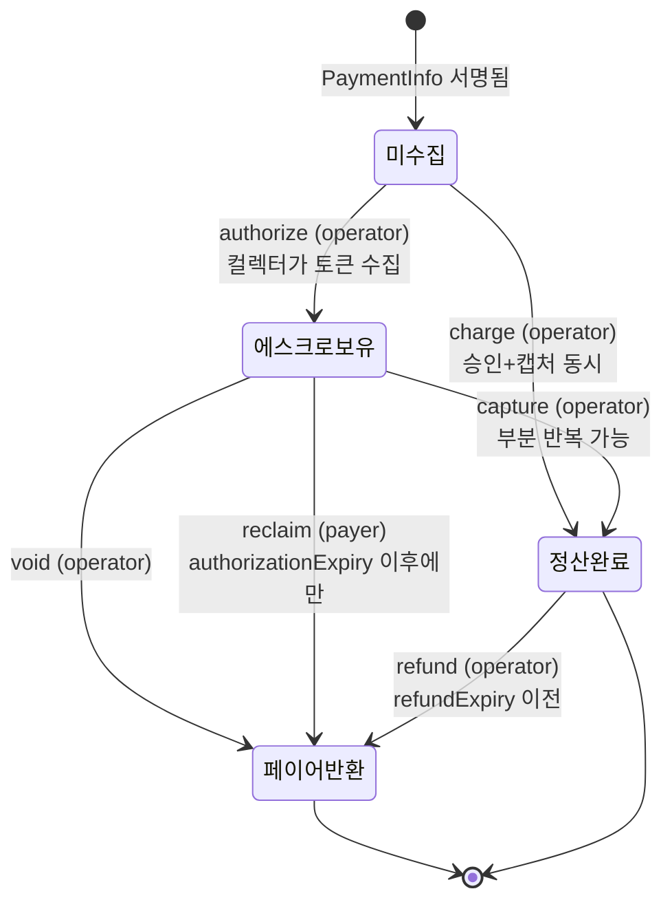
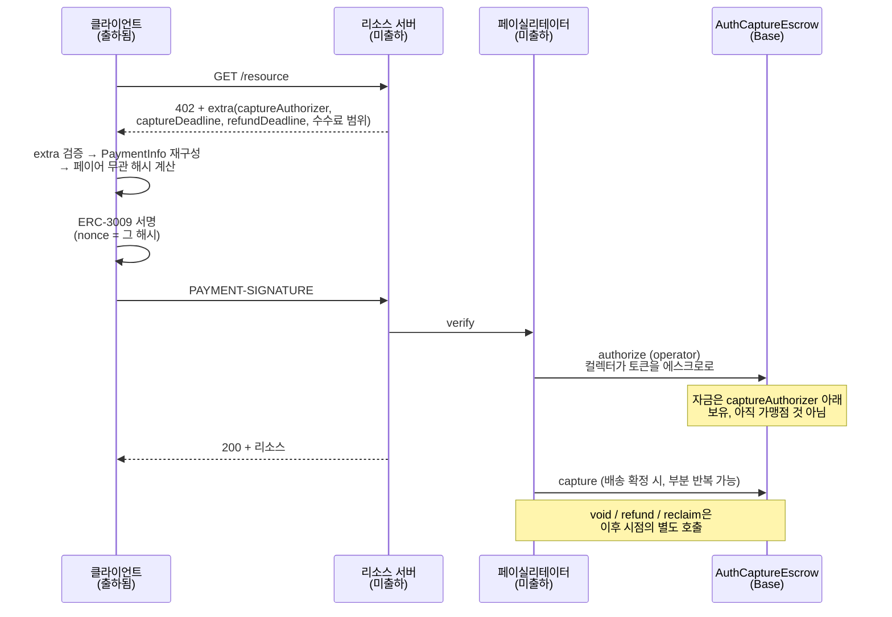

## 초록

x402의 기존 세 스킴은 결제가 원자적이고 최종적이다. 서명하면 돈이 가고, 돌아오지 않는다. 계량 과금에는 맞지만 커머스에는 맞지 않는다. `auth-capture`는 그 공백을 메우려는 네 번째 스킴으로, "Base의 감사받은 Commerce Payments Protocol 위에 구축된, x402에 환불 가능 결제를 추가하는" 것이다[^s01]. 아래층인 Commerce Payments Protocol(CPP)은 Coinbase와 Shopify가 2025년 6월 Base에 올린 에스크로 컨트랙트로, authorize·capture·charge·void·reclaim·refund 여섯 연산과 네 종류의 토큰 컬렉터를 갖는다[^s03][^s06]. 신뢰 모델의 핵심은 오퍼레이터가 자금을 움직이되 "페이어의 원래 결제 의도를 수정할 수 없고, 에스크로에 자금을 묶어둘 수 없으며, 다른 오퍼레이터의 활동에 영향을 줄 수 없다"는 것이다[^s05]. 컨트랙트 수준에서 확인되는 것은 authorize·capture·void가 오퍼레이터 전용이고 `reclaim`이 "페이어만, 그리고 authorization 만료 이후에만" 호출 가능하다는 접근 제어다[^s04]. x402 쪽 스킴은 이 에스크로에 붙는 서명 계층으로, 클라이언트가 ERC-3009 또는 Permit2 페이로드에 서명하되 **그 nonce가 페이어 무관 PaymentInfo 해시**여서 서명 하나가 결제 조건 전체에 커밋된다[^s01][^s02]. 다만 2026년 9월 현재 이 스킴은 절반만 있다. README가 명시하듯 출하된 것은 "클라이언트뿐"이고 "서버와 페이실리테이터 지원은 이후 릴리스 예정"이며[^s01], 공식 스킴 개요 문서에는 exact·upto·batch-settlement만 있고 auth-capture는 없다[^s09]. 원자성을 포기한 대가로 들어온 것은 세 개의 만료 시각과 최소 세 개의 역할이고, 그만큼 신뢰 경계가 늘었다.

## 1. 서론

x402 공식 문서가 정의하는 스킴은 셋이다. `exact`("광고된 금액을 구매자가 승인하는 고정가 요청용"), `upto`("구매자가 상한을 승인하는 단일 요청 사용량 과금용"), `batch-settlement`("요청별 승인을 누적하는 대량·반복 소액결제용")[^s09]. 셋의 공통점은 정산이 곧 종료라는 것이다.

2026년 9월 2일 arXiv에 올라온 한 논문이 그 한계를 정확히 짚는다. "x402 같은 HTTP 네이티브 프로토콜은 에이전트가 스테이블코인 인가에 서명하고 같은 왕복에서 리소스를 받게 한다"는 모델은 "원자적이고 최종적"이며, 이는 "계량 접근에는 맞지만 커머스에는 실패한다. 사람을 대신해 이뤄진 구매는 금액이 크고 자주 취소되며, 배송 전까지 판매자의 돈이 되어서는 안 된다"[^s12].

`auth-capture`는 이 문제에 대한 x402 저장소 안의 답이다. 그리고 그 답은 새 에스크로를 만드는 대신 이미 있는 것에 붙는 쪽을 택했다. 이 보고서가 두 저장소를 함께 읽는 이유다. 하나는 돈을 붙잡아 두는 컨트랙트이고, 하나는 그 컨트랙트에 HTTP 402 핸드셰이크를 잇는 서명 규약이다.

## 2. Commerce Payments Protocol: 아래층

### 2.1 무엇이고 왜 있는가

CPP는 "전통적인 승인-캡처 결제 흐름을 모방하는 온체인 결제용 퍼미션리스 프로토콜"이다[^s03]. Shopify 엔지니어링의 설명이 동기를 가장 직접적으로 말한다. "오늘날 온체인 결제 대부분은 P2P 전송에는 잘 맞지만 상거래 구매의 복잡성을 감당하지 못한다"[^s06].

그 복잡성은 세 가지로 나뉜다. 구매자가 결제를 승인한 뒤 "자금은 묶여 있되 양쪽 모두 필요하면 취소할 수 있어야" 하고, "여러 번 나눠 배송하는 가맹점을 지원하기 위해 캡처를 여러 부분으로 나눌 수" 있어야 하며, 환불이 가능해야 한다[^s06]. 전통 금융의 승인-캡처가 주는 것은 "결제 보증을 통한 가맹점 보호"이고, 부수 효과로 "캡처된 결제에만 수수료를 내므로 가맹점에 더 저렴"하다[^s06].

### 2.2 에스크로 상태 기계



_그림 1 — AuthCaptureEscrow의 상태와 각 전이를 호출할 수 있는 주체. 화살표 옆 괄호는 컨트랙트의 접근 제어이며, `reclaim`만 페이어가 쥔 유일한 일방적 탈출구다.[^s03][^s04]_

컨트랙트가 추적하는 상태는 세 필드다. `hasCollectedPayment`, `capturableAmount`, `refundableAmount`가 `paymentInfoHash`를 키로 하는 매핑에 들어 있다[^s04]. 캡처가 부분적으로 반복될 수 있다는 Shopify의 서술은 `capturableAmount`가 감소해 가는 구조와 맞물린다.

접근 제어는 원문 주석이 분명하다. `authorize`, `capture`, `void`는 모두 "오퍼레이터만 호출할 수 있고", `reclaim`은 "페이어만, 그리고 authorization 만료 이후에만" 호출할 수 있으며, `refund`도 오퍼레이터가 호출한다[^s04]. 구매자가 자기 돈을 되찾는 경로는 시간에 묶여 있고, 그 외 모든 전이는 오퍼레이터가 쥔다.

### 2.3 오퍼레이터가 할 수 없는 것

이 비대칭이 곧 신뢰 문제이므로, 설계 글이 정면으로 다룬다. "사용자는 안전하기 위해 어떤 오퍼레이터나 관리 주체도 신뢰할 필요가 없어야 한다"는 원칙 아래, 오퍼레이터는 "페이어의 원래 결제 의도를 수정할 수 없고, 에스크로에 자금을 묶어둘 수 없으며, 다른 오퍼레이터의 활동에 영향을 줄 수 없다"[^s05].

첫째는 PaymentInfo 해시가 강제한다. 서명이 해시에 묶여 있으므로 필드 하나만 바꿔도 다른 결제가 된다. 둘째는 `reclaim`이 강제한다. `authorizationExpiry`가 지나면 페이어가 직접 회수한다[^s04]. 셋째는 `operator` 필드가 PaymentInfo에 들어 있어 결제마다 오퍼레이터가 고정된다는 데서 나온다[^s04]. 컨트랙트 전문에 대한 독립 검증은 이 보고서의 범위 밖이고, 확인한 것은 접근 제어 주석까지다.

수수료는 수취인 부담이다. "수수료 없는 페이어 경험이 전환율에 중요하다"는 이유로, 블록체인 거래 비용은 오퍼레이터를 통해 수취인이 부담한다[^s05].

### 2.4 토큰 컬렉터와 배포

토큰을 에스크로로 들이는 방법은 하나가 아니다. "ERC-3009, Permit2, allowance, spend permission 등 복수 인가 방식"이 각각 별도의 컬렉터 컨트랙트로 구현돼 있다[^s03]. v1.1.0 배포는 여섯 개다. `AuthCaptureEscrow`(`0xf968…b19c`)와 ERC3009·Permit2·PreApproval·SpendPermission 네 종의 PaymentCollector, 그리고 `OperatorRefundCollector`[^s03][^s07].

2026년 9월 17일 v1.1.0은 호환성을 깨는 변경을 하나 실었다. "capture()와 charge()의 basis-point 수수료(`uint16 feeBps`)를 절대 수수료 금액(`uint256 feeAmount`)으로 교체"하고 반올림·청구 문제를 고쳤으며, 이 변경은 Spearbit 감사를 받았다[^s07]. 주의할 점은 `PaymentInfo` 구조체에는 여전히 `minFeeBps`/`maxFeeBps`가 남아 있다는 것이다[^s04]. 상한은 서명 시점에 bps로 묶고, 실제 청구액은 캡처 시점에 절대값으로 지정하는 구조다.

감사는 Spearbit과 Coinbase Protocol Security가 수행했다[^s03]. 건수는 저장소 렌더링 방식에 따라 다르게 읽혀 이 보고서에서는 단정하지 않는다(§6).

### 2.5 실사용 규모

2026년 2월 말 기준 보도는 growthepie 데이터를 인용해 누적 정산 약 170만 USDC, 약 8,000건을 제시하고, 2월 초 기준으로 고객 약 3,200명과 가맹점 약 5,700곳을 든다. 직전 두 달에 75만 달러가 처리됐다고도 적는다[^s08] _(unverified — single source)_. 성장세는 뚜렷하지만 절대 규모는 작다. 그리고 이 수치는 CPP 전체의 것이지 x402를 경유한 결제의 것이 아니다.

## 3. x402 auth-capture: 위층

### 3.1 서명 하나가 조건 전체에 커밋한다

스킴의 설계 중심은 nonce다. Go 패키지 문서의 한 문장이 전부를 요약한다. "클라이언트는 단일 collect 페이로드(기본은 ERC-3009, 또는 Permit2)에 서명하며, 그 nonce는 페이어 무관 PaymentInfo 해시다"[^s02].

ERC-3009의 `nonce`는 원래 재사용 방지를 위한 임의값이다. 여기에 결제 조건 전체의 해시를 넣으면, 서명은 "이 금액을 이 토큰으로 옮겨도 좋다"가 아니라 "이 오퍼레이터가, 이 수취인에게, 이 만료 시각들과 이 수수료 범위 안에서 처리하는 바로 그 결제에 한해 좋다"가 된다. PaymentInfo 필드 하나만 달라져도 해시가 달라지고 서명은 쓸모없어진다.

`PaymentInfo`의 실제 정의는 열두 필드다[^s04].

```solidity
struct PaymentInfo {
    address operator;        address payer;
    address receiver;        address token;
    uint120 maxAmount;
    uint48  preApprovalExpiry;
    uint48  authorizationExpiry;
    uint48  refundExpiry;
    uint16  minFeeBps;       uint16 maxFeeBps;
    address feeReceiver;     uint256 salt;
}
```

만료가 셋인 것이 이 구조의 성격을 말해준다. `preApprovalExpiry`는 수집 자체의 유효 기한, `authorizationExpiry`는 에스크로 보유의 기한(이후 페이어가 `reclaim` 가능), `refundExpiry`는 캡처 후 환불이 가능한 기한이다[^s02][^s04]. 원자적 결제에는 없던 세 개의 시계가 생겼다.

### 3.2 클라이언트가 하는 일

x402 요구사항의 `extra`에서 클라이언트가 읽는 필수 필드는 여덟이다. `captureAuthorizer`, `feeRecipient`, `captureDeadline`, `refundDeadline`, `minFeeBps`, `maxFeeBps`, `name`, `version`. 선택 필드는 `assetTransferMethod`(기본 `eip3009`), `authCaptureEscrow`(기본 v1.1), `receiverAuthorizer`, `policy`다[^s01].

클라이언트는 이 필드들을 검증하고 PaymentInfo 구조체를 재구성한 뒤 페이어 무관 해시를 계산해 서명을 낸다[^s01]. Go SDK의 함수 이름이 그 절차 그대로다. `ComputePayerAgnosticPaymentInfoHash()`, `DeriveBoundSalt()`, `SignERC3009()`, `SignPermit2()`, 그리고 v1.0과 v1.1 중 어느 배포를 쓸지 고르는 `ResolveAuthCaptureDeployment()`[^s02].

`receiverAuthorizer`나 `policy`가 0이 아니면 salt 바인딩이 켜진다. 클라이언트가 무작위 `saltNonce`를 만들고 그 두 주소에 커밋하는 keccak `salt`를 계산해 PaymentInfo의 `salt` 필드에 넣는다[^s01][^s02]. 추가 역할을 결제에 묶는 방법이 별도 필드가 아니라 기존 salt의 재해석이라는 점은 구조체를 바꾸지 않으려는 선택으로 읽힌다.

자산 이전 방식은 둘이다. 기본은 ERC-3009 `ReceiveWithAuthorization`으로 EIP-712 도메인이 토큰 컨트랙트에 묶이고, `receiveWithAuthorization`을 지원하지 않는 토큰을 위해 Uniswap Permit2 `PermitTransferFrom`이 있다[^s01][^s02].

### 3.3 전체 흐름과, 아직 없는 절반



_그림 2 — auth-capture 결제의 전 구간. 왼쪽 두 참가자 중 클라이언트만 출하됐고, 서버·페이실리테이터 지원은 "이후 릴리스 예정"이다.[^s01][^s02][^s03][^s04]_

README가 스스로 밝히는 현재 범위가 이 그림의 절반이다. 구현된 것은 "클라이언트뿐: auth-capture 결제 요구사항을 감지하고 결제 페이로드에 서명하는 것"이고, "서버와 페이실리테이터 지원은 이후 릴리스 예정"이다[^s01]. Go 패키지도 같은 말을 한다. "캡처, void, 환불 라이프사이클 페이로드는 서버·페이실리테이터의 책임이다"[^s02].

지원 네트워크는 Base 메인넷(`eip155:8453`)과 Base Sepolia(`eip155:84532`) 둘뿐이다[^s01] _(unverified — single source)_. 아래층 컨트랙트가 Base에만 배포돼 있으니 당연한 귀결이다.

### 3.4 문서에 없다

x402 공식 문서의 스킴 개요 페이지는 exact, upto, batch-settlement 셋만 싣는다. auth-capture는 없다[^s09] _(unverified — single source)_. 코드에는 TypeScript와 Go 양쪽 구현이 있고 v1.0/v1.1 배포 선택까지 되는데, 프로토콜 문서에는 존재하지 않는 상태다.

## 4. 그 주변에서 일어난 일

**검증 게이트 릴리스 정책(닫힘).** 2026년 8월 6일 이슈 #3065는 auth-capture 위에 기계적 검증을 붙이자고 제안했다. 규칙은 단순하다. "검증 통과: 캡처. 검증 실패: void." 문제 제기는 구체적이다. 현재 스킴에는 "당사자들이 인도 기준에 사전 합의하거나, 이행을 검증하거나, 릴리스 결정에 이의를 제기할 프로토콜 수준 메커니즘이 없고", 그래서 "데이터 정제에 195달러를 지불하는 에이전트에게는 자금을 캡처할지 void할지를 규율하는 기계 검증 가능한 합의가 없다"[^s10].

뒤따른 PR #3066은 `specs/schemes/auth-capture/pact-release-policy.md`를 추가하려 했으나 **닫혔다**. 리뷰가 세 가지를 지적했다. auth-capture는 "페이어 측 연산만 지원하므로 슬래싱을 가능하게 할 본드 수단이 없고", "검증과 정산을 한 엔진에 합치면 이해충돌이 생겨 판매자의 지정인이 자기 일을 스스로 검증할 수 있게" 되며, "단일 승인에 대해 부분 캡처를 반복 지원하는지 명확히 할 필요"가 있다는 것이다[^s11]. 리뷰어는 후속 PACT 초안에서 범위가 바뀌어 이 프로파일 설계가 낡았다며 닫기를 권했다[^s11].

**논문 쪽.** ASP 논문은 CPP를 "표준화한 온체인 승인-캡처 에스크로"로 부르며 그 위의 응용 프로파일을 제안한다[^s12]. 다만 CPP는 재단 표준이 아니라 한 저장소의 프로토콜이므로 이 표현은 논문의 것으로 두고 읽는 편이 낫다.

**Stripe 쪽.** Stripe의 x402 문서는 `exact` 스킴, Base 네트워크, 예치 주소, 그리고 정산된 온체인 거래를 `transaction_verification` 모드의 PaymentIntent로 기록하는 흐름을 다룬다[^s13]. auth-capture나 에스크로는 나오지 않는다. 결제 이후의 환불은 Stripe 쪽 객체 위에서 다뤄지지 온체인 에스크로에서 다뤄지지 않는다는 뜻이다.

## 5. 분석

**원자성을 포기하면 시계와 역할이 들어온다.** exact 스킴의 신뢰 경계는 토큰 컨트랙트 하나다. auth-capture에는 세 개의 만료(`preApprovalExpiry`, `authorizationExpiry`, `refundExpiry`)[^s04]와 최소 세 개의 역할(`operator`, `captureAuthorizer`, 그리고 옵션인 `receiverAuthorizer`)[^s01][^s04]이 들어온다. 각각이 설정 실수의 자리이고 분쟁의 자리다. 승인-캡처가 커머스에 필요한 이유와 그것이 복잡한 이유는 같다.

**페이어의 유일한 일방적 권한은 시간에 묶여 있다.** `reclaim`은 페이어만 호출할 수 있지만 `authorizationExpiry` 이후에만 가능하다[^s04]. 그 이전 구간에서 페이어가 자금을 되찾는 경로는 오퍼레이터의 `void`뿐이다. "오퍼레이터가 에스크로에 자금을 묶어둘 수 없다"는 보장[^s05]은 참이되, 그 보장이 발효되는 시점을 정하는 것은 서명 시점의 `authorizationExpiry` 값이다. 구매자 보호의 실질은 컨트랙트가 아니라 그 숫자에 있다.

**서명 하나로 조건 전체에 커밋하는 설계는 깔끔하지만 협상을 배제한다.** nonce에 PaymentInfo 해시를 넣는 방식[^s02]은 오퍼레이터의 의도 변조를 원천 차단한다. 대가로 조건 변경에는 새 서명이 필요하다. 배송 중 금액이 바뀌는 상황을 프로토콜이 다루려면 재서명 왕복이 생기고, 그 왕복을 HTTP 402 핸드셰이크 위에서 어떻게 표현할지는 정해져 있지 않다.

**닫힌 PR이 남긴 질문이 진짜 공백이다.** "단일 승인에 대해 부분 캡처를 반복 지원하는가"[^s11]는 리뷰어가 스펙에 요구한 명확화인데, 아래층 컨트랙트는 `capturableAmount`를 두어 부분 캡처를 전제하고[^s04] Shopify 글은 분할 배송을 명시적 동기로 든다[^s06]. 즉 아래층은 답을 갖고 있고 위층 스펙이 그것을 말하지 않는다. 문서 공백이 설계 공백처럼 보이는 사례다.

**절반만 있는 스킴의 가치는 아직 실현되지 않았다.** 클라이언트만으로는 결제가 끝나지 않는다. 지금 이 방식으로 실제 결제를 완결하려면 페이실리테이터가 CPP를 직접 호출해야 하고, 그러면 x402 스킴을 거칠 이유가 줄어든다. 스킴의 값어치는 서로 다른 구현끼리 같은 규약으로 붙는 데 있는데, 붙을 상대편이 아직 없다. 공식 스킴 문서에 등재되지 않은 것[^s09]도 같은 상태의 다른 표현으로 읽힌다.

구현을 검토하는 쪽에 실용적인 순서는 이렇다. 아래층 CPP는 감사를 받았고 배포돼 있으며 실사용이 있으므로 그 자체로 평가 가능하다. 위층 x402 스킴은 클라이언트 서명 형식을 미리 맞춰 둘 가치는 있으나, 서버·페이실리테이터가 나오기 전까지는 CPP를 직접 호출하는 경로를 기준으로 설계하는 편이 안전하다. 그리고 `authorizationExpiry`를 얼마로 둘지가 구매자 보호의 실제 강도를 정한다는 점은 처음부터 정책으로 정해두는 것이 좋다.

## 6. 한계

- CPP 감사 건수가 저장소 렌더링에 따라 5건과 6건으로 다르게 읽혀 본문에서 수를 단정하지 않았다. Spearbit 감사 보고서 원문은 찾지 못했다.
- 오퍼레이터가 "할 수 없는 세 가지"는 설계 글의 주장이다. 이 보고서가 원문으로 확인한 범위는 `authorize`/`capture`/`void`/`reclaim`의 접근 제어 주석까지이며, 컨트랙트 전문 감사는 하지 않았다.
- CPP 사용량 수치는 growthepie를 인용한 보도 1건에 의존하며 원본 대시보드는 확인하지 못했다.
- `receiverAuthorizer`와 `policy` 필드가 각각 무엇을 승인하고 무엇을 강제하는지는 salt 바인딩 설명 외에 정의를 찾지 못해 본문에서 기능을 단정하지 않았다.
- x402 서버·페이실리테이터 측 auth-capture 구현이 언제 나오는지는 확인하지 못했다. README의 "이후 릴리스"가 유일한 근거다.
- PR #3066이 닫힌 사유 중 "PACT 초안에서 범위가 바뀌었다"는 리뷰어 발언은 PACT 문서를 확인하지 못해 교차 검증하지 않았다.
- 지원 네트워크, 공식 문서 미등재, ASP 논문 서술은 각각 단일 출처다.
