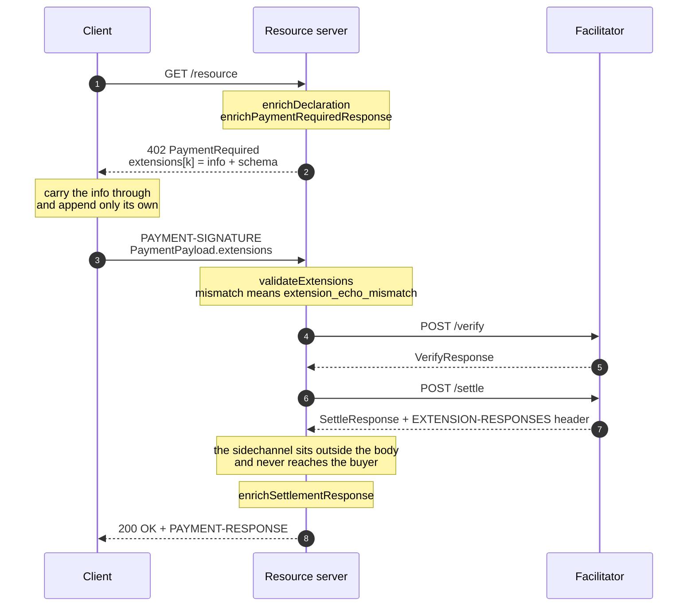
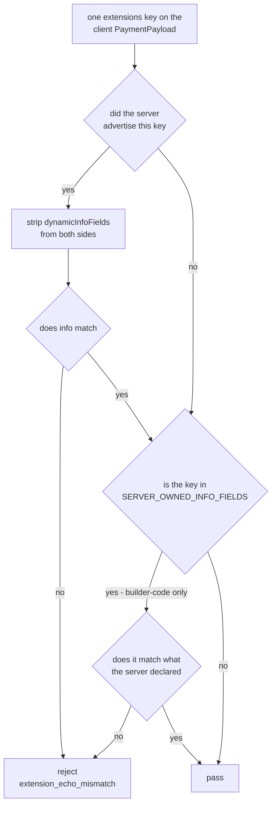
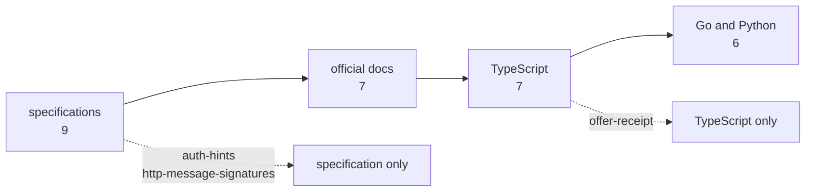
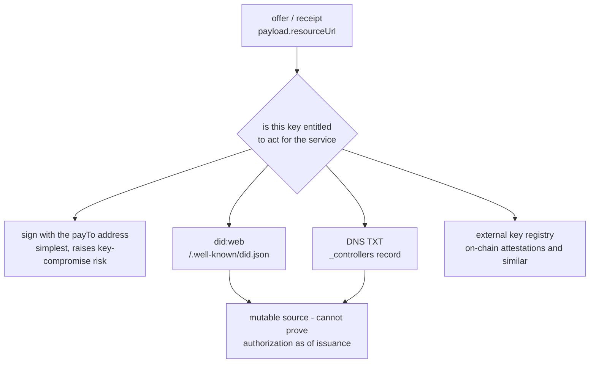

## Abstract

x402 v2 opened a single field, `extensions`, on all four of its payment messages[^s01]. As of September 2026, nine official extension specifications occupy that field[^s16]. This report reads the extension system out of the 2026-09-18 snapshot of the `x402-foundation/x402` repository and catalogues where each of the nine currently stands.

Three findings. The extension system is built for containment more than for extensibility: third-party code runs inside the payment path, but what is paid, to whom, and on which network is pinned by runtime assertions it cannot reach[^s05], and a client echoing the server's declaration back can add to it but never delete or overwrite, on pain of `extension_echo_mismatch`[^s01][^s03]. That containment has an edge. When a client injects an extension key the server never advertised, the match check is skipped entirely, and the only thing standing behind it is a table of field names hand-written into core, a table with exactly one entry: `builder-code`[^s03][^s04]. And the nine extensions are nowhere near equally mature. Six ship in all three SDKs, `offer-receipt` exists only in TypeScript, and `auth-hints` and `http-message-signatures` have neither a documentation page nor a line of code anywhere in the repository[^s02][^s17][^s18][^s19].

Because the request was to work from the current official documentation, we also checked that documentation against the code it describes. Installing the published `@x402/extensions@2.26.0` and inspecting the runtime objects, the hook matrix the docs publish disagrees with the source in 4 of the 15 cells examined when the column names are read strictly; two of those four admit a looser defence and the rest do not. Both gas-sponsoring pages tell readers to use an import path that throws `ERR_PACKAGE_PATH_NOT_EXPORTED`. Scripts and full output are in `working/verify/`.

## 1. What the extension layer inherited

The word "extension" does not appear once in the v1 specification[^s21]. Extensions arrived with v2, and the specification's own version history files them alongside the other breaking changes of v2.0 on 2025-12-09: "CAIP-2 networks, restructured PaymentPayload/Required, ResourceInfo separation, extensions support"[^s06]. The documentation gives the motive as fork avoidance. An extension adds discovery, authentication, receipts, or gas sponsoring "without modifying the core payment flow"[^s02].

What collects in that layer is whatever core declined to specify. Refunds are the clearest case. Across the v1 specification, the v2 specification, and all nine extension specifications, the word "refund" appears **zero times**[^s21][^s01][^s16]. Yet the official third-party extensions page lists two packages built around it: x402r, a "non-custodial refund and arbitration protocol", and zauth, a "monitoring, verification, and refund SDK"[^s15]. A capability the standard left out has been implemented twice outside it.

Idempotency took a similar route. The most systematic external study of x402 characterises the protocol as "not one artefact but a stack of an HTTP semantic, per-chain schemes, and a long tail of SDK and deployment choices"[^s28]. Idempotency caching sits in that tail, and in x402 it is handled by an optional extension, `payment-identifier`[^s11].

This site has already covered the protocol as a whole (April 2026), the Bazaar discovery extension (May 2026), and the SIWX authentication extension (July 2026). Rather than restate those, this report takes the extension **mechanism** and the full nine-item catalogue. That the earlier protocol report described SIWX as a roadmap item with no published specification and no implementation, accurate then and wrong now, is itself a measure of how fast this surface moves.

## 2. Mechanism: advertise, echo, contain

### 2.1 The wire format

`extensions` is a key-value map. The key is an extension identifier; the value carries two fields. `info` holds extension-specific data supplied by the server, and `schema` is a JSON Schema describing the structure of that `info`. The core specification marks both as Required[^s01].

The map appears on four message types. `PaymentRequired`, `PaymentPayload`, `SettleResponse`, and `VerifyResponse` each carry `extensions` as an optional field[^s01]. It starts in the payment-required response, returns in the payment payload, and rides back out on the settlement result.

The return trip has a rule, stated in the specification: servers "advertise supported extensions in `PaymentRequired`, and clients echo them in `PaymentPayload`. The client must include at least the info received; it may append additional info but cannot delete or overwrite existing info"[^s01]. The echo is monotonic.



_Figure 1 — the round trip one extension makes, from its declaration on the 402 response to the settlement reply. Hook names and sidechannel behaviour come from the official documentation and §7.2.1 of the v2 specification[^s01][^s02][^s06]._

### 2.2 Where an extension gets to run

A resource-server extension implements the `ResourceServerExtension` interface. The documentation presents four intervention points: `enrichDeclaration` at route registration, `enrichPaymentRequiredResponse` when the 402 is built, `enrichSettlementResponse` after a payment settles, and `hooks` across the verify/settle lifecycle[^s02]. The actual type definition adds transport-scoped `transportHooks` on top of those[^s05].

The facilitator side is far smaller. The whole interface is `key: string`[^s05]. Gas sponsoring is its representative case, injecting batch-signing capability into settlement so the facilitator can carry the payer's gas[^s02][^s26].

### 2.3 Containment

If extensions execute inside the payment path, the obvious question is whether one can alter the payment terms.

The answer is written into the core type annotations. What `enrichPaymentRequiredResponse` returns is merged into `extensions[key]`. Direct edits to the `accepts` array are allowlisted: a vacant `payTo`, `amount`, or `asset` may be filled, while locked values and `scheme`, `network`, `maxTimeoutSeconds`, and baseline `extra` entries are immutable. `extra.paymentFlow` and `extra.assetTransferMethod` are protocol-reserved and must not be added or changed during enrichment[^s05]. The settlement side works the same way: the facilitator's `success`, `transaction`, and `network` are untouchable, and only `extensions` is merged[^s05].

These are not annotations alone. The server module imports `assertAcceptsAllowlistedAfterExtensionEnrich`, `assertAcceptsAdditiveExtraAfterSchemeEnrich`, `assertAdditivePayloadEnrichment`, and `assertAdditiveSettlementExtra` to compare state before and after enrichment[^s03]. Hook contexts handed to extensions are read-only for core protocol fields, and an extension that wants to stop the flow returns `abort` or `recovered` rather than mutating anything[^s05].

The design points away from delegation. Third parties get execution time inside the payment path, handed over in a shape that cannot move the money.

### 2.4 The sidechannel

Extension outcomes do not travel back from the facilitator in the JSON body. Specification §7.2.1 defines a transport-specific sidechannel, which on HTTP is the `EXTENSION-RESPONSES` header carrying a base64-encoded JSON object keyed by extension name. The specification states twice that this channel is **not** part of the JSON response body and is **not** forwarded to buyers[^s06].

That buyer exclusion is worth pausing on: it presumes operational data flows between facilitator and resource server that the payer is not meant to see. The `VerifyResponse` schema repeats the same boundary, noting that facilitators may expose extension outcomes separately as `extensionResponses`, "never serialized to buyers"[^s01].

Which extensions a facilitator has actually built is public, though. `GET /supported` returns an `extensions` array of "extension identifiers the facilitator has implemented", and the field is Required[^s06].

## 3. The edge of echo validation

The echo rule from §2.1 is enforced, not merely stated. The resource server's `validateExtensions` rejects violations with the reason `extension_echo_mismatch`[^s03]. The same identifier appears in Go's `server.go` and Python's `server_base.py`, so all three SDKs carry the check _(only the TypeScript implementation was read at code level)_.

One exception is structurally necessary. Values the server regenerates on every 402 response, such as nonces and timestamps, were never fixed terms and cannot be required to match. Extensions therefore declare those field names in `dynamicInfoFields`, and the validator strips them from both sides before comparing[^s02][^s05]. SIWX declares `["nonce", "issuedAt", "expirationTime"]`[^s13].

So far so tidy. The edge is just past it.

### 3.1 Keys that were never advertised

`validateExtensions` walks the client's extension keys, and gates the match comparison behind a condition:

```typescript
for (const [key, echoedValue] of Object.entries(clientExtensions)) {
  const advertisedInfo = getExtensionInfo(serverExtensions?.[key]);
  const echoedInfo = getExtensionInfo(echoedValue);

  if (serverExtensions && Object.prototype.hasOwnProperty.call(serverExtensions, key)) {
    // ... strip dynamicInfoFields, compare, fail with extension_echo_mismatch
  }

  const serverOwnedFields = SERVER_OWNED_INFO_FIELDS[key];
  if (serverOwnedFields && !serverOwnedInfoFieldsMatch(advertisedInfo, echoedInfo, serverOwnedFields)) {
    return { valid: false, invalidReason: "extension_echo_mismatch", extensionKey: key };
  }
}
```

The comparison runs only when the server advertised that key[^s03]. A client that invents a key absent from the server's list skips the first branch entirely. What remains is the second check, and that one fires only when the key has an entry in a table called `SERVER_OWNED_INFO_FIELDS`.

Here is the table:

```typescript
export const SERVER_OWNED_INFO_FIELDS: Record<string, ReadonlySet<string>> = {
  "builder-code": new Set(["a"]),
};
```

One entry[^s04]. `ADDITIVE_ARRAY_INFO_FIELDS` and `ADDITIVE_ARRAY_MAX_LENGTHS` in the same file each hold `builder-code` and nothing else. The comments state both the reason and the cost: "core cannot import `@x402/extensions`, so the key/field list is duplicated here", and the length cap is "duplicated from `packages/extensions/src/builder-code/types.ts` and must be kept in sync by hand"[^s04].

Why `builder-code` specifically? The extension appends ERC-8021 Schema 2 attribution codes to settlement calldata, recording on-chain which application exposed the paid endpoint and which facilitator settled it[^s08][^s32]. The `a` field is the app code, which is to say the revenue attribution target. The extension specification is explicit that when the server has not advertised `builder-code`, the client "MUST NOT set" `a`[^s08]. The hardcoded table is that MUST NOT rendered as code.



_Figure 2 — the branches of extension echo validation. The lower-right path is what §3.1 points at: an unadvertised key never reaches the match comparison, and passes unless the hardcoded table happens to name it[^s03][^s04]._

The claim here has to be kept narrow. `validateExtensions` returns `valid` for a payload carrying arbitrary extension keys the server never advertised, provided those keys are absent from the hardcoded table.

Checking the other direction found the resource server tighter than expected. Both the enrichment paths and the hook dispatch iterate over the extensions declared on the route, and hook dispatch carries a guard that returns immediately when `ctx.declaredExtensions[extensionKey] === undefined`[^s03]. A key the client invented triggers no extension code on the server at all. The documentation's "silently ignored"[^s02] is confirmed in code for those two paths at least. What remains is that the payload still travels to the facilitator, which is a separate implementation and outside this report's scope. The validator's verdict is what is asserted here, and nothing about exploitability.

What is worth noticing is the shape of the protection. Because core structurally cannot import the extensions package, per-extension protection rules live in a hand-maintained list rather than a general mechanism. As the catalogue grows and more extensions carry money-bearing fields, that list, which no compiler checks, has to be kept current by people. The comment saying it "must be kept in sync by hand" is the codebase conceding the point[^s04].

The most systematic external security analysis of x402 covers cross-resource substitution, duplicate-settlement races, allowance overdraft, and denial of settlement, but does not take the extensions field or echo validation into scope[^s28]. The reading above therefore has no external corroboration.

## 4. The nine: distance from specification to code

On 2026-09-18 there are nine specifications under `specs/extensions/`[^s16]. The official documentation under `docs/extensions/` covers seven[^s02]. Six are implemented in all three SDKs[^s17][^s18][^s19].

| Extension | Role | Sides | Spec first → last | Docs | TS | Go | Py |
|---|---|---|---|:-:|:-:|:-:|:-:|
| `bazaar` | discovery for paid endpoints and MCP tools[^s35] | server + facilitator | 2026-01-15 → 08-31 | yes | yes | yes | yes |
| `builder-code` | ERC-8021 on-chain attribution | server + client + facilitator | 2026-05-04 → 08-31 | yes | yes | yes | yes |
| `sign-in-with-x` | CAIP-122 wallet authentication[^s27] | server + client | 2026-02-02 → 08-13 | yes | yes | yes | yes |
| `payment-identifier` | idempotency key | server + client | 2026-02-05 → 05-26 | yes | yes | yes | yes |
| `eip2612GasSponsoring` | gasless EIP-2612 permit | facilitator | 2026-01-08 → 03-19 | yes | yes | yes | yes |
| `erc20ApprovalGasSponsoring` | gasless plain ERC-20 approval[^s25] | facilitator | 2026-01-08 → 03-19 | yes | yes | yes | yes |
| `offer-receipt` | signed offers and receipts | server + client | 2026-03-12 → 07-23 | yes | yes | no | no |
| `auth-hints` | per-entry authentication hints | server ↔ client | 2026-04-24 (1 commit) | no | no | no | no |
| `http-message-signatures` | RFC 9421 agent identity | server ↔ client | 2026-04-15 (1 commit) | no | no | no | no |

_Commit counts and dates come from each file's GitHub history[^s33]. Implementation status was taken from the three SDK extension directories and cross-checked by code search[^s17][^s18][^s19]._

Judging implementation from directory names alone invites mistakes, so each result was re-checked by code search. All three spellings (`offer-receipt`, `offerreceipt`, `OfferReceipt`) return no hits under `go/` or `python/`. `auth-hints` and `http-message-signatures` appear nowhere in the repository except their own specification files. One check ran the other way and corrected us: Go's `erc20approvalgassponsor` package has no `facilitator.go`, which initially looked like a missing implementation, but the logic lives in `go/mechanisms/evm/exact/facilitator/erc20_approval.go`. The package layout differs, the capability is there, and the documentation's "TypeScript, Go, Python" is accurate.



_Figure 3 — how many of the nine survive each stage from specification to three-language implementation, with the dropouts named[^s02][^s16][^s17][^s18][^s19]._

### 4.1 The two that stopped

`auth-hints` and `http-message-signatures` each have exactly one commit and have not been touched since they were written[^s33]. Neither has a documentation page or any implementation.

For `auth-hints`, the reason is legible in its own text. The use case it argues from is a `deferred` payment requirement, which "uses off-chain vouchers against an escrow deposit, so the server needs to verify the client's identity to match vouchers to the correct escrow account and track accumulated value"[^s09]. But the schemes in `specs/schemes/` are `auth-capture`, `batch-settlement`, `exact`, and `upto`; there is no `deferred`[^s20]. The scheme it was written for has not landed, so neither has the hint it would need. That reading fits the evidence without being something the project has stated.

`http-message-signatures` is a different case. It establishes the paying agent's identity through RFC 9421 signatures and requires clients to publish keys at `/.well-known/http-message-signatures-directory`[^s10]. Its named deployment is Cloudflare (`cloudflare:402`), using `ed25519` signatures and the `web-bot-auth` tag[^s10]. The absence of an SDK implementation may simply reflect that this extension is absorbed on the network operator's side rather than in the x402 SDKs. That too is inference.

## 5. offer-receipt: when the server starts signing

One of the nine is structurally unlike the rest. Where the others attach data to the payment flow, `offer-receipt` adds a signing direction the protocol did not have.

In core x402, the signer is the client: `signature` and `authorization` on the `PaymentPayload` are produced by the payer[^s01]. `offer-receipt` introduces **server-side signatures**. The resource server cryptographically commits to the terms it presented in `accepts[]`, and after payment and delivery it signs a receipt confirming both[^s07].

The purposes given are dispute evidence, auditability, and user-review attestations of the "I paid and received service" kind[^s07]. An independent Internet-Draft names the same gap from outside the project: x402's `PAYMENT-RESPONSE` "carries a facilitator-issued reference rather than a self-contained, offline-verifiable cryptographic receipt"[^s29]. That is the hole a signed receipt is meant to fill.

### 5.1 Two formats and a pinned chainId

A signed artifact is either EIP-712 or JWS, selected by `format`. Under EIP-712, `payload` is required and `signature` is a 65-byte ECDSA hex string. Under JWS, `payload` must be omitted, since the compact serialization already contains it[^s07].

The EIP-712 domain pins `chainId` to `1` regardless of the payment network, and the specification defends the choice. EIP-712 is used here purely as an off-chain signing format rather than for on-chain submission, the payment network is already identified by the payload's `network` field, and a constant `chainId` makes signing uniform across networks including non-EVM ones such as Solana[^s07].

The canonical `types` and `primaryType` never go on the wire. Signer and verifier each take them from the specification, and because EIP-712 hashes the schema into the signature, any change to them is a breaking change by construction[^s07].

### 5.2 The signature verifies; who vouches for the signer?

Section 4.5.1 is the sharpest passage in the extension. Verifiers must separate signature validity from signer authorization: a valid signature proves that some key signed the artifact, and nothing about whether that key was entitled to act for the service named in `resourceUrl`. In the specification's own words, without that check "an attacker can generate a valid key pair, sign an offer or receipt for any `resourceUrl`, and present it as legitimate — the signature will verify, but the key has no relationship to the service"[^s07].

The specification makes the authorization check a MUST. It then says it "does not mandate a specific authorization mechanism" and lists four options[^s07].



_Figure 4 — the four trust anchors offered by §4.5.1, and the temporal problem attached to two of them. The specification does not pick one[^s07]._

It also flags the follow-on problem itself: mutable sources such as DID documents and DNS records reflect current state only, so an application verifying an artifact after a key rotation should preserve or reference separate evidence that the key was authorized at issuance[^s07].

The gap bites because of what the extension is for. Section 9 states that offer and receipt objects are deliberately self-contained so they can be "lifted verbatim into external proof or attestation formats without reconstruction"[^s07]. Portability is the goal, yet key binding is a per-deployment choice. When two verifiers demand different trust anchors for the same receipt, the artifact travels and the verification result does not.

### 5.3 Declared incomplete

This extension says something about itself that specifications rarely say: "Wire shape and field placement are not considered stable and may change to align with x402 canonical extension architecture once standardized." It separates that from behaviour, which it calls stable, since payload structures, signature formats, and verification rules are normative[^s07].

The version history tops out at 0.6, dated 2026-02-04[^s07]. The file, however, was modified on 2026-07-23. Commit `69652a6` added 12 lines and removed 2, and as the three documentation files changed alongside it indicate, the work was clarifying signer authorization. The version table was not among the files touched[^s34]. The attack scenario quoted in §5.2 above is therefore text the version table does not know about.

Three signals agree: a self-declared instability, a 0.6 version number, and an implementation in one of three SDKs[^s02][^s07][^s17]. Adopting this extension today means writing TypeScript, accepting that the wire shape will move, and choosing a key authorization scheme yourself.

## 6. Documentation against implementation, checked by running it

A report that leans on official documentation should establish whether that documentation matches the code. We installed the published `@x402/extensions@2.26.0` and ran two checks. Scripts and full output are in `working/verify/`.

### 6.1 Import paths

We collected the import paths the seven `docs/extensions/*.mdx` pages give their readers and called `import()` on each.

```
PASS  @x402/extensions/bazaar                          RESOLVES
PASS  @x402/extensions/builder-code                    RESOLVES
PASS  @x402/extensions/payment-identifier              RESOLVES
PASS  @x402/extensions/sign-in-with-x                  RESOLVES
PASS  @x402/extensions/offer-receipt                   RESOLVES
FAIL  @x402/extensions/eip2612-gas-sponsoring          FAILS  (ERR_PACKAGE_PATH_NOT_EXPORTED)
FAIL  @x402/extensions/erc20-approval-gas-sponsoring   FAILS  (ERR_PACKAGE_PATH_NOT_EXPORTED)
```

The import shown in the first code block of both gas-sponsoring pages fails outright[^s23][^s24]. The package's `exports` map defines five subpaths and neither extension is among them[^s22]. The symbols have not gone anywhere: `declareEip2612GasSponsoringExtension` and `declareErc20ApprovalGasSponsoringExtension` both come out of the root barrel `@x402/extensions` normally. The fix is to drop the subpath, but a reader following the documentation meets a runtime error first.

### 6.2 The hook matrix

The overview page carries a table, "Which Hooks Do Extensions Use?", marking which intervention points each extension uses[^s02]. We transcribed that table into code and checked, on the `ResourceServerExtension` objects the published package actually constructs, whether each property exists as a function. Statically exported extensions were inspected directly; SIWX and offer-receipt were instantiated through their factories.

Across three resource-server columns and five extensions, **4 of 15 cells disagree**.

| Extension | Cell | Docs | Code |
|---|---|:-:|:-:|
| `builder-code` | `enrichPaymentRequiredResponse` | present | absent |
| `payment-identifier` | `enrichPaymentRequiredResponse` | present | absent |
| `payment-identifier` | `enrichSettlementResponse` | present | absent |
| `sign-in-with-x` | `enrichPaymentRequiredResponse` | absent | present |

`builder-code` and `payment-identifier` lack hooks the table credits them with; both export an object whose only property is `key`[^s12][^s14].

A reading that defends the table is available for those two rows. The columns are named after hook functions, but what the table meant to mark may be "does this extension contribute at this stage". The annotation in the `builder-code` cell, "(declares app code + schema)", points that way: that is what `declareBuilderCodeExtension()` does at route configuration, and its output does end up in the 402 response. Read loosely, the tick is filed under the wrong column rather than being false.

One cell survives no such reading. `payment-identifier` is credited with `enrichSettlementResponse`, and the package exports a declaration function, the client-side `appendPaymentIdentifierToExtensions`, and extraction and validation utilities, none of which contributes to a settlement response under any interpretation[^s12]. The source comment says as much: "This extension doesn't require any enrichment hooks since the declaration is static"[^s12].

SIWX errs the other way. Its row is empty across all four columns, with a note that "Sign-In-With-X manages its own session lifecycle outside the standard hooks"[^s02]. The real object has `enrichPaymentRequiredResponse`, plus `hooks`, `transportHooks`, and `dynamicInfoFields`[^s13]. The last three have no column in the table at all.

The published interface has the same problem. The documentation reproduces the `ResourceServerExtension` TypeScript definition in full[^s02], omitting the `transportHooks` property and the `onVerifiedPaymentCanceled` hook that the real type file carries. Return types differ too: in the actual definition `onBeforeVerify` and `onBeforeSettle` can return `skip` alongside `abort`, and `onAfterVerify` can return `skipHandler`[^s05].

Whether these gaps mean stale documentation or an implementation that has not caught up is not something the available material settles. The comparison result is what stands.

### 6.3 Where two primary documents disagree

One conflict is not between docs and code but between two specifications. The core v2 Extensions object table marks both `info` and `schema` as Required[^s01]. The `http-message-signatures` specification carries a section headed "Schema Omission" stating that "the `schema` field is optional and may be omitted from responses to reduce header size"[^s10].

The size argument is not frivolous. v2's HTTP transport moved payment data into headers, and a full JSON Schema per extension consumes a great deal of that budget. The specifications have already split along this line in practice: the `payment-identifier` payload example includes `schema`[^s11], while the `eip2612GasSponsoring` payload example carries `info` alone[^s26]. An implementer asking which to follow gets two answers from two primary documents.

## 7. Ecosystem and curation

The documentation maintains a separate page listing six partner-built extensions: World AgentKit (verifying human-backed agents), OMATrust (key authorizations for signed offers and receipts), PEAC Protocol (verifiable receipts), x402r (non-custodial refunds and arbitration), zauth (monitoring, verification, and refunds), and x402aff (affiliate revenue splits via builder codes). All six support TypeScript; only x402aff also ships Python[^s15].

Set that list beside §5 and one correspondence stands out. OMATrust's one-line description is "Key authorizations for Signed Offers and Receipts"[^s15], precisely the slot §4.5.1 marks MUST and then declines to fill[^s07]. A partner product occupying a blank the standard left deliberately is our reading of the pairing, not something either party states. PEAC Protocol, also built around receipts, stands in the same territory.

Getting an extension into the SDK is an open path but not a permissionless one. The documentation's "Building a Custom Extension" ends its six steps with a pull request, noting that "extensions must be reviewed and approved by the x402 maintainers before they are included in the SDK"[^s02]. The registry is curated.

Curation brings throughput with it. On 2026-09-18 there were 43 open pull requests with "extension" in the title, a good share of them asking for one more row in the third-party table. Tollbridge (#3383), Elara (#3469), Mist (#3321), HCRB/Code402 (#3394), MadeOnSol (#3388), AgentGate MCP (#3386), and x402-list (#3337) were all opened in September and all still waiting[^s31]. The published table has six rows; the queue has seven.

New specification proposals are queued too. `trust-provider` (#2300) has been open since 2026-05-14, followed by `authority` (#3220), `durable-evidence` (#3377), and `authorization-evidence` (#3376)[^s31]. Settlement-Receipt Binding (#2666) opened on 2026-06-19 and has been open for over three months. It positions itself as the counterpart to `offer-receipt`: where offers and receipts prove "the server asserted X", this would supply the other half, "X is what settled", recomputably and without operator trust[^s30]. It is an attempt at the same family of problem seen in §5.2.

None of this sits on a small base. `@x402/extensions` was first published on 2025-12-11, has shipped 29 versions, reached 2.26.0 on 2026-09-15, and was downloaded 417,948 times in the month ending 2026-09-16[^s22]. For x402 overall, external analysis reports 130 million cumulative transactions and adoption inside Google Cloud, Cloudflare, and Stripe[^s28]. The extension layer is not a sandbox; it sits on top of deployed code.

## 8. Limitations

- **This is a 2026-09-18 snapshot.** The repository was pushed to the day before, and 43 extension-related pull requests are open. The count of nine and the implementation matrix age within days.
- **The §6.1 import-path defect is specific to 2.26.0.** A later release adding those subpaths removes it. The verification scripts are in `working/verify/` so readers can re-run them against whatever version they have.
- **The §3 account of echo validation rests on the TypeScript implementation only.** The `extension_echo_mismatch` identifier was confirmed present in Go and Python, but whether those implementations carry the same hardcoded tables and the same branch structure was not checked.
- **The unadvertised-key path was not reproduced against a live server.** What is established is that the validator returns `valid` for such a payload. The resource server's enrichment and hook paths were confirmed in code to iterate only over route-declared keys[^s03], but how a facilitator implementation receiving that payload treats an unadvertised key was not investigated.
- **No independent security analysis of the extension layer was found.** The most systematic external study of x402[^s28] covers the HTTP semantic, the schemes, and SDK deployment choices, and leaves the `extensions` field out of scope. The §3 reading has no external corroboration.
- **The containment assertions were not read.** The immutable field list and the assert imports were confirmed; what each function actually checks was not traced. Section 2.3 describes what the code claims rather than what it guarantees.
- **Whether the `offer-receipt` implementation enforces signer authorization was not checked.** Section 5.2 is a specification-level account; how the TypeScript implementation handles the §4.5.1 MUST needs separate work.
- **The six third-party extensions were not assessed for quality or usage.** What was confirmed is that they are listed on the official page and what each project wrote about itself in one line. The OMATrust correspondence in §7 is our interpretation.
- **The three maturity tiers were drawn from file existence.** Whether a one-commit specification is abandoned or simply finished is not something the file answers. For `auth-hints`, the absence of the `deferred` scheme[^s20] supports the abandonment reading as circumstance rather than confirmation; for `http-message-signatures` the explanation offered is closer to speculation.
- **Where `payment-identifier` idempotency is actually enforced was not traced.** The extension object has no hooks, which is confirmed, but whether the deduplication decision then falls to middleware or to the application was not determined.
