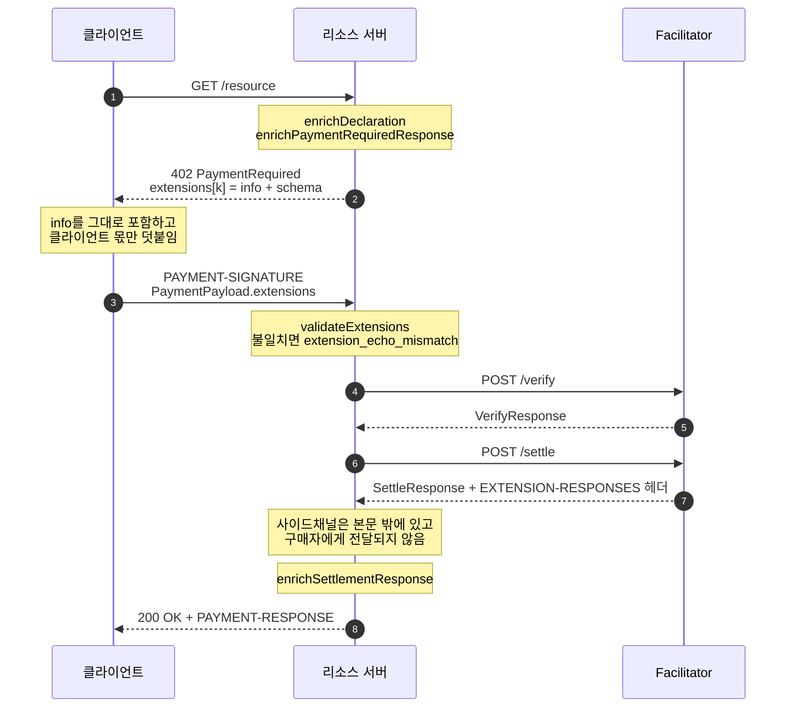
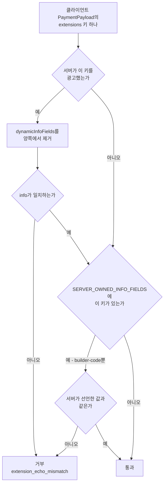
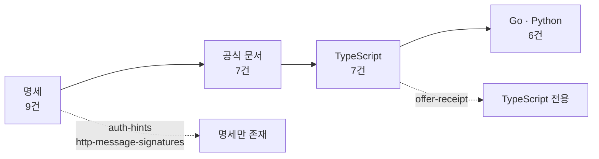
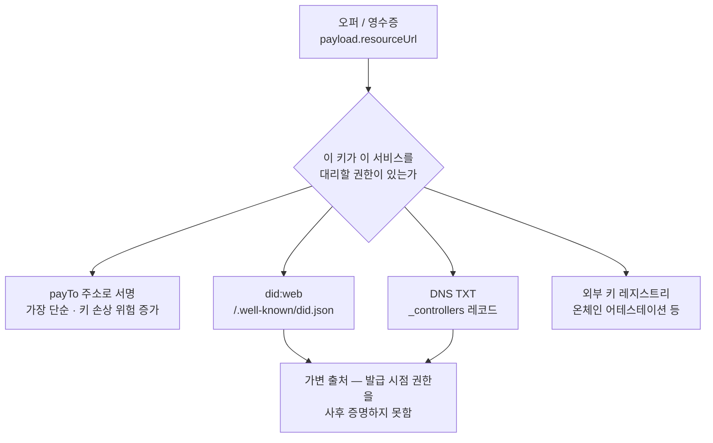

## 초록

x402 v2는 `extensions`라는 필드 하나를 결제 메시지 네 종류에 모두 열어 두었고[^s01], 그 자리에 2026년 9월 현재 아홉 건의 공식 확장 명세가 들어와 있다[^s16]. 본 리포트는 `x402-foundation/x402` 저장소의 2026-09-18 스냅샷을 1차 자료로 삼아 확장 시스템의 작동 방식과 아홉 건의 현재 상태를 정리한다.

세 가지를 주장한다. 첫째, 확장 시스템이 실제로 설계한 것은 확장성보다 **봉쇄**다. 제3자 코드가 결제 경로 한가운데에서 실행되도록 허용하면서, 무엇을·누구에게·어느 네트워크로 지불하는지는 런타임 assertion으로 못 바꾸게 고정한다[^s05]. 클라이언트가 서버의 선언을 되돌려 보낼 때도 삭제·덮어쓰기는 `extension_echo_mismatch`로 거부된다[^s01][^s03]. 둘째, 그 봉쇄에는 명확한 경계가 있다. 서버가 광고하지 않은 확장 키를 클라이언트가 새로 주입하면 일치 검사 자체가 건너뛰어지고, 이를 막는 장치는 코어에 수기로 박아 넣은 필드 목록뿐이며 그 목록에는 `builder-code` 한 건만 올라 있다[^s03][^s04]. 셋째, 아홉 건의 확장은 성숙도가 균일하지 않다. 여섯 건은 세 언어 SDK에 모두 구현되어 있고, `offer-receipt`는 TypeScript에만 있으며, `auth-hints`와 `http-message-signatures`는 명세 파일 외에는 문서 페이지도 구현도 없다[^s02][^s17][^s18][^s19].

공식 문서와 실제 구현의 대조도 함께 수행했다. 배포판 `@x402/extensions@2.26.0`을 설치해 런타임 객체를 조사한 결과, 문서가 게시한 훅 매트릭스는 열 이름을 엄격히 읽을 때 검사한 15개 칸 중 4개가 소스와 어긋났고, 그중 두 칸은 느슨한 독법으로 옹호할 여지가 있으나 나머지는 그렇지 않다. 문서가 두 가스 스폰서링 확장 페이지에서 안내하는 임포트 경로는 `ERR_PACKAGE_PATH_NOT_EXPORTED`로 실패한다. 검증 스크립트와 실행 로그는 `working/verify/`에 있다.

## 1. 확장 레이어가 떠안은 것

x402 v1 명세 전문에는 "extension"이라는 단어가 한 번도 나오지 않는다[^s21]. 확장은 v2가 도입한 것이며, 명세의 버전 이력은 v2.0(2025-12-09)의 변경점으로 "CAIP-2 networks, restructured PaymentPayload/Required, ResourceInfo separation, extensions support"를 나란히 적고 있다[^s06]. 공식 문서는 이 결정의 이유를 포크 회피로 설명한다. 확장은 "코어 결제 흐름을 수정하지 않고" 디스커버리·인증·영수증·가스 스폰서링을 붙이는 자리다[^s02].

그래서 확장 레이어에는 코어가 의도적으로 비워 둔 것들이 모여든다. 환불이 대표적이다. v1 명세, v2 명세, 그리고 확장 명세 아홉 건을 통틀어 "refund"라는 단어는 **한 번도 등장하지 않는다**[^s21][^s01][^s16]. 그런데 공식 문서의 서드파티 확장 표에는 환불을 표방하는 패키지가 둘 있다. x402r은 "비수탁 환불·중재 프로토콜", zauth는 "모니터링·검증·환불 SDK"로 등재되어 있다[^s15]. 표준이 다루지 않기로 한 기능이 표준 바깥 생태계에서 두 번 구현된 셈이다.

멱등성도 비슷한 경로를 밟았다. x402를 체계적으로 분석한 외부 연구는 이 프로토콜을 "하나의 산출물이 아니라 HTTP 의미론, 체인별 스킴, 그리고 SDK와 배포 선택의 긴 꼬리가 쌓인 스택"으로 규정한다[^s28]. 멱등성 캐싱은 그 꼬리 쪽에 놓인 항목이고, x402에서는 `payment-identifier`라는 선택적 확장이 그 자리를 맡는다[^s11].

본 사이트는 x402 프로토콜 전반(2026-04), Bazaar 디스커버리 확장(2026-05), SIWX 인증 확장(2026-07)을 이미 다뤘다. 본 리포트는 개별 확장의 내부 구현을 다시 쓰지 않고, 확장 **메커니즘 자체**와 아홉 건 전수 카탈로그에 집중한다. 앞선 프로토콜 리포트가 SIWX를 "명세도 구현도 없는 로드맵 항목"으로 기술한 것은 당시로서는 맞았고 지금은 틀렸다는 사실이, 이 영역이 얼마나 빨리 움직이는지를 보여 준다.

## 2. 메커니즘 — 광고, 에코, 봉쇄

### 2.1 와이어 포맷

`extensions`는 키-값 맵이다. 키는 확장 식별자이고, 값은 두 필드를 갖는다. `info`는 서버가 제공하는 확장별 데이터이고, `schema`는 그 `info`의 구조를 규정하는 JSON Schema다. 코어 명세는 두 필드를 모두 Required로 표기한다[^s01].

이 맵은 결제 메시지 네 종류에 모두 존재한다. `PaymentRequired`, `PaymentPayload`, `SettleResponse`, `VerifyResponse` 각각이 선택 필드로 `extensions`를 갖는다[^s01]. 결제 요구 응답에서 시작해 결제 페이로드로 되돌아오고, 정산 결과에 다시 실려 나가는 왕복 구조다.

왕복에는 규칙이 있다. 명세의 문장은 이렇다. "서버는 `PaymentRequired`에서 지원 확장을 광고하고 클라이언트는 `PaymentPayload`에서 이를 에코한다. 클라이언트는 받은 정보를 최소한 그대로 포함해야 하며, 추가는 가능하지만 기존 정보를 삭제하거나 덮어쓸 수 없다"[^s01]. 단조 증가만 허용하는 에코다.



_Figure 1 — 확장 하나가 402 응답에서 선언되어 정산 응답까지 오가는 경로. 훅 이름과 사이드채널 동작은 공식 문서와 v2 명세 §7.2.1에 근거한다[^s01][^s02][^s06]._

### 2.2 개입 지점

리소스 서버 확장은 `ResourceServerExtension` 인터페이스를 구현한다. 문서가 소개하는 개입 지점은 넷이다. 라우트 등록 시점의 `enrichDeclaration`, 402 응답 생성 시점의 `enrichPaymentRequiredResponse`, 정산 성공 후의 `enrichSettlementResponse`, 그리고 verify/settle 생애주기에 걸리는 `hooks`다[^s02]. 실제 타입 정의에는 여기에 전송 계층별 `transportHooks`가 더 있다[^s05].

Facilitator 확장은 훨씬 작다. 인터페이스 전체가 `key: string` 하나다[^s05]. 가스 스폰서링 확장이 이쪽의 대표 사례로, 정산 흐름에 배치 서명 능력을 주입해 facilitator가 지급인 대신 가스를 부담하게 한다[^s02][^s26].

### 2.3 봉쇄

확장이 결제 경로 한가운데에서 실행된다면 당연히 떠오르는 질문이 있다. 확장이 결제 조건 자체를 바꿀 수 있는가.

답은 코어 타입 정의의 주석에 명시되어 있다. `enrichPaymentRequiredResponse`의 반환값은 `extensions[key]`로 병합된다. `accepts` 배열에 대한 직접 수정은 허용 목록 방식이다. 비어 있는 `payTo`·`amount`·`asset`은 채울 수 있지만, 이미 정해진 값과 `scheme`·`network`·`maxTimeoutSeconds`·기존 `extra` 항목은 불변이다. `extra.paymentFlow`와 `extra.assetTransferMethod`는 프로토콜 예약어로, enrich 중에 추가하거나 변경해서는 안 된다[^s05]. `enrichSettlementResponse` 쪽도 같은 성격이다. facilitator가 채운 `success`·`transaction`·`network`는 손댈 수 없고 `extensions`만 병합된다[^s05].

이 규칙들은 주석으로만 존재하지 않는다. 서버 모듈은 `assertAcceptsAllowlistedAfterExtensionEnrich`, `assertAcceptsAdditiveExtraAfterSchemeEnrich`, `assertAdditivePayloadEnrichment`, `assertAdditiveSettlementExtra`를 임포트해 enrich 전후를 대조한다[^s03]. 확장에 넘겨지는 훅 컨텍스트도 코어 프로토콜 필드에 대해서는 읽기 전용이며, 확장이 흐름을 멈추고 싶으면 객체를 변형하는 대신 `abort`나 `recovered` 반환값을 써야 한다[^s05].

설계 의도는 권한 위임의 반대쪽에 있다. 제3자에게 결제 경로의 실행 시간을 내주되, 돈의 방향과 크기는 건드릴 수 없는 형태로 내준다.

### 2.4 사이드채널

facilitator가 확장 처리 결과를 돌려주는 경로는 JSON 본문이 아니다. 명세 §7.2.1은 이를 "전송 계층별 사이드채널"로 정의하고, HTTP에서는 `EXTENSION-RESPONSES` 헤더가 그 역할을 한다. 값은 확장 이름을 키로 갖는 JSON 객체를 base64로 인코딩한 것이다. 명세는 이 채널이 "JSON 응답 본문의 일부가 **아니며** 구매자에게 전달되지 **않는다**"고 두 번 강조한다[^s06].

구매자 비노출이 명시적 요건이라는 점은 눈여겨볼 만하다. facilitator와 리소스 서버 사이에는 지급인이 보아서는 안 되는 운영 정보가 오간다는 전제가 깔려 있다. `VerifyResponse` 스키마 설명도 같은 구분을 반복한다. facilitator는 확장 결과를 `extensions`와 별도로 `extensionResponses`에 노출할 수 있고, 이 값은 "구매자에게 직렬화되지 않는다"[^s01].

한편 facilitator가 어떤 확장을 실제로 구현했는지는 `GET /supported`가 공개한다. 응답의 `extensions`는 "facilitator가 구현한 확장 식별자 배열"이며 Required 필드다[^s06].

## 3. 에코 검증의 경계

§2.1의 에코 규칙은 문장으로만 존재하는 규범이 아니다. 리소스 서버의 `validateExtensions`가 이를 강제하고, 위반 시 `extension_echo_mismatch` 사유로 거부한다[^s03]. 같은 식별자가 Go의 `server.go`와 Python의 `server_base.py`에도 존재하므로 세 언어 SDK가 모두 이 검사를 갖고 있다 _(TypeScript 구현만 코드 수준으로 대조했다)_.

검사에는 예외가 하나 필요하다. 서버가 매 402 응답마다 새로 만드는 값, 곧 논스나 타임스탬프는 애초에 고정된 약정이 아니므로 일치를 요구할 수 없다. 이를 위해 확장은 `dynamicInfoFields`에 해당 필드명을 선언하고, 검증기는 비교 전에 그 필드들을 양쪽에서 제거한다[^s02][^s05]. SIWX가 `["nonce", "issuedAt", "expirationTime"]`을 선언하는 것이 그 예다[^s13].

여기까지는 깔끔하다. 경계는 그다음에 있다.

### 3.1 광고되지 않은 키

`validateExtensions`는 클라이언트가 보낸 확장 키들을 순회하면서, 일치 검사에 들어가기 전에 조건 하나를 건다.

```typescript
for (const [key, echoedValue] of Object.entries(clientExtensions)) {
  const advertisedInfo = getExtensionInfo(serverExtensions?.[key]);
  const echoedInfo = getExtensionInfo(echoedValue);

  if (serverExtensions && Object.prototype.hasOwnProperty.call(serverExtensions, key)) {
    // ... dynamicInfoFields 제거 후 일치 비교, 실패 시 extension_echo_mismatch
  }

  const serverOwnedFields = SERVER_OWNED_INFO_FIELDS[key];
  if (serverOwnedFields && !serverOwnedInfoFieldsMatch(advertisedInfo, echoedInfo, serverOwnedFields)) {
    return { valid: false, invalidReason: "extension_echo_mismatch", extensionKey: key };
  }
}
```

서버가 그 키를 광고한 경우에만 일치 비교가 돌아간다[^s03]. 클라이언트가 서버 광고 목록에 없던 키를 새로 만들어 넣으면 첫 번째 분기는 통째로 건너뛴다. 남는 방어선은 두 번째 검사인데, 이쪽은 `SERVER_OWNED_INFO_FIELDS`라는 테이블에 해당 키가 등재되어 있을 때만 작동한다.

그 테이블의 내용은 이렇다.

```typescript
export const SERVER_OWNED_INFO_FIELDS: Record<string, ReadonlySet<string>> = {
  "builder-code": new Set(["a"]),
};
```

항목이 하나다[^s04]. 같은 파일의 `ADDITIVE_ARRAY_INFO_FIELDS`와 `ADDITIVE_ARRAY_MAX_LENGTHS`도 각각 `builder-code` 한 건만 담고 있다. 주석은 그 이유와 대가를 함께 적어 두었다. "코어는 `@x402/extensions`를 임포트할 수 없으므로 키/필드 목록을 여기에 복제한다", 그리고 최대 길이 값은 확장 패키지의 상수에서 "복제한 것이며 수기로 동기화해야 한다"[^s04].

왜 하필 `builder-code`인가. 이 확장은 ERC-8021 Schema 2 형식의 귀속 코드를 정산 트랜잭션 calldata에 덧붙여, 어떤 애플리케이션이 그 유료 엔드포인트를 노출했고 어떤 facilitator가 정산했는지를 온체인에 남긴다[^s08][^s32]. `a` 필드는 애플리케이션 코드, 곧 수익 귀속의 대상이다. 확장 명세는 서버가 `builder-code`를 광고하지 않았다면 클라이언트는 `a`를 "설정해서는 안 된다(MUST NOT set)"고 못 박는다[^s08]. 코어의 하드코딩은 그 MUST NOT을 코드로 옮긴 것이다.



_Figure 2 — 확장 에코 검증의 분기. 오른쪽 아래 경로가 §3.1이 가리키는 지점이다. 광고되지 않은 키는 일치 비교를 거치지 않고, 하드코딩 테이블에 없으면 그대로 통과한다[^s03][^s04]._

이 구조가 뜻하는 바는 좁게 말해야 한다. `validateExtensions`는 서버가 광고하지 않은 임의의 확장 키를 담은 페이로드를 `valid`로 판정한다. 그 키가 하드코딩 테이블에 없는 한 그렇다.

반대 방향으로도 확인해 봤고, 리소스 서버 쪽은 생각보다 촘촘했다. enrich 경로와 훅 실행 경로는 모두 라우트에 선언된 확장(`declaredExtensions`)을 기준으로 순회하며, 훅 디스패치에는 `ctx.declaredExtensions[extensionKey] === undefined`면 즉시 반환하는 가드가 걸려 있다[^s03]. 클라이언트가 지어낸 키는 서버에서 어떤 확장 코드도 실행시키지 못한다. 문서가 말한 "조용히 무시된다"[^s02]는 서술은 적어도 이 두 경로에 대해서는 코드로 확인된다. 남는 것은 그 페이로드가 facilitator로 그대로 전달된다는 사실이고, facilitator는 별개의 구현이므로 본 리포트의 범위 밖이다. 검증 함수의 판정까지만 주장하고 악용 가능성은 주장하지 않는다.

주목할 점은 보호 방식 자체다. 코어는 확장 패키지를 임포트할 수 없다는 구조적 제약 때문에, 확장별 보호 규칙이 일반화된 메커니즘 대신 손으로 관리하는 목록에 들어가 있다. 확장이 열 건, 스무 건으로 늘고 그중 돈이 걸린 필드가 여럿이 되면, 컴파일러가 검사해 주지 않는 이 목록을 사람이 계속 맞춰야 한다. 소스 주석이 "수기로 동기화해야 한다"고 적은 것은 그 부담을 스스로 인정한 문장이다[^s04].

x402에 대한 가장 체계적인 외부 보안 분석은 교차 리소스 치환, 중복 정산 경쟁, 허용량 초과, 정산 거부의 네 결함군을 다루지만 확장 필드와 에코 검증은 분석 범위에 넣지 않았다[^s28]. 위 서술이 필자의 코드 독해에 머물러 있고 외부 교차검증이 없다는 뜻이다.

## 4. 확장 9종 — 명세에서 구현까지

2026-09-18 기준 `specs/extensions/`에는 명세가 아홉 건 있다[^s16]. 공식 문서 `docs/extensions/`가 다루는 것은 일곱 건이다[^s02]. 세 언어 SDK 전부에 구현이 있는 것은 여섯 건이다[^s17][^s18][^s19].

| 확장 | 역할 | 주체 | 명세 최초 → 최종 | 문서 | TS | Go | Py |
|---|---|---|---|:-:|:-:|:-:|:-:|
| `bazaar` | 유료 엔드포인트·MCP 툴 디스커버리[^s35] | 서버 + facilitator | 2026-01-15 → 08-31 | ○ | ○ | ○ | ○ |
| `builder-code` | ERC-8021 온체인 귀속 | 서버 + 클라이언트 + facilitator | 2026-05-04 → 08-31 | ○ | ○ | ○ | ○ |
| `sign-in-with-x` | CAIP-122 지갑 인증[^s27] | 서버 + 클라이언트 | 2026-02-02 → 08-13 | ○ | ○ | ○ | ○ |
| `payment-identifier` | 멱등성 키 | 서버 + 클라이언트 | 2026-02-05 → 05-26 | ○ | ○ | ○ | ○ |
| `eip2612GasSponsoring` | EIP-2612 퍼밋 가스 대납 | facilitator | 2026-01-08 → 03-19 | ○ | ○ | ○ | ○ |
| `erc20ApprovalGasSponsoring` | 일반 ERC-20 승인 가스 대납[^s25] | facilitator | 2026-01-08 → 03-19 | ○ | ○ | ○ | ○ |
| `offer-receipt` | 서명된 오퍼·영수증 | 서버 + 클라이언트 | 2026-03-12 → 07-23 | ○ | ○ | ✕ | ✕ |
| `auth-hints` | 항목별 인증 힌트 | 서버 ↔ 클라이언트 | 2026-04-24 (커밋 1건) | ✕ | ✕ | ✕ | ✕ |
| `http-message-signatures` | RFC 9421 에이전트 신원 | 서버 ↔ 클라이언트 | 2026-04-15 (커밋 1건) | ✕ | ✕ | ✕ | ✕ |

_명세 커밋 이력은 파일별 GitHub 이력에서 집계했다[^s33]. 구현 여부는 세 언어의 확장 디렉터리 목록과 코드 검색으로 교차 확인했다[^s17][^s18][^s19]._

구현 여부를 디렉터리 이름만으로 판정하면 오답이 나올 수 있어 코드 검색으로 재확인했다. `offer-receipt`·`offerreceipt`·`OfferReceipt` 세 철자 모두 `go/`와 `python/`에서 히트가 없다. `auth-hints`와 `http-message-signatures`는 저장소 전체에서 자기 명세 파일 외에 나타나지 않는다. 반대 방향의 오판도 한 건 있었다. Go의 `erc20approvalgassponsor` 패키지에는 `facilitator.go`가 없어 처음에는 구현 누락으로 보였으나, 해당 로직은 `go/mechanisms/evm/exact/facilitator/erc20_approval.go`에 있었다. 패키지 배치가 다를 뿐 기능은 갖춰져 있고, 문서의 "TypeScript, Go, Python" 표기는 정확하다.



_Figure 3 — 명세에서 세 언어 구현까지의 통과 인원. 이탈 지점에서 빠진 확장 이름을 함께 표시했다[^s02][^s16][^s17][^s18][^s19]._

### 4.1 멈춘 두 건

남은 두 건은 명세 커밋이 각각 한 건뿐이고 작성된 이후 손댄 흔적이 없다[^s33]. 둘 다 문서 페이지가 없으며 어느 SDK에도 구현이 없다.

`auth-hints` 쪽은 멈춘 이유를 명세 본문에서 읽을 수 있다. 이 확장이 존재 이유로 드는 사례는 `deferred` 결제 요구사항이다. "off-chain 바우처를 에스크로 예치금에 대해 사용하므로 서버가 클라이언트 신원을 확인해 바우처를 올바른 에스크로 계정에 대응시키고 누적 가치를 추적해야 한다"는 것이다[^s09]. 그런데 `specs/schemes/`에 있는 스킴은 `auth-capture`, `batch-settlement`, `exact`, `upto` 넷이고 `deferred`는 없다[^s20]. 전제한 스킴이 아직 표준에 들어오지 않았으니 그 스킴이 필요로 하는 인증 힌트도 구현할 대상이 없다. 정황상 자연스러운 설명이지만, 프로젝트가 밝힌 의도는 아니다.

`http-message-signatures`는 사정이 다르다. 이 확장은 RFC 9421 HTTP 메시지 서명으로 지급 에이전트의 신원을 세우고, 클라이언트가 `/.well-known/http-message-signatures-directory`에 공개키를 게시하도록 요구한다[^s10]. 명세는 사용 사례로 Cloudflare(`cloudflare:402`)가 `ed25519` 서명과 `web-bot-auth` 태그로 이를 쓴다고 적는다[^s10]. SDK 구현이 없는 것은 이 확장이 x402 SDK가 아니라 네트워크 사업자 쪽에서 소화되는 성격이기 때문일 수 있다. 이 역시 추론이다.

## 5. offer-receipt — 서버가 서명하기 시작할 때

아홉 건 가운데 `offer-receipt`만 성격이 다르다. 나머지가 결제 흐름에 부가 데이터를 얹는다면, 이쪽은 프로토콜의 서명 구조를 한 방향 더 늘린다.

x402의 코어 결제 흐름에서 서명하는 쪽은 클라이언트다. `PaymentPayload`의 `signature`와 `authorization`은 지급인이 만든다[^s01]. `offer-receipt`는 여기에 **서버 측 서명**을 도입한다. 리소스 서버가 `accepts[]`에 제시한 결제 조건에 암호학적으로 약정하고(서명된 오퍼), 결제와 서비스 전달이 끝난 뒤 그 사실을 확인하는 영수증에 서명한다[^s07].

용도는 분쟁 증거, 감사, 그리고 "결제하고 서비스를 받았다"는 이용자 후기형 증명이다[^s07]. 독립적인 인터넷 드래프트 하나가 같은 공백을 지적한다. x402의 `PAYMENT-RESPONSE`는 "자체 완결적이고 오프라인 검증 가능한 암호학적 영수증이 아니라 facilitator가 발급한 참조값을 담는다"는 것이다[^s29]. 서명된 영수증이 메우려는 자리가 바로 여기다.

### 5.1 두 포맷과 고정된 chainId

서명 아티팩트는 `format` 값에 따라 EIP-712와 JWS 중 하나를 쓴다. EIP-712면 `payload`가 필수이고 `signature`는 65바이트 ECDSA 헥스다. JWS면 `payload`를 생략해야 하며, 컴팩트 직렬화 문자열 안에 이미 페이로드가 들어 있기 때문이다[^s07].

EIP-712 도메인의 `chainId`는 결제 네트워크와 무관하게 `1`로 고정된다. 명세는 이를 의도된 선택이라고 밝힌다. 여기서 EIP-712는 온체인 제출과 무관하게 순수한 오프체인 서명 포맷으로만 쓰이고, 결제 네트워크는 페이로드의 `network` 필드가 이미 식별한다. 상수 `chainId`를 쓰면 Solana 같은 비EVM 네트워크를 포함해 어디서든 서명 방식이 동일해진다[^s07].

정규 `types`와 `primaryType`은 와이어에 실리지 않는다. 명세가 규정한 정의를 서명자와 검증자가 각각 가져다 쓰며, EIP-712가 스키마를 서명 해시에 포함하므로 스키마 변경은 곧 파괴적 변경이 된다[^s07].

### 5.2 서명은 검증되는데 권한은 누가 보증하나

명세 §4.5.1은 이 확장에서 가장 날카로운 대목이다. 검증자는 서명 유효성과 서명자 권한을 구분해야 한다는 것이다. 유효한 서명은 특정 키가 그 아티팩트에 서명했다는 사실만 증명하며, 그 키가 `resourceUrl`이 가리키는 서비스를 대신할 권한이 있었는지는 증명하지 않는다. 명세의 표현을 그대로 옮기면, 권한 검증이 없을 때 "공격자는 유효한 키 쌍을 만들어 임의의 `resourceUrl`에 대한 오퍼나 영수증에 서명하고 이를 정당한 것처럼 제시할 수 있다. 서명은 검증에 통과하지만 그 키는 해당 서비스와 아무 관계가 없다"[^s07].

명세는 권한 확인을 MUST로 요구한다. 그러면서 "특정 권한 부여 메커니즘을 의무화하지 않는다"고 덧붙이고, 네 가지 접근법을 나열하는 데서 멈춘다[^s07].



_Figure 4 — 명세 §4.5.1이 제시하는 네 가지 신뢰 앵커와, 그중 둘에 붙는 시점 문제. 명세는 택일을 규정하지 않는다[^s07]._

명세 스스로 남긴 후속 문제도 있다. did:web 문서나 DNS 레코드 같은 가변 출처는 현재 상태만 반영하므로, 키 교체 이후에 오퍼나 영수증을 검증하는 애플리케이션은 발급 시점에 그 키가 권한을 가졌다는 증거를 따로 보존하거나 참조해야 한다[^s07].

이 공백이 실질적인 이유는 이 확장이 내건 목표 때문이다. 명세 §9는 오퍼와 영수증 객체가 "재구성 없이 외부 증명·어테스테이션 포맷으로 그대로 들어 올려질 수 있도록" 자족적으로 설계되었다고 밝힌다[^s07]. 이식성이 목표인데 키 바인딩 방식은 배포마다 다르다. 서로 다른 검증자가 같은 영수증을 놓고 서로 다른 신뢰 앵커를 요구하면, 아티팩트는 이식 가능해도 검증 결과는 이식되지 않는다.

### 5.3 스스로 밝힌 미완성

이 확장의 §2는 흔치 않은 문장을 담고 있다. "와이어 형태와 필드 배치는 안정적인 것으로 간주되지 않으며, x402의 정규 확장 아키텍처가 표준화되면 그에 맞춰 바뀔 수 있다." 다만 "동작 요구사항은 안정적"이며 페이로드 구조·서명 포맷·검증 규칙은 규범이라고 구분한다[^s07].

버전 이력의 최신 항목은 0.6(2026-02-04)이다[^s07]. 그런데 파일은 2026-07-23에 수정되었다. 그 커밋 `69652a6`은 명세에 12줄을 더하고 2줄을 지웠으며, 함께 바뀐 세 개의 문서 파일 제목이 말하듯 서명자 권한을 명확히 하는 작업이었다. 버전 이력 표는 그 변경 대상에 들어 있지 않았다[^s34]. 방금 §5.2에서 인용한 공격 시나리오 문장은 버전 표가 알지 못하는 내용인 셈이다.

세 신호가 같은 방향을 가리킨다. 자체 선언한 불안정성, 0.6이라는 번호, 그리고 세 SDK 중 하나에만 있는 구현이다[^s02][^s07][^s17]. 이 확장을 지금 채택하는 쪽은 TypeScript를 쓰고, 와이어 형태가 바뀔 것을 감수하고, 키 권한 부여 방식을 직접 골라야 한다.

## 6. 문서와 구현 대조 — 실행으로 확인한 것

공식 문서를 근거로 쓰는 리포트라면 그 문서가 실제 코드와 맞는지 확인하는 편이 낫다. 배포판 `@x402/extensions@2.26.0`을 설치해 두 가지를 검사했다. 스크립트와 전체 실행 로그는 `working/verify/`에 있다.

### 6.1 임포트 경로

`docs/extensions/*.mdx` 일곱 페이지가 독자에게 안내하는 임포트 경로를 모아 실제로 `import()` 해 보았다.

```
PASS  @x402/extensions/bazaar                          RESOLVES
PASS  @x402/extensions/builder-code                    RESOLVES
PASS  @x402/extensions/payment-identifier              RESOLVES
PASS  @x402/extensions/sign-in-with-x                  RESOLVES
PASS  @x402/extensions/offer-receipt                   RESOLVES
FAIL  @x402/extensions/eip2612-gas-sponsoring          FAILS  (ERR_PACKAGE_PATH_NOT_EXPORTED)
FAIL  @x402/extensions/erc20-approval-gas-sponsoring   FAILS  (ERR_PACKAGE_PATH_NOT_EXPORTED)
```

두 가스 스폰서링 페이지가 첫 코드 블록에서 제시하는 임포트가 그대로 실패한다[^s23][^s24]. 패키지의 `exports` 맵에는 서브패스가 다섯 개뿐이고 두 확장은 거기에 없다[^s22]. 심볼 자체는 사라지지 않았다. `declareEip2612GasSponsoringExtension`과 `declareErc20ApprovalGasSponsoringExtension` 모두 루트 배럴 `@x402/extensions`에서 정상적으로 나온다. 고칠 방법은 임포트 경로에서 서브패스를 떼는 것뿐이지만, 문서만 보고 따라 한 독자는 런타임 오류를 먼저 만난다.

### 6.2 훅 매트릭스

문서 overview에는 "Which Hooks Do Extensions Use?"라는 표가 있어 확장별로 어떤 개입 지점을 쓰는지 표시한다[^s02]. 이 표를 코드로 옮겨 적고, 배포판이 실제로 만들어 내는 `ResourceServerExtension` 객체에 해당 속성이 함수로 존재하는지 대조했다. 정적으로 내보내는 확장은 그대로 조사하고, SIWX와 offer-receipt는 팩토리를 호출해 인스턴스를 만들었다.

리소스 서버 쪽 세 열, 다섯 개 확장, 열다섯 칸 중 **네 칸이 어긋난다**.

| 확장 | 칸 | 문서 | 코드 |
|---|---|:-:|:-:|
| `builder-code` | `enrichPaymentRequiredResponse` | 있음 | 없음 |
| `payment-identifier` | `enrichPaymentRequiredResponse` | 있음 | 없음 |
| `payment-identifier` | `enrichSettlementResponse` | 있음 | 없음 |
| `sign-in-with-x` | `enrichPaymentRequiredResponse` | 없음 | 있음 |

`builder-code`와 `payment-identifier`는 문서가 있다고 한 훅이 없다. 두 확장 모두 내보내는 객체는 `key` 하나뿐이다[^s12][^s14].

이 두 행에 대해서는 표를 옹호하는 독법이 하나 가능하다. 열 이름은 훅 함수명이지만, 표가 실제로 표시하려던 것이 "이 확장이 해당 단계에 내용을 보태는가"였을 수도 있다. `builder-code` 칸에 붙은 "(declares app code + schema)"라는 주석이 그 쪽을 시사한다. 그것은 `declareBuilderCodeExtension()`이 라우트 설정 시점에 하는 일이고, 결과물이 402 응답에 실리는 것은 사실이다. 느슨하게 읽으면 칸의 위치가 어긋났을 뿐 내용은 틀리지 않았다고 볼 수 있다.

그 독법으로도 구제되지 않는 칸이 하나 있다. `payment-identifier`의 `enrichSettlementResponse`다. 이 패키지가 내보내는 것은 선언 함수, 클라이언트 측 `appendPaymentIdentifierToExtensions`, 그리고 추출·검증 유틸리티가 전부이며, 정산 응답에 무언가를 보태는 경로는 어느 독법으로도 존재하지 않는다[^s12]. 소스 주석도 "이 확장은 선언이 정적이므로 enrichment 훅이 필요하지 않다"고 적어 표와 정면으로 어긋난다[^s12].

SIWX는 반대 방향이다. 문서 표의 SIWX 행은 네 칸이 모두 비어 있고, 표 아래 설명은 "SIWX는 표준 훅 바깥에서 자체 세션 생애주기를 관리한다"고 덧붙인다[^s02]. 실제 객체에는 `enrichPaymentRequiredResponse`가 있고, 그 위에 `hooks`와 `transportHooks`와 `dynamicInfoFields`까지 달려 있다[^s13]. 뒤의 세 가지는 문서 표에 해당 열 자체가 없다.

같은 문제가 인터페이스 정의에도 있다. 문서는 `ResourceServerExtension`의 TypeScript 정의를 본문에 통째로 게시하는데[^s02], 실제 타입 파일에 있는 `transportHooks` 속성과 훅 인터페이스의 `onVerifiedPaymentCanceled`가 빠져 있다. 훅의 반환 타입도 다르다. 실제 정의에서 `onBeforeVerify`와 `onBeforeSettle`은 `abort` 외에 `skip`을, `onAfterVerify`는 `skipHandler`를 반환할 수 있다[^s05].

이 불일치들이 문서가 낡은 결과인지 구현이 문서를 아직 따라잡지 못한 결과인지는 자료로 가릴 수 없다. 확인되는 사실은 대조 결과 자체다.

### 6.3 명세끼리의 충돌

한 가지는 코드가 아니라 1차 문서 두 건 사이에서 갈린다. 코어 v2 명세의 Extensions 객체 표는 `info`와 `schema`를 모두 Required로 적는다[^s01]. 반면 `http-message-signatures` 명세에는 "Schema Omission"이라는 절이 따로 있고, "`schema` 필드는 선택적이며 헤더 크기를 줄이기 위해 응답에서 생략할 수 있다"고 규정한다[^s10].

헤더 크기를 이유로 든 것은 근거가 있다. v2의 HTTP 전송은 결제 데이터를 헤더로 옮겼고, JSON Schema를 통째로 실으면 확장 하나가 헤더 예산을 크게 잡아먹는다. 실제 명세들도 이미 양쪽으로 갈려 있다. `payment-identifier`의 페이로드 예시는 `schema`를 포함하는데[^s11], `eip2612GasSponsoring`의 페이로드 예시는 `info`만 담고 `schema`를 생략한다[^s26]. 구현자가 어느 쪽을 따라야 하는지를 두 1차 문서가 서로 다르게 답하고 있다.

## 7. 생태계와 큐레이션

공식 문서는 파트너가 만든 서드파티 확장 여섯 건을 별도 페이지에 등재한다. World AgentKit(인간 기반 에이전트 검증), OMATrust(서명된 오퍼·영수증의 키 권한 부여), PEAC Protocol(검증 가능한 영수증), x402r(비수탁 환불·중재), zauth(모니터링·검증·환불), x402aff(빌더 코드 기반 제휴 수익 분배)다. 여섯 건 모두 TypeScript를 지원하고, x402aff만 Python을 함께 제공한다[^s15].

이 목록을 §5와 나란히 놓으면 눈에 띄는 대응이 있다. OMATrust의 한 줄 설명은 "Key authorizations for Signed Offers and Receipts"다[^s15]. 명세 §4.5.1이 MUST로 요구하면서 메커니즘은 규정하지 않고 남긴 바로 그 자리다[^s07]. 표준이 비워 둔 칸을 파트너 제품이 채우는 구조이며, 이는 필자의 대응 해석이지 프로젝트의 설명은 아니다. PEAC Protocol도 영수증을 표방하므로 같은 영역에 둘이 서 있다.

확장을 SDK에 넣는 경로는 열려 있지만 무허가는 아니다. 문서의 "Building a Custom Extension"은 여섯 단계로 끝나는데, 마지막이 저장소에 풀 리퀘스트를 내는 것이고 "확장은 SDK에 포함되기 전에 x402 메인테이너의 검토와 승인을 받아야 한다"고 명시한다[^s02]. 큐레이션형 레지스트리다.

큐레이션에는 처리량이 따라붙는다. 2026-09-18 기준 제목에 "extension"이 들어간 열린 풀 리퀘스트가 43건이다. 그중 상당수가 서드파티 표에 한 줄을 추가해 달라는 요청이다. Tollbridge(#3383), Elara(#3469), Mist(#3321), HCRB/Code402(#3394), MadeOnSol(#3388), AgentGate MCP(#3386), x402-list(#3337)가 모두 9월에 열려 대기 중이다[^s31]. 공개된 표가 여섯 줄인데 대기열이 일곱 줄인 상태다.

새 확장 명세 제안도 줄을 서 있다. `trust-provider`(#2300)는 2026-05-14부터, `authority`(#3220), `durable-evidence`(#3377), `authorization-evidence`(#3376)가 그 뒤에 있다[^s31]. Settlement-Receipt Binding(#2666)은 2026-06-19에 열려 석 달 넘게 열린 채다. 이 제안은 `offer-receipt`의 짝을 자처한다. 오퍼·영수증이 "서버가 X를 주장했다"를 증명한다면, 자신은 "실제로 정산된 것이 X다"라는 나머지 절반을 운영자 신뢰 없이 재계산 가능하게 맺겠다는 것이다[^s30]. §5.2에서 본 신뢰 앵커 문제와 같은 계열의 시도다.

채택 규모 자체는 작지 않다. `@x402/extensions`는 2025-12-11에 처음 게시된 뒤 29개 버전을 냈고 최신은 2026-09-15의 2.26.0이며, 2026-08-18부터 한 달간 417,948회 내려받아졌다[^s22]. x402 전체로 보면 외부 분석이 누적 1억 3천만 건의 트랜잭션과 Google Cloud·Cloudflare·Stripe 편입을 보고한다[^s28]. 확장 레이어는 실험장이 아니라 이미 배포된 코드 위에 서 있다.

## 8. Limitations

- **본 리포트는 2026-09-18 스냅샷이다.** 저장소는 전날에도 푸시가 있었고 확장 관련 열린 PR이 43건이다. 아홉 건이라는 숫자와 구현 매트릭스는 며칠 단위로 낡는다.
- **§6.1의 임포트 경로 결함은 2.26.0 기준이다.** 다음 릴리스가 서브패스를 추가하면 사라진다. 검증 스크립트를 `working/verify/`에 남긴 것은 독자가 자기 버전에서 다시 돌려 볼 수 있게 하기 위함이다.
- **§3의 에코 검증 서술은 TypeScript 구현만 코드 수준으로 읽은 결과다.** Go와 Python에 같은 `extension_echo_mismatch` 식별자가 존재하는 것까지는 확인했으나, 두 구현이 동일한 하드코딩 테이블과 동일한 분기 구조를 갖는지는 대조하지 못했다.
- **미선언 키 경로를 실제 서버로 재현하지 않았다.** 검증 함수가 그런 페이로드를 `valid`로 판정한다는 것까지가 확인된 범위다. 리소스 서버의 enrich·훅 경로가 라우트 선언 키만 순회한다는 점은 코드로 확인했으나[^s03], 그 페이로드를 받는 facilitator 구현이 미선언 키를 어떻게 다루는지는 조사하지 않았다.
- **확장 레이어를 다룬 독립 보안 분석을 찾지 못했다.** x402에 대한 가장 체계적인 외부 연구[^s28]는 HTTP 의미론·스킴·SDK 배포 선택을 다루며 `extensions` 필드는 범위 밖이다. §3의 경계 서술에는 외부 교차검증이 없다.
- **봉쇄 assertion의 본문을 읽지 않았다.** 불변 필드 목록과 assert 함수 임포트는 확인했으나 각 함수가 실제로 무엇을 검사하는지는 추적하지 않았다. §2.3은 코드가 보증하는 바가 아니라 코드가 표방하는 바에 관한 서술이다.
- **`offer-receipt` 구현이 서명자 권한 검증을 강제하는지 확인하지 않았다.** §5.2는 명세 수준의 서술이며, TypeScript 구현이 §4.5.1의 MUST를 어떻게 처리하는지는 별도 조사가 필요하다.
- **서드파티 확장 여섯 건의 품질과 사용량을 조사하지 않았다.** 확인한 것은 공식 문서 표에 등재되어 있다는 사실과 각 프로젝트가 스스로 쓴 한 줄 설명뿐이다. OMATrust가 offer-receipt의 공백을 겨냥한다는 §7의 대응은 필자의 해석이다.
- **성숙도 세 층위는 파일 존재 여부로 나눈 것이다.** 커밋 한 건짜리 명세가 방치인지 완성인지는 파일이 답해 주지 않는다. `auth-hints`에 대해서는 전제한 `deferred` 스킴의 부재[^s20]가 방치 쪽 해석을 뒷받침하지만 정황이며, `http-message-signatures`에 대한 설명은 추론에 가깝다.
- **`payment-identifier`의 멱등성이 어느 계층에서 강제되는지 추적하지 못했다.** 확장 객체에 훅이 없다는 사실은 확인했으나, 그렇다면 멱등성 판정이 미들웨어에서 일어나는지 애플리케이션 몫으로 남는지는 확인하지 않았다.
