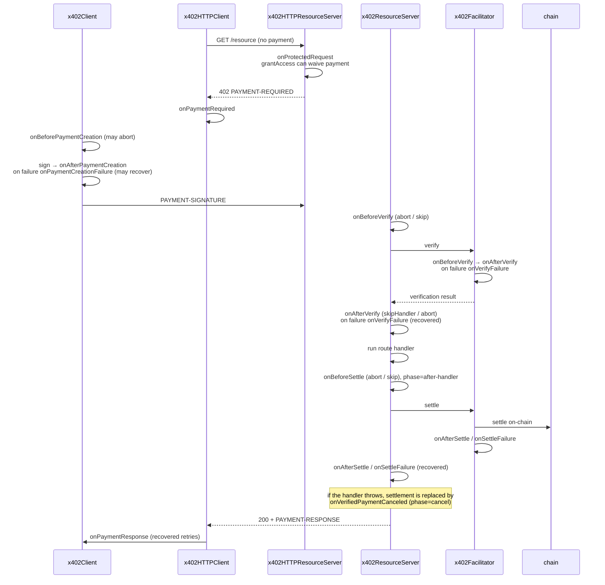
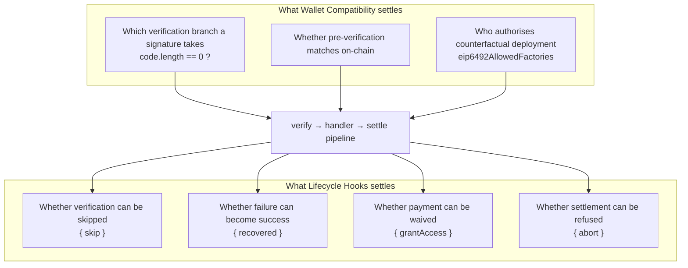

## Abstract

Two pages sit under Advanced Concepts in the x402 documentation. Lifecycle Hooks defines the extension points where code can be injected into a payment flow; Wallet Compatibility pins down, in a 5×5 table, which wallets work on which payment paths. They look like separate subjects and share one sentence: "x402 pre-verifies a payment signature before settling it on-chain. Pre-verification has to match what the on-chain contract does." Hooks are the doors into that verify-settle pipeline; the wallet table is the limit on what signatures the pipeline can carry. Hooks span six surfaces (resource server, HTTP server, client, HTTP client, facilitator, MCP), and because before-hooks may return `{abort}`/`{skip}` and failure-hooks `{recovered}`, server code can overturn a payment decision. In the wallet table, plain EOAs, deployed smart accounts and permissive 7702 delegates clear all five paths; counterfactual ERC-6492 wallets clear only the EIP-3009 paths; strict 7702 delegates clear none. The documentation puts both failures in footnotes: Permit2 calls the payer's `isValidSignature` at settlement and that path does not deploy the wallet first, and x402's `signTypedData` produces a raw 65-byte ECDSA signature that a strict delegate rejects. Counterfactual deployment is gated solely by the `eip6492AllowedFactories` allowlist, empty by default, because it is the only thing standing between settlement and an arbitrary factory call inside the settlement transaction.

## 1. Introduction

The x402 V2 announcement listed lifecycle hooks as a new capability: they "enable builders to inject custom logic at key points in the payment flow (e.g. before/after sending a payment, before/after settlement verification)"[^s05]. The same post formalised Extensions to make it "easier to experiment and extend x402 without the need to fork" and renamed the headers to `PAYMENT-SIGNATURE`, `PAYMENT-REQUIRED`, `PAYMENT-RESPONSE`[^s05]. The documentation index places the two pages side by side under Advanced Concepts: Lifecycle Hooks ("customize x402 payment flows") and Wallet Compatibility[^s03].

This site has already covered x402's schemes, payment flow, batch settlement, SIWX and EIP-2612 gas sponsoring. Between V1 and V2 the resource server became an `x402ResourceServer` built with a `.register()` pattern, and the headers were renamed[^s15]; hooks attach to that new object. What this report covers are the two layers on top: who may intervene in a payment flow, and which wallets can enter it at all.

## 2. Lifecycle Hooks

### 2.1 Six surfaces

Hooks are not in one place but six. The page introduces them as a way to "intercept and modify payment lifecycle events on clients, servers and facilitators"[^s01].



_Figure 1 — Where hooks fire during one paid request. The order is as the documentation describes it; each hook's return contract is in the sections below.[^s01][^s02][^s07]_

### 2.2 Resource server: seven hooks, four kinds of return

`x402ResourceServer` has seven: `onBeforeVerify` ("runs before payment verification"), `onAfterVerify` ("after successful verification"), `onVerifyFailure` ("on verification failure"), `onBeforeSettle` ("before settlement"), `onAfterSettle` ("after successful settlement"), `onSettleFailure` ("on settlement failure") and `onVerifiedPaymentCanceled` ("runs when a verified payment is not settled")[^s01].

What matters is not the names but the returns. The documented contract has four forms.

| Return | Available on | Effect |
|---|---|---|
| `{ abort: true, reason }` | onBeforeVerify, onAfterVerify, onBeforeSettle | Reject the payment |
| `{ skip: true, result }` | onBeforeVerify, onBeforeSettle | Bypass verification/settlement, use the given result |
| `{ skipHandler: true }` | onAfterVerify | Settle without invoking the handler |
| `{ recovered: true, result }` | onVerifyFailure, onSettleFailure | Override a failure with success |

`{ skip }` and `{ recovered }` route around verification itself. A server operator can declare "treat this payment as already verified" or "treat this settlement failure as if it had not happened." The documentation presents both as features and does not say when either is safe.

Settle hooks receive a `phase` context with values `before-handler`, `after-handler` and `cancel`[^s01]. The documentation's own example shows why the field exists:

```typescript
server.onAfterSettle(async (context) => {
  if (context.phase !== "after-handler") return;
  await sendReceipt({
    transaction: context.result.transaction,
    payer: context.result.payer,
  });
});
```

A receipt hook must fire only in the `after-handler` phase. The Go SDK states the reason more plainly: "Multi-settle flows (escrow) invoke settle lifecycle hooks once per settle. Authors of side-effecting beforeSettle / afterSettle hooks should branch on `SettleContext.Phase` when used with those flows"[^s07]. A hook written without that branch sends several receipts in an escrow scenario.

`onVerifiedPaymentCanceled` fills the gap x402's two-stage structure creates. In the Go SDK's words it is the hook "fired when a verified payment is canceled before settlement (handler error or non-2xx response)"[^s07]. A state genuinely exists in which the payment is verified, funds are authorised, and settlement never happens.

### 2.3 The other five surfaces

The **HTTP resource server** has one hook, `onProtectedRequest`, which runs on every request to a protected route. It can return `{ grantAccess: true }` to bypass payment, `{ abort: true, reason }` to return 403, or nothing and fall through to the payment flow[^s01]. There is, in other words, a payment-waiver switch inside the payment system.

The **client** has `onBeforePaymentCreation` (may abort), `onAfterPaymentCreation`, `onPaymentCreationFailure` (`{ recovered: true, payload }` for a fallback) and `onPaymentResponse` (`{ recovered: true }` to retry with a fresh payload)[^s01]. Here the documentation makes one explicit steer: "Use `spendControls` on the client config — it runs before hooks and is the preferred way to enforce spend limits"[^s01]. It heads off the obvious misuse before it happens. The **HTTP client**'s `onPaymentRequired` runs on a 402 and can return `{ headers }` to retry with different ones[^s01].

The **facilitator** mirrors the server's six hooks[^s01][^s07]. The use cases the documentation lists say what kind of surface this is: "populating a bazaar discovery catalog, compliance checks or collecting metrics across all processed payments"[^s01]. A facilitator handles payments for many resource servers, so a hook registered here sees every payment of every service using it.

The **MCP** wrappers have their own. Client side: `onPaymentRequired` (`{ abort: true }` or `{ payment }`), `onBeforePayment` ("after approval, before payload creation"), `onAfterPayment`. Server side: `onBeforeExecution` ("runs after payment verification, before the tool handler executes"; returning `false` aborts), `onAfterExecution` ("after the tool handler returns, before settlement") and `onAfterSettlement`[^s01].

### 2.4 SDK surface and real use

All three SDKs support method chaining[^s01]. The TypeScript examples repository's `hooks.ts` shows the shape, and its README summarises the six in one line each, "run before verification (can abort)", "run when verification fails (can recover)"[^s06]:

```typescript
.onBeforeVerify(async ctx => console.log("Verifying payment..."))
.onAfterSettle(async ctx => console.log("Settled:", ctx.result.transaction))
```

Go uses type names such as `BeforeVerifyHook`, `AfterSettleHook` and `FacilitatorBeforeVerifyHook`, passing `VerifyContext`/`SettleContext`[^s07]. The Python CHANGELOG records that 2.16.0 (17 July 2026) added that "after-verify hooks can abort with `after_verify_aborted` cleanup"[^s04]. The hook surface was not finished in one release; it is being filled in per SDK.

A concrete extension proposal exists. Issue #2299, 14 May 2026, proposes a trust-provider extension that scores behavioural trust in the `onBeforeSettle` hook: it "queries configured trust providers in parallel with per-provider timeouts", returns `{ abort: true, reason: 'trust_evaluation_failed' }` on FAIL to block settlement, and on UNCERTAIN either aborts or allows depending on a `failureMode` setting[^s08] _(unverified — single source)_. No maintainer response was visible; PR #2300 is referenced. What the proposal demonstrates is reach: an external reputation service can hold a veto over settlement without any protocol change.

## 3. Wallet Compatibility

### 3.1 The problem

Smart-contract wallet support is an old request. Issue #639, 13 November 2025, complained that x402 "does not fully support smart contract wallets, meta-transactions, account abstraction flows, or bundler/Paymaster models", because existing flows rely on "wallet signing of a payment payload, typically by an externally-owned account (EOA)"[^s09]. The Wallet Compatibility page is the current answer to that request.

The page starts from one sentence: "x402 pre-verifies a payment signature before settling it on-chain. Pre-verification has to match what the on-chain contract does"[^s16]. What it must match is the branch the token contract or Permit2 actually executes.

```solidity
if (signer.code.length == 0) {
  require(ecrecover(hash, sig) == signer);
} else {
  require(IERC1271(signer).isValidSignature(hash, sig) == 0x1626ba7e);
}
```

The documentation calls this "code routing"[^s16]. Code at the signer's address sends verification to ERC-1271; no code sends it to ecrecover. ERC-1271 exists because "Externally Owned Accounts (EOA) can sign messages with their associated private keys, but currently contracts cannot", and defines `isValidSignature(bytes32, bytes)` returning the magic value `0x1626ba7e` on success[^s11]. Permit2's implementation is exactly this shape: if `claimedSigner.code.length == 0` it uses ecrecover, otherwise it calls `IERC1271(claimedSigner).isValidSignature(hash, signature)` and reverts with `InvalidContractSignature()` on a wrong magic value[^s14]. Every wallet-compatibility problem comes out of this branch, when pre-verification cannot predict which side will be taken, or when the side taken on-chain fails.

### 3.2 The 5×5 table

Five wallet types, five paths[^s02].

| Wallet | `exact` EIP-3009 | `exact` Permit2 | `upto` Permit2 | `batch` deposit (ERC-3009) | `batch` deposit (Permit2) |
|---|:---:|:---:|:---:|:---:|:---:|
| **A** Plain EOA | ✅ | ✅ | ✅ | ✅ | ✅ |
| **B** Deployed smart account | ✅ | ✅ | ✅ | ✅ | ✅ |
| **C** ERC-6492 counterfactual | ✅ ¹ | ❌ ² | ❌ ² | ✅ ³ | ❌ ² |
| **D** 7702 + permissive delegate | ✅ | ✅ | ✅ | ✅ | ✅ |
| **E** 7702 + strict delegate | ❌ ⁴ | ❌ ⁴ | ❌ ⁴ | ❌ ⁴ | ❌ ⁴ |

The type definitions are verification paths. A is "raw ECDSA from the private key"; B (ERC-4337) is "EIP-1271 `isValidSignature` on the contract"; C (ERC-6492) is "EIP-1271 after the factory deploys it"; D is "EIP-1271 on the delegate, which accepts raw owner ECDSA"; E is "EIP-1271 on the delegate, which requires a wrapped or prefixed format"[^s02].

D versus E is the subtlest row pair in the table. Both are EOAs that delegated code under ERC-7702. EIP-7702 itself only defines writing a delegation indicator `(0xef0100 || address)` into the account's code; how signatures are verified is up to the delegate contract[^s13]. So the same user at the same address clears every path or none, depending on which delegate they run. It is the same axis as EIP-7702's own warning that "a poorly implemented delegate can allow a malicious actor to take near complete control over a signer's EOA"[^s13].

### 3.3 Why the two ❌ blocks exist

**Footnote 2 — counterfactual plus Permit2.** "Permit2's `permitWitnessTransferFrom` calls `isValidSignature` on the payer at settlement, and the Permit2 path does not deploy the wallet first"[^s02]. An undeployed address has no code, so Permit2's branch goes to ecrecover, and what arrives there is an ERC-6492-wrapped signature from which no key can be recovered. ERC-6492 exists to solve the problem that "if the contract is not deployed yet, ERC-1271 verification is impossible, as you can't call the `isValidSignature` function on said contract"; it appends the 32-byte magic `0x6492…6492` and prefixes `(create2Factory, factoryCalldata, originalERC1271Signature)` so a validator can deploy and then verify[^s10]. With nobody to run the deployment step, a 6492 signature is just an odd byte string.

**Footnote 4 — strict 7702 delegates.** "x402 signs with `signTypedData`, which produces a raw 65-byte ECDSA signature that a strict delegate rejects"[^s02]. The format the client produces and the format the delegate expects do not match. All five paths fail for the same reason because the problem is in signature creation, not in any scheme.

### 3.4 Two devices for counterfactual wallets

Type C is ✅ on the EIP-3009 paths because x402 performs the deployment itself. In the Python SDK 2.14.0 (26 June 2026) description, "the wallet is deployed and its signature validated together during verify"[^s04]. Unbounded, that would be dangerous, so the documentation gates it: "This requires the facilitator to set an allowlist of permitted factory addresses (`eip6492AllowedFactories`). Arbitrary factory calls are blocked by default to prevent attacker-controlled transaction injection"[^s02].

The Go SDK says the same thing at implementation level: "`EIP6492AllowedFactories` is the allowlist of factory contract addresses (hex strings, case-insensitive) that the facilitator will call when deploying an undeployed smart wallet via ERC-6492. A non-empty list enables ERC-4337 smart wallet deployment. An empty list (the default) denies all factory deployment calls", with error constants `ErrUndeployedSmartWallet`, `ErrSmartWalletDeploymentFailed` and `ErrFactoryNotAllowed`[^s17]. The Python CHANGELOG notes the parameter replaced the earlier boolean `deploy_erc4337_with_eip6492`, and that "settlement deploys an undeployed smart wallet if and only if its factory address is present in the allowlist"[^s04].

Batch settlement has a separate workaround. Per footnote 3, when a counterfactual payer uses an ERC-3009 deposit, "set `payerAuthorizer` to an EOA you control so the voucher verifies via ECDSA, while the deposit authorization is still signed by (and deploys) the smart wallet"[^s16]. Voucher signer and deposit authoriser are split apart. What that split means for the trust relationship is not discussed.

### 3.5 The part that depends on the token

Columns B and C hold only if the token contract accepts contract signatures, and the ERC-3009 text points the other way: "Please note that this ERC does not apply to smart contract accounts"[^s12]. The standard's `transferWithAuthorization` takes `v, r, s` and checks `EIP712.recover(...) == from`[^s12]. Implementations went further. Circle announced in USDC v2.2 (2023) that "USDC and EURC adopted EIP-1271 to allow authorized transfers to be used from a smart contract wallet in addition to a private key wallet", covering `permit`, `transferWithAuthorization`, `receiveWithAuthorization` and `cancelAuthorization`[^s18].

So x402's wallet table depends on the deployed token implementation as much as on the scheme. Against a pre-2.2 implementation, or a stablecoin that never added EIP-1271, columns B and C do not hold as printed. The documentation does not state this dependency.

## 4. Where the two pages meet



_Figure 2 — Wallet compatibility decides what can enter the pipeline; hooks decide how it is judged inside. Both rest on the same invariant, that pre-verification must match the chain.[^s01][^s02][^s16]_

That invariant is what Python SDK 2.14.0 set out to deliver: "pre-verification now mirrors on-chain signature checking, so a payment that passes verify is the same one that succeeds at settle"[^s04]. It matters because x402 separates verification from settlement in time. When a payment that passed verification fails at settlement, the route handler in between has already delivered the service.

And yet `{ skip }` and `{ recovered }` let code route around that very invariant. An `onBeforeVerify` returning `{ skip: true, result }` means verification never runs; an `onSettleFailure` returning `{ recovered: true, result }` means a failed settlement is recorded as a success[^s01]. The documentation introduces both features in their own sections and warns about neither in terms of the other.

## 5. Analysis

**The hook registration point is a new trust boundary.** Code that registers a hook can overturn a verification (`recovered`), skip one (`skip`), waive a payment (`grantAccess`) and refuse a settlement (`abort`)[^s01]. On a facilitator, that authority covers not one service but every service using it. The trust-provider proposal[^s08] is that authority handed to an external API. The protocol neither forbids it nor requires anything of it.

**The one thing the documentation does not answer is the one that matters in operation.** Execution order when several hooks are registered on the same event; behaviour when a hook throws; how conflicting return values resolve. These were looked for explicitly and are not on the page, which shows only a chaining example. For an extension point that can change payment outcomes, leaving those three undocumented is a gap.

**The ❌ cells are signature-format mismatches, not x402 defects.** Counterfactual plus Permit2 arises because ERC-6492 needs a deployment step that the Permit2 path lacks; strict 7702 arises because the format `signTypedData` produces is not the format the delegate demands[^s02]. The first is the kind of problem x402 already solved on the EIP-3009 path by doing the deployment, so it could be solved on the Permit2 path too. The second reaches into client-side signature creation and is deeper.

**The factory allowlist is the only gate, and its default is the safe one.** An empty list is the default and denies every deployment call[^s17]. A facilitator operator must add each trusted factory before counterfactual wallets work. The whole convenience-versus-security trade sits in one line of operator configuration, and widening it wrongly turns the settlement transaction into a path for deploying arbitrary contracts.

**The table is a claim, not a test.** No independent reproduction of the matrix was found. And as §3.5 shows, its conditions include the token implementation, for which the table has no column.

For an implementer the practical order is: establish the wallet type first, particularly which side of the 7702 delegate line users are on; if counterfactual wallets are in scope, settle the facilitator's factory allowlist before anything else; use hooks for observation (logging, metrics, receipts) first, and reach for `skip`/`recovered` only after the team has written down what they mean; and enforce spend limits with `spendControls`, not hooks[^s01].

## 6. Limitations

- Hook execution semantics (ordering, exceptions, conflicting returns) are absent from the documentation and were not found elsewhere. This report does not close that gap.
- The wallet-compatibility matrix is the documentation's own account of SDK behaviour; no independent verification exists.
- The trust-provider proposal (#2299) is single-source, with no maintainer response or merge status confirmed.
- No `@x402/core` CHANGELOG entry dating the TypeScript hook surface was located; dating relies on the Python CHANGELOG and the V2 announcement.
- `onVerifiedPaymentCanceled` is confirmed in the TS docs and the Go package; Python was not confirmed.
- Which hosted facilitators actually configure `eip6492AllowedFactories` could not be established from public material.
- Circle's v2.2 upgrade document in the repository contains no EIP-1271 text, so the company blog was used.
