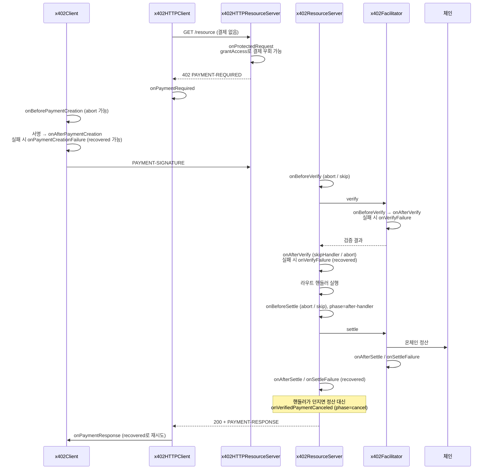
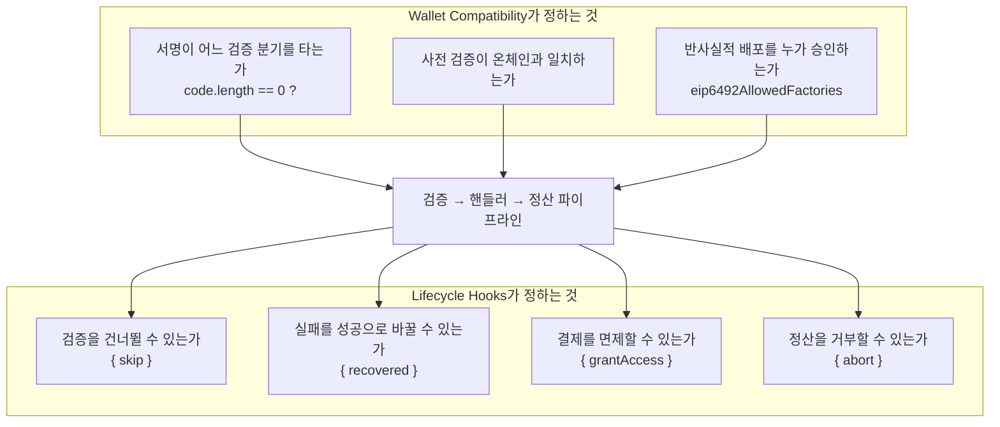

## 초록

x402 공식 문서의 Advanced Concepts에는 두 페이지가 있다. Lifecycle Hooks는 결제 흐름의 각 단계에 코드를 끼워 넣는 확장점을 정의하고, Wallet Compatibility는 어떤 지갑이 어떤 결제 경로에서 작동하는지를 5×5 표로 못박는다. 두 페이지는 서로 다른 것을 다루는 듯 보이지만 같은 문장을 공유한다. "x402는 온체인 정산 전에 결제 서명을 사전 검증한다. 사전 검증은 온체인 컨트랙트가 하는 것과 일치해야 한다." 훅은 그 검증-정산 파이프라인을 여는 문이고, 지갑 호환성 표는 그 파이프라인이 어떤 서명을 통과시킬 수 있는지의 한계다. 훅은 여섯 표면(리소스 서버, HTTP 서버, 클라이언트, HTTP 클라이언트, 페이실리테이터, MCP)에 걸쳐 있고 before 훅은 `{abort}`/`{skip}`, failure 훅은 `{recovered}`를 돌려줄 수 있어 서버 코드가 결제 판정을 뒤집을 수 있다. 지갑 표에서 EOA와 배포된 스마트 계정, 관대한 7702 위임은 다섯 경로를 모두 통과하고, 반사실적 ERC-6492 지갑은 EIP-3009 경로만, 엄격한 7702 위임은 아무 경로도 통과하지 못한다. 두 실패의 원인은 문서가 각주에 적었다. Permit2는 정산 시점에 payer의 `isValidSignature`를 부르는데 그 경로가 지갑을 먼저 배포하지 않고, x402의 `signTypedData`는 원시 65바이트 ECDSA를 만드는데 엄격 위임이 그 형식을 거부한다. 반사실적 배포는 `eip6492AllowedFactories` 허용목록이 유일한 게이트이며 기본값은 전면 차단인데, 그것이 "정산 트랜잭션 안에서 임의 팩토리를 호출하는" 것을 막는 유일한 방어선이기 때문이다.

## 1. 서론

x402 V2 발표문은 라이프사이클 훅을 새 기능으로 들었다. "빌더가 결제 흐름의 주요 지점에 커스텀 로직을 주입할 수 있게 한다(예: 결제 전송 전후, 정산 검증 전후)"[^s05]. 같은 발표가 확장(Extensions)을 "포크 없이 실험하고 확장하기 쉽게 만드는" 개념으로 공식화했고, 헤더를 `PAYMENT-SIGNATURE`, `PAYMENT-REQUIRED`, `PAYMENT-RESPONSE`로 바꿨다[^s05]. 문서 색인은 이 둘을 Advanced Concepts 아래 나란히 둔다. Lifecycle Hooks("x402 결제 흐름 커스터마이즈")와 Wallet Compatibility[^s03].

이 사이트는 x402의 스킴, 결제 흐름, 배치 정산, SIWX, EIP-2612 가스 스폰서링을 이미 다뤘다. V1에서 V2로 오며 리소스 서버는 `.register()` 빌더 패턴의 `x402ResourceServer`가 됐고 헤더 이름도 바뀌었는데[^s15], 훅은 그 새 객체에 붙는다. 이 보고서가 다루는 것은 그 위에 얹히는 두 층이다. 누가 결제 흐름에 개입할 수 있는가, 그리고 어떤 지갑이 애초에 그 흐름에 들어올 수 있는가.

## 2. Lifecycle Hooks

### 2.1 여섯 표면

훅은 한 곳이 아니라 여섯 군데에 있다. 문서는 이를 "클라이언트, 서버, 페이실리테이터에서 결제 라이프사이클 이벤트를 가로채고 수정"하는 것으로 소개한다[^s01].



_그림 1 — 한 번의 유료 요청에서 훅이 발동하는 지점. 화살표는 문서가 기술한 순서이며, 각 훅의 반환 계약은 그 아래 절에 있다.[^s01][^s02][^s07]_

### 2.2 리소스 서버: 일곱 훅과 네 종류의 반환

`x402ResourceServer`의 훅은 일곱 개다. `onBeforeVerify`("결제 검증 전에 실행"), `onAfterVerify`("성공적 검증 후"), `onVerifyFailure`("검증 실패 시"), `onBeforeSettle`("정산 전"), `onAfterSettle`("성공적 정산 후"), `onSettleFailure`("정산 실패 시"), 그리고 `onVerifiedPaymentCanceled`("검증된 결제가 정산되지 않을 때")[^s01].

중요한 것은 이름이 아니라 반환값이다. 문서가 정의한 계약은 네 가지다.

| 반환 | 가능한 훅 | 효과 |
|---|---|---|
| `{ abort: true, reason }` | onBeforeVerify, onAfterVerify, onBeforeSettle | 결제를 거부 |
| `{ skip: true, result }` | onBeforeVerify, onBeforeSettle | 검증/정산을 건너뛰고 주어진 결과를 사용 |
| `{ skipHandler: true }` | onAfterVerify | 핸들러를 호출하지 않고 정산 |
| `{ recovered: true, result }` | onVerifyFailure, onSettleFailure | 실패를 성공으로 덮어씀 |

`{ skip }`과 `{ recovered }`는 결제 검증 자체를 우회한다. 서버 운영자가 "이 결제는 이미 검증됐다고 치자" 또는 "이 정산 실패는 없던 일로 하자"라고 선언할 수 있다는 뜻이다. 문서는 이를 기능으로 제시하며, 어떤 경우에 안전한지는 말하지 않는다.

정산 훅은 `phase` 컨텍스트를 받는다. 값은 `before-handler`, `after-handler`, `cancel` 셋이다[^s01]. 문서의 예제가 이를 쓰는 방식이 이 필드의 존재 이유를 보여준다.

```typescript
server.onAfterSettle(async (context) => {
  if (context.phase !== "after-handler") return;
  await sendReceipt({
    transaction: context.result.transaction,
    payer: context.result.payer,
  });
});
```

영수증을 보내는 훅은 `after-handler` 단계에서만 동작해야 한다. Go SDK 문서가 그 이유를 더 분명히 적는다. "다중 정산 흐름(에스크로)은 정산 라이프사이클 훅을 정산마다 한 번씩 호출한다. 부작용이 있는 beforeSettle / afterSettle 훅의 작성자는 그런 흐름과 함께 쓸 때 `SettleContext.Phase`로 분기해야 한다"[^s07]. 즉 phase를 무시하고 쓴 훅은 에스크로 시나리오에서 영수증을 여러 번 보낸다.

`onVerifiedPaymentCanceled`는 x402의 두 단계 구조가 만드는 틈을 메운다. Go SDK의 표현으로 "검증된 결제가 정산 전에 취소될 때(핸들러 오류 또는 2xx 아닌 응답) 발동하는 훅"이다[^s07]. 결제는 검증됐고 자금은 인가됐는데 정산은 일어나지 않은 상태가 실제로 존재한다.

### 2.3 나머지 다섯 표면

**HTTP 리소스 서버**에는 `onProtectedRequest` 하나가 있고, 보호된 라우트의 모든 요청에서 실행된다. `{ grantAccess: true }`로 결제를 건너뛰거나, `{ abort: true, reason }`으로 403을 반환하거나, 아무것도 반환하지 않고 결제 흐름으로 넘길 수 있다[^s01]. 결제 시스템 안에 결제를 면제하는 스위치가 있는 셈이다.

**클라이언트**에는 `onBeforePaymentCreation`(abort 가능), `onAfterPaymentCreation`, `onPaymentCreationFailure`(`{ recovered: true, payload }`로 대체 페이로드), `onPaymentResponse`(`{ recovered: true }`로 새 페이로드 재시도)가 있다[^s01]. 문서는 여기서 한 가지를 명시적으로 권한다. "지출 한도 강제에는 클라이언트 설정의 `spendControls`를 쓰라 — 그것은 훅보다 먼저 실행되며 선호되는 방법이다"[^s01]. 훅으로 지출을 막으려는 시도를 문서가 먼저 막아둔 것이다. **HTTP 클라이언트**의 `onPaymentRequired`는 402를 받았을 때 실행되며 `{ headers }`로 다른 헤더를 써서 재시도할 수 있다[^s01].

**페이실리테이터**는 서버의 여섯 훅을 그대로 미러링한다[^s01][^s07]. 문서가 드는 용도가 이 표면의 성격을 말해준다. "bazaar 디스커버리 카탈로그 채우기, 컴플라이언스 검사, 처리된 모든 결제에 걸친 메트릭 수집"[^s01]. 페이실리테이터는 여러 리소스 서버의 결제를 대신 처리하므로, 여기 붙은 훅은 한 서비스가 아니라 그 페이실리테이터를 쓰는 모든 서비스의 결제를 본다.

**MCP** 래퍼에는 별도 훅이 있다. 클라이언트 쪽은 `onPaymentRequired`(`{ abort: true }` 또는 `{ payment }`), `onBeforePayment`("승인 후, 페이로드 생성 전"), `onAfterPayment`. 서버 쪽은 `onBeforeExecution`("결제 검증 후 도구 핸들러 실행 전"에 실행되며 `false`를 반환하면 중단), `onAfterExecution`("도구 핸들러 반환 후, 정산 전"), `onAfterSettlement`[^s01].

### 2.4 SDK 표면과 실제 사용

세 SDK 모두 메서드 체이닝을 지원한다[^s01]. TypeScript 예제 저장소의 `hooks.ts`가 그 형태를 보여주며, 같은 README가 여섯 훅을 "검증 전 실행(중단 가능)", "검증 실패 시 실행(복구 가능)" 식으로 한 줄씩 요약한다[^s06].

```typescript
.onBeforeVerify(async ctx => console.log("Verifying payment..."))
.onAfterSettle(async ctx => console.log("Settled:", ctx.result.transaction))
```

Go는 `BeforeVerifyHook`, `AfterSettleHook`, `FacilitatorBeforeVerifyHook` 같은 타입 이름을 쓰고 `VerifyContext`/`SettleContext`를 넘긴다[^s07]. Python SDK CHANGELOG는 2.16.0(2026-07-17)에서 "after-verify 훅이 `after_verify_aborted` 정리와 함께 중단할 수 있다"를 추가했다고 적는다[^s04]. 훅 표면이 한 번에 완성된 것이 아니라 SDK별로 채워지는 중이라는 뜻이다.

실제 확장 제안도 나왔다. 2026년 5월 14일 이슈 #2299는 `onBeforeSettle` 훅으로 행동 기반 신뢰 점수를 매기는 trust-provider 확장을 제안한다. "`onBeforeSettle` 훅: 설정된 신뢰 제공자를 제공자별 타임아웃과 함께 병렬 조회"하고, FAIL이면 `{ abort: true, reason: 'trust_evaluation_failed' }`를 반환해 정산을 막고, UNCERTAIN이면 `failureMode` 설정에 따라 fail-closed로 중단하거나 fail-open으로 통과시킨다[^s08] _(unverified — single source)_. 메인테이너 응답은 확인되지 않았고 PR #2300이 참조돼 있다. 이 제안이 보여주는 것은 훅의 도달 범위다. 외부 평판 서비스가 결제 정산에 거부권을 갖는 구조가 프로토콜 수정 없이 가능하다.

## 3. Wallet Compatibility

### 3.1 문제 설정

스마트 컨트랙트 지갑 지원은 오래된 요청이다. 2025년 11월 13일 이슈 #639는 x402가 "스마트 컨트랙트 지갑, 메타 트랜잭션, 계정 추상화 흐름, 번들러/페이마스터 모델을 온전히 지원하지 않는다"며, 기존 흐름이 "보통 외부 소유 계정(EOA)에 의한 결제 페이로드 서명에 의존한다"고 지적했다[^s09]. Wallet Compatibility 페이지는 그 요청에 대한 현재 시점의 답이다.

이 페이지는 한 문장에서 출발한다. "x402는 온체인에서 정산하기 전에 결제 서명을 사전 검증한다. 사전 검증은 온체인 컨트랙트가 하는 것과 일치해야 한다"[^s16]. 일치해야 하는 대상은 토큰 컨트랙트나 Permit2가 실제로 실행하는 분기다.

```solidity
if (signer.code.length == 0) {
  require(ecrecover(hash, sig) == signer);
} else {
  require(IERC1271(signer).isValidSignature(hash, sig) == 0x1626ba7e);
}
```

문서는 이 패턴을 "코드 라우팅"이라 부른다[^s16]. 서명자 주소에 코드가 있으면 ERC-1271로, 없으면 ecrecover로 간다. ERC-1271은 "EOA는 개인키로 메시지에 서명할 수 있지만 컨트랙트는 그럴 수 없다"는 문제를 풀려고 `isValidSignature(bytes32, bytes)`가 통과 시 매직값 `0x1626ba7e`를 반환하게 정의한 표준이다[^s11]. Permit2의 실제 구현이 정확히 이 모양이다. `claimedSigner.code.length == 0`이면 ecrecover, 아니면 `IERC1271(claimedSigner).isValidSignature(hash, signature)`를 호출하고 매직값이 다르면 `InvalidContractSignature()`로 되돌린다[^s14]. 지갑 호환성 문제는 전부 이 분기에서 나온다. 사전 검증이 어느 가지를 탈지 예측하지 못하거나, 온체인에서 탈 가지가 실패하면 결제가 깨진다.

### 3.2 5×5 표

문서는 지갑을 다섯 유형으로, 경로를 다섯으로 나눈다[^s02].

| 지갑 | `exact` EIP-3009 | `exact` Permit2 | `upto` Permit2 | `batch` 예치(ERC-3009) | `batch` 예치(Permit2) |
|---|:---:|:---:|:---:|:---:|:---:|
| **A** 평범한 EOA | ✅ | ✅ | ✅ | ✅ | ✅ |
| **B** 배포된 스마트 계정 | ✅ | ✅ | ✅ | ✅ | ✅ |
| **C** ERC-6492 반사실적 | ✅ ¹ | ❌ ² | ❌ ² | ✅ ³ | ❌ ² |
| **D** 7702 + 관대한 위임 | ✅ | ✅ | ✅ | ✅ | ✅ |
| **E** 7702 + 엄격한 위임 | ❌ ⁴ | ❌ ⁴ | ❌ ⁴ | ❌ ⁴ | ❌ ⁴ |

유형 정의는 서명 검증 경로로 갈린다. A는 "개인키에서 나온 원시 ECDSA", B(ERC-4337)는 "컨트랙트의 EIP-1271 `isValidSignature`", C(ERC-6492)는 "팩토리가 배포한 뒤의 EIP-1271", D는 "위임체의 EIP-1271인데 원시 소유자 ECDSA를 받아들임", E는 "위임체의 EIP-1271인데 감싸거나 접두사가 붙은 형식을 요구함"이다[^s02].

D와 E의 차이가 이 표에서 가장 미묘하다. 둘 다 ERC-7702로 코드를 위임한 EOA다. EIP-7702 자체는 위임 지정자 `(0xef0100 || address)`를 계정 코드에 쓰는 것만 정의하고, 서명 검증 방식은 위임 대상 컨트랙트가 정한다[^s13]. 그래서 같은 사용자의 같은 주소가 어떤 위임체를 쓰느냐에 따라 모든 경로를 통과하거나 하나도 통과하지 못한다. EIP-7702의 보안 고려사항이 "잘못 구현된 위임체는 악의적 행위자가 서명자의 EOA를 거의 완전히 장악하게 할 수 있다"고 경고하는 것과 같은 축이다[^s13].

### 3.3 두 개의 ❌가 생기는 이유

**각주 2 — 반사실적 지갑 + Permit2.** "Permit2의 `permitWitnessTransferFrom`은 정산 시점에 payer의 `isValidSignature`를 호출하는데, Permit2 경로는 지갑을 먼저 배포하지 않는다"[^s02]. 배포되지 않은 주소에는 코드가 없으므로 Permit2의 분기는 ecrecover 쪽으로 가고, 거기 들어온 것은 ERC-6492로 감싼 서명이라 복구가 실패한다. ERC-6492는 "컨트랙트가 아직 배포되지 않았으면 ERC-1271 검증이 불가능하다. 그 컨트랙트의 `isValidSignature`를 호출할 수 없기 때문"이라는 문제를 풀기 위해 서명 뒤에 32바이트 매직값 `0x6492…6492`를 붙이고 `(create2Factory, factoryCalldata, originalERC1271Signature)`를 앞에 실어 검증자가 배포 후 검증하게 한다[^s10]. 그 배포 단계를 실행하는 주체가 없으면 6492 서명은 그냥 이상한 바이트열이다.

**각주 4 — 엄격한 7702 위임.** "x402는 `signTypedData`로 서명하며, 이는 엄격한 위임체가 거부하는 원시 65바이트 ECDSA 서명을 만든다"[^s02]. 클라이언트가 만드는 서명 형식과 위임체가 기대하는 형식이 어긋난다. 표의 다섯 경로 전부가 같은 이유로 막히는 것은 문제가 스킴이 아니라 서명 생성 단계에 있기 때문이다.

### 3.4 반사실적 지갑을 위한 두 가지 장치

C 유형이 EIP-3009 경로에서 ✅인 것은 x402가 배포를 직접 수행하기 때문이다. Python SDK 2.14.0(2026-06-26)의 설명으로 "지갑이 배포되고 그 서명이 verify 도중에 함께 검증된다"[^s04]. 그 권한이 무제한이면 위험하므로 문서가 게이트를 둔다. "페이실리테이터가 허용된 팩토리 주소 목록(`eip6492AllowedFactories`)을 설정해야 한다. 임의의 팩토리 호출은 공격자가 제어하는 트랜잭션 주입을 막기 위해 기본적으로 차단된다"[^s02].

Go SDK 문서가 구현 수준에서 같은 것을 적는다. "`EIP6492AllowedFactories`는 페이실리테이터가 ERC-6492로 배포되지 않은 스마트 지갑을 배포할 때 호출할 팩토리 컨트랙트 주소의 허용목록(16진 문자열, 대소문자 무시)이다. 비어 있지 않은 목록은 ERC-4337 스마트 지갑 배포를 활성화한다. 빈 목록(기본값)은 모든 팩토리 배포 호출을 거부한다." 에러 상수로 `ErrUndeployedSmartWallet`, `ErrSmartWalletDeploymentFailed`, `ErrFactoryNotAllowed`가 있다[^s17]. Python CHANGELOG는 이 파라미터가 이전의 불리언 `deploy_erc4337_with_eip6492`를 대체했으며 "정산은 팩토리 주소가 허용목록에 있을 때에만 배포되지 않은 스마트 지갑을 배포한다"고 적는다[^s04].

배치 정산에는 별도 우회로가 있다. 각주 3의 내용으로, 반사실적 payer가 ERC-3009 예치를 쓸 때 "`payerAuthorizer`를 당신이 제어하는 EOA로 설정해 바우처가 ECDSA로 검증되게 하고, 예치 인가는 여전히 스마트 지갑이 서명(하고 배포)하게 하라"[^s16]. 바우처 서명 주체와 예치 인가 주체를 분리하는 방식이다. 문서는 이 분리가 신뢰 관계에 무엇을 의미하는지는 말하지 않는다.

### 3.5 토큰 구현에 달린 부분

표의 B·C 열이 성립하려면 토큰 컨트랙트가 컨트랙트 서명을 받아야 한다. ERC-3009 표준 문서는 명시적으로 반대 방향을 가리킨다. "이 ERC는 스마트 컨트랙트 계정에는 적용되지 않는다"[^s12]. 표준의 `transferWithAuthorization`은 `v, r, s`를 받아 `EIP712.recover(...) == from`을 확인한다[^s12]. 구현이 이를 넘어섰다. Circle은 2023년 USDC v2.2에서 "USDC와 EURC가 EIP-1271을 채택해 개인키 지갑뿐 아니라 스마트 컨트랙트 지갑에서도 인가된 전송을 쓸 수 있게 했다"고 발표했고, 대상 함수에 `permit`, `transferWithAuthorization`, `receiveWithAuthorization`, `cancelAuthorization`이 들어간다[^s18].

따라서 x402의 지갑 표는 스킴만이 아니라 배포된 토큰 구현에 의존한다. v2.2 이전 구현이나 EIP-1271을 넣지 않은 다른 스테이블코인에서는 B·C 열이 그대로 성립하지 않는다. 문서는 이 의존성을 적지 않는다.

## 4. 두 페이지가 만나는 지점



_그림 2 — 지갑 호환성은 파이프라인에 무엇이 들어올 수 있는지를, 훅은 파이프라인 안에서 그것이 어떻게 판정되는지를 정한다. 둘 다 "사전 검증은 온체인과 일치해야 한다"는 같은 불변식 위에 있다.[^s01][^s02][^s16]_

Python SDK 2.14.0이 내건 목표가 그 불변식이다. "사전 검증이 이제 온체인 서명 검사를 미러링하므로, verify를 통과한 결제는 settle에서 성공하는 바로 그 결제다"[^s04]. 이 불변식이 중요한 이유는 x402가 검증과 정산을 시간적으로 분리하기 때문이다. 검증에서 통과한 결제가 정산에서 실패하면, 그 사이에 실행된 라우트 핸들러는 이미 서비스를 제공한 뒤다.

그런데 훅의 `{ skip }`과 `{ recovered }`는 바로 그 불변식을 코드로 우회할 수 있게 한다. `onBeforeVerify`가 `{ skip: true, result }`를 반환하면 검증 자체가 일어나지 않고, `onSettleFailure`가 `{ recovered: true, result }`를 반환하면 실패한 정산이 성공으로 기록된다[^s01]. 문서는 두 기능을 각각의 절에서 소개할 뿐 서로에 대해 경고하지 않는다.

## 5. 분석

**훅 등록 지점이 새 신뢰 경계다.** 훅을 등록한 코드는 검증 결과를 뒤집고(`recovered`), 검증을 건너뛰고(`skip`), 결제를 면제하고(`grantAccess`), 정산을 거부할(`abort`) 수 있다[^s01]. 페이실리테이터 훅의 경우 그 권한이 한 서비스가 아니라 그 페이실리테이터를 쓰는 모든 서비스에 미친다. trust-provider 제안[^s08]은 이 권한을 외부 API에 넘기는 형태다. 프로토콜은 이를 막지도 요구하지도 않는다.

**문서가 답하지 않는 한 가지가 운영에서 가장 중요하다.** 같은 이벤트에 훅을 여러 개 등록했을 때 실행 순서, 훅이 예외를 던졌을 때의 동작, 두 훅의 반환값이 충돌할 때의 해석. 명시적으로 찾았으나 페이지에 없다. 체이닝 예제만 있을 뿐이다. 결제 판정을 바꿀 수 있는 확장점에서 이 세 가지가 문서화되지 않은 것은 공백이다.

**지갑 표의 ❌는 x402의 결함이 아니라 서명 형식의 불일치다.** 반사실적 + Permit2는 ERC-6492가 배포 단계를 요구하는데 Permit2 경로에 그 단계가 없어서 생기고, 엄격한 7702는 `signTypedData`가 만드는 형식과 위임체가 요구하는 형식이 달라서 생긴다[^s02]. 전자는 x402가 배포를 EIP-3009 경로에 넣어 이미 해결했으므로 Permit2 경로에도 넣을 수 있는 성질의 문제다. 후자는 클라이언트 서명 생성부를 고쳐야 하므로 더 깊다.

**팩토리 허용목록은 유일한 게이트이고 기본값이 안전한 쪽이다.** 빈 목록이 기본이고 그것은 모든 배포 호출을 거부한다[^s17]. 페이실리테이터 운영자가 신뢰하는 팩토리를 하나씩 넣어야 반사실적 지갑이 작동한다. 편의와 보안의 교환이 운영자 설정 한 줄에 응축돼 있고, 잘못 넓히면 정산 트랜잭션이 임의 컨트랙트 배포의 통로가 된다.

**표는 테스트가 아니라 문서의 주장이다.** 이 매트릭스를 독립적으로 재현한 제3자 보고는 찾지 못했다. 그리고 §3.5에서 보았듯 표의 성립 조건에는 토큰 구현이 들어가는데 표에는 그 열이 없다.

구현자에게 실용적인 순서는 이렇다. 지갑 유형부터 확인한다(특히 7702 위임체가 어느 쪽인지). 반사실적 지갑을 받을 것이면 페이실리테이터의 팩토리 허용목록을 먼저 합의한다. 훅은 관측(로깅·메트릭·영수증)부터 쓰고, `skip`/`recovered`는 그 의미를 팀이 문서화한 뒤에만 쓴다. 지출 한도는 훅이 아니라 `spendControls`로 한다[^s01].

## 6. 한계

- 훅 실행 의미론(순서, 예외, 반환값 충돌)은 문서에 없고 다른 곳에서도 찾지 못했다. 이 보고서는 그 공백을 메우지 못했다.
- 지갑 호환성 매트릭스는 문서의 자기 서술이며 독립 검증 사례가 없다.
- trust-provider 확장 제안(#2299)은 단일 출처이고 메인테이너 응답이나 병합 여부를 확인하지 못했다.
- TypeScript `@x402/core`의 훅 도입 시점을 특정하는 CHANGELOG 항목을 찾지 못해, 시점은 Python CHANGELOG와 V2 발표문에 의존한다.
- `onVerifiedPaymentCanceled`는 TS 문서와 Go 패키지에서 확인했고 Python은 확인하지 못했다.
- 어떤 호스팅 페이실리테이터가 `eip6492AllowedFactories`를 실제로 설정했는지는 공개 자료에서 확인하지 못했다.
- Circle 저장소의 v2.2 업그레이드 문서에는 EIP-1271 서술이 없어 회사 블로그를 썼다.
